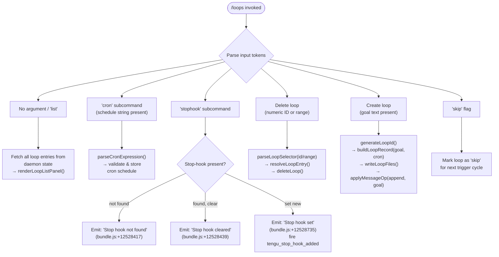

# `/loops`

> Analysis basis: CC v2.1.187 bundle.js (AST extraction + Claude interpretation)
> Minimum version: v2.1.187

---

## Overview

The `/loops` command provides a terminal UI for listing, creating, and deleting **background agent loops** — scheduled or persistent Claude Code sessions that run autonomously (daemon-backed). It is a `local-jsx` command that renders an interactive JSX panel directly within the CLI, letting users inspect current loop state (cron schedules, stop hooks, goal text) and perform lifecycle operations (create loop, delete loop, modify stop hook) without leaving the REPL.

---

## Registration

| Field | Value |
|---|---|
| type | `local-jsx` |
| name | `loops` |
| description | `List, create, and delete loops` |
| loc_byte | `12529008` |
| loc_byte_end | `12529165` |
| loc_line | `8548` |
| immediate | `true` |
| module_id | `hMl` |
| load_inline | `true` |
| arbor_handler.name | `ogf` |
| arbor_handler.fqn | `claude-2.1.187::ogf` |
| arbor_handler.kind | `AsyncFunction` |
| arbor_handler.resolution_path | `module_id` |
| arbor_handler.n_hits | `0` |

Analysis basis: CC v2.1.187 bundle.js:+12529008

---

## Input Branching

The handler inspects the user's input string and dispatches to one of several distinct operations. Five or more recognised sub-commands are visible in the literals and callGraph, so a flowchart is used.



Analysis basis: CC v2.1.187 bundle.js:+12528021 – +12528874

---

## Behavioral Spec

### 1. Handler Entry Point — `loopsCommandHandler` (`ogf`)

```
async function loopsCommandHandler(context):
    emit telemetry("tengu_loops_command")          // bundle.js:+12527975
    appState = context.getAppState()               // bundle.js:+12528025
    loopMap  = buildLoopDisplayMap(appState)       // zft → ARe, j6a
    entries  = loopMap.map(formatLoopEntry)        // bundle.js:+12528053
    input    = context.input.trim()

    subcommand = detectSubcommand(input)           // rgf, xD

    switch subcommand:
        case "list" / empty:
            return renderLoopListJSX(entries, context)  // gMl.jsx
        case "cron":
            return handleCronSubcommand(input, context)
        case "stophook":
            return handleStophookSubcommand(input, context)
        case "delete" / numeric-id:
            return handleDeleteLoop(input, context)
        case "create" / goal text:
            return handleCreateLoop(input, context)
        case "skip":
            return handleSkipLoop(input, context)
```

Analysis basis: CC v2.1.187 bundle.js:+12528021

---

### 2. Loop List Construction — `buildLoopDisplayMap` (`zft`)

```
function buildLoopDisplayMap(appState):
    raw = readDaemonLoopState(appState)            // ARe → o.set
    formatted = raw.map(entry =>                   // j6a → e.map
        padEntry(entry.name, columnWidth=40)       // bundle.js:+17224668
    )
    return formatted                               // separator: "  " (bundle.js:+17222694)
```

Analysis basis: CC v2.1.187 bundle.js:+10646369

---

### 3. Loop State Reading — `readLoopStateFile` (`Rrt`)

```
async function readLoopStateFile(loopDir):
    configPath = buildConfigPath(loopDir)          // nge → Fwn.join, ic → VL
    rawText    = await fs.readFile(configPath, "utf-8")  // bundle.js:+4928004
    parsed     = parseLoopConfig(rawText)          // ke → fo, nt, Vi, Qru
    if Array.isArray(parsed):
        return normalizeArray(parsed)              // bundle.js:+4928120
    tokens = tokeniseConfig(parsed)                // T → gOe, Xwc, Me, wc
    return { configItems: tokens, rawText }
```

File-system errors recognised: `ENOENT`, `EACCES`, `EPERM`, `ENOTDIR`, `ELOOP`, `ENAMETOOLONG`, `EROFS`
(bundle.js:+183670 – +183759)

Analysis basis: CC v2.1.187 bundle.js:+4927957

---

### 4. Cron Schedule Parsing — `parseCronExpression` (`xD`)

```
function parseCronExpression(input):
    trimmed = input.trim()                         // bundle.js:+4925748
    if trimmed.match(/every minute/i):             // literal "Every minute" bundle.js:+4925868
        return cronSpec { minutes: "*", ... }
    if trimmed.match(/every hour/i):               // literal "Every hour"   bundle.js:+4926085
        return cronSpec { minutes: 0, hours: "*", ... }
    if trimmed.match(rangePattern "1-5"):          // bundle.js:+4926792
        parts = parseRangeSegments(trimmed)
    m = parseInt(matchGroup, 10)                   // bundle.js:+4925924
    validate(m, maxMinute=59, maxHour=23,          // bundle.js:+12527740, +12527811
             maxDom=31, maxMonth=12)               // bundle.js:+12527864
    // UTC day-of-week normalisation
    date.setUTCDate / getUTCDate / setUTCHours / getDay  // bundle.js:+4926625..4926704
    return normalisedCronSpec
```

Cron field limits observed in literals:
- Minutes: max `59` (bundle.js:+12527740)
- Hours: max `23` (bundle.js:+12527811)
- Day-of-month: max `31` (bundle.js:+12527864)
- Column widths used: `60` (bundle.js:+12527706)

Analysis basis: CC v2.1.187 bundle.js:+4925748

---

### 5. Loop Creation — `createLoop` (`xrt`)

```
async function createLoop(goalText, cronSpec, context):
    id        = crypto.randomUUID()                // L3i.randomUUID bundle.js:+4929304
    timestamp = Date.now()                         // bundle.js:+4929366
    loopDir   = resolveLoopDirectory(id)           // Kde
    record    = {
        id, goal: goalText, cron: cronSpec,
        createdAt: timestamp,
        type: "cron"                               // bundle.js:+12528071
    }
    writeLoopFiles(loopDir, record)                // rOt → Uwn.writeFile, Fwn.join
    //  writes to: <cwd>/.claude/ directory       // bundle.js:+4929145
    updateDaemonRoster(record)                     // kt
    loadDaemonStatus(record)                       // SQ → daemon.status.json
    emit appState.applyMessageOp("append", {       // Yft bundle.js:+10647371
        type: "attachment",                        // bundle.js:+10647504
        role: "system",                            // bundle.js:+12528306
        content: goalText
    })
    emit telemetry("tengu_stop_hook_added")        // if stop-hook also set
```

Analysis basis: CC v2.1.187 bundle.js:+4929304

---

### 6. Stop-Hook Management — `manageStophook` (`Yft` / `jft`)

```
async function manageStophook(action, hookText, context):
    state = context.getAppState()                  // bundle.js:+10647173
    existingHook = state.stophook

    if action == "clear":
        if not existingHook:
            return message("Stop hook not found")  // bundle.js:+12528417
        context.setAppState({ stophook: null })
        return message("Stop hook cleared")        // bundle.js:+12528439

    if action == "set":
        // trust_gate check                        // bundle.js:+10646620
        // hooks_gate check                        // bundle.js:+10646566
        newHook = {
            type:    "prompt",                     // bundle.js:+10646484
            content: hookText,
            goalStatus: "goal_status"              // bundle.js:+10647591
        }
        context.setAppState({ stophook: newHook })
        emit telemetry("tengu_stop_hook_added")    // bundle.js:+10647056
        addSystemMessage(context, "goal", hookText) // bundle.js:+10647462
        return message("Stop hook set")            // bundle.js:+12528735

    if action == "remove":
        emit telemetry("tengu_stop_hook_removed")  // bundle.js:+10647428
        context.setAppState({ stophook: null })
```

Analysis basis: CC v2.1.187 bundle.js:+10647162

---

### 7. Loop Deletion — `deleteLoop` (`pae` + `x3o`)

```
async function deleteLoop(selector, context):
    allLoops  = listAllLoops(context)              // Rrt → readLoopStateFile
    matching  = filterBySelector(allLoops, selector) // pae → r.filter, n.has
    if matching.empty:
        return error("Loop not found")

    for loop in matching:
        loopPath = resolveLoopPath(loop)           // ec → py.join, Vk
        await fs.rm(loopPath, { recursive: true }) // qm.rm bundle.js:+17202387
        updateRosterEntry(loop, status="killed")   // "killed" bundle.js:+17202315
        // state transitions tracked:
        //   "done"    bundle.js:+17202297
        //   "failed"  bundle.js:+17202334
        //   "crashed" bundle.js:+17202481
        //   "blocked" bundle.js:+17202535
```

Analysis basis: CC v2.1.187 bundle.js:+4929683

---

### 8. Loop List File Scanner — `scanLoopFiles` (`fCd`)

```
async function scanLoopFiles(loopRootDir):
    entries   = await fs.readdir(loopRootDir)      // bundle.js:+4301583
    statted   = await Promise.all(
                    entries.map(e => fs.lstat(join(loopRootDir, e)))
                )                                   // bundle.js:+4301714
    dirs      = statted.filter(s => s.isDirectory())
    files     = []
    for dir in dirs:
        inner = fs.lstat(join(dir, "pins.json"))   // "pins.json" bundle.js:+4301182
        if inner.isFile():
            files.push(join(dir, "pins.json"))
        else:
            recurse(dir)                           // $1i → kn → cn
    return files
```

Analysis basis: CC v2.1.187 bundle.js:+4301583

---

### 9. JSX Rendering — `renderLoopsPanel` (via `gMl.jsx`)

```
function renderLoopsPanel(loopEntries, context):
    // Renders interactive JSX list of loops (bundle.js:+12528778)
    // Each entry shows: id, cron, goal summary, status
    // Status values visible in literals:
    //   "active"   bundle.js:+4307874
    //   "idle"     bundle.js:+17203453
    //   "working"  bundle.js:+17202849
    //   "bg"       bundle.js:+17203013
    //   "daemon"   bundle.js:+17203338
    //   "unknown"  bundle.js:+4300072
    //   "resuming" bundle.js:+17204431
    return <LoopsPanel entries={loopEntries} onSelect={handleAction} />
```

Analysis basis: CC v2.1.187 bundle.js:+12528778

---

## State & Side Effects

| Item | Detail |
|---|---|
| Telemetry: `tengu_loops_command` | Fired on every `/loops` invocation (bundle.js:+12527975) |
| Telemetry: `tengu_stop_hook_added` | Fired when a stop hook is successfully registered (bundle.js:+10647056) |
| Telemetry: `tengu_stop_hook_removed` | Fired when a stop hook is removed (bundle.js:+10647428) |
| Telemetry: `tengu_bg_dispatch_sigkill_escalate` | Fired when a background loop is force-killed (bundle.js:+17196063) |
| Telemetry: `tengu_daemon_config_reload` | Fired when daemon config is reloaded after loop mutation (bundle.js:+17212183) |
| Telemetry: `tengu_feature_ok` / `tengu_feature_bad` / `tengu_feature_sad` | Feature-gate reporting for loop feature flags (bundle.js:+1025122, +1025189, +1025270) |
| Telemetry: `tengu_bg_spare_enable` | Fired when spare background worker is enabled (bundle.js:+17197361) |
| Telemetry: `tengu_bg_spare_claim` / `tengu_bg_spare_claim_fail` | Spare-worker claim attempt result (bundle.js:+17197489, +17197755) |
| Telemetry: `tengu_bg_sendclaim_failed` | Background claim send failure (bundle.js:+17172323) |
| Telemetry: `tengu_bg_state_read_transient` | Transient state read detected (bundle.js:+4300026) |
| Telemetry: `tengu_bg_low_mem_mb` / `tengu_bg_dispatch_low_mem` | Low-memory condition on macOS during dispatch (bundle.js:+13053248, +17196664) |
| Telemetry: `tengu_daemon_idle_exit` | Daemon exits due to idle timeout (bundle.js:+17217625) |
| Telemetry: `tengu_daemon_control` | Daemon control event (start/stop) (bundle.js:+17233792) |
| Telemetry: `tengu_daemon_yield` | Daemon yields to foreground session (bundle.js:+17216595) |
| Telemetry: `tengu_mcp_skills` | MCP skill enumeration triggered (bundle.js:+6652661) |
| appState changes | `stophook` field set/cleared; `goal`/`goal_status` attachment appended via `applyMessageOp`; `setAppState` called (bundle.js:+10647302, +10646957) |
| File system writes | Loop config written under `<cwd>/.claude/` directory (bundle.js:+4929145); `pins.json` entries updated (bundle.js:+4301182); `state.json` updated (bundle.js:+17202685); `daemon.status.json` read (bundle.js:+12784279) |
| Daemon IPC | Sends claim frames via Unix socket (`Yrr.connect`, `i.write`, `gR`); timeout: 5000 ms (bundle.js:+17172757); retry on `ECONNREFUSED` with 500 ms backoff (bundle.js:+17172961) |
| Process signals | SIGKILL sent on force-delete (bundle.js:+17196111); SIGTERM sent on soft-delete (bundle.js:+17172561) |
| UUID generation | `crypto.randomUUID()` for new loop IDs (bundle.js:+4929304); also `osl.randomUUID` for message IDs (bundle.js:+10647522) |
| Hook registration | Stop hook registered as type `"prompt"` with `hooks_gate` + `trust_gate` checks (bundle.js:+10646566, +10646620) |
| Idle timeout | Background sessions pruned after 300,000 ms (5 min) inactivity (bundle.js:+17204217) |

---

## Version History

| Version | Change |
|---|---|
| v2.1.187 | Initial analysis — list/create/delete loops, cron scheduling, stop-hook management, daemon IPC, JSX panel |

---

## Common Mistakes

1. **Omitting the subcommand** — invoking `/loops` with no arguments shows the list view. Arguments for create require explicit goal text; without it the command returns to list mode rather than creating a loop.
2. **Invalid cron expressions** — the parser enforces hard limits: minutes ≤ 59, hours ≤ 23, day-of-month ≤ 31. Out-of-range values are rejected silently or produce an unexpected cron spec. Use the recognised natural-language aliases (`"Every minute"`, `"Every hour"`) where possible.
3. **Expecting synchronous stop-hook changes** — `stophook` mutations call `setAppState` and `applyMessageOp`; they are eventually consistent with daemon state. Immediately re-invoking `/loops` may show stale data while the daemon reloads config.
4. **Deleting loops by name when the selector expects a numeric ID** — the delete path uses `parseInt` on the selector (bundle.js:+12527598); passing a non-numeric loop name without a valid numeric prefix will silently match nothing.
5. **Assuming loops persist across clean daemon restarts** — loop records are stored under `<cwd>/.claude/`; if that directory is cleaned or the project root changes the daemon will not discover prior loops.

---

## Appendix — Identifier Mapping

> For bundle debugging only. Identifiers change across versions.

| Identifier | Role |
|---|---|
| `ogf` | Main async handler for `/loops` command (`loopsCommandHandler`) |
| `W` | General logging / warning utility |
| `fae` | Loop state fetch helper (wraps `Rrt` + `gI`) |
| `Rrt` | Loop state file reader (`readLoopStateFile`) |
| `Wt` | File-path resolution helper |
| `nge` | Config-path builder (joins `Fwn.join` + `ic`) |
| `ic` | VL-backed path helper |
| `Xo` | Error classifier (wraps `cn`) |
| `cn` | Low-level error formatter |
| `ke` | Config token parser (calls `fo`, `nt`, `Vi`, `Qru`) |
| `fo` | Error/string coercion helper |
| `nt` | String normaliser |
| `Vi` | Essential-traffic filter |
| `Qru` | Circular buffer manager (shift/push on `Crn`) |
| `T` | Telemetry / trace sender |
| `Xwc` | Telemetry context builder (calls `JP`, `xcr`, `I6o`) |
| `Me` | JSON serialiser wrapper |
| `wc` | String redaction helper (inserts `[REDACTED]`) |
| `dze` | Debug log entry builder |
| `eLc` | File-content indexer with byte-length accounting |
| `c1` | Config text tokeniser |
| `dMd` | Token-range parser (split/match/parseInt, sets 3/6/7/10) |
| `gI` | VL-backed loop directory helper |
| `VL` | Base path / constants resolver |
| `zft` | Loop display-map builder (`buildLoopDisplayMap`) |
| `ARe` | Map setter with padding (40-char column) |
| `j6a` | Entry mapper |
| `kt` | Daemon roster updater |
| `xD` | Cron expression parser (`parseCronExpression`) |
| `f` | Background-session lifecycle manager |
| `D` | Daemon process controller (spawn/kill/reload) |
| `FEc` | Daemon real-path + stat checker |
| `sp` | Spare-worker manager |
| `GJf` | B2n-backed config write helper |
| `d` | Daemon write/IPC channel |
| `Kn` | Abort/retry controller |
| `c` | `En`-backed connection helper |
| `Re` | Background session creator (`daemon_bg_session_create` telemetry) |
| `Pe` | `rKe`-backed policy enforcer |
| `Le` | Low-memory background dispatch handler |
| `GXn` | macOS memory check (`M3o.freemem`) |
| `it` | Platform-dependent token emitter |
| `N2e` | Pins-file reader/pruner |
| `xDt` | Pins-path builder |
| `Gt` | `JSON.parse` wrapper |
| `kn` | `cn`-backed error re-thrower |
| `fCd` | Loop directory scanner (`scanLoopFiles`) |
| `U` | Session retire-if-settled controller |
| `N` | Timeout tracker |
| `M` | Interval-based write scheduler |
| `C3o` | Daemon socket claim sender |
| `ZOo` | Claim frame file writer |
| `pJf` | Claim-send timeout handler (5000 ms) |
| `dJf` | Claim frame builder |
| `Jd` | `cn`-backed socket error handler |
| `be` | String coercion helper |
| `gR` | Binary frame encoder (Buffer, UInt32BE, UInt8) |
| `x3o` | Loop deletion / state-transition handler (`deleteLoop`) |
| `ec` | Path builder for loop working directory |
| `Di` | Loop state-file watcher and cache updater |
| `_g` | Active-state setter |
| `_ve` | Loop filter/selector utility |
| `kd` | Loop metadata builder |
| `iht` | Async hook invocation wrapper |
| `i8t` | Socket path builder |
| `Eye` | ZWe-backed event emitter |
| `yR` | Error-mode recorder (`iHl`) |
| `uN` | YIo/sht backed session-ready notifier |
| `lM` | Late-mode recorder (`iHl`) |
| `s8t` | Session-state file writer |
| `p` | Forced-shutdown / process-exit handler |
| `Kb` | Graceful-stop initiator |
| `u` | Session abort controller |
| `F` | Interval disposer |
| `m` | Running-loops killer |
| `x` | Low-level write+kill helper |
| `l` | JNl-backed log emitter |
| `JNl` | Structured log writer (daemon.status.json path) |
| `SQ` | `Dfe`-backed daemon-status reader |
| `Xs` | `$Fu.getStore`-backed async-context reader |
| `tVt` | Status-file path builder |
| `h` | UTC-date / day-of-week normaliser |
| `pae` | Loop-list filter (`listAndFilterLoops`) |
| `tK` | Set membership checker |
| `rOt` | Loop config file writer |
| `Yft` | Stop-hook setter (`setStophook`) |
| `asl` | Message UUID generator |
| `Ve` | `rKe`-backed view emitter |
| `rKe` | Core render hook |
| `rgf` | Input line parser and cron-range validator |
| `xrt` | Loop creation handler (`createLoop`) |
| `Kde` | Loop directory resolver |
| `a` | MCP client / loop manager aggregate |
| `a9e` | MCP server connection orchestrator |
| `RB` | MCP server-slot state updater |
| `Qw` | MCP connection result handler |
| `zn` | `t`-backed state merge helper |
| `FUt` | Connection filter |
| `mua` | MCP reconnect / back-off manager |
| `myn` | `fyn`/`vT`-backed MCP timer helper |
| `pyn` | `Gl`-backed MCP poll helper |
| `ln` | MCP debug log emitter |
| `zRn` | MCP JWT / auth helper |
| `BUt` | MCP cached-auth handler |
| `mJr` | MCP connection log helper |
| `eL` | `it`-backed MCP skill enumerator |
| `ZXr` | `hn`-backed MCP include-filter |
| `w` | Blur/focus retry scheduler |
| `Vc` | MCP error log emitter |
| `yua` | `ZW`-backed MCP cleanup helper |
| `git` | MCP reconnect-interval parser |
| `nMn` | MCP backoff-interval parser |
| `brr` | MCP connection result applier |
| `i9e` | `RLe`-backed result validator |
| `KT` | MCP slot cleanup handler |
| `hla` | `tQr`-backed MCP state accessor |
| `tQr` | MCP state reader |
| `uBo` | MCP client update orchestrator |
| `xRn` | MCP slot-filter (EVd/aJr sets) |
| `mit` | `RLe`-backed MCP reconnect trigger |
| `jft` | Stop-hook delete handler (`deleteStophook`) |
| `qEo` | `F2`/`tie`/`wr`/`wd` hook runner |
| `F2` | `Tn`-backed policy settings resolver |
| `Tn` | Policy settings reader |
| `tie` | `Bo`-backed policy gate |
| `wr` | Hook-gate validator |
| `wd` | `wRf`-backed hook dispatch runner |
| `wRf` | Hook invocation kernel |
| `Mt` | `W`/`Pe`-backed hook result mapper |
| `Y_` | `bKe`/`Object.values`-backed output-token accumulator |