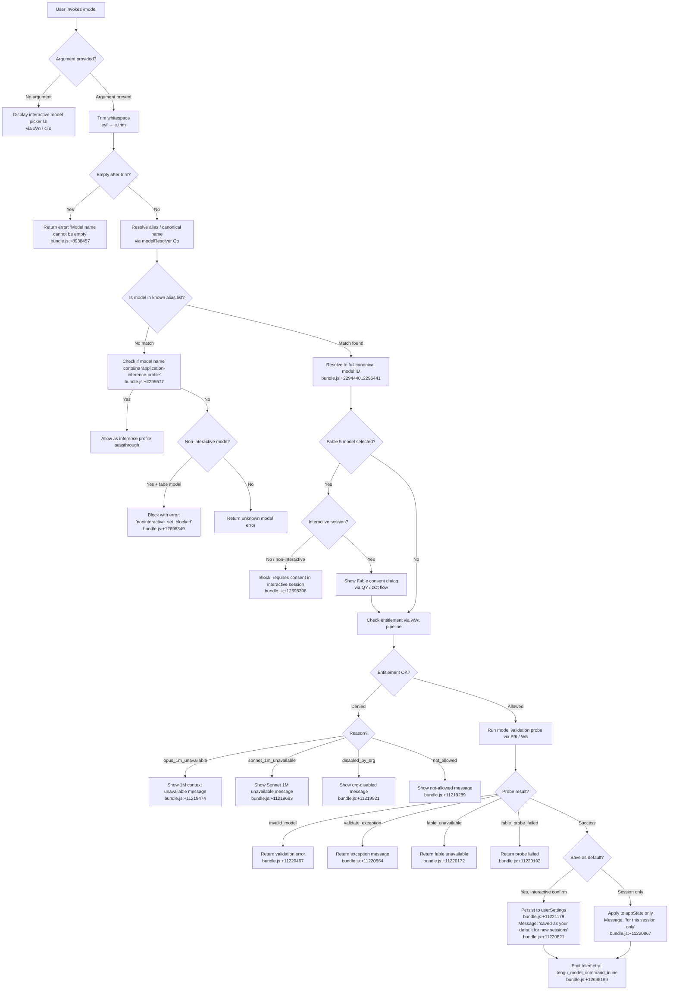

# `/model`

> Analysis basis: CC v2.1.187 bundle.js (AST extraction + Claude interpretation)
> Minimum version: v2.1.187

---

## Overview

The `/model` command allows users to select the AI model that Claude Code will use for the current session and optionally persist that selection as the default for future sessions. It validates the requested model against a known list of canonical model identifiers and short aliases, enforces entitlement and policy constraints, optionally probes model availability via a live API call, and updates application state accordingly.

---

## Registration

| Field | Value |
|---|---|
| type | `local` |
| name | `model` |
| description | `Set the AI model for Claude Code` |
| argumentHint | `<model>` |
| supportsNonInteractive | `true` |
| module_id | `a1l` |
| load_inline | `true` |
| loc_byte | `12735143` |
| loc_byte_end | `12735317` |
| loc_line | `8684` |
| arbor_handler.name | `eyf` |
| arbor_handler.fqn | `claude-2.1.187::eyf` |
| arbor_handler.kind | `AsyncFunction` |
| arbor_handler.resolution_path | `module_id` |
| arbor_handler.n_hits | `0` |

Analysis basis: CC v2.1.187 bundle.js:+12735143

---

## Input Branching

The command has more than three distinct branches depending on argument content, interactive mode, model validity, entitlement state, and Fable consent. A Mermaid flowchart is used.



---

## Behavioral Spec

### Handler Entry Point — `modelCommandHandler` (`eyf`)

The primary handler is the async function `eyf`, resolved via module `a1l`.

Analysis basis: CC v2.1.187 bundle.js:+12698019

```
async function modelCommandHandler(argument, context):
    rawInput = argument.trim()                        // bundle.js:+12698019

    if rawInput is in allowedOutputFormats (coe):     // bundle.js:+12698035
        // argument is a format specifier, not a model name; ignore
        return

    appState = context.getAppState()                  // bundle.js:+12698058

    result = await resolveAndValidateModel(rawInput, appState)   // bundle.js:+12698102

    if result is non-interactive Fable block:         // bundle.js:+12698327
        emit telemetry("tengu_model_command_inline")  // bundle.js:+12698169
        return blockMessage("noninteractive_set_blocked",
            "Fable 5 uses usage credits and needs a one-time consent...")
                                                      // bundle.js:+12698349 / +12698398

    if i9 list check passes:                          // bundle.js:+12698122
        run inline model command flow (W)             // bundle.js:+12698167

    proceed = await probeAndConfirm(result, context)  // bundle.js:+12698209
    if not proceed: return

    applyModelToSession(result, appState)             // bundle.js:+12698250
    displayConfirmation(result)                       // bundle.js:+12698305
    updateManagedSettingsDisplay()                    // bundle.js:+12698324
    emit telemetry("tengu_model_command_inline")      // bundle.js:+12698169
```

---

### Model Alias Resolution — `modelAliasResolver` (`Qo`)

Resolves user-supplied short names or aliases to full canonical model identifiers.

Analysis basis: CC v2.1.187 bundle.js:+2297852

```
function modelAliasResolver(input):
    normalized = input.trim().toLowerCase()           // bundle.js:+2297852, +2297863

    // Short alias table (selected entries from literals):
    aliases = {
        "sonnet"    -> "claude-sonnet-4-*",           // bundle.js:+2298033
        "haiku"     -> "claude-haiku-4-5",            // bundle.js:+2298072
        "opus"      -> "claude-opus-4-*",             // bundle.js:+2298111
        "best"      -> (best available tier),         // bundle.js:+2298145
        "fable"     -> "claude-fable-5",              // bundle.js:+2297929
        "opusplan"  -> "Opus Plan (plan-mode Opus)",  // bundle.js:+2296248
        "sonnet[1m]"-> sonnet with 1M context,        // bundle.js:+11221707
        "sonnet-4-6[1m]" -> sonnet 4.6 1M,           // bundle.js:+11221733
        "[1m]"      -> (1M context suffix flag),      // bundle.js:+2297977
    }

    if normalized in aliases:
        return canonicalModelId(aliases[normalized])

    // Direct canonical ID match
    canonicals = [
        "claude-fable-5",        // bundle.js:+2294440
        "claude-mythos-5",       // bundle.js:+2294495
        "claude-opus-4-8",       // bundle.js:+2294552
        "claude-opus-4-7",       // bundle.js:+2294609
        "claude-opus-4-6",       // bundle.js:+2294666
        "claude-opus-4-5",       // bundle.js:+2294723
        "claude-opus-4-1",       // bundle.js:+2294780
        "claude-opus-4-0",       // bundle.js:+2294869
        "claude-sonnet-4-6",     // bundle.js:+2294901
        "claude-sonnet-4-5",     // bundle.js:+2294962
        "claude-sonnet-4-0",     // bundle.js:+2295057
        "claude-haiku-4-5",      // bundle.js:+2295091
        "claude-3-7-sonnet",     // bundle.js:+2295150
        "claude-3-5-sonnet",     // bundle.js:+2295211
        "claude-3-5-haiku",      // bundle.js:+2295272
        "claude-3-opus",         // bundle.js:+2295331
        "claude-3-sonnet",       // bundle.js:+2295384
        "claude-3-haiku",        // bundle.js:+2295441
    ]

    if input matches a canonical:
        return input

    // Inference profile passthrough
    if input contains "application-inference-profile":  // bundle.js:+2295577
        return input as-is

    return NOT_FOUND
```

---

### Model Name Normalizer — `modelNormalizer` (`t_`)

Normalizes a model string for comparison: lowercases, strips version suffixes, and replaces separator characters.

Analysis basis: CC v2.1.187 bundle.js:+2294413

```
function modelNormalizer(modelId):
    lower = modelId.toLowerCase()       // bundle.js:+2294413
    if lower.includes("..."):           // bundle.js:+2294429
        lower = lower.replace(...)      // bundle.js:+2295489
    return lower
```

---

### Entitlement / Availability Check Pipeline — `entitlementPipeline` (`wWt`)

Runs after alias resolution to verify that the account is permitted to use the chosen model.

Analysis basis: CC v2.1.187 bundle.js:+11219070

```
async function entitlementPipeline(modelId, appState):
    // 1. Check model-switch event baseline
    emit internal event "model_switch"              // bundle.js:+11219093

    // 2. Evaluate 1M context availability
    if modelId requires 1M context:
        opusCheck = checkOpus1MAvailability(appState)   // bundle.js:+11219404
        if opusCheck == "opus_1m_unavailable":      // bundle.js:+11219436
            return DENIED(message: "Opus with 1M context is not available for your account...")
                                                    // bundle.js:+11219474
        sonnetCheck = checkSonnet1MAvailability(appState)  // bundle.js:+11219621
        if sonnetCheck == "sonnet_1m_unavailable":  // bundle.js:+11219653
            return DENIED(message: "Sonnet 4.6 with 1M context is not available...")
                                                    // bundle.js:+11219693

    // 3. Evaluate org-level model policy
    policyState = getPolicySettings(appState)       // bundle.js:+11219852
    if policyState == "disabled_by_org":            // bundle.js:+11219921
        return DENIED("denied_by_entitlement")      // bundle.js:+11219108

    // 4. Evaluate general not_allowed status
    if entitlementStatus == "not_allowed":          // bundle.js:+11219289
        return DENIED

    // 5. Evaluate model-level disabled/absent
    if modelStatus == "disabled":                   // bundle.js:+2283172
        return error "That model [is disabled]"     // bundle.js:+2283326
    if modelStatus == "absent":                     // bundle.js:+2283298
        return error "That model [is absent]"       // bundle.js:+2283326

    return ALLOWED
```

---

### Model Validation Probe — `modelValidationProbe` (`P9t`)

Performs a lightweight live API probe to verify the model ID is accepted by the upstream endpoint. Only runs when entitlement check passes.

Analysis basis: CC v2.1.187 bundle.js:+8938420

```
async function modelValidationProbe(modelId, appState):
    trimmed = modelId.trim()                         // bundle.js:+8938420
    if trimmed is empty:
        return error "Model name cannot be empty"    // bundle.js:+8938457

    modelList = await loadModelList(appState)        // bundle.js:+8938491
    normalized = trimmed.toLowerCase()               // bundle.js:+8938605

    // Check provider list
    if normalized in allowedProviders (wfe):         // bundle.js:+8938624
        pass

    // Check probe cache
    if probeCache (fpo).has(normalized):             // bundle.js:+8938726
        return probeCache.get(normalized)

    // Live probe via W5 (main API call pipeline)
    probeResult = await apiProbe(trimmed, appState)  // bundle.js:+8938771

    // Cache result
    probeCache.set(normalized, probeResult)          // bundle.js:+8938934

    // Validate probe response via Akp/bkp
    validationDetail = classifyProbeResult(probeResult)  // bundle.js:+8938975

    if validationDetail == "model_validation":       // bundle.js:+8938821
        return SUCCESS

    // Short-alias normalizations accepted by probe (selected):
    // "fable-5" / "fable_5"     bundle.js:+8939775 / +8939798
    // "opus-4-8" / "opus_4_8"   bundle.js:+8939875 / +8939899
    // "sonnet-4-6" / "sonnet_4_6" bundle.js:+8940151 / +8940177

    // Error classification
    if response.type == "not_found_error":           // bundle.js:+8939414
        return INVALID_MODEL                         // "model:" prefix in message, bundle.js:+8939496
    if authError:
        return error "Authentication failed. Please check your API credentials."
                                                    // bundle.js:+8939193
    if networkError:
        return error "Network error. Please check your internet connection."
                                                    // bundle.js:+8939295

    return probeResult
```

---

### Fable Consent Gate — `fableConsentGate` (`QY` + `zOt`)

Intercepts model selection for Fable 5 and requires user consent before proceeding. In non-interactive mode, the command is blocked entirely.

Analysis basis: CC v2.1.187 bundle.js:+12698327

```
async function fableConsentGate(modelId, isInteractive, appState):
    if not isFable5(modelId):
        return PROCEED

    emit telemetry "model_fable_consent"             // bundle.js:+12698327

    if not isInteractive:
        emit telemetry "noninteractive_set_blocked"  // bundle.js:+12698349
        return BLOCKED("Fable 5 uses usage credits and needs a one-time consent · "
                       "pick Fable from /model in an interactive session to set it up")
                                                    // bundle.js:+12698398

    // Interactive: show consent dialog
    consented = await showFableConsentDialog()       // bundle.js:+11222333 (QY → yT → zOt)
    if not consented:
        return CANCELLED

    return PROCEED
```

---

### Session Application & Confirmation Display — `applyModelAndConfirm` (`xVn`)

Updates the in-memory model selection, optionally persists as default, and renders a confirmation message to the user.

Analysis basis: CC v2.1.187 bundle.js:+11220668

```
function applyModelAndConfirm(resolvedModel, saveAsDefault, appState):
    // Update app state
    appState.model = resolvedModel                   // bundle.js:+11220668

    if saveAsDefault:
        persistToUserSettings(resolvedModel)         // bundle.js:+11221179
        suffix = " and saved as your default for new sessions"  // bundle.js:+11220821
    else:
        suffix = " for this session only"            // bundle.js:+11220867

    // Build confirmation line
    displayName = getDisplayName(resolvedModel)      // via Kxe / Lm
    line = St.bold(displayName) + suffix             // bundle.js:+11220802

    // Append feature flags in confirmation
    if model has fast mode:
        line += " · Fast mode ON"                    // bundle.js:+11220985
    if model draws from usage credits:
        line += " · Draws from usage credits"        // bundle.js:+11221036
    if fast mode off applies:
        line += " · Fast mode OFF"                   // bundle.js:+11221082

    // Display managed settings notice if applicable
    if managedSettingsActive(appState):
        display "Managed settings"                   // bundle.js:+11221388

    print line
    emit telemetry "model_set_default"               // bundle.js:+11221179
```

---

### Interactive Model Picker — `interactiveModelPicker` (`xVn` + `cTo`)

When no argument is supplied, renders a structured list of available models for the user to select from.

Analysis basis: CC v2.1.187 bundle.js:+11221014

```
function interactiveModelPicker(appState):
    models = buildAvailableModelList(appState)       // via Kxe → resolveAvailableModels

    for each model in models:
        row = formatModelRow(model)
        // row includes: display name, tier info, fast-mode indicator
        if model == currentModel(appState):
            row = highlight(row)
        print row

    // Display "Managed settings" footer if policy active
    if managedSettingsActive(appState):
        display "Managed settings" with dim style    // bundle.js:+11221388

    // Capture selection
    selected = awaitUserSelection()
    if selected:
        return applyModelAndConfirm(selected, askSaveDefault, appState)
```

---

### Model Display Name Mapping — `modelDisplayNames` (`yp`)

Maps canonical model IDs to human-readable display strings.

Analysis basis: CC v2.1.187 bundle.js:+2297590

| Canonical ID | Display Name |
|---|---|
| `claude-fable-5` | `Fable 5` (bundle.js:+2296952) |
| `claude-mythos-5` | `Mythos 5` (bundle.js:+2296990) |
| `claude-opus-4-8` | `Opus 4.8` (bundle.js:+2297029) |
| `claude-opus-4-7` | `Opus 4.7` (bundle.js:+2297070) |
| `claude-opus-4-6` | `Opus 4.6` (bundle.js:+2297111) |
| `claude-opus-4-5` | `Opus 4.5` (bundle.js:+2297152) |
| `claude-opus-4-1` | `Opus 4.1` (bundle.js:+2297193) |
| `claude-opus-4-0` | `Opus 4` (bundle.js:+2297234) |
| `claude-sonnet-4-6` | `Sonnet 4.6` (bundle.js:+2297275) |
| `claude-sonnet-4-5` | `Sonnet 4.5` (bundle.js:+2297320) |
| `claude-sonnet-4-0` | `Sonnet 4` (bundle.js:+2297365) |
| `claude-3-7-sonnet` | `Sonnet 3.7` (bundle.js:+2297408) |
| `claude-3-5-sonnet` | `Sonnet 3.5` (bundle.js:+2297451) |
| `claude-haiku-4-5` | `Haiku 4.5` (bundle.js:+2297493) |
| `claude-3-5-haiku` | `Haiku 3.5` (bundle.js:+2297536) |
| `opusplan` | `Opus Plan` (bundle.js:+2296564) — Opus in plan mode, else Sonnet (bundle.js:+2296265) |

Models with 1M context append ` (1M context)` to their display name (bundle.js:+2296892).

---

## State & Side Effects

| Item | Detail |
|---|---|
| Telemetry: `tengu_model_command_inline` | Fired on every `/model` invocation with an inline argument (bundle.js:+12698169) |
| Telemetry: `tengu_feature_ok` | Fired on successful model feature gate check (bundle.js:+1025122) |
| Telemetry: `tengu_feature_bad` | Fired on failed model feature gate check (bundle.js:+1025189) |
| Telemetry: `tengu_feature_sad` | Fired on soft-fail feature check (bundle.js:+1025270) |
| Telemetry: `tengu_api_success` | Fired on successful model validation API probe (bundle.js:+8820975) |
| Telemetry: `tengu_client_data_cache_key` | Fired when the API bootstrap client-data cache key is computed (bundle.js:+8174041) |
| Telemetry: `tengu_config_lock_contention` | Fired if config file lock takes longer than expected (bundle.js:+13750291) |
| Telemetry: `tengu_config_stale_write` | Fired if a stale config write is detected (bundle.js:+13750427) |
| Telemetry: `tengu_config_auth_loss_prevented` | Fired if a write that would erase auth credentials is blocked (bundle.js:+13750770) |
| Telemetry: `tengu_config_parse_error` | Fired on config JSON parse failure (bundle.js:+13752866) |
| Telemetry: `tengu_config_fallback_write` | Fired when config save falls back to alternate write path (bundle.js:+13749907) |
| Telemetry: `tengu_prompt_cache_1h_config` | Fired when 1-hour prompt cache configuration is applied (bundle.js:+13502392) |
| Telemetry: `tengu_lone_surrogate_sanitized` | Fired when lone UTF-16 surrogates are sanitized in a response (bundle.js:+8820671) |
| Telemetry: `tengu_bg_retire_pinned_low_mem` | Fired when background worker is retired due to low memory (bundle.js:+17200753) |
| Telemetry: `tengu_bg_prewarm_per_sweep` | Fired per background prewarm sweep cycle (bundle.js:+17200874) |
| appState changes | `appState.model` is updated to the resolved canonical model ID upon successful selection |
| User settings persistence | When user confirms "save as default", model is written to `userSettings` in `~/.claude/settings.json` (bundle.js:+11221179, +1317366) |
| Local settings path | `~/.claude/settings.local.json` (bundle.js:+1317428) |
| Probe result cache | Model validation probe results are cached in `fpo` (a Map) keyed by lowercased model name (bundle.js:+8938726, +8938934) |
| API bootstrap cache | Gateway model discovery result is persisted to disk with SHA-256 keying (bundle.js:+8174041, +3345775) |
| Config lock | Settings writes use a file lock with contention logging; if lock acquisition exceeds threshold, `tengu_config_lock_contention` is emitted (bundle.js:+13750291) |
| Auth-loss guard | If a config write would remove auth credentials present in the cache, the write is refused (GH #3117, bundle.js:+13750618, +13747081) |
| Sound | None detected |

---

## Version History

| Version | Change |
|---|---|
| v2.1.187 | Initial analysis. Supports Fable 5 consent gate, 1M context entitlement checks, `opusplan` alias, org-level policy enforcement, and live model validation probe with caching. |

---

## Common Mistakes

1. **Passing an empty string or whitespace-only argument** — The command rejects blank input immediately with "Model name cannot be empty" (bundle.js:+8938457). Always supply a non-empty model name or alias.

2. **Using `/model` with a Fable 5 name in non-interactive (headless/CI) mode** — Because Fable 5 requires a one-time credit-usage consent that can only be granted interactively, calling `/model fable` or `/model claude-fable-5` in a non-interactive session is blocked unconditionally (bundle.js:+12698349).

3. **Expecting the `[1m]` suffix to work for all models** — Extended 1M context is an entitlement-gated feature. Selecting `sonnet[1m]` or `sonnet-4-6[1m]` will be denied for accounts without the required entitlement, returning a message with a documentation link (bundle.js:+11219693).

4. **Assuming the model is persisted after every switch** — Without interactive confirmation the selection is session-only. Persistence to `userSettings` only occurs when the user explicitly confirms "save as default" through the interactive prompt (bundle.js:+11221179).

5. **Using kebab-case short forms that differ from the accepted alias set** — The alias table maps specific strings (`"sonnet"`, `"opus"`, `"haiku"`, `"fable"`, `"best"`, `"opusplan"`) but not arbitrary partial strings. Unrecognised inputs that don't match any canonical ID and don't contain `"application-inference-profile"` are passed to the live validation probe, which may return `not_found_error`.

6. **Ignoring org-level policy** — If an administrator has disabled a model via policy settings, the command returns `denied_by_entitlement` / `disabled_by_org` regardless of what the user selects (bundle.js:+11219921).

---

## Appendix — Identifier Mapping

> For bundle debugging only. Identifiers change across versions.

| Identifier | Role |
|---|---|
| `eyf` | Main handler (`modelCommandHandler`) — async entry point for `/model` |
| `MVn` | Model resolution orchestrator — dispatches to alias/canonical resolution and entitlement pipeline |
| `oM` | Outer model operation wrapper — calls model list builder and normalizer pipeline |
| `Pwt` | Model list builder — constructs the ordered list of available models from config and provider data |
| `yp` | Display-name mapper — maps canonical model IDs to human-readable names |
| `Qo` | Model alias resolver — maps short aliases and canonical strings to resolved model IDs |
| `vw` | Model metadata aggregator — collects model status, tier, and feature flags |
| `mRr` | Model record builder — constructs individual model metadata objects |
| `Sfn` | Full model list resolver — assembles the complete model list including remote/policy entries |
| `Efn` | Model filter — removes unavailable or policy-excluded models from the list |
| `wWt` | Entitlement pipeline orchestrator — runs availability and policy checks |
| `zNe` | Model normalizer helper — trims and normalizes model identifiers for comparison |
| `nl` | String sanitizer — strips or replaces control characters in model name strings |
| `ix` | Provider check helper — tests whether a model belongs to a known provider |
| `Eo` | Model lookup helper — locates a model entry in the known list by normalized ID |
| `t_` | Model ID normalizer — lowercases and strips separator/version suffixes |
| `UEt` | Inference profile detector — checks for `application-inference-profile` in model string |
| `Mp` | Model ID strip helper — removes provider prefixes or suffixes |
| `Lfe` | Gateway model loader — fetches available models from the gateway endpoint |
| `Ir` | Formatter / renderer utility — formats text output for display |
| `nt` | String coercion helper — converts values to strings |
| `d3u` | Model set accumulator — adds resolved entries to a model set |
| `u3u` | Model entry constructor — wraps a model ID into a structured entry object |
| `uRr` | Remote model fetcher — retrieves model list from remote API |
| `Dt` | Config writer — persists configuration to disk with lock |
| `Re` | Feature flag evaluator — checks feature entitlements |
| `Pe` | Feature status reporter — resolves feature availability to an ok/bad/sad status |
| `Ba` | Settings loader / merger — loads and merges settings from all layers |
| `uCt` | Settings consolidator — consolidates flag, user, project, and local settings |
| `ncs` | Settings filter — filters settings entries by applicability |
| `tcs` | Settings tier builder — constructs a tier-based settings object |
| `dCt` | Policy settings resolver — resolves administrator policy settings |
| `abe` | Remote settings reader — reads settings from remote managed configuration |
| `l2` | Settings layer resolver — resolves a single settings file layer |
| `Toe` | Settings entry transformer — transforms raw settings entries |
| `aCt` | Settings conflict resolver — resolves conflicts between settings layers |
| `KNe` | Model disabled-status checker — tests whether a model is in a disabled state |
| `gfn` | Model group filter — filters models by group or category |
| `kwt` | Model tier matcher — matches a model to its capability tier |
| `wGs` | Settings group walker — iterates over settings grouped entries |
| `Tn` | Settings file path resolver — resolves paths for settings files |
| `hsn` | Local settings path builder — builds the path for local settings JSON |
| `vGs` | Model version string parser — extracts version components from a model ID |
| `p3u` | Prefix-based model matcher — matches model IDs by prefix |
| `IGs` | Index-of finder helper — locates a substring within a model identifier |
| `f3u` | Family-based model matcher — matches models by family prefix |
| `CGs` | Family prefix tester — tests whether a model ID starts with a given family prefix |
| `uTo` | Opus 1M availability checker — evaluates whether Opus with 1M context is available |
| `lee` | Entitlement status fetcher — fetches the current entitlement status from API or cache |
| `xfe` | String formatter — formats a string with optional style |
| `Ao` | Axios instance builder — constructs the HTTP client for API calls |
| `c5i` | Credit status checker — checks account credit availability |
| `ab` | Model feature-flag resolver — resolves feature flags for a specific model |
| `Mfe` | Tier resolver — maps a model to a subscription/service tier |
| `xi` | Axios error parser — extracts structured data from Axios error responses |
| `dTo` | Sonnet 1M availability checker — evaluates whether Sonnet 4.6 with 1M context is available |
| `dge` | Sonnet entitlement fetcher — fetches Sonnet-specific entitlement status |
| `kTe` | Model policy evaluator — evaluates org-level model disable policies |
| `Eu` | Policy enforcement helper — applies administrator policy rules to model selection |
| `Odn` | Feature-X policy resolver — resolves a specific model feature against org policy |
| `kfe` | Model availability probe — performs a live API probe for model availability |
| `ese` | Error classifier — classifies API error responses into known error types |
| `Yoe` | Error type checker — checks whether a string matches a known error type |
| `Hz` | 1M context suffix handler — detects and processes the `[1m]` context suffix in model names |
| `yfn` | Hash-based model validator — validates a model ID using a hash-based scheme |
| `hJe` | Hash validator helper — checks whether a model's hash is in the accepted set |
| `mJe` | Miscellaneous model post-processor — applies final transforms after model selection |
| `P9t` | Model validation probe orchestrator — orchestrates the live validation probe |
| `W5` | API call pipeline — main function that sends the validation request to the API |
| `kf` | Request header builder — constructs HTTP headers for the validation request |
| `pW` | HTTP request executor — sends the HTTP request and processes the response |
| `g` | Timeout helper — wraps an async operation with a configurable timeout |
| `DFe` | Response decoder — decodes and validates the API response body |
| `rse` | Response cache accessor — reads from the response cache |
| `p0p` | Model find helper — locates a model entry by attribute match |
| `Ldo` | Cache key hasher — generates a SHA-256 cache key for bootstrap data |
| `wfn` | Response formatter — formats the raw API response for internal use |
| `VSn` | Validation schema checker — validates response shape against a schema |
| `u6e` | REPL context builder — builds the context object for the main REPL thread |
| `tD` | Fetch decorator — wraps fetch with logging and retry logic |
| `MBa` | Model bootstrap aggregator — aggregates bootstrap model data |
| `O_n` | Inference profile resolver — resolves inference-profile model IDs |
| `YC` | Model map transformer — transforms an array of model entries |
| `Dwe` | Message builder — constructs API message objects for the probe request |
| `t8o` | Message content updater — updates content within an API message object |
| `kN` | Deep clone utility — performs a structured clone of configuration objects |
| `qJt` | Message popper — removes and processes the last message in a conversation |
| `Ve` | Version checker — checks the current bundle version |
| `axr` | Response accumulator — accumulates streamed response chunks |
| `ixr` | Cache invalidation helper — manages invalidation of cached model data |
| `xSe` | Session expiry checker — detects expired session conditions |
| `Rr` | Nonconforming-model reporter — logs or reports a model ID that does not conform to naming conventions |
| `Fo` | Fork/spawn helper — manages subprocess spawning for background tasks |
| `BDt` | Background data tracker — tracks per-session background API data |
| `YU` | Sub-agent context builder — builds context for sub-agent model calls |
| `iEt` | Cache control injector — injects `cache_control` headers into requests |
| `Akp` | Probe result classifier — classifies the raw probe result into a known status |
| `bkp` | Probe response parser — parses the probe HTTP response body |
| `Upl` | Provider uppercase helper — normalizes provider identifiers to uppercase |
| `tke` | Bootstrap fetch orchestrator — orchestrates the gateway bootstrap fetch |
| `vao` | Bootstrap model discovery — discovers available models from the gateway |
| `J$` | Bootstrap cache checker — checks whether a cached bootstrap result is still valid |
| `ys` | Bootstrap model parser — parses the raw model list from the bootstrap response |
| `vSp` | Bootstrap HTTP executor — executes the bootstrap HTTP fetch |
| `T` | Terminal formatter — formats output for terminal rendering |
| `LSp` | Bootstrap response handler — handles the bootstrap HTTP response |
| `Vi` | Traffic classifier — classifies network requests by traffic priority |
| `vxa` | Bootstrap context resolver — resolves the context for a bootstrap fetch |
| `qUr` | URL parser — parses and splits URL strings |
| `Mt` | Message formatter — formats confirmation messages for display |
| `qC` | Queue controller — controls the request queue for API calls |
| `cA` | Auth credential builder — constructs authentication credentials for API requests |
| `$Te` | WIF token exchanger — performs Workload Identity Federation token exchange |
| `wJe` | WIF credential resolver — resolves WIF credentials from environment |
| `Ls` | OAuth endpoint validator — validates the OAuth endpoint URL against an approved list |
| `VC` | Version compatibility checker — checks model version compatibility |
| `Nk` | Error normalizer — normalizes Axios errors into a standard error shape |
| `Le` | Feature OK reporter — reports a successful feature check |
| `Cxa` | Cache delta checker — determines whether the cache content has changed |
| `TSn` | Cache key generator — generates a SHA-256 cache key for bootstrap data |
| `hn` | Config saver — saves global or session config to disk |
| `GQn` | Config file writer — writes config data to the config file with lock and backup |
| `ADe` | Auth data extractor — extracts auth-related fields from config |
| `DOo` | Config entry iterator — iterates over config entries for serialization |
| `MKt` | Config timestamp updater — updates the last-modified timestamp in config |
| `_Ee` | Config file reader — reads and parses the config file from disk |
| `MHt` | Config merge helper — merges two config objects |
| `BQn` | Config fallback writer — writes config using a fallback path when the primary path fails |
| `GEi` | Bootstrap cache transformer — transforms bootstrap cache entries |
| `BEi` | Bootstrap cache entry builder — builds individual bootstrap cache entries |
| `jH` | Cache write guard — guards against writing a cache that is unchanged |
| `ke` | Background task executor — executes a background task with error logging |
| `fo` | Error serializer — serializes errors to string form |
| `Qru` | Task queue manager — manages a bounded queue of background tasks |
| `be` | String coercion wrapper — wraps a value in a String call |
| `QY` | Fable consent dialog driver — drives the Fable consent UI dialog |
| `yT` | Model entry formatter — formats a model entry for display in the picker |
| `XG` | Neutral model name formatter — formats a model name without decoration |
| `zOt` | Fable consent dialog renderer — renders the Fable consent dialog UI |
| `rzr` | Dialog UI runner — runs an interactive dialog UI loop |
| `KOt` | Dialog content builder — builds the content for the Fable consent dialog |
| `Rwe` | Dialog response handler — handles a user response to the dialog |
| `H1` | Dialog option constructor — constructs a selectable option for a dialog |
| `h8` | Dialog UI primitives — provides low-level UI primitives for dialogs |
| `xVn` | Session application and confirmation display — applies model to session and renders confirmation |
| `vre` | Verbose mode checker — checks whether verbose output mode is active |
| `LWt` | Default model setter — persists the selected model as the default for future sessions |
| `ao` | Settings writer — writes updated settings to the appropriate settings file |
| `Jm` | Settings path resolver — resolves the path for a specific settings file |
| `Wt` | File system path helper — resolves file system paths |
| `QEr` | Settings file writer — writes serialized settings JSON to disk |
| `DC` | Directory creator — creates a directory if it does not exist |
| `kn` | Path normalizer — normalizes a file system path |
| `lEr` | Settings cache updater — updates the in-memory settings cache after a write |
| `Q1e` | Settings layer writer — writes a specific settings layer to disk |
| `oIt` | Atomic file writer — writes a file atomically using a temp file and rename |
| `Me` | JSON serializer — serializes an object to a JSON string |
| `bH` | Cache clearer — clears in-memory caches after a settings write |
| `Fis` | Git ignore tracker — tracks files in `.gitignore` for the project |
| `g9` | Claude config path builder — builds the path to the `.claude` settings directory |
| `gr` | Global config path resolver — resolves the path to the global config file |
| `PG` | Project settings loader — loads project-level settings from disk |
| `Bl` | Bold text formatter — applies bold styling to terminal output |
| `wTe` | Warning text formatter — applies warning styling to terminal output |
| `Lm` | Model feature-flag renderer — renders feature flag indicators for a model entry |
| `Kxe` | Available model list builder — builds the list of models available for selection |
| `Kg` | Model current-state resolver — resolves the currently active model from app state |
| `wH` | Model header formatter — formats the header row for the model picker display |
| `cTo` | Interactive picker renderer — renders the interactive model picker UI |
| `Jpe` | Picker selection handler — handles a user selection event in the picker |
| `ex` | Selection event emitter — emits a selection event with the chosen model |
| `_z` | Model summary line builder — builds a one-line summary for a model entry in the picker |