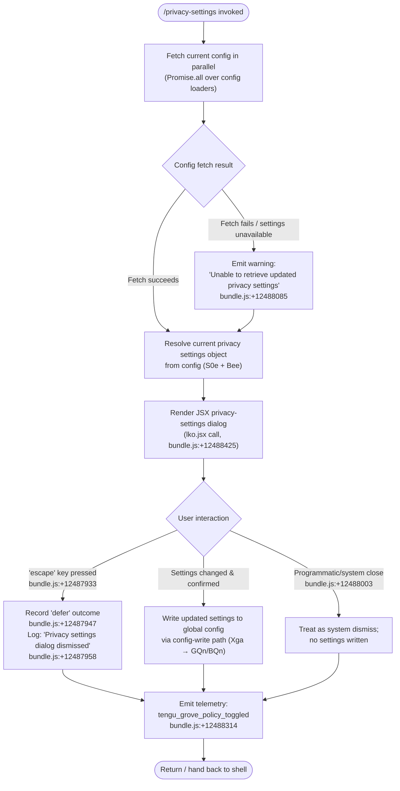

# `/privacy-settings`

> Analysis basis: CC v2.1.187 bundle.js (AST extraction + Claude interpretation)
> Minimum version: v2.1.187

---

## Overview

The `/privacy-settings` command opens an interactive JSX dialog that allows the user to view and update their privacy preferences stored in the global configuration. It is an asynchronous handler (`AsyncFunction`) that loads the current settings via a parallel config-fetch strategy, then renders a JSX UI component for the user to interact with. On dismissal or escape, it records a telemetry event and returns control to the shell.

---

## Registration

| Field | Value |
|---|---|
| type | `local-jsx` |
| name | `privacy-settings` |
| description | `View and update your privacy settings` |
| module_id | `Mxl` |
| load_inline | `true` |
| loc_byte | `12488758` |
| loc_byte_end | `12488941` |
| arbor_handler.name | `Bhf` |
| arbor_handler.fqn | `claude-2.1.187::Bhf` |
| arbor_handler.kind | `AsyncFunction` |
| arbor_handler.resolution_path | `module_id` |
| arbor_handler.n_hits | `0` |

Analysis basis: CC v2.1.187 bundle.js:+12488758

---

## Input Branching

The command has 3+ distinct branches based on dialog outcome (escape/defer/system dismiss, successful settings load, and error recovery). A Mermaid flowchart is used below.



---

## Behavioral Spec

### Main Handler — Privacy Settings Command Entry Point

The Arbor-resolved handler is `Bhf` (resolution path: `module_id → Mxl`). All sub-behavior below is reachable from `Bhf`.

```
async function privacySettingsHandler(context):
    # 1. Parallel config resolution
    [configSnapshot, settingsBlob] = await Promise.all([
        resolveConfigStore(),       # Bee — bundle.js:+12487822
        resolveSettingsObject()     # S0e — bundle.js:+12487828
    ])

    # 2. Guard: if settings unavailable, log warning and continue with defaults
    if settingsBlob is null or unreachable:
        warn("Unable to retrieve updated privacy settings")  # bundle.js:+12488085
        settingsBlob = defaultPrivacySettings()

    # 3. Render interactive JSX dialog
    outcome = await renderJsxDialog(
        component = lko.jsx,        # bundle.js:+12488425
        props = {
            settings: settingsBlob,
            onEscape:  () => recordOutcome("escape"),   # bundle.js:+12487933
            onDefer:   () => recordOutcome("defer"),    # bundle.js:+12487947
            onConfirm: (updated) => persistSettings(updated)
        }
    )

    # 4. Branch on dialog outcome
    match outcome.kind:
        case "escape" | "defer":
            log("Privacy settings dialog dismissed")   # bundle.js:+12487958
            emitTelemetry("tengu_grove_policy_toggled")

        case "system":                                  # bundle.js:+12488003
            # programmatic close; no write
            emitTelemetry("tengu_grove_policy_toggled")

        case "confirmed":
            persistSettings(outcome.updatedSettings)
            emitTelemetry("tengu_grove_policy_toggled") # bundle.js:+12488314

    return buildSettingsResultView(outcome)             # Ve → rKe, bundle.js:+12488375
```

Analysis basis: CC v2.1.187 bundle.js:+12487769

---

### Config Load Sub-chain — `configReader` (Hat)

`Hat` is called from `privacySettingsHandler` as the primary config-access function. It implements a Grove-style read-through cache with background refresh.

```
function configReader(cacheKey):
    cached = readFromCache(cacheKey)              # $Fe → xi, bundle.js:+7238189

    if cached is missing:
        log("Grove: No cache, fetching config in background (dialog skipped this session)")
                                                  # bundle.js:+7238304
        triggerBackgroundFetch(cacheKey)          # Xga, bundle.js:+7238384
        return null

    if cached.isStale():
        log("Grove: Cache stale, returning cached data and refreshing in background")
                                                  # bundle.js:+7238424
        triggerBackgroundFetch(cacheKey)          # Xga, bundle.js:+7238384
        return cached.value

    log("Grove: Using fresh cached config")       # bundle.js:+7238530
    return cached.value
```

Analysis basis: CC v2.1.187 bundle.js:+7238189

---

### Cache Freshness & Config Accessor (`$Fe` / `xi`)

`$Fe` coordinates cache record lookup. `xi` builds the cache-record object by reading the underlying config source.

```
function buildCacheRecord(configKey):
    plan   = resolveSubscriptionPlan(configKey)   # jLr, bundle.js:+3076601
    limits = resolvePlanLimits(configKey)         # zLr, bundle.js:+3076614
    auth   = resolveAuthEntry(configKey)          # ay,  bundle.js:+3076624
    extra  = resolveExtraFields(configKey)        # Gs,  bundle.js:+3076647
    return { plan, limits, auth, extra }
```

`ay` (auth-entry resolver) reads several keys including:
- `"ANTHROPIC_API_KEY"` (bundle.js:+3054580)
- `"apiKeyHelper"` (bundle.js:+3054605)
- Plan tier strings: `"max"` (bundle.js:+3079220), `"pro"` (bundle.js:+3079231)

Analysis basis: CC v2.1.187 bundle.js:+3079258

---

### Background Config Persist — `backgroundConfigSave` (Xga → GQn/BQn)

When the user confirms new privacy settings, or when a background refresh is triggered, the write path is:

```
async function backgroundConfigSave(configPath, newData):
    acquireLock(configPath)                       # Dt → Wt, bundle.js:+7238249
    timestampNow = Date.now()                     # bundle.js:+7238278/7238728

    reReadConfig = readConfigFromDisk()           # GQn / BQn path

    # Safety guard (GH #3117): refuse write if re-read config lost auth that cache holds
    if cacheHasAuth AND reReadConfig isMissingAuth:
        warn("saveConfigWithLock: re-read config is missing auth ...")
                                                  # bundle.js:+13750618
        emitTelemetry("tengu_config_auth_loss_prevented")
        return

    writeConfigToDisk(newData)                    # _Ee path, bundle.js:+13747055
    rotateSaveBackup(configPath)                  # backup rotation, bundle.js:+13751088
    releaseLock(configPath)
```

Lock-contention guard:
- If lock takes too long: `"Lock acquisition took longer than expected - another Claude instance may be running"` (bundle.js:+13750202) → emits `tengu_config_lock_contention`.
- Stale-write guard emits `tengu_config_stale_write` (bundle.js:+13750427).
- Parse errors emit `tengu_config_parse_error` (bundle.js:+13752866).
- Fallback write emits `tengu_config_fallback_write` (bundle.js:+13749907).

Analysis basis: CC v2.1.187 bundle.js:+7238384

---

### Config File I/O — `configFileReadWrite` (_Ee)

```
function configFileReadWrite(filePath, operation):
    if NOT configAccessAllowed():
        throw Error("Config accessed before allowed.")  # bundle.js:+13752235

    if operation == READ:
        raw = fs.readFileSync(filePath, "utf-8")        # bundle.js:+13752318
        if error.code == "ENOENT":                      # bundle.js:+13752465
            return defaultConfig()
        if error.code == "EEXIST":                      # bundle.js:+13753080
            handleExist()

    if operation == WRITE:
        backupDir = IS.basename(filePath) + ".backup."  # bundle.js:+13751088
        fs.mkdirSync(backupDir, { recursive: true })
        newestBackups = fs.readdirStringSync(backupDir)
            .filter(f => f.startsWith(...))
            .slice(-5)                                  # keep last 5, bundle.js:+13751221
        if newestBackups.length >= 5:
            fs.unlinkSync(oldest)
        fs.copyFileSync(filePath, backupPath)           # bundle.js:+13753374
        writeNewContent(filePath, newData, "utf-8")

    # Backup rotation limit: 60000 ms old entries pruned  # bundle.js:+13750972
    # Max backup count: 5                                  # bundle.js:+13751221
    # Backup chunk size: 384 bytes                         # bundle.js:+13751503
```

Analysis basis: CC v2.1.187 bundle.js:+13748920

---

### Result View Builder (`Ve` → `rKe`)

After the dialog resolves, the handler constructs a result view object tagged with `"settings"` (bundle.js:+12488378) and renders it back through the shell's JSX render pipeline (`lko.jsx`).

```
function buildResultView(outcome, settingsSnapshot):
    return {
        type:  "settings",          # bundle.js:+12488378
        data:  settingsSnapshot,
        dismissed: outcome.isDismissed
    }
```

Analysis basis: CC v2.1.187 bundle.js:+12488375

---

## State & Side Effects

| Item | Detail |
|---|---|
| Telemetry — `tengu_grove_policy_toggled` | Fired on every dialog close (escape, defer, system, confirm); bundle.js:+12488314 |
| Telemetry — `tengu_config_parse_error` | Fired when config JSON cannot be parsed; bundle.js:+13752866 |
| Telemetry — `tengu_config_lock_contention` | Fired when config file lock takes unexpectedly long; bundle.js:+13750291 |
| Telemetry — `tengu_config_stale_write` | Fired when a stale write is detected and aborted; bundle.js:+13750427 |
| Telemetry — `tengu_config_auth_loss_prevented` | Fired when a write would silently remove auth data (GH #3117 guard); bundle.js:+13750770 |
| Telemetry — `tengu_config_fallback_write` | Fired when the primary write path fails and a fallback write is used; bundle.js:+13749907 |
| Telemetry — `tengu_daemon_config_reload` | Fired by daemon when it detects a config change and reloads; bundle.js:+17212183 |
| Telemetry — `tengu_daemon_yield` | Fired when daemon yields to foreground session; bundle.js:+17216595 |
| Telemetry — `tengu_mcp_skills` | Fired by MCP skill enumeration path reachable from config load chain; bundle.js:+6652661 |
| Telemetry — `tengu_bg_retire_pinned_low_mem` | Fired by background worker manager under low memory; bundle.js:+17200753 |
| Telemetry — `tengu_bg_prewarm_per_sweep` | Fired by background worker prewarm sweep; bundle.js:+17200874 |
| Config file writes | Updated privacy settings written to `~/.claude.json` via locked write with backup rotation (up to 5 backups, max 60 000 ms retention) |
| Config file backups | Backup files created in a `.backup.` subdirectory alongside the config file; bundle.js:+13751088 |
| Log messages | `"Privacy settings dialog dismissed"` emitted on escape/defer; bundle.js:+12487958 |
| Log messages | Grove cache-status strings emitted on each config read (no-cache / stale / fresh); bundle.js:+7238304, +7238424, +7238530 |
| JSX render | `lko.jsx` component rendered to the CLI interactive frame; bundle.js:+12488425 |
| appState changes | Privacy flags in global config updated on user confirmation |
| Sound | None found in depth-2 traversal |
| Hook registration | `Ei` → `b6o.register` reachable via log-write sub-chain; bundle.js:+67325 — likely terminal/output hook, not privacy-specific |

---

## Version History

| Version | Change |
|---|---|
| v2.1.187 | Initial analysis |

---

## Common Mistakes

1. **Treating a dismissed dialog as a no-op with no side effects.** Even when the user presses Escape, the `tengu_grove_policy_toggled` telemetry event is still fired (bundle.js:+12488314). Callers should not assume silence on dismiss.

2. **Assuming settings are always available on first invocation.** The Grove cache may be empty on first run; the handler gracefully falls back to defaults and triggers a background fetch rather than blocking. Do not rely on the returned settings object being fully populated on the first call.

3. **Concurrent invocations.** The underlying config write path uses a file lock. A second Claude instance running simultaneously will trigger `tengu_config_lock_contention` and may see a warning: `"Lock acquisition took longer than expected — another Claude instance may be running"` (bundle.js:+13750202).

4. **Ignoring the auth-loss prevention guard.** If the on-disk config is ever missing auth data that the in-memory cache still holds, the write is silently aborted (GH #3117). Automated tooling that writes the config file externally may trigger this guard and cause privacy-settings writes to be silently dropped.

5. **Conflating `"system"` close with `"escape"`.** The dialog distinguishes between a user-initiated escape (outcome `"escape"` / `"defer"`) and a programmatic close (`"system"`, bundle.js:+12488003). Both fire telemetry but only one generates the dismissal log message.

---

## Appendix — Identifier Mapping

> For bundle debugging only. Identifiers change across versions.

| Identifier | Role |
|---|---|
| `Bhf` | Main async handler for `/privacy-settings` command (entry point) |
| `Hat` | Grove config read-through cache coordinator |
| `$Fe` | Cache record lookup / resolution function |
| `xi` | Cache record builder (assembles plan, limits, auth, extras) |
| `jLr` | Subscription plan resolver |
| `zLr` | Plan limits resolver |
| `ay` | Auth-entry resolver (reads API key, apiKeyHelper, plan tier) |
| `Ao` | Auxiliary cache field accessor |
| `H2` | Array-inclusion helper used in plan/tier checks |
| `Xai` | Extra config field extractor |
| `hc` | Config sub-accessor helper called from Hat |
| `Dt` | Config file lock orchestrator (acquire / write / release) |
| `Wt` | Lock/file utility (likely file-handle or path helper) |
| `MOo` | Lock mode/options object |
| `_Ee` | Config file read/write implementation (fs calls, backup rotation) |
| `MRf` | Lock release / cleanup function |
| `T` | Telemetry emit / structured log utility |
| `Xwc` | Telemetry transport layer |
| `I6o` | Telemetry batching helper |
| `Me` | JSON serializer wrapper |
| `wc` | Log line formatter / redaction helper |
| `c8o` | Log field mapper |
| `dze` | Output write dispatcher |
| `JWo` | Raw stream writer |
| `eLc` | Append-to-log-file orchestrator |
| `FKe` | Batched write scheduler (uses setTimeout / setImmediate) |
| `dpe` | Log file path resolver |
| `Mre` | Directory creation helper used in log path setup |
| `p8o` | Log path joiner |
| `Ocr` | Atomic log-file rotation helper (rename/unlink `.txt`) |
| `Zwc` | Async append-file writer (mkdir + appendFile + rotation) |
| `Ei` | Hook registration caller (`b6o.register`) |
| `Xga` | Background config-fetch / refresh trigger |
| `hn` | Config file save orchestrator (global config path) |
| `GQn` | Locked config save with backup rotation (project/local scope) |
| `ADe` | Config path builder helper |
| `DOo` | Config entries iterator |
| `MKt` | Timestamp-based lock helper |
| `MHt` | Config migration helper |
| `W` | General-purpose warn/log helper |
| `BQn` | Fallback config write path |
| `a` | MCP server manager / connection table |
| `a9e` | MCP server connection orchestrator |
| `RB` | MCP server registry update handler |
| `Pst` | MCP server state initializer |
| `y7` | MCP server full-connect function |
| `K4` | MCP server kind classifier |
| `CRn` | MCP status color formatter (red/yellow for error states) |
| `xst` | MCP transport slot manager (sse/http map) |
| `iF` | MCP server config object factory |
| `d` | MCP connection slot / supervisor entry |
| `Qw` | Config store accessor (get current global config) |
| `eh` | Config store reader (reads from disk via Dt) |
| `eJr` | Config store update notifier |
| `zn` | Utility: identity / pass-through wrapper |
| `FUt` | MCP server filter predicate |
| `mua` | MCP capabilities/hash builder |
| `cZr` | MCP needs-auth cache reader (`mcp-needs-auth-cache.json`) |
| `RLe` | MCP tool-list hasher (sha256/hex) |
| `fyn` | MCP tool schema fingerprint builder |
| `myn` | MCP tool version tracker |
| `vT` | Tool-list hash helper |
| `pyn` | MCP server slot config fingerprint |
| `Gl` | Generic hash/fingerprint builder |
| `ln` | MCP debug logger (`jJ.logMCPDebug`) |
| `zRn` | MCP OAuth / auth-required connection handler |
| `wr` | OAuth flow initiator |
| `JVd` | OAuth tool injector (injects `authenticate` tool) |
| `QVd` | OAuth callback completion handler |
| `BUt` | MCP post-connection capability fetcher |
| `Xs` | Async-local-storage store reader |
| `tMn` | MCP endpoint URL builder |
| `mJr` | MCP reconnect / retry handler |
| `be` | String coercion utility |
| `m` | Worker process registry |
| `x` | Worker process wrapper |
| `eL` | MCP skill enumeration entry (emits `tengu_mcp_skills`) |
| `it` | Skill/tool record factory |
| `ZXr` | MCP server inclusion filter |
| `w` | Background worker scheduler |
| `aj` | Worker affinity / blur-state tracker |
| `L` | Background worker lifecycle manager (prewarm, retire, respawn) |
| `v` | Worker pool entry |
| `fcc` | Worker away-summary accessor |
| `mcc` | Worker message dispatcher |
| `Vc` | MCP error logger (`jJ.logMCPError`) |
| `yua` | MCP structured result mapper |
| `ZW` | Async iterator / stream mapper |
| `git` | Integer parser (radix 10) for MCP config values |
| `nMn` | Integer parser (radix 20) for MCP config values |
| `brr` | MCP connection result applier (`applyConnectionResult`) |
| `i9e` | MCP tool-hash verifier on reconnect |
| `KT` | MCP server cleanup coordinator |
| `mit` | MCP tool cleanup helper |
| `hla` | MCP server health-check / tQr trigger |
| `tQr` | MCP transport query/reconnect |
| `s` | Async request set tracker |
| `i` | Async request entry (close/cleanup) |
| `l` | Daemon session tracker |
| `JNl` | Daemon status file writer (`daemon.status.json`) |
| `SQ` | Status serializer |
| `tVt` | Daemon status path builder |
| `uBo` | MCP full-reconcile orchestrator (entries filter, connect, brr) |
| `xRn` | MCP server exclusion checker (EVd/aJr sets) |
| `Kn` | Timeout-with-abort helper |
| `c` | Background session entry (`En`) |
| `Ve` | Result view builder for settings dialog |
| `rKe` | Settings result renderer |

---

Note: index built via Arbor fallback; some signals (telemetry, literals) may be missing — see arbor-fallback.js.