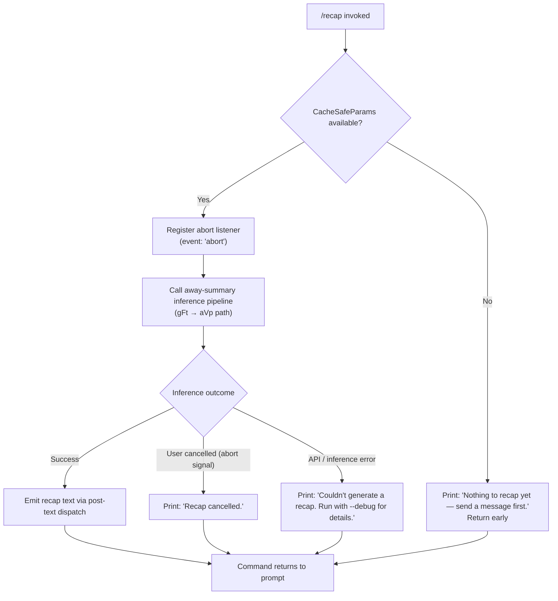

# `/recap`

> Analysis basis: CC v2.1.187 bundle.js (AST extraction + Claude interpretation)
> Minimum version: v2.1.187

---

## Overview

The `/recap` command immediately triggers a one-line session recap generation without waiting for a natural session boundary. It invokes the same away-summary pipeline used for background sessions, resolving cached model parameters and streaming a compact recap back to the user. The command is fire-and-forget: it runs a single non-interactive inference call and prints the result (or a short error message) before returning control to the prompt.

---

## Registration

| Field | Value |
|---|---|
| type | `local` |
| name | `recap` |
| description | `Generate a one-line session recap now` |
| loc_byte | `12996072` |
| loc_byte_end | `12996288` |
| loc_line | `8829` |
| supportsNonInteractive | `false` |
| thinClientDispatch | `post-text` |
| load_inline | `true` |
| load_ident | `Fbf` |
| arbor_handler.name | `Fbf` |
| arbor_handler.fqn | `claude-2.1.187::Fbf` |
| arbor_handler.kind | `AsyncFunction` |
| arbor_handler.resolution_path | `load_ident` |
| arbor_handler.n_hits | `0` |

Analysis basis: CC v2.1.187 bundle.js:+12996072

---

## Input Branching

The handler has 3+ distinct outcome paths based on session state and inference result. A Mermaid flowchart is used below.



Analysis basis: CC v2.1.187 bundle.js:+12995680 (handler `Fbf` → `gFt`)

---

## Behavioral Spec

### Handler Entry — `Fbf` (recapHandler)

The handler is an `AsyncFunction` inlined via `load: () => Promise.resolve({ call: Fbf })` in the registration object. The Arbor symbol graph resolved it via `load_ident`.

```
async function recapHandler(context):
    params = awaySummaryParamResolver(context)   // gFt → ys path
    if params is null or undefined:
        print "Nothing to recap yet — send a message first."
        return

    abortController = new AbortController()
    context.addEventListener("abort", () => abortController.abort())

    try:
        result = await awaySummaryPipeline(params, abortController.signal)
        // dispatched as post-text back to the terminal
    catch AbortError:
        print "Recap cancelled."
    catch AnyOtherError:
        print "Couldn't generate a recap. Run with --debug for details."
```

Analysis basis: CC v2.1.187 bundle.js:+12995680, +12995822, +12995914, +12995972

---

### Away-Summary Param Resolution — `gFt`

`gFt` (awaySummaryParamResolver) is the first callee of `Fbf`. It checks whether the session has previously stored "CacheSafeParams". If none are present it logs the sentinel string `"[awaySummary] no CacheSafeParams saved, skipping"` and returns without a value.

```
function awaySummaryParamResolver(context):
    cached = loadCacheSafeParams(context)   // ys / Qo path
    if not cached:
        log "[awaySummary] no CacheSafeParams saved, skipping"
        return null
    return cached
```

Analysis basis: CC v2.1.187 bundle.js:+7081050 (literal `"[awaySummary] no CacheSafeParams saved, skipping"`)

---

### Model Alias Resolution — `ys` / `Qo`

`ys` (modelParamsLoader) calls `Qo` (modelAliasResolver), which normalises model shorthand strings. The following aliases are mapped at this layer:

| Alias input | Resolved token (bundle literal) |
|---|---|
| `"fable"` | maps through alias table |
| `"opusplan"` | maps through alias table |
| `"sonnet"` | normalised |
| `"haiku"` | normalised |
| `"opus"` | normalised |
| `"best"` | normalised |
| `"[1m]"` | context-window tier marker |

String normalisation applies `trim()` and `toLowerCase()` before lookup, then `replace()` to strip any remaining decoration.

Analysis basis: CC v2.1.187 bundle.js:+2297852, +2297863, +2297929, +2297977, +2297992, +2298033, +2298072, +2298111, +2298145

---

### Abort / No-Turn Guard — `gFt`

Before launching inference, `gFt` registers a listener on the context's abort event. The literal `"no-turn"` is used as a sentinel to classify sessions that have no conversation turns yet (distinct from sessions that have turns but no cached params).

```
function registerAbortGuard(context, abortController):
    context.addEventListener("abort", () => {
        abortController.abort()
    })
    if sessionHasNoTurns(context):   // literal "no-turn"
        return SKIP
```

Analysis basis: CC v2.1.187 bundle.js:+7081110 (`"no-turn"`), +7081147 (`addEventListener`), +7081166 (`"abort"`)

---

### Away-Summary Inference — `gFt` → `aVp` (mainAgentLoop)

The recap inference flows into the same agent-loop used by background away-summaries (`C0` → `j5` → `aVp`). Key behaviours in this path:

- Tools are **denied**: the literal `"Away summary cannot use tools"` is returned for any tool call attempted during this inference run, and the tool-use decision path returns `"deny"`. Analysis basis: CC v2.1.187 bundle.js:+7081343, +7081358
- The inference is labelled `"away_summary"` internally. Analysis basis: CC v2.1.187 bundle.js:+7081426
- On completion the result type is classified as `"ok"` or `"api-error"`. Analysis basis: CC v2.1.187 bundle.js:+7081659, +7081720
- The pipeline calls `yma` (flatMap over result messages) to flatten the streamed content before returning. Analysis basis: CC v2.1.187 bundle.js:+7081676

```
async function runAwaySummaryInference(params, signal):
    denyToolUse = true    // all tool calls refused with "Away summary cannot use tools"
    label = "away_summary"

    streamResult = await mainAgentLoop(params, { signal, label, denyToolUse })

    if streamResult.type == "api-error":
        throw new ApiError(streamResult)

    flatMessages = streamResult.messages.flatMap(extractContent)
    return flatMessages
```

Analysis basis: CC v2.1.187 bundle.js:+7081225, +7081245, +7081587

---

### Output Dispatch

`/recap` is registered with `thinClientDispatch: "post-text"`. After the inference result is obtained, the text is posted back to the terminal as a standard text message — no special UI component is rendered. The command does not emit a structured message object into the conversation history; it is treated as a one-shot side-channel output.

Analysis basis: CC v2.1.187 bundle.js:+12996072 (registration `thinClientDispatch` field)

---

### Transcript / Log Writing — `eLc` path

`gFt` delegates log persistence to `eLc` (transcriptWriter), which:
1. Resolves the log directory via `upe.dirname`.
2. Checks/rotates existing transcript files via `Ocr` (rotateTranscriptFile), which calls `RN.stat`, `RN.rename`, and `RN.unlink`.
3. Appends new content via `Zwc` (appendTranscriptChunk), which calls `RN.mkdir` then `RN.appendFile`.
4. Tracks byte length with `Buffer.byteLength`.

This path is shared with the regular session transcript; the recap run appends its own turn to the session log.

Analysis basis: CC v2.1.187 bundle.js:+214018, +214051, +213343, +213499, +213539, +213772, +213831, +213924

---

## State & Side Effects

| Item | Detail |
|---|---|
| Telemetry | None emitted directly by `Fbf`/`gFt`; the shared agent-loop in `aVp` emits a wide range of `tengu_*` events (see full list in Appendix — Telemetry). |
| Abort handling | Registers a listener on the context abort event; aborts the inference `AbortController` on signal. |
| appState changes | None directly; the agent loop (`aVp`) may call `e.setAppState` / `N.setAppState` during inference. Analysis basis: CC v2.1.187 bundle.js:+10783040, +10730577 |
| Transcript | Appends the recap turn to the session transcript file via `eLc` / `Zwc`. |
| Tool calls | Blocked for the duration of the recap inference (`"deny"` / `"Away summary cannot use tools"`). Analysis basis: CC v2.1.187 bundle.js:+7081343 |
| Sound | None detected in depth-2 traversal. |
| Non-interactive support | `supportsNonInteractive: false` — command cannot run in `--no-interactive` / pipe mode. |

---

## Version History

| Version | Change |
|---|---|
| v2.1.187 | Initial analysis |

---

## Common Mistakes

1. **Running `/recap` before the first message** — the handler immediately prints `"Nothing to recap yet — send a message first."` and exits; it requires at least one prior conversation turn with saved CacheSafeParams.
2. **Expecting tool execution in the recap** — all tool calls made during recap inference are silently denied with `"Away summary cannot use tools"`; the recap is text-only.
3. **Using in non-interactive / pipe mode** — `supportsNonInteractive` is `false`; the command is unavailable in headless or scripted invocations.
4. **Expecting the recap to appear in conversation history** — output is dispatched via `thinClientDispatch: "post-text"`, which bypasses the standard message-history rendering path.
5. **Assuming cancellation is silent** — pressing the abort key while a recap is generating prints `"Recap cancelled."` explicitly to the terminal.

---

## Appendix — Identifier Mapping

> For bundle debugging only. Identifiers change across versions.

| Identifier | Role |
|---|---|
| `Fbf` | Main recap handler (`AsyncFunction`); resolved via `load_ident` |
| `gFt` | Away-summary orchestrator; checks CacheSafeParams, registers abort, drives inference |
| `ele` | Internal helper called by `gFt` (depth-1 callee) |
| `ys` | Model-params loader; feeds into alias resolution |
| `v9` | Params sub-constructor called by `ys` |
| `Qo` | Model alias resolver; trims/lowercases input, maps shorthand names |
| `Kg` | Secondary model-params helper calling `Qo` |
| `T` | Transcript / formatting utility (shared across many paths) |
| `Xwc` | Transcript entry builder |
| `I6o` | Inner helper of `Xwc` |
| `Me` | JSON-stringify wrapper used in formatting |
| `wc` | String sanitisation / redaction utility (emits `"[REDACTED]"`) |
| `c8o` | Character-map helper called by `wc` |
| `dze` | Stream-write dispatcher |
| `JWo` | Stream writer (calls `e.write`) |
| `eLc` | Transcript writer / log persister |
| `FKe` | Buffered output flusher (uses `setTimeout`, `setImmediate`) |
| `dpe` | Log directory helper called by `eLc` |
| `Mre` | EISDIR-safe directory handler |
| `p8o` | Path-join helper for transcript files |
| `Ocr` | Transcript file rotator (`stat` / `rename` / `unlink`) |
| `Zwc` | Transcript chunk appender (`mkdir` / `appendFile`) |
| `Ei` | Hook registration helper (calls `b6o.register`) |
| `C0` | Agent-loop entry point; calls `f4n`, `j5`, etc. |
| `f4n` | Session-state initialiser; reads/writes appState, generates UUIDs |
| `h1` | Helper called by `f4n` |
| `lge` | State loader helper (calls `t.load`, `e.dump`) |
| `Uwe` | Session setup helper |
| `Zsa` | Session parameter builder |
| `a` | Message-history accessor called by `f4n` |
| `B8n` | Secondary session helper |
| `DM` | ID/random-bytes generator (uses `zYt.randomBytes`) |
| `m4n` | Metrics helper |
| `Ace` | Tool/permission manager called by `C0` |
| `Rc` | Hook registry accessor (calls `Ei`) |
| `_We` | Tool-filter helper |
| `j5` | Sub-agent launcher / session coordinator |
| `aVp` | Main agent query loop (very large; owns streaming, tool dispatch, fallback, compact) |
| `YWn` | Sub-agent exit / cleanup handler |
| `Le` | Feature-flag checker (emits `tengu_feature_ok`) |
| `Re` | Feature-flag checker (emits `tengu_feature_bad`) |
| `lk` | Utility referenced by `C0` and `aVp` |
| `c6e` | Session-set membership checker |
| `Zte` | Utility called by `C0` |
| `q8n` | Helper called by `C0` |
| `SBa` | Secondary session-set checker |
| `f` | Daemon/background session manager |
| `W` | Common base helper (shared broadly) |
| `D` | Sub-process supervisor |
| `Kn` | Timeout/retry wrapper |
| `GXn` | Platform detector (emits `"macos"`) |
| `N2e` | File-cache reader/cleaner |
| `ke` | Error logger (calls `jJ.logError`) |
| `U` | Session retirement manager |
| `it` | Shared-memory / IPC tracker |
| `C3o` | Socket-connect helper |
| `x3o` | Session-roster / file-lifecycle manager |
| `s` | Alias of `x3o` in certain call sites |
| `p` | Forced-shutdown helper (calls `process.exit`) |
| `cn` | Common utility (shared) |
| `Pe` | Low-level utility (calls `rKe`) |
| `F` | Interval-clearing disposable |
| `cce` | Session-filter helper |
| `PA` | Helper called by `cce` |
| `o0p` | Array-find helper |
| `AVp` | Forked-agent query dispatcher (emits `tengu_fork_agent_query`) |
| `Rr` | Response classifier (emits `"nonconforming"`) |
| `On` | UUID-generating dispatcher (calls `xP.randomUUID`) |
| `_` | Async connection handler |
| `eyt` | Connection-type helper |
| `fo` | Error string converter |
| `y` | Teammate-mailbox accessor |
| `U5e` | TeammateMailbox message-reader (emits `[TeammateMailbox]` log strings) |
| `yma` | Result flatMap finaliser |

---

### Appendix — Telemetry Events (from shared agent-loop `aVp`)

These events are emitted by the shared infrastructure reached during a `/recap` run; they are not recap-specific but will appear in telemetry for any recap inference that exercises those paths.

| Event | loc_byte |
|---|---|
| `tengu_auto_compact_rapid_refill_breaker` | +10726094 |
| `tengu_auto_compact_succeeded` | +10726561 |
| `tengu_ptl_surfaced_to_user` | +10731388 |
| `tengu_refusal_fallback_suppressed` | +10732638 |
| `tengu_rotunda_pennant_applied` | +10734862 |
| `tengu_rotunda_pennant_tools` | +10735988 |
| `tengu_refusal_fallback_dialog_suppressed` | +10738945 |
| `tengu_refusal_fallback_prompt_shown` | +10739202 |
| `tengu_refusal_fallback_prompt_choice` | +10739537 |
| `tengu_fallback_credit_forfeited` | +10739656 |
| `tengu_refusal_fallback_triggered` | +10740912 |
| `tengu_orphaned_messages_tombstoned` | +10742238 |
| `tengu_refusal_fallback_supersedes` | +10743726 |
| `tengu_model_fallback_triggered` | +10747267 |
| `tengu_query_error` | +10747951 |
| `tengu_model_response_keyword_detected` | +10748996 |
| `tengu_malformed_tool_use_retry_outcome` | +10749639 |
| `tengu_malformed_tool_use_response` | +10753889 |
| `tengu_stop_hook_block_count` | +10755972 |
| `tengu_loop_dynamic_wakeup_ends_turn` | +10759766 |
| `tengu_post_autocompact_turn` | +10759949 |
| `tengu_query_before_attachments` | +10760067 |
| `tengu_query_after_attachments` | +10762384 |
| `tengu_mcp_tools_refreshed_mid_turn` | +10762689 |
| `tengu_feature_ok` | +1025122 |
| `tengu_feature_bad` | +1025189 |
| `tengu_bg_dispatch_sigkill_escalate` | +17196063 |
| `tengu_bg_low_mem_mb` | +13053248 |
| `tengu_bg_dispatch_low_mem` | +17196664 |
| `tengu_daemon_idle_exit` | +17217625 |
| `tengu_bg_spare_enable` | +17197361 |
| `tengu_bg_sendclaim_failed` | +17172323 |
| `tengu_bg_spare_claim` | +17197489 |
| `tengu_bg_spare_claim_fail` | +17197755 |
| `tengu_forked_agent_default_turns_exceeded` | +10786601 |
| `tengu_fork_agent_query` | +10787044 |