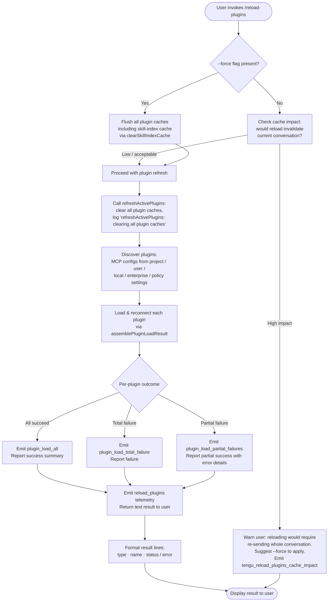

# `/reload-plugins`

> Analysis basis: CC v2.1.187 bundle.js (AST extraction + Claude interpretation)
> Minimum version: v2.1.187

---

## Overview

`/reload-plugins` triggers an in-session reload of all active plugins (MCP servers, skills, agents, LSP servers, and hooks) without requiring the user to restart Claude Code. It detects which plugins have pending configuration changes, reconnects them, and reports successes and failures back to the user. An optional `--force` flag forces a full cache flush and re-scan, at the cost of invalidating the current conversation context.

---

## Registration

| Field | Value |
|---|---|
| type | `local` |
| name | `reload-plugins` |
| description | `Activate pending plugin changes in the current session` |
| argumentHint | `[--force]` |
| supportsNonInteractive | `false` |
| thinClientDispatch | `control-request` |
| module_id | `fPl` |
| load_inline | `true` |
| loc_byte | `12622863` |
| loc_byte_end | `12623107` |
| loc_line | `8663` |
| arbor_handler.name | `SHf` |
| arbor_handler.fqn | `claude-2.1.187::SHf` |
| arbor_handler.kind | `AsyncFunction` |
| arbor_handler.resolution_path | `module_id` |
| arbor_handler.n_hits | `0` |

Analysis basis: CC v2.1.187 bundle.js:+12622863

---

## Input Branching

The command has 4+ distinct branches driven by the `--force` flag, cache state, and per-plugin load outcomes. A Mermaid flowchart is used.



---

## Behavioral Spec

### Main Handler (`SHf`)

The Arbor-resolved handler `SHf` is an `AsyncFunction` at module `fPl`.

```
async function reloadPluginsHandler(context, args):
    rawArgs = args.trim()

    forceFlag = rawArgs contains "--force" or parsed args include "force"

    if not forceFlag:
        impact = assessCacheImpact(context)          # calls pPl -> W
        if impact is significant:
            emit telemetry: tengu_reload_plugins_cache_impact
            return textResult(
                "reloading would require re-sending " +
                "the whole conversation instead of using the cache. " +
                "Run /reload-plugins --force to apply."
            )

    appState = context.getAppState()

    # Refresh active plugins (Jye)
    refreshResult = await refreshActivePlugins(appState, forceFlag)

    # Format output lines (Gie / AHf)
    lines = formatPluginLines(refreshResult)

    return textResult(lines.join("\n"))
```

Analysis basis: CC v2.1.187 bundle.js:+12621561

---

### Plugin Discovery and Load (`dPl` → `oJr`)

`dPl` (plugin-dispatch helper) invokes `oJr` (plugin reload orchestrator). `oJr` in turn calls:

- `iJr` → `JAo` (assemble plugin load result): collects per-plugin outcomes; emits `plugin_load_all`, `plugin_load_total_failure`, or `plugin_load_partial_failures` depending on aggregate result. Also detects and skips stale early-kick results when `originalCwd` changed mid-scan (logs a warning including the literal `"assemblePluginLoadResult: originalCwd changed mid-scan; skipping side-effects (stale early-kick)"`). Analysis basis: CC v2.1.187 bundle.js:+12620579 and +11059533
- `iJr` → `XAo` (plugin slot resolver): iterates plugin configurations from all config layers (`projectSettings`, `userSettings`, `localSettings`, `policySettings`); handles `skills-dir` entries; distinguishes source types including `path`, `url`, `git`, `file`, `directory`, `npm`, `github`, `settings`; applies marketplace policy blocking (emitting `marketplace-blocked-by-policy`) and cache-miss handling. Analysis basis: CC v2.1.187 bundle.js:+11039413
- `oJr` → `y7` (MCP server manager): manages per-server process lifecycle; handles `approved`/`pending` MCP server states; tracks server sets `f` (foreground) and `m` (background); calls `dsa` (duplicate suppression, emitting `mcp-server-suppressed-duplicate`); cleans up stale connections via `w.delete`. Analysis basis: CC v2.1.187 bundle.js:+6592674

```
async function pluginReloadOrchestrator(appState, forceFlag):
    # Validate plugin flags and feature enablement
    featureState = checkFeatureFlags(appState)          # MD -> uOt, qj, Y_

    # Assemble load result across all plugin types
    loadResult = await assemblePluginLoadResult(appState)  # iJr -> JAo

    # Rebuild MCP server connections
    await rebuildMcpServers(appState, loadResult)           # oJr -> y7

    # Track newly added servers for duplicate detection
    for each server in loadResult.servers:
        register(server)                                    # oJr -> r.add

    return loadResult
```

Analysis basis: CC v2.1.187 bundle.js:+6592674

---

### Cache-Impact Assessment (`pPl`)

```
function assessCacheImpact(context):
    # Determines whether reloading now would require
    # retransmitting the entire conversation rather than
    # using cached tokens.
    state = readState(context)                              # pPl -> W
    return state.wouldInvalidateCache
```

Emits telemetry event `tengu_reload_plugins_cache_impact` when the reload would be high-impact.
Analysis basis: CC v2.1.187 bundle.js:+12620853 and +12620855

---

### Plugin Refresh (`Jye` / `refreshActivePlugins`)

```
async function refreshActivePlugins(appState, forceFlag):
    log("refreshActivePlugins: clearing all plugin caches")

    if forceFlag:
        clearSkillIndexCache(appState)                       # d5 -> e.clearSkillIndexCache
        log("Cleared installed plugins cache")

    # Load MCP configs from all settings layers
    mcpConfigs = loadMcpConfigs(appState)                   # vee

    # Load LSP configs
    lspConfigs = loadLspConfigs(appState)                   # c9e

    # Reduce all plugin registrations
    allPlugins = reduceMcpRegistrations(mcpConfigs)          # l.reduce, c.reduce

    # Build name-collision map across LSP extensions
    nameMap = buildNameMap(allPlugins)                       # aMn

    # Filter for active plugin managers (hooks, LSP)
    hookManagers  = filterHookManagers(allPlugins)           # yHf
    lspManagers   = filterLspManagers(allPlugins)            # EHf

    # Register hooks (skip in --safe-mode)
    if not safeModeActive:
        registerHooks(hookManagers)                          # _ge; logs "Safe mode: skipping plugin hook registration"
    
    # Connect / reconnect each plugin
    results = await Promise.all([
        connectMcpServers(mcpConfigs),
        connectLspServers(lspConfigs),
    ])

    # Emit event to signal plugin reload complete
    emitEvent(rF, "plugins-reloaded")                       # Jye -> rF.emit

    return buildSummary(results)
```

Analysis basis: CC v2.1.187 bundle.js:+12618530 and +12618532

---

### Output Formatting (`Gie` / `AHf`)

The final result message lists each plugin on its own line in the form:

```
<type> · <name> · <status or error-code>
```

- The separator literal `" · "` is used between fields. Analysis basis: CC v2.1.187 bundle.js:+12621795
- Plugin types reported include: `"plugin"`, `"skill"`, `"agent"`, `"plugin MCP server"`, `"hook"`, `"plugin LSP server"`. Analysis basis: CC v2.1.187 bundle.js:+12621677, +12621708, +12621736, +12621768, +12622542, +12622601
- Error codes surfaced in output include: `"error"`, `"plugin-not-found"`, `"cache-miss"`, `"marketplace-blocked-by-policy"`, `"hook-load-failed"`, `"component-load-failed"`, `"lsp-config-invalid"`, `"dependency-unsatisfied"`, and others from the full error taxonomy in the plugin subsystem.
- Result content type is `"text"`. Analysis basis: CC v2.1.187 bundle.js:+12621925

```
function formatPluginLines(loadResult):
    lines = []
    for plugin in loadResult.allPlugins:
        status = plugin.error ? plugin.errorCode : "ok"
        lines.push(plugin.type + " · " + plugin.name + " · " + status)
    return lines
```

Analysis basis: CC v2.1.187 bundle.js:+12622368

---

### MCP Server Connection (`a9e` / `uBo` / `brr`)

```
async function connectMcpServer(serverConfig, existingClients):
    if serverConfig.status == "disabled":
        return skip

    if serverConfig.status == "failed" and withinRetryBackoff:
        log("Skipping connection (recent failure cached; retries automatically in 15 min, or edit the plugin config to retry now)")
        return cachedFailure

    if serverConfig.status == "needs-auth":
        log("Skipping connection (cached needs-auth)")
        return needsAuth

    client = await connectTransport(serverConfig)            # transport types: stdio, sse, sse-ide, ws-ide, claudeai-proxy
    caps   = await client.getServerCapabilities()
    instr  = await client.getInstructions()

    emit telemetry: mcp_sdk_connect or mcp_sdk_connect_failed

    applyConnectionResult(client, serverConfig)              # brr
    return connectionResult
```

Analysis basis: CC v2.1.187 bundle.js:+6868334, +6869029, +6869095, +6869282, +6882687, +6882773

---

### Skill-Index Cache Invalidation (`Kh` / `d5`)

When `--force` is used, `refreshActivePlugins` calls through `Kh` → `Lx` → `d5` to call `e.clearSkillIndexCache()` and reset the Rqn/Rll/XGe state.

Analysis basis: CC v2.1.187 bundle.js:+10946427 and +13208916

---

## State & Side Effects

| Item | Detail |
|---|---|
| Telemetry | `tengu_reload_plugins_cache_impact` (cache impact detected); `tengu_plugin_state_file_error` (plugin state file I/O error); `tengu_mcp_elicitation_shown` / `tengu_mcp_elicitation_response` (MCP elicitation flow); `mcp_sdk_connect` / `mcp_sdk_connect_failed` (per-server connect outcome) |
| Plugin load telemetry | `plugin_load_all`, `plugin_load_total_failure`, `plugin_load_partial_failures` (aggregate outcomes via `JAo`) |
| Plugin install telemetry | `plugin_installed` (with attributes `plugin.name`, `plugin.version`, `marketplace.name`, etc.) |
| Cache cleared | Skill-index cache cleared on `--force` via `e.clearSkillIndexCache` |
| MCP server set | `f` (foreground server set) and `m` (background server set) updated; duplicates suppressed (`mcp-server-suppressed-duplicate`) |
| Event emitted | `rF.emit` fires a `"plugins-reloaded"` event after refresh completes |
| Hook registration | Hooks re-registered unless `--safe-mode` is active; safe-mode logs "Safe mode: skipping plugin hook registration" |
| LSP servers | LSP servers re-read from `.lsp.json` files; `lsp-extension-conflict` errors detected via `aMn` |
| appState changes | `getAppState()` read; MCP client map updated; plugin slot state updated in place |
| Sound | <!-- TODO: not found in depth-2 traversal; needs --depth 4 --> |

---

## Version History

| Version | Change |
|---|---|
| v2.1.187 | Initial analysis |

---

## Common Mistakes

1. **Forgetting `--force` when a plugin config changed but output says "no change"** — Without `--force`, the command uses cached state and may not pick up changes that would invalidate the conversation token cache.
2. **Expecting interactive use in non-interactive mode** — `supportsNonInteractive: false` means this command cannot be invoked in headless/scripted pipelines; it will not be dispatched.
3. **Assuming immediate reconnection after a failed server** — Servers in `failed` state are subject to a 15-minute backoff cache. Editing the plugin config is required to force an immediate retry.
4. **Not checking for `--safe-mode`** — If Claude Code was started with `--safe-mode`, hook re-registration is silently skipped; hooks will not activate even after `/reload-plugins`.
5. **Interpreting "plugin MCP server" and "hook"/"plugin LSP server" as the same reload path** — Each plugin type (`plugin`, `skill`, `agent`, `plugin MCP server`, `hook`, `plugin LSP server`) follows a distinct connection and validation path; errors on one type do not block others.

---

## Appendix — Identifier Mapping

> For bundle debugging only. Identifiers change across versions.

| Identifier | Role |
|---|---|
| `SHf` | Main handler (AsyncFunction) for `/reload-plugins` |
| `$S` | State-access helper (called first in handler) |
| `Nu` | Inner utility called by `$S` |
| `QPe` | Leaf utility called by `Nu` |
| `yX` | Plugin-type categorizer (enumerates plugin/skill/agent/hook/lsp labels) |
| `En` | String/enum helper used by type categorizer |
| `dPl` | Plugin-dispatch: validates flags, calls orchestrator |
| `oJr` | Plugin reload orchestrator: calls load assembler and MCP server manager |
| `kSe` | Helper called by orchestrator at load time |
| `iJr` | Load-result assembler dispatcher |
| `JAo` | Assemble plugin load result: aggregates per-plugin outcomes, emits load telemetry |
| `XAo` | Plugin slot resolver: iterates config layers, handles all source types |
| `y7` | MCP server manager: process lifecycle, approved/pending state, duplicate suppression |
| `Vl` | MCP auto-discovery helper |
| `iF` | Object-creation helper for server instances |
| `bb` | MCP config file scanner (reads `.mcp.json`, project/user/local/enterprise settings) |
| `Dae` | MCP config parser/validator |
| `XE` | Policy settings filter |
| `hyn` | HTTP/dynamic transport validator |
| `my` | Miscellaneous state helper |
| `T` | General-purpose utility (formatting, includes checks, logging) |
| `SRn` | Settings reload helper |
| `Unt` | Utility called by settings loader and MCP config |
| `h` | Server-set accessor (foreground) |
| `f` | Foreground MCP server process manager |
| `m` | Background MCP server killer/manager |
| `Qw` | Error/warning helper called during server management |
| `dsa` | Duplicate-server suppression map manager |
| `w` | Window-focus/blur state tracker (manages blur/focused/3600000ms timeout) |
| `p` | Forced shutdown / process.exit handler |
| `x` | PTY write helper |
| `r` | Registered-server set tracker |
| `Is` | CLI-error dispatcher |
| `MD` | Feature-flag / model-config dispatcher |
| `uOt` | Model option parser (auto/standard/tst) |
| `MFe` | HIPAA/compliance check |
| `FVr` | Auto-context window size calculator |
| `$Md` | Model prefix checker |
| `nt` | Boolean string normalizer (yes/no/on/off) |
| `Za` | Boolean string normalizer (alternate) |
| `Ir` | Inner config resolver |
| `Eu` | Provider/platform config |
| `Odn` | Provider-flag expander |
| `qj` | Model name normalizer (toLowerCase) |
| `GMd` | MIME/extension type checker |
| `it` | File-type detection with Set membership |
| `Y_` | Output-token feature accessor |
| `pPl` | Cache-impact assessor for reload |
| `W` | State read primitive |
| `AHf` | Plugin line formatter (splits name) |
| `Jye` | `refreshActivePlugins` implementation |
| `scl` | Sub-helper called during plugin refresh |
| `Kh` | Skill/plugin cache coordinator |
| `$zp` | Plugin subsystem registry |
| `yv` | Plugin state subscriber |
| `Rqn` | Plugin registry entry A |
| `Oqn` | Plugin registry entry B |
| `f0n` | Plugin registry entry C |
| `pjr` | Plugin root resolver |
| `ke` | Error logger / push helper |
| `yRn` | Plugin registry entry D |
| `kAo` | Plugin registry entry E |
| `Wll` | Plugin registry entry F |
| `Lx` | Skill-index invalidation coordinator |
| `d5` | Skill-index cache clear (calls `e.clearSkillIndexCache`) |
| `Rll` | Post-clear state reset A |
| `XGe` | Post-clear state reset B |
| `iye` | Connection retry helper (Oqn-based) |
| `IVr` | Inactive registry accessor |
| `D4` | Cache/registry clear (`RGt.clear`) |
| `v$a` | Plugin config version accessor |
| `qfa` | Plugin config hash accessor |
| `gr` | Logging/output primitive |
| `VL` | Log channel |
| `o` | Output padEnd formatter |
| `vee` | MCP config loader (reads `.mcp.json`, `.mcpb`, `.dxt` files) |
| `v8` | File-extension checker (`endsWith`) |
| `doe` | MCP config directory walker |
| `KXr` | Config file reader (reads manifest.json, parses JSON) |
| `Wt` | Path join/resolve primitive |
| `kn` | Error catch/log helper |
| `Gt` | JSON.parse wrapper |
| `Xoa` | Config entry filter (status/download/network/manifest checks) |
| `xNt` | Plugin archive extractor (mcpb/dxt, md5 hash, mkdir, readFile) |
| `be` | String conversion helper |
| `c9e` | LSP config loader (reads `.lsp.json`) |
| `wYd` | LSP sub-config loader |
| `vYd` | LSP path resolver (relative/absolute) |
| `l` | Logging channel (JNl-based) |
| `JNl` | Daemon status writer |
| `SQ` | Daemon status serializer |
| `Xs` | AsyncLocalStorage store getter |
| `tVt` | Status file path builder (`daemon.status.json`) |
| `Me` | JSON.stringify wrapper |
| `c` | En-based reduce accumulator |
| `aMn` | LSP extension-conflict detector (name collision map) |
| `a` | MCP update applicator (a9e/brr/hla composite) |
| `a9e` | MCP server connector (per-slot, all transport types) |
| `brr` | MCP connection result applier (`applyMcpUpdate`) |
| `hla` | MCP transport query helper |
| `uBo` | MCP client updater (getClients, filter, reconnect) |
| `yHf` | Hook manager filter |
| `uPl` | Hook manager set membership |
| `EHf` | LSP manager filter |
| `_ge` | Hook registration dispatcher (safe-mode aware) |
| `dl` | Hook argument parser (`--` / `--safe-mode`) |
| `GXt` | Safe-mode flag accessor |
| `vye` | Plugin slot state manager (get/set/add per slot) |
| `tM` | Known-marketplaces config loader (`Gf`) |
| `Gf` | Known-marketplaces JSON reader |
| `$qn` | Marketplace config path builder |
| `K2e` | Plugin schema entry validator |
| `Tn` | Plugin type normalizer (hsn/l2) |
| `hsn` | Plugin type subcategory helper |
| `l2` | Plugin type detail builder |
| `Tx` | Managed-scope error thrower |
| `ts` | Plugin source type includes/split helper |
| `zT` | Plugin source URL parser/validator |
| `Rpa` | URL index/slice extractor |
| `QUt` | Source pattern matcher (hostPattern/pathPattern) |
| `RMn` | Tn-based pattern helper |
| `xpa` | Host-pattern matcher |
| `Mpa` | Path-pattern matcher |
| `EXd` | Extension-conflict detector |
| `P8` | Tn-based source classifier |
| `Ppa` | Combined pattern matcher (xpa/Mpa/kpa) |
| `kpa` | XH-based pattern helper |
| `d6` | Marketplace plugin reader (`.claude-plugin/marketplace.json`) |
| `BGt` | Plugin directory reader (PAo/VK/cn) |
| `PAo` | marketplace.json parser (Gt/be/safeParse) |
| `cn` | Compact log helper |
| `Zk` | Plugin slot reader (NAo/Gf/_P) |
| `NAo` | Plugin config reader (r.readFile/Gt/d6) |
| `nof` | Plugin has-check helper |
| `JGt` | Plugin manager main class (large, manages all plugin lifecycle) |
| `nL` | Plugin name normalizer (Tn-based) |
| `Xqn` | Plugin version resolver (ts/zT) |
| `YIt` | Plugin local-source checker (`./` prefix) |
| `u` | Session orchestrator (Le/Re/CU/X6) |
| `Le` | Session start helper |
| `Re` | Session restart helper |
| `CU` | Session queue manager |
| `X6` | Session race/all coordinator |
| `Pt` | Context store getter (`Rrn.getStore`) |
| `xrn` | Store accessor |
| `eM` | Plugin state file loader (`load-from-disk`) |
| `UAo` | Plugin state file sync reader |
| `FAo` | Plugin state entry expander |
| `VGt` | Plugin state writer (Jd/W/Pe) |
| `y` | Plugin state map (U5e-based) |
| `U5e` | Teammate mailbox / message handler |
| `AD` | Plugin attribute builder (ts/A0) |
| `A0` | Attribute sub-helper |
| `jCn` | SemVer validator (Mj.valid/coerce/satisfies) |
| `E` | Plugin event emitter (FUt/eyt) |
| `FUt` | Event dispatch helper |
| `eyt` | Event payload builder |
| `RNi` | Dependency resolution checker |
| `ex` | Exclusive-plugin tracker (IEt/pT.filter) |
| `IEt` | Exclusive-set helper |
| `H` | PTY/buffer manager (large, handles MCP protocol frames) |
| `g` | Timer-based reconnect helper |
| `mp` | PTY end/Me helper |
| `bJf` | MCP protocol message handler (large — ping/nudge/yield/lease/dispatch/reply/kill/respawn/attach/resize/snapshot/stream/state/subscribe) |
| `D` | PTY/daemon write manager |
| `FEc` | File realpath/stat checker |
| `sp` | PTY spawn helper |
| `GJf` | B2n-based daemon helper |
| `d` | PTY write dispatcher (Z8e/r.write/OEc) |
| `P` | Scheduler/timer (clearTimeout/setTimeout) |
| `fcl` | Plugin slot cache (s.get/l.add/o.has/c.pop/i.get) |
| `M` | clearTimeout/c.write |
| `O` | Plugin output map |
| `ao` | Settings file writer (Jm/l2/DC/oIt/bH/Fis) |
| `Jm` | Settings merge helper |
| `QEr` | Settings path resolver (Nls/lbe/DG/Pls/YJ) |
| `DC` | Settings directory creator |
| `lEr` | Flag settings timestamp recorder |
| `Q1e` | Settings slot helper |
| `oIt` | Atomic file writer (readlinkSync/fchmodSync/fsyncSync/renameSync) |
| `bH` | Cache clear on write (YYt.clear/xsr.clear) |
| `Fis` | Gitignore/file tracking helper |
| `g9` | Settings path joiner |
| `Mt` | Settings write observer (W/Pe) |
| `PG` | Settings load dispatcher (qL/ta/ZEr/l2/XYt) |
| `Jqn` | Plugin path security validator (p6.resolve/startsWith/Error) |
| `V` | Scheduled-task runner (oOt/Bwn/kdc/tK/pae) |
| `F` | clearInterval holder |
| `oOt` | Task-timing calculator |
| `Bwn` | Task backoff calculator |
| `kdc` | Boolean coercer |
| `N` | Timer state holder |
| `tK` | Task-has checker |
| `pae` | Task filter/retry helper |
| `ie` | Session coordinator (large — orchestrates load, resume, MCP, voice, daemon interactions) |
| `b7n` | Session state checker |
| `sv` | Terminal multiplexer helper (tmux/raw+dcs/screen/dcs/raw/none) |
| `z` | Key event handler (preventDefault) |
| `mh` | Session message handler |
| `YHe` | Session list helper (listAllLiveSessions) |
| `Xle` | Session loader (large — load/resume/hooks/MCP/voice init) |
| `Ve` | rKe-based helper |
| `oo` | Module init helper (`__esModule`) |
| `we` | Tombstone/resume helper |
| `v` | Session state variable |
| `$e` | Tombstone splice/remove helper |
| `vc` | UUID generator (xP.randomUUID) |
| `JA` | d6o/u6o helper |
| `Uy` | Session utility |
| `Xzt` | Session file renamer (E3.join/E3.basename/mtr.rename) |
| `XY` | Rc-based helper |
| `LBn` | Huo/dEt helper |
| `hWe` | Rc-based helper B |
| `DEe` | Model/session config builder |
| `yat` | ono-based helper |
| `ejt` | Session event helper |
| `Qqe` | Mode-dependent setting applier |
| `Zqe` | Refusal fallback/fork helper |
| `We` | Regex exec helper |
| `Ue` | e-based helper |
| `Zzt` | Session state accessor |
| `Sz` | Timestamp helper (Vwt/Date.now) |
| `Xue` | Rc-based helper C |
| `tjt` | Session start executor (Hm/Q5/Pt/process.chdir/DH/qR/Vw/XRe/BK/_E/lQn) |
| `Yue` | Session metadata re-appender |
| `Pe` | rKe-based output primitive |
| `fo` | Error/String output primitive |
| `ae` | Session-state accessor map |
| `De` | KRt-based push/timeout |
| `KRt` | Worker post-message helper |
| `pe` | Session-index map (ae.some/ot.indexOf) |
| `ot` | Session-ordering helper |
| `jDt` | SemVer range validator (Mj.validRange/minVersion) |
| `PWr` | T-based range helper |
| `zqn` | WAo-based resolver |
| `WAo` | Plugin workspace resolver |
| `jGt` | WAo-based subdir resolver |
| `Yqn` | Git tag/version resolver (ls-remote/refs/tags) |
| `ujp` | Git resolver entry |
| `Un` | Credential helper (Wr/Pt) |
| `n8` | FWr-based helper |
| `jqn` | jGt-based path replacer |
| `XGt` | Plugin install/update executor (Smt/Gqn/gcl/Jce/oN/Vqn/Pq/Nxe/Dqn/$Ao) |
| `Smt` | Plugin source downloader/extractor |
| `Gqn` | hIt-based helper |
| `gcl` | Plugin cache manager |
| `Jce` | Plugin hash/checksum verifier (sha256/substring) |
| `oN` | eVn/hv helper |
| `Vqn` | Plugin directory reader (ccl.readdir/Xo/Wr) |
| `Pq` | nt-based helper |
| `Nxe` | oN-based helper |
| `Dqn` | Plugin cache cleaner (hR.rm) |
| `$Ao` | Plugin registry updater (eM/s.findIndex/KGt) |
| `U` | PTY timeout writer (N/clearTimeout/setTimeout/d.write/Math.round/W/M.unref) |
| `K` | Plugin state file manager (cMe/zgl) |
| `cMe` | Plugin state file reader (SP.lstat/SP.rm/SP.readFile/kn/Sa) |
| `zgl` | Plugin state file unlinker (SP.unlink) |
| `j` | Voice/recording session (_.current/V.setTimeout/T/X) |
| `_` | MCP update / plugin state handler (eyt/qD/Ox/Promise.all/k7/SB/ke/fo) |
| `X` | IZn-based helper |
| `qe` | Gn.split-based helper |
| `Gn` | f-based helper |
| `He` | MCP message handler (fe.has/ln/Me/W/Pe/fUt/X_c/mUt/I7/qT/fe.add) |
| `fe` | MCP client session (large — kXn/pe/p9f/T/String/ge.trim/Le/U/K/j/W/V.setTimeout/Ftr/Re/z/q/ge.close/_e/ge.send/Buffer.concat/X/ke/fo) |
| `ln` | MCP debug logger (c7e.push/jJ.logMCPDebug) |
| `fUt` | Elicitation form helper (hUt/Vc) |
| `X_c` | r-based helper |
| `mUt` | Elicitation message builder (gUt/I7/Vc) |
| `I7` | Notification helper (od/xL) |
| `qT` | Message queue manager (wr/jL/pUd/t.shift/t.push) |
| `de` | t-based cancel helper |
| `he` | MCP tool list builder (Object.keys/ie.map/Array.from/Rn.has/vt.has/ie.some/Br.cleanup/Rua/e.sendMcpMessage/os/l/ur.some/f9/xB/wWi/TLn/t7/h_c) |
| `Rn` | en/ke-based helper |
| `vt` | j.push/Fe-based helper |
| `Br` | Cleanup coordinator |
| `Rua` | MCP server reconnector (Promise.allSettled/u.connect/getServerCapabilities/getInstructions/YR/ln/u.close/eL/Ox/h.push/fit/Le/Re/Vc) |
| `os` | MCP output helper |
| `ur` | MCP server name filter (Gn.includes/p.includes/p.push/p.filter) |
| `f9` | ac-based helper |
| `xB` | ac/r.startsWith helper |
| `wWi` | VSCode extension finder (e.find/vjr/W/it/aUd/T) |
| `TLn` | t7-based helper |
| `t7` | Tool-list builder entry |
| `h_c` | CCD session handler (e.find/vjr/FYf.has/Js/W/j6/QBo) |
| `djp` | Plugin dependency checker (AD/ts/T/nL/Xqn/Zk/t.push) |
| `q` | Query accumulator |
| `ye` | c/I/ce composite |
| `I` | Math.max/Math.floor/x.preventDefault/A helper |
| `ce` | vc/mte/ys/F.push/k.enqueue/kt helper |
| `ve` | History event loader (tXl/rXl/QYl/oXl/W) |
| `tXl` | D2/Ls/YE event loader |
| `rXl` | nXl/Re/Le event loader |
| `QYl` | m_t/Vzt/W/Pe/Ve history helper |
| `oXl` | nXl-based event loader |
| `J` | MCP update applicator (_/brr/j.applyMcpUpdate/i9e/z.push/X.push) |
| `i9e` | RLe-based helper |
| `ee` | MCP full-update dispatcher (Promise.all/ZW/H.filter/git/E/nMn/ke/j.applyMcpUpdate/ne.has/i9e/be/q/uBo) |
| `ZW` | Promise/stream combinator (large — TypeError/Number.isSafeInteger/addEventListener/AggregateError) |
| `git` | parseInt-based git helper |
| `nMn` | parseInt-based numeric helper |
| `ne` | ee/te/A/v composite |
| `te` | h-based helper |
| `bx` | nbe.has/e.toLowerCase scope checker |
| `km` | nt-based scope normalizer |
| `Su` | Plugin scope validator (G2e/$Et/o.split/Object.entries/xir/a.emit/Mir/T) |
| `G2e` | Metrics/OTEL attribute builder |
| `$Et` | Scope entry expander |
| `xir` | Scope emit helper |
| `Mir` | Scope mirror helper |
| `re` | T/ee/K composite |
| `Gie` | Output line formatter (e.map/ts/r.join/r.slice/En/dependency) |

---

Note: index built via Arbor fallback; some signals (telemetry, literals) may be missing — see arbor-fallback.js.