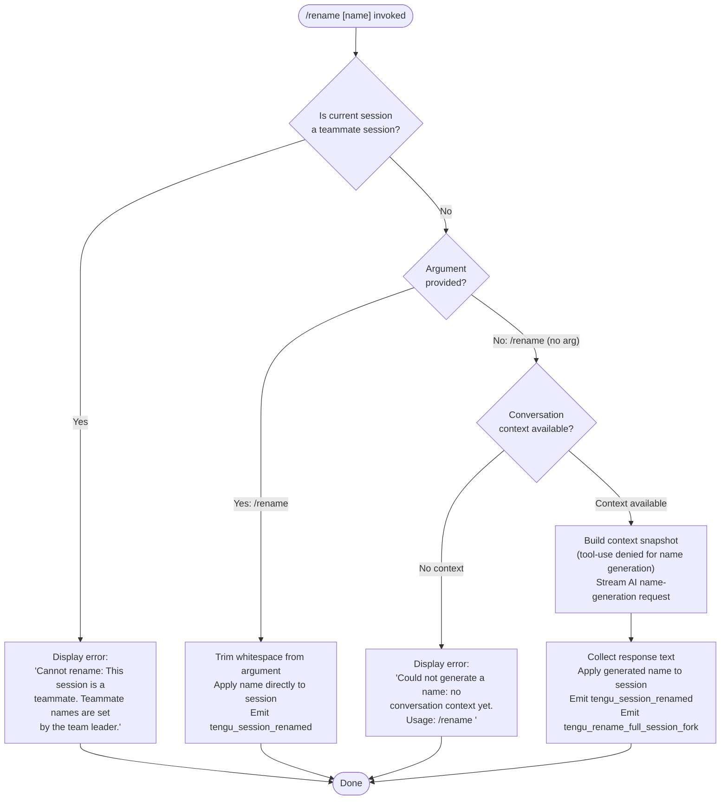

# `/rename`

> Analysis basis: CC v2.1.187 bundle.js (AST extraction + Claude interpretation)
> Minimum version: v2.1.187

---

## Overview

`/rename` sets the display name of the current conversation session. When invoked with an explicit argument the name is applied immediately; when invoked without an argument the command triggers an AI-assisted name-generation flow that uses the existing conversation context to propose a suitable title and then applies it. The command is also accessible via the alias `/name`.

---

## Registration

| Field | Value |
|---|---|
| type | `local-jsx` |
| name | `rename` |
| description | `Rename the current conversation` |
| argumentHint | `[name]` |
| immediate | `true` |
| aliases | `["name"]` |
| module_id | `DIl` |
| load_inline | `true` |
| loc_byte | `12069463` |
| loc_byte_end | `12069662` |
| loc_line | `8094` |
| arbor_handler.name | `Vlf` |
| arbor_handler.fqn | `claude-2.1.187::Vlf` |
| arbor_handler.kind | `AsyncFunction` |
| arbor_handler.resolution_path | `module_id` |
| arbor_handler.n_hits | `0` |

Analysis basis: CC v2.1.187 bundle.js:+12069463

---

## Input Branching

Three distinct paths exist: teammate guard → explicit name argument → AI-generated name. A Mermaid flowchart is required.



---

## Behavioral Spec

### Top-Level Handler (`Vlf`)

`Vlf` is the `AsyncFunction` handler resolved via `module_id` path. It dispatches to two internal sub-handlers depending on whether a name argument was supplied.

Analysis basis: CC v2.1.187 bundle.js:+12069159

```
async function sessionRenameHandler(context, argument):
    result = await dispatchRenameOrApply(context, argument)
    applyResultToState(context, result)
    return renderJsx(result)
```

### Teammate Guard (`Mjn` — apply-name sub-handler)

Before any rename operation `Mjn` checks whether the session is operating in teammate (multi-agent subordinate) mode. If so, it short-circuits with an error message.

Analysis basis: CC v2.1.187 bundle.js:+12068607

```
async function applyName(context, rawName):
    sessionStore = getStore(asyncLocalStorage)          // df → c0 → IRr.getStore
    if sessionStore.isTeammate:
        return errorResult("Cannot rename: This session is a teammate. ...")
    trimmedName = rawName.trim()
    if trimmedName is not empty:
        applyNameToAppState(context, trimmedName)       // t.setAppState
        persistSessionTitle(trimmedName)                // Uie → ec/Di/kd
        logEvent("tengu_session_renamed")
        return successResult(trimmedName)
    else:
        return triggerNameGeneration(context)
```

Error literal: `"Cannot rename: This session is a teammate. Teammate names are set by the team leader."` (bundle.js:+12068627)

### Name-Generation Flow (`Kht` — generate-name orchestrator)

When no name argument is provided, `Kht` orchestrates an AI inference call to generate a session title from the current conversation transcript.

Analysis basis: CC v2.1.187 bundle.js:+12067276

```
async function generateSessionName(context):
    conversationSnapshot = buildSnapshot(context)      // it → V9/q9 chain
    if conversationSnapshot is empty:
        return errorResult(
            "Could not generate a name: no conversation context yet. Usage: /rename <name>"
        )
    // Abort controller attached so generation can be cancelled
    abortController = new AbortController()
    streamRequest = buildNameGenerationRequest(
        conversationSnapshot,
        toolPolicy = "deny",                           // "deny" literal at +12066721
        systemNote = "Session name generation cannot use tools"  // +12066736
    )
    // RSo: timestamps the generation start with Date.now()
    generationStartMs = Date.now()
    rawResponse = await streamingQuery(streamRequest, abortController)  // C0
    generatedName = extractTextFromResponse(rawResponse)   // qlf → MIl → i2.trim
    if generatedName is empty:
        return errorResult("Could not generate a name...")
    applyNameToAppState(context, generatedName)
    logEvent("tengu_session_renamed")
    logEvent("tengu_rename_full_session_fork")
    return successResult(generatedName)
```

Telemetry event `"tengu_rename_full_session_fork"` fires at bundle.js:+12067279.
Telemetry event `"tengu_session_renamed"` fires at bundle.js:+13259784.

### Session Persistence (`Uie` → `Di` — title write)

After a name is resolved (whether explicit or AI-generated), the name is written to durable session storage.

Analysis basis: CC v2.1.187 bundle.js:+12069008

```
async function persistSessionTitle(sessionPath, title):
    filePath = path.join(sessionPath, titleFileName)   // ec → Vk → py.join
    stat = await fs.lstat(filePath)
    if stat.isFile():
        existing = await fs.readFile(filePath)
        parsed = JSON.parse(existing)
        parsed.title = title
        await writeAtomic(filePath, JSON.stringify(parsed))  // kd → Cm → PK.writeFile + PK.rename
    logTelemetry("tengu_bg_state_read_transient")      // +4300026
```

### HTML-Entity Sanitisation (`gVn`)

A utility reached during name generation sanitises HTML entities in strings before display. It replaces the character sequences `&amp;`, `&lt;`, `&gt;`, `&#13;`, `&#10;` using `String.replaceAll`.

Analysis basis: CC v2.1.187 bundle.js:+13667229

```
function decodeHtmlEntities(raw):
    return raw
        .replaceAll("&amp;",  "&")
        .replaceAll("&lt;",   "<")
        .replaceAll("&gt;",   ">")
        .replaceAll("&#13;",  "\r")
        .replaceAll("&#10;",  "\n")
```

Literals confirmed at bundle.js:+13667246 through +13667341.

### Streaming Name-Generation Query (`C0` / `qlf`)

The actual AI request for name generation runs through the general streaming query subsystem. Key behaviours observed in the call graph:

- Tool use is explicitly set to `"deny"` (bundle.js:+12066721) to prevent the model from calling any tools during name generation.
- An AbortController listens for the `"abort"` event (bundle.js:+12066544) so that if the user cancels, the in-flight request is terminated.
- The response text is extracted, trimmed (`i2.trim`, bundle.js:+1188482), and returned as the candidate title.
- The literal `"rename_generate_name"` (bundle.js:+12066839) tags this specific query type for observability.
- The literal `"rename"` (bundle.js:+12066815) labels the command context passed into the query.

Analysis basis: CC v2.1.187 bundle.js:+12066475

### Argument Parsing (`kjn`)

The raw CLI argument string is parsed to produce the name candidate before it is handed off to `applyName`.

Analysis basis: CC v2.1.187 bundle.js:+12063729

```
function parseRenameArgument(rawArgs):
    parts = []
    if Array.isArray(rawArgs):
        parts = rawArgs
    else:
        parts = rawArgs.split(delimiter)
    joined = parts.join(" ")
    return joined.slice(leadingOffset)    // strips command token itself
```

---

## State & Side Effects

| Item | Detail |
|---|---|
| Telemetry: `tengu_rename_full_session_fork` | Fired when AI name generation completes (bundle.js:+12067279) |
| Telemetry: `tengu_session_renamed` | Fired on every successful rename, explicit or generated (bundle.js:+13259784) |
| Telemetry: `tengu_agent_name_set` | Fired when an agent-name variant is applied (bundle.js:+13264236); reached via `uWe` in the call graph |
| Telemetry: `tengu_bg_state_read_transient` | Fired during session-file read in the persistence layer (bundle.js:+4300026) |
| appState changes | Session title field updated via `t.setAppState` (bundle.js:+12068966) |
| File I/O | Session JSON file atomically updated via `PK.writeFile` + `PK.rename` through `Cm` (bundle.js:+1060710, +1060763) |
| AbortController | Registered on the streaming query; listening for `"abort"` event (bundle.js:+12066544) |
| Sound | None observed |
| Hook registration | None observed |

---

## Version History

| Version | Change |
|---|---|
| v2.1.187 | Initial analysis |

---

## Common Mistakes

1. **Invoking `/rename` on a teammate session** — The command will immediately fail with an error; only the team leader can set teammate names.
2. **Invoking `/rename` with no argument at the very start of a conversation** — There is no context for the AI to work with yet. The command returns `"Could not generate a name: no conversation context yet. Usage: /rename <name>"` and does nothing. Supply an explicit name instead.
3. **Expecting tool use during auto-generation** — The name-generation query explicitly runs with `"deny"` tool policy, so any server-side tools that might otherwise resolve contextual information are unavailable during this sub-call.
4. **Conflating `/rename` with `/name`** — Both are identical; `name` is registered as an alias. Either form works, but scripts or documentation should prefer the canonical `rename` form for clarity.
5. **Assuming the rename is synchronous in the UI** — Because `immediate: true` is set, the command is dispatched immediately without waiting for a full agent turn, but the AI-generation path is async. The title may briefly show the old name while the generation request is in flight.

---

## Appendix — Identifier Mapping

> For bundle debugging only. Identifiers change across versions.

| Identifier | Role |
|---|---|
| `Vlf` | Top-level async handler for `/rename` (arbor_handler; entry point) |
| `Mjn` | Apply-name sub-handler; enforces teammate guard, trims argument, calls persistence |
| `Kht` | Generate-name orchestrator; checks context, builds request, collects response |
| `xjn` | Inner dispatch function called from `Vlf`; routes to `gVn` and `Bv` |
| `gVn` | HTML-entity decode utility (replaceAll pass) |
| `Bv` | Secondary utility called from dispatch (role unclear at depth-2) |
| `df` | Async-local-storage accessor wrapper |
| `c0` | Store retrieval helper; calls `IRr.getStore` |
| `RSo` | Timestamps generation start; calls `Date.now` and `ys` |
| `ys` | Conversation-snapshot builder |
| `qlf` | Streaming query wrapper for name generation; manages AbortController |
| `ele` | Pre-query setup helper called from `qlf` |
| `C0` | Core streaming query executor |
| `f4n` | App-state accessor called from `C0` |
| `MIl` | Text-extraction helper; trims generated name via `i2` |
| `i2` | String trim utility |
| `kjn` | CLI argument parser for the rename name token |
| `fee` | Sub-helper called from `kjn` (token splitting) |
| `IF` | Conversation-context collector; feeds snapshot to query |
| `Cc` | Conversation context object (read by `IF`) |
| `oqn` | Context serialisation helper |
| `Kw` | Full agent query orchestrator (shared with main agent loop) |
| `it` | Conversation snapshot builder (iterates messages) |
| `hSn` | Conversation history cache lookup |
| `lBr` | Conversation entry loader; emits events via `XQ.emit` |
| `mBr` | Conversation message fetcher |
| `Dt` | Session-file read helper; calls `_Ee` for config-file access |
| `_Ee` | Low-level config/session file I/O (readFileSync, copyFileSync, mkdirSync) |
| `MRf` | Session file write helper; calls `_Gl.unwatchFile` |
| `Uie` | Session-title persistence orchestrator; calls `ec`, `Di`, `kd`, `Df` |
| `ec` | Path resolver for session file |
| `Vk` | Inner path builder |
| `Di` | Session JSON read/write coordinator (lstat, readFile, writeFile) |
| `kd` | Atomic write helper; delegates to `Cm` |
| `Cm` | Atomic file write via temp-file rename (`PK.writeFile` + `PK.rename`) |
| `fy` | Cache-invalidation helper for session path cache |
| `Df` | Session title display formatter |
| `eS` | Path-basename helper for session naming |
| `ke` | Error-logging helper |
| `fo` | Low-level error formatter |
| `nt` | String coercion utility |
| `Vi` | Internal notification helper |
| `Qru` | Rolling error buffer manager |
| `bVn` | Object-key utility called after `t.setAppState` |
| `tye` | Agent-turn executor (shared, reached via name-gen call graph) |
| `uWe` | Agent-name-set path (fires `tengu_agent_name_set`) |
| `Sz` | Session-file update helper called from `uWe` |
| `Vwt` | File read/write with JSON parse/stringify for session metadata |
| `AVp` | Fork-agent query helper (fires `tengu_fork_agent_query`) |
| `On` | Subagent launcher utility |
| `G8e` | Assistant-message extractor; raises "No assistant message found" on failure |
| `T5l` | Full agent query pipeline (streaming, fallback, tool orchestration) |
| `Pe` | Render/emit helper |
| `W` | Display/write helper |
| `be` | String-conversion wrapper |
| `T` | Logging/tracing utility (emits "debug" level) |
| `Me` | JSON.stringify wrapper |
| `Gt` | JSON.parse wrapper |
| `cn` | Error-code classifier |
| `DM` | Request-ID generator (randomBytes hex) |
| `zL` | Layout/view-state helper |
| `VL` | Core view-layer primitive |
| `kf` | Key formatter helper |
| `kt` | View key builder |
| `Kl` | Filter utility for view items |
| `RI` | Routing/identity helper |
| `Ir` | Internal component renderer |
| `Eu` | Event emitter wrapper |
| `HRr` | Auth-header classifier (detects `/login managed key`, `sk-ant-` prefix) |
| `tse` | Token-scope evaluator |
| `KO` | Key-operation dispatcher |
| `Pt` | Prompt formatter |
| `rqn` | Request-queue node |
| `oKp` | Content-block mapper |
| `fal` | Fallback-request node builder |
| `KSo` | Known-server-output parser |
| `s3` | Snapshot record builder |
| `dEe` | Debug/diagnostic file appender |
| `Rc` | Result classifier |
| `Xte` | Extended-title write path |
| `i6` | Internal session-event emitter |
| `EL` | Extended log writer |
| `a9e` | MCP session lifecycle manager |
| `RB` | MCP connection result applier |
| `Qw` | MCP event queue handler |
| `mua` | MCP connection initiator |
| `myn` | MCP capability mapper |
| `pyn` | MCP plugin resolver |
| `ln` | MCP debug logger |
| `zRn` | MCP retry/reconnect handler |
| `BUt` | MCP connection batcher |
| `mJr` | MCP config-change reactor |
| `eL` | MCP client event listener |
| `ZXr` | MCP include-filter checker |
| `Vc` | MCP error logger |
| `yua` | MCP auth-state helper |
| `git` | MCP retry-count parser |
| `nMn` | MCP max-retry parser |
| `brr` | MCP connection-result applier |
| `i9e` | MCP connection-status updater |
| `KT` | MCP cleanup coordinator |
| `hla` | MCP heartbeat helper |
| `JNl` | Session-list notification helper |
| `uBo` | MCP server lifecycle orchestrator |
| `xRn` | MCP server-filter helper |
| `Kn` | Timeout/retry scheduler |
| `mit` | MCP init helper |
| `Pce` | Process-context helper |
| `Nu` | Notification utility |
| `QPe` | Quiet-progress emitter |
| `NI` | Node-identity helper |
| `CU` | Conversation-unit builder |
| `X6` | Race/all promise coordinator |
| `Le` | Leave/exit helper |
| `Re` | Result emitter |
| `kn` | Key-normaliser |
| `Jd` | Journal/debug helper |
| `Z8e` | File-stat helper (stat, isFile, size guard 1 MB) |
| `f$l` | File display formatter |
| `OEc` | Orchestrator event callback |
| `A` | Animation/progress controller |
| `I` | Input controller |
| `d` | Daemon session watcher |
| `E` | Event-loop stopper |
| `u` | Utility bundle (Le, Re, CU, X6) |
| `l` | Session list manager |
| `o` | Output formatter |
| `m` | MCP client map manager |
| `w` | Window focus/blur handler |
| `Sz` | Session-metadata file updater |
| `rKe` | Render-key extractor |
| `_E` | Internal error type |
| `Dce` | Deferred-close helper |
| `Ace` | Abort/cancel executor |
| `lk` | Lock helper |
| `Zte` | Zone/timeout enforcer |
| `q8n` | Queue-node builder |
| `SBa` | State-based action helper |
| `cce` | Context-collection executor |
| `m4n` | Message-map node |
| `j5` | Job scheduler |
| `Di` | (see above — session JSON coordinator) |

---

Note: index built via Arbor fallback; some signals (telemetry, literals) may be missing — see arbor-fallback.js.