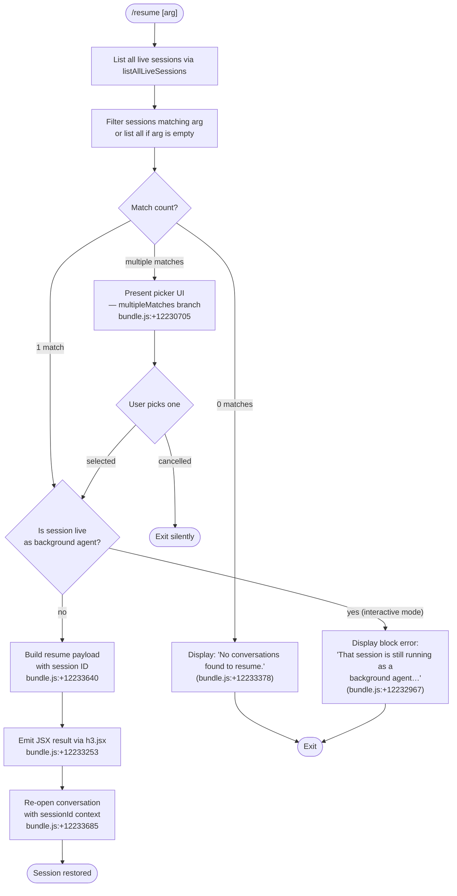

# `/resume`

> Analysis basis: CC v2.1.187 bundle.js (AST extraction + Claude interpretation)
> Minimum version: v2.1.187

---

## Overview

`/resume` (aliased as `/continue`) allows users to pick up a previous conversation by specifying a conversation ID or a free-text search term. The command enumerates existing sessions, filters and ranks them against the provided input, then re-opens the matched conversation — blocking if that session is currently running as a background agent and surfacing an error in that case.

---

## Registration

| Field | Value |
|---|---|
| type | `local-jsx` |
| name | `resume` |
| description | `Resume a previous conversation` |
| aliases | `["continue"]` |
| argumentHint | `[conversation id or search term]` |
| module_id | `yLl` |
| load_inline | `true` |
| loc_byte | `12234323` |
| loc_byte_end | `12234520` |
| loc_line | `8132` |
| arbor_handler.name | `Lpf` |
| arbor_handler.fqn | `claude-2.1.187::Lpf` |
| arbor_handler.kind | `AsyncFunction` |
| arbor_handler.resolution_path | `module_id` |
| arbor_handler.n_hits | `0` |

Analysis basis: CC v2.1.187 bundle.js:+12234323

---

## Input Branching

The handler exhibits four distinct top-level branches depending on session discovery and the argument provided, so a flowchart is used.



---

## Behavioral Spec

### Session Discovery

The handler begins by calling the session-listing utility (`YHe`) to retrieve live sessions.

```
async function listLiveSessions():
    resolve immediately (Promise.resolve)
    call sessionStore.listAllLiveSessions()       // bundle.js:+8577835
    filter sessions whose mode === "interactive"  // bundle.js:+8577926
    return filtered session list
```

Analysis basis: CC v2.1.187 bundle.js:+12232957

### Argument Matching and Filtering

The raw argument (if any) is lowercased and used to filter the session list. Matching is performed inside the filtering helper (`_Ll` → `filterSessions`).

```
function filterSessions(sessions, rawArg):
    if rawArg is empty:
        return sessions  // show all
    query = rawArg.toLowerCase()
    return sessions.filter(session =>
        sessionMatchesQuery(session, query)        // mh utility
    )
```

Analysis basis: CC v2.1.187 bundle.js:+12232853, +12232883

### Background-Agent Guard

Before resuming, the handler checks whether the matched session is flagged as actively running in the background. If so, it surfaces a blocking error message rather than opening the session.

```
function checkNotLiveBackgroundSession(session):
    if session.mode === "interactive" AND session.isRunningAsAgent:
        // literal message (bundle.js:+12232967):
        // "That session is still running as a background agent…"
        return { blocked: true, message: BACKGROUND_BLOCK_MSG }
    return { blocked: false }
```

Analysis basis: CC v2.1.187 bundle.js:+12232965, +12232967

### Worktree Detection

The worktree helper (`zHe`) is invoked during session metadata enrichment. It runs `git worktree list --porcelain` and parses the output to associate sessions with their working directories.

```
async function detectWorktrees(cwd):
    timestamp = Date.now()                          // bundle.js:+8566382
    run: git worktree list --porcelain              // bundle.js:+8566437,8566444
    split output by newline                         // bundle.js:+8566607
    for each line starting with "worktree ":        // bundle.js:+8566645
        extract path (slice from offset 9)          // bundle.js:+8566671
        normalise path via TH (NFC normalisation)   // bundle.js:+8566668
    filter and locale-compare results               // bundle.js:+8566817,8566850
    emit telemetry: tengu_worktree_detection        // bundle.js:+8566526
    return worktree list
```

Analysis basis: CC v2.1.187 bundle.js:+12233310

### Conversation History Loading

The conversation storage module (`C5e`) is called to load the full transcript of the target session. It delegates to the indexed conversation file reader (`Qle`), which reads the binary log, parses JSONL-style records, and returns structured message chains.

```
async function loadConversationHistory(sessionId):
    state = n9l()                // initialise index state
    records = Qle(sessionId)     // read and parse binary transcript
    filter by message roles:     // assistant, user, system, attachment
    resolve compact_boundary markers
    build ordered chain with parent-uuid links
    return { messages, metadata }
```

Analysis basis: CC v2.1.187 bundle.js:+12233685, +13277860, +13275697

### Picker UI (Multiple Matches)

When more than one session matches the query, the handler renders an interactive picker component via JSX.

```
function renderPicker(sessions, onSelect, onCancel):
    sessions = sortedByTimestamp(sessions)          // nKt comparator bundle.js:+13252120
    render SelectList component
    on selection → onSelect(session)
    on Escape → onCancel()
```

Telemetry event `slash_command_session_id` is recorded on selection (bundle.js:+12233640).
Telemetry event `slash_command_title` is recorded after the session title is resolved (bundle.js:+12233865).

Analysis basis: CC v2.1.187 bundle.js:+12230705

### "No Conversations Found" Sentinel

When the filtered list is empty, the handler emits a JSX element with the static message literal and returns.

```
function handleNoMatches():
    // literal: "No conversations found to resume." (bundle.js:+12233378)
    render StaticMessage(NO_CONVERSATIONS_MSG)
    emit telemetry event: slash_command_session_id with value "sessionNotFound"
    // "sessionNotFound" literal at bundle.js:+12230634
    return
```

Analysis basis: CC v2.1.187 bundle.js:+12233314

### Resume Payload Construction

When exactly one unblocked session is identified, the handler assembles a resume descriptor and triggers session re-entry.

```
function buildResumePayload(session):
    payload = {
        sessionId:  session.id,          // slash_command_session_id
        title:      session.title,       // slash_command_title
        timestamp:  Date.now(),          // bundle.js:+12233286
    }
    apply conversation role filter:      // "user" literal bundle.js:+12233108
    apply skip-compacted check:          // "skip" literal bundle.js:+12233170
    return payload
```

The resulting payload is rendered as a JSX element (`h3.jsx`) and handed to the session-entry layer (`JHe` / conversationLoader).

Analysis basis: CC v2.1.187 bundle.js:+12233253

### Bold Styling Helper

The module `gLl` provides terminal bold formatting for the session title line displayed in the picker and in error messages.

```
function boldText(text):
    return St.bold(text)    // bundle.js:+12230669
```

Analysis basis: CC v2.1.187 bundle.js:+12233915

---

## State & Side Effects

| Item | Detail |
|---|---|
| Telemetry — `tengu_worktree_detection` | Fired on each git worktree probe (bundle.js:+8566526) |
| Telemetry — `tengu_daemon_control` | Fired when daemon control messages are exchanged (bundle.js:+17233792) |
| Telemetry — `tengu_bg_attach` | Fired when attaching to a background session (bundle.js:+17187248) |
| Telemetry — `tengu_bg_attach_stall_gave_up` | Fired when a background attach stalls and is abandoned (bundle.js:+17188178) |
| Telemetry — `tengu_bg_attach_stall_respawn` | Fired when a stalled attach triggers a worker respawn (bundle.js:+17188448) |
| Telemetry — `tengu_bg_attach_kick` | Fired when an attach kicks an existing session (bundle.js:+17189445) |
| Telemetry — `tengu_bg_attach_legacy_autorespawn` | Fired for legacy background-session auto-respawn during attach (bundle.js:+17185989) |
| Telemetry — `tengu_bg_attach_upgrade` | Fired when an attach triggers a Claude Code version upgrade path (bundle.js:+13053438) |
| Telemetry — `tengu_bg_proto_mismatch` | Fired on background daemon protocol version mismatch (bundle.js:+17181686) |
| Telemetry — `tengu_bg_dispatch_stale_drop` | Fired when a stale dispatch is dropped (bundle.js:+17183085) |
| Telemetry — `tengu_bg_dispatch_sigkill_escalate` | Fired when a background worker is SIGKILL-escalated (bundle.js:+17196063) |
| Telemetry — `tengu_bg_dispatch_low_mem` | Fired on low-memory condition during dispatch (bundle.js:+17196664) |
| Telemetry — `tengu_bg_low_mem_mb` | Reports current free memory in MB under low-mem conditions (bundle.js:+13053248) |
| Telemetry — `tengu_bg_retire_pinned_low_mem` | Fired when pinned workers are retired due to memory pressure (bundle.js:+17200753) |
| Telemetry — `tengu_bg_retire_grace_bridged_min` | Fired on grace-period retirement (bundle.js:+13053366) |
| Telemetry — `tengu_bg_sendclaim_failed` | Fired when a spare-session claim send fails (bundle.js:+17172323) |
| Telemetry — `tengu_bg_spare_enable` | Fired when spare session mode is enabled (bundle.js:+17197361) |
| Telemetry — `tengu_bg_spare_claim` | Fired on successful spare session claim (bundle.js:+17197489) |
| Telemetry — `tengu_bg_spare_claim_fail` | Fired on failed spare claim (bundle.js:+17197755) |
| Telemetry — `tengu_bg_prewarm_per_sweep` | Fired each daemon sweep when prewarming is active (bundle.js:+17200874) |
| Telemetry — `tengu_daemon_config_reload` | Fired when daemon config is reloaded (bundle.js:+17212183) |
| Telemetry — `tengu_daemon_idle_exit` | Fired when daemon exits due to idle timeout (bundle.js:+17217625) |
| Telemetry — `tengu_daemon_yield` | Fired when the daemon yields to a foreground process (bundle.js:+17216595) |
| Telemetry — `tengu_feature_ok` / `tengu_feature_bad` | Fired on feature flag evaluation hits/misses (bundle.js:+1025122, +1025189) |
| Telemetry — `tengu_scheduled_task_fire` / `tengu_scheduled_task_expired` | Fired by the task scheduler reached during conversation loading (bundle.js:+16517650, +16517993) |
| Telemetry — `tengu_transcript_phantom_parent` | Fired when an orphaned transcript parent reference is detected (bundle.js:+13272445) |
| Telemetry — `tengu_transcript_parent_cycle` | Fired on detected parent-cycle in transcript chain (bundle.js:+13276365) |
| Telemetry — `tengu_chain_parent_cycle` | Fired at chain-level parent-cycle detection (bundle.js:+13252340) |
| Telemetry — `tengu_chain_timestamp_fallback` | Fired when chain timestamp must fall back to alternative (bundle.js:+13252489) |
| Telemetry — `tengu_chain_parallel_tr_recovered` | Fired when parallel transcript record conflict is recovered (bundle.js:+13254355) |
| Telemetry — `tengu_relink_walk_broken` | Fired on broken relink walk in transcript store (bundle.js:+13251846) |
| appState changes | The resolved `sessionId` and `title` are stored as slash-command context for the new session frame |
| Side effect — git | Spawns `git worktree list --porcelain` in the working directory to detect worktrees |
| Side effect — filesystem | Reads binary transcript files via synchronous file I/O (`openSync` / `readSync`) during history loading |
| Side effect — daemon IPC | May connect to background daemon socket (`Yrr.connect`) if target session is managed by the daemon |

---

## Version History

| Version | Change |
|---|---|
| v2.1.187 | Initial analysis |

---

## Common Mistakes

1. **Running `/resume` while a background agent is active** — if the target session is currently executing as a background agent, the command will print the blocking message ("That session is still running as a background agent…") and do nothing. Use `claude agents` to attach to or stop it first.
2. **Ambiguous search terms** — if the provided term matches multiple sessions, a picker is shown. Providing the full session UUID (or a unique prefix) bypasses the picker and resumes immediately.
3. **No argument with many sessions** — omitting the argument lists every session in the picker. On large histories this can be unwieldy; supplying a partial title or UUID is more efficient.
4. **Confusing `/resume` with `/continue` behaviour** — both names are registered aliases and are functionally identical; there is no difference in execution path.
5. **Expecting cross-machine session access** — session discovery is purely local: `listAllLiveSessions` queries the local daemon socket and filesystem only.

---

## Appendix — Identifier Mapping

> For bundle debugging only. Identifiers change across versions.

| Identifier | Role |
|---|---|
| `Lpf` | Main handler for `/resume` (AsyncFunction, arbor_handler) |
| `_Ll` | Session-list filter wrapper; applies query to raw session array |
| `mh` | Session query-match predicate |
| `YHe` | Live-session lister; calls `listAllLiveSessions` |
| `zHe` | Worktree detection utility; runs `git worktree list --porcelain` |
| `Wr` | Subprocess / child-process runner used by worktree detection |
| `N1e` | Core subprocess executor; wraps spawn, timeout, kill lifecycle |
| `ke` | Logger / error-reporter (calls `jJ.logError`) |
| `be` | String coercion helper |
| `gr` | Home-directory resolver (uses `VL`) |
| `T7n` | Context-file loader; loads extra context into conversation frame |
| `dKt` | Conversation context builder; joins files, calls `r9l` |
| `r9l` | Recursive file-tree resolver for context loading |
| `fqe` | Conversation binary-log segment reader (Buffer.alloc based) |
| `kvf` | Low-level binary-log block parser |
| `MM` | UUID-format validator (`kIc.test`) |
| `dte` | Conversation metadata loader |
| `JHe` | Full conversation history assembler; delegates to `Qle` |
| `Qle` | Transcript index builder; reads and indexes all message types |
| `KCf` | Transcript file path constructor |
| `N5` | Conversation metadata key resolver |
| `qJt` | JSONL record parser |
| `GJt` | JSONL line classifier |
| `WJt` | JSONL string unescaper |
| `PA` | Conversation metadata persistence helper |
| `a9e` | MCP connection initialiser |
| `brr` | MCP connection result applicator |
| `hla` | MCP plugin configuration reader |
| `uBo` | MCP server orchestrator (connects/disconnects per config) |
| `bJf` | Background daemon protocol message dispatcher |
| `C3o` | Daemon socket connection manager |
| `x3o` | Daemon session lifecycle manager (spawn, retire, cleanup) |
| `Evf` | Binary transcript file writer/reader (openSync/readSync loop) |
| `Svf` | Binary transcript header reader |
| `yvf` | Binary transcript sequential record reader |
| `w3l` | In-memory conversation chain walker |
| `ovf` | Conversation chain node resolver |
| `YAe` | UTF-8 BOM-aware text decoder |
| `XHe` | Conversation chain builder from flat record list |
| `avf` | Parallel-transcript record conflict detector |
| `lvf` | Conversation chain sorter and deduplicator |
| `svf` | Chain segment shift-and-queue helper |
| `Z3l` | Chain segment grouper |
| `nKt` | Conversation timestamp parser/comparator (`Date.parse`) |
| `out` | Conversation record mapper |
| `fDo` | Compact-summary token replacer |
| `yqt` | Conversation message text extractor |
| `ml` | Regex-based message-type classifier |
| `hDo` | Attachment/image message type checker |
| `cvf` | Content-type predicate (checks `Array.isArray`, `.some`) |
| `uvf` | Content-type predicate variant |
| `LJn` | Conversation chain parent-link resolver |
| `kJn` | Conversation chain values flattener |
| `C5e` | Conversation store facade (main public API for history reads) |
| `n9l` | Conversation store initialiser |
| `Avf` | Conversation directory resolver |
| `M$` | Conversation home path builder |
| `Ew` | Directory walker for conversation files |
| `eDo` | Per-entry content dispatcher (delegates to `fDo`, `out`, `hDo`) |
| `Nye` | Conversation title resolver |
| `jY` | Session search / ranking function (lowercase compare, locale sort) |
| `gLl` | Terminal bold-text formatter (`St.bold`) |
| `VL` | Home-directory constant provider |
| `TH` | Path normaliser (NFC Unicode normalisation) |
| `JNl` | Daemon status-file reader (`daemon.status.json`) |
| `SQ` | Daemon status decoder |
| `Xs` | AsyncLocalStorage store accessor |
| `tVt` | Daemon status file path builder |
| `GXn` | Memory pressure sampler |
| `DVt` | Daemon low-memory sweeper |
| `V2l` | Worker upgrade checker |
| `WXn` | Upgrade path handler |
| `N2e` | Conversation cache file manager (lstat / rm / readFile) |
| `kiu` | Buffer-size string formatter |
| `sp` | Process signal handler |
| `Re` | Feature-flag "bad" reporter |
| `Le` | Feature-flag "ok" reporter |
| `Pe` | Error code classifier (`rKe`) |
| `Kn` | Connection retry/backoff scheduler |
| `it` | Worker identity tracker |
| `C3o` | Daemon socket connection establisher (`Yrr.connect`) |
| `Fo` | Conversation chain error reporter |
| `Xo` | Conversation namespace resolver (`cn`) |
| `O` | Conversation record type discriminator |
| `V` | Scheduled-task runner |
| `oOt` | Task token budget calculator |
| `Bwn` | Task recurrence budget adjuster |
| `kdc` | Task boolean-flag coercer |
| `tK` | Task deduplication set checker |
| `pae` | Task filter predicate |
| `L` | Background-worker lifecycle manager |
| `w` | Worker idle-clock tracker |
| `k` | Worker clock updater |
| `z` | Worker prewarm instance |
| `f` | Daemon foreground-session manager |
| `D` | Daemon worker instance |
| `U` | Worker retire-if-settled scheduler |
| `F` | Worker interval handle holder |
| `H` | Background session protocol handler (MCP-over-socket) |
| `bJf` | Daemon IPC frame dispatcher |
| `mp` | Daemon IPC message serialiser |
| `Gt` | JSON parser wrapper |
| `XSe` | JSON parse error wrapper |
| `se` | Terminal/PTY escape-sequence parser |
| `ee` | MCP session update handler |
| `Zye` | File-history array filter |