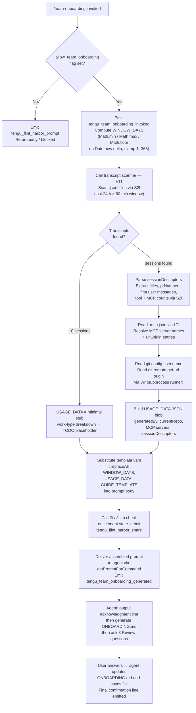

# `/team-onboarding`

> Analysis basis: CC v2.1.187 bundle.js (AST extraction + Claude interpretation)
> Minimum version: v2.1.187

---

## Overview

`/team-onboarding` is a `prompt`-type slash command that scans the invoking user's local Claude Code conversation transcripts from the past N days, classifies their work into task-type buckets, and co-authors a ready-to-share `ONBOARDING.md` guide tailored to their team's actual usage patterns. The guide is designed so that a new teammate can paste it directly into Claude Code to receive an interactive onboarding walkthrough. The command is gated by an `allow_team_onboarding` flag checked at dispatch time.

---

## Registration

| Field | Value |
|---|---|
| type | `prompt` |
| name | `team-onboarding` |
| description | `Help teammates ramp on Claude Code with a guide from your usage` |
| isHidden | `false` |
| handler_method | `getPromptForCommand` |
| handler_method_start (loc_byte) | `13029400` |
| handler_method_end (loc_byte) | `13030110` |
| loc_byte | `13029037` |
| loc_byte_end | `13030111` |
| loc_line | `8971` |
| prompt_body.length | `4539` characters |
| prompt_body.trace | `identifier→l (local→1 ext vars)` |
| arbor_handler.name | `getPromptForCommand` |
| arbor_handler.kind | `Method` |
| arbor_handler.resolution_path | `direct` |
| arbor_handler.fqn | `claude-2.1.187::getPromptForCommand` |
| arbor_handler.n_hits | `2` |
| `handler_method_start` | `13029400` |
| `handler_method_end` | `13030110` |

Analysis basis: CC v2.1.187 bundle.js:+13029037

---

## Input Branching

The handler has four or more distinct paths: feature-flag gate, transcript data scan (with window-days computation), template variable substitution, and final prompt assembly. A Mermaid flowchart is required.



Analysis basis: CC v2.1.187 bundle.js:+13029400

---

## Behavioral Spec

### 1. Feature-flag gate (`fft` / `Js`)

```
function checkTeamOnboardingEntitlement(context):
    entitlements = getActiveEntitlements(context)          // Js
    if NOT entitlements.has("allow_team_onboarding"):      // bundle.js:+10176264
        emitTelemetry("tengu_flint_harbor_prompt")         // bundle.js:+13029437
        return BLOCKED
    emitTelemetry("tengu_flint_harbor_share")              // bundle.js:+10176326
    return ALLOWED
```

The string literal `"allow_team_onboarding"` (bundle.js:+10176264) is the exact entitlement key. The `fft` → `Js` call chain resolves the current account's tier (literals include `"enterprise"`, `"team"`, `"prosumer_oauth"`, `"no_auth"`) and returns whether the flag is active.

Analysis basis: CC v2.1.187 bundle.js:+10176243

---

### 2. Window-days computation (handler inline)

```
function computeWindowDays(nowMs, config):
    rawDays = (nowMs - config.firstSessionTimestamp) / MS_PER_DAY
    days = Math.floor(Math.max(1, Math.min(365, rawDays)))
    return days
```

The window is clamped between **1 and 365 days** (literals `1` at bundle.js:+13029646 and `365` at bundle.js:+13029649) using `Math.min`, `Math.max`, and `Math.floor`. `Date.now()` is called at bundle.js:+13029749 to anchor the window.

Analysis basis: CC v2.1.187 bundle.js:+13029603

---

### 3. Transcript scanner (`kTf` / `S2l`)

```
function scanTranscripts(transcriptDir, windowMs):
    // S2l — bundle.js:+13020434
    files = fs.readdir(transcriptDir)                         // rHt.readdir :+13017995
    jsonlFiles = files.filter(f => extname(f) == ".jsonl")    // :+13018065
    cutoff = Date.now() - windowMs                            // :+13017954
    results = await Promise.all(
        jsonlFiles
            .filter(f => f.stat().mtime >= cutoff)
            .map(f => fs.readFile(f))                         // rHt.readFile :+13018338
    )
    sessions = []
    for each fileContent in results:
        lines = fileContent.split("\n")                       // l.split :+13018452
        for each line in lines:
            if line includes "\"name\":\"mcp__":              // :+13018661
                recordMcpToolUse(line)
            if line includes "\"content\":[":                 // :+13019011
                extractFirstUserMessage(line)
            match TTf regex for session title                 // :+13018802
            match ITf regex for PR numbers                   // :+13018858
            match CTf regex for content metadata             // :+13019033
        sessions.push(buildSessionDescriptor(...))
    return sessions
```

The scanner reads only `.jsonl` files (bundle.js:+13018082) within the computed time window. It uses three distinct regex patterns (`TTf`, `ITf`, `CTf`) to extract session titles, pull-request numbers, and content metadata respectively. MCP tool usage is identified by the prefix string `"\"name\":\"mcp__"` (bundle.js:+13018661). Sessions with fewer than 3 content blocks (literal `3` at bundle.js:+13019114) are treated as minimal and skipped during descriptor building.

Analysis basis: CC v2.1.187 bundle.js:+13020413

---

### 4. MCP server reader (`LTf`)

```
function readMcpServers(workspaceRoot):
    // LTf — bundle.js:+13020551
    mcpJsonPath = path.join(workspaceRoot, ".mcp.json")   // :+13020101, literal :+13020112
    raw = fs.readFile(mcpJsonPath)
    parsed = JSON.parse(raw)                               // via Gt :+13020135
    servers = parsed["mcpServers"] ?? {}                   // literal :+13020168
    return servers.map(entry => ({
        name: entry.name,
        urlOrigin: entry.urlOrigin ?? null,
        inferredPurpose: deriveServerPurpose(entry)        // kn / T helpers :+13020264
    }))
```

The `.mcp.json` file (bundle.js:+13020112) is read from the workspace root. The `"mcpServers"` key (bundle.js:+13020168) is the top-level array. If the file is absent, the server list defaults to empty and no error is surfaced to the user.

Analysis basis: CC v2.1.187 bundle.js:+13020551

---

### 5. Git metadata reader (`Wr`)

```
function readGitMetadata(cwd):
    // Wr — bundle.js:+13020732
    authorName = runSubprocess(["git", "config", "user.name"], cwd)
    //           literals: "git" :+13020735, "config" :+13020742, "user.name" :+13020751
    remoteUrl  = runSubprocess(["git", "remote", "get-url", "origin"], cwd)
    //           literals: "remote" :+13020807, "get-url" :+13020816, "origin" :+13020826
    return { authorName, remoteUrl }
```

The subprocess runner (`Wr` → `N1e`) supports a timeout of **1,000,000 ms** (bundle.js:+1139395) and uses `ke` / `jJ.logError` for error reporting. Both commands target the current working directory.

Analysis basis: CC v2.1.187 bundle.js:+13020732

---

### 6. Template variable substitution (handler inline)

```
function buildFinalPrompt(promptTemplate, windowDays, usageData, guideTemplate):
    s1 = promptTemplate.replaceAll("{{WINDOW_DAYS}}", String(windowDays))
    //   literals :+13029860, :+13029878
    s2 = s1.replaceAll("{{GUIDE_TEMPLATE}}", guideTemplate)
    //   literal :+13029900
    s3 = s2.replaceAll("{{USAGE_DATA}}", JSON.stringify(usageData))
    //   literal :+13029935
    return s3
```

Three template placeholders are substituted in sequence (bundle.js:+13029847). The guide template (`{{GUIDE_TEMPLATE}}`) is resolved from an internal constant; `{{USAGE_DATA}}` is serialized from the aggregated scan result. The final string is tagged as type `"text"` (bundle.js:+13030094) before being returned from `getPromptForCommand`.

Analysis basis: CC v2.1.187 bundle.js:+13029847

---

### 7. Agent-side guide generation (prompt instructions)

The assembled prompt instructs the agent to perform the following steps in strict order:

**Step 1 — Immediate acknowledgment.** The very first visible output must be a block-quoted line summarising the look-back window and the onboarding purpose (referencing `{{WINDOW_DAYS}}`). No classification or tool calls may precede it.

**Step 2 — Work-type classification.** The agent reads the `sessionDescriptors` array and assigns each session to one of seven canonical task types:

| Internal key | Display label |
|---|---|
| `build_feature` | Build Feature |
| `debug_fix` | Debug Fix |
| `improve_quality` | Improve Quality |
| `analyze_data` | Analyze Data |
| `plan_design` | Plan Design |
| `prototype` | Prototype |
| `write_docs` | Write Docs |

The agent selects the top 3–5 categories with approximate percentages. If session data is absent (≈0 sessions), the breakdown is left as a `TODO` placeholder.

**Step 3 — Repo and MCP enumeration.** The agent anchors on `currentRepo` from the usage data, checks for sibling directories in the workspace, and infers each MCP server's purpose from its `name` and optional `urlOrigin`.

**Step 4 — Guide authoring.** The agent writes `ONBOARDING.md` using the embedded guide template, populating real numbers (not placeholder text). ASCII bar charts use `█` (filled) and `░` (empty) at 20 characters wide. The `generatedBy` field provides the author name; if absent, the name is omitted. An HTML comment instruction at the bottom of the template is preserved verbatim.

**Step 5 — Collaborative review loop.** The guide is rendered in a fenced code block, followed by a `---` horizontal rule and a `**Review**` heading. Under the heading the agent poses exactly three numbered questions covering: (1) team name confirmation, (2) a starter task or link, (3) any additional team tips not already in `CLAUDE.md`. After the user responds the agent updates `ONBOARDING.md` and closes with the exact confirmation line described in the prompt body. All subsequent user edits are applied to the file.

Analysis basis: CC v2.1.187 bundle.js:+13029400 – +13030110

---

## State & Side Effects

| Item | Detail |
|---|---|
| Telemetry — invocation gate | `tengu_flint_harbor_prompt` (bundle.js:+13029437) — fired when the `getPromptForCommand` method is entered |
| Telemetry — entitlement share | `tengu_flint_harbor_share` (bundle.js:+10176326) — fired when the entitlement check passes |
| Telemetry — command invoked | `tengu_team_onboarding_invoked` (bundle.js:+13029660) — fired after window-days computation succeeds |
| Telemetry — guide generated | `tengu_team_onboarding_generated` (bundle.js:+13029979) — fired after prompt assembly completes |
| Telemetry — config lock | `tengu_config_lock_contention` (bundle.js:+13750291) — fired if config file lock is contested during scan |
| Telemetry — config stale write | `tengu_config_stale_write` (bundle.js:+13750427) |
| Telemetry — config parse error | `tengu_config_parse_error` (bundle.js:+13752866) |
| Telemetry — config auth loss | `tengu_config_auth_loss_prevented` (bundle.js:+13750770) |
| Telemetry — config fallback write | `tengu_config_fallback_write` (bundle.js:+13749907) |
| File read | Local `.jsonl` transcript files under the CC data directory (read-only during scan) |
| File read | `.mcp.json` in workspace root (read-only) |
| File write | `ONBOARDING.md` created/updated in the current working directory as part of the agent conversation |
| Subprocess | `git config user.name` and `git remote get-url origin` spawned in `cwd` via `Wr` / `N1e` |
| Config lock | File lock acquired on the CC config via `GQn`; warning emitted if another Claude instance is detected (literal: `"Lock acquisition took longer than expected…"` bundle.js:+13750202) |
| appState changes | None detected at depth-2 traversal |
| Sound | None detected at depth-2 traversal |
| Hook registration | None detected at depth-2 traversal |

---

## Version History

| Version | Change |
|---|---|
| v2.1.187 | Initial analysis |

---

## Common Mistakes

1. **Invoking without the entitlement.** If the account does not carry the `"allow_team_onboarding"` entitlement (e.g. a `no_auth` or personal free-tier session), the command silently returns after emitting `tengu_flint_harbor_prompt`. There is no visible error message, so users may think the command hung.

2. **Running outside a git repository.** The `Wr` subprocess calls `git config user.name` and `git remote get-url origin`. In a non-git directory both commands fail; the handler tolerates the failure but the generated guide will contain empty author-name and repository fields.

3. **Empty transcript directory.** If no `.jsonl` files exist within the computed window (e.g. first-time user or all sessions are older than the clamped 365-day maximum), the `sessionDescriptors` array will be empty and the work-type breakdown section will be rendered as a `TODO` placeholder rather than real percentages.

4. **Missing `.mcp.json`.** If the workspace has no `.mcp.json` file the MCP server section of the guide is omitted; `LTf` handles the `ENOENT` case silently. Teams that use MCP servers configured only in global settings will not see them reflected in the guide.

5. **Editing `ONBOARDING.md` before answering Review questions.** The agent appends the team name, starter task, and team tips only after the three Review questions are answered. Editing the file manually before replying to the Review section may cause the agent to overwrite those edits when it applies the answers.

6. **Expecting the guide immediately without interactive input.** The command is a `prompt`-type, not an action-type. It injects a prompt into the running conversation; the user must be in an active Claude Code session. Running it non-interactively (e.g. via `--print` flag) will produce raw text output rather than writing `ONBOARDING.md`.

---

## Appendix — Identifier Mapping

> For bundle debugging only. Identifiers change across versions.

| Identifier | Role |
|---|---|
| `__handler_team-onboarding` | Synthetic BFS entry point for the `getPromptForCommand` ObjectMethod |
| `it` | Telemetry event emitter / experiment logging dispatcher |
| `ext` | External config/context accessor used by telemetry emitter |
| `txt` | Text formatting utility used by telemetry emitter |
| `V9` | Intermediate telemetry pipeline stage |
| `q9` | Telemetry event queue/flush helper |
| `M2` | Telemetry record constructor (wraps `uid`, `zH`, `I1e`) |
| `hSn` | Telemetry deduplication guard (checks `zIe`/`uBr` sets) |
| `lBr` | Telemetry batch sender (emits `GrowthbookExperimentEvent`, calls `XQ.emit`) |
| `u$e` | Sub-helper called by batch sender (`xw`) |
| `yW` | Random-bytes token generator (32-byte hex, used for experiment IDs) |
| `Me` | JSON serialiser wrapper |
| `lad` | Telemetry label/tag builder |
| `mBr` | Telemetry dispatch coordinator (calls `uli`, `Ur`, `wEi`, `J$`, `eh`, `Dt`) |
| `uli` | Utility helper calling `hZe` |
| `Ur` | Upstream relay / `PG` caller |
| `wEi` | Write-event integration helper |
| `J$` | Set-membership check helper (`stu.has`) |
| `eh` | Error-handling wrapper for telemetry dispatch (`tde`, `Dt`, `Sa`) |
| `Dt` | Core telemetry dispatch function (`Wt`, `n0`, `MOo`, `_Ee`, `Date.now`, `MRf`) |
| `W` | General-purpose utility / logging helper |
| `hn` | Transcript data aggregator; orchestrates `_Ee`, `MHt`, `BQn`, `DOo`, `MKt`, `T` |
| `GQn` | Config file read/write with advisory lock; emits `tengu_config_lock_contention` |
| `Wt` | Filesystem path resolver utility |
| `_Ws` | Config object merger (`jRr` + `Object.assign`) |
| `jRr` | Config field normaliser (`HWs`) |
| `T` | File-write helper with backup rotation (`gOe`, `Xwc`, `Me`, `wc`, `dze`, `eLc`) |
| `Xwc` | File-write sub-step (`JP`, `xcr`, `I6o`) |
| `wc` | Path suffix / extension utilities (`c8o`, `e.replace`, `r.at`, `n.lastIndexOf`, `n.slice`) |
| `dze` | Directory walker helper (`JWo`) |
| `eLc` | File-content writer with byte-length check and promise chain (`FKe`, `dpe`, `Ucr`, `Zwc`, `Ei`) |
| `cn` | Error-code normaliser / classifier |
| `_Ee` | Config file reader with backup logic (`HGl`, `NOo`, `u9`, `String`, `T`) |
| `Gt` | JSON.parse wrapper |
| `u9` | String prefix stripper (`e.startsWith`, `e.slice`) |
| `HGl` | Backup-directory scanner (`IS.basename`, `NOo`, `t.readdirStringSync`, `IS.join`, `IS.dirname`) |
| `NOo` | Path join + `or` helper |
| `MHt` | Config mutation helper |
| `ADe` | Additional data extractor used by transcript aggregator |
| `DOo` | Object-entries iterator for session descriptor map |
| `MKt` | Timestamp-keyed session tracker (`Date.now`) |
| `BQn` | Session descriptor builder (`oIt`, `cT`, `Me`, `T`, `W`, `Pe`) |
| `Pe` | Promise/error wrapper (`rKe`) |
| `rKe` | Base rejection handler |
| `kTf` | Top-level usage-data collector; orchestrates `gr`, `s2`, `S2l`, `LTf`, `wTf`, `Wr`, `Me`, `B1e` |
| `gr` | Config getter (`VL`) |
| `VL` | Base value lookup helper |
| `s2` | Project-path resolver (`OK.join`, `iO`, `NE`) |
| `iO` | Inner path joiner (`OK.join`, `or`) |
| `NE` | Path normaliser (`e.replace`, `t.slice`, `Uou`) |
| `Uou` | Absolute-value path helper (`Math.abs`, `FAe`) |
| `S2l` | Transcript file scanner (reads `.jsonl`, applies time filter, extracts session descriptors) |
| `Xo` | Error-code classifier (`cn`) |
| `o` | Padding/map helper (`s.map`, `i.padEnd`) |
| `c` | File-stat helper (`En`) |
| `En` | Entry type checker |
| `l` | Line-processing helper (`JNl`) |
| `JNl` | JSONL line parser (`SQ`, `Xs`, `tVt`, `Me`) |
| `p` | Process-exit / abort helper (`Kb`, `process.exit`, `u.abort`) |
| `Kb` | Forced-shutdown initiator |
| `LTf` | MCP server config reader (reads `.mcp.json`, extracts `mcpServers`) |
| `wTf` | Additional workspace metadata collector |
| `Wr` | Subprocess runner for git commands; wraps `N1e` |
| `N1e` | Core child-process executor (`sis`, `gyr`, `Hyr`, `yyr`, `fss`, `iIt`, `hyr`, `Wss`, `pss`, `mss`, `uss`, `dss`, `Bss`, `uIt`, `Fss`, `$ss`, `_ss`) |
| `sis` | Shell invocation normaliser (win32 `cmd /q` path) |
| `gyr` | Stdout capture helper (`Yss`) |
| `Hyr` | Stderr capture helper (`Yss`, `Siu`) |
| `yyr` | Output combiner (`Tiu`) |
| `fss` | Timeout validator (`Number.isFinite`, `TypeError`) |
| `iIt` | Process-spawn core (`$su`, `Error`, `Boolean`) |
| `hyr` | Reflect-based property interceptor (`Reflect.apply`, `Reflect.defineProperty`) |
| `Wss` | Event-listener registrar (`e.on`) |
| `pss` | Timeout race wrapper (`setTimeout`, `Ysu`, `Promise.race`, `clearTimeout`) |
| `mss` | Kill-on-cancel helper (`QJ`, `e.kill`) |
| `uss` | Stdout data handler (`Vsu`) |
| `dss` | Kill handler (`e.kill`) |
| `Bss` | Buffered-data aggregator (`myr`, `Promise.all`, `fyr`) |
| `uIt` | Process-exit awaiter (`Y_r`) |
| `Fss` | Pipe connector (`giu`, `non`, `n.pipe`) |
| `$ss` | Default-export stream adapter (`Oss.default`, `n.add`) |
| `_ss` | Signal handler binder (`syr.bind`) |
| `kiu` | String coercion helper (`String`) |
| `sp` | Spawn-options builder |
| `Liu` | Logger/warn wrapper (`cn`) |
| `ke` | Error logger (`fo`, `nt`, `Vi`, `Qru`, `c7e.push`, `jJ.logError`) |
| `fo` | Error string formatter (`Error`, `String`) |
| `nt` | String coercion (`String`) |
| `Vi` | Network traffic classifier (`jns`) |
| `Qru` | Circular log-ring manager (`Crn.shift`, `Crn.push`) |
| `B1e` | Git URL / remote-origin parser (`e.trim`, `t.match`, `iau`, `s.startsWith`, `i.split`, `i.toLowerCase`) |
| `iau` | URL decomposer helper (`fi`) |
| `fi` | String index/slice helper (`e.indexOf`, `e.slice`) |
| `fft` | Entitlement-check dispatcher; calls `Vi`, `Js`, `uA`, `it` |
| `Js` | Entitlement-set resolver; checks `allow_team_onboarding` key against account tier |
| `nSi` | Entitlement normaliser (`Qz`) |
| `Qz` | Entitlement record builder (`K9`, `cxt`, `Bme`) |
| `K9` | Base entitlement constructor (`lxt`) |
| `lxt` | Entitlement field initialiser (`Ir`, `Eu`, `Yg`, `cA`, `Gs`) |
| `Lme` | Account-tier label formatter (`nt`) |
| `uA` | Growthbook/analytics context builder (`Gs`) |
| `oIt` | Atomic file writer with temp-file + rename pattern (`Nd`, `O_r.randomBytes`, `uf.writeFileSync`, `uf.fchmodSync`, `E7e`, `uf.fsyncSync`, `r.renameSync`) |
| `Nd` | Real-path resolver (`lu`, `bm`, `Acr`, `e.realpathSync`) |
| `kn` | Error-code classifier (wraps `cn`) |
| `E7e` | Extended-attribute / permission error handler (`cn`) |

---

Note: index built via Arbor fallback; some signals (telemetry, literals) may be missing — see arbor-fallback.js.