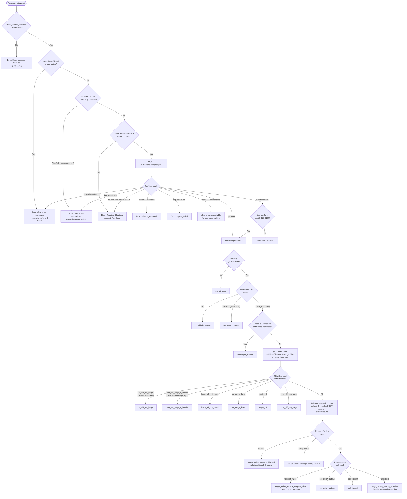

# `/ultrareview`

> Analysis basis: CC v2.1.187 bundle.js (AST extraction + Claude interpretation)
> Minimum version: v2.1.187

---

## Overview

`/ultrareview` launches a cloud-hosted agent session that autonomously finds and verifies bugs in the current Git branch. It performs a series of local pre-flight checks (policy, authentication, Git state, diff size), uploads a Git bundle to the remote environment, and then streams the review results back into the local Claude Code session. The command targets the `ultrareview` product surface specifically — it is not a generic background task but a specialized bug-hunting workflow that runs on Claude Code on the web infrastructure, billed at approximately $10–$20 USD per run.

---

## Registration

| Field | Value |
|---|---|
| type | `local-jsx` |
| name | `ultrareview` |
| description | `Start a cloud agent that finds and verifies bugs in your branch ( ... , ... USD) · Runs in Claude Code on the web. See ...` |
| loc_byte | `12279145` |
| loc_byte_end | `12279416` |
| loc_line | `8239` |
| module_id | `ZLl` |
| load_inline | `true` |
| arbor_handler.name | `mff` |
| arbor_handler.fqn | `claude-2.1.187::mff` |
| arbor_handler.kind | `AsyncFunction` |
| arbor_handler.resolution_path | `module_id` |
| arbor_handler.n_hits | `1` |

Analysis basis: CC v2.1.187 bundle.js:+12279145

---

## Input Branching

The command resolves through more than three distinct gate paths before dispatching to the cloud. A Mermaid flowchart is used below.



---

## Behavioral Spec

### Handler Entry — `mff` (AsyncFunction)

The top-level handler is `mff`, resolved via module `ZLl`.

```
async function ultrareviewHandler(commandArgs, appState):

    // 1. Org policy gate
    if not appState.settings.allow_remote_sessions:
        emit precondition_failed("policy_blocked")
        return error("Cloud sessions are disabled by your organization's policy. Contact your organization admin to enable them.")

    // 2. essential-traffic / data-residency gate  (calls networkPolicyChecker)
    networkStatus = checkNetworkPolicy(appState)
    if networkStatus == "essential-traffic-only":
        emit precondition_failed("essential_traffic_only")
        return error("Ultrareview unavailable in essential-traffic-only mode.")
    if networkStatus in ["zdr", "data-residency"]:
        emit precondition_failed("data_residency")
        return error("Ultrareview unavailable on third-party providers.")

    // 3. OAuth token gate
    if not appState.auth.oauthToken:
        emit precondition_failed("no_oauth_token")
        return error("Ultrareview requires a Claude.ai account. Run /login to authenticate.")

    // 4. Parse --fix / --comment flags from commandArgs  (calls flagParser)
    flags = parseFlagsFromArgs(commandArgs, validFlags=["fix","comment"])
    if "--fix" in flags:
        appendSystemInstruction("The user passed --fix: when the findings arrive, apply them to the local working tree.")

    // 5. Detect previous /code-review ultra invocation (alias guard)
    if sessionHistory.has("/code-review ultra"):
        // deduplicate; continue normally

    // 6. Preflight API call  (calls preflightLoader → DLl)
    preflightResult = await POST("/v1/ultrareview/preflight", headers={teleport-org, ...})
    match preflightResult.status:
        "proceed"       → continue
        "needs-confirm" → show cost-confirmation dialog (~$10–$20, ~10–20 min)
                          if user cancels → return "Ultrareview cancelled."
        "server"        → return error("Ultrareview is unavailable for your organization.")
        "essential-traffic-only" | "data_residency" | "no-auth" | "no_oauth_token"
                        → return appropriate error (see policy gates above)
        "schema_mismatch" | "request_failed"
                        → emit telemetry(api_ultrareview_preflight, reason)
                          return error

    // 7. Git pre-checks  (calls gitPreflightChecker → e0o)
    gitStatus = await checkGitPrerequisites(workingDir)
    match gitStatus.code:
        "not_git_repo"          → emit tengu_review_remote_precondition_failed
                                   return error
        "no_github_remote"      → emit tengu_review_remote_precondition_failed
                                   return error
        "monorepo_blocked"      → emit tengu_review_remote_precondition_failed
                                   return error
        "pr_diff_too_large"     → emit tengu_review_remote_precondition_failed
                                   return error(diff size explanation)
        "repo_too_large_to_bundle" → emit tengu_review_remote_precondition_failed
                                   return error
        "base_ref_not_found"    → return error
        "no_merge_base"         → return error
        "empty_diff"            → return error
        "local_diff_too_large"  → return error
        OK                      → continue

    // 8. Overage / billing gate  (calls overageChecker → bdt)
    overageState = checkOverage(appState)
    if overageState == "blocked":
        emit tengu_review_overage_blocked
        show link to /admin-settings/
        return
    if overageState requires dialog:
        emit tengu_review_overage_dialog_shown

    // 9. Render in-progress JSX UI  (calls JSX renderer → e0l.jsx, fff → n0o)
    renderUltrareviewProgressPanel(sessionId, flags)

    // 10. Teleport / remote dispatch  (calls teleportToRemote → P5)
    sessionResult = await teleportToRemote({
        sourceMode: determineSourceMode(),   // bundle | explicit_source_url | no_git_at_all
        environment: selectCloudEnv(),       // auto-creates Default if none exists
        prompt: buildReviewPrompt(flags),    // "ultrareview" task type
        sessionType: "ultrareview"
    })

    match sessionResult:
        "teleport_failed"  → emit tengu_review_remote_teleport_failed
                              return error("Ultrareview failed to launch the cloud session. Check that this is a GitHub repo and try again.")
        "launched"         → emit tengu_review_remote_launched
                              stream results into local session via remoteAgentPoller (FUa)
        "cancelled"        → return "Ultrareview cancelled."
```

Analysis basis: CC v2.1.187 bundle.js:+12276547

---

### Git Pre-Requisite Checker — `e0o`

```
async function checkGitPrerequisites(workingDir):

    // Step 1: confirm inside a git work-tree
    result = await runGit(["rev-parse", "--is-inside-work-tree"])
    if result.failed:
        return {code: "not_git_repo"}

    // Step 2: resolve remote URL  (calls remoteUrlResolver → lO → goe)
    remoteUrl = await getRemoteUrl(workingDir)
    if not remoteUrl:
        return {code: "no_github_remote"}
    if not remoteUrl.includes("github.com"):
        return {code: "no_github_remote"}

    // Step 3: monorepo block
    if remoteUrl.includes("anthropics") or remoteUrl.includes("anthropic"):
        return {code: "monorepo_blocked"}

    // Step 4: fetch PR metadata via gh CLI
    prMeta = await runGhCLI(["pr", "view", "--repo", repoPath,
                              "--json", "additions,deletions,changedFiles"],
                             timeout=5000)
    if prMeta.additions + prMeta.deletions > PR_DIFF_TOKEN_THRESHOLD:  // ~8000
        return {code: "pr_diff_too_large"}

    // Step 5: count git objects for bundle size
    objectCount = await runGit(["count-objects", "-v"])
    if objectCount > 5_000_000:
        return {code: "repo_too_large_to_bundle"}

    // Step 6: resolve base ref
    baseRef = await resolveBaseRef(workingDir)   // symbolic-ref, show-ref, main/master fallback
    if not baseRef:
        return {code: "base_ref_not_found"}

    // Step 7: find merge-base
    mergeBase = await runGit(["merge-base", currentBranch, baseRef])
    if not mergeBase:
        return {code: "no_merge_base"}

    // Step 8: check diff size
    shortstat = await runGit(["diff", "--shortstat", mergeBase])
    if shortstat is empty or blank:
        return {code: "empty_diff"}
    if shortstat exceeds local diff limit:
        return {code: "local_diff_too_large"}

    return {code: "ok", mergeBase, baseRef, remoteUrl}
```

Analysis basis: CC v2.1.187 bundle.js:+12238464

---

### Preflight API Checker — `DLl`

```
async function ultrareviewPreflight(appState):

    response = await httpPost("/v1/ultrareview/preflight", {
        headers: {
            "teleport-org": orgUuid,
            "anthropic-beta": "ccr-byoc-2025-07-29",
            "x-organization-uuid": orgUuid,
        }
    })

    // Validate response schema
    if not matchesExpectedSchema(response):
        emit tengu_review_precondition("api_ultrareview_preflight", "schema_mismatch")
        return {status: "schema_mismatch"}

    if response.failed:
        emit tengu_review_precondition("api_ultrareview_preflight", "request_failed")
        return {status: "request_failed"}

    // Inspect server-side status field
    match response.body.status:
        "essential-traffic-only" → return {status: "essential-traffic-only"}
        "data-residency"         → return {status: "data_residency"}
        "no-auth"                → return {status: "no_oauth_token"}
        "proceed"                → return {status: "proceed"}
        "needs-confirm"          → return {status: "needs-confirm", costEstimate: "$10-$20"}
        "server"                 → return {status: "server"}   // org unavailability

    return {status: "proceed"}
```

Analysis basis: CC v2.1.187 bundle.js:+12236741

---

### Remote Agent Poller — `FUa`

```
async function pollRemoteAgent(sessionId, opts):

    POLL_TIMEOUT_MS = 1_800_000   // 30 minutes

    startTime = Date.now()

    loop:
        if Date.now() - startTime > POLL_TIMEOUT_MS:
            return {outcome: "poll_timeout"}

        event = await fetchNextSessionEvent(sessionId)

        match event.type:
            "SessionStart"        → updateUI("starting")
            "hook_progress"       → streamProgressToLocal(event.payload)
            "hook_response"       → streamResponseToLocal(event.payload)
            "hook_started"        → updateUI("running")
            "result"              → return {outcome: "launched", data: event.payload}
            "orchestrator_error"  → return {outcome: "orchestrator_error"}
            "session_error"       → return {outcome: "session_error"}
            "completed"           → extractReviewOutput(event)
                                    if no review output found:
                                        return {outcome: "no_review_output"}
                                    return {outcome: "launched", data: reviewOutput}
            "archived"            → return {outcome: "launched"}

        await delay(backoffMs)   // uses Math.random() * 2 + setTimeout

    if apiErrorEncountered:
        return {outcome: "poll_timeout_after_api_error"}
```

Analysis basis: CC v2.1.187 bundle.js:+8626437

---

### Git Bundle Upload — `Rco` (teleportGitBundleUpload)

```
async function teleportGitBundleUpload(repoPath, sessionConfig):

    // Guard: must be in a git repo
    if not await isInsideGitWorkTree(repoPath):
        emit tengu_ccr_bundle_upload("empty_repo")
        return error("Not in a git repository")

    // Create temporary seed stash refs
    await runGit(["update-ref", "refs/seed/stash", currentHead])
    await runGit(["update-ref", "refs/seed/root", rootCommit])

    // Check for commits
    commitCount = await runGit(["for-each-ref", "--count=1", "refs/"])
    if commitCount == 0:
        return error("Repository has no commits yet")

    // Create git stash bundle
    stashResult = await runGit(["stash", "create"])
    if stashResult.failed:
        emit tengu_ccr_bundle_upload("stash_failed")

    // Bundle generation: HEAD bundle
    bundlePath = tempDir + "/ccr-seed-" + randomId + ".bundle"
    bundleResult = await createGitBundle(bundlePath, ["head", "fallback_head", "squashed", "fallback_squashed"])

    // Upload bundle
    uploadResult = await PUT(bundleUploadUrl, bundlePath)
    if uploadResult.status != 200:
        emit tengu_ccr_bundle_upload("upload_failed")
        return error

    // Clean up seed stash refs
    await runGit(["update-ref", "-d", "refs/seed/stash"])
    await runGit(["update-ref", "-d", "refs/seed/root"])

    // Also handle _source_seed.bundle for fallback
    emit tengu_ccr_bundle_upload("success")
    return {bundleMode: determineBundleMode()}
```

Analysis basis: CC v2.1.187 bundle.js:+8590422

---

### Cloud Environment Selector — `$ee` / `uat`

```
async function listRemoteEnvironments(orgUuid, accessToken):

    // Gate: must be first-party Anthropic provider
    if not isFirstPartyProvider():
        return error("Remote environments are only available on the first-party Anthropic API provider.")

    // Gate: must have OAuth token (not just API key)
    if not oauthToken:
        return error("Claude Code web sessions require authentication with a Claude.ai account...")

    // Gate: must have org UUID
    if not orgUuid:
        return error("Unable to get organization UUID")

    environments = await httpGet("/environments", {timeout: 15000})
    return environments

async function createDefaultEnvironment(orgUuid, accessToken):
    payload = {
        name: "Default",
        type: "anthropic_cloud",
        display: "Default - trusted network access",
        home: "/home/user",
        runtimes: [{python: "3.11"}, {node: "20"}]
    }
    result = await httpPost("/environments", payload)
    emit telemetry("teleport_default_environment_create")
    return result
```

Analysis basis: CC v2.1.187 bundle.js:+7211014

---

### Flag Parser — `NLl` / `I7n`

```
function parseUltrareviewFlags(rawArgs):

    tokens = rawArgs.trim().split(/\s+/)
    validFlags = new Set(["fix", "comment"])
    parsedFlags = new Set()

    for token in tokens:
        normalized = token.replace(/^--?/, "")
                          .replace(escapePattern, "\\$&")
        if validFlags.has(normalized):
            parsedFlags.add(normalized)

    return parsedFlags
```

Analysis basis: CC v2.1.187 bundle.js:+12238340

---

## State & Side Effects

| Item | Detail |
|---|---|
| Telemetry: `tengu_review_remote_precondition_failed` | Emitted on every local pre-check failure (not_git_repo, no_github_remote, monorepo_blocked, diff size, etc.) — bundle.js:+12238479 |
| Telemetry: `tengu_review_remote_teleport_failed` | Emitted when the teleport dispatch fails after pre-checks pass — bundle.js:+12245334 |
| Telemetry: `tengu_review_remote_launched` | Emitted when the cloud session successfully starts and results begin streaming — bundle.js:+12245922 |
| Telemetry: `tengu_review_overage_blocked` | Emitted when billing overage prevents launch — bundle.js:+12276881 |
| Telemetry: `tengu_review_overage_dialog_shown` | Emitted when an overage confirmation dialog is displayed — bundle.js:+12277218 |
| Telemetry: `tengu_review_bughunter_config` | Emitted at bug-hunter configuration time — bundle.js:+8918069 |
| Telemetry: `tengu_ccr_bundle_upload` | Emitted during Git bundle upload with outcome tag (success, stash_failed, upload_failed, empty_repo) — bundle.js:+8590744 |
| Telemetry: `tengu_ccr_bundle_max_bytes` | Emitted with max bundle byte limit during size check — bundle.js:+8587367 |
| Telemetry: `tengu_ccr_bundle_seed_enabled` | Emitted when seed bundle mode is active — bundle.js:+7216025 |
| Telemetry: `tengu_teleport_bundle_mode` | Emitted recording which bundle strategy was chosen — bundle.js:+8607610 |
| Telemetry: `tengu_teleport_source_decision` | Emitted with source mode decision (bundle / explicit_source_url / no_git_at_all) — bundle.js:+8613353 |
| Telemetry: `tengu_ccr_session_link` | Emitted when the cloud session link is established — bundle.js:+8600716 |
| Telemetry: `tengu_teleport_generate_title` | Emitted when a task title is auto-generated via LLM — bundle.js:+8594133 |
| Telemetry: `tengu_bg_dispatch_sigkill_escalate` | Emitted when a background daemon process is SIGKILL-escalated — bundle.js:+17196063 |
| Telemetry: `tengu_bg_spare_claim` / `tengu_bg_spare_claim_fail` | Emitted during spare-slot background daemon management — bundle.js:+17197489, +17197755 |
| Telemetry: `tengu_feature_ok` / `tengu_feature_bad` / `tengu_feature_sad` | Feature-level success/failure/degraded signals used by the network-policy checker — bundle.js:+1025122, +1025189, +1025270 |
| Telemetry: `tengu_daemon_yield` / `tengu_daemon_idle_exit` | Daemon lifecycle events emitted by the background session supervisor — bundle.js:+17216595, +17217625 |
| Network I/O | `POST /v1/ultrareview/preflight` — preflight check against Anthropic API |
| Network I/O | `POST` to cloud session creation endpoint — launches remote agent |
| Network I/O | `PUT` to bundle upload URL — uploads Git bundle (may be several hundred MB) |
| Network I/O | Polling loop against remote session API — up to 30 minutes (1 800 000 ms) |
| Filesystem | Temporary Git bundle files written via `pV.writeFile` / `qm.rm` under a temp directory |
| Filesystem | `state.json` read/written by background daemon session tracker |
| Filesystem | `pins.json` read during background session pinning |
| appState changes | Remote session ID stored; session roster entry added via `t.rosterEntry` |
| UI | JSX progress panel rendered via `e0l.jsx` showing session status (starting → running → results) |
| Cost | Approximately $10–$20 USD per run (literal bundle.js:+8918186) |
| Estimated duration | ~10–20 minutes (literal bundle.js:+8918279) |
| `--fix` flag side-effect | Appends system-level instruction to apply findings to local working tree (literal bundle.js:+12276286) |
| `allow_remote_sessions` | Policy key read from org settings; blocks the command if `false` (literal bundle.js:+12276550) |
| Cancellation | On user cancel or `ZLo` cleanup path, emits "Ultrareview cancelled." (literal bundle.js:+12277508) |

---

## Version History

| Version | Change |
|---|---|
| v2.1.187 | Initial analysis |

---

## Common Mistakes

1. **Running without a Claude.ai account**: `/ultrareview` requires OAuth-based login, not just an `ANTHROPIC_API_KEY`. Users authenticated only via API key will hit the `no_oauth_token` or `no-auth` gate. Run `/login` first.

2. **Running in a non-GitHub repository**: The command explicitly checks that the remote URL contains `github.com`. GitLab, Bitbucket, or bare local repos will be rejected with `no_github_remote`.

3. **Running in the Anthropic monorepo**: Any remote URL containing `anthropics` or `anthropic` is blocked at `monorepo_blocked` to prevent accidental large-scale reviews.

4. **Running on a branch with no diff from the base**: If `git diff --shortstat <merge-base>` returns empty output, the command exits with `empty_diff`. Ensure actual commits exist on the feature branch.

5. **Running in an organization with disabled cloud sessions**: The `allow_remote_sessions` policy must be enabled by an org admin. Non-admins receive the policy error with a contact-admin instruction. The admin settings page is linked at `/admin-settings/`.

6. **Expecting a free run**: Each invocation costs approximately $10–$20 USD and takes ~10–20 minutes. A confirmation dialog is shown when the preflight returns `needs-confirm`; dismissing it cancels the run without charge.

7. **Large repository bundles**: If the git object count exceeds 5,000,000, the command aborts with `repo_too_large_to_bundle` before any upload is attempted.

---

## Appendix — Identifier Mapping

> For bundle debugging only. Identifiers change across versions.

| Identifier | Role |
|---|---|
| `mff` | Main handler for `/ultrareview` (AsyncFunction, resolved via module `ZLl`) |
| `Js` | Network/feature policy checker called from handler entry |
| `nSi` | Inner network state inspector |
| `Qz` | Policy configuration reader |
| `K9` | Telemetry/feature-flag probe |
| `cxt` | Config file reader (uses `readFileSync`, encoding `utf-8`) |
| `Bme` | Telemetry permission check (`allow_product_feedback`) |
| `Vi` | Network mode classifier |
| `jns` | Traffic-category resolver |
| `nt` | String normalizer |
| `Lme` | Alternative normalizer |
| `Is` | CLI error handler (calls `console.error`, `process.exit`) |
| `aqe` | Error formatter (uses `St.red`) |
| `oT` | Error file writer (`Ore.writeFileSync`) |
| `NLl` | Flag-set parser entry (validates "fix" / "comment") |
| `I7n` | Token-level flag splitter and normalizer |
| `fw` | Shell escape helper (`e.replace`) |
| `a9e` | MCP server connection orchestrator |
| `brr` | MCP connection result applier (`applyMcpUpdate`) |
| `hla` | MCP hub accessor |
| `uBo` | MCP client filter and connector |
| `e0o` | Git pre-check orchestrator |
| `dat` | Git work-tree detector (`rev-parse --is-inside-work-tree`) |
| `Pt` | Async git runner base |
| `xrn` | Async storage store reader (`Rrn.getStore`) |
| `gr` | Git result normalizer |
| `Wr` | Git subprocess runner |
| `N1e` | Git process lifecycle manager |
| `kiu` | Git error code stringifier |
| `sp` | Subprocess signal handler |
| `cn` | Canonical path helper |
| `Liu` | Child process channel manager |
| `ke` | Process output collector |
| `lO` | Remote URL resolver and cacher (`KAe` map) |
| `GK` | Remote URL cache lookup |
| `fon` | Host-origin cache reader (`hoe.get`) |
| `D7e` | URL credential scrubber (`://***@`) |
| `goe` | Git remote URL parser |
| `Cis` | URL component splitter |
| `M7e` | URL scheme validator (`https` etc.) |
| `fi` | String slice utility |
| `Un` | Merge-base resolver |
| `Ve` | React/JSX element factory |
| `rKe` | JSX runtime reference |
| `W` | JSX fragment / component renderer |
| `Pe` | Secondary JSX renderer |
| `f` | Background session manager (daemon supervisor) |
| `D` | Background session spawner |
| `FEc` | Session filesystem verifier (`realpath`, `stat`) |
| `GJf` | Session config diffuse |
| `d` | Daemon write channel |
| `Kn` | Timeout/abort controller |
| `c` | Process state machine |
| `Re` | Session resume renderer |
| `Le` | Session list renderer |
| `GXn` | Memory monitor |
| `it` | Token/context tracker |
| `N2e` | Pin file manager (`pins.json`) |
| `xDt` | Pin file path builder |
| `Gt` | JSON parser wrapper |
| `kn` | ENOENT error guard |
| `fCd` | Directory recursive reader |
| `U` | Transient session watcher |
| `M` | Session write-clearance timer |
| `C3o` | Socket claim sender |
| `ZOo` | Session state persister (`pV.writeFile`, `state.json`) |
| `pJf` | Claim timeout manager (`send-claim timeout`) |
| `dJf` | Claim frame builder |
| `Jd` | Path canonicalizer |
| `be` | String coercer |
| `gR` | Binary frame encoder (Buffer operations) |
| `x3o` | Background session state machine |
| `ec` | Session path joiner |
| `Di` | Session file watcher |
| `_g` | Active session marker |
| `_ve` | Workspace path classifier |
| `kd` | Daemon socket path builder |
| `iht` | Session poll promise handler |
| `i8t` | Session socket path helper |
| `Eye` | Session error path handler |
| `yR` | Session late-error handler |
| `uN` | Session notification writer |
| `lM` | Late-event handler |
| `s8t` | Session socket path builder |
| `F` | Poll interval cleaner |
| `jdo` | Token counter |
| `y6e` | Context usage calculator |
| `y` | Locale number formatter |
| `U5e` | Teammate mailbox manager |
| `O5e` | Mailbox inbox reader |
| `zg` | Object assign merger |
| `o_e` | Mailbox file reader |
| `zn` | Identity passthrough |
| `Iut` | Unread count updater |
| `Xs` | Async-local storage reader (`$Fu.getStore`) |
| `Me` | JSON stringifier |
| `MUa` | Git object counter (`count-objects -v`) |
| `xUa` | Git count runner |
| `RUa` | Token/object count parser |
| `ZR` | Default branch resolver (`symbolic-ref --short refs/remotes/origin/HEAD`) |
| `xyr` | Host cache reader for default branch |
| `I_` | Current branch resolver (`branch --abbrev-ref HEAD`) |
| `kyr` | Host cache reader for current branch |
| `YBn` | Diff stat line parser (regex + parseInt) |
| `t0o` | Preflight API orchestrator |
| `DLl` | Preflight HTTP caller (`/v1/ultrareview/preflight`) |
| `JLo` | Preflight response status router |
| `Mt` | Secondary JSX progress renderer |
| `E6e` | Token-count estimator |
| `bdt` | Overage / billing checker |
| `i0` | Billing state reader |
| `DIe` | Billing plan type resolver |
| `hc` | Subscription type classifier |
| `ay` | Auth/plan context reader |
| `Dt` | Plan eligibility checker |
| `Ao` | Plan type to display-tier mapper |
| `H2` | Array membership checker |
| `LI` | Org role checker (max / pro / admin / billing / owner / primary_owner) |
| `xi` | Role set resolver |
| `jLr` | Role list getter |
| `zLr` | Role normalizer |
| `Cte` | Token ceiling helper |
| `fff` | Review result renderer |
| `n0o` | Cloud agent result panel |
| `Zle` | Remote eligibility summary component |
| `dga` | Eligibility check runner |
| `I` | Viewport dimension calculator |
| `x` | Render write channel |
| `A` | Clamp helper |
| `pte` | Progress panel component |
| `_3a` | Remaining token bar |
| `P5` | Full teleport-to-remote orchestrator |
| `Nl` | First-party provider checker |
| `Rh` | OAuth URL refresher |
| `lBn` | Environment display name builder |
| `_2` | Session creation pre-check gate |
| `Ls` | OAuth endpoint validator |
| `YE` | HTTP client factory |
| `Rco` | Git bundle upload handler |
| `kt` | API base URL resolver |
| `PUa` | Session event frame builder |
| `DFt` | Session request builder |
| `ne` | HTTP response classifier |
| `DUa` | Session link renderer |
| `FDn` | Session error display |
| `$ee` | Remote environment lister |
| `uat` | Default environment creator |
| `evp` | Task title generator via LLM |
| `vU` | Context token tracker |
| `R9e` | GitHub App installation checker |
| `ys` | Org-level subscription querier |
| `K` | Daemon process list reader |
| `se` | Session termination handler |
| `fo` | Error object factory |
| `IH` | Cancel signal handler |
| `jH` | Session abort broadcaster |
| `e_e` | Remote agent session poller entry |
| `OB` | Session ID generator |
| `uut` | Browser link opener for session URL |
| `aC` | Pending session status poller |
| `cvp` | Session status string formatter |
| `FUa` | Core remote agent poll loop |
| `ece` | Review output extractor |
| `gy` | Markdown result parser |
| `pff` | Result message mapper |
| `ZLo` | Cleanup / cancellation handler |