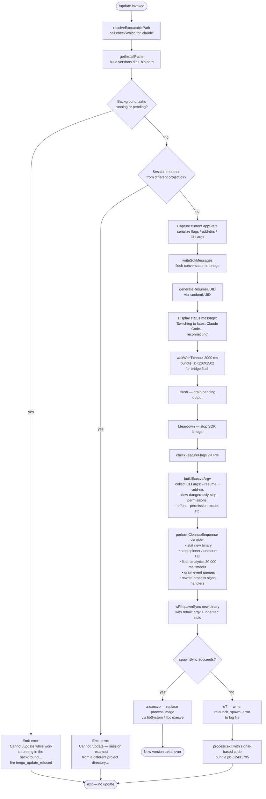

# `/update`

> Analysis basis: CC v2.1.187 bundle.js (AST extraction + Claude interpretation)
> Minimum version: v2.1.187

---

## Overview

The `/update` command performs an in-process upgrade of Claude Code to the latest installed version while preserving the current conversation context. It orchestrates a coordinated teardown of the active session — flushing pending I/O, persisting conversation state, and relaunching the CLI binary via `execve` — so that the user can continue their conversation on the newest version without losing history.

---

## Registration

| Field | Value |
|---|---|
| type | `local` |
| name | `update` |
| description | `Switch to the latest version (conversation continues)` |
| loc_byte | `12692433` |
| loc_byte_end | `12692674` |
| loc_line | `8678` |
| supportsNonInteractive | `false` |
| isHidden | `true` |
| module_id | `XOl` |
| load_inline | `true` |
| arbor_handler.name | `W_f` |
| arbor_handler.fqn | `claude-2.1.187::W_f` |
| arbor_handler.kind | `AsyncFunction` |
| arbor_handler.resolution_path | `module_id` |
| arbor_handler.n_hits | `0` |

Analysis basis: CC v2.1.187 bundle.js:+12692433

---

## Input Branching

The handler (`W_f`) executes through more than three distinct branching paths — background-work guard, project-directory mismatch guard, the main teardown-and-relaunch flow, and post-relaunch recovery — so a Mermaid flowchart is used.



---

## Behavioral Spec

### Pre-flight Guards

```
async function updateCommandHandler(context):
    executablePath = resolveExecutablePath("claude")   // Bun.which
    installPaths   = getInstallPaths()                 // ~/.local/share/versions + bin
    backgroundTasks = collectBackgroundTasks(context)

    runningOrPending = backgroundTasks.filter(
        t => t.status == "running" OR t.status == "pending"
    )
    if runningOrPending.length > 0:
        fireEvent("tengu_update_refused")
        return errorMessage(
            "Cannot /update while work is running in the background…"
        )                        // bundle.js:+12690693

    if sessionResumedFromDifferentDirectory(context):
        return errorMessage(
            "Cannot /update — this session was resumed from a different…"
        )                        // bundle.js:+12690937
```

Analysis basis: CC v2.1.187 bundle.js:+12690590 (status check), +12690693 (error string), +12690937 (directory mismatch error)

---

### State Capture & Bridge Flush

```
function captureSessionState(context):
    appState = context.getAppState()
    featureFlags = checkFeatureFlags()         // PIe / ali.isEnabled
    return {appState, featureFlags}

async function flushBridge(sdkBridge):
    sdkBridge.writeSdkMessages(pendingMessages)
    resumeId = generateUUID()                  // Bun.randomUUID via jOl
    displayStatusText(
        "Switching to latest Claude Code… reconnecting"
    )                                          // bundle.js:+12691422
    await waitWithTimeout(2000)                // bundle.js:+12691502
    await sdkBridge.flush()                    // "bridge flush" label
    await sdkBridge.teardown()
```

Analysis basis: CC v2.1.187 bundle.js:+12691398, +12691418, +12691492, +12691543

---

### Argument Reconstruction

```
function buildRelaunchArgv(originalContext):
    argv = []

    // Restore --resume with the captured session ID
    argv.push("--resume", resumeId)            // bundle.js:+12430920

    // Re-append any additional directories
    for dir in originalContext.addedDirs:
        argv.push("--add-dir", dir)            // bundle.js:+12432444

    // Re-forward permission bypass if active
    if originalContext.bypassPermissions:
        argv.push("--allow-dangerously-skip-permissions")
                                               // bundle.js:+12432559

    // Re-forward effort setting if present
    if originalContext.effort:
        argv.push("--effort", originalContext.effort)
                                               // bundle.js:+12432701

    // Re-forward permission mode if present
    if originalContext.permissionMode:
        argv.push("--permission-mode", originalContext.permissionMode)
                                               // bundle.js:+12432718

    return argv
```

Analysis basis: CC v2.1.187 bundle.js:+12691747 (arg collection entry `eYn`), +12432269

---

### Cleanup Sequence & Relaunch

```
async function performCleanupAndRelaunch(newBinaryPath, argv):
    // Stat new binary to confirm it exists
    await filesystem.stat(newBinaryPath)       // bundle.js:+12430868

    // Stop spinner / unmount TUI
    stopSpinnerAnimation()                     // jFt -> Xto -> clearInterval
    unmountTerminalUI()                        // U9e -> e.unmount
    writeTerminalOutput()                      // yTn -> RZ.writeSync

    // Render terminal-aware output (tmux, iTerm2, ghostty paths)
    renderFinalOutput()                        // T, Q$e

    // Flush analytics with hard timeout
    await withTimeout(
        analyticsFlush(),                      // $Ke -> b6o.drain
        30000,                                 // bundle.js:+12430987
        "flush timeout (relaunch)"
    )

    // Drain remaining hook/event queues
    drainEventRegistry()                       // HC -> Rc

    // Remove old SIGINT / SIGHUP handlers, attach pass-through
    process.removeAllListeners()               // bundle.js:+12431489
    process.on("SIGINT",  passThrough)
    process.on("SIGHUP",  passThrough)         // bundle.js:+12431519

    // Spawn and exec into new binary
    result = spawnSync(newBinaryPath, argv, {stdio: "inherit"})
                                               // bundle.js:+12431546, +12431581

    if result.error:
        writeErrorLog("relaunch_spawn_error")  // bundle.js:+12431771
        process.exit(128 + signalNumber)       // bundle.js:+12431908

    // Replace current process image — no return
    execve(newBinaryPath, argv, currentEnv)    // CRl -> a.execve
```

Analysis basis: CC v2.1.187 bundle.js:+12430954, +12430966, +12431038, +12431094, +12431348, +12431416, +12431422, +12431489, +12431546, +12431795

---

### Install Path Resolution

```
function getInstallPaths():
    home    = os.homedir()                     // qMn -> Sfa.homedir
    base    = path.join(home, ".local", "share")
                                               // bundle.js:+7046106, +7046115
    versDir = path.join(base, "versions")      // bundle.js:+8529141
    binDir  = path.join(home, ".local", "share", "bin")
                                               // bundle.js:+7046186
    return {versDir, binDir}
```

Analysis basis: CC v2.1.187 bundle.js:+8529126 (`Nee`), +7046064, +7045833

---

### Session State Restoration (post-relaunch)

```
function restoreSessionSettings(appState):
    // Re-apply working directory, allowed/disallowed tools, avoid_prompts
    settings = {
        working_directory:   appState.working_directory,   // +10787855
        allowed_tools:       appState.allowed_tools,       // +10787910
        disallowed_tools:    appState.disallowed_tools,    // +10787965
        avoid_prompts:       appState.avoid_prompts,       // +10788026
        permission_mode:     appState.permission_mode,     // +10788128
        bypassPermissions:   appState.bypassPermissions,   // +10788159
        effort:              appState.effort,              // +10788483
        model:               appState.model,               // +10788496
        max_thinking_tokens: appState.max_thinking_tokens, // +10788508
        flag_settings:       appState.flag_settings        // +10788534
    }
    context.setAppState(settings)
```

Analysis basis: CC v2.1.187 bundle.js:+12691197 (`t.getAppState`), +12691312 (`t.setAppState`), +12691237 (`_E`)

---

## State & Side Effects

| Item | Detail |
|---|---|
| Telemetry — `tengu_update_refused` | Fired when background tasks are `"running"` or `"pending"` at the time `/update` is invoked (bundle.js:+12690329) |
| Telemetry — `tengu_scroll_summary` | Fired during TUI teardown/scroll render path (bundle.js:+7231176) |
| Telemetry — `tengu_amber_creek` | Fired in terminal-rendering path during cleanup (bundle.js:+3556463) |
| Telemetry — `tengu_pewter_brook` | Fired in terminal-rendering path during cleanup (bundle.js:+3556371) |
| Telemetry — `tengu_config_parse_error` | Fired if config read fails during state capture (bundle.js:+13752866) |
| Telemetry — `tengu_disable_bypass_permissions_mode` | Fired if bypass-permissions mode is cleared before relaunch (bundle.js:+3395452) |
| Telemetry — `tengu_daemon_control` | Fired during daemon stop/restart coordination (bundle.js:+17233792) |
| appState changes | `t.getAppState` is called to snapshot, then `t.setAppState` is called on the resumed session to restore flags (bundle.js:+12691197, +12691312) |
| Bridge flush | `l.writeSdkMessages` → `l.flush` → `l.teardown` in order; a 2 000 ms timeout guards the flush step (bundle.js:+12691398, +12691492, +12691543) |
| Analytics drain | `b6o.drain` called with a 30 000 ms timeout labelled `"flush timeout (relaunch)"` (bundle.js:+12430987) |
| Cleanup timeout label | `"cleanup timeout"` (bundle.js:+12431049) |
| Analytics timeout label | `"analytics flush timeout"` (bundle.js:+12431105) |
| Signal handler reset | `process.removeAllListeners()` followed by re-registration of `SIGINT` and `SIGHUP` before spawn (bundle.js:+12431489, +12431519) |
| Process replacement | `execve` called via FFI (`libSystem.B.dylib` on macOS, `libc.so.6` on Linux) — current process image is replaced (bundle.js:+12430060, +12430097) |
| Exit on spawn failure | `process.exit` with code `128 + signalNumber` (bundle.js:+12431795, +12431908) |
| Error log on spawn failure | Written via `oT` → `Ore.writeFileSync` with label `"relaunch_spawn_error"` (bundle.js:+12431771) |
| Hook registration | `Rc` / `Ei` → `b6o.register` used to drain event queues before relaunch (bundle.js:+67325) |
| Sound | None observed in depth-2 traversal |

---

## Version History

| Version | Change |
|---|---|
| v2.1.187 | Initial analysis |

---

## Common Mistakes

1. **Invoking `/update` while agent tasks are active.** The command unconditionally refuses if any task has status `"running"` or `"pending"`. Wait for all background work to complete before calling `/update`.

2. **Using `/update` in a session resumed from a different project directory.** The command detects a working-directory mismatch and rejects the update. Restart manually with `--resume` on the correct directory instead.

3. **Expecting `/update` to be visible in the command palette.** The registration sets `isHidden: true`, so the command does not appear in help listings or auto-complete; it must be typed explicitly.

4. **Expecting `/update` to work non-interactively.** `supportsNonInteractive: false` means the command is not available in `--print` / pipe mode.

5. **Assuming the new version starts a fresh conversation.** The entire session state (messages, tool permissions, working directory, model flags) is serialized and forwarded via `--resume` and reconstructed by the new binary. Conversation history is preserved.

6. **Not accounting for the 30-second analytics-drain timeout.** The relaunch sequence will block for up to 30 000 ms waiting for analytics to flush before executing the new binary.

---

## Appendix — Identifier Mapping

> For bundle debugging only. Identifiers change across versions.

| Identifier | Role |
|---|---|
| `W_f` | Main async handler for `/update` (Arbor-resolved, `AsyncFunction`) |
| `MYn` | Background-task status collector (checks `"running"` / `"pending"`) |
| `Cf` | Executable-path resolver (wraps `Bun.which`) |
| `MXo` | Low-level `Bun.which` wrapper |
| `TF` | Install-path builder (constructs versions-dir + bin path) |
| `B2n` | Versions directory path assembler |
| `Im` | Array check helper (`Array.isArray` wrapper) |
| `Nee` | Home-relative `.local/share` path resolver |
| `qMn` | `os.homedir()` wrapper |
| `Xae` | Bin directory path resolver |
| `Ws` | Role-type resolver (distinguishes `"bg"`, `"daemon"`, `"daemon-worker"`) |
| `nUe` | Role string constants provider |
| `W` | General utility / logging helper (used widely) |
| `eS` | Basename + truncation helper (`py.basename`, `kt`) |
| `kt` | String truncation / formatting utility (calls `VL`) |
| `VL` | Low-level string formatter |
| `pR` | Path resolver for binary target |
| `q0o` | Directory-resolution helper (`RRl.dirname`, `Ag`, `ic`) |
| `gr` | Path-join helper (calls `VL`) |
| `ic` | Path canonicaliser (calls `VL`) |
| `Uue` | Session-context accessor |
| `Pne` | Hook/attachment type checker (`Tvf.has`) |
| `IJn` | Hook ID factory |
| `Wqt` | Last-prompt entry appender (`t.appendEntry`) |
| `Rc` | Event-registry drain coordinator |
| `Ei` | Event registration helper (`b6o.register`) |
| `ke` | Logging / error-capture utility |
| `fo` | Error string formatter |
| `nt` | String normaliser |
| `Vi` | Log-entry builder (`jns`) |
| `jns` | Log line formatter |
| `Qru` | Ring-buffer manager (shift/push on `Crn`) |
| `df` | Store accessor helper |
| `c0` | AsyncLocalStorage getter (`IRr.getStore`) |
| `_E` | App-state delta applier |
| `l` | SDK bridge object (has `writeSdkMessages`, `flush`, `teardown`) |
| `JNl` | SDK message serialiser |
| `SQ` | Message body formatter |
| `Dfe` | Text-trimming formatter (trims to 1 000 chars) |
| `Xs` | Store getter (`$Fu.getStore`) |
| `tVt` | Daemon status file path builder (`daemon.status.json`) |
| `Me` | JSON serialiser wrapper |
| `jOl` | UUID generator (`Bqt.randomUUID`) |
| `Dc` | Timeout/race helper (`setTimeout`, `Promise.race`, `clearTimeout`) |
| `PIe` | Feature-flag checker (`ali.isEnabled`) |
| `Eve` | String coercion helper |
| `qMe` | Full cleanup-and-relaunch orchestrator |
| `jFt` | Spinner-stop coordinator |
| `Xto` | Interval-clear helper (`clearInterval`) |
| `U9e` | TUI unmount + final write helper |
| `e` | Generic iterable / component (context-dependent) |
| `OU` | Output-write helper |
| `yTn` | Terminal final-frame writer (`RZ.writeSync`) |
| `Q$e` | Terminal-emulator capability checker (ghostty, iTerm2) |
| `V$e` | Cursor-save/restore escape helper |
| `Nw` | tmux escape-sequence adjuster |
| `sp` | Spinner / progress display |
| `T` | Terminal ANSI/colour formatter |
| `oPn` | Scroll-summary renderer |
| `cw` | Scroll context helper |
| `Cga` | Scroll geometry calculator |
| `Iga` | Scroll timing helper (`Date.now`, `Math.max`, `Math.round`) |
| `bga` | Scroll layout helper |
| `bs` | Full-screen / render compositor |
| `J$` | Feature-set membership checker (`stu.has`) |
| `mx` | Feature-flag helper (`ali.isEnabled`) |
| `p9r` | Text render helper |
| `fZ` | Colour/style lookup (`Kud`) |
| `d9r` | Boolean render flag |
| `Ur` | Permission-group renderer |
| `zud` | Render entry builder |
| `it` | React/Ink render tree node |
| `HC` | Hook-completion notifier (`Rc`) |
| `$Ke` | Analytics drain trigger (`b6o.drain`) |
| `$9e` | Post-relaunch continuation resolver |
| `ePn` | Post-relaunch state handler |
| `CRl` | Core relaunch executor (stat, chdir, require, dlopen, execve) |
| `i` | FFI handle / socket handle (context-dependent) |
| `n` | Socket / connection instance (context-dependent) |
| `r` | Promise/resource set (context-dependent) |
| `s` | Subscription set / resource tracker |
| `f` | Daemon worker / process manager |
| `D` | Supervisor process descriptor |
| `Kn` | Timeout/abort race helper |
| `Re` | Bad-feature telemetry emitter (`tengu_feature_bad`) |
| `Le` | Good-feature telemetry emitter (`tengu_feature_ok`) |
| `GXn` | Low-memory metric reporter |
| `N2e` | Lockfile read/cleanup helper |
| `U` | Daemon idle-exit timer |
| `C3o` | Spare-session claim sender |
| `x3o` | Worker state machine / IPC handler |
| `p` | Forced-shutdown trigger (`process.exit`, `u.abort`) |
| `cn` | Connection-state tracker |
| `Pe` | Retry-key lookup (`rKe`) |
| `F` | Interval-based poller |
| `c` | Daemon constructor / spawner |
| `En` | Daemon environment builder |
| `a` | Relaunch context / MCP update applicator |
| `a9e` | MCP server connection orchestrator |
| `brr` | MCP update applicator (`e.applyMcpUpdate`) |
| `hla` | Connection-cache lookup (`tQr`) |
| `uBo` | MCP client retry / reconnect manager |
| `u` | Daemon lifecycle manager (`Le`, `Re`, `CU`, `X6`) |
| `CU` | First-party feature controller |
| `X6` | Daemon-stop race helper (`Promise.race`, `process.exit`) |
| `be` | String-coercion utility |
| `oT` | Spawn-error log writer (`Ore.writeFileSync`) |
| `eYn` | Relaunch argv assembler (`Array.from`, `GPe`) |
| `GPe` | CLI argument filter |
| `nCe` | Config-entry boolean normaliser |
| `Dt` | Config file watcher/loader |
| `Wt` | Config path resolver |
| `MOo` | Config schema validator |
| `_Ee` | Config file reader (readFileSync, statSync, mkdirSync) |
| `MRf` | Config change watcher (`_Gl.unwatchFile`) |
| `Or` | Session-restore settings reader (`e.getAppState`, `n.findLast`) |
| `G8n` | Working-directory setting extractor |
| `os` | Settings field accessor |
| `W8n` | Tool-allow/disallow settings extractor |
| `N2` | Permission-mode setting mapper |
| `Vh` | Post-restore app-state accessor |

---

Note: index built via Arbor fallback; some signals (telemetry, literals) may be missing — see arbor-fallback.js.