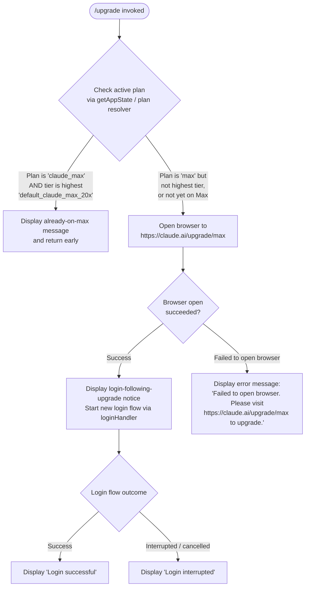

# `/upgrade`

> Analysis basis: CC v2.1.187 bundle.js (AST extraction + Claude interpretation)
> Minimum version: v2.1.187

---

## Overview

The `/upgrade` command guides the user toward upgrading their Claude subscription to the "Max" plan, which offers higher rate limits and expanded access to Opus models. When invoked, it checks the current subscription tier, and if the user is not already on the highest Max plan, it opens the Claude upgrade URL in the system browser and initiates a fresh login flow. If the user is already on the highest plan, it displays an informational message instead.

---

## Registration

| Field | Value |
|---|---|
| type | `local-jsx` |
| name | `upgrade` |
| description | `Upgrade to Max for higher rate limits and more Opus` |
| loc_byte | `12742128` |
| loc_byte_end | `12742375` |
| loc_line | `8684` |
| module_id | `pRo` |
| load_inline | `true` |
| arbor_handler.name | `Yqt` |
| arbor_handler.fqn | `claude-2.1.187::Yqt` |
| arbor_handler.kind | `AsyncFunction` |
| arbor_handler.resolution_path | `module_id` |
| arbor_handler.n_hits | `0` |

Analysis basis: CC v2.1.187 bundle.js:+12742128

---

## Input Branching

The command has 3+ distinct branches based on subscription plan state and browser-open outcome:



Analysis basis: CC v2.1.187 bundle.js:+12741027, +12741113, +12741138, +12741257, +12741343, +12741501, +12741543, +12741624, +12741786, +12741815, +12741848, +12741867, +12741900, +12741921

---

## Behavioral Spec

### Handler Entry Point

```
async function upgradeCommandHandler(context):
    planInfo = getActivePlanInfo(context.appState)

    if planInfo.tier == "max" AND planInfo.subTier == "default_claude_max_20x":
        displayMessage(
            "You are already on the highest Max subscription plan. " +
            "For additional usage, run /login to switch to an API usage-billed account."
        )
        return

    openSuccess = openBrowserURL("https://claude.ai/upgrade/max")

    if NOT openSuccess:
        displayMessage(
            "Failed to open browser. " +
            "Please visit https://claude.ai/upgrade/max to upgrade."
        )
        return

    displayMessage(
        "Starting new login following /upgrade. " +
        "Exit with Ctrl-C to use existing account."
    )

    scheduleLoginFlow(context)   // setTimeout used for async sequencing
    result = await loginFlow(context)

    if result.success:
        displayMessage("Login successful")
    else:
        displayMessage("Login interrupted")
```

Analysis basis: CC v2.1.187 bundle.js:+12741027, +12741113, +12741199, +12741257, +12741343, +12741358, +12741501, +12741504, +12741543, +12741624, +12741653, +12741786, +12741815, +12741848, +12741867, +12741900, +12741921

---

### Plan Detection Sub-routine

```
function getActivePlanInfo(appState):
    // Reads subscription plan from app state
    // Checks plan string against known tier literals:
    //   "max"                    → Max subscription (any tier)
    //   "claude_max"             → Claude Max plan identifier
    //   "default_claude_max_20x" → Highest Max tier (20× usage multiplier)
    return { tier, subTier }
```

Analysis basis: CC v2.1.187 bundle.js:+12741113, +12741138

---

### Browser Open Sub-routine

```
function openBrowserURL(url):
    // On darwin (macOS): uses "open" shell command
    // Validates url protocol starts with "http:" or "https:"
    // Returns boolean indicating success
    if process.platform == "darwin":
        spawnProcess("open", [url])
    else:
        // Fallback for other platforms
        spawnProcess(platformDefaultBrowser, [url])
    return didSucceed
```

Analysis basis: CC v2.1.187 bundle.js:+3116094, +3116144, +3116166, +3116702, +3116715, +3116832, +3116851

---

### Login Flow Sub-routine (Post-Upgrade)

```
async function loginFlowAfterUpgrade(context):
    // Delegates to the standard login handler (loginFlowComponent)
    // Renders JSX login UI component
    // Handles API key change callback: e.onChangeAPIKey
    // Applies message operation callback: e.applyMessageOp
    // Uses gateway update mechanism
    result = await renderLoginComponent(context)
    return result
```

Analysis basis: CC v2.1.187 bundle.js:+12741624, +12741786, +8943750, +8943769, +8943864

---

### OAuth Profile Resolution (called during login)

```
function resolveOAuthProfile(token):
    // HTTP POST with Content-Type: application/json
    // Timeout: 10000 ms
    // Emits telemetry: "oauth_profile_fetch" on start
    // Emits telemetry: "oauth_profile_token_failed" on error
    // Validates token against known environment sources:
    //   CLAUDE_CODE_OAUTH_TOKEN_FILE_DESCRIPTOR
    //   CLAUDE_CODE_API_KEY_FILE_DESCRIPTOR
    //   ANTHROPIC_API_KEY
    response = httpPost(oauthEndpoint, token, timeout=10000)
    return profile
```

Analysis basis: CC v2.1.187 bundle.js:+2138052, +2138106, +2138153, +2138168, +2138196, +2138212, +2138279, +2155571, +2155589, +2155655, +2155720, +2155732, +2155794

---

### Already-on-Max Message

When the user's current plan resolves to tier `"max"` with sub-tier `"default_claude_max_20x"`, the handler returns immediately after rendering an informational JSX message. The message (≤30-char fragment citation: `"You are already on the h..."`) advises using `/login` to switch to an API-billed account instead.

Analysis basis: CC v2.1.187 bundle.js:+12741257, +12741358

---

## State & Side Effects

| Item | Detail |
|---|---|
| Telemetry | `tengu_feature_ok` (bundle.js:+1025122), `tengu_feature_bad` (bundle.js:+1025189), `tengu_feature_sad` (bundle.js:+1025270), `tengu_managed_settings_security_dialog_shown` (+7262956), `tengu_managed_settings_security_dialog_accepted` (+7263293), `tengu_managed_settings_security_dialog_rejected` (+7263452), `tengu_bg_dispatch_sigkill_escalate` (+17196063), `tengu_daemon_config_reload` (+17212183), `tengu_bg_low_mem_mb` (+13053248), `tengu_bg_dispatch_low_mem` (+17196664), `tengu_daemon_idle_exit` (+17217625), `tengu_bg_spare_enable` (+17197361), `tengu_bg_sendclaim_failed` (+17172323), `tengu_bg_state_read_transient` (+4300026), `tengu_bg_spare_claim` (+17197489), `tengu_daemon_control` (+17233792), `tengu_bg_spare_claim_fail` (+17197755), `tengu_policy_limits_fetch` (+13730188), `tengu_disable_bypass_permissions_mode` (+13612681), `tengu_auto_mode_config` (+13610472) |
| Browser launch | Opens `https://claude.ai/upgrade/max` in the system browser (macOS: `open`; other platforms: platform default) |
| Login flow | Triggers a full OAuth login sequence via the standard login handler component (`lRe`) |
| appState changes | Reads plan tier via `e.getAppState`; writes updated account/API-key state via `e.setAppState` after login |
| API key callback | Invokes `e.onChangeAPIKey` on successful login to propagate new credentials |
| Message operations | Invokes `e.applyMessageOp` to update conversation state |
| setTimeout usage | Used to schedule the login flow start after the browser open (bundle.js:+12741343) |
| Hook registration | `Ei` → `b6o.register` (hook registration utility called during login sub-flow) |
| Sound | <!-- TODO: not found in depth-2 traversal; needs --depth 4 --> |

---

## Version History

| Version | Change |
|---|---|
| v2.1.187 | Initial analysis |

---

## Common Mistakes

1. **Running `/upgrade` when already subscribed to the highest tier** — the command will show a message indicating you are already on the highest Max plan (`default_claude_max_20x`) and suggest using `/login` instead to switch to an API-billed account.
2. **Expecting `/upgrade` to change model or rate-limit settings directly** — the command only initiates a browser-based upgrade flow followed by a re-login; no local settings are modified by the command itself.
3. **Browser not opening on non-macOS systems** — the platform browser-open path may fail silently on some Linux configurations; the command falls back to displaying the upgrade URL for manual navigation.
4. **Interrupting the Ctrl-C escape mid-login** — the notice displayed before login explicitly states that pressing Ctrl-C will keep the existing account; users expecting the upgrade to complete without re-authenticating may be surprised that a full login is required.
5. **Confusing `/upgrade` with `/login`** — `/upgrade` specifically targets the Max plan upgrade URL; for switching between existing accounts or auth methods, `/login` is the appropriate command.

---

## Appendix — Identifier Mapping

> For bundle debugging only. Identifiers change across versions.

| Identifier | Role |
|---|---|
| `Yqt` | Main upgrade command handler (AsyncFunction; Arbor-resolved handler) |
| `Ao` | Plan/auth state resolution helper |
| `ay` | Auth credential builder / profile assembler |
| `Ad` | Argument parser / flag extractor |
| `nt` | Low-level string utility |
| `GXt` | `--bare` flag handler |
| `cA` | Auth configuration constructor |
| `Vdn` | First-party provider check |
| `uZe` | Auth token validator |
| `WG` | OAuth token file descriptor reader |
| `fx` | Flag settings merger |
| `H2` | Array/includes check helper |
| `Nl` | Error normalizer |
| `Ir` | Internal error type |
| `tT` | Token type classifier |
| `Yg` | Auth source resolver (API key / apiKeyHelper / none branching) |
| `Xkt` | Credential environment variable inspector |
| `xKe` | VSCode client identifier check |
| `ewt` | API key file descriptor handler |
| `Dt` | Telemetry event dispatcher |
| `sU` | Array slice helper (last N items) |
| `Zkt` | Auth token fallback resolver |
| `_Te` | OAuth profile fetch orchestrator |
| `Ls` | OAuth URL builder / endpoint validator |
| `kXo` | OAuth environment URL extractor |
| `dGc` | OAuth URL normalizer |
| `Le` | HTTP response handler (ok path) |
| `W` | HTTP client wrapper |
| `Pe` | HTTP request executor |
| `rKe` | Request retry/error handler |
| `Mt` | HTTP response handler (error path) |
| `jH` | OAuth profile token failure handler |
| `T` | Telemetry event emitter |
| `Xwc` | Telemetry transport |
| `I6o` | Telemetry channel initializer |
| `Me` | JSON serializer |
| `wc` | Log formatter / redactor |
| `c8o` | Log prefix map builder |
| `dze` | Debug output writer |
| `JWo` | Raw write helper |
| `eLc` | Logger implementation |
| `FKe` | Batched log flusher |
| `dpe` | Log level/output router |
| `Mre` | Log file path resolver |
| `p8o` | Log file path joiner |
| `Ocr` | Log file rotation handler |
| `Zwc` | Log file appender |
| `Ei` | Hook registration dispatcher |
| `ke` | Error logger |
| `fo` | Error-to-string formatter |
| `Vi` | Telemetry queue flusher |
| `jns` | Telemetry batch emitter |
| `Qru` | Telemetry ring-buffer manager |
| `Zl` | Browser URL opener |
| `btd` | URL validation (http/https check) |
| `Tli` | Platform-aware browser launch |
| `A_` | Browser command argument builder |
| `Un` | Child process spawner |
| `Wr` | Process spawn wrapper with logging |
| `Pt` | Process exit code handler |
| `hc` | Login sequence coordinator |
| `lRe` | Login flow JSX component (main login handler) |
| `LKe` | Timestamp generator |
| `K9e` | Remote managed settings loader |
| `zHa` | Settings cache reader |
| `r$t` | Settings base loader |
| `bas` | Settings base path resolver |
| `$7` | Remote settings fetch executor |
| `Gpe` | Settings getter |
| `_oe` | Settings override merger |
| `jPe` | Settings change notifier |
| `zH` | Settings HTTP fetch |
| `Eu` | Settings error classifier |
| `uA` | Settings apply helper |
| `rRt` | Settings rollback helper |
| `APn` | Settings notification dispatcher |
| `Tas` | Settings task scheduler |
| `Sno` | Settings load orchestrator |
| `GHa` | Settings security hash verifier |
| `PHa` | Settings consent dialog trigger |
| `Tno` | Settings fetch-and-apply pipeline |
| `Wpe` | Settings version comparator |
| `tHa` | Settings content hasher |
| `dtp` | Settings diff/patch applier |
| `Re` | HTTP response ok-path handler |
| `q7e` | Settings version extractor |
| `$Ha` | Settings schema validator |
| `OHa` | Settings security check dialog |
| `NHa` | Settings approval recorder |
| `BHa` | Settings cache file writer |
| `VHa` | Settings feature flag refresher |
| `KHa` | Settings background poll scheduler |
| `wSn` | Interval manager (set/clear) |
| `ftp` | Settings background poller |
| `t9n` | App state deep-equality checker |
| `dar` | App state reader |
| `Tn` | Transport layer initializer |
| `hsn` | Transport sub-system initializer |
| `l2` | Transport component registry |
| `f` | Daemon / relaunch executor (`f.execRelaunch`) |
| `D` | Daemon process manager |
| `FEc` | Daemon binary path resolver |
| `sp` | Platform process spawner |
| `GJf` | Daemon IPC setup |
| `d` | Daemon session writer |
| `Kn` | Timeout/abort helper |
| `o` | Process table formatter |
| `c` | Child process error handler |
| `s` | Promise tracker set |
| `GXn` | macOS memory monitor |
| `it` | Background session state tracker |
| `N2e` | Pin file reader |
| `xDt` | Pin file path builder |
| `Gt` | JSON parser |
| `kn` | Error code classifier |
| `fCd` | Directory lstat walker |
| `U` | Daemon session lifecycle manager |
| `N` | Session name resolver |
| `M` | Daemon heartbeat timer |
| `C3o` | Unix socket claim sender |
| `ZOo` | Daemon state file writer |
| `pJf` | Claim send timeout handler |
| `dJf` | Claim frame builder |
| `Jd` | IPC channel writer |
| `be` | String coercion helper |
| `i` | Socket connection handler |
| `gR` | Binary frame encoder |
| `x3o` | Daemon session roster manager |
| `ec` | Session path builder |
| `Di` | Session file state reader |
| `_g` | Active session marker |
| `cn` | Console/log output helper |
| `_ve` | File change filter |
| `kd` | Session metadata serializer |
| `iht` | Session health check |
| `i8t` | Session path builder (variant) |
| `Eye` | Session watcher initializer |
| `yR` | Session error reporter |
| `uN` | Session roster entry writer |
| `lM` | Session late-error reporter |
| `s8t` | Session state path builder |
| `p` | Forced shutdown handler |
| `Kb` | Abort signal issuer |
| `u` | Daemon stop orchestrator |
| `F` | Background interval cleaner |
| `o9n` | App state reset handler |
| `cXt` | App state clear helper |
| `qQ` | Feature flag query |
| `r9a` | Feature flag cache clear |
| `Lse` | Loaded-settings snapshot |
| `MIe` | MCP integration state reset |
| `t9a` | Tool state reset |
| `hpo` | History/pins reset |
| `HSn` | Feature flag refresh handler |
| `V9` | Feature flag registry |
| `CEi` | Feature payload applicator |
| `vEi` | Feature flag map builder |
| `K5` | App state constructor |
| `o9a` | App state initializer |
| `xK` | Tool set validator |
| `_dt` | App state delta applier |
| `wkp` | Settings key-value writer |
| `vkp` | Settings entry filter |
| `Ckp` | Config key patcher |
| `Tkp` | Config type transformer |
| `ex` | Exclusion set manager |
| `IEt` | Settings entry resolver |
| `WSn` | Workspace settings loader |
| `Hcs` | CA certificate cache clearer |
| `Scs` | mTLS config cache clearer |
| `yCr` | Proxy agent cache clearer |
| `fvt` | Network proxy resolver |
| `rU` | Proxy URL extractor |
| `Yvs` | Proxy environment reader |
| `az` | Proxy URL parser |
| `G9t` | Policy limits loader |
| `EOo` | Policy limits cache manager |
| `AOo` | Policy limits base reader |
| `Bme` | Policy model filter |
| `xQn` | Policy limits timeout handler |
| `K9` | Policy limits cache getter |
| `QIe` | Policy limits path builder |
| `DQn` | Policy limits background poller |
| `dGl` | Policy limits fetch executor |
| `pGl` | Policy limits poll scheduler |
| `OIe` | Policy limits override |
| `jse` | Feature flag teardown |
| `net` | Feature flag shutdown handler |
| `gBr` | Feature flag interval cleaner |
| `VMt` | Trusted-device enrollment check |
| `Dto` | Trusted-device enrollment orchestrator |
| `oo` | React/Ink root renderer |
| `lYt` | Ink render bind helper |
| `_0e` | Background session state getter |
| `Gl` | Credential storage accessor |
| `TWs` | Credential read/write/delete handler |
| `$Ft` | Trusted-device enrollment executor |
| `vU` | Feature-gated enrollment checker |
| `ext` | Feature flag `ext` resolver |
| `txt` | Feature flag `txt` resolver |
| `hSn` | Feature flag hit recorder |
| `LEi` | Feature flag value resolver |
| `Oep` | Enrollment gate (gF check) |
| `Lto` | Enrollment gate (Fu check) |
| `Orn` | Enrollment result handler |
| `s9a` | Session context builder |
| `U9t` | Permission mode loader |
| `i9n` | Permission mode resolver |
| `hBr` | Permission feature-flag checker |
| `e$t` | Permission mode applicator |
| `iH` | Permission rule manager |
| `Or` | Session overrides resolver |
| `G8n` | Working directory override handler |
| `os` | Override schema validator |
| `W8n` | Tool allow/deny override handler |
| `N2` | Override applicator |
| `_po` | Override post-processor |
| `F9t` | Model/effort config loader |
| `$9t` | Auto-mode config resolver |
| `jz` | Auto-mode gate checker |
| `zPo` | Auto-mode plan validator |
| `KPo` | Auto-mode model checker |
| `ys` | Model string parser |
| `yme` | Model family classifier |
| `jxe` | Auto-mode feature check |
| `sZe` | Model string normalizer |
| `MX` | Effort level resolver |
| `O$` | Max-thinking-token resolver |
| `Nhe` | Permission mode changer |
| `HEe` | Session config applier |