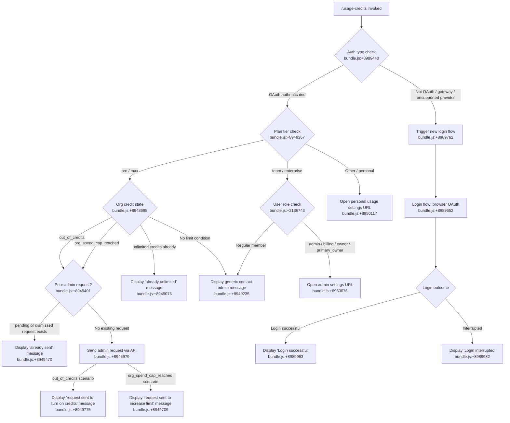

# `/usage-credits`

> Analysis basis: CC v2.1.187 bundle.js (AST extraction + Claude interpretation)
> Minimum version: v2.1.187

---

## Overview

`/usage-credits` is an interactive JSX-rendered command that helps users configure and manage usage credits when they hit an API usage limit on their organization's Claude plan. It inspects the current subscription state, queries the admin-request API, and either sends a credit-increase request to an organization admin, opens a browser settings page, or displays an informational message — depending on the user's plan tier, org credit state, and prior request history.

---

## Registration

| Field | Value |
|---|---|
| type | `local-jsx` |
| name | `usage-credits` |
| description | `Configure usage credits to keep working when you hit a limit` |
| module_id | `wpo` |
| load_inline | `true` |
| loc_byte | `8991108` |
| loc_byte_end | `8991318` |
| loc_line | `3473` |
| arbor_handler.name | `K9t` |
| arbor_handler.fqn | `claude-2.1.187::K9t` |
| arbor_handler.kind | `AsyncFunction` |
| arbor_handler.resolution_path | `module_id` |
| arbor_handler.n_hits | `0` |

Analysis basis: CC v2.1.187 bundle.js:+8991108

---

## Input Branching

The command has 5+ distinct execution paths depending on subscription plan, org credit status, existing admin-request state, and whether the user is an admin. A Mermaid flowchart is used.



---

## Behavioral Spec

### Top-level Handler (`usageCreditsHandler`)

```
async function usageCreditsHandler(commandContext):
    authState = getAuthState(commandContext)          // xi → bundle.js:+8989440

    if authState is not OAuth-based:
        // Providers: bedrock, foundry, anthropicAws, mantle, vertex are excluded
        // bundle.js:+8989762
        displayMessage("Starting new login following /usage-credits. Exit with Ctrl-C to use existing account.")
        runLoginFlow(commandContext)                  // lRe → bundle.js:+8989901
        return

    renderJSX(usageCreditsUI(commandContext))         // vpo.jsx → bundle.js:+8989347
```

Analysis basis: CC v2.1.187 bundle.js:+8989334

---

### Auth & Plan Detection (`planAndAuthResolver`)

```
function planAndAuthResolver(appState):
    // W9t → bundle.js:+8948306
    authProvider = getCurrentAuthProvider(appState)  // xi → bundle.js:+8948306

    plan = appState.plan                             // bundle.js:+8948367
    // Known plan values: "pro", "max", "team", "enterprise"

    subscriptionType = getSubscriptionType(appState) // DIe → bundle.js:+8948386
    // Values: "stripe_subscription", "stripe_subscription_contracted",
    //         "apple_subscription", "google_play_subscription"
    // bundle.js:+3076354–3076445

    userRole = getUserRole(appState)                 // Vi → bundle.js:+8948394
    // Values: "admin", "billing", "owner", "primary_owner" (privileged)
    // bundle.js:+2136743–2136769

    return { plan, subscriptionType, userRole }
```

Analysis basis: CC v2.1.187 bundle.js:+8948306

---

### Eligibility Check (`adminRequestEligibilityFetcher`)

```
async function adminRequestEligibilityFetcher(orgUUID, oauthToken):
    // f9a → bundle.js:+8949167
    // Calls: GET /api/oauth/organizations/:orgUUID/admin_requests
    //        with query param: type = "api_admin_request_eligibility"
    //        bundle.js:+8947595

    response = await apiGet(buildEligibilityURL(orgUUID))

    if response indicates "teleport-org":            // bundle.js:+8947743
        // Org uses teleport; treat as ineligible for self-serve request
        return ineligibleResult

    if response.error (HTTP 5xx or Axios error):
        // h9a → bundle.js:+8949846
        // HTTP 500 threshold: bundle.js:+8948000
        raise or return errorResult

    return eligibilityData
```

Analysis basis: CC v2.1.187 bundle.js:+8949167

---

### Existing Admin Request List (`adminRequestListFetcher`)

```
async function adminRequestListFetcher(orgUUID, oauthToken):
    // p9a → bundle.js:+8949379
    // Calls: GET /api/oauth/organizations/:orgUUID/admin_requests
    //        with query param: statuses = ["pending", "dismissed"]
    //        bundle.js:+8947244, bundle.js:+8947347

    response = await apiGet(buildListURL(orgUUID, statuses=["pending","dismissed"]))
    // bundle.js:+8949401–8949411

    return response.requests  // array of pending/dismissed admin requests
```

Analysis basis: CC v2.1.187 bundle.js:+8949379

---

### Admin Request Creation (`adminRequestCreator`)

```
async function adminRequestCreator(orgUUID, requestType, oauthToken):
    // d9a → bundle.js:+8949623
    // Calls: POST /api/oauth/organizations/:orgUUID/admin_requests
    //        endpoint literal: bundle.js:+8947036

    payload = { type: requestType }
    // requestType is "limit_increase" → bundle.js:+8949171

    response = await apiPost("/api/oauth/organizations/:orgUUID/admin_requests", payload)

    if response.error:
        raise adminRequestError

    return response
```

Analysis basis: CC v2.1.187 bundle.js:+8949623

---

### Error Classification (`axiosErrorClassifier`)

```
function axiosErrorClassifier(error):
    // h9a → bundle.js:+8949846
    // ho.isAxiosError check → bundle.js:+8947917

    if isAxiosError(error):
        statusCode = error.response.status

        if statusCode == 401:
            // OAuth revocation path
            // "OAuth token has been revoked" → bundle.js:+3094228
            return AUTH_ERROR

        if statusCode == 403:
            return FORBIDDEN_ERROR

        if statusCode == 429:
            // bundle.js:+183945
            return RATE_LIMITED

        if statusCode >= 500:
            // bundle.js:+8948000
            return SERVER_ERROR

        detail = error.response.data.detail  // "detail" literal → bundle.js:+8948206
        return HTTP_ERROR(statusCode, detail)

    return UNKNOWN_ERROR
```

Analysis basis: CC v2.1.187 bundle.js:+8949846

---

### Credit State Message Resolution (`creditStateMessageResolver`)

```
function creditStateMessageResolver(orgCreditState, plan, userRole):
    // Core credit-state literals — bundle.js:+8948688

    if orgCreditState == "out_of_credits":
        // bundle.js:+8948733
        baseMessage = "Your organization is out of usage credits. Contact your admin to add more."
        allowAdminRequest = true
        requestKind = "enable_credits"

    else if orgCreditState == "org_spend_cap_reached":
        // bundle.js:+8948898
        baseMessage = "Your organization's usage credit cap is reached for this period. Contact your admin to raise it."
        // orgLevelDisabledUntil field may be present → bundle.js:+8948815
        allowAdminRequest = true
        requestKind = "limit_increase"

    else if orgCreditState indicates "unlimited":
        // bundle.js:+8949076
        return "Your organization already has unlimited usage credits. No request needed."

    else:
        // bundle.js:+8949235
        return "Contact your admin to manage usage credit settings."

    return { baseMessage, allowAdminRequest, requestKind }
```

Analysis basis: CC v2.1.187 bundle.js:+8948688

---

### URL Open Sub-routine (`browserOpener`)

```
function browserOpener(userRole, plan):
    // Zl → bundle.js:+8950234
    // Tli → bundle.js:+3116715
    // Validates URL scheme: "http:" or "https:" → bundle.js:+3116144, 3116166

    if userRole in ["admin", "billing", "owner", "primary_owner"]:
        url = "https://claude.ai/admin-settings/usage"   // bundle.js:+8950076
    else:
        url = "https://claude.ai/settings/usage"         // bundle.js:+8950117

    openBrowser(url)
    // On darwin: uses "open" command → bundle.js:+3116851
    // Un → bundle.js:+3116873

    recordEvent("browser-opened")                        // bundle.js:+8950184
```

Analysis basis: CC v2.1.187 bundle.js:+8950234

---

### Login Fallback (`loginFlowHandler`)

```
async function loginFlowHandler(context):
    // lRe → bundle.js:+8989901
    // Triggered when auth type is not OAuth

    displayBannerMessage("Starting new login following /usage-credits. Exit with Ctrl-C to use existing account.")
    // bundle.js:+8989762

    result = await runOAuthLoginFlow(context)
    // Internally calls K9e (session management) → bundle.js:+8943885
    // Calls relaunch if needed → f.execRelaunch → bundle.js:+8943991

    if result.success:
        display("Login successful")                      // bundle.js:+8989963
    else:
        display("Login interrupted")                     // bundle.js:+8989982
```

Analysis basis: CC v2.1.187 bundle.js:+8989901

---

### Usage API Fetch (`usageApiFetcher`)

```
async function usageApiFetcher(oauthToken):
    // Sae → bundle.js:+8948535
    // Calls: GET /api/oauth/usage → bundle.js:+5135520
    // Timeout: 5000 ms → bundle.js:+5135548
    // Headers: Content-Type: application/json → bundle.js:+5135562, 5135577
    // Auth mode: no-auth (token passed separately) → bundle.js:+5135662

    response = await httpGet("/api/oauth/usage", {
        timeout: 5000,
        headers: { "Content-Type": "application/json" }
    })

    // On 401: attempt token refresh and retry
    // On retry success: appends " (401→refresh→retry succeeded)" → bundle.js:+5135763

    return response.data
```

Analysis basis: CC v2.1.187 bundle.js:+8948535

---

## State & Side Effects

| Item | Detail |
|---|---|
| Telemetry | `tengu_ember_latch` (bundle.js:+8948330) — fired during subscription/plan latch; `tengu_config_parse_error` (bundle.js:+13752866) — fired on config parse failure in dependency chain; `tengu_feature_ok` / `tengu_feature_bad` (bundle.js:+1025122, +1025189) — feature flag evaluation outcomes; `tengu_managed_settings_security_dialog_shown/accepted/rejected` — remote settings security dialog events; `tengu_policy_limits_fetch` (bundle.js:+13730188) — policy limits fetch telemetry; `tengu_auto_mode_config` (bundle.js:+13610472); `tengu_disable_bypass_permissions_mode` (bundle.js:+13612681) |
| API calls (side effects) | GET `/api/oauth/usage`; GET `/api/oauth/organizations/:orgUUID/admin_requests` (eligibility + list); POST `/api/oauth/organizations/:orgUUID/admin_requests` (create request) |
| Browser open | Opens `https://claude.ai/admin-settings/usage` (admin role) or `https://claude.ai/settings/usage` (non-admin) via OS browser command; records `browser-opened` event (bundle.js:+8950184) |
| Login relaunch | When non-OAuth auth detected, may call `f.execRelaunch` to relaunch process after OAuth login (bundle.js:+8943991) |
| appState changes | Reads `appState` via `e.getAppState` (bundle.js:+8944322); writes via `e.setAppState` (bundle.js:+8944495); account change on successful login disconnects Remote Control session (bundle.js:+8944407) |
| Hook registration | `Ei` → `b6o.register` (bundle.js:+67325) — registers interval/hook during settings polling; `wSn` uses `setInterval`/`clearInterval` for background polling (bundle.js:+3353925, +3353993) |
| Sound | None detected in depth-2 traversal |
| Credential storage | Credential write events (`secure_storage_credentials_write`, `plaintext_fallback_used`, etc.) may occur during login flow (bundle.js:+2337252, +2337499) |

---

## Version History

| Version | Change |
|---|---|
| v2.1.187 | Initial analysis |

---

## Common Mistakes

1. **Running on non-OAuth auth**: If Claude Code is configured with Bedrock, Vertex, AWS Anthropic, Mantle, Foundry, or gateway providers, `/usage-credits` will immediately redirect to a login flow rather than showing credit options — this is expected behavior, not a bug.
2. **Expecting self-serve credit purchase**: This command does not allow direct purchase. It routes through an admin-request workflow; actual credit provisioning requires the organization admin to act on the request via the Anthropic console.
3. **Already-pending requests are silently reported**: If a request with status `pending` or `dismissed` already exists, the command will display "You've already sent a usage credit request to your admin." (bundle.js:+8949470) rather than creating a duplicate. This is intentional deduplication, not an error.
4. **Team/enterprise admin role required for direct settings link**: Only users with roles `admin`, `billing`, `owner`, or `primary_owner` (bundle.js:+2136743–2136769) get the admin settings URL. Regular members see a generic contact-admin message.
5. **Network errors from the eligibility/list API are not silently swallowed**: HTTP 5xx responses from the admin-request API (threshold: 500, bundle.js:+8948000) cause an error display rather than a graceful fallback — ensure network connectivity to `claude.ai`.

---

## Appendix — Identifier Mapping

> For bundle debugging only. Identifiers change across versions.

| Identifier | Role |
|---|---|
| `K9t` | Top-level async handler for `/usage-credits` (arbor_handler, AsyncFunction) |
| `W9t` | Plan/auth/subscription resolver; dispatches to plan detection sub-functions |
| `xi` | Auth state accessor; reads current authentication provider |
| `jLr` | Auth provider sub-resolver (branch A) |
| `zLr` | Auth provider sub-resolver (branch B) |
| `ay` | Auth configuration builder / credential lookup |
| `Ad` | Low-level auth config helper (calls `--bare` flag logic) |
| `cA` | OAuth profile resolver; handles `profile-implicit`, `user_oauth`, `claude-desktop-3p` |
| `Nl` | First-party auth token resolver (`firstParty`) |
| `tT` | Token transformation utility |
| `Yg` | Auth error handler; checks `ANTHROPIC_API_KEY`, `apiKeyHelper`, `none`, required-env-vars error |
| `Zkt` | Auth state normalizer |
| `uZe` | Auth token string normalizer |
| `i0` | Subscription state accessor |
| `it` | Feature flag evaluator |
| `V9` | Feature flag cache lookup |
| `q9` | Feature flag value resolver |
| `hSn` | Feature flag registration / deduplication tracker |
| `lBr` | Feature flag experiment event emitter (`GrowthbookExperimentEvent`) |
| `mBr` | Feature flag payload/state mutator |
| `Dt` | Config file read/write dispatcher |
| `Wt` | Config file path resolver |
| `MOo` | Config object merger |
| `_Ee` | Config file reader (handles ENOENT, EEXIST, utf-8 parse) |
| `MRf` | Config file watcher/unwatcher |
| `DIe` | Subscription type classifier (`stripe_subscription`, `apple_subscription`, etc.) |
| `hc` | Auth + config composite accessor |
| `Ao` | Org/plan state reader |
| `H2` | Array inclusion check utility |
| `Vi` | User role resolver (`admin`, `billing`, `owner`, `primary_owner`) |
| `jns` | Role string normalizer |
| `nt` | String coercer utility |
| `Edt` | JSX UI component orchestrator for usage-credits screen |
| `LI` | Admin-role permission gate for UI rendering |
| `Sae` | Usage API fetcher (GET `/api/oauth/usage`, 5 s timeout) |
| `yl` | HTTP client factory |
| `Le` | HTTP request builder (GET variant) |
| `Re` | HTTP request builder (POST variant) |
| `VC` | HTTP response validator |
| `e` | Generic callback / retry helper |
| `Nk` | Axios error handler for usage API (401/403/revoked-token) |
| `cU` | Token refresh cache manager |
| `T` | HTTP transport layer (headers, redaction, logging) |
| `Xwc` | HTTP request pipeline executor |
| `Me` | JSON serializer wrapper |
| `wc` | URL path builder / `[REDACTED]` sanitizer |
| `dze` | Request deduplication helper |
| `eLc` | File-upload / buffer-length HTTP helper |
| `f9a` | Eligibility API fetcher (`api_admin_request_eligibility`) |
| `p9a` | Admin request list fetcher (`api_admin_request_list`, statuses filter) |
| `d9a` | Admin request creator (POST `api_admin_request_create`) |
| `h9a` | Axios error classifier for admin-request API (500 threshold) |
| `jH` | Admin request response parser |
| `be` | Error message string extractor |
| `ke` | Error logger / UI error renderer |
| `fo` | Error-to-string formatter |
| `Qru` | Error history ring-buffer manager |
| `Zl` | Browser URL opener dispatcher |
| `btd` | URL scheme validator (`http:` / `https:`) |
| `Tli` | OS-specific browser launch (darwin: `open`) |
| `A_` | Browser command builder |
| `Un` | Process spawner for browser open (timeout: 10) |
| `lRe` | Login fallback orchestrator; handles non-OAuth re-auth |
| `LKe` | Timestamp helper (`Date.now`) |
| `Ir` | First-party token checker |
| `K9e` | Session manager; handles OAuth token lifecycle |
| `zHa` | Session state initializer |
| `r$t` | Base session factory |
| `bas` | Session base constructor |
| `$7` | Session object builder (local-agent, remote_cowork modes) |
| `APn` | Policy settings notifier (`kD.notifyChange`) |
| `Tas` | Policy task scheduler |
| `Sno` | Remote settings loader with timeout/consent guard |
| `GHa` | Remote settings response handler |
| `Tno` | Remote settings pull logic (sha256 hash, stale cache) |
| `Wpe` | Remote settings cache reader |
| `tHa` | Remote settings hash computer (`eHa.createHash`, sha256, hex) |
| `dtp` | Remote settings diff/apply processor |
| `q7e` | Remote settings cache writer |
| `$Ha` | Remote managed settings security checker |
| `OHa` | Remote settings security dialog presenter |
| `NHa` | Remote settings rejection handler |
| `BHa` | Remote settings file persistence writer |
| `VHa` | Remote settings version accessor |
| `KHa` | Remote settings background poll scheduler |
| `wSn` | Interval manager (`setInterval`/`clearInterval`) |
| `ftp` | Background poll executor |
| `Ei` | Hook/interval registration (`b6o.register`) |
| `t9n` | Deep-equals change detector (`Bun.deepEquals`) |
| `dar` | State diff base helper |
| `Tn` | React-like state subscription manager |
| `hsn` | State subscription registry |
| `l2` | State update dispatcher |
| `f` | Process relaunch / daemon supervisor |
| `W` | Working directory resolver |
| `D` | Daemon process manager |
| `FEc` | File existence / realpath checker |
| `sp` | Spawn options builder |
| `GJf` | Daemon binary path resolver |
| `d` | Daemon write channel |
| `Kn` | Subprocess launcher with timeout |
| `o` | Output formatter (pad/map) |
| `r` | IPC data stream reader |
| `c` | Process completion handler |
| `s` | Promise lifecycle tracker (add/finally/delete) |
| `GXn` | macOS memory monitor |
| `N2e` | Session pins file reader (`pins.json`) |
| `xDt` | Pins path joiner |
| `Gt` | JSON parser wrapper |
| `kn` | JSON error classifier (`cn`) |
| `fCd` | Directory session file enumerator |
| `U` | Session retirement manager (clearTimeout/setTimeout) |
| `N` | Session retirement state checker |
| `M` | Timer write helper |
| `C3o` | Daemon claim sender (`dV.claim`, socket connect) |
| `ZOo` | Daemon state writer (pV.writeFile, JSON.stringify) |
| `pJf` | Claim send timeout handler (ECONNREFUSED) |
| `dJf` | Claim frame builder (`dV.buildClaimFrame`) |
| `Jd` | Log helper (`cn`) |
| `gR` | Binary frame encoder (Buffer, writeUInt32BE, writeUInt8) |
| `x3o` | Session lifecycle state machine (done/killed/failed/crashed/blocked/working) |
| `ec` | Session path builder |
| `Di` | Session file monitor (lstat, mtime, pinned) |
| `_g` | Active session marker |
| `cn` | Console/log output helper |
| `_ve` | Tool permission filter (LDt, P2e maps) |
| `kd` | Session metadata writer |
| `iht` | File watch helper (`uHl.then`) |
| `i8t` | State path resolver (jh.join, o8t) |
| `Eye` | Session watch path builder |
| `yR` | Session log reader (`iHl`) |
| `uN` | Session notification emitter |
| `lM` | Session log tail reader |
| `s8t` | State file path builder |
| `p` | Forced shutdown executor (`process.exit`, `u.abort`) |
| `Kb` | Shutdown reason classifier |
| `u` | Abort controller wrapper |
| `Pe` | Cleanup registration (`rKe`) |
| `rKe` | Resource cleanup registry |
| `F` | Interval disposer (`clearInterval`) |
| `o9n` | Account change handler (clears OAuth caches, triggers feature refresh) |
| `cXt` | OAuth cache clear helper |
| `qQ` | Queue/state reset utility |
| `r9a` | Feature flag cache clearer (`fpo.clear`) |
| `Lse` | Logout side-effect handler |
| `MIe` | Account identity state resetter |
| `t9a` | Auth token invalidator |
| `hpo` | HTTP client pool resetter |
| `HSn` | Feature flag refresh orchestrator (post-auth) |
| `CEi` | Feature flag payload applier (zIe, fSn maps) |
| `vEi` | Feature flag snapshot builder |
| `K5` | Global config + session state assembler |
| `o9a` | OAuth session config builder |
| `xK` | Session type inclusion checker (`itu.has`) |
| `_dt` | Config key merger (wkp, vkp, Ckp, Tkp) |
| `wkp` | Config workspace keys extractor |
| `vkp` | Config version keys validator (`s9n.has`) |
| `Ckp` | Config key conflict resolver (`Ikp.has`) |
| `Tkp` | Config transform step |
| `ex` | Flag settings aggregator (`IEt`, `pT.filter`) |
| `IEt` | Flag settings iterator |
| `WSn` | Workspace session builder |
| `Hcs` | CA certificates cache clearer |
| `Scs` | mTLS configuration cache clearer |
| `yCr` | Proxy agent cache clearer |
| `fvt` | Network layer reinitializer (rU, ISr, Yvs, az) |
| `rU` | HTTP agent factory |
| `Yvs` | Proxy URL resolver (u2, NG) |
| `az` | Proxy configuration parser (port 443/80 defaults) |
| `G9t` | Policy limits loader orchestrator |
| `EOo` | Policy limits cache invalidator |
| `AOo` | Policy limits reset helper |
| `Bme` | Policy limits condition evaluator |
| `xQn` | Policy limits timeout scheduler |
| `K9` | Policy limits state machine node |
| `QIe` | Policy limits path builder |
| `DQn` | Policy limits background poller |
| `dGl` | Policy limits fetch executor (utimes, cache) |
| `pGl` | Policy limits poll interval manager |
| `OIe` | Policy limits disposal hook |
| `jse` | Feature flag teardown (clears zIe, fSn, QRt, uBr, IW maps) |
| `net` | Feature flag system shutdown (process.off, map clears) |
| `gBr` | Feature flag interval cleaner |
| `VMt` | Trusted device enrollment skip guard |
| `Dto` | Trusted device enrollment initiator |
| `oo` | Module init bootstrapper (wPe, nsr, lYt) |
| `lYt` | Module binding helper |
| `_0e` | Session context reader (`it`) |
| `Gl` | Credential storage dispatcher (TWs) |
| `TWs` | Credential read/write/delete (primary + fallback) |
| `$Ft` | Trusted device enrollment flow (OAuth POST, policy checks, Vi) |
| `vU` | Feature flag enabled checker with hSn subscription |
| `LEi` | Feature flag lazy evaluator (IW map, getFeatureValue) |
| `Oep` | Enrollment state reader (gF) |
| `Lto` | Enrollment lock acquirer (Fu) |
| `Ls` | OAuth URL builder / environment selector (prod/staging/local) |
| `kXo` | OAuth URL environment key resolver |
| `dGc` | OAuth URL string formatter |
| `Orn` | Trusted device token extractor |
| `s9a` | Session state persistence helper |
| `U9t` | Permission mode state initializer |
| `i9n` | Permission mode loader (`hBr`) |
| `hBr` | Permission mode feature-flag reader (ext/txt/V9/Dt) |
| `e$t` | Permission state applier |
| `iH` | Permission rules mutator (setMode, addRules, replaceRules, removeRules, addDirectories, removeDirectories) |
| `Or` | Session init options resolver (working_directory, allowed_tools, permission_mode, model, effort) |
| `G8n` | Working directory option extractor |
| `os` | Session option sub-field accessor |
| `W8n` | Tool list option extractor |
| `N2` | Session option dispatcher |
| `_po` | Post-login state cleanup helper |
| `F9t` | Auto-mode configuration evaluator |
| `$9t` | Auto-mode gate logic (plan check, circuit-breaker, provider check) |
| `jz` | Auto-mode global state reader (`gSn`) |
| `zPo` | Auto-mode environment variable checker (`CLAUDE_CODE_ENABLE_AUTO_MODE`) |
| `KPo` | Auto-mode plan eligibility checker |
| `ys` | Auto-mode model compatibility checker |
| `yme` | Auto-mode model version filter (claude-3-, opus/sonnet/haiku families) |
| `jxe` | Auto-mode session validator (`H9`) |
| `sZe` | Extended-thinking model checker (`nt`) |
| `MX` | Auto-mode active flag setter |
| `O$` | Auto-mode gate denial recorder |
| `Nhe` | Permission mode change emitter (`permission_mode_changed`) |
| `HEe` | Session flag settings batch applier (`iH`) |

---

Note: index built via Arbor fallback; some signals (telemetry, literals) may be missing — see arbor-fallback.js.