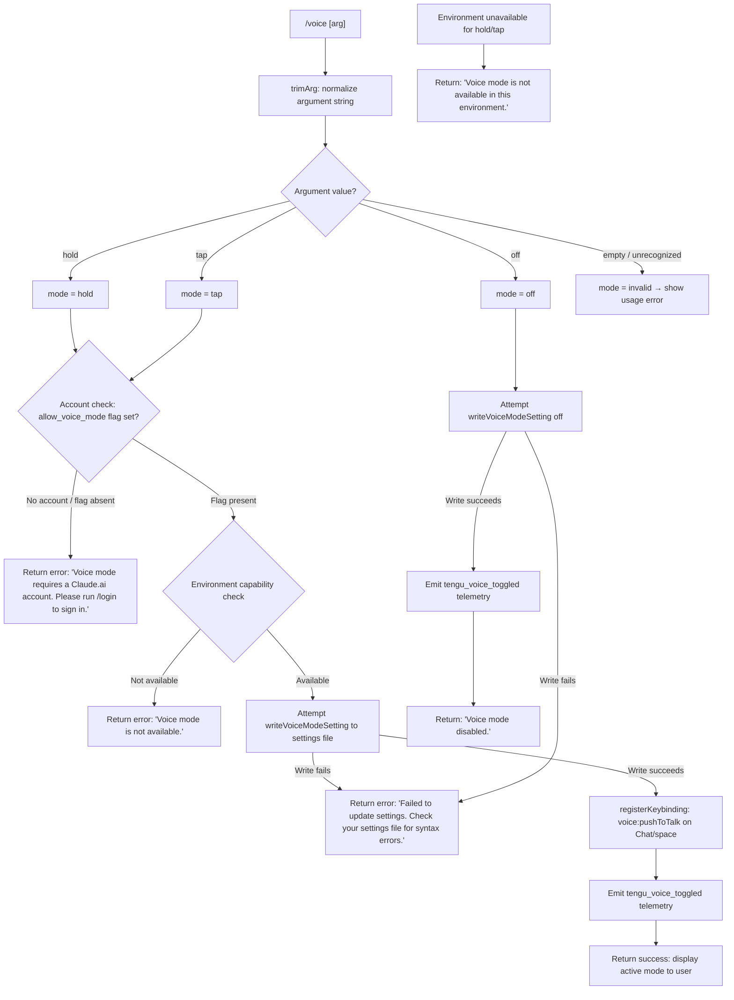

# `/voice`

> Analysis basis: CC v2.1.187 bundle.js (AST extraction + Claude interpretation)
> Minimum version: v2.1.187

---

## Overview

The `/voice` command toggles voice mode in Claude Code, accepting an optional sub-mode argument (`hold`, `tap`, or `off`). It enforces account and environment prerequisites before applying the requested mode, writes the chosen mode to persistent settings, and optionally registers a push-to-talk keybinding in the `Chat` context. When voice mode is successfully activated, it emits a `tengu_voice_toggled` telemetry event.

---

## Registration

| Field | Value |
|---|---|
| type | `local` |
| name | `voice` |
| description | `Toggle voice mode` |
| argumentHint | `[hold\|tap\|off]` |
| supportsNonInteractive | `false` |
| isHidden | `null` |
| module_id | `G$l` |
| load_inline | `true` |
| loc_byte | `12995357` |
| loc_byte_end | `12995599` |
| loc_line | `8829` |
| arbor_handler.name | `Obf` |
| arbor_handler.fqn | `claude-2.1.187::Obf` |
| arbor_handler.kind | `AsyncFunction` |
| arbor_handler.resolution_path | `module_id` |
| arbor_handler.n_hits | `1` |

Analysis basis: CC v2.1.187 bundle.js:+12995357

---

## Input Branching

The command parses the raw argument string into one of five recognized tokens and routes to distinct code paths based on account state, environment capability, settings-write success, and the decoded token. This meets the 3+ branch threshold.



Analysis basis: CC v2.1.187 bundle.js:+12992759 (hold/tap/off literals), +12992803 (invalid literal), +12992883 (login error), +12992982 (not available error), +12993408 (disabled message), +12993652 (environment unavailable message), +12993270 (settings write failure message)

---

## Behavioral Spec

### 1. Argument Normalization

```
function normalizeVoiceArg(rawInput):
    trimmed = rawInput.trim()
    if trimmed in ["hold", "tap", "off"]:
        return trimmed
    else:
        return "invalid"
```

Valid tokens are the string literals `"hold"`, `"tap"`, and `"off"`.
Analysis basis: CC v2.1.187 bundle.js:+12992759 (+12992771, +12992782, +12992803)

The `Pbf` helper performs the `.trim()` call on the raw argument before the main handler inspects it.
Analysis basis: CC v2.1.187 bundle.js:+12992712 (Pbf → e.trim), +12993103 (Obf → e.trim second call)

---

### 2. Account and Feature-Flag Gate

```
function checkVoiceModePermission(appState):
    permissionSet = loadVoiceAccessFlags(appState)   // Zgt → wXn → Js
    if not permissionSet.has("allow_voice_mode"):
        return { allowed: false, reason: "login_required" }
    return { allowed: true }
```

The feature flag name is `"allow_voice_mode"`.
Analysis basis: CC v2.1.187 bundle.js:+12982083

If the flag is absent the handler returns a text-type result containing the literal:
`"Voice mode requires a Claude.ai account. Please run /login to sign in."`
Analysis basis: CC v2.1.187 bundle.js:+12992870 (type "text"), +12992883 (message literal)

---

### 3. Environment Capability Check

```
function checkVoiceEnvironment(context):
    envCapability = queryVoiceAvailability(context)   // vXn → uA / ay
    if not envCapability:
        return { capable: false }
    return { capable: true }
```

A secondary guard returns the literal:
`"Voice mode is not available."`
Analysis basis: CC v2.1.187 bundle.js:+12992982

A third guard (checked after settings write, for hold/tap paths) returns:
`"Voice mode is not available in this environment."`
Analysis basis: CC v2.1.187 bundle.js:+12993652

The microphone permission prompt references the macOS path:
`"System Settings → Privacy & Security → Microphone"`
Analysis basis: CC v2.1.187 bundle.js:+12994159

---

### 4. Settings Write

```
async function writeVoiceModeSetting(mode, settingsPath):
    result = await saveSettingValue("voiceMode", mode, settingsPath)  // ao → Fis / oIt
    if result.error:
        return { ok: false, message: "Failed to update settings. Check your settings file for syntax errors." }
    return { ok: true }
```

The settings system ultimately resolves through the full layered settings stack:
`userSettings` → `projectSettings` → `localSettings` → flag/policy overrides.
Analysis basis: CC v2.1.187 bundle.js:+1317102, +1317153, +1317175

The settings file paths used are:
- `~/.claude/settings.json` (user settings)
- `~/.claude/settings.local.json` (local override)

Analysis basis: CC v2.1.187 bundle.js:+1317356 (`.claude`), +1317366 (`settings.json`), +1317428 (`settings.local.json`)

Failure message literal: `"Failed to update settings. Check your settings file for syntax errors."`
Analysis basis: CC v2.1.187 bundle.js:+12993270

---

### 5. Keybinding Registration (hold / tap modes only)

```
function registerPushToTalkKeybinding(appState):
    // KI → XTn → zMt
    loadKeybindingsConfig(appState)
    registerAction(
        action  = "voice:pushToTalk",
        context = "Chat",
        key     = "space"
    )
    // If action not found in keybinding table: emit tengu_keybinding_fallback_used
```

The action identifier, context, and key are fixed string literals.
Analysis basis: CC v2.1.187 bundle.js:+12994621 (`voice:pushToTalk`), +12994640 (`Chat`), +12994647 (`space`), +12994618 (KI call site on Obf)

The keybinding loader reads `keybindings.json` and validates the `"bindings"` array structure.
Analysis basis: CC v2.1.187 bundle.js:+3987688 (`keybindings.json`), +3989758 (`bindings`)

---

### 6. Disable Path (`off`)

```
async function disableVoiceMode(settingsPath):
    result = await writeVoiceModeSetting("off", settingsPath)
    if not result.ok:
        return errorResult(result.message)
    emitTelemetry("tengu_voice_toggled", { mode: "off" })
    return textResult("Voice mode disabled.")
```

Disable message literal: `"Voice mode disabled."`
Analysis basis: CC v2.1.187 bundle.js:+12993408

---

### 7. Success Path (hold / tap)

```
async function enableVoiceMode(mode, appState):
    result = await writeVoiceModeSetting(mode, appState)
    if not result.ok:
        return errorResult(result.message)
    checkAndRegisterPushToTalkKeybinding(appState)
    if not environmentSupportsVoice(appState):
        return textResult("Voice mode is not available in this environment.")
    emitTelemetry("tengu_voice_toggled", { mode: mode })
    return successResult(mode)
```

Analysis basis: CC v2.1.187 bundle.js:+12993027 (AVt call), +12993036 (Pbf call), +12993351 (W call / tengu_voice_toggled site), +12993577 (CVt call)

---

### 8. Settings-Load Infrastructure

The handler calls the full settings-loading pipeline (`PG` → `ZEr` → layered merge) which:
1. Marks a `loadSettingsFromDisk_start` performance mark
2. Reads flag settings, policy settings, user settings, project settings, and local settings
3. Emits `settings_load_started` / `settings_load_completed` log entries
4. Resolves the merged settings object

Analysis basis: CC v2.1.187 bundle.js:+1334420 (`loadSettingsFromDisk_start`), +1322125 (`settings_load_started`), +1323029 (`settings_load_completed`), +1334476 (`loadSettingsFromDisk_end`)

---

## State & Side Effects

| Item | Detail |
|---|---|
| Telemetry — primary | `tengu_voice_toggled` emitted on every successful toggle (CC v2.1.187 bundle.js:+12993353) |
| Telemetry — keybinding fallback | `tengu_keybinding_fallback_used` emitted if push-to-talk action is not found in keybinding registry (bundle.js:+3996692) |
| Telemetry — keybinding load | `tengu_custom_keybindings_loaded` emitted when user keybindings file is successfully parsed (bundle.js:+3987594) |
| Telemetry — keybinding error | `tengu_keybinding_customization_release` / `tengu_keybinding_config_invalid_structure` / `tengu_keybinding_config_parse_error` on malformed keybindings file |
| Telemetry — feature flags | `tengu_feature_ok` / `tengu_feature_bad` / `tengu_feature_sad` during feature-flag resolution (bundle.js:+1025122, +1025189, +1025270) |
| Settings write | Persists `voiceMode` value (`hold` / `tap` / `off`) to `~/.claude/settings.json` or project-local equivalent |
| Keybinding registration | Registers `voice:pushToTalk` action on `space` key in `Chat` context when activating hold/tap mode (bundle.js:+12994621) |
| appState changes | Voice mode state updated in application state; `allow_voice_mode` flag governs eligibility |
| Sound | <!-- TODO: not found in depth-2 traversal; needs --depth 4 --> |
| supportsNonInteractive | `false` — command cannot run in non-interactive/headless mode |

---

## Version History

| Version | Change |
|---|---|
| v2.1.187 | Initial analysis |

---

## Common Mistakes

1. **Running `/voice hold` or `/voice tap` without a Claude.ai account**: The command gates on the `allow_voice_mode` feature flag, which requires an active Claude.ai OAuth session. Run `/login` first.
2. **Omitting the argument**: Passing no argument (or an unrecognized token) evaluates to `"invalid"` and returns a usage error; the command does not default to any mode.
3. **Expecting interactive behavior in CI/non-interactive shells**: `supportsNonInteractive` is `false`; the command will not execute outside an interactive terminal session.
4. **Manually editing `settings.json` with syntax errors**: A JSON parse failure in the settings file causes the command to return `"Failed to update settings. Check your settings file for syntax errors."` and the mode will not change.
5. **Ignoring the environment unavailability message**: The command may pass the account gate yet still fail the environment capability check (e.g., no microphone access on the platform). Check `System Settings → Privacy & Security → Microphone` on macOS.
6. **Expecting immediate keybinding effect after `/voice off`**: The `voice:pushToTalk` keybinding is only registered on hold/tap activation; disabling voice mode does not explicitly unregister the binding in the current implementation — <!-- TODO: deregistration path not found in depth-2 traversal; needs --depth 4 -->.

---

## Appendix — Identifier Mapping

> For bundle debugging only. Identifiers change across versions.

| Identifier | Role |
|---|---|
| `Obf` | Main handler (`AsyncFunction`) for `/voice` — entry point resolved by Arbor via module_id `G$l` |
| `Zgt` | Voice permission/flag resolver — checks `allow_voice_mode` gate |
| `vXn` | Environment voice capability checker |
| `ay` | Auth/account state accessor (first-party auth check) |
| `Ad` | Auth detail helper (calls `--bare` git operation at +69429) |
| `cA` | OAuth / profile auth state loader (reads `profile-implicit`, `user_oauth`, `claude-desktop-3p`) |
| `Nl` | First-party session resolver (`"firstParty"`) |
| `tT` | Token/credential type checker |
| `Yg` | API key environment resolver (`ANTHROPIC_API_KEY`, `apiKeyHelper`, `none`) |
| `Zkt` | Notification/state helper |
| `uZe` | Notification emitter |
| `uA` | Voice availability query helper |
| `SVt` | Sub-feature toggle state |
| `wXn` | Feature flag set loader (`allow_voice_mode` lookup) |
| `Js` | Feature flag set evaluator (checks `Oad`, `Nad` sets; calls `allow_product_feedback`) |
| `nSi` | Feature flag normalizer |
| `K9` | Feature flag key resolver |
| `Vi` | Essential-traffic flag handler (`"essential-traffic"`) |
| `Lme` | Feature flag logger |
| `Qz` | Feature flag computation (calls `K9`, `cxt`, `Bme`) |
| `Ur` | Settings-load dispatcher |
| `PG` | Top-level settings loader (start/end performance marks) |
| `qL` | Settings load helper |
| `ta` | Memory usage + require loader (perf_hooks, process.memoryUsage) |
| `K3` | Dynamic `require` wrapper |
| `ZEr` | Layered settings merger (reads flag/policy/user/project/local) |
| `vn` | File append/mkdir log writer |
| `JYt` | Settings timestamp helper |
| `nCt` | Flag settings collector (`flagSettings`, `policySettings`) |
| `Nls` | Settings key enumerator |
| `lbe` | Settings path builder (`userSettings`, `projectSettings`, `localSettings`) |
| `DG` | Settings diff/merge helper |
| `Pls` | SDK inline settings handler (`"SDK inline settings"`) |
| `l2` | Settings aggregate builder |
| `gr` | Settings value getter |
| `IEt` | Settings field extractor |
| `rar` | Settings raw accessor |
| `AEt` | Settings array helper |
| `VPe` | Settings validation helper |
| `KPe` | Settings key presence checker |
| `vEt` | Settings version tracker |
| `Toe` | Settings object transformer |
| `ube` | Settings update broadcaster |
| `Asn` | Settings async notifier |
| `Zls` | Settings list helper |
| `nQ` | Settings queue flusher |
| `rCt` | Settings WSL/platform resolver (`"wsl"`) |
| `XYt` | Settings completion marker |
| `AVt` | Voice-specific app-state update helper |
| `Pbf` | Argument trimmer (`.trim()` on raw input) |
| `ao` | Settings write orchestrator (gitignore, global config, file I/O) |
| `Jm` | Settings path + aggregate helper |
| `Wt` | Working-directory resolver |
| `QEr` | Settings re-read-after-write verifier |
| `DC` | Directory context resolver |
| `XJ` | File reader with BOM detection (utf8/utf16le, CRLF/LF) |
| `Nd` | Real-path resolver |
| `T` | Path type classifier (`"debug"`) |
| `Mrn` | Directory marker helper |
| `kn` | Canonical-path resolver |
| `cn` | ENOENT error handler |
| `lEr` | Ion (timestamp) set updater |
| `Q1e` | Settings path + aggregate loader |
| `fsn` | Settings file-path resolver (`gO.resolve`, `gO.dirname`) |
| `oIt` | Atomic file-write helper (randomBytes temp file, fchmod, fsync, rename) |
| `u` | Daemon lifecycle helpers (stop/status) |
| `Le` | Daemon-stop initiator (`tengu_feature_ok`) |
| `Re` | Daemon-stop failure handler (`tengu_feature_bad`) |
| `CU` | Daemon control helper (`tengu_daemon_control`) |
| `X6` | Daemon shutdown race (Promise.race, process.exit) |
| `E7e` | EINVAL/EPERM/ENOSYS chmod error handler |
| `Me` | JSON stringify helper |
| `bH` | Cache-clear helper (YYt, xsr sets) |
| `Fis` | gitignore / git-tracked file checker (`git check-ignore`, `ls-files`) |
| `Pt` | Async-store retrieval helper |
| `xrn` | Rrn async-store getter |
| `qyr` | `cu` caller (git config helper) |
| `n` | Lowercase string helper |
| `Eon` | gitignore rule evaluator |
| `Wr` | Git process spawner (`git`, N1e, sp) |
| `lau` | Path normalizer (homedir, isAbsolute, slice) |
| `Nis` | gitignore negative-rule handler |
| `Uis` | gitignore update writer |
| `g9` | `.claude` directory path builder |
| `Mt` | Settings-write confirmation helper (`tengu_feature_sad`) |
| `W` | Shared React/UI renderer or state helper |
| `Pe` | Platform/env helper (`rKe`) |
| `rKe` | Root key-event dispatcher |
| `ke` | Settings-write executor (error log, Vi call) |
| `fo` | Error/String message wrapper |
| `nt` | String/message formatter |
| `Qru` | Crn queue (shift/push) — recent-writes ring buffer |
| `a` | MCP server-state manager (s.get, s.values, uBo) |
| `a9e` | MCP server initializer/connector |
| `RB` | MCP server registry builder |
| `Pst` | MCP server config parser |
| `y7` | MCP server connection handler |
| `K4` | MCP SDK-type server builder |
| `CRn` | MCP config error renderer (St.red, St.yellow) |
| `xst` | MCP transport-type resolver (sse, http) |
| `iF` | MCP server prototype creator |
| `d` | MCP daemon write/IPC handler |
| `Qw` | MCP server state updater |
| `eh` | MCP event emitter |
| `eJr` | MCP event helper |
| `zn` | MCP connection resolver |
| `FUt` | MCP filter helper |
| `mua` | MCP auth-cache helper |
| `cZr` | MCP needs-auth-cache reader |
| `RLe` | MCP server hash builder (sha256) |
| `fyn` | MCP server config hash |
| `myn` | MCP server hash wrapper |
| `vT` | MCP hash creator (Dli.createHash) |
| `pyn` | MCP Gl/TWs caller |
| `Gl` | MCP TWs helper |
| `ln` | MCP debug logger (`mcpDebug`) |
| `zRn` | MCP tool-dispatch controller |
| `wr` | MCP tool wrapper |
| `JVd` | MCP tool invocation handler (OAuth, authenticate, complete_authentication) |
| `QVd` | MCP OAuth callback handler |
| `BUt` | MCP auth-cache writer |
| `Xs` | MCP async-store getter (`$Fu.getStore`) |
| `tMn` | MCP needs-auth-cache path builder |
| `mJr` | MCP tool result formatter |
| `be` | String converter |
| `m` | MCP worker kill helper |
| `x` | MCP worker write/W helper |
| `eL` | MCP skills emitter (`tengu_mcp_skills`) |
| `it` | MCP skill tracker (ext, txt, V9, zIe, IW) |
| `ZXr` | MCP server-presence checker |
| `hn` | Global config save/load (`save_global`, `saveGlobalConfig fallback`) |
| `w` | Background worker scheduler (blurred/focused, 3600000 ms) |
| `aj` | Background worker helper |
| `L` | Background worker sweep (`tengu_bg_prewarm_per_sweep`, `tengu_bg_retire_pinned_low_mem`) |
| `v` | Background worker state |
| `fcc` | Worker at-index helper |
| `mcc` | Worker xnr helper |
| `Vc` | MCP error logger (`mcpError`, `jJ.logMCPError`) |
| `yua` | MCP ZW iterator |
| `ZW` | MCP async iterator (addEventListener, AggregateError) |
| `git` | MCP parseInt helper (version A) |
| `nMn` | MCP parseInt helper (version B) |
| `brr` | MCP connection-result applier (applyMcpUpdate) |
| `i9e` | MCP orphan disposer |
| `KT` | MCP cleanup helper (mit, o.cleanup, eL) |
| `mit` | MCP server cleanup (RLe hash) |
| `hla` | MCP tQr helper |
| `tQr` | MCP server status tracker |
| `l` | MCP JNl daemon-status helper |
| `JNl` | Daemon status reader (`daemon.status.json`) |
| `SQ` | Daemon Dfe helper |
| `tVt` | Daemon status path builder (`XNl.join`) |
| `uBo` | MCP server update orchestrator (getClients, a9e, brr) |
| `xRn` | MCP EVd/aJr has-checker |
| `Kn` | Timeout/abort helper (setTimeout, clearTimeout) |
| `c` | En helper |
| `KI` | Keybinding loader and push-to-talk registrar |
| `XTn` | Keybinding initializer |
| `zMt` | Keybinding config reader/validator (`keybindings.json`, `bindings`) |
| `w6r` | Keybinding qTn caller |
| `KW` | Keybinding `it` caller |
| `Vl` | Keybinding dl/Ad caller |
| `_he` | Keybinding path builder (`YTn.join`, `keybindings.json`) |
| `Gt` | JSON.parse wrapper |
| `zTn` | Array-of-objects validator (Array.isArray + e.every) |
| `qTn` | Keybinding entry builder (Object.entries, p4) |
| `rxi` | Keybinding W emitter |
| `C6r` | Keybinding duplicate-key detector (`"duplicate"`, `"warning"`) |
| `v6r` | Keybinding binding-block validator |
| `JTn` | Keybinding action mapper |
| `M6r` | Keybinding action resolver |
| `x6r` | Keybinding ztt helper |
| `YRi` | Keybinding platform mapper (linux/macos, ctrl/opt/alt/shift/cmd/super) |
| `A6r` | Keybinding display-string builder (jRi, n.join) |
| `Ve` | Keybinding action-not-found handler (`tengu_keybinding_fallback_used`) |
| `IKe` | Language/locale checker (`"en"`, o6o.has, t.split) |
| `Dt` | Config-context dispatcher (`tengu_config_parse_error`) |
| `MOo` | Config mode resolver |
| `_Ee` | Config file reader/backup manager (`Config accessed before allowed.`, `backups`) |
| `u9` | String startsWith/slice helper |
| `HGl` | Config backup directory scanner |
| `NOo` | Config backup path builder (`IS.join`) |
| `f` | Background worker manager (`tengu_bg_dispatch_sigkill_escalate`, `tengu_bg_dispatch_low_mem`) |
| `D` | Worker process wrapper (FEc, sp, ke, GJf) |
| `GXn` | Background worker memory monitor (`tengu_bg_low_mem_mb`) |
| `N2e` | Stale-file cleaner (gb.lstat, gb.rm, gb.readFile) |
| `U` | Worker idle-exit timer (`tengu_daemon_idle_exit`, setTimeout/clearTimeout) |
| `C3o` | Worker socket connector (dV.claim, Yrr.connect, `tengu_bg_sendclaim_failed`) |
| `x3o` | Worker roster/state manager (`state.json`, daemon/idle/bg/active states) |
| `p` | Forced-shutdown handler (Kb, process.exit, u.abort) |
| `F` | Interval clearer (clearInterval) |
| `MRf` | Config file watcher (mis.watchFile, `_Gl.unwatchFile`) |
| `fIt` | File-watch registration helper |
| `uV` | Config-watch state helper |
| `Ei` | b6o.register helper |