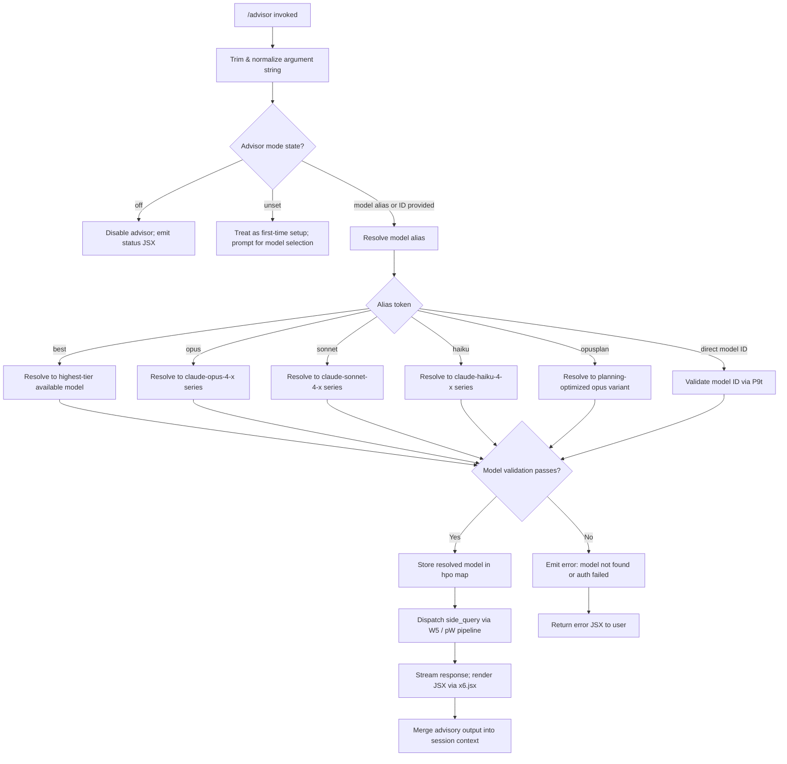

# `/advisor`

> Analysis basis: CC v2.1.190 bundle.js (AST extraction + Claude interpretation)
> Minimum version: v2.1.190

---

## Overview

`/advisor` enables Claude Code to consult a stronger or more capable model at key decision points during a session. When invoked, the command dispatches a "side query" to a separate model (resolved by tier alias such as `best`, `opus`, `sonnet`, `haiku`, or a direct model identifier), renders JSX-based output inline, and merges the advisory response back into the active conversation context. It is the primary mechanism by which Claude Code escalates reasoning to a more powerful model without replacing the current session model entirely.

---

## Registration

| Field | Value |
|---|---|
| type | `local-jsx` |
| name | `advisor` |
| description | `Let Claude consult a stronger model at key moments` |
| argumentHint | `[ ... ]` |
| isHidden | `null` (not hidden) |
| module_id | `COl` |
| load_inline | `true` |
| loc_byte | `12667590` |
| loc_byte_end | `12667846` |
| loc_line | `8672` |
| arbor_handler.name | `C_f` |
| arbor_handler.fqn | `claude-2.1.190::C_f` |
| arbor_handler.kind | `AsyncFunction` |
| arbor_handler.resolution_path | `module_id` |
| arbor_handler.n_hits | `2` |

Analysis basis: CC v2.1.190 bundle.js:+12667590

---

## Input Branching

The command exhibits 4+ distinct branches depending on advisor mode state, model alias resolution, and API availability. A Mermaid flowchart is used.



Analysis basis: CC v2.1.190 bundle.js:+12667068, +12667104, +12667134, +12667145, +8939440, +8939603

---

## Behavioral Spec

### 1. Entry Point and Argument Normalization

The main handler is the async function `advisorCommandHandler` (bundle identifier: `C_f`).

```
async function advisorCommandHandler(rawArg, context):
    trimmedArg = rawArg.trim()                      // C_f → n.trim @ +12667068
    if trimmedArg == "off" or trimmedArg == "unset":
        updateAdvisorModeState(trimmedArg)
        return renderStatusJSX(trimmedArg)          // x6.jsx @ +12667104
    resolvedModel = resolveModelAlias(trimmedArg)   // Qo @ +12667202
    if resolvedModel is invalid:
        return renderErrorJSX("Model name cannot be empty")  // literal @ +8939126
    validationResult = validateModelAccess(resolvedModel)    // P9t @ +12667216
    if validationResult.ok:
        persistAdvisorModel(resolvedModel)           // hpo.set @ +8939603
        sideQueryResult = dispatchSideQuery(resolvedModel, context)  // W5 @ +8939440
        return renderAdvisoryOutput(sideQueryResult) // x6.jsx, Bke @ +12667290
    else:
        return renderErrorJSX(validationResult.error)
```

Analysis basis: CC v2.1.190 bundle.js:+12667068, +12667104, +12667202, +12667216, +12667290, +12667363

---

### 2. Model Alias Resolution

The alias resolver (`resolveModelAlias`, bundle identifier: `Qo`) maps short human-readable tokens to canonical model identifiers. It normalizes the input to lowercase before comparison.

```
function resolveModelAlias(input):
    normalized = input.toLowerCase()    // Qo → t.toLowerCase @ +2297863
    normalized = stripWhitespace(normalized)  // nl @ +2297891

    switch normalized:
        case "best":
            return selectHighestTierModel()    // MGs @ +2298159
        case "opus":
            return "claude-opus-4-x"           // literals @ +2298111, +2294780..+2294869
        case "sonnet":
            return "claude-sonnet-4-x"         // literals @ +2298033, +2294901..+2295057
        case "haiku":
            return "claude-haiku-4-x"          // literals @ +2298072, +2295091
        case "opusplan":
            return selectOpusPlanVariant()     // literal "opusplan" @ +2297992
        case "fable":
            return "claude-fable-5"            // literals @ +2297929, +2281884
        default:
            return parseDirectModelId(input)   // cz @ +2297964, S3u @ +2298232

    // Normalizes [1m] bracket notation → canonical form
    // literal "[1m]" @ +2297977
```

Known model identifiers handled by the resolver include (non-exhaustive sample):
- `claude-mythos-5` (bundle.js:+2294495)
- `claude-opus-4-8` through `claude-opus-4-0` (bundle.js:+2294552..+2294869)
- `claude-sonnet-4-6` through `claude-sonnet-4-0` (bundle.js:+2294901..+2295057)
- `claude-haiku-4-5` (bundle.js:+2295091)
- `claude-3-7-sonnet`, `claude-3-5-sonnet`, `claude-3-5-haiku`, `claude-3-opus`, `claude-3-sonnet`, `claude-3-haiku` (bundle.js:+2295150..+2295441)
- `claude-fable-5` (bundle.js:+2281884)
- `claude-mythos-preview` (bundle.js:+3034544)

Analysis basis: CC v2.1.190 bundle.js:+2297852, +2297863, +2297881, +2297944, +2298010

---

### 3. Model Validation

`validateModelAccess` (bundle identifier: `P9t`) confirms the model is accessible before storing the selection or dispatching a query.

```
async function validateModelAccess(modelId):
    trimmed = modelId.trim()                        // P9t → e.trim @ +8939089
    if trimmed is empty:
        throw Error("Model name cannot be empty")  // literal @ +8939126
    normalized = trimmed.toLowerCase()             // n.toLowerCase @ +8939274
    if normalized is in blocklist (wfe):
        return { ok: false, error: "blocked" }     // wfe.includes @ +8939293
    if modelId already cached in hpo:
        return { ok: true, cached: true }          // hpo.has @ +8939395
    
    // Resolve provider context
    providerConfig = buildProviderConfig(modelId)   // Da @ +8939160
    
    // Validate against API
    validationResponse = await callValidationEndpoint(modelId)  // W5 @ +8939440
    // Validation type stored as "model_validation"              // literal @ +8939490
    // Sends a minimal "Hi" ephemeral message                    // literals @ +8939559, +8939584

    if validationResponse.error == "auth":
        return { ok: false, error: "Authentication failed. Please check your API credentials." }
        // literal @ +8939862
    if validationResponse.error == "network":
        return { ok: false, error: "Network error. Please check your internet connection." }
        // literal @ +8939964
    if validationResponse.error.type == "not_found_error":
        return { ok: false, error: "model: <id> not found" }
        // literals @ +8940062, +8940083, +8940165
    return { ok: true }
```

Analysis basis: CC v2.1.190 bundle.js:+8939089, +8939126, +8939160, +8939274, +8939293, +8939395, +8939440, +8939490, +8939559, +8939584, +8939862, +8939964, +8940062

---

### 4. Model Name Normalization for Storage

`normalizeModelNameForStorage` (bundle identifier: `xkp` / inner `Mkp`) canonicalizes model name aliases into storage keys, handling both hyphen and underscore conventions.

```
function normalizeModelNameForStorage(modelId):
    lower = modelId.toLowerCase()               // Mkp → e.toLowerCase @ +8940414
    
    // Hyphen/underscore alias pairs:
    // "fable-5" / "fable_5"                    // literals @ +8940444, +8940467
    // "opus-4-8" / "opus_4_8"                  // literals @ +8940544, +8940568
    // "opus-4-7" / "opus_4_7"                  // literals @ +8940613, +8940637
    // "opus-4-6" / "opus_4_6"                  // literals @ +8940682, +8940706
    // "opus-4-5" / "opus_4_5"                  // literals @ +8940751, +8940775
    // "sonnet-4-6" / "sonnet_4_6"              // literals @ +8940820, +8940846
    // "sonnet-4-5" / "sonnet_4_5"              // literals @ +8940895, +8940921

    if lower includes known alias token:        // t.includes @ +8940433
        return canonicalForm(lower)             // Kp @ +8940518
    return String(lower)                        // xkp → String @ +8940364
```

Analysis basis: CC v2.1.190 bundle.js:+8939644, +8939699, +8940414, +8940433, +8940444

---

### 5. Side Query Dispatch Pipeline

The core query dispatching is handled by `dispatchSideQuery` (bundle identifier: `W5`) which orchestrates the full API call lifecycle.

```
async function dispatchSideQuery(modelId, sessionContext):
    // Build API client configuration
    apiClient = buildApiClient(modelId)                 // pW @ +8819941
    
    // Resolve authentication token
    token = await getAuthToken()                        // I.getToken @ +3026623
    
    // Compose request headers including:
    // "x-app", "cli-bg" / "cli", "User-Agent",
    // "X-Claude-Code-Session-Id",
    // "x-claude-remote-container-id",
    // "x-claude-remote-session-id",
    // "x-client-app", "x-claude-code-agent-id",
    // "x-claude-code-parent-agent-id"
    // literals @ +3022062..+3022329
    
    // Set side_query context flag
    requestContext.type = "side_query"                  // literal @ +8819973

    // Apply structured_outputs if supported              // literal @ +8820101
    // Apply cache_control                                // literal @ +8822143
    
    // Check for lone surrogates; sanitize if present
    // telemetry: tengu_lone_surrogate_sanitized         // @ +8821340
    
    // Dispatch fetch request
    response = await fetchWithRetry(request)            // xJe @ +3026593
    
    // On success:
    // telemetry: tengu_api_success                      // @ +8821644
    
    // Handle Bedrock service tier header if present
    // "X-Amzn-Bedrock-Service-Tier"                     // literal @ +3023720
    
    // Compute/return response
    return processStreamingResponse(response)
```

Analysis basis: CC v2.1.190 bundle.js:+8819928, +8819941, +8820066, +8820095, +8820101, +8821340, +8821429, +8821616, +8821629, +8821675

---

### 6. Advisory Output Rendering

`renderAdvisoryOutput` (bundle identifier: `Bke` and inner `Out`) composes the JSX component tree for display.

```
function renderAdvisoryOutput(queryResult, sessionContext):
    // Filter eligible messages from session
    eligible = sessionContext.messages.filter(eligibilityFilter)  // Out → Yvp.filter @ +8670168
    
    // Build composite message object
    composite = buildCompositeMessage(eligible)         // wBn @ +8670184
    
    // Resolve model info for display header
    modelInfo = resolveModelDisplayInfo(queryResult)    // Bke → Da @ +8670212
    
    // Apply text normalization
    normalizedText = normalizeSentenceCase(queryResult.text)  // Bke → Eo @ +8670251
    
    // Check overlap/deduplication
    deduplicated = deduplicateContent(normalizedText)  // Bke → _uo @ +8670259

    return x6.jsx(AdvisoryComponent, {
        model: modelInfo,
        content: deduplicated,
        source: composite
    })
```

Analysis basis: CC v2.1.190 bundle.js:+12667290, +12667363, +8670131, +8670168, +8670184, +8670212, +8670251, +8670259

---

### 7. Provider Configuration and Backend Routing

`buildProviderConfig` (bundle identifier: `Da`) handles the multi-provider routing logic, selecting the correct backend based on configured provider type.

```
function buildProviderConfig(modelId):
    // Supported provider types detected via literals:
    // "bedrock"     @ +2131018
    // "foundry"     @ +2131068
    // "mantle"      @ +2131178
    // "vertex"      @ +2131226
    // "anthropicAws"@ +2131691
    // "gateway"     @ +2131711
    // "firstParty"  @ +2131842

    provider = detectProviderFromEnvironment()      // dCt @ +2277957

    switch provider:
        case "bedrock":
            config = buildBedrockConfig(modelId)    // pCt @ +2277974
        case "vertex":
            config = buildVertexConfig(modelId)     // qXe @ +2278480
        case "foundry":
            config = buildFoundryConfig(modelId)    // Lfe @ +2278013
        case "gateway":
            config = buildGatewayConfig(modelId)    // JNe @ +2278007
        default:
            config = buildFirstPartyConfig(modelId) // Rwt @ +2278834

    return mergeWithPolicySettings(config)         // "policySettings" literal @ +2278389
```

Analysis basis: CC v2.1.190 bundle.js:+2131018, +2131068, +2131178, +2131226, +2277957, +2277974, +2278007, +2278013, +2278389, +2278834

---

### 8. CLI Error Handling

The error shutdown path (bundle identifier: `Is`) handles fatal errors during the side query lifecycle.

```
function handleFatalError(errorContext):
    // Emit "cli_error" data event                   // literals "data", "cli_error" @ +17095643, +13087677
    emitDataEvent("cli_error", errorContext)        // dqe @ +13087667
    
    // Log internal trace                            // iT @ +13087674
    logInternalTrace(errorContext)
    
    // Exit with code 1                              // process.exit @ +13087690, literal 1 @ +13087703
    process.exit(1)
```

Analysis basis: CC v2.1.190 bundle.js:+17095643, +13087667, +13087674, +13087677, +13087690, +13087703

---

## State & Side Effects

| Item | Detail |
|---|---|
| Telemetry | `tengu_api_success` (bundle.js:+8821644) — fired on successful side query completion |
| Telemetry | `tengu_lone_surrogate_sanitized` (bundle.js:+8821340) — fired when input text contains lone Unicode surrogates that are sanitized |
| Telemetry | `tengu_prompt_cache_1h_config` (bundle.js:+13504112) — fired when 1-hour prompt cache configuration is applied |
| Telemetry | `tengu_scheduled_task_fire` (bundle.js:+16519369) — background task scheduler tick |
| Telemetry | `tengu_scheduled_task_expired` (bundle.js:+16519712) — scheduled task expiry |
| Telemetry | `tengu_bg_retire_grace_bridged_min` (bundle.js:+13055086) — background worker grace-period retirement |
| Telemetry | `tengu_bg_retire_pinned_low_mem` (bundle.js:+17202918) — pinned worker retired due to low memory |
| Telemetry | `tengu_bg_attach_upgrade` (bundle.js:+13055158) — background worker attachment upgrade |
| Telemetry | `tengu_bg_prewarm_per_sweep` (bundle.js:+17203039) — background worker pre-warm sweep |
| Persistent state | Resolved advisor model stored in `hpo` map (`hpo.set` @ bundle.js:+8939603); checked on subsequent invocations via `hpo.has` @ +8939395 |
| appState changes | Advisor mode transitions between `"off"`, `"unset"`, and an active model identifier (literals @ bundle.js:+12667134, +12667145) |
| Session context | Side query response merged into active session conversation context via `Bke` / `Out` pipeline |
| API side effect | A minimal validation probe message (`"Hi"`, type `"ephemeral"`) is sent to confirm model accessibility before committing model selection (bundle.js:+8939559, +8939584) |
| Prompt cache | Cache-control header applied to side queries; `"1h"` TTL used for prompt caching (bundle.js:+8820862, +8822143) |
| Sound | <!-- TODO: not found in depth-2 traversal; needs --depth 4 --> |

---

## Version History

| Version | Change |
|---|---|
| v2.1.190 | Initial analysis |

---

## Common Mistakes

1. **Passing a model ID with leading/trailing whitespace** — The handler trims the argument (`n.trim` at bundle.js:+12667068), so this is safe; however passing an empty string after trimming triggers the `"Model name cannot be empty"` error (bundle.js:+8939126).

2. **Using `off` or `unset` when intending to set a model** — These are reserved state tokens. Passing `off` disables the advisor feature; `unset` resets it to the default unconfigured state. Neither will trigger model selection.

3. **Expecting instant availability after `/advisor off`** — Disabling the advisor changes the mode state but does not clear the cached model entry in the `hpo` map; a subsequent re-enable will reuse the previously validated model.

4. **Using hyphen vs. underscore aliases inconsistently** — Both forms (e.g., `opus-4-8` and `opus_4_8`) are normalized to the same canonical key by `normalizeModelNameForStorage` (bundle.js:+8940544, +8940568), so they are interchangeable at the CLI.

5. **Assuming the `best` alias always maps to the same model** — The `best` alias resolves dynamically via `selectHighestTierModel` (`MGs` at bundle.js:+2298159), which may return different models across versions or depending on the configured provider backend.

6. **Using the advisor command on non-first-party providers without checking model availability** — Provider routing (bedrock, foundry, vertex, etc.) uses different config builders; a model valid on the Anthropic first-party API may return `not_found_error` on a cloud-provider backend (bundle.js:+8940083).

---

## Appendix — Identifier Mapping

> For bundle debugging only. Identifiers change across versions.

| Identifier | Role |
|---|---|
| `C_f` | Main async handler for `/advisor` command (`advisorCommandHandler`) |
| `Qo` | Model alias resolver — maps short tokens to canonical model IDs |
| `P9t` | Model validation function — probes API access for a given model ID |
| `W5` | Side query dispatcher — orchestrates full API call for advisor query |
| `pW` | API client factory / request pipeline builder |
| `Bke` | Advisory output composer — builds JSX component tree from query result |
| `Out` | Session message filter / composite message builder for advisory output |
| `wBn` | Composite message assembler (wraps `Bke`, `Mp`, `Qo`) |
| `Da` | Provider configuration builder — multi-backend routing |
| `Mkp` | Model name normalization for storage (hyphen/underscore aliases) |
| `xkp` | Outer wrapper for model name normalization |
| `Is` | Fatal CLI error handler (emits `cli_error`, calls `process.exit`) |
| `Eo` | Text/output normalization utility |
| `_uo` | Content deduplication / overlap checker |
| `yJe` | Content inclusion checker |
| `Efn` | Entity/reference formatter |
| `MGs` | "Best" model selector — resolves highest-tier available model |
| `Rwt` | First-party (Anthropic direct) API config builder |
| `JNe` | Gateway provider config builder |
| `Lfe` | Foundry provider config builder |
| `dCt` | Provider type detector |
| `pCt` | Bedrock config builder |
| `qXe` | Vertex config builder |
| `xJe` | HTTP fetch wrapper for API requests |
| `GTe` | Provider-type-aware request composer |
| `UFe` | Model capability / feature flag checker |
| `tse` | Request serializer |
| `ixr` | Foundry resource URL normalizer |
| `vH` | Model metadata resolver |
| `jvt` | Model info extractor |
| `DFu` | Prefix-based model family detector |
| `UNe` | Model enumeration / value mapper |
| `Dln` | Proxy auth helper with trust gating |
| `XZu` | SSE / streaming session manager |
| `ny` | Retry/backoff orchestrator |
| `qZu` | Streaming response processor |
| `BTe` | Timed promise / deadline wrapper |
| `VUr` | URL component splitter/parser |
| `Ws` | Background-mode header injector |
| `Nz` | User-agent string builder |
| `SRr` | URL encoder for request parameters |
| `T` | Request formatter / header assembler |
| `xh` | Token refresh coordinator |
| `FGs` | Boolean feature flag coercer |
| `ay` | Streaming event aggregator |
| `WZu` | Retry-state tracker |
| `$kt` | Authorization header normalizer |
| `RIe` | Anthropic SDK log relay |
| `w_n` | Structured output / JSON schema injector |
| `D` | Output write coordinator |
| `k` | TTL-based request cache |
| `w` | Focus/blur aware rate limiter |
| `v` | Response accumulator |
| `Rre` | Model capability matcher |
| `qC` | Prompt builder |
| `dA` | Auth provider dispatcher |
| `Lfn` | API key resolution / context store accessor |
| `Za` | String coercion utility |
| `vfn` | AsyncLocalStorage context accessor |
| `NTe` | Token envelope builder |
| `KSn` | Request signing utility |
| `m6e` | Cache-control annotation applicator |
| `Ao` | Agent invocation assembler |
| `it` | Background task registration |
| `nD` | HIPAA-mode config filter |
| `sFr` | Safe-request builder |
| `NFe` | HIPAA feature gate |
| `L` | Background worker sweep manager |
| `V` | Worker lifecycle state machine |
| `PVt` | Memory pressure checker |
| `J2l` | Worker grace-period bridge |
| `B2e` | File-based state persistence |
| `F` | Interval-based scheduler |
| `WXn` | Worker attachment upgrader |
| `N_n` | Temperature / sampling config injector |
| `YC` | Message mapper |
| `Uwe` | Tool-use response assembler |
| `yW` | Random-bytes ID generator |
| `hc` | Tool result aggregator |
| `Me` | JSON serializer wrapper |
| `o8o` | Content block stack manager |
| `WJt` | Content block validator |
| `kN` | Deep-clone utility |
| `VJt` | Content block rebuilder |
| `qJt` | Text escape processor |
| `Ve` | ANSI/color reset helper |
| `aKe` | Terminal escape sequence emitter |
| `lxr` | Streaming chunk validator |
| `JWs` | Structured output schema parser |
| `axr` | Capability set accumulator |
| `PSe` | Post-stream cleanup handler |
| `Rr` | Response finalizer |
| `Ng` | Output formatter |
| `Fo` | Final output emitter |
| `GDt` | Agent dispatch coordinator |
| `hNi` | Built-in agent resolver |
| `$nt` | Agent notification emitter |
| `BDt` | Agent result aggregator |
| `YU` | Agent ID parser / dispatcher |
| `RCd` | Agent URI resolver |
| `oD` | Thread-type classifier |
| `lEt` | Cache label applicator |
| `n` | Input string parameter (varies by call site) |
| `i` | Session/connection handle (varies by call site) |
| `r` | Request/response object (varies by call site) |
| `s` | Subscription/set handle (varies by call site) |
| `e` | Generic first parameter (varies by call site) |
| `t` | Generic second parameter (varies by call site) |
| `wH` | Wrapper for model feature detection |
| `Mfe` | Model family extractor |
| `nt` | String normalization primitive |
| `nl` | Whitespace/newline normalizer |
| `ix` | Provider inclusion checker |
| `QNe` | Query normalization entry point |
| `fRr` | Full request builder |
| `Kp` | Canonical model ID builder |
| `cz` | Context-zone detector |
| `Fwt` | Format string replacer |
| `XC` | Cross-context model resolver |
| `yfn` | Model + variant resolver |
| `Vu` | Variant extractor |
| `Zoe` | Zone-based model override |
| `mRr` | Model reference resolver |
| `jG` | JSON/text replacer |
| `n_` | Nested model string parser |
| `DTe` | Display text extractor |
| `Ir` | Identity / pass-through resolver |
| `Eu` | Enumerated union resolver |
| `Rfe` | Response field extractor |
| `kfe` | Inclusion checker (content field) |
| `Hfn` | Hierarchical model name formatter |
| `RGs` | Registry entry serializer |
| `Tn` | Token normalizer |
| `kGs` | Key/index searcher |
| `_3u` | Underscore-prefix token handler |
| `y3u` | `y`-series model alias handler |
| `zoe` | Zone-override checker |
| `ZNe` | Zone normalization entry |
| `S3u` | Simple lowercase resolver |
| `pU` | Provider-union config builder |
| `t_` | Text field extractor with replacement |
| `FEt` | Format escape transformer |
| `Mp` | Regex replacer |
| `guo` | Greeting / utility output |
| `Efn` | Entity formatter |
| `Bo` | Boolean operator utility |
| `Eo` | Enumerated output formatter |
| `OBa` | Object builder / assembler |
| `dar` | Timestamp recorder |
| `zH` | Zone handler / context switcher |
| `wr` | Write relay |
| `g` | Generic getter |
| `a` | Generic accessor |
| `I` | Interface / event handler |
| `fo` | Error/string factory |
| `ke` | Key emitter / event logger |
| `_` | SDK transport client |
| `nyt` | Network yield transformer |
| `GDt` | (see above) Agent dispatch coordinator |
| `z` | Keyboard/event handler |
| `W` | Worker reference |
| `q` | Queue handle |
| `zn` | Zone navigator |
| `F` | (see above) Interval scheduler |

---

Note: index built via Arbor fallback; some signals (telemetry, literals) may be missing — see arbor-fallback.js.