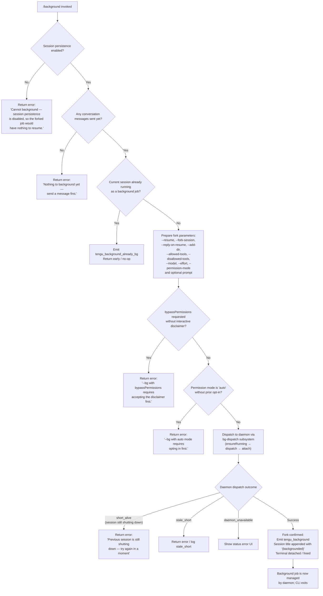

# `/background`

> Analysis basis: CC v2.1.190 bundle.js (AST extraction + Claude interpretation)
> Minimum version: v2.1.190

---

## Overview

The `/background` command (alias: `/bg`) sends the current interactive session to a persistent background daemon, freeing the terminal for other use. It forks the active session into a background job managed by the Claude Code daemon process, then detaches the terminal. An optional prompt argument may be queued for the forked session to act on immediately upon detachment.

---

## Registration

| Field | Value |
|---|---|
| type | `local-jsx` |
| name | `background` |
| description | `Send this session to the background and free the terminal` |
| aliases | `["bg"]` |
| argumentHint | `[prompt]` |
| immediate | `null` |
| module_id | `zBl` |
| load_inline | `true` |
| loc_byte | `13127474` |
| loc_byte_end | `13127714` |
| loc_line | `9075` |
| arbor_handler.name | `qIf` |
| arbor_handler.fqn | `claude-2.1.190::qIf` |
| arbor_handler.kind | `AsyncFunction` |
| arbor_handler.resolution_path | `module_id` |
| arbor_handler.n_hits | `0` |

Analysis basis: CC v2.1.190 bundle.js:+13127474

---

## Input Branching

The command has 4+ distinct branches depending on session persistence state, whether the session has any conversation history, and the daemon availability outcome. A Mermaid flowchart is used.



---

## Behavioral Spec

### Handler: `qIf` (async)

The Arbor-resolved handler is the async function `qIf` (FQN: `claude-2.1.190::qIf`), reached via `module_id` resolution path.

Analysis basis: CC v2.1.190 bundle.js:+13126714 (handler entry)

```
async function backgroundCommandHandler(context):
    // Guard: persistence must be enabled
    if not sessionPersistenceEnabled(context):
        return errorUI("Cannot background — session persistence is disabled, ...")
        // literal at bundle.js:+13126794

    // Guard: must have at least one message in conversation
    if conversationIsEmpty(context):
        return errorUI("Nothing to background yet — send a message first.")
        // literal at bundle.js:+13126970

    // Guard: already running as a background job
    if currentSessionIsBackgroundJob(context):
        emit telemetry("tengu_background_already_bg")  // +13126728
        return early

    // Build CLI flags for the forked invocation
    flags = buildForkFlags(context):
        // "--resume", "--fork-session", "--reply-on-resume" (+13121093, +13121106, +13121148)
        // "--add-dir" (+13121200)
        // "--allowed-tools" (+13121235)
        // "--disallowed-tools" (+13121276)
        // "--model" (+13121307)
        // "--effort" (+13121336)
        // "--permission-mode" (+13121353)
        // "--" separator (+13121381)

    // Guard: bypassPermissions requires prior interactive acceptance
    if bypassPermissions requested and not interactivelyAccepted:
        return errorUI("--bg with bypassPermissions requires accepting the disclaimer first. ...")
        // literal at bundle.js:+13109468

    // Guard: auto permission mode requires prior opt-in
    if permissionMode == "auto" and not autoModeOptedIn:
        return errorUI("--bg with auto mode requires opting in first. ...")
        // literal at bundle.js:+13109630

    // Dispatch the forked session to the daemon
    result = await bgDispatch(flags, context)
        // calls ensureDaemonRunning → dispatchJob → attachJob
        // timeout: 2000ms flush timeout (+13121037 / +13121042)
        // AbortSignal.timeout used (+13122711)

    // Handle dispatch outcomes
    match result.status:
        case "short_alive":
            return errorUI("Previous session is still shutting down — try again in a moment")
            // literal at bundle.js:+13094456
        case "stale_short":
            log("stale_short")  // +13094534
            return errorUI(...)
        case "daemon_unavailable":
            emit telemetry("tengu_background_spawn_failed")  // +13121737
            show status error UI
        case success:
            emit telemetry("tengu_background")  // +13122538
            // tag session title with "(backgrounded)" (+13123273)
            // update command history type = "command" (+13122794)
            detachTerminal()
```

Analysis basis: CC v2.1.190 bundle.js:+13126714 – +13127040

---

### Sub-feature: Daemon Ensure-Running (`ensureDaemonRunning`)

Called as part of the dispatch path to guarantee the background daemon is available before sending the job.

Analysis basis: CC v2.1.190 bundle.js:+13044236

```
async function ensureDaemonRunning(options):
    emit telemetry("tengu_bg_daemon_ensure_running") when polling // +13044279

    if daemonServiceExecPathIsStale():
        emit telemetry("tengu_bg_daemon_service_stale_exec")  // +13044354
        log warning about stale binary; fall back to transient spawn

    if daemonStatus == "up":
        return success

    if daemonStatus == "ask":
        promptUser("Install as a service now? [y/N/never, or 'once' just for now] ")
        // literal at +13051955
        handle response: "yes", "once", "no", "never"
        emit telemetry("tengu_bg_daemon_cold_start_ask")  // +13045302

    if platform == "macos" or platform == "linux":
        attemptDaemonSpawn()
        wait up to 5000ms (+13044726)
        if failed:
            emit telemetry("tengu_bg_daemon_spawn_failed")  // +13045873

    if transient spawn unreachable:
        emit telemetry("tengu_bg_daemon_ensure_transient_unreachable")  // +13046854
```

---

### Sub-feature: Background Dispatch (`bgDispatch` / `AMo`)

Handles the IPC dispatch of the forked job to the running daemon.

Analysis basis: CC v2.1.190 bundle.js:+13084331

```
async function bgDispatch(flags, context):
    emit telemetry("tengu_bg_dispatch")  // +13086452
    jobId = randomUUID()

    result = await sendDispatchOverSocket(jobId, flags):
        // Connect to daemon control socket (Ty / qKn subsystem)
        // Socket timeout: 6000ms (+13084839)
        // Control key authentication required

    match result.code:
        case "EALIVE":
            // session still alive (short_alive)
            emit "tengu_bg_dispatch_rescued"  // +13093516 on rescue
            ...
        case "ESTARTING":
            return { status: "estarting" }
        case "ENOCONN":
            return { status: "daemon-unreachable" }
        case success:
            emit telemetry("tengu_background")
            return { status: "ok", jobId }
        case stale drop:
            emit telemetry("tengu_bg_dispatch_stale_drop")  // +13185250
```

---

### Sub-feature: Fork Parameter Assembly (`buildForkArgs` / `IIf`)

Collects all flags to reconstruct the CLI invocation for the forked background job.

Analysis basis: CC v2.1.190 bundle.js:+13090012

```
function buildForkArgs(sessionState, options):
    args = []

    // Session identity
    args.push("--resume", currentSessionId)         // +13121093
    args.push("--fork-session")                      // +13121106

    if options.replyOnResume:
        args.push("--reply-on-resume")               // +13121148

    // Working directory additions
    for each addedDir in sessionState.addedDirs:
        args.push("--add-dir", dir)                 // +13121200

    // Tool allow/deny lists
    if allowedTools.length > 0:
        args.push("--allowed-tools", ...allowedTools) // +13121235
    if disallowedTools.length > 0:
        args.push("--disallowed-tools", ...)          // +13121276

    // Model and effort
    if model:
        args.push("--model", model)                  // +13121307
    if effort:
        args.push("--effort", effort)                // +13121336

    // Permission mode
    if permissionMode:
        args.push("--permission-mode", permissionMode) // +13121353

    // Prompt passthrough
    if options.prompt:
        args.push("--", options.prompt)              // +13121381

    return args
```

---

### Sub-feature: Attach & Terminal Detach (`attachAndDetach` / `RJf`)

After the daemon accepts the dispatch, the current terminal session is handed off to the daemon worker and the CLI process exits.

Analysis basis: CC v2.1.190 bundle.js:+13182354 (attach protocol), +13122700 (detach path)

```
async function attachAndDetach(jobId, daemonSocket):
    // Send "attach" message with control key authentication
    // daemon verifies peer UID or control key
    // +17185117 / +17185193 for auth error paths

    if attachResult.code == "EUNVERIFIED":
        log("worker is live but supervisor could not verify identity")
        // +17187684
        return errorUI(...)

    if attachResult.code == "ERESPAWNING":
        // legacy respawn in progress
        emit telemetry("tengu_bg_attach_legacy_autorespawn") // +17188154
        return retryAttach()

    // Successful attach: stream terminal I/O then drop
    sendAttacherCaps()        // +17191862
    ringSnapshot()            // +17191965
    seedFocus()               // +17191846

    // Append "(backgrounded)" to session name visible in UI
    // literal at +13123273

    emit telemetry("tengu_background")  // +13122538
    // type="command" written to history  // +13122794
    // CLI process signals readiness for exit
    processExit(0)
```

---

### Sub-feature: Telemetry Event `tengu_background` (primary event)

Fired exactly once on a successful backgrounding action.

Analysis basis: CC v2.1.190 bundle.js:+13122538

```
on successful fork dispatch:
    telemetryTrack("tengu_background", {
        type: "command",
        // phase: "slash" (literal +13092480)
    })
```

---

## State & Side Effects

| Item | Detail |
|---|---|
| Telemetry | `tengu_background` (+13122538), `tengu_background_already_bg` (+13126728), `tengu_background_spawn_failed` (+13121737), `tengu_bg_dispatch` (+13086452), `tengu_bg_dispatch_rescued` (+13093516), `tengu_bg_dispatch_stale_drop` (+17185250), `tengu_bg_dispatch_sigkill_escalate` (+17198228), `tengu_bg_dispatch_low_mem` (+17198829), `tengu_bg_dispatch_fallback` (+13086982), `tengu_bg_daemon_cold_start_ask` (+13045302), `tengu_bg_daemon_spawn_failed` (+13045873), `tengu_bg_attach` (+17189413), `tengu_bg_attach_kick` (+17191610), `tengu_bg_attach_upgrade` (+13055158), `tengu_bg_attach_legacy_autorespawn` (+17188154), `tengu_bg_attach_stall_ms` (+17179045), `tengu_bg_attach_stall_gave_up` (+17190343), `tengu_bg_attach_stall_respawn` (+17190613), `tengu_bg_daemon_install` (+13044737), `tengu_bg_daemon_service_stale_exec` (+13044354), `tengu_rename_full_session_fork` (+12068544), `tengu_daemon_control` (+17235957) |
| Daemon interaction | Ensures daemon is running (`ensureDaemonRunning`); dispatches fork job via Unix domain socket; authenticates with daemon control key |
| Fork flags written | `--resume`, `--fork-session`, `--reply-on-resume`, `--add-dir`, `--allowed-tools`, `--disallowed-tools`, `--model`, `--effort`, `--permission-mode`, optional prompt after `--` separator |
| Session title mutation | Appends `"(backgrounded)"` to the visible session title string (+13123273) |
| History record | Writes a `"command"` type entry to conversation history (+13122794) |
| Flush timeout | 2000 ms flush timeout applied before detach (+13121042) |
| Process exit | Terminal CLI process exits (exit code 1 on error, +13087703; 0 on success implied) via `process.exit` (+13087690) |
| Socket cleanup | Daemon control socket closed via `n.close` / `r.close` on teardown (+17210905, +17210915) |
| Sound | <!-- TODO: not found in depth-2 traversal; needs --depth 4 --> |
| appState changes | `e.getAppState` / `e.setAppState` used in the session-fork agent path (+10782731, +10783895); session phase tracking updated |

---

## Version History

| Version | Change |
|---|---|
| v2.1.190 | Initial analysis |

---

## Common Mistakes

1. **Running `/background` before sending any message** — The command guards against empty sessions. The literal error `"Nothing to background yet — send a message first."` is returned immediately (+13126970).
2. **Using `--dangerously-skip-permissions` without interactive acceptance** — Background mode with `bypassPermissions` requires the user to have run `claude --dangerously-skip-permissions` interactively at least once. The command exits with an explicit error (+13109468).
3. **Using `--permission-mode auto` without prior opt-in** — Same gate as above; `auto` permission mode must be enabled interactively first (+13109630).
4. **Invoking `/background` when the daemon is not running or not installable** — The command will attempt to start the daemon and prompt about service installation, but if that fails it emits `tengu_background_spawn_failed` and returns an error rather than silently hanging.
5. **Confusing `/bg` with `--bg` CLI flag** — The slash command `/bg` (alias registered in the REPL) is distinct from the `--bg` CLI flag used when launching `claude` from the shell. Both ultimately use the same daemon dispatch but are invoked at different lifecycle points.
6. **Expecting immediate prompt execution** — The optional `[prompt]` argument is queued via `--reply-on-resume` in the forked invocation flags, not executed synchronously. The forked job processes it only after the background daemon has adopted the session.

---

## Appendix — Identifier Mapping

> For bundle debugging only. Identifiers change across versions.

| Identifier | Role |
|---|---|
| `qIf` | Primary handler for `/background` command (async function) |
| `uJn` | Background fork argument builder / REPL background orchestrator |
| `dJn` | JSX render helper for background command UI output |
| `AMo` | Background dispatch coordinator (bg-dispatch subsystem) |
| `IIf` | Fork CLI argument assembly function |
| `kX` | Session spawn / tmp-dir setup for background job |
| `MIf` | CLI flag parser for forked invocation arguments |
| `N6` | Daemon ensure-running routine |
| `DVt` | Background dispatch protocol handler (low-level) |
| `RJf` | Daemon attach protocol handler (PTY multiplexer) |
| `Yht` | Session fork / rename orchestrator |
| `CF` | Session rename and context preparation |
| `ecf` | Conversation loop fork executor |
| `C0` | Post-fork agent query coordinator |
| `f4n` | Agent state accessor and setter for forked session |
| `k5l` | Main REPL query function (called in background context) |
| `qIf` | Background command handler (same as primary handler) |
| `hye` | Daemon worker message sender (detach-request) |
| `upl` | Background worker task sender |
| `s3` | Environment / mode selector for backgrounded process |
| `oUe` | Process environment detection (production/test/tmux) |
| `N3u` / `U3u` | Tmux environment spawn helper |
| `Ty` | Daemon control socket connect and write |
| `qKn` | Daemon control socket reconnect with timeout |
| `fue` | Daemon socket state file reader |
| `Ws` | Daemon worker mode initializer |
| `Is` | Flush-and-exit helper (calls `process.exit`) |
| `Dc` | Flush timeout with `Promise.race` (2000 ms) |
| `HC` | Hook registration helper |
| `OMo` | Hook registration wrapper |
| `Rc` | Event hook register |
| `Ei` | Core event register (C6o.register) |
| `KPe` | Session persistence check |
| `S_` | Session list / lookup |
| `Hm` | Boolean session-has-messages check |
| `MH` | Session title mutation (appends `(backgrounded)`) |
| `pVn` | Session name prefix helper |
| `KR` | Keyboard/input routing helper |
| `Hat` | History entry writer |
| `hHe` | History append helper |
| `Mt` / `Re` / `Le` / `Pe` | Telemetry feature-ok/bad/sad event emitters |
| `Oie` | File system snapshot helper for background state |
| `ec` | Job directory resolver |
| `Di` | File stat / state-order file reader |
| `kd` | State file atomic write (via `Cm`) |
| `Cm` | Atomic file write utility |
| `gr` | Logger / telemetry sink |
| `be` | String/error formatter |
| `Me` | JSON.stringify wrapper |
| `Gt` | JSON.parse wrapper |
| `it` | Telemetry event dispatcher |
| `cn` | Console/log output helper |
| `Kn` | Timeout-with-abort helper |
| `W` | Telemetry property builder |
| `v_` | Telemetry queue emitter |
| `zn` | Async retry helper |
| `Jd` | Config file read helper |
| `kn` | Logger channel constructor |
| `SEe` | Config file loader (readFileSync path) |
| `BRf` | Config file watcher |
| `Dt` | Config accessor / watcher coordinator |
| `oCe` | Boolean coerce for config flags |
| `T` | Tool/model resolution helper |
| `nLc` | Model name normalizer |
| `wc` | API key/string redactor |
| `iLc` | MCP server config loader |
| `rUl` | Session duration / metrics recorder |
| `fBo` | MCP connection state map iterator |
| `d9e` | MCP connection runner |
| `brr` | MCP update applier |
| `zT` | MCP cleanup helper |
| `Hit` | MCP reconnect limiter |
| `u9e` | MCP server name formatter |
| `_la` | MCP server config resolver |
| `RB` | MCP tool registration |
| `Qw` | MCP auth error handler |
| `Hua` | MCP health check |
| `hyn` / `fyn` | MCP connection retry helpers |
| `ln` | MCP debug logger |
| `Vc` | MCP error logger |
| `zRn` | MCP stdio writer |
| `BUt` | MCP connection finalizer |
| `gJr` | MCP tool schema writer |
| `m` | Process kill map iterator |
| `w` | Session focus/blur state tracker |
| `H` | PTY/stdio stream processor |
| `mp` | PTY stream end helper |
| `G5e` | Teammate mailbox repaint handler |
| `L` | Background session sweep timer |
| `V` | Background job scheduler |
| `k` | Job retirement clock |
| `PVt` | Memory check helper |
| `J2l` | Grace clock bridging helper |
| `B2e` | State file cleanup helper |
| `F` | Interval clear helper |
| `J` | MCP update broadcast |
| `_` | Session query main function |
| `nyt` | Dynamic session config builder |
| `E` | Tool deferred loader |
| `X` | MCP update queue |
| `j` | Voice recording state |
| `DJf` | PTY output escape filter |
| `K` | Filesystem lock file manager |
| `fMe` | Lock file read/remove helper |
| `Jgl` | Lock file unlink helper |
| `H7t` | PTY write-with-destroy helper |
| `Pt` | Async-local-storage context getter |
| `Mrn` | Store context resolver |
| `XW` | Tool name normalizer |
| `Rnt` | Tool name lookup |
| `LCn` | Tool name prefix check |
| `_I` | Tool permission formatter |
| `Jde` | Tool display name builder |
| `Zar` | UNC/Windows path normalizer |
| `b6o` | Path includes checker |
| `lu` / `bm` | Path format helpers |
| `Eve` | Tool entry builder |
| `gCd` | Tool dedup helper |
| `DBl` | Tool denylist checker |
| `xBl` | Tool allowlist matcher |
| `DIf` | Tool path prefix checker |
| `tJn` | Tool session-id filter |
| `eJn` | Tool path slicer |
| `hDe` | Tool hash accumulator |
| `Nne` | Tool name startsWith checker |
| `rV` | Tool registry lookup |
| `dHt` | Tool has-entry check |
| `sMo` | Tool startsWith-any check |
| `oMo` | Tool override map |
| `c2` | Settings config reader |
| `Tn` | Settings layer merger |
| `MBl` | Tool allow prefix builder |
| `ABl` | Tool argument mapper |
| `TIf` | Tool invocation formatter |
| `Frn` | Tool result renderer |
| `PBl` | Tool path builder |
| `Nie` | Tool name sanitizer |
| `vIf` | Void / noop tool result |
| `Yse` | Telemetry amber anchor emitter |
| `Bme` | Telemetry anchor fire |
| `dK` | Daemon key file helper |
| `MSo` | Session rename orchestrator |
| `gs` | Model/query dispatcher |
| `v9` | Model selector |
| `Qo` | Model name resolver |
| `Kg` | Model config resolver |
| `aEt` | Session rename result handler |
| `ele` | Session rename query builder |
| `On` | Conversation session creator |
| `NIl` | Conversation sanitizer |
| `i2` | String trimmer |
| `kjn` | Message slice builder |
| `pee` | Message meta builder |
| `Cc` | Conversation context builder |
| `oqn` | Conversation file writer |
| `rqn` | Conversation path resolver |
| `Kw` | Main REPL render loop |
| `mKp` | Message map helper |
| `Hal` | File hash builder |
| `K8e` | Conversation batch processor |
| `jSo` | Conversation fallback builder |
| `k5l` | REPL query function (full) |
| `zL` | Logger VL wrapper |
| `RI` | Renderer initializer |
| `Ir` | Ink render helper |
| `Eu` | Ndn (node) renderer |
| `_Rr` | Auth key prefix check |
| `Zoe` | Markdown renderer |
| `KO` | Keyboard override handler |
| `kf` | Key-press handler |
| `kt` | Key-press VL emitter |
| `Kl` | Filter helper for events |
| `Vce` | Tool-some checker |
| `cP` | Compact boundary handler |
| `bY` | Array-isArray UI branch |
| `qce` | Slash-command prefix check |
| `ph` | Permission handler (kt/Rc) |
| `Uq` | Permission UI (kt/Rc) |

Note: index built via Arbor fallback; some signals (telemetry, literals) may be missing — see arbor-fallback.js.