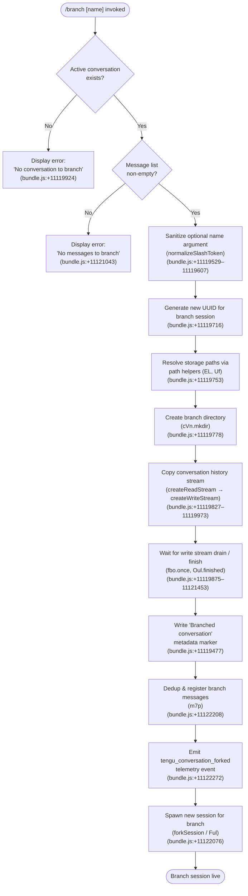

# `/branch`

> Analysis basis: CC v2.1.190 bundle.js (AST extraction + Claude interpretation)
> Minimum version: v2.1.190

---

## Overview

The `/branch` command creates a divergent copy ("fork") of the current conversation up to the point where the command is issued. It snapshots the existing conversation history into a new session file on disk and then spawns that new session so the user can explore an alternative path without modifying the original thread. An optional `[name]` argument sets the human-readable label for the new branch.

---

## Registration

| Field | Value |
|---|---|
| type | `local-jsx` |
| name | `branch` |
| description | Create a branch of the current conversation at this point |
| argumentHint | `[name]` |
| loc_byte | 12530783 |
| loc_byte_end | 12530960 |
| loc_line | 8548 |
| module_id | `mbo` |
| load_inline | `true` |
| arbor_handler.name | `h7p` |
| arbor_handler.fqn | `claude-2.1.190::h7p` |
| arbor_handler.kind | `AsyncFunction` |
| arbor_handler.resolution_path | `module_id` |
| arbor_handler.n_hits | 0 |

Analysis basis: CC v2.1.190 bundle.js:+12530783

---

## Input Branching

Four distinct execution paths exist, so a Mermaid flowchart is used.



---

## Behavioral Spec

### Top-level handler — `branchCommandHandler` (`h7p`)

`h7p` is an `AsyncFunction` resolved via `module_id → mbo`.

Analysis basis: CC v2.1.190 bundle.js:+11123076

```
async function branchCommandHandler(context, args):
    rawName = args.trim()                           // bundle.js:+11119529
    sanitizedName = normalizeSlashToken(rawName)    // Nul; bundle.js:+11119607

    conversation = getCurrentConversation(context)
    if conversation is null or undefined:
        displayError("No conversation to branch")   // bundle.js:+11119924
        return

    messages = conversation.messages
    if messages is empty:
        displayError("No messages to branch")       // bundle.js:+11121043
        return

    branchId = crypto.randomUUID()                  // bundle.js:+11119716
    branchPaths = resolveBranchPaths(branchId)      // EL + Uf; bundle.js:+11119753–11119767

    await fs.mkdir(branchPaths.dir, {recursive:true})  // bundle.js:+11119778

    await copyConversationFile(
        source = currentSessionFile,
        dest   = branchPaths.file,
        encoding = "utf8"                            // bundle.js:+11119860
    )                                                // bundle.js:+11119827–11119973

    writeMetadataMarker("Branched conversation")     // bundle.js:+11119477
    writeContentType("text")                         // bundle.js:+11119550

    deduplicateAndRegisterMessages(messages)         // m7p; bundle.js:+11122208

    emitTelemetry("tengu_conversation_forked")       // bundle.js:+11122272

    forkAndSpawnSession(branchId, sanitizedName)     // Ful; bundle.js:+11122076

    return                                           // new session takes over UI
```

### Name-token normalisation — `normalizeSlashToken` (`Nul`)

Analysis basis: CC v2.1.190 bundle.js:+11119529–11119607

```
function normalizeSlashToken(raw):
    // Find first whitespace-delimited token; strip surrounding punctuation
    token = raw.find(firstWordPattern)              // bundle.js:+11119529
    result = token.replace(illegalCharsPattern, "") // bundle.js:+11119607
    return result                                   // may be empty string → unnamed branch
```

### Branch-session file creation — `copyConversationToNewSession` (`Uul`)

Analysis basis: CC v2.1.190 bundle.js:+11119716–11121453

```
async function copyConversationToNewSession(sourceSession, branchId, paths):
    // Generate fresh UUID for new session identity
    newSessionId = Dul.randomUUID()                  // bundle.js:+11119716

    // Resolve config and working-tree paths
    configPaths  = resolveConfigPath(branchId)       // kt; bundle.js:+11119735
    workPaths    = resolveWorkPath(branchId)         // gr + EL; bundle.js:+11119742–11119753

    // Allocate branch directory (mode 448 octal = 0o700)
    await cVn.mkdir(paths.dir, {mode: 448, recursive: true}) // bundle.js:+11119778–11119809

    // Stream copy: read source at up to 100 lines of look-ahead
    reader = lVn.createReadStream(sourceSession,
                {encoding: "utf8", highWaterMark: 100}) // bundle.js:+11119827–11119860

    // Wait for "open" event before writing
    await fbo.once(reader, "open")                   // bundle.js:+11119875–11119886

    // Validate source is readable; surface ENOENT clearly
    if source not accessible:
        throw new Error("No conversation to branch") // bundle.js:+11119918–11119924

    writer = lVn.createWriteStream(paths.file, {mode: 384}) // 0o600; bundle.js:+11119973–11120019

    // Pipe with back-pressure management (drain events)
    writer.on("drain", ...)                         // bundle.js:+11120032–11120284

    // Re-encode content-type markers as "content-replacement"
    // while copying line-by-line via readline interface
    rl = Pul.createInterface({input: reader})        // bundle.js:+11120067
    for each line in rl:
        transformedLine = rewriteContentMarkers(line) // bundle.js:+11120404
        writer.write(transformedLine)

    // Inject stochastic jitter on retry to avoid thundering-herd
    // (Math.random * 2, setTimeout) bundle.js:+14095068–14095107

    writer.end()
    await Oul.finished(writer)                       // bundle.js:+11121453
```

### Message deduplication and progress reporting — `deduplicateMessages` (`m7p`)

Analysis basis: CC v2.1.190 bundle.js:+11121645–11121893

```
function deduplicateMessages(messageList):
    seen = new Set()
    for each msg in messageList:
        id = parseInt(msg.id)                        // bundle.js:+11121846
        if seen.has(id):
            continue                                 // bundle.js:+11121893
        seen.add(id)                                 // bundle.js:+11121840
        sanitizedLabel = sanitizeLabel(msg.label)    // fw; bundle.js:+11121746
        yield {id, sanitizedLabel}

    // Progress marker emitted at bundle.js:+11120961 ("progress")
```

### Fork and spawn new session — `forkSession` (`Ful`)

Analysis basis: CC v2.1.190 bundle.js:+11122076–11122820

```
async function forkSession(branchId, sanitizedName, context):
    // Resolve session config
    sessionConfig = buildSessionConfig(branchId)    // kt + ph; bundle.js:+11121968–11121975

    // Copy existing session state from source
    copySessionState(source, branchId)               // Uul; bundle.js:+11122076

    // Find matching roster entry if name given
    rosterEntry = sessions.find(
        e => matchesName(e, sanitizedName))          // bundle.js:+11122139

    // Register deduplicated message list
    deduplicateMessages(messages)                    // m7p; bundle.js:+11122208

    // Record the fork event in session metadata
    // type = "fork" (bundle.js:+11122793)
    setSessionMetadata({type: "fork"})

    // Write ISO timestamp for branch creation
    createdAt = new Date().toISOString()             // bundle.js:+11122362
    createdAtMs = new Date().getTime()               // bundle.js:+11122411

    // Set up telemetry notification ("tengu_conversation_forked")
    emitTelemetryEvent("tengu_conversation_forked") // bundle.js:+11122272

    // Pause input stream from parent session
    parentInput.resume()                             // bundle.js:+11122780 (drain guard)

    // Initialise file-watch for branch (Oie) and
    // register eS (basename+config) entry
    initFileWatch(branchId)                          // Oie; bundle.js:+11122801
    registerSessionEntry(branchId)                   // eS; bundle.js:+11122805

    // Hand off control to new session context
    transferControlTo(branchSession)                 // t; bundle.js:+11122820
```

### Path resolution helpers

Analysis basis: CC v2.1.190 bundle.js:+13223698–13223743 (`EL`), +5244796–5244832 (`Uf`)

```
function resolveSessionStoragePaths(sessionId):
    base    = configRoot()                           // kt; bundle.js:+13223698
    subPath = buildRelativePath(sessionId)           // pR; bundle.js:+13223710
    full    = joinParts(base, subPath)               // Uf + Zh.join; bundle.js:+13223716–13223743
    return full

function buildConversationFilePath(sessionId):
    base  = workRoot()                               // M$ + VL; bundle.js:+5244796
    parts = [bg, gr, sessionId]
    return Ywe.join(...parts)                        // bundle.js:+5244818
```

---

## State & Side Effects

| Item | Detail |
|---|---|
| Telemetry — primary | `tengu_conversation_forked` (bundle.js:+11122272) |
| Telemetry — daemon control | `tengu_daemon_control` (bundle.js:+17235957) |
| Telemetry — session rename | `tengu_session_renamed` (bundle.js:+13261504) |
| Telemetry — agent name | `tengu_agent_name_set` (bundle.js:+13265956) |
| Telemetry — feature flags | `tengu_feature_ok` / `tengu_feature_bad` (bundle.js:+1025122 / +1025189) |
| Telemetry — background | `tengu_bg_spare_claim`, `tengu_bg_spare_enable`, `tengu_bg_spare_claim_fail` |
| Telemetry — daemon | `tengu_daemon_idle_exit`, `tengu_daemon_config_reload`, `tengu_daemon_yield` |
| Telemetry — MCP | `tengu_mcp_skills` (bundle.js:+6653418) |
| Telemetry — worktree | `tengu_worktree_detection` (bundle.js:+8567195) |
| Disk writes | New session directory created at resolved path (mode `0o700` / 448); conversation file written at mode `0o600` / 384 (bundle.js:+11119809, +11120019) |
| File streaming | Source conversation read as UTF-8 stream; content-type markers rewritten as `content-replacement` (bundle.js:+11120404) |
| Metadata string | `"Branched conversation"` written as session label (bundle.js:+11119477) |
| Session type marker | `"fork"` stored in new session metadata (bundle.js:+11122793) |
| appState changes | New session entry registered in session roster; file-watch (`Oie`) initialised for branch |
| Sound | None detected in depth-2 traversal |
| Hook registration | `C6o.register` called via `Ei → Rc → ph` chain (bundle.js:+67325) |
| Error guard — no conversation | Early return with message `"No conversation to branch"` (bundle.js:+11119924) |
| Error guard — no messages | Early return with message `"No messages to branch"` (bundle.js:+11121043) |
| Error guard — unknown | Falls back to `"Unknown error occurred"` (bundle.js:+11122960) |

---

## Version History

| Version | Change |
|---|---|
| v2.1.190 | Initial analysis |

---

## Common Mistakes

1. **Running `/branch` with no prior messages** — the command performs an explicit check for a non-empty message list and exits with `"No messages to branch"` before any file I/O occurs.
2. **Expecting the parent conversation to change** — `/branch` is non-destructive; it copies the history and opens a new session. The original thread continues unchanged.
3. **Using names with special characters** — the name argument is passed through `normalizeSlashToken` (`Nul`) which strips characters that do not form a valid token, potentially producing an empty name silently.
4. **Assuming instant availability** — the branch involves async stream copy and file-system operations (`mkdir`, stream pipe, `Oul.finished`). In rare cases with large histories and slow storage the spawn may be briefly delayed.
5. **Confusing `/branch` with a git branch** — the command operates on CC session files, not the git working tree. Worktree detection (`tengu_worktree_detection`) is a separate subsystem that informs context but is not triggered by this command's core path.

---

## Appendix — Identifier Mapping

> For bundle debugging only. Identifiers change across versions.

| Identifier | Role |
|---|---|
| `h7p` | Top-level async handler for `/branch` (Arbor-resolved entry point) |
| `Ful` | Fork-and-spawn session orchestrator (`forkSession`) |
| `Uul` | Conversation file copy / new session file writer (`copyConversationToNewSession`) |
| `Nul` | Slash-command name-token normaliser (`normalizeSlashToken`) |
| `m7p` | Message deduplicator and progress emitter (`deduplicateMessages`) |
| `Oie` | Branch session file-watch initialiser |
| `eS` | Session entry registrar (basename + config record) |
| `EL` | Session storage path resolver (config root) |
| `Uf` | Conversation file path builder (work root join) |
| `kt` | Config-root accessor |
| `VL` | Generic path-segment constant / join helper |
| `gr` | Work-root path accessor |
| `pR` | Sub-path segment builder for session IDs |
| `M$` | Work-root base helper |
| `kn` | ENOENT / filesystem-error classifier |
| `cn` | Low-level error wrapper |
| `ke` | Conversation history writer / appender |
| `fo` | Error constructor helper |
| `nt` | String-coercion normaliser |
| `Vi` | Conversation validator |
| `Jns` | Message list accessor |
| `oou` | Rotating buffer manager (shift/push) |
| `En` | Background session event emitter |
| `f` | Main dispatch / session manager function |
| `W` | State-write / persistence helper |
| `D` | Background worker process wrapper |
| `VEc` | Worker realpath + stat resolver |
| `sp` | Worker spawn helper |
| `T` | Process-spawn argument builder |
| `XJf` | Worker process launch wrapper |
| `d` | Session writer / stream abstraction |
| `Kn` | Timeout-with-abort helper |
| `o` | Pad/format helper (display) |
| `Re` | Feature-flag "ok" reporter |
| `Pe` | Feature-flag evaluator |
| `Le` | Feature-flag "bad" reporter |
| `GXn` | Low-memory detector (macOS) |
| `it` | Token/event dispatcher |
| `B2e` | Session file lstat + cleanup helper |
| `MDt` | `pins.json` path builder |
| `Gt` | JSON.parse wrapper |
| `ECd` | Directory recursive reader |
| `U` | Idle-exit / timeout manager |
| `N` | Timeout-clear helper |
| `M` | Write-stream timeout wrapper |
| `L3o` | Daemon socket claim / connection manager |
| `n1o` | Session-state directory writer |
| `EJf` | Claim-frame timeout handler |
| `yJf` | Claim-frame builder |
| `Jd` | Socket error logger |
| `be` | String formatter for socket payloads |
| `gR` | Binary frame encoder (Buffer operations) |
| `P3o` | Session lifecycle manager (add/delete/cleanup) |
| `ec` | Session path joiner |
| `Di` | Session roster file reader/writer |
| `yg` | Session state activator |
| `Eve` | Command-line argument parser for session flags |
| `kd` | Path utility with `Me` join |
| `cht` | Async task scheduler with timing |
| `i8t` | Session path helper (`Yh.join + o8t`) |
| `bye` | Session cleanup path helper |
| `yR` | Late-result handler (`uHl`) |
| `uN` | Session restore helper |
| `lM` | Late-write handler (`uHl`) |
| `s8t` | Session state-file path helper |
| `p` | Forced-shutdown / abort handler |
| `jb` | Shutdown reason formatter |
| `u` | Abort-signal wrapper |
| `F` | Interval-clear / dispose helper |
| `m` | Worker-kill iterator |
| `x` | Worker kill with write |
| `N5` | Session-map existence check helper |
| `l` | Stream destroy / daemon writer |
| `rUl` | Daemon status writer |
| `AQ` | Output formatter |
| `Ofe` | Line trimmer / parser |
| `Xs` | AsyncLocalStorage store accessor |
| `nVt` | Daemon status path builder |
| `Me` | JSON.stringify wrapper |
| `_` | Top-level agent / SDK runner |
| `nyt` | SDK transport initialiser |
| `yyc` | Config key enumerator |
| `g` | MCP server + timeout manager |
| `a` | MCP orchestrator (server lifecycle) |
| `d9e` | MCP connection driver (per-server) |
| `RB` | MCP tool/resource registry merger |
| `Qw` | MCP event/notification handler |
| `zn` | MCP notification dispatcher |
| `FUt` | MCP filter helper |
| `Hua` | MCP connection result applicator |
| `hyn` | MCP result formatter (myn path) |
| `fyn` | MCP result formatter (Gl path) |
| `ln` | MCP debug logger |
| `zRn` | MCP error-detail extractor |
| `BUt` | MCP backoff/retry scheduler |
| `gJr` | MCP tool-call response handler |
| `eL` | MCP skills telemetry emitter |
| `tJr` | MCP include-list checker |
| `w` | MCP reconnect timer (blurred/focused) |
| `Vc` | MCP error logger |
| `Aua` | MCP state-transition helper |
| `yit` | MCP concurrency-limit parser |
| `nMn` | MCP timeout-value parser |
| `brr` | MCP connection-result applicator |
| `u9e` | MCP PLe-path cleanup |
| `zT` | MCP cleanup orchestrator |
| `_la` | MCP retry-queue resolver |
| `rQr` | MCP retry resolver |
| `fBo` | MCP full server-map refresh |
| `xRn` | MCP server-type filter |
| `Hit` | MCP health-check helper |
| `ph` | Session config hook registrar |
| `Rc` | Hook registration wrapper |
| `Ei` | `C6o.register` caller |
| `YY` | Conversation-list builder / sorter |
| `XHe` | Git worktree list parser |
| `c9l` | File completion / directory lister |
| `Hqe` | Buffer allocation helper for completions |
| `mh` | Conversation cache getter |
| `fw` | Label sanitiser (`e.replace`) |
| `i6` | Session-rename handler (custom-title) |
| `mEe` | Log appender / mkdir helper |
| `s3` | Session config writer |
| `Wt` | Config path helper |
| `mWe` | Agent-name setter |
| `Ez` | Settings file read/write helper (`Kwt`) |
| `Kwt` | Settings JSON updater |
| `fi` | String index+slice helper |
| `Df` | File-watch event handler |
| `fy` | VZ-cache delete helper |

---

Note: index built via Arbor fallback; some signals (telemetry, literals) may be missing — see arbor-fallback.js.