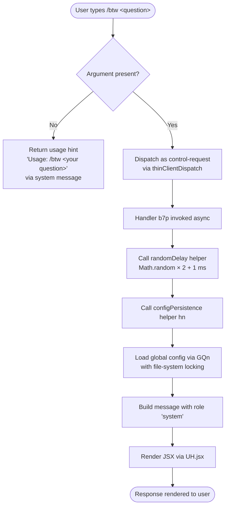

# `/btw`

> Analysis basis: CC v2.1.190 bundle.js (AST extraction + Claude interpretation)
> Minimum version: v2.1.190

---

## Overview

`/btw` ("by the way") allows the user to ask a quick side question without interrupting or displacing the main ongoing conversation thread. It is registered as a `local-jsx` command with `immediate: true`, meaning the question is dispatched synchronously to the agent without requiring a separate confirmation step. The command routes through the thin-client control path (`thinClientDispatch: "control-request"`) and constructs a JSX-rendered response inline via the handler `b7p`.

---

## Registration

| Field | Value |
|---|---|
| type | `local-jsx` |
| name | `btw` |
| description | Ask a quick side question without interrupting the main conversation |
| argumentHint | `<question>` |
| immediate | `true` |
| thinClientDispatch | `control-request` |
| module_id | `Wul` |
| load_inline | `true` |
| loc_byte | `11130006` |
| loc_byte_end | `11130245` |
| loc_line | `6983` |
| arbor_handler.name | `b7p` |
| arbor_handler.fqn | `claude-2.1.190::b7p` |
| arbor_handler.kind | `AsyncFunction` |
| arbor_handler.resolution_path | `module_id` |
| arbor_handler.n_hits | `0` |

Analysis basis: CC v2.1.190 bundle.js:+11130006

---

## Input Branching

The command has three observable input branches: (1) missing argument (no question text supplied), (2) valid question text routed through the control-request path, and (3) JSX rendering of the resulting response.



Analysis basis: CC v2.1.190 bundle.js:+11129607 (random delay), +11129648 (system role), +11129609 (usage string), +11129717 (JSX render)

---

## Behavioral Spec

### 1. Argument Validation

If the user invokes `/btw` without any trailing text, the handler emits the literal usage hint `"Usage: /btw <your question>"` (bundle.js:+11129609) as a `system`-role message (bundle.js:+11129648) and returns early without dispatching to the model.

```
function handleBtw(args):
    if args is empty or whitespace:
        return systemMessage("Usage: /btw <your question>")
    else:
        proceed to dispatchSideQuestion(args)
```

Analysis basis: CC v2.1.190 bundle.js:+11129607

### 2. Random Jitter Delay (`e`)

Before the main config/persistence work begins, the handler calls a small jitter helper (identifier `e`) that introduces a sub-millisecond to ~3 ms random delay computed as `Math.random() * 2 + 1`. This is consistent with anti-collision patterns used when multiple Claude instances may contend for a shared resource (e.g., the config lock).

```
function randomJitterDelay():
    delayMs = Math.random() * 2 + 1   // range: [1, 3) ms
    await setTimeout(delayMs)
```

Analysis basis: CC v2.1.190 bundle.js:+14095068 (value 2), +14095084 (value 1), +14095070 (Math.random), +14095107 (setTimeout)

### 3. Config Persistence Path (`hn` → `GQn`)

After the jitter delay, the handler invokes the config-persistence helper (`hn`), which delegates to the global-config writer (`GQn`). This path:

1. Resolves the config directory using `IS.dirname` and creates it with `s.mkdirSync` if absent.
2. Acquires a file-system lock, emitting `tengu_config_lock_contention` if lock acquisition exceeds the expected window (literal: `"Lock acquisition took longer than expected - another Claude instance may be running"`, bundle.js:+13751922).
3. Reads the current config from disk (`r.readFileSync`, encoding `"utf-8"`), parses it with `JSON.parse`, and validates it.
4. Merges updates via `Object.assign` (through `SWs`).
5. Writes the updated config atomically using the safe-write helper (`sIt`), which: generates a random temp file name (`N_r.randomBytes`), writes content (`uf.writeFileSync`), applies permissions (`uf.fchmodSync`), syncs to disk (`uf.fsyncSync`), and atomically renames into place (`r.renameSync`).
6. Emits `tengu_config_stale_write` if a stale-write condition is detected, and `tengu_config_auth_loss_prevented` if a write would erase existing auth tokens (matching the GH #3117 guard literal at bundle.js:+13752338).
7. On fallback (non-atomic path), emits `tengu_config_fallback_write` (bundle.js:+13751627).

```
async function persistConfig(configUpdate):
    dir = IS.dirname(configPath)
    s.mkdirSync(dir, recursive=true)
    lock = acquireFileLock(configPath)  // may emit tengu_config_lock_contention
    existing = JSON.parse(r.readFileSync(configPath, "utf-8"))
    if existingHasAuth and updateLacksAuth:
        emit telemetry("tengu_config_auth_loss_prevented")
        abort write
    merged = Object.assign({}, existing, configUpdate)
    safeWrite(configPath, merged)       // atomic rename via temp file
    lock.release()
```

Analysis basis: CC v2.1.190 bundle.js:+13748594 (hn→GQn), +13751738 (mkdirSync), +13751783 (Date.now), +13751838 (message builder T), +13752011 (lock contention telemetry)

### 4. Message Construction (`T`)

The message builder (`T`) constructs the message object forwarded to the model:

- Calls `nLc` for content normalization (involving `QP`, `Mcr`, `w6o`).
- Checks `e.includes` for content-type routing.
- Calls `Me` (which uses `JSON.stringify`) for serialization of message content.
- Applies `t.toUpperCase` for role normalization.
- Calls `wc` for string path resolution (involving `p8o`, `e.replace`, `r.at`, `n.lastIndexOf`, `n.slice`).
- Calls `hze` (via `e8o`) and `iLc` for file-inclusion and buffer-length accounting (`Buffer.byteLength`).
- Limits to 1000 ms timeout and 100-unit quota (bundle.js:+214337, +214356).

```
function buildMessage(role, content, filePaths):
    normalizedContent = normalizeContent(content)  // nLc path
    role = role.toUpperCase()                       // system → SYSTEM
    serialized = JSON.stringify(normalizedContent)  // Me path
    if filePaths present:
        for each path:
            resolvedPath = resolveFilePath(path)   // iLc path
            byteLen = Buffer.byteLength(resolvedPath)
    return { role, content: serialized, ... }
```

Analysis basis: CC v2.1.190 bundle.js:+214530, +214548, +214570, +214588, +214632, +214655

### 5. JSX Rendering

The handler concludes by calling `UH.jsx` (bundle.js:+11129717) to render the response inline as a JSX component. This is consistent with the `local-jsx` command type, where the result is displayed directly in the CLI UI rather than via a plain-text pipeline.

```
function renderResponse(responseData):
    return UH.jsx(ResponseComponent, { data: responseData })
```

Analysis basis: CC v2.1.190 bundle.js:+11129717

---

## State & Side Effects

| Item | Detail |
|---|---|
| Telemetry — `tengu_config_lock_contention` | Fired when config file lock acquisition is slow (bundle.js:+13752011) |
| Telemetry — `tengu_config_stale_write` | Fired on stale config write detection (bundle.js:+13752147) |
| Telemetry — `tengu_config_parse_error` | Fired when config JSON cannot be parsed (bundle.js:+13754586) |
| Telemetry — `tengu_config_auth_loss_prevented` | Fired when a write would erase auth tokens (bundle.js:+13752490) |
| Telemetry — `tengu_config_fallback_write` | Fired when the atomic write path falls back to in-place write (bundle.js:+13751627) |
| Telemetry — `tengu_bg_dispatch_sigkill_escalate` | Background dispatch SIGKILL escalation (bundle.js:+17198228) |
| Telemetry — `tengu_bg_dispatch_low_mem` | Background dispatch low-memory condition (bundle.js:+17198829) |
| Telemetry — `tengu_bg_spare_enable` | Background spare session enabled (bundle.js:+17199526) |
| Telemetry — `tengu_bg_spare_claim` | Background spare session claimed (bundle.js:+17199654) |
| Telemetry — `tengu_bg_spare_claim_fail` | Background spare session claim failed (bundle.js:+17199920) |
| Telemetry — `tengu_daemon_yield` | Daemon yielded to foreground/service (bundle.js:+17218760) |
| Telemetry — `tengu_bg_proto_mismatch` | Background protocol mismatch (bundle.js:+17183851) |
| Telemetry — `tengu_bg_dispatch_stale_drop` | Stale dispatch dropped (bundle.js:+17185250) |
| Telemetry — `tengu_bg_attach_legacy_autorespawn` | Legacy background attach auto-respawn (bundle.js:+17188154) |
| Telemetry — `tengu_bg_attach` | Background attach event (bundle.js:+17189413) |
| Telemetry — `tengu_bg_attach_stall_gave_up` | Background attach stall — gave up (bundle.js:+17190343) |
| Telemetry — `tengu_bg_attach_stall_respawn` | Background attach stall — respawning (bundle.js:+17190613) |
| Telemetry — `tengu_bg_attach_kick` | Background attach kick event (bundle.js:+17191610) |
| Telemetry — `tengu_daemon_control` | Daemon control event (bundle.js:+17235957) |
| Config file mutation | Global config (`~/.claude.json`) may be read and updated atomically as part of the side-question dispatch flow |
| Temp file creation | Safe-write path creates a temp file then renames it atomically; cleans up on failure |
| Background session | `thinClientDispatch: "control-request"` routes through the background daemon infrastructure (spare session management, attach/detach, respawn logic) |
| JSX rendering | Renders result inline via `UH.jsx` in the local-jsx display pipeline |
| Sound | <!-- TODO: not found in depth-2 traversal; needs --depth 4 --> |

---

## Version History

| Version | Change |
|---|---|
| v2.1.190 | Initial analysis |

---

## Common Mistakes

1. **Omitting the argument**: Invoking `/btw` with no question text triggers the usage hint (`"Usage: /btw <your question>"`) and does nothing else. Always supply a question as the argument.
2. **Expecting conversation context replacement**: `/btw` is explicitly designed *not* to interrupt the main conversation. The side question is injected as a `system`-role message and does not replace or reset the current thread.
3. **Assuming synchronous config writes are safe under concurrency**: The handler includes jitter delay and lock-acquisition telemetry precisely because multiple Claude instances may contend. If you observe `tengu_config_lock_contention` frequently, another Claude instance is likely running in the same environment.
4. **Treating the response as plain text**: Because the command type is `local-jsx`, the output is rendered through the JSX pipeline. Downstream tooling that expects raw text output will not receive a plain string from this command.
5. **Confusing `thinClientDispatch: "control-request"` with a direct API call**: This flag routes the command through the background daemon's control channel, not through a direct model API request. Network or daemon health issues can therefore affect `/btw` even if the main conversation channel is healthy.

---

## Appendix — Identifier Mapping

> For bundle debugging only. Identifiers change across versions.

| Identifier | Role |
|---|---|
| `b7p` | Main async handler for `/btw` (AsyncFunction, resolved via module_id `Wul`) |
| `e` | Random jitter delay helper (uses `Math.random` + `setTimeout`) |
| `hn` | Config persistence coordinator (calls `GQn`, `BQn`, `SEe`, etc.) |
| `GQn` | Global config writer with file-system lock and atomic rename |
| `t` | Low-level filesystem or path utility (used inside `GQn`) |
| `Wt` | File path resolution / normalization utility |
| `s` | Filesystem operations wrapper (mkdirSync, statSync, readdirStringSync, etc.) |
| `r` | Secondary filesystem operations wrapper (readFileSync, copyFileSync, etc.) |
| `i` | Stream/connection resource with `close` and `finally` lifecycle methods |
| `SWs` | Config merge helper (calls `YRr`, `Object.assign`) |
| `YRr` | Config field normalizer (calls `EWs`) |
| `T` | Message builder / content formatter |
| `nLc` | Content normalization sub-routine (calls `QP`, `Mcr`, `w6o`) |
| `Me` | JSON serializer wrapper (`JSON.stringify`) |
| `wc` | String path-segment resolver (`p8o`, `e.replace`, `r.at`, `n.lastIndexOf`, `n.slice`) |
| `hze` | File-inclusion helper (calls `e8o`) |
| `iLc` | File path inclusion and byte-length accounting helper |
| `W` | Shared utility / state accessor (appears in multiple call sites) |
| `cn` | Error classification / error-code lookup utility |
| `SEe` | Config file reader and backup manager |
| `Gt` | JSON.parse wrapper |
| `u9` | String prefix stripper (`e.startsWith`, `e.slice`) |
| `bGl` | Config backup directory enumerator |
| `$Oo` | Path joiner with `or` fallback |
| `f` | Background process/session manager (spawn, kill, retire) |
| `PHt` | Config write-guard / auth-loss prevention check |
| `n` | Lowercase normalizer helper (`i.toLowerCase`) |
| `I` | Scroll/cursor position calculator (`Math.max`, `Math.floor`, `x.preventDefault`) |
| `x` | Terminal write stream wrapper |
| `A` | Bounded-range clamp utility (`Math.max`, `Math.min`) |
| `H` | Background IPC message framer/parser (Buffer.concat, indexOf, subarray) |
| `g` | IPC read-with-timeout helper (`a`, `r.setTimeout`) |
| `m` | Background worker kill manager (`n.values`, `x.kill`) |
| `mp` | IPC message finalizer (`e.end`, `Me`) |
| `RJf` | Background daemon IPC request router / message dispatcher |
| `be` | String coercion utility (`String`) |
| `sIt` | Atomic safe-write helper (temp file + fsync + rename) |
| `Nd` | Real-path resolver (`e.realpathSync`) |
| `u` | Process lifecycle helper (`Le`, `Re`, `CU`, `X6`) |
| `kn` | Error-code normalizer (calls `cn`) |
| `T7e` | Permission-error classifier (`EINVAL`, `ENOTSUP`, `EPERM`, `ENOSYS`) |
| `CDe` | Config change detector / diff utility |
| `NOo` | Config object entries iterator (`Object.entries`) |
| `DKt` | Timestamp recorder (`Date.now`) |
| `BQn` | Config write orchestrator (calls `sIt`, `T`, `W`, `Pe`) |
| `Pe` | Post-write notification / event emitter (calls `aKe`) |
| `aKe` | Downstream change notification handler |

---

Note: index built via Arbor fallback; some signals (telemetry, literals) may be missing — see arbor-fallback.js.