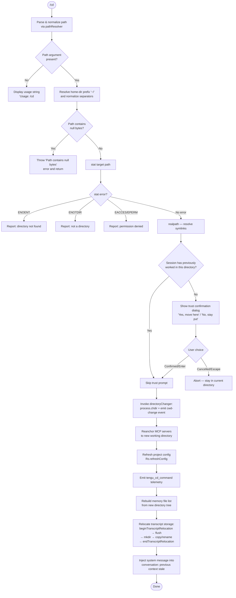

# `/cd`

> Analysis basis: CC v2.1.190 bundle.js (AST extraction + Claude interpretation)
> Minimum version: v2.1.190

---

## Overview

The `/cd` command changes the working directory of the current Claude Code session to a specified path. It validates the target path (resolving home-directory prefixes, symlinks, and relative references), checks whether the session has previously worked in that directory (prompting for trust confirmation if not), then atomically switches the process working directory, reloads configuration, and relocates transcript storage to match the new location.

---

## Registration

| Field | Value |
|---|---|
| type | `local-jsx` |
| name | `cd` |
| description | Move this session to a new working directory |
| argumentHint | `<path>` |
| module_id | `ydl` |
| load_inline | `true` |
| loc_byte | `11163814` |
| loc_byte_end | `11163974` |
| loc_line | `7004` |
| arbor_handler.name | `Q7p` |
| arbor_handler.fqn | `claude-2.1.190::Q7p` |
| arbor_handler.kind | `AsyncFunction` |
| arbor_handler.resolution_path | `module_id` |
| arbor_handler.n_hits | `0` |

Analysis basis: CC v2.1.190 bundle.js:+11163814

The handler `Q7p` was resolved via the `module_id` path: the registration block references module `ydl`, which exports `Q7p` as an `AsyncFunction`. The registration byte range is `(11163814, 11163974)`.

---

## Input Branching

The command has more than three distinct behavioral branches depending on path validity, filesystem errors, and trust state, so a Mermaid flowchart is used.



---

## Behavioral Spec

### 1. Handler Entry and Usage Guard

```
async function handleCdCommand(args, context):
    if args is empty or blank:
        display "Usage: /cd <path>"
        return early
    rawPath = args.trim()
```

Analysis basis: CC v2.1.190 bundle.js:+11162317, +11162337

### 2. Path Normalization (`pathResolver`)

```
function pathResolver(rawPath):
    if rawPath contains null byte (U+0000):
        throw Error("Path contains null bytes")
    normalized = unicodeNormalize(rawPath, "NFC")
    if normalized starts with "~/":
        homeDir = os.homedir()
        normalized = join(homeDir, normalized.slice(2))
    elif normalized starts with "~\":          // Windows tilde variant
        homeDir = os.homedir()
        normalized = join(homeDir, normalized.slice(2))
    if path.isAbsolute(normalized):
        return path.resolve(normalized)
    else:
        return path.resolve(currentWorkingDir, normalized)
```

Key constants:
- Unicode normalization form: `"NFC"` (bundle.js:+66175)
- Home-prefix string matched: `"~/"` (bundle.js:+1095202)
- Null-byte error message: `"Path contains null bytes"` (bundle.js:+1095074)

Analysis basis: CC v2.1.190 bundle.js:+1095108, +1095133, +1095171, +1095218, +1095331, +1095385

### 3. Filesystem Validation

```
async function validateTargetDirectory(resolvedPath):
    try:
        stats = await fs.stat(resolvedPath)
    catch error:
        switch error.code:
            case "ENOENT":  report directory-not-found message; return false
            case "ENOTDIR": report not-a-directory message; return false
            case "EACCES":  report permission-denied message; return false
            case "EPERM":   report permission-denied message; return false
        throw error  // unexpected errors propagate
    realPath = await fs.realpath(resolvedPath)  // dereference symlinks
    return realPath
```

Error codes handled: `ENOENT` (+11162622), `ENOTDIR` (+11162636), `EACCES` (+11162651), `EPERM` (+11162665).

Analysis basis: CC v2.1.190 bundle.js:+11162428, +11162808

### 4. Trust Confirmation Dialog

```
async function confirmTrustIfNeeded(realPath, sessionHistory):
    previousDirs = sessionHistory.getKnownWorkingDirectories()
    if previousDirs includes realPath:
        return true  // already trusted this session

    // Render JSX trust dialog
    show dialog:
        title:   "Claude Code"
        warning: "This session hasn't worked here before. Is this a directory\n
                  you created or one you trust?"
        body:    "Claude Code will be able to read, edit, and execute files here."
        link:    "Security guide" → "https://code.claude.com/docs/en/security"
        buttons: ["Yes, move here", "No, stay put"]
        keys:    enter/confirm → accept, escape/cancel → reject

    if user chose "No, stay put" or pressed escape:
        return false
    return true
```

Button labels: `"Yes, move here"` (+11160009), `"No, stay put"` (+11160038).
Security guide URL: `"https://code.claude.com/docs/en/security"` (+11159863).

Analysis basis: CC v2.1.190 bundle.js:+11159529, +11159553, +11159671, +11160239, +11160254, +11160283, +11160299

### 5. Directory Switch (`directoryChanger` — `X7p`)

```
async function directoryChanger(realPath, context):
    currentAppState = getAppState()
    process.chdir(realPath)                     // change Node.js process cwd
    cwdStore = getCwdStore()                    // retrieve reactive cwd store
    cwdStore.set(realPath)                      // update store
    emitCwdChangeEvent(realPath)               // Fsr.emit / ZYt.emit

    // Relocate transcript storage to new location
    transcriptStore = getTranscriptStore()
    transcriptStore.beginTranscriptRelocation()
    await transcriptStore.flush()
    newTranscriptDir = path.join(realPath, ".claude", "cd")
    await fs.mkdir(newTranscriptDir, { recursive: true, mode: 448 })  // 0o700
    await relocateTranscriptFiles(transcriptStore, newTranscriptDir)
    transcriptStore.endTranscriptRelocation()

    // Reanchor MCP servers
    mcpAnchor.reanchor(realPath)

    // Reload project-level configuration
    Ro.refreshConfig()

    // Emit primary telemetry event
    emit("tengu_cd_command", { path: realPath })

    // Rebuild memory / CLAUDE.md index for new directory
    refreshMemoryFileList(realPath)

    // Update shell cwd store (fires tengu_shell_set_cwd)
    updateShellCwdStore(realPath)
```

Directory creation mode: `448` decimal = `0o700` (bundle.js:+13243553).

Analysis basis: CC v2.1.190 bundle.js:+11160878, +11160890, +11160907, +11160913, +11160941, +11161195, +11161219, +11161246, +11161265, +11161302

### 6. Stale-Context System Message Injection

```
function injectStaleContextMessage(previousPath, newPath):
    // Inserts a system-role message into the conversation transcript
    // notifying the model that tool results referencing the previous
    // directory are stale and all subsequent calls should use newPath.
    // Citation fragment: "previous directory — that information is stale. All tool calls and "
    systemMessage = buildStaleDirectoryMessage(previousPath, newPath)
    appendSystemMessage(systemMessage, role="system")
```

Citation fragment from bundle: `"previous directory — that information is stale. All tool calls and "` (bundle.js:+11161461).

Analysis basis: CC v2.1.190 bundle.js:+11163155, +11163192

### 7. Memory File List Rebuild (`gdl` path)

```
function rebuildMemoryFileList(newDir):
    // Walks the new working directory tree to find:
    //   CLAUDE.md          — project instructions (checked into codebase)
    //   CLAUDE.local.md    — user's private project instructions
    //   .claude/*.md       — additional rule files
    // Applies gitignore-style allow/deny policy checks (Oq / z7p sub-calls)
    // before admitting each file into the active memory set.
    candidates = traverseDirectory(newDir)
    for each candidate in candidates:
        if policyAllows(candidate):
            memorySet.add(candidate)
        else:
            memorySet.markBlocked(candidate, reason="blockedByRule")
```

Key file names discovered: `"CLAUDE.md"` (+5084193), `"CLAUDE.local.md"` (+5084361), `".claude"` (+5084260).

Analysis basis: CC v2.1.190 bundle.js:+11162941, +11157673

---

## State & Side Effects

| Item | Detail |
|---|---|
| Telemetry — primary | `tengu_cd_command` (bundle.js:+11161267) — fired on every successful directory change |
| Telemetry — shell cwd | `tengu_shell_set_cwd` (bundle.js:+7066248) — fired when the shell cwd store is updated |
| Telemetry — bypass permissions | `tengu_disable_bypass_permissions_mode` (bundle.js:+3395452) — fired if bypass-permissions mode is disabled as a side effect |
| Telemetry — config lock | `tengu_config_lock_contention` (+13752011), `tengu_config_stale_write` (+13752011), `tengu_config_auth_loss_prevented` (+13752490) — may fire during config reload |
| Telemetry — daemon | `tengu_daemon_config_reload` (+17214348), `tengu_daemon_control` (+17235957) — may fire if daemon is involved in reload |
| process.chdir | `process.chdir(resolvedRealPath)` — mutates the Node.js process working directory globally |
| cwdStore | Reactive store updated to new absolute path; triggers re-renders across the UI |
| MCP server reanchor | `moe.reanchor(newPath)` — all MCP servers are relocated to the new working directory |
| Config refresh | `Ro.refreshConfig()` — project-level and local settings re-read from disk under the new directory |
| Transcript relocation | `beginTranscriptRelocation → flush → mkdir(mode=0o700) → rename/copy → endTranscriptRelocation` |
| Memory file index | Rebuilt via `gdl` subtree walk; `CLAUDE.md` / `CLAUDE.local.md` / `.claude/*.md` from new directory replace previous set |
| Conversation transcript | A `system`-role stale-context message is appended so the model knows prior file references are invalid |
| Trust registry | Newly confirmed directories are added to the session's known-working-directory set to skip future trust prompts |
| Sound | Not observed in depth-2 traversal |

---

## Version History

| Version | Change |
|---|---|
| v2.1.190 | Initial analysis |

---

## Common Mistakes

1. **Omitting the path argument** — `/cd` with no argument displays only the usage string `"Usage: /cd <path>"` and does nothing; always supply an explicit path.
2. **Passing a file path instead of a directory** — the command stats the target and will reject it with an `ENOTDIR` error if the resolved path is a file, not a directory.
3. **Expecting symlinks to be followed transparently** — `/cd` resolves symlinks via `realpath` before registering the directory; the session's effective working directory will be the canonical real path, not the symlink path.
4. **Using paths outside allowed patterns** — the memory-file policy checker (via `Oq` / `z7p`) may mark files in the new directory as `"blockedByRule"` / `"outsideAllowedPatterns"` if they fall outside configured allowed directories; CLAUDE.md files there will not load.
5. **Assuming the model retains prior file knowledge** — a `system`-role message is injected after every successful `/cd` explicitly marking all previous tool-call results as stale; the model is expected to re-read files it referenced before the move.
6. **Navigating to an untrusted directory non-interactively** — if the target directory has not been visited this session, a blocking trust confirmation dialog is shown; automated scripts that cannot respond to this dialog will stall.

---

## Appendix — Identifier Mapping

> For bundle debugging only. Identifiers change across versions.

| Identifier | Role |
|---|---|
| `Q7p` | Main handler (`AsyncFunction`) for the `/cd` command; entry point resolved via `module_id → ydl` |
| `hs` | Path normalizer / resolver: validates null bytes, expands `~/`, resolves absolute vs. relative paths |
| `Pt` | App-state accessor (reads current working-directory context store) |
| `Mrn` | Inner store getter used by `Pt` to retrieve cwd from async-local store |
| `JV` | CWD value extractor called from `Mrn` |
| `gr` | Reactive state getter utility used across cwd and shell store reads |
| `VL` | Low-level store value reader |
| `Wt` | Async-local storage context runner |
| `TH` | Unicode NFC normalizer wrapper |
| `gdl` | Memory-file list builder — walks new directory for CLAUDE.md / .claude/*.md |
| `dk` | Core directory-tree walker with symlink resolution and gitignore expansion |
| `bcr` | Symlink-aware path-component resolver used by `dk` |
| `Dre` | Symlink chain resolver — follows multi-hop symlinks to canonical path |
| `Nd` | Real-path resolver utility (lstat + readlink loop) |
| `oWt` | Home-directory prefix stripper (converts absolute paths to `~/`-relative display form) |
| `z7p` | Allow/deny policy matcher for memory file paths |
| `rWt` | Pattern normalizer for allowed-path rules (handles `~\` Windows variant, glob conversion) |
| `Jvf` | Rule evaluation entry point called by `rWt` |
| `xWe` | Secondary pattern matcher used by `z7p` |
| `j7p` | Pattern-to-regex compiler for path rule matching |
| `Oq` | Policy filter: classifies memory file candidates as `"allow"`, `"deny"`, or `"blockedByRule"` |
| `OPo` | Rule-application helper that pushes `"deny"` results into the blocked set |
| `Xm` | Glob pattern expander used by `OPo` and `mye` |
| `mye` | Memory-file set builder that feeds candidates through `Xm` and `OPo` |
| `uGe` | Memory content cache getter/setter |
| `W4t` | Cache lookup helper for `uGe` |
| `V4t` | Memory content parser (trims, detects start/end markers, slices body) |
| `Oho` | Error classifier for memory load failures |
| `Or` | System-message builder: reads app state and constructs stale-context injection message |
| `G8n` | Formats `"working_directory"` field for system message |
| `W8n` | Formats `"disallowed_tools"` field for system message |
| `N2` | Composes full system-message object from sub-builders |
| `it` | Conversation message dispatcher — appends messages to transcript |
| `gSn` | Deduplication guard for transcript messages |
| `Dt` | Transcript entry factory with timestamp |
| `J7p` | Trust confirmation dialog renderer (JSX) |
| `qp` | Text escape helper for dialog content |
| `Alu` | HTML entity replacer (`&amp;`, `&lt;`, etc.) used by `qp` |
| `jxe` | Dialog content assembler for untrusted-directory warning |
| `X7p` | Directory-change executor: calls `process.chdir`, updates stores, triggers relocation |
| `DH` | Shell cwd store updater — resolves path, sets store, emits `tengu_shell_set_cwd` |
| `kn` | Config file writer utility called during cwd store update |
| `L_r` | Async-local store setter for cwd context |
| `Tre` | Path normalization helper used by `L_r` |
| `qR` | CWD change event emitter (fires `Fsr.emit` and `Zyt`) |
| `Zyt` | Path normalizer emitter wrapper |
| `Nbo` | Transcript relocation orchestrator: mkdir, flush, rename, endRelocation |
| `kt` | VL-based state store accessor used by `Nbo` |
| `Rc` | Hook registration manager referenced during relocation |
| `Ei` | Hook registration caller (`C6o.register`) |
| `s3` | Transcript storage path builder |
| `nt` | String coercion utility |
| `K3l` | Transcript file name generator |
| `B3` | Transcript directory initializer |
| `oUe` | Transcript store writer |
| `ZA` | Event emitter for transcript state changes |
| `f6o` | `ZYt.emit` wrapper for transcript events |
| `x3l` | File rename/copy executor for transcript relocation |
| `Q3l` | Recursive directory copier used by `x3l` |
| `T` | Config file write helper (used in multiple contexts for persisting state) |
| `nLc` | Config file parser/loader |
| `Me` | JSON serializer wrapper (`JSON.stringify`) |
| `wc` | Path redaction helper (`[REDACTED]` in logs) |
| `hze` | Log error formatter |
| `iLc` | Async config writer with locking |
| `ke` | Config writer with rotating backup support |
| `Vi` | Backup rotation list manager |
| `oou` | Backup queue shift/push helper |
| `V1i` | Memory/context cache refresher called after directory change |
| `fy` | Cache entry invalidator |
| `Di` | Context file scanner — lstat + readFile, populates VZ cache |
| `kd` | Cache entry writer with atomic rename |
| `Cm` | Atomic file write implementation (random temp name, rename, chmod) |
| `Df` | Cache miss handler — reads and parses context file into cache |
| `be` | String coercion utility (wraps `String()`) |
| `$K` | MCP server reanchor caller (`moe.reanchor`) |
| `_E` | Post-cd state finalizer |
| `Y7p` | Memory file hierarchy builder — assembles ordered list of CLAUDE.md paths |
| `fT` | Path normalizer for memory file keys |
| `UOt` | Directory entry point for memory file discovery (CLAUDE.md, CLAUDE.local.md) |
| `Rh` | Memory file reader entry |
| `k4` | Individual memory file loader with gitignore filtering |
| `Swe` | Recursive memory file directory scanner |
| `DOt` | Gitignore-aware file filter for memory discovery |
| `NOt` | Memory file content formatter / concatenator |
| `gVn` | HTML entity unescaper for memory file display |
| `Bv` | Post-load memory state finalizer |
| `xmt` | Path resolver utility called during final state assembly |
| `NK` | Path normalizer with platform separator replacement |
| `aWt` | Global config loader called after directory change |
| `hn` | Global config read-and-save coordinator |
| `GQn` | Config save-with-lock implementation |
| `SWs` | Config object merger |
| `SEe` | Config file reader with backup fallback |
| `PHt` | Config validation helper |
| `$Oo` | Config backup directory helper |
| `sIt` | Atomic file write with fsync (used for config persistence) |
| `CDe` | Config change detector |
| `NOo` | Config entries iterator |
| `DKt` | Config save timestamp recorder |
| `BQn` | Config backup creator before write |
| `Pe` | Promise-like scheduler used in config pipeline |
| `_dl` | JSX render function for the `/cd` trust-confirmation dialog component |
| `n` | Generic local variable (context-dependent: lowercase string converter, path iterator, etc.) |
| `e` | Generic local variable (context-dependent: setTimeout/Math.random wrapper, error, fs module) |
| `r` | Generic local variable (context-dependent: resolved path string, readable stream) |
| `s` | Generic local variable (context-dependent: Set of visited paths, stream add/delete helper) |
| `i` | Generic local variable (context-dependent: stream close pair, Set iterator) |
| `t` | Generic local variable (context-dependent: path string, config object) |
| `l` | Generic local variable (context-dependent: visited-dir Set, config cache map) |
| `c` | Generic local variable (context-dependent: lstat result for symlink check) |
| `d` | Generic local variable (context-dependent: supervisor process record, stream writer) |
| `o` | Generic local variable (context-dependent: output array, padding helper) |
| `f` | Generic local variable (context-dependent: process manager record, symlink stat) |
| `a` | Generic local variable (context-dependent: file stat result, cache store) |
| `u` | Generic local variable (context-dependent: stream lifecycle object) |
| `W` | Async event dispatcher / fire-and-forget utility |
| `lu` | Filesystem module reference (lstat/readlink operations) |
| `bm` | Secondary filesystem module reference |
| `os` | OS module reference (used for `homedir()`) |
| `cn` | No-op / void utility (swallows errors in catch branches) |