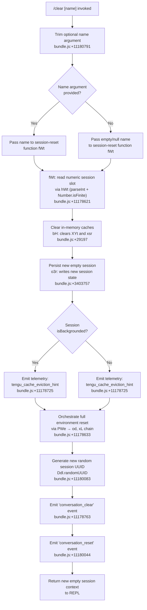

# `/clear`

> Analysis basis: CC v2.1.190 bundle.js (AST extraction + Claude interpretation)
> Minimum version: v2.1.190

---

## Overview

The `/clear` command starts a fresh Claude Code session with an empty conversation context, discarding all messages from the current session while leaving the previous session's data intact on disk (it remains resumable via `/resume`). It optionally accepts a name argument to label the new session. Aliases `/reset` and `/new` provide equivalent behavior.

---

## Registration

| Field | Value |
|---|---|
| type | `local` |
| name | `clear` |
| description | `Start a new session with empty context; previous session stays on disk (resumable with /resume)` |
| argumentHint | `[name]` |
| supportsNonInteractive | `true` |
| thinClientDispatch | `post-text` |
| aliases | `["reset", "new"]` |
| module_id | `Ndl` |
| load_inline | `true` |
| loc_byte | `11180965` |
| loc_byte_end | `11181256` |
| arbor_handler.name | `HYp` |
| arbor_handler.fqn | `claude-2.1.190::HYp` |
| arbor_handler.kind | `AsyncFunction` |
| arbor_handler.resolution_path | `module_id` |
| arbor_handler.n_hits | `0` |

Analysis basis: CC v2.1.190 bundle.js:+11180965

---

## Input Branching

Four distinct branches exist based on whether a session name argument is provided and whether the session is currently backgrounded.



---

## Behavioral Spec

### Top-Level Handler: clearCommandHandler (HYp)

The handler is an `AsyncFunction` resolved via the `Ndl` module export.

```
async function clearCommandHandler(options):
    rawName = options.args ?? ""
    trimmedName = rawName.trim()          // bundle.js:+11180791

    result = await performSessionReset(trimmedName)
    return result
```

Analysis basis: CC v2.1.190 bundle.js:+11180791

---

### Session Reset Orchestrator (fWt)

`fWt` is the primary reset coordinator called by `clearCommandHandler`. It runs the following sequence:

```
async function performSessionReset(name):
    // 1. Parse optional slot/index from name argument
    slotIndex = parseSessionSlot(name)      // hWt: parseInt + Number.isFinite, base 10
                                            // bundle.js:+11178621

    // 2. Build new session descriptor via PWe
    newSession = await buildNewSessionDescriptor(slotIndex)
                                            // bundle.js:+11178633

    // 3. Set up abort signal with timeout for the transition
    signal = AbortSignal.timeout(...)       // bundle.js:+11178681

    // 4. Emit cache eviction telemetry
    emit("tengu_cache_eviction_hint", { isBackgrounded: ... })
                                            // bundle.js:+11178725, +11178836

    // 5. Clear in-flight and pending trackers (Ve, Rr)
    clearPendingTrackers()                  // bundle.js:+11178760, +11178801

    // 6. Walk active object keys, clear each tracked object
    for key of Object.keys(trackedObjects): // bundle.js:+11179074
        clearTrackedObject(key)

    // 7. Clear pending queue / buffer
    clearBuffer()                           // t.clear, bundle.js:+11179049

    // 8. Fire internal session-type discriminator
    //    Identifies mode as "clear" (literal "clear", bundle.js:+11178637)
    sessionType = "clear"

    // 9. Reset conversation_reset state
    //    Sets "conversation_reset" literal, bundle.js:+11180044

    // 10. Finalise: register new session UUID
    newUUID = Ddl.randomUUID()              // bundle.js:+11180083

    // 11. Re-initialise supervisor, worktree, hook, log subsystems
    //     via i6, Y_e, jw, cd, Q5, tue, g8 chain

    // 12. Emit "conversation_clear" event
    emitSessionEvent("conversation_clear")  // bundle.js:+11178763

    return newSessionContext
```

Analysis basis: CC v2.1.190 bundle.js:+11178621, +11178633, +11178681, +11178723, +11178763

---

### Session Slot Parser (hWt)

```
function parseSessionSlot(nameArg):
    parsed = parseInt(nameArg, 10)          // bundle.js:+13369304, base-10 literal +13369315
    if not Number.isFinite(parsed):         // bundle.js:+13369326
        parsed = 0                          // default slot 0, bundle.js:+11180806
    clamped = Math.max(0, Math.min(parsed, MAX_SLOT))
                                            // bundle.js:+13369522, +13369535
    // MAX_SLOT upper bound: 1000 (bundle.js:+13369491)
    return clamped
```

Maximum slot value: 1000 (bundle.js:+13369491)
Default slot index: 0 (bundle.js:+11180806)

Analysis basis: CC v2.1.190 bundle.js:+13369304

---

### In-Memory Cache Cleaner (bH)

Called from the `Y9` → `bH` path to flush two Map/Set-backed caches before the new session state is written.

```
function clearInMemoryCaches():
    XYt.clear()     // primary conversation cache, bundle.js:+29197
    xsr.clear()     // secondary request/state cache, bundle.js:+29209
```

Analysis basis: CC v2.1.190 bundle.js:+29197

---

### New Session Descriptor Builder (PWe → od, xL)

`PWe` constructs the new session object that replaces the cleared one. It delegates to:

- `od` — fetches session-level configuration including effort level (`"effort"` literal, bundle.js:+13370991) and model preferences (model strings `"claude-3-"`, `"claude-opus-4-0"` … through `"claude-sonnet-4-6"`, bundle.js:+3373201–3373525)
- `xL` — the main agent loop initialiser; creates a new session UUID via `Eqe.randomUUID` (bundle.js:+13409889), wires hook callbacks, sets up abort controller, and returns a ready-to-run session context

```
async function buildNewSessionDescriptor(slotIndex):
    config = await loadSessionConfig(slotIndex)   // od path
    sessionContext = await initialiseAgentLoop(config)  // xL path
    return sessionContext
```

Analysis basis: CC v2.1.190 bundle.js:+13359827, +11178633

---

### Session State Persistence (o3r)

After caches are cleared, `o3r` writes the new empty session to disk.

```
function persistNewSession(sessionDescriptor):
    // Reads hook config ("hooks" key, bundle.js:+3403879)
    // Reads policy settings ("policySettings" key, bundle.js:+3404041)
    // Calls Tn (session record writer, bundle.js:+3403757)
    // Calls dl (disk writer, bundle.js:+3403848)
    // Calls XE (state encoder, bundle.js:+3403876)
    // Calls Bo (broadcast/notify, bundle.js:+3403914)
```

Analysis basis: CC v2.1.190 bundle.js:+3403757

---

### Cache Invalidation Sweep (Kbo)

During a full reset, `Kbo` performs a broad cache invalidation across subsystems:

```
function broadCacheInvalidation():
    // Clears: skill index cache (d5.clearSkillIndexCache)
    // Clears: MCP hook caches (zGi → h8.clear)
    // Clears: subagent state (YWn → s6.delete, bEo.delete, B6t.delete, cWe.delete)
    // Clears: RGt worktree state (D4 → RGt.clear, bundle.js:+10916213)
    // Clears: NNa tool-permission caches (C5e.clear, hco.clear, bundle.js:+8556579)
    // Clears: Yza completion caches (Wpt.clear, p5t.clear, bundle.js:+9809970)
    // Clears: $yr token cache (YAe.clear, bundle.js:+1152949)
    // Clears: yBa (‑3n.clear, bundle.js:+8809873)
    // Clears: kyr (O7e.clear, bundle.js:+1145268)
    // Clears: qua UI caches (Dee.clear, jLe.clear, bundle.js:+6916778)
    // Emits Promise.resolve continuation
    // Re-runs session-start hook chain (nge, wg, JLn, vho paths)
```

Analysis basis: CC v2.1.190 bundle.js:+11177580

---

### SessionEnd Event (PWe → od)

Before the new session is initialised, a `"SessionEnd"` hook event is dispatched (literal bundle.js:+13359854), allowing hook subscribers to clean up before context is wiped.

Analysis basis: CC v2.1.190 bundle.js:+13359854

---

## State & Side Effects

| Item | Detail |
|---|---|
| Telemetry | `tengu_cache_eviction_hint` (bundle.js:+11178725) — fired on every clear with `isBackgrounded` flag |
| Telemetry | `tengu_run_hook` (bundle.js:+13409470) — fired for each hook executed during the transition |
| Telemetry | `tengu_repl_hook_finished` (bundle.js:+13393181) — fired when REPL hook chain completes |
| Telemetry | `tengu_session_renamed` (bundle.js:+13261504) — fired if name argument changes the session label |
| Telemetry | `tengu_feature_ok` / `tengu_feature_bad` (bundle.js:+1025122, +1025189) — feature-flag result tracking |
| In-memory caches cleared | `XYt`, `xsr`, `h8`, `C5e`, `hco`, `Wpt`, `p5t`, `YAe`, `_3n`, `O7e`, `Dee`, `jLe`, `Ool`, `oUt`, `FJr`, `RGt` |
| Hook event dispatched | `SessionEnd` before teardown; `SessionStart` / `Setup` after new session is initialised |
| appState changes | New session UUID assigned; conversation history replaced with empty array; `"conversation_clear"` event emitted (bundle.js:+11178763); `"conversation_reset"` state written (bundle.js:+11180044) |
| Disk persistence | Previous session data remains on disk at its existing path (resumable via `/resume`); new session state written via `o3r` → `dl` path |
| AbortController | New `AbortController` registered for the incoming session (bundle.js:+11179385 literal) |
| Sound | <!-- TODO: not found in depth-2 traversal; needs --depth 4 --> |
| Hook registration | Plugin hooks re-registered after reset via `g8` → `Lx` → `eWe` path (bundle.js:+5240219) |
| MCP connections | MCP skill index cache cleared; connection state re-evaluated via `Kbo` → `zGi` path |

---

## Version History

| Version | Change |
|---|---|
| v2.1.190 | Initial analysis |

---

## Common Mistakes

1. **Expecting the previous session to be gone**: `/clear` does not delete the previous session. It remains on disk and is fully resumable with `/resume`. Use `/clear` when you want a fresh context, not when you want to permanently discard history.
2. **Passing a non-numeric name expecting a label**: The name argument is first parsed as an integer slot index (base 10, clamped 0–1000). A purely alphabetic name resolves to slot 0 (the default). To assign a human-readable label to the new session, the slot-based naming mechanism must be understood.
3. **Confusing `/clear` with `/reset` or `/new`**: All three aliases (`clear`, `reset`, `new`) invoke exactly the same handler (`HYp`) with identical behavior. There is no functional distinction between them.
4. **Assuming hooks do not fire**: Both `SessionEnd` (pre-clear) and `SessionStart`/`Setup` (post-clear) hook events are dispatched. External hook scripts observing these events will run during a `/clear` invocation.
5. **Using `/clear` in non-interactive pipelines without `--print`**: `supportsNonInteractive: true` means the command can run headlessly, but `thinClientDispatch: "post-text"` means thin clients receive only a post-text acknowledgment — no rich structured response.

---

## Appendix — Identifier Mapping

> For bundle debugging only. Identifiers change across versions.

| Identifier | Role |
|---|---|
| `HYp` | Top-level async handler for `/clear` (arbor_handler) |
| `fWt` | Session reset orchestrator — coordinates all teardown/setup steps |
| `hWt` | Session slot parser — parseInt + clamp to 0–1000 |
| `eE` | Session state accessor helper |
| `dl` | Disk write utility |
| `Zse` | Session record broadcaster |
| `G3` | State getter (calls VL) |
| `Y9` | Cache flush + new session writer coordinator |
| `r3r` | Session cache map accessor (uAi.get / uAi.set) |
| `bH` | In-memory cache cleaner (XYt.clear, xsr.clear) |
| `o3r` | Persistent session state writer |
| `PWe` | New session descriptor builder |
| `od` | Session configuration loader |
| `kt` | State key resolver |
| `XP` | Session path resolver |
| `FI` | Model family classifier (checks claude-3-/claude-opus-4-x/etc.) |
| `iD` | Effort-level resolver ("high" default) |
| `EL` | Session context assembler |
| `Pt` | Session metadata builder |
| `xL` | Agent loop initialiser |
| `F2` | Session record constructor |
| `T` | Token/context type normaliser |
| `gEe` | Hook event dispatcher (JIe) |
| `YDo` | Hook matcher / filter engine |
| `tQn` | Hook pre-processing pipeline |
| `qDo` | MCP tool hook executor |
| `oQn` | Hook output parser (JSON vs plain text) |
| `Yce` | Hook result merger / fromEntries transform |
| `WDo` | HTTP hook executor |
| `b4l` | HTTP hook response parser |
| `sQn` | Shell/spawn hook executor |
| `Le` | Session feature-ok reporter |
| `Re` | Session feature-bad reporter |
| `H1e` | Pre-result hook handler (prn) |
| `tB` | Telemetry batch emitter (OCd.emit) |
| `Ffo` | Fallback/format helper |
| `iEt` | Abort error type checker |
| `Ve` | Pending-tracker clear (aKe) |
| `Rr` | Non-conforming tracker clear (Ng → aKe) |
| `Is` | Process exit handler (dqe, iT, process.exit) |
| `f` | Background session dispatcher / process manager |
| `D` | Daemon subprocess controller |
| `VEc` | Daemon realpath/stat resolver |
| `Kn` | Kill-with-timeout utility |
| `GXn` | Low-memory reporter (macos) |
| `it` | Token counter / context-size tracker |
| `B2e` | Pin file manager (pins.json reader/cleaner) |
| `MDt` | Pin directory path builder |
| `Gt` | JSON.parse wrapper |
| `kn` | ENOENT-safe error logger |
| `ECd` | Directory walker for pin cleanup |
| `U` | Daemon idle-exit manager |
| `N` | Daemon timer reference |
| `M` | Daemon write/clear timer |
| `L3o` | Daemon socket claim sender |
| `n1o` | Daemon state file writer (dV.writeFile) |
| `EJf` | Claim send timeout handler |
| `yJf` | Claim frame builder |
| `Jd` | Error code normaliser |
| `be` | String coercion helper |
| `gR` | Binary frame encoder (Buffer) |
| `P3o` | Background process lifecycle manager |
| `ec` | Path join / Vk helper |
| `Di` | Session file state reader/writer |
| `yg` | Session active-state setter (S0) |
| `Eve` | Path include/exclude filter |
| `kd` | Config path builder (Cm) |
| `cht` | Connection health check timer |
| `i8t` | Session path helper (Yh.join + o8t) |
| `bye` | Session roster path helper |
| `yR` | Late-error handler (uHl) |
| `uN` | Session init helper (JIo, lht) |
| `lM` | Late-arrival handler (uHl) |
| `s8t` | Session state file path builder |
| `p` | Forced-shutdown handler (jb, process.exit, u.abort) |
| `jb` | Shutdown label ("forced shutdown") |
| `u` | Daemon-stop reporter (Le, Re, CU, X6) |
| `Pe` | aKe-based event emitter |
| `F` | Interval clearer (clearInterval) |
| `rc` | Reset continuation marker |
| `fE` | Session flag setter |
| `Kbo` | Broad cache invalidation coordinator |
| `Bbo` | Pre-invalidation sentinel |
| `Lx` | Skill/plugin reloader (d5, Rqn, Pll, eWe) |
| `d5` | Skill index cache clearer (NCo, clearSkillIndexCache) |
| `zGi` | MCP hook cache clearer (h8.clear, QBe) |
| `QBe` | Skill index writer (o0n.writeFile) |
| `UEt` | Session state update trigger |
| `jte` | Full subsystem reset coordinator (calls YWn, POt, NEt, $Et, qWn, gaa, E6a, SRe, Y_, REo) |
| `d$e` | oD state reset |
| `YWn` | Subagent state cleaner (s6.delete, bEo.delete, B6t.delete, cWe.delete) |
| `POt` | Session-start event emitter (Vw) |
| `NEt` | Non-essential state clearer |
| `$Et` | VL/Are state reset |
| `qWn` | Ool cache clearer |
| `gaa` | oUt/FJr cache clearer |
| `E6a` | E6a state reset |
| `SRe` | SRe state reset |
| `Y_` | Output-token state reset (vKe, Object.values) |
| `REo` | Post-reset event emitter |
| `D4` | RGt worktree cache clearer |
| `NNa` | C5e/hco tool-permission cache clearer |
| `Yza` | Wpt/p5t completion cache clearer |
| `$yr` | YAe token cache clearer |
| `Mdl` | Mdl state reset |
| `yBa` | _3n state clearer |
| `Bar` | Bar has-check |
| `kyr` | O7e session-option cache clearer |
| `Ktl` | T6t task-list reset |
| `T6t` | Task store accessor (mWn.get, A6t) |
| `qua` | Dee/jLe UI cache clearer |
| `DH` | CWD resolver (QMn.isAbsolute/resolve, Wt, L_r) |
| `Wt` | Working-directory holder |
| `L_r` | Async-context store getter (xrn.getStore, TH, Tre) |
| `TH` | Path normaliser (e.normalize, NFC) |
| `Tre` | Zyt path validator |
| `gr` | VL log emitter |
| `zBe` | State cleanup helper |
| `YT` | Transition sequence runner |
| `pH` | Pending-flush manager (VJn, WJn.get/delete) |
| `VJn` | Promise-tracker (v9l.add/delete) |
| `Yit` | Uma post-reset hook |
| `zT` | Hit/eL cleanup coordinator |
| `Hit` | PLe hash-based state cleaner |
| `PLe` | SHA-256 content hasher (Hsa.createHash) |
| `eL` | it-based cleanup (eL → it) |
| `Odl` | FSe state finaliser |
| `ph` | Rc/kt session-log writer |
| `Rc` | Core log emitter |
| `Ei` | C6o hook register caller |
| `pR` | Session preference reader |
| `Uf` | M$/bg/gr/kt config assembler |
| `M$` | VL state setter |
| `mWt` | Rc-based mode writer |
| `Nsr` | New session UUID emitter (Ude.randomUUID, m6o, f6o) |
| `m6o` | ZYt.emit pre-emit step |
| `f6o` | ZYt.emit post-emit step |
| `Kga` | Kga state configurator |
| `JY` | Rc-based journal writer |
| `K1i` | fy/Di/kd/kn/Df file-system state syncer |
| `fy` | VZ.delete cache invalidator |
| `Df` | cn/ipe.has/T/be/ke error-safe state writer |
| `i6` | EL/mEe/kt/Rc/uKt.emit/W/Pe session-init emitter |
| `mEe` | s3/Wt/Me/appendFileSync/mkdirSync log appender |
| `s3` | nt/K3l/B3/oUe log formatter |
| `Y_e` | VJn/PDo/gm/Fne.symlink/unlink/ipe hook file linker |
| `PDo` | Fne.mkdir/Bit task directory creator |
| `Bit` | MDo.join/_qe/kt path resolver |
| `gm` | MDo.join/Bit path builder |
| `fut` | VJn/PDo/gm/Fne.open hook file opener |
| `jw` | M$/bg/gr/kt/yjr.get/Ywe.join subagent state writer |
| `cd` | cd state reset |
| `oo` | xPe/nsr/lYt.call/cYt.bind/ISc/o9o.set init bootstrapper |
| `cYt` | cYt.bind bootstrap helper |
| `_` | nyt/VD/Ox/Promise.all/R7/SB/ke/fo SDK transport orchestrator |
| `nyt` | yyc key-scan transport selector |
| `yyc` | Object.keys transport enumerator |
| `fo` | Error/String error coercer |
| `E` | FUt/nyt transport runner |
| `FUt` | Transport finaliser |
| `Hm` | Hm state reset |
| `Q5` | Rc/R8n.emit/mEe/kt worktree-state writer |
| `tue` | Rc/MGn/kt isolation-latch writer |
| `MGn` | s3/Me/gl.appendFile/mkdir/dirname async log appender |
| `g8` | Vl/eE/dl/Zz/T/D7e/Sge/XP/g1t session-context assembler |
| `Vl` | dl/Ad session record builder |
| `Ad` | nt/WXt disk-record writer |
| `Zz` | Tn/Object.entries/n.includes/t.add scope-set builder |
| `Tn` | gsn/l2 session token store |
| `D7e` | Date.now/vn/t/n telemetry timer |
| `vn` | Fiu/Wt/Me/appendFileSync/mkdirSync/dirname verbose log appender |
| `Sge` | dl/T/rWi safe session-data writer |
| `g1t` | od/ph/Uy/kt/dC/JJn.randomUUID agent-loop session starter |
| `Uy` | Uy state helper |
| `dC` | Full agent-loop run function (main REPL driver) |
| `a` | d9e/brr/_la/fBo MCP session manager |
| `d9e` | MCP connection state machine |
| `brr` | e.applyMcpUpdate/ln/zT/aE MCP update applier |
| `_la` | rQr roster-query helper |
| `fBo` | MCP slot connection orchestrator |
| `ti` | yAo.randomUUID/t.uuid/t.now task record factory |

Note: index built via Arbor fallback; some signals (telemetry, literals) may be missing — see arbor-fallback.js.