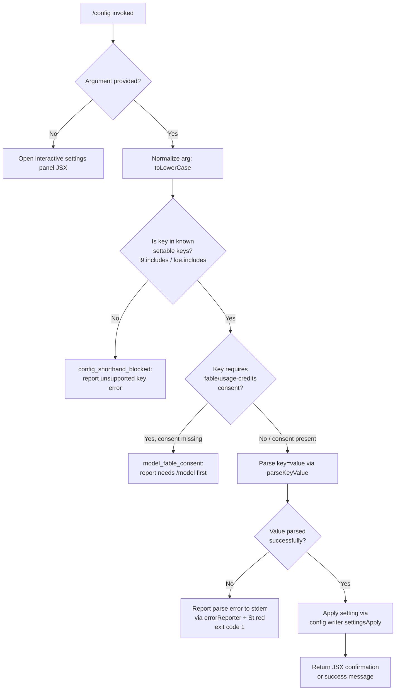

# `/config`

> Analysis basis: CC v2.1.190 bundle.js (AST extraction + Claude interpretation)
> Minimum version: v2.1.190

---

## Overview

`/config` (also accessible as `/settings`) opens an interactive settings panel that lets users inspect and modify Claude Code's runtime configuration. The command accepts an optional `key=value` shorthand argument for directly setting a named configuration property from the command line, bypassing the interactive UI when a specific setting is already known.

---

## Registration

| Field | Value |
|---|---|
| type | `local-jsx` |
| name | `config` |
| description | `Open settings` |
| aliases | `["settings"]` |
| argumentHint | `[key=value]` |
| module_id | `Ohl` |
| load_inline | `true` |
| loc_byte | `11447864` |
| loc_byte_end | `11448142` |
| arbor_handler.name | `kZp` |
| arbor_handler.fqn | `claude-2.1.190::kZp` |
| arbor_handler.kind | `AsyncFunction` |
| arbor_handler.resolution_path | `module_id` |
| arbor_handler.n_hits | `0` |

Analysis basis: CC v2.1.190 bundle.js:+11447864

---

## Input Branching

The handler has four distinct input paths based on argument presence and content, warranting a Mermaid flowchart.



Analysis basis: CC v2.1.190 bundle.js:+11447016 (key inclusion checks), +11447049 (random/timeout branch), +11447126 (settings panel render), +11447168 (key=value parse)

---

## Behavioral Spec

### 1. Handler Entry Point (`configCommandHandler`)

The top-level handler is the async function `kZp` (Arbor resolution: `module_id` → `Ohl`).

```
async function configCommandHandler(context):
    arg = context.argument?.trim()

    if arg is absent or empty:
        return renderSettingsPanel(context)   // JSX panel (AIo.jsx)

    normalizedArg = arg.toLowerCase()

    if not isInKnownKeys(normalizedArg):      // i9.includes / loe.includes
        emitTelemetry("config_shorthand_blocked")
        return renderError("unsupported key")

    if requiresFableConsent(normalizedArg) and not hasFableConsent():
        emitTelemetry("model_fable_consent")
        return renderError("needs usage-credits consent — run /model first")

    parsed = parseKeyValue(arg)               // MWt

    if parsed is error:
        reportCliError(parsed.message)        // Is → dqe → console.error + St.red
        exit(1)

    applyConfigSetting(parsed.key, parsed.value)  // PWt → Wmt → ao / settingsApply
    return renderSuccessResult()
```

Analysis basis: CC v2.1.190 bundle.js:+11446936 (`AIo.jsx` JSX render), +11446997 (`toLowerCase`), +11447016 (`i9.includes`), +11447032 (`loe.includes`), +11447049 (random/timeout easter-egg branch `e`), +11447126 (`PWt` config apply), +11447168 (`MWt` parse)

---

### 2. Argument Parser (`parseKeyValue`)

Corresponds to `MWt`.

```
function parseKeyValue(rawArg):
    trimmed = rawArg.trim()

    if not trimmed.includes("="):
        return { error: true, message: "expected key=value" }

    eqIndex   = trimmed.indexOf("=")
    key       = trimmed.slice(0, eqIndex)
    remainder = trimmed.slice(eqIndex + 1)

    // Handle array/multi-value notation (comma or repeated key)
    if remainder.includes(","):
        values = remainder.split(",")
        // normalise each element
        return { key, values }

    // Handle quoted or composite values via indexOf / slice
    valueIndex = remainder.indexOf(someDelimiter)
    parts      = collect segments via r.push / o.slice

    return { key, value: assembled }
```

Analysis basis: CC v2.1.190 bundle.js:+11248382 (trim), +11248399 (includes `=`), +11248433 (split), +11248451 (`zn`), +11248461 (includes check), +11248489 (indexOf), +11248506 (slice), +11248615 (second indexOf), +11248650 (push), +11248662 (slice)

---

### 3. CLI Error Reporter (`cliErrorReporter`)

Corresponds to `Is` → `dqe`.

```
function reportCliError(message):
    formatted = St.red(message)          // ANSI red formatting
    console.error(formatted)             // stderr output
    logEntry("cli_error", message)       // structured log kind
    writeFileSyncAndFlush(logPath, ...)  // iT: flush to disk
    process.exit(1)                      // exit code 1
```

Literal `"cli_error"` at bundle.js:+13087677; exit code `1` at +13087703.

Analysis basis: CC v2.1.190 bundle.js:+13087622 (`St.red`), +13087636 (console.error), +13087667 (`Is`→`dqe`), +13087674 (`iT`), +13087690 (process.exit)

---

### 4. Settings Panel Renderer (`settingsPanelComponent`)

Corresponds to `PWt` → `Wmt` (the large JSX component tree). The panel is a `local-jsx` component that renders multiple grouped settings rows. Each row is one of several types:

```
type SettingRowKind =
    | "boolean"          // toggle on/off
    | "enum"             // fixed list of values
    | "managedEnum"      // list managed by server/policy
    | "string"           // free-text input
```

Settings groups surfaced by the panel (derived from string literals):

| Group / Key | Display Label | Kind |
|---|---|---|
| `model` | `Model` | enum |
| `verbose` | `Verbose output` | boolean |
| `preferredNotifChannel` | `Notifications` | enum |
| `inputNeededNotifEnabled` | `Push when actions required` | boolean |
| `agentPushNotifEnabled` | `Push when Claude decides` | boolean |
| `autoCompact` / `autoCompactEnabled` | `Auto-compact` | boolean |
| `switchModelsOnFlag` | *(refusal fallback)* | boolean |
| `tips` | `Show tips` | boolean |
| `reduceMotion` | `Reduce motion` | boolean |
| `thinking` / `thinking_toggle` | `Thinking mode` | boolean |
| `fast` | `Fast mode` | boolean |
| `promptSuggestionEnabled` | `Prompt suggestions` | boolean |
| `recap` | `Session recap` | boolean |
| `checkpoints` / `fileCheckpointingEnabled` | `Rewind code (checkpoints)` | boolean |
| `workflows` / `workflowKeywordTriggerEnabled` | `Dynamic workflows` | boolean |
| `progressBar` / `terminalProgressBarEnabled` | `Terminal progress bar` | boolean |
| `showStatusInTerminalTab` | `Show status in terminal tab` | boolean |
| `turnDuration` / `showTurnDuration` | `Show turn duration` | boolean |
| `precomputeCompactionEnabled` | `Precompute compaction` | boolean |
| `timestamps` / `showMessageTimestamps` | `Show message timestamps` | boolean |
| `permissionMode` | `Default permission mode` | enum (`default`, `plan`, `auto`, `bypassPermissions`) |
| `worktreeBaseRef` | `Worktree base ref` | enum (`fresh`, `head`) |
| `useAutoModeDuringPlan` | `Use auto mode during plan` | boolean |
| `gitignore` | `Respect .gitignore in file picker` | boolean |
| `copyFullResponse` | `Skip the /copy picker` | boolean |
| `copyOnSelect` | `Copy on select` | boolean |
| `autoScroll` / `autoScrollEnabled` | `Auto-scroll output` | boolean |
| `agentsView` / `defaultToAgentsView` | `Agents view` | managedEnum |
| `leftArrowOpensAgents` | *(left arrow opens agents)* | boolean |
| `autoUpdatesChannel` | `Auto-update channel` | enum (`rc`, `slow`, `latest`) |
| `theme` | `Theme` | enum |
| `notifChannel` | `Notifications` | enum |
| `outputStyle` | `Output style` | enum |
| `defaultView` | `Default view` | enum (`transcript`, `chat`) |
| `language` | `Language` | string |
| `editor` / `editorMode` | `Editor mode` | enum (`emacs`, `normal`, `vim`) |
| `externalEditorContext` | `Show last response in external editor` | boolean |
| `prStatus` | `Show PR status footer` | boolean |
| `diffTool` | `Diff tool` | enum (`terminal`, …) |
| `autoConnectIde` | `Auto-connect to IDE (external terminal)` | boolean |
| `autoInstallIdeExtension` | `Auto-install IDE extension` | boolean |
| `chrome` | `Claude in Chrome` | boolean |
| `teammateMode` | `Teammate mode` | enum (`tmux`, `iterm2`, `in-process`) |
| `teammateDefaultModel` | `Default teammate model` | enum |
| `remoteControl` / `remoteControlAtStartup` | `Enable Remote Control for all sessions` | boolean |
| `showExternalIncludesDialog` | `External CLAUDE.md includes` | boolean |
| `apiKey` | `Use custom API key` | string |

Analysis basis: CC v2.1.190 bundle.js:+11232037 through +11246705 (Wmt component body)

---

### 5. Notification Preferences Patch (`notifPrefsPatch`)

Corresponds to `ZYp`. When notification-related settings change, the panel calls a server-side PATCH:

```
async function patchNotifPrefs(settings):
    emit telemetry "notif_prefs_patch"
    if not authenticated:
        log("no_auth", level="info")
        return

    try:
        response = await Vs.patch(notifPrefsEndpoint, settings)
        emit telemetry "notif_prefs_patch_ok"
    catch httpError:
        emit telemetry "notif_prefs_patch_failed"
        log("http_error")
```

Analysis basis: CC v2.1.190 bundle.js:+11224558 through +11224820

---

### 6. Config Persistence (`settingsApply` / `configWriter`)

Corresponds to `ao` (settings writer). The apply pipeline:

```
async function settingsApply(key, value, scope):
    // scope: "userSettings" | "projectSettings" | "localSettings" | "policySettings"

    existing = loadSettingsFromDisk()          // PG → loadSettingsFromDisk_start/end telemetry
    merged   = deepMerge(existing, {[key]: value})

    // Validate no auth data loss (GH #3117 guard)
    if existing has auth and merged is missing auth:
        emitTelemetry("tengu_config_auth_loss_prevented")
        abort()

    // Acquire file lock, write atomically
    writeWithLock(configPath, merged)          // sIt: atomic write via temp + rename
    invalidateCache()                          // bH: XYt.clear + xsr.clear
    uYe.emit("config_changed")
```

Settings file paths resolved via `g9` (`HO.join`) to `.claude/settings.json` and `.claude/settings.local.json`.

Analysis basis: CC v2.1.190 bundle.js:+1317356 (`.claude`), +1317366 (`settings.json`), +1317428 (`settings.local.json`), +13752338 (auth-loss guard message), +1337492 (`userSettings`), +1337607 (`projectSettings`), +1337630 (`localSettings`)

---

### 7. Fast Mode Toggle (`fastModeToggle`)

Corresponds to `qoe` / `Cw`. Fast mode has several unavailability states reported to the user:

```
function evaluateFastModeAvailability(authContext):
    if authContext.type in ["bedrock", "foundry", "anthropicAws", "mantle", "vertex"]:
        return { available: false,
                 reason: "Fast mode is only available when using the Anthropic API directly" }

    if authContext.orgStatus == "pending":
        return { available: false,
                 reason: "Checking fast mode availability (org status pending)" }

    if authContext.type == "sdk":
        return { available: false,
                 reason: "Fast mode is not available in the Agent SDK" }

    if authContext.orgStatus == "disabled":
        return { available: false, reason: "Fast mode is not available" }

    if networkError:
        return { available: false, reason: "network_error" }

    return { available: true }
```

When toggled ON, displays `"ON"`; when OFF, displays `"OFF"` (literals at +11234593, +11234661). Emits `tengu_chomp_inflection` on toggle.

Analysis basis: CC v2.1.190 bundle.js:+2265041, +2265109, +2265456, +2265526, +2265618, +2265697, +2265746, +2265781

---

### 8. Config File Locking (`configSaveWithLock`)

Corresponds to `GQn`. Protects concurrent writes across Claude instances:

```
async function configSaveWithLock(path, data):
    lockAcquireStart = Date.now()
    mkdir(dirname(path), { recursive: true })

    if lockAcquisition > 100ms:
        emitTelemetry("tengu_config_lock_contention")
        warn("Lock acquisition took longer than expected…")

    // Atomic write: write to temp, fsync, fchmod, rename
    tempPath = path + ".backup." + timestamp
    writeFileSync(tempPath, serialize(data))
    fchmodSync(tempPath, originalMode)
    fsyncSync(tempPath)
    renameSync(tempPath, path)

    // Rotation: keep at most 5 backups
    backups = readdirSync(dir).filter(startsWith(".backup."))
    if backups.length > 5:
        unlinkSync(oldest)
```

Lock contention threshold: 100ms (literal `100` at +13751916). Lock timeout: 60000ms (+13752692). Max backups retained: 5 (+13752941). Temp file permissions octal: 0o600 (384 decimal, +13753223).

Analysis basis: CC v2.1.190 bundle.js:+13751796 through +13753181

---

## State & Side Effects

| Item | Detail |
|---|---|
| Telemetry: `tengu_config_model_changed` | Fired when model setting is changed (bundle.js:+11232039) |
| Telemetry: `tengu_push_notif_pref_changed` | Fired on notification preference change (+11232815) |
| Telemetry: `tengu_auto_compact_setting_changed` | Fired on auto-compact toggle (+11233253) |
| Telemetry: `tengu_refusal_fallback_setting_changed` | Fired on switchModelsOnFlag change (+11233491) |
| Telemetry: `tengu_tips_setting_changed` | Fired on tips toggle (+11233722) |
| Telemetry: `tengu_reduce_motion_setting_changed` | Fired on reduce motion toggle (+11234020) |
| Telemetry: `tengu_thinking_toggled` | Fired on thinking mode toggle (+11234241) |
| Telemetry: `tengu_chomp_inflection` | Fired on fast mode toggle (+11234682) |
| Telemetry: `tengu_sedge_lantern` | Fired on prompt suggestions change (+11234916) |
| Telemetry: `tengu_file_history_snapshots_setting_changed` | Fired on checkpoints setting change (+11235359) |
| Telemetry: `tengu_maple_sundial` | Fired on verbose / related setting (+11229906) |
| Telemetry: `tengu_terminal_progress_bar_setting_changed` | Fired on progress bar toggle (+11236349) |
| Telemetry: `tengu_terminal_sidebar` | Fired on terminal sidebar toggle (+11236416) |
| Telemetry: `tengu_terminal_tab_status_setting_changed` | Fired on terminal tab status toggle (+11236664) |
| Telemetry: `tengu_show_turn_duration_setting_changed` | Fired on turn duration toggle (+11236888) |
| Telemetry: `tengu_sepia_moth` | Fired on precompute compaction change (+11236952) |
| Telemetry: `tengu_precompute_compaction_setting_changed` | Fired on precompute compaction toggle (+11237208) |
| Telemetry: `tengu_silk_hinge` | Fired on timestamps-adjacent setting (+11237279) |
| Telemetry: `tengu_show_message_timestamps_setting_changed` | Fired on timestamps toggle (+11237523) |
| Telemetry: `tengu_respect_gitignore_setting_changed` | Fired on gitignore toggle (+11239214) |
| Telemetry: `tengu_default_view_setting_changed` | Fired on default view change (+11242109) |
| Telemetry: `tengu_editor_mode_changed` | Fired on editor mode change (+11242698) |
| Telemetry: `tengu_external_editor_context_changed` | Fired on external editor context change (+11243013) |
| Telemetry: `tengu_pr_status_footer_setting_changed` | Fired on PR status toggle (+11243327) |
| Telemetry: `tengu_diff_tool_changed` | Fired on diff tool change (+11243900) |
| Telemetry: `tengu_auto_connect_ide_changed` | Fired on auto-connect IDE change (+11244172) |
| Telemetry: `tengu_auto_install_ide_extension_changed` | Fired on IDE extension toggle (+11244476) |
| Telemetry: `tengu_claude_in_chrome_setting_changed` | Fired on Chrome integration toggle (+11244812) |
| Telemetry: `tengu_teammate_mode_changed` | Fired on teammate mode change (+11245208) |
| Telemetry: `tengu_config_lock_contention` | Fired when file lock takes >100ms (+13752011) |
| Telemetry: `tengu_config_stale_write` | Fired when a stale config write is detected (+13752147) |
| Telemetry: `tengu_config_auth_loss_prevented` | Fired when auth-loss guard triggers (+13752490) |
| Telemetry: `tengu_config_parse_error` | Fired when config JSON cannot be parsed (+13754586) |
| Telemetry: `tengu_config_fallback_write` | Fired when fallback write path is used (+13751627) |
| Telemetry: `tengu_amber_creek` | Fired on fullscreen setting change (+3556463) |
| Telemetry: `tengu_pewter_brook` | Fired on copy-on-select / related setting (+3556371) |
| Telemetry: `tengu_amber_flint` | Fired on agent-teams related toggle (+7084248) |
| Telemetry: `tengu_feature_ok` / `tengu_feature_sad` / `tengu_feature_bad` | Feature flag outcome events (+1025122, +1025270, +1025189) |
| Telemetry: `tengu_notif_prefs_patch` / `_ok` / `_failed` | Notification PATCH lifecycle (+11224558–+11224820) |
| Telemetry: `model_fable_consent` | Shorthand key blocked — fable consent required (+11243592) |
| Telemetry: `config_shorthand_blocked` | Shorthand key unrecognised (+11243614) |
| Telemetry: `tengu_penguins_off` | Fast mode disabled state telemetry (+2265147) |
| Cache invalidation | `XYt.clear()` and `xsr.clear()` called after every write (bH, +29197, +29209) |
| Event emission | `uYe.emit("config_changed")` after successful write (+1338064) |
| File writes | Settings written atomically to `.claude/settings.json`, `.claude/settings.local.json`, and `~/.claude.json` |
| Global config backup | Up to 5 `.backup.<timestamp>` rotated copies retained (+13752941) |
| Notification PATCH | HTTP PATCH to server when notification preferences change (ZYp) |
| appState changes | `e.setAppState` called from `CTo` when panel state transitions occur (+11252436) |
| Sound | <!-- TODO: not found in depth-2 traversal; needs --depth 4 --> |

---

## Version History

| Version | Change |
|---|---|
| v2.1.190 | Initial analysis |

---

## Common Mistakes

1. **Using `/config key=value` for unsupported keys**: Only keys in the known settable-key lists (`i9`, `loe`) are accepted as shorthands. Using an arbitrary key results in a `config_shorthand_blocked` error. Use the interactive panel for keys not in the shorthand allowlist.

2. **Setting `model` to a fable/usage-credits model without prior consent**: Keys requiring fable consent (e.g. selecting usage-credit models) via the shorthand will be blocked with a message directing the user to run `/model` first.

3. **Concurrent Claude instances writing config**: The file lock is cooperative only within a single machine process group. Running multiple Claude Code instances simultaneously on the same config file may trigger `tengu_config_lock_contention` and performance degradation.

4. **Expecting `/config` to affect project-level policy settings**: Policy-tier settings (`policySettings`, `flagSettings`) are read-only from the panel; only user, project, and local scopes are writable from the UI.

5. **Omitting the `=` in shorthand usage**: `/config key value` (space-separated) is **not** valid. The parser (`MWt`) requires the `=` delimiter: `/config key=value`.

6. **Expecting theme and output style customisation from `/config`**: The panel displays a note directing users to `/theme` for custom themes and `/config` (full panel) for custom output styles; the shorthand cannot set these.

---

## Appendix — Identifier Mapping

> For bundle debugging only. Identifiers change across versions.

| Identifier | Role |
|---|---|
| `kZp` | Main async handler for `/config` command (`configCommandHandler`) |
| `r` | Inner helper / argument normalisation context |
| `Is` | CLI error dispatch function |
| `dqe` | Stderr error formatter (applies ANSI red, calls console.error) |
| `iT` | Synchronous file-write-and-flush helper |
| `e` | Random/timeout easter-egg branch (Math.random + setTimeout) |
| `PWt` | Top-level settings apply dispatcher |
| `Wmt` | Large settings panel JSX component |
| `W` | React/Ink context or app state accessor |
| `ZY` | Sub-component: model/config row renderer |
| `sA` | Sub-component: notification channel row |
| `Qo` | Model name resolver / display-name mapper |
| `zOt` | Sub-component: error state renderer |
| `ao` | Settings writer (applies merged settings to disk) |
| `Jm` | Project root resolver |
| `Wt` | File existence / stat helper |
| `ZEr` | Settings directory resolver |
| `l2` | Settings object builder / schema validator |
| `DC` | Config section dispatcher |
| `kn` | ENOENT handler |
| `T` | Log-level / debug formatter |
| `cEr` | Cache timestamp updater (Con.set + Date.now) |
| `nNe` | Settings merge helper |
| `sIt` | Atomic file write helper (temp→rename with fsync) |
| `Me` | JSON.stringify wrapper |
| `bH` | Cache invalidator (clears XYt and xsr) |
| `Gis` | Gitignore file processor |
| `g9` | Config path builder (HO.join) |
| `gr` | VL-based helper (feature flag accessor) |
| `Le` | Feature OK telemetry emitter |
| `Mt` | Feature sad/error telemetry emitter |
| `Re` | Feature bad telemetry emitter |
| `PG` | Settings-from-disk loader |
| `ke` | Background worker / connection dispatcher |
| `Cre` | Sub-component within settings panel |
| `A` | Worker pool / parallel task manager (Math.max/min, Promise.all) |
| `_` | Agent lifecycle manager (nyt, VD, Ox, Promise.all) |
| `w` | Background sweep ticker (Date.now, Math.min) |
| `ij` | Worker state identifier |
| `L` | Background worker sweep loop |
| `v` | Misc value accessor |
| `ycc` | Array `.at()` accessor helper |
| `Ecc` | Extended context builder (xnr) |
| `E2` | Config sub-component: model/Ao/Tfn/Kg/Qo |
| `Ao` | Model display component (ay, H2, Gs) |
| `Tfn` | Model feature flags component |
| `Kg` | Combined config+view component |
| `Xxe` | Config row renderer (model tier, fast-mode, etc.) |
| `o` | Table/list formatter (s.map, i.padEnd) |
| `Lm` | Model list component (Bl, vw, Qo) |
| `XG` | nl/notification-group component |
| `tF` | First-party model selector component |
| `mge` | Model group enum component |
| `Eae` | Error/unavailability display component |
| `wH` | Mfe-based helper (Mfe wrapper) |
| `cb` | Core config row component (Mfe, Pfe, Ir, Ao, Ci) |
| `Mfe` | Base row renderer (nt) |
| `Pfe` | Pro-tier row renderer (Ci) |
| `Ir` | Ink render helper (nt) |
| `Ci` | Component with YLr, jLr, ay, Gs |
| `tv` | ao-calling transition helper |
| `HTo` | Notification preferences panel section |
| `Xpl` | Notification sub-row (Ur, Dt) |
| `ZYp` | Notification PATCH dispatcher |
| `Ve` | aKe-based base component |
| `aKe` | Core JSX element factory |
| `CLn` | t7-based component (switch models on flag) |
| `t7` | Switch models component |
| `Bl` | Ink Block/Box component (Ir, nt) |
| `nt` | Ink Text component |
| `Cw` | Fast mode toggle component (Bl, qoe) |
| `qoe` | Fast mode availability evaluator |
| `C9` | Misc config value component |
| `RTe` | Config section divider/spacer |
| `jNe` | cb-calling helper |
| `it` | Session/event subscriber |
| `txt` | Text content accessor |
| `nxt` | Next-token accessor |
| `V9` | q9-based query helper |
| `gSn` | Event deduplication set manager (uBr, YIe, lBr, mBr) |
| `Dt` | Disk timestamp / stat record builder |
| `OBr` | NBr-delegating component |
| `NBr` | ild-calling component |
| `Bmt` | Jxe-based component wrapper |
| `Jxe` | it-calling sub-component |
| `hn` | Global config save entry-point |
| `GQn` | Config save with file locking |
| `CDe` | Config diff / change detector |
| `NOo` | Object.entries-based settings enumerator |
| `DKt` | Date.now-based timestamp helper |
| `SEe` | Global config reader (readFileSync + parse) |
| `PHt` | Permissions helper |
| `BQn` | Config write fallback handler |
| `U` | Debounced output writer (setTimeout/clearTimeout) |
| `N` | Output node/buffer |
| `d` | Daemon process manager (rqe, y$l, GEc) |
| `M` | clearTimeout-based flush manager |
| `F` | Interval/filter manager (clearInterval) |
| `mO` | KM.includes-based mode check |
| `Q7e` | Config enum validator |
| `zM` | qon-based helper |
| `qon` | Mode/channel resolver |
| `Tn` | Settings type resolver (gsn, l2) |
| `gsn` | Settings path builder (B5o, ZEr, G5o) |
| `t$t` | Permissions/tool-rules component (B6, eOo, O$, EEe) |
| `B6` | Tool allow-list builder (Xm, VPo, T, qp) |
| `eOo` | Permissions component (H9, cC, ESr) |
| `O$` | Permissions display component |
| `EEe` | Rules mapper (Object.entries, iH, o.map) |
| `bs` | Fullscreen/display mode component |
| `J$` | dtu.has-based feature gate |
| `mx` | uli.isEnabled-based feature check |
| `p9r` | nt-based progress row |
| `mZ` | Zud-based display helper |
| `d9r` | Yt/Boolean display row |
| `Ur` | PG-calling settings accessor |
| `edd` | it-calling event helper |
| `hx` | det-based hover/interaction helper |
| `det` | ABr-based detail component |
| `ixe` | hx/la-based extended interaction |
| `la` | Layout/anchor helper |
| `Vl` | dl/Ad-based value list component |
| `dl` | nt/WXt-based display list item (--safe-mode) |
| `Ad` | nt/WXt-based display list item (--bare) |
| `X9` | e.startsWith/e.slice-based prefix stripper |
| `yTo` | Misc config panel helper |
| `Wwn` | it-calling notification wrapper |
| `qde` | Config display query helper |
| `Pe` | aKe-based presentation component |
| `efl` | Filter/display list component (Qoe, pTo, fTo, Da) |
| `Qoe` | Ir/Eu/Rfe/kfe-based output item |
| `t` | Generic text/token type |
| `pTo` | pTo: lowercase/cee/cb/includes filter |
| `fTo` | fTo: lowercase/fge/includes filter |
| `Da` | Settings diff/apply aggregator |
| `k` | Process kill / worker teardown (wk, w.delete) |
| `wk` | process.kill wrapper |
| `Ofe` | poe/t.trim-based option formatter |
| `Wa` | nt/_Qd/it-based widget component |
| `_Qd` | Internal widget state |
| `Oeo` | Sub-panel open/close handler |
| `Neo` | T-based nested component |
| `_5t` | Internal state flag |
| `PVn` | E2/y5t-based panel variant |
| `y5t` | Ir/Kp-based inner panel |
| `TL` | PQn/kKt/hq/I6e-based top-level layout |
| `PQn` | Panel query helper |
| `kKt` | qL-based key lookup |
| `hq` | nt/la-based header/queue display |
| `I6e` | Nl/DHt/it-based info entry |
| `sue` | qL/Dt/pL/oo-based settings update entry |
| `qL` | Config key lookup |
| `oo` | xPe/nsr/lYt/cYt/ISc/o9o-based observer object |
| `ITo` | Inline toggle component |
| `rT` | Row title formatter |
| `sU` | e.slice-based substring helper (max 20 chars) |
| `Gmt` | Dt/Ur-based config merge helper |
| `CTo` | Main config panel container component |
| `lc` | ex/n/mSr/Tn/uet/Dt-based lifecycle component |
| `ex` | CEt/t.add/mT.filter/t.has-based extension tracker |
| `n` | i.toLowerCase-based name normaliser |
| `mSr` | Jm/Ioe.resolve-based module source resolver |
| `OSn` | hSi/nt/NBr-based overlay/modal |
| `hSi` | Js-based hash/state item |
| `Qxe` | H9-based query extension |
| `H9` | Config hash / state key |
| `GWe` | it/XPo-based gateway watcher |
| `XPo` | External process observer |
| `pae` | it-based page event handler |
| `Vi` | Jns-based visibility item |
| `Jns` | nt-based join/namespace helper |
| `pA` | Gs-based provider/app context |
| `X3e` | e.some-based existence check |
| `FHe` | p7e/Dt-based feature header |
| `p7e` | Panel feature entry |
| `MWt` | Key=value argument parser |
| `zn` | t-based token/zone helper |