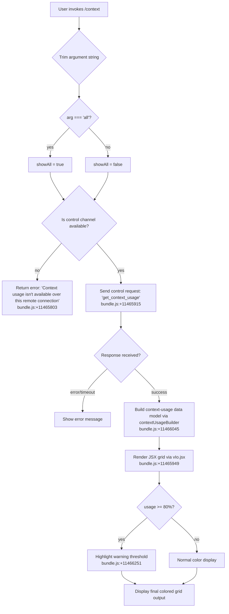

# `/context`

> Analysis basis: CC v2.1.190 bundle.js (AST extraction + Claude interpretation)
> Minimum version: v2.1.190

---

## Overview

The `/context` command visualizes the current conversation context window usage as a colored grid display. It sends a control request to the host process to retrieve live token-usage statistics, then renders a detailed breakdown across system prompt, tools, messages, memory files, and other contributors — enabling users to understand how much of the context window is consumed and where.

---

## Registration

| Field | Value |
|---|---|
| type | `local-jsx` |
| name | `context` |
| description | `Visualize current context usage as a colored grid` |
| argumentHint | `[all]` |
| thinClientDispatch | `control-request` |
| module_id | `sgl` |
| load_inline | `true` |
| loc_byte | `11467105` |
| loc_byte_end | `11467331` |
| loc_line | `7225` |
| arbor_handler.name | `_ef` |
| arbor_handler.fqn | `claude-2.1.190::_ef` |
| arbor_handler.kind | `AsyncFunction` |
| arbor_handler.resolution_path | `module_id` |
| arbor_handler.n_hits | `0` |

Analysis basis: CC v2.1.190 bundle.js:+11467105

---

## Input Branching

The command exhibits 4+ distinct branches based on argument value, connection type, and usage-data availability.



Analysis basis: CC v2.1.190 bundle.js:+11465719 through +11466268

---

## Behavioral Spec

### 1. Argument Parsing

```
function parseContextArgument(rawArg):
    trimmed = rawArg.trim()            // bundle.js:+11465725
    if trimmed === "all":              // bundle.js:+11465750
        showAllSegments = true
    else:
        showAllSegments = false
    return showAllSegments
```

Analysis basis: CC v2.1.190 bundle.js:+11465725, +11465750

---

### 2. Remote Availability Check

```
function checkControlChannelAvailable(connectionContext):
    channelType = connectionContext.type   // bundle.js:+11465773
    if channelType !== "controlChannel":   // bundle.js:+11465776
        return Error("Context usage isn't available over this remote connection")
                                           // bundle.js:+11465803
    return OK
```

When the session is running over a transport that lacks the `controlChannel` capability (e.g., a plain remote pipe), the command aborts immediately with the literal error string found at bundle.js:+11465803.

Analysis basis: CC v2.1.190 bundle.js:+11465773, +11465776, +11465803

---

### 3. Control Request — `get_context_usage`

```
async function fetchContextUsage(controlRequester):
    response = await controlRequester.sendControlRequest(
        "get_context_usage"             // bundle.js:+11465915
    )
    return response
```

The string `"get_context_usage"` is the control-protocol message type dispatched to the local agent host. The `thinClientDispatch: "control-request"` registration field confirms this is routed through the thin-client control plane rather than the main LLM pipeline.

Analysis basis: CC v2.1.190 bundle.js:+11465885, +11465915

---

### 4. Context-Usage Data Model Construction

```
function buildContextUsageModel(rawUsageResponse, showAll):
    // contextUsageBuilder (YWt) collects segment data
    segments = []

    // Always-present segments:
    segments.push(buildSegment("Free space", freeTokens))         // bundle.js:+11463857
    segments.push(buildSegment("Autocompact buffer", autocompact)) // bundle.js:+11463880

    // Conditional / settings-keyed segments (shown when showAll=true or non-zero):
    if hasSystemPrompt:
        segments.push(buildSegment("System prompt", systemTokens))  // bundle.js:+10827401
    if hasSystemTools:
        segments.push(buildSegment("System tools", sysToolTokens))  // bundle.js:+10827482
    if hasMcpTools:
        segments.push(buildSegment("MCP tools", mcpToolTokens))     // bundle.js:+10827547
    if hasMemoryFiles:
        segments.push(buildSegment("Memory files", memTokens))      // bundle.js:+10827865
    if hasMessages:
        segments.push(buildSegment("Messages", msgTokens))          // bundle.js:+10828409

    // Filter zero-count segments when showAll=false
    if not showAll:
        segments = segments.filter(s => s.count > 0)                // bundle.js:+11463822

    // Locate the system segment for special rendering
    systemSegment = segments.find(s => s.kind === "system")         // bundle.js:+11464140
    
    return { segments, systemSegment }
```

Analysis basis: CC v2.1.190 bundle.js:+11463781, +11463822, +11463857, +11463880, +11464140

---

### 5. Settings-Source Annotation

Within the `/context` output, individual context contributors are annotated with their originating settings source. The sources present in the literals correspond to:

| Label shown | Settings key | loc_byte |
|---|---|---|
| `Project` | `projectSettings` | +11464826 |
| `User` | `userSettings` | +11464846 |
| `Local` | `localSettings` | +11464880 |
| `Flag` | (feature flags) | +11464933 |
| `Policy` | (policy layer) | +11464969 |
| `Plugin` | `plugin` | +11464988 |
| `Built-in` | `built-in` | +11465018 |

Analysis basis: CC v2.1.190 bundle.js:+11464806 – +11465031

---

### 6. Percentage Calculation and Warning Threshold

```
function computeUsagePercent(usedTokens, totalTokens):
    pct = Math.round((usedTokens / totalTokens) * 100)  // bundle.js:+11465557
    return pct

function applyWarningThreshold(pct):
    WARNING_PCT = 80                                      // bundle.js:+11466251
    if pct >= WARNING_PCT:
        renderWithWarningColor(pct)
    else:
        renderNormal(pct)
```

The number `80` at bundle.js:+11466251 is the threshold above which the grid display applies a warning highlight.

Analysis basis: CC v2.1.190 bundle.js:+11465557, +11466251

---

### 7. Compact Boundary Marker

```
function annotateCompactBoundary(segments):
    // "compact_boundary" string marks where autocompact has previously truncated
    boundaryIdx = findCompactBoundaryIndex(segments)   // bundle.js:+13693819
    if boundaryIdx >= 0:
        segments[boundaryIdx].label = "compact_boundary"
    return segments
```

Analysis basis: CC v2.1.190 bundle.js:+13693819

---

### 8. Grid Rendering (JSX)

```
function renderContextGrid(segments, pct, showAll):
    // mct (bundle.js:+11465945) sets up the output stream listener
    // vIo.jsx (bundle.js:+11465949) renders the colored grid as a JSX component
    // be (bundle.js:+11466129) formats the numeric token counts as strings
    // Hef (bundle.js:+11466218) → MH slices the display model for rendering

    grid = vIo.jsx({
        segments: segments,
        usagePct: pct,
        showAll: showAll,
    })
    
    // Percentage formatting: "en-US" locale, "compact" notation
    // bundle.js:+223270, +223288
    formattedPct = new Intl.NumberFormat("en-US", { notation: "compact" })
                        .format(pct)
    
    // Threshold labels in the grid legend:
    // "< 20" for the lowest band (bundle.js:+221297)
    // 20-column bands (bundle.js:+221288)
    // 10-row grid cells (bundle.js:+221330)

    return grid
```

Analysis basis: CC v2.1.190 bundle.js:+11465945, +11465949, +11466129, +11466218, +221258, +221288, +221297, +221330

---

### 9. `X8n` — System Prompt Assembly (Shared Sub-System)

The handler calls into `X8n` (the system-prompt assembler, bundle.js:+11466268), which is the main context-window population engine responsible for computing the token breakdown across all contributors. This is the same routine called during normal inference, ensuring `/context` reflects the live state.

Key contributors resolved within `X8n`:
- `uR` — primary context-data resolver (bundle.js:+10826356)
- `YVp` — custom/builtin prompt aggregator (bundle.js:+10827115)
- `XVp` — tool-list assembler (bundle.js:+10827164)
- `JVp` — message-history assembler (bundle.js:+10827170)
- `aee` — context-window limit calculator using `Math.min` (bundle.js:+10827354)
- `sKp` — per-segment size calculator (bundle.js:+10827218)
- `d5i` — conversation compaction splice (bundle.js:+10828205)

Analysis basis: CC v2.1.190 bundle.js:+10826250, +10826356, +10827102, +10827354, +10828205

---

## State & Side Effects

| Item | Detail |
|---|---|
| Telemetry | No `tengu_*` events are emitted directly from the `/context` handler itself within the depth-2 traversal. Events from shared subsystems (e.g., `tengu_sparrow_ledger` at +13475311, `tengu_silent_harbor` at +13475926, `tengu_slate_harrier` at +13485755) may fire as side effects of `X8n` execution. |
| Control request | Sends `"get_context_usage"` over the control channel (bundle.js:+11465915) |
| appState changes | None — read-only display command |
| Sound | None observed |
| Hook registration | `Ei` → `C6o.register` (bundle.js:+67325) is called within the shared output-stream subsystem (`iLc`), not specific to `/context` |
| Output | Renders a JSX colored grid to the terminal via `vIo.jsx` (bundle.js:+11465949) |

---

## Version History

| Version | Change |
|---|---|
| v2.1.190 | Initial analysis |

---

## Common Mistakes

1. **Invoking over a remote connection without a control channel.** If Claude Code is accessed via a transport that does not expose `controlChannel`, the command returns the literal error `"Context usage isn't available over this remote connection"` (bundle.js:+11465803). There is no fallback rendering.
2. **Expecting zero-count segments by default.** Without the `all` argument (i.e., `/context all`), segments with zero token contribution are filtered out. Users may not see categories they expect if those categories are empty.
3. **Confusing `/context` with a context-clearing command.** This command is purely diagnostic (read-only visualization). It does not modify, clear, or compact the context window.
4. **Misinterpreting the 80% threshold.** The warning highlight activates at ≥ 80% context utilization (bundle.js:+11466251). Below that threshold, display is in normal colors regardless of actual headroom.
5. **Interpreting "Autocompact buffer" as free space.** The `"Autocompact buffer"` segment (bundle.js:+11463880) represents reserved headroom for the autocompact mechanism, not available tokens for user content.

---

## Appendix — Identifier Mapping

> For bundle debugging only. Identifiers change across versions.

| Identifier | Role |
|---|---|
| `_ef` | Main async handler for `/context` command (arbor_handler) |
| `bs` | Context availability / fullscreen mode checker |
| `J$` | Feature-flag set membership check |
| `mx` | Feature flag `isEnabled` query |
| `p9r` | Terminal/platform detection helper |
| `nt` | String conversion utility |
| `mZ` | Fullscreen/display mode resolver |
| `Zud` | Terminal emulator detection (iTerm2, tmux, etc.) |
| `Qud` | String prefix check for terminal IDs |
| `E7e` | Environment variable inspection for display hints |
| `T` | Logger / debug output utility |
| `nLc` | Settings loader orchestrator |
| `w6o` | Settings cache accessor |
| `Me` | JSON serializer for debug logging |
| `wc` | Path/string normalization utility |
| `p8o` | Path segment mapper |
| `hze` | Write-to-stream helper |
| `e8o` | Low-level stream write |
| `iLc` | Log/output file handler and rotation logic |
| `WKe` | Buffered write / line-join scheduler |
| `dpe` | Output path builder |
| `xre` | Config path resolver |
| `h8o` | Path join utility |
| `Ncr` | File stat/rename/unlink (log rotation) |
| `sLc` | Append-to-log-file routine |
| `Ei` | Hook registrar |
| `d9r` | Windows SSH / ConPTY detection |
| `Ur` | System-prompt injection entry point |
| `PG` | Settings load coordinator |
| `qL` | Settings validator |
| `ta` | Memory-usage tracker |
| `eSr` | Settings-load telemetry emitter |
| `l2` | Context-assembly parameter builder |
| `JYt` | Post-settings-load callback |
| `edd` | Event-driven dispatch subsystem |
| `it` | Conversation-message iterator/accessor |
| `txt` | Conversation text extractor |
| `nxt` | Next-message cursor |
| `V9` | Message-queue accessor |
| `gSn` | Conversation-set membership check |
| `Dt` | Message timestamp / metadata reader |
| `Nu` | Connection-type resolver |
| `nOe` | Connection-kind lookup |
| `sO` | Control-channel resolver |
| `mct` | Output-stream event listener setup |
| `qW` | JSX element factory dispatcher |
| `p6r` | React createElement wrapper |
| `MZ` | Display-mode selector (renders correct view variant) |
| `VCe` | View context builder |
| `e6r` | Alternate view context builder |
| `YWt` | Context-usage data model builder (segment assembler) |
| `el` | Token counter / Intl formatter |
| `Gc` | Locale-aware number formatter |
| `fLc` | Compact notation formatter |
| `K7e` | Segment-label resolver |
| `$re` | Percentage calculator with rounding |
| `be` | Numeric-to-string converter |
| `Hef` | Display-model slicer for rendering |
| `MH` | Token-range slice helper |
| `pVn` | Native-array slicer |
| `NA` | Array constructor utility |
| `X8n` | System-prompt / context-window assembler (main) |
| `vk` | Model-routing and policy enforcement |
| `v9` | Model resolver |
| `S_` | Model-string sanitizer |
| `lG` | Model-family lookup |
| `Da` | Model-capabilities resolver |
| `cb` | Chat-backend selector |
| `Mfe` | Model feature extractor |
| `Pfe` | Provider-feature checker |
| `Ir` | Provider string normalizer |
| `Ao` | API-provider selector |
| `Ci` | Provider credential checker |
| `jG` | Model-ID suffix stripper |
| `n_` | Model-name normalizer |
| `DTe` | Display-name builder for models |
| `dU` | Model-enforcement orchestrator |
| `DGs` | Available-models policy enforcer |
| `nl` | Newline / whitespace normalizer |
| `ix` | Inline-comment / special-char checker |
| `Vu` | Provider-type resolver |
| `zoe` | Allowlist membership check (model list) |
| `Hfn` | Heuristic model-name parser |
| `JNe` | Model-name tokenizer |
| `Qo` | Model-alias resolver |
| `Eo` | Token-count estimator |
| `Lfe` | Model-entitlement checker |
| `H3u` | Entitlement set builder |
| `dRr` | Tool-definition array validator |
| `XC` | Context-type classifier |
| `yfn` | Context-key builder |
| `eC` | Auto-compact configuration reader |
| `lc` | Legacy global config loader |
| `ex` | Config key set builder |
| `mSr` | Module-path resolver |
| `Tn` | Context-assembly parameter resolver |
| `yB` | Auto-compact window calculator |
| `Fy` | Feature-flag reader |
| `VL` | Low-level flag accessor |
| `iA` | Token-window size resolver |
| `Eai` | Integer parser / NaN guard |
| `ZUr` | Capped-window calculator |
| `Sai` | Window-size string formatter |
| `Hae` | Max-output-tokens parser |
| `dOd` | Object-schema validator |
| `n5i` | Array/object type checker |
| `Aai` | Model-default window lookup |
| `bai` | Per-model token limit table |
| `XKr` | Auto-compact model selector |
| `wr` | Request-context builder |
| `YKr` | Numeric-suffix unit parser (e.g., "128k") |
| `cOd` | Compact-config object validator |
| `uR` | Primary context-data resolver |
| `pPo` | Tool-permission checker |
| `Pt` | Async-store context reader |
| `Mrn` | Store-based context getter |
| `gr` | Global runtime accessor |
| `wqn` | Tool-list-with-metadata builder |
| `MIe` | Message-inclusion-eligibility checker |
| `eFr` | Message-filter rule evaluator |
| `yL` | Language/locale setting reader |
| `Vwf` | System-prompt part assembler |
| `qQ` | System-prompt cache key builder |
| `Wwf` | Coding-style system-prompt injector |
| `qwf` | Brief-mode system-prompt injector |
| `Kwf` | Confirmation-policy prompt injector |
| `zwf` | Outward-action confirmation injector |
| `Cai` | Model-specific identity injector |
| `M_n` | Model-prefix matcher |
| `XG` | Context-group label builder |
| `QEi` | Schema-freeze / JSON-schema validator |
| `sxt` | Array-freeze / integer-schema checker |
| `gPo` | Tool-definition formatter |
| `Za` | String coercion utility |
| `TLf` | Tool-list with cache control builder |
| `fq` | Sub-agent system-prompt injector |
| `aLf` | Memory-file context injector |
| `rK` | Memory-root-path resolver |
| `oC` | Memory-item formatter |
| `iLf` | Memory-index file reader |
| `sbo` | Memory scope boundary checker |
| `Yj` | Memory-feature flag reader |
| `fu` | Memory-filter predicate |
| `mq` | Routine/schedule loader |
| `xq` | Context-item flat-mapper |
| `kxt` | Memory-directory loader |
| `Kc` | Knowledge-root resolver |
| `rie` | Memory-directory creator |
| `LW` | File-type discriminator (file vs directory) |
| `Ve` | Version-keyed feature accessor |
| `Le` | File-read utility |
| `_Ai` | Memory-file batch processor |
| `Ccd` | Memory-file path normalizer |
| `f` | Subprocess / background-process manager |
| `a` | Daemon session registry |
| `Lxt` | Memory-index parser |
| `fA` | Memory-item type checker |
| `h0` | Memory-item context builder |
| `HA` | Path join with normalization |
| `MAi` | Memory-list flattener |
| `xAi` | Memory-content loader (private) |
| `RAi` | Memory-content loader (team) |
| `CAi` | Memory-scope context builder |
| `m` | Background-process kill manager |
| `h` | Process wrapper |
| `IAi` | Memory-item index builder |
| `b3r` | Memory-path boundary resolver |
| `W` | File-read / existence check |
| `gLf` | Environment-info assembler |
| `ug` | Language-setting normalizer |
| `fPo` | Dynamic environment-fact formatter |
| `hLf` | Static environment-info builder |
| `hPo` | OS version/release/type reader |
| `Hm` | Working-directory resolver |
| `mPo` | Shell-type detector |
| `YSn` | Git-worktree detector |
| `Zwf` | Worktree-specific prompt injector |
| `eLf` | Language-instruction injector |
| `_Lf` | Background-session prompt injector |
| `Buo` | Worktree-type resolver |
| `g4n` | Scratchpad-path builder |
| `RX` | Scratchpad context reader |
| `hEe` | Scratchpad item formatter |
| `ELf` | Brief-mode flag reader |
| `bLf` | Brief-mode prompt injector |
| `Tet` | Brief-mode instruction builder |
| `uLf` | Autonomy-append prompt injector |
| `Jwf` | Heron-brook constraint injector |
| `p0` | System-message builder |
| `Qwf` | Amber-sextant injector |
| `mXa` | Multi-attachment context loader |
| `OEt` | Attachment-type dispatcher |
| `qar` | Attachment cache resolver |
| `cLf` | Task-continuity injector |
| `tLf` | Fable-identity injector |
| `nLf` | Context-efficiency injector |
| `Xwf` | Context-efficiency text builder |
| `rLf` | Tool-param-json injector |
| `oLf` | Tool-output formatter |
| `sLf` | SDK-mode injector |
| `gv` | CLI/remote mode discriminator |
| `lLf` | Agent-listing injector |
| `UAi` | Memory-write disabled wrapper |
| `NAi` | Read-only memory context builder |
| `DIe` | Diagnostic prompt injector |
| `nD` | Diagnostic formatter |
| `Eu` | Normalization diagnostic helper |
| `z4l` | Context-window size configurator |
| `Aqn` | Max-value resolver for window sizing |
| `U5` | Main-thread system-prompt builder |
| `Cc` | Conversation-context extractor |
| `_v` | Conversation serializer |
| `cw` | Content-block walker |
| `la` | Text-content extractor |
| `oo` | Module-export bootstrapper |
| `cYt` | Constructor bind helper |
| `qh` | Session-ID generator |
| `Pe` | Async file reader |
| `aKe` | File-read error handler |
| `Zrt` | Assistant-turn extractor |
| `_ae` | EOT-marker scanner |
| `YVp` | Custom / built-in prompt aggregator |
| `jVp` | Prompt-source parser |
| `Q8n` | Per-source context builder |
| `HLf` | Environment-info (per-source variant) |
| `FAi` | File-based prompt context builder |
| `lPo` | Prompt-header parser |
| `dmt` | Message-token counter |
| `f3e` | Per-message token aggregator |
| `ke` | Error logger with telemetry |
| `fal` | Fallback token estimator |
| `XVp` | Tool-list assembler |
| `Qse` | Claude-md tool filter |
| `Vl` | Tool-definition selector |
| `KL` | Tool-cache key builder |
| `OOt` | Tool-list deduplicator |
| `JVp` | Message-history assembler |
| `wxe` | Message-batch processor |
| `Z8n` | Per-message context serializer |
| `u` | Session stop / daemon-stop handler |
| `Re` | File-write utility |
| `CU` | Queue push / message enqueuer |
| `X6` | Promise race / exit handler |
| `y` | Conversation session registry |
| `G5e` | Teammate mailbox reader |
| `g` | Timer/timeout registry |
| `eKp` | MCP-tool context builder |
| `ff` | Rounding utility |
| `c` | Stream encoder |
| `En` | Stream-chunk builder |
| `p` | Abort / forced-exit handler |
| `jb` | Exit-code resolver |
| `tKp` | Tool-result context builder |
| `QVp` | Permission-prompt context builder |
| `TVr` | Permission-rule resolver |
| `cae` | Permission-filter predicate |
| `pal` | Permission-rule lookup |
| `rl` | Permission-rule recursive resolver |
| `sKp` | Per-segment size calculator |
| `nKp` | Segment size: token count + rounding |
| `rKp` | Segment size: message reducer |
| `oKp` | Segment size: tool-result reducer |
| `Kw` | Main context-window state machine |
| `tkf` | Tool-use block reorderer |
| `tOo` | Thinking-block filter |
| `q6l` | Cached-token block resolver |
| `ikf` | Attachment-type dispatcher |
| `U` | Output buffer / write timer |
| `ukf` | Tool-name set builder |
| `q` | Queue drain helper |
| `nOo` | Orphan-block detector |
| `akf` | All-settled aggregator predicate |
| `lkf` | MCP-prefixed tool name filter |
| `X` | Interval/timer registry |
| `Vce` | Content-block validator |
| `l` | Retry/lock holder |
| `F` | Interval cleaner |
| `N` | Buffer writer |
| `Ikf` | Random-UUID generator (message IDs) |
| `On` | Message-ID minter |
| `Bv` | Turn-boundary marker |
| `Gfo` | Context-efficiency counter |
| `IQn` | Content-array inserter |
| `DD` | Tool-search enablement checker |
| `APo` | Tool-reference array updater |
| `nkf` | Orphan-thinking block remover |
| `L6l` | Flat-map tool references |
| `P` | Pending-block list |
| `rkf` | Trailing-thinking block filter |
| `Tkf` | Tool-use lookup by name |
| `t5l` | Deferred-tool-listing helper |
| `D` | Output-stream writer |
| `pkf` | Plan-mode block filter |
| `K6l` | Plan-mode message builder |
| `sqn` | Main system-prompt string builder |
| `x` | Write buffer |
| `Ckf` | System-reminder injector |
| `dkf` | Deferred-tools-delta builder |
| `M5e` | Orphaned-thinking-message handler |
| `Pkf` | Trailing-thinking-block handler |
| `x5e` | Whitespace-only-assistant handler |
| `Okf` | Empty-assistant-content fixer |
| `fkf` | Turn-continuation block appender |
| `W6l` | Find-last-index helper (system reminders) |
| `z6l` | Reminder insertion helper |
| `skf` | Slice/join helpers for system reminders |
| `ZVp` | Sub-agent context builder |
| `IBe` | Sub-agent permission resolver |
| `aA` | Sub-agent model resolver |
| `E6t` | Token-count estimation with rounding |
| `Ayo` | Estimation fallback |
| `fo` | Error formatter |
| `aee` | Context-window limit calculator |
| `pge` | Max-output-token resolver |
| `xIe` | Model-specific max-tokens getter |
| `ne` | Session list |
| `ee` | Session event handler |
| `ZW` | Async-iterator / stream processor |
| `H` | HTTP response buffer reader |
| `yit` | HTTP status-code parser |
| `E` | Event type dispatcher |
| `nMn` | Retry-after header parser |
| `j` | MCP-update applier |
| `u9e` | Session-state updater |
| `fBo` | MCP-server reconnection manager |
| `te` | Session-message handler |
| `A` | Token-budget math helper |
| `_` | Main inference loop |
| `v` | Conversation viewer |
| `x4` | Context-assembly entry point (light path) |
| `d5i` | Compaction-splice calculator |
| `u5i` | Pre-compaction message scanner |
| `c5i` | Compaction boundary finder |
| `WT` | Post-compaction assembler |
| `yKp` | Compaction-rebuild orchestrator |
| `xt` | Tool-output list builder |
| `Yho` | Tool-output token counter |
| `ye` | Session-list iterator |
| `I` | Math/layout helper |
| `ce` | Message enqueuer |
| `vc` | UUID generator |
| `fte` | Session startup helper |
| `gs` | Grammar / syntax resolver |
| `k` | Priority queue |
| `kt` | Feature-version accessor |
| `he` | Main session controller |
| `ie` | Interactive session runner |
| `b7n` | Background-task tracker |
| `sv` | Terminal output renderer |
| `z` | Keyboard event handler |
| `mh` | MCP-message handler |
| `QHe` | Live-session lister |
| `V` | Scheduled-task runner |
| `Xle` | Session loader / resume handler |
| `we` | Tombstone message purger |
| `$e` | Tombstone splice helper |
| `ZA` | ANSI escape handler |
| `Uy` | File rename helper |
| `Jzt` | Conversation-file writer |
| `JY` | Conversation-file reader |
| `LBn` | Session-metadata writer |
| `yWe` | Conversation-file validator |
| `NEe` | New-session initializer |
| `Aat` | Hook init helper |
| `tjt` | Task-reminder injector |
| `nVe` | Model-setting applier |
| `rVe` | Fork/resume model restorer |
| `We` | ANSI parser |
| `Ue` | Stream done marker |
| `ejt` | Session-start event emitter |
| `Ez` | Clock/timestamp utility |
| `Xue` | Conversation-file appender |
| `njt` | Session-start orchestrator |
| `Yue` | Session-metadata updater |
| `w` | Activity/focus tracker |
| `Rn` | Session-name registry |
| `en` | Session-name builder |
| `vt` | VT100 sequence table |
| `Fe` | VT100 sequence dispatcher |
| `Br` | Hook cleanup handler |
| `Dua` | MCP-server connection manager |
| `YR` | String slice / char-code range |
| `ln` | MCP debug logger |
| `eL` | MCP-skills registrar |
| `Vc` | MCP error logger |
| `ql` | Permission-result merger |
| `os` | Output-stream switcher |
| `ur` | Tool-name deduplicator |
| `Gn` | Tool-name string registry |
| `f9` | MCP feedback formatter |
| `ac` | claude.ai URL normalizer |
| `xB` | MCP-server URL validator |
| `RWi` | VS Code experiment gate checker |
| `HUd` | Experiment-gate evaluator |
| `CLn` | Startup-announcement formatter |
| `t7` | Startup-announcement reader |
| `rwl` | Startup-announcement writer |
| `twl` | Announcement cache reader |
| `S_c` | Feedback-survey eligibility checker |
| `Js` | Survey-gate evaluator |
| `j6` | Survey-ID string builder |
| `t3o` | Feedback-survey presenter |
| `_e` | Session-list with metadata |
| `ph` | Session-file reader |
| `Rc` | Conversation-file accessor |
| `qe` | Token-count cache |