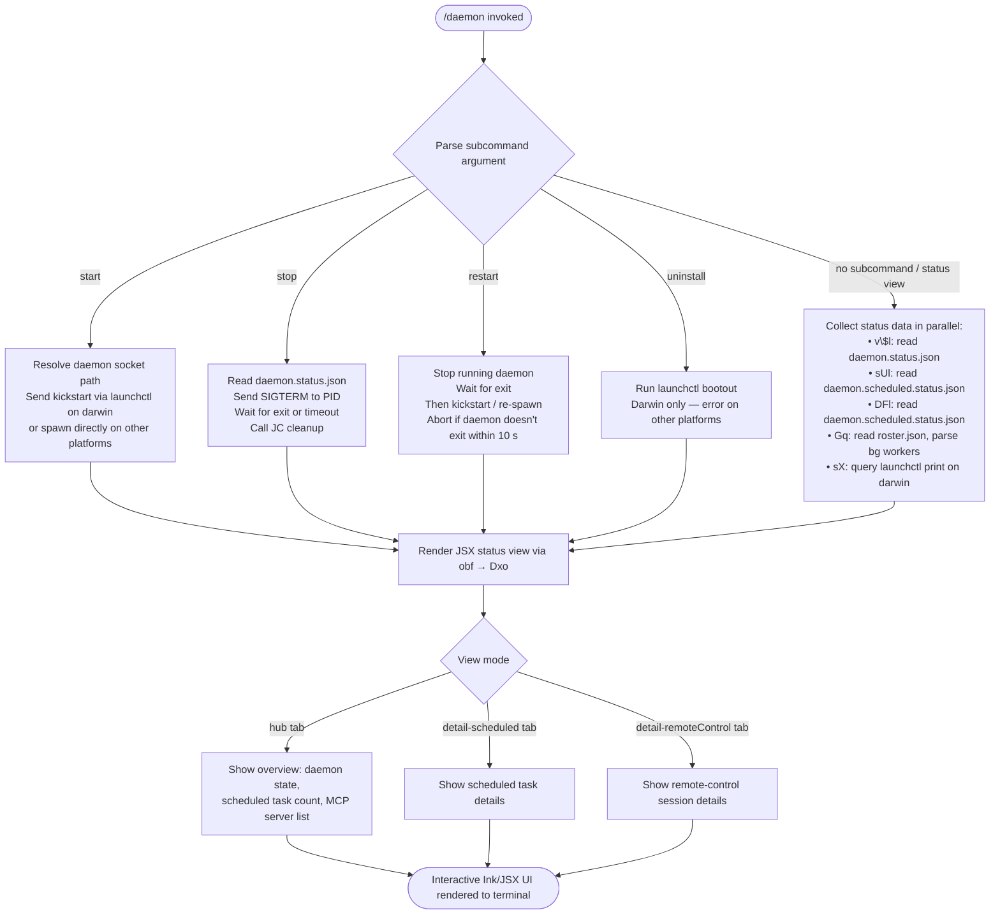

# `/daemon`

> Analysis basis: CC v2.1.190 bundle.js (AST extraction + Claude interpretation)
> Minimum version: v2.1.190

---

## Overview

The `/daemon` command provides a management interface for Claude Code's background daemon service and associated routines. It renders an interactive JSX UI that displays the current daemon status (including scheduled tasks and remote-control sessions), and exposes subcommand operations such as `start`, `stop`, `restart`, `uninstall`, and lifecycle inspection. The command executes immediately upon invocation (`immediate: true`) and communicates with the daemon process through a Unix-socket control protocol, reading and writing several JSON status files on disk.

---

## Registration

| Field | Value |
|---|---|
| type | `local-jsx` |
| name | `daemon` |
| description | `Manage background services and routines` |
| loc_byte | `12983448` |
| loc_byte_end | `12983616` |
| loc_line | `8818` |
| immediate | `true` |
| module_id | `Pxo` |
| load_inline | `true` |
| arbor_handler.name | `obf` |
| arbor_handler.fqn | `claude-2.1.190::obf` |
| arbor_handler.kind | `AsyncFunction` |
| arbor_handler.resolution_path | `module_id` (Arbor followed `module_id` → `Pxo` → module exports → `obf`) |
| arbor_handler.n_hits | `0` |

Analysis basis: CC v2.1.190 bundle.js:+12983448

---

## Input Branching

The command presents more than three distinct execution paths depending on the subcommand argument and daemon state, so a Mermaid flowchart is used.



Analysis basis: CC v2.1.190 bundle.js:+12982502 (top-level handler `pbf`), +12973295 (JSX entry `obf`), +12973858 (`uninstall` literal), +11509379 (`start`), +11509415 (`stop`), +11509455 (`restart`)

---

## Behavioral Spec

### Top-level Handler (`obf` / `pbf`)

`obf` is the primary async handler resolved by Arbor (resolution path: `module_id → Pxo`). It orchestrates the full command lifecycle.

```
async function daemonCommandHandler(args, context):
    // Phase 1: Parallel data collection
    results = await collectDaemonStatus()      // → statusCollector (Mxo)

    // Phase 2: Render interactive UI
    inkInstance = render(<DaemonStatusView results={results} />)

    // Phase 3: Mount UI component
    component = jsx(DaemonStatusView, props)
    inkInstance.render(component)

    // Phase 4: Unmount when done
    inkInstance.unmount()
```

Analysis basis: CC v2.1.190 bundle.js:+12973295 (`obf → Mxo`), +12973308 (`obf → kc.jsx`), +12982894 (`i.render`), +12983046 (`i.unmount`)

---

### Status Collection (`Mxo` — `statusCollector`)

`Mxo` runs multiple sub-collectors in parallel via `Promise.all` and aggregates results into a unified status object.

```
async function statusCollector():
    [daemonRunStatus, scheduledStatus, bgWorkerRoster, launchctlInfo] =
        await Promise.all([
            readDaemonStatus(),           // v$l
            readScheduledDaemonStatus(),  // sUl + DFl
            readBgWorkerRoster(),         // Gq
            queryLaunchctl(),             // sX  (darwin only)
        ])

    return {
        daemonRunStatus,
        scheduledStatus,
        bgWorkerRoster,
        launchctlInfo,
        keys: Object.keys(daemonRunStatus ?? {}),
    }
```

Analysis basis: CC v2.1.190 bundle.js:+12972854 (`Mxo → gMe`), +12972882 (`Promise.all`), +12972895 (`v$l`), +12972928 (`sUl`), +12972950 (`DFl`), +12972972 (`Gq`), +12972990 (`sX`)

---

### Daemon Status File Reader (`v$l` — `readDaemonStatus`)

Reads the primary `daemon.status.json` file and spawns per-PID kill checks.

```
async function readDaemonStatus():
    statusPath = buildStatusPath()     // → nVt: joins path with "daemon.status.json"
    data       = await readStatusFile(statusPath)   // → Ygt
    logReader  = await ke(...)         // set up log reader with circular buffer
    pidStopper = await processKillHelper(...)  // V0: reads PID file, sends process.kill

    return { data, logReader, pidStopper }
```

Key literal: `"daemon.status.json"` (bundle.js:+12785999)

Analysis basis: CC v2.1.190 bundle.js:+12967680 (`v$l → Promise.all`), +12967693 (`Ygt`), +12967711 (`ke`), +12967722 (`V0`)

---

### Status File Parser (`Ygt` — `statusFileParser`)

Reads a status JSON file from disk and validates its schema.

```
async function statusFileParser(filePath):
    rawJson = await readAndParseFile(filePath)    // DRo
    entries = validateAndFilterEntries(rawJson)   // cxo: Array.isArray check
    hooks   = extractHooks(entries)               // axo
    result.push(entries)                          // r.push
    return result
```

Inside `DRo` (raw file reader):
```
async function rawFileReader(filePath):
    stat = await fs.stat(filePath)
    if not stat.isFile():
        throw new Error(...)
    if stat.size > 1048576:          // 1 MiB guard (bundle.js:+12786819)
        throw new Error(...)
    content = await fs.readFile(filePath, "utf8")   // literal: "utf8" (+12786938)
    trimmed = content.trim()
    return JSON.parse(trimmed)
```

Analysis basis: CC v2.1.190 bundle.js:+12880478 (`Ygt → DRo`), +12786761 (`DRo → H6`), +12786784 (`eXn.stat`), +12786819 (1 MiB literal), +12786923 (`eXn.readFile`)

---

### PID-file Stopper (`V0` — `pidFileStopper`)

Reads the daemon's PID from a lock file, sends a signal, and cleans up.

```
async function pidFileStopper(pidFilePath, options):
    stat = await fs.lstat(pidFilePath)
    if stat.isFile():
        if options.remove:
            await fs.rm(pidFilePath, { force: true, maxRetries: 65536 })  // +11505442
        raw = await fs.readFile(pidFilePath)
        pid = decodeAndParse(raw)       // kn + Sa
        process.kill(pid, signal)       // +11506476

    logLines = await readLogTail(pidFilePath)  // WIo
    logTail  = logLines.split(...).slice(-4)   // literal: 4 at +11506394

    await spawnNewProcess(...)          // JC
```

Relevant literals:
- `"claude daemon"` — process title used when scanning running processes (bundle.js:+11506367)
- `"daemon"` — short name (bundle.js:+11506406)
- `"daemon.json"` — config file name (bundle.js:+11506942)

Analysis basis: CC v2.1.190 bundle.js:+11506448 (`V0 → fMe`), +11506476 (`process.kill`), +11506526 (`WIo`)

---

### Scheduled Daemon Status Reader (`sUl` — `scheduledStatusReader`)

Reads `daemon.scheduled.status.json` and handles PID lifecycle.

```
async function scheduledStatusReader():
    context = await getContextStore()     // Xs → KFu.getStore
    path    = buildPath("daemon.scheduled.status.json")   // nVt (+12878985)
    content = await readAndDecode(path)   // Sa
    process.kill(pid, ...)               // +12786482
    await spawnProcess(...)              // JC (+12786617)
```

Literal: `"daemon.scheduled.status.json"` (bundle.js:+12878985)

Analysis basis: CC v2.1.190 bundle.js:+12786285 (`sUl → Xs`), +12786295 (`nVt`), +12786326 (`Sa`), +12786482 (`process.kill`)

---

### Background Worker Roster Reader (`Gq` — `bgWorkerRosterReader`)

Reads and validates `roster.json`, which tracks background worker processes.

```
async function bgWorkerRosterReader():
    stat = await fs.lstat(rosterPath)
    if not stat.isFile():
        logWarning("is not a regular file — removing")   // literal +11517869
        emit(telemetry: "tengu_bg_roster_parse_failed")  // +11517915
        await fs.rm(rosterPath)
        return

    raw     = await fs.readFile(rosterPath)     // +11518152
    decoded = decode(raw)                        // kn
    parsed  = jsonParse(decoded)                 // Gt → JSON.parse
    entries = validateEntries(parsed)            // Jd + dK
    schema  = inspectSchema(entries)             // fHl: Array.isArray + Object.keys

    for entry in entries:
        processEntry(entry)          // kJt → Jd, dK, Ng
        if Ctf.has(entry.type):
            str = String(entry.value)
            applyFlag(str)           // Fo → aKe

    // Handle error codes E2BIG and EFTYPE
    // literals at +11517995, +11518007
```

Literal: `"roster.json"` (bundle.js:+11513693)

Analysis basis: CC v2.1.190 bundle.js:+11517722 (`Gq → hue.lstat`), +11517732 (`fne`), +11517915 (`tengu_bg_roster_parse_failed`), +11518152 (`hue.readFile`), +11518806 (`Ctf.has`)

---

### LaunchCtl Query (`sX` — `launchctlQuerier`, darwin only)

Queries the macOS service manager to determine the daemon's registered service state.

```
async function launchctlQuerier():
    serviceLabel = buildServiceLabel()   // Un
    uid          = getProcessUID()       // UKn → tHl → process.getuid (+11507326)
    domain       = "gui/" + uid          // library path: Library/LaunchAgents (+11507267)

    output = await spawnCommand(
        "launchctl",                     // literal +11510530
        ["print", domain + "/" + label], // literal "print" +11510543
        { timeout: 5000 }                // literal +11510577
    )
    return parseOutput(output)
```

Analysis basis: CC v2.1.190 bundle.js:+11510527 (`sX → Un`), +11510551 (`UKn`), +11507243 (`VIo.homedir`), +11507326 (`process.getuid`)

---

### Subcommand Lifecycle Operations (`jIo` — `daemonLifecycleOps`)

Handles `start`, `stop`, `restart`, `uninstall` subcommands dispatched from the UI.

```
async function daemonLifecycleOps(subcommand):
    match subcommand:
        case "start":
            await bootDaemon()            // kickstart via launchctl on darwin (+11509390)
        case "stop":
            await haltDaemon(SIGTERM)     // SIGTERM then wait
        case "restart":
            await haltDaemon(SIGTERM)
            await waitForExit(50 polls)   // 50 × 200 ms = 10 s (+11509683)
            if not exited:
                abort("daemon did not exit within 10s...")  // literal +11509712
            await bootDaemon()
        case "uninstall":
            if platform == "darwin":
                await launchctl("bootout", ...)  // literal +11509028
            else:
                throw Error("service uninstall not available on darwin")  // +11509159
                // Note: message text implies darwin-specific guard
```

Key literals:
- `"kickstart"` — launchctl verb for starting (bundle.js:+11509390)
- `"bootout"` — launchctl verb for uninstalling (bundle.js:+11509028)
- `"darwin"` — platform guard (bundle.js:+11510038)
- `50` — max poll count before restart abort (bundle.js:+11509683)

Analysis basis: CC v2.1.190 bundle.js:+11509379, +11509415, +11509455, +11509683, +11509712

---

### JSX Status View Component (`Dxo` — `DaemonStatusViewComponent`)

The React/Ink component rendered to the terminal.

```
function DaemonStatusViewComponent(props):
    [viewState, setViewState] = useState()      // nV.useState +12973427
    clockContext = useClockContext()             // Ts → hRi.useContext +12973444
    startTime    = Date.now()                   // +12973476
    perfNow      = performance.now()            // s.now +12973493

    daemonStatus = props.statusData             // Mxo result
    viewRef      = useRef()                     // nV.useRef +12973687
    timer        = useThrottledTimer()          // zc

    // Tabs available
    tabs = ["hub", "detail-scheduled", "detail-remoteControl", "new"]
    // literals: +12973554, +12974047, +12974187, +12974127

    // Render main sections
    switch currentTab:
        case "hub":
            render(<DaemonHubView ... />)
        case "detail-scheduled":
            render(<ScheduledView label="Scheduled" />)   // literal +12974577
        case "detail-remoteControl":
            render(<RemoteControlView label="Remote Control" />)  // literal +12974863
        default:
            render(<DaemonOverview label="Claude daemon" />)  // literal +12975137

    // Permission display
    renderPermissionStatus(type="permission")  // literal +12975225

    // Exit handler
    onExit():
        jb()                  // graceful cleanup
        process.exit(...)
        abortController.abort()
```

Analysis basis: CC v2.1.190 bundle.js:+12973427, +12973444, +12973554, +12974073, +12974342, +12975269

---

### Daemon Control Protocol / Supervisor (`RJf` — `supervisorProtocolHandler`)

The lower-level IPC handler for the daemon's Unix-socket control protocol. It processes typed message frames dispatched to/from background worker jobs.

```
async function supervisorProtocolHandler(connection, daemonHub):
    // Authentication
    if not connection.hasControlKey:
        if connection.peerUid matches:
            allow("legacy client — no control key")   // +17187060
        else:
            reject("dispatch rejected: this client didn't present...")  // +17185117

    // Message dispatch loop
    for message in connection.messages:
        switch message.type:
            case "ping":       handlePing()
            case "nudge":      handleNudge()
            case "yield":      handleYield()
            case "lease":      handleLease()
            case "leases":     handleLeases()
            case "shutdown":   handleShutdown()
            case "dispatch":   handleDispatch()
            case "reply":      handleReply()
            case "exec":       handleExec()
            case "kill":       handleKill()
            case "respawn-stale": handleRespawnStale()
            case "resize":     handleResize()
            case "attach":     handleAttach()
            case "ensure-spare": handleEnsureSpare()
            case "permission-response": handlePermissionResponse()
            case "snapshot":   handleSnapshot()
            case "stream":     handleStream()
            case "state":      handleState()
            case "subscribe":  handleSubscribe()
            case "list":       handleList()
            case "has":        handleHas()
```

Key error codes surfaced in protocol:
- `ETOOLARGE` — payload too large (bundle.js:+17180547)
- `ESTARTING` — worker not yet ready (bundle.js:+17183756)
- `EPROTO` — protocol error (bundle.js:+17184057)
- `EAUTH` — control-key mismatch (bundle.js:+17185193)
- `ENOJOB` — job not found (bundle.js:+17185966)
- `ENOREPLY` — job not accepting replies (bundle.js:+17186107)
- `EUNVERIFIED` — worker identity unverifiable (bundle.js:+17187684)
- `ERESPAWNING` — worker is restarting (bundle.js:+17187778)
- `ESTALE` — stale reference (bundle.js:+17182194)
- `ETIMEOUT` — operation timed out (bundle.js:+17182285)
- `EUNKNOWN` — unknown error (bundle.js:+17182407)

Timing constants:
- `30000` ms — dispatch timeout (bundle.js:+17181515)
- `25` — maximum concurrent pending dispatches (bundle.js:+17181795)

Analysis basis: CC v2.1.190 bundle.js:+17182502 (`RJf` body), +17185307 (`"dispatch"`), +17186375 (`"kill"`), +17189413 (`tengu_bg_attach`)

---

### Background Worker Lifecycle Loop (`L` — `bgWorkerSweepLoop`)

Periodic sweep that manages prewarm workers, memory pressure, and idle retirement.

```
async function bgWorkerSweepLoop():
    while true:
        now = Date.now()
        workers = collectWorkers()

        // Memory pressure: shed non-pinned, then pinned if needed
        if lowMemoryPersists():
            log("bg: low memory persists after shedding non-pinned...")  // +17202807
            emit(telemetry: "tengu_bg_retire_pinned_low_mem")            // +17202918
            for worker in pinnedSettledWorkers:
                worker.retireIfSettled()

        // Prewarm: maintain up to 12 spare workers
        prewarmCount = 12   // literal +17203073
        if spareCount < prewarmCount:
            emit(telemetry: "tengu_bg_prewarm_per_sweep")  // +17203039
            spawnSpareWorker("prewarm")    // literal +17203643

        // Advance grace clocks
        for worker in workers:
            worker.shiftGraceClocksForward()
            if worker.respawnIfIdleStale():
                continue
            worker.retireIfSettled()

        await sleep(sweepInterval)
```

Analysis basis: CC v2.1.190 bundle.js:+17202304 (`L → Date.now`), +17202363 (`shiftGraceClocksForward`), +17202534 (`respawnIfIdleStale`), +17202625 (`retireIfSettled`), +17203039 (`tengu_bg_prewarm_per_sweep`), +17203073 (literal `12`)

---

### MCP Server Integration (`d9e` — `mcpServerOrchestrator`)

Manages MCP (Model Context Protocol) server connections referenced by the daemon.

```
async function mcpServerOrchestrator(mcpConfig):
    entries = Object.entries(mcpConfig)

    for [name, serverConfig] in entries:
        // Skip disabled servers
        if serverConfig.status == "disabled":    // literal +6869091
            continue

        // Route by transport type
        switch serverConfig.transport:
            case "stdio":        connectStdio(serverConfig)   // +6869193
            case "sse":          connectSSE(serverConfig)
            case "http":         connectHTTP(serverConfig)
            case "sse-ide":      connectSSEIde(serverConfig)  // +6869292
            case "ws-ide":       connectWSIde(serverConfig)   // +6869328
            case "claudeai-proxy": connectProxy(serverConfig) // +6869600

        // Check auth cache
        if needsAuthCache.has(name):
            log("Skipping connection (cached needs-auth)")   // +6869786
            continue

        // Check failure cache (15 min retry window)
        if failureCache.has(name):
            log("Skipping connection (recent failure cached; retries in 15 min...)")  // +6870039
            continue

    // After all connections resolved
    updateConnectionState("connected")   // literal +6870223
    emitSkills(telemetry: "tengu_mcp_skills")  // +6653418
```

Auth cache file: `"mcp-needs-auth-cache.json"` (bundle.js:+6859207)

Analysis basis: CC v2.1.190 bundle.js:+6868993, +6869091, +6869193, +6869786, +6870039, +6870223

---

## State & Side Effects

| Item | Detail |
|---|---|
| Telemetry: `tengu_bg_roster_parse_failed` | Fired when `roster.json` fails validation (bundle.js:+11517915) |
| Telemetry: `tengu_daemon_config_reload` | Fired when the daemon reloads its configuration (bundle.js:+17214348) |
| Telemetry: `tengu_daemon_yield` | Fired when daemon yields to a foreground service (bundle.js:+17218760); message: `"yielding to a foreground/service daemon — bg workers will be re-adopted"` (+17218678) |
| Telemetry: `tengu_mcp_skills` | Fired after MCP server connections are established (bundle.js:+6653418) |
| Telemetry: `tengu_config_auth_loss_prevented` | Guards against accidentally overwriting auth credentials during config save (bundle.js:+13748929); see GH #3117 |
| Telemetry: `tengu_bg_retire_pinned_low_mem` | Low-memory condition forced pinned worker retirement (bundle.js:+17202918) |
| Telemetry: `tengu_bg_prewarm_per_sweep` | Spare prewarm worker spawned in sweep (bundle.js:+17203039) |
| Telemetry: `tengu_feature_ok` / `tengu_feature_bad` | Feature flag evaluation outcomes (bundle.js:+1025122, +1025189) |
| Telemetry: `tengu_daemon_control` | Daemon control operation recorded (bundle.js:+17235957); includes `daemon_stop` (+17235882) and `daemon_stop_failed` (+17235919) |
| Telemetry: `tengu_amber_anchor` | Background session anchor event (bundle.js:+3350237) |
| Telemetry: `tengu_bg_proto_mismatch` | Protocol version mismatch between worker and supervisor (bundle.js:+17183851) |
| Telemetry: `tengu_bg_dispatch_stale_drop` | Stale dispatch dropped by supervisor (bundle.js:+17185250) |
| Telemetry: `tengu_bg_state_read_transient` | Transient state read from background worker (bundle.js:+4300026) |
| Telemetry: `tengu_bg_attach_legacy_autorespawn` | Legacy worker auto-respawned during attach (bundle.js:+17188154) |
| Telemetry: `tengu_bg_attach_upgrade` | Worker upgraded during attach (bundle.js:+13055158) |
| Telemetry: `tengu_bg_attach` | Session attach event (bundle.js:+17189413) |
| Telemetry: `tengu_bg_attach_stall_ms` | Milliseconds spent stalled during attach (bundle.js:+17179045) |
| Telemetry: `tengu_bg_attach_stall_gave_up` | Attach abandoned after stall (bundle.js:+17190343) |
| Telemetry: `tengu_bg_attach_stall_respawn` | Stalled worker respawned during attach (bundle.js:+17190613) |
| Telemetry: `tengu_bg_attach_kick` | Kicked a session open in another window (bundle.js:+17191610) |
| Telemetry: `tengu_daemon_idle_exit` | Daemon exited due to idle timeout (bundle.js:+17219790) |
| Files read | `daemon.status.json`, `daemon.scheduled.status.json`, `daemon.json`, `roster.json`, `mcp-needs-auth-cache.json` |
| Files mutated | PID lock file (removed on stop/cleanup via `fMe → AP.rm`); roster file (removed if invalid via `hue.rm`) |
| Platform-specific side effects | `launchctl print`, `launchctl kickstart`, `launchctl bootout` invoked on `darwin` only |
| Process signals sent | `SIGTERM` (stop/restart), `SIGKILL` (stall recovery at +17190548) |
| UI rendering | Ink JSX rendered to stdout; unmounted on exit |
| Background sweep interval | Configurable; sweep maintains up to 12 prewarm spare workers |
| Spawn interval jitter | Random delay in range `[0, 2]` applied (literal `2` at +14095068; `Math.random` + `setTimeout`) |

---

## Version History

| Version | Change |
|---|---|
| v2.1.190 | Initial analysis |

---

## Common Mistakes

1. **Invoking subcommands on non-darwin platforms**: `uninstall` is guarded behind a darwin check; running it on Linux will produce an error ("service uninstall not available on darwin"). The `launchctl`-based `start`/`stop`/`restart` path is similarly darwin-specific.
2. **Expecting immediate process termination on `stop`**: The stop flow sends `SIGTERM` and polls up to 50 × 200 ms (10 seconds) before giving up. If the daemon does not respond within that window, `restart` will abort rather than force-kill.
3. **Editing status JSON files manually**: `daemon.status.json` and `roster.json` are validated on read (file must be a regular file, ≤ 1 MiB, valid UTF-8 JSON). Malformed or non-file entries will be removed automatically with a telemetry event fired.
4. **Assuming MCP connections retry immediately after failure**: Failed connections are cached for approximately 15 minutes. To force a retry before that window expires, edit the plugin configuration, which invalidates the cache entry.
5. **Confusing the 12-worker prewarm limit with a hard cap**: The sweep loop aims to maintain 12 spare prewarm workers, but under memory pressure the loop will retire pinned workers regardless and emit `tengu_bg_retire_pinned_low_mem`.

---

## Appendix — Identifier Mapping

> For bundle debugging only. Identifiers change across versions.

| Identifier | Role |
|---|---|
| `pbf` | Top-level command entry function (async, renders Ink UI) |
| `obf` | Primary async handler resolved by Arbor; JSX render entry |
| `Mxo` | Status collector — runs sub-readers in parallel via `Promise.all` |
| `v$l` | Daemon run-status reader (reads `daemon.status.json`) |
| `Ygt` | Status file parser — dispatches to raw file reader and validates |
| `DRo` | Raw file reader — `fs.stat` + size guard + `fs.readFile` + `JSON.parse` |
| `cxo` | Entry validator — `Array.isArray` check on parsed JSON |
| `axo` | Hook extractor from parsed status entries |
| `ke` | Log reader / circular buffer manager |
| `fo` | Error factory (wraps `String` conversion) |
| `nt` | String normalizer |
| `Vi` | Essential-traffic router |
| `oou` | Circular buffer queue manager (`vrn.shift` / `vrn.push`) |
| `V0` | PID-file stopper — reads PID, sends signal, cleans up |
| `fMe` | PID file handler — `lstat`, optional `rm`, `readFile`, decode |
| `WIo` | Log tail reader — reads file, splits lines, slices last N |
| `JC` | Process spawner (calls `fU`) |
| `E$l` | Scheduled status orchestrator |
| `rqe` | Scheduled status file reader with context store lookup |
| `cn` | Error code checker / ENOENT handler |
| `Xs` | Context store accessor (`KFu.getStore`) |
| `kxo` | Path builder helper (`Lxo`) |
| `be` | String converter (wraps `String()`) |
| `H6` | Daemon config path builder (`qIo.join` + `or`) |
| `sUl` | Scheduled daemon status reader (reads `daemon.scheduled.status.json`) |
| `nVt` | Path joiner for status files (`nUl.join`) |
| `DFl` | Scheduled daemon status reader variant (reads same file, different code path) |
| `MFl` | Path builder for scheduled status (`RFl.join`) |
| `Gq` | Background worker roster reader (reads `roster.json`) |
| `fne` | Roster file path builder (`Yh.join + Aye`) |
| `Aye` | Base path builder (`Yh.join + or`) |
| `W` | Generic utility / watcher |
| `Ve` | Value applicator (`aKe`) |
| `aKe` | Core application helper |
| `VKn` | Roster rename handler — archives stale roster with timestamp |
| `a8t` | Timestamp helper (`Date.now`) |
| `Gt` | JSON parser wrapper (`JSON.parse`) |
| `kn` | Content decoder / text decoder |
| `Jd` | Entry field extractor |
| `dK` | Entry type discriminator |
| `fHl` | Schema inspector (`Array.isArray + Object.keys`) |
| `kJt` | Entry processor (`Jd + dK + Ng`) |
| `Ng` | Nested applicator (`aKe`) |
| `Fo` | Flag applicator (`aKe`) |
| `sX` | LaunchCtl querier (darwin only) |
| `Un` | Service label builder |
| `Wr` | Worker spawner / process wrapper |
| `Pt` | Process tracker (`Mrn + gr`) |
| `UKn` | UID resolver |
| `tHl` | `process.getuid()` wrapper |
| `M$l` | MCP server panel component |
| `rot` | Panel router / tab switcher |
| `YOt` | Tab container component |
| `KOd` | Model selector component |
| `T` | Locale / string formatter |
| `zOd` | Model option renderer |
| `T5i` | Model list component |
| `Eo` | Profile type resolver |
| `Kg` | Key-value getter |
| `Qo` | Model name normalizer (trim, toLowerCase, match) |
| `a` | MCP state manager / connection orchestrator wrapper |
| `d9e` | MCP server orchestrator |
| `RB` | MCP registry builder |
| `Ust` | MCP entry applicator |
| `E7` | MCP connection manager |
| `K4` | MCP plugin entry builder |
| `CRn` | MCP error colorizer (red/yellow) |
| `Pst` | MCP server state tracker |
| `aF` | Object prototype creator |
| `d` | Supervisor config updater |
| `Qw` | Change queue processor |
| `eh` | Change event handler |
| `zn` | State diffuser |
| `Hua` | Auth cache reader |
| `dZr` | Auth cache file reader |
| `PLe` | Config hash computer (`Hsa.createHash sha256`) |
| `myn` | Config serializer (`Dse + Object.keys`) |
| `hyn` | Hash helper (`myn + wT`) |
| `wT` | Hash builder (`Nli.createHash`) |
| `fyn` | Checksum finalizer (`Gl`) |
| `Gl` | Hash digester (`vWs`) |
| `ln` | MCP debug logger (`YJ.logMCPDebug`) |
| `zRn` | MCP connection runner |
| `wr` | MCP wire protocol |
| `aKd` | MCP connection driver (OAuth, tool registration) |
| `lKd` | MCP OAuth callback handler |
| `BUt` | Connection result applicator |
| `tMn` | Connection path builder |
| `Me` | JSON stringifier wrapper |
| `gJr` | MCP request/response logger |
| `m` | Worker kill dispatcher |
| `n` | Name normalizer (toLowerCase) |
| `x` | Writer / channel |
| `eL` | MCP skills emitter |
| `it` | Skills registry accessor |
| `tJr` | Transport type router |
| `hn` | Global config writer / saver |
| `w` | Clock/timer object |
| `ij` | Timer state (`blurred`/`focused`) |
| `L` | Background worker sweep loop |
| `v` | Value accessor |
| `ycc` | Away-summary builder |
| `Ecc` | Event classifier |
| `Vc` | MCP error logger (`YJ.logMCPError`) |
| `Aua` | MCP parameter parser |
| `ZW` | Async mapper / parallel executor |
| `yit` | Integer parser (port/PID) |
| `nMn` | Integer parser variant |
| `brr` | Connection result applicator |
| `u9e` | Config hash checker |
| `zT` | Cleanup orchestrator |
| `Hit` | Cleanup helper (`PLe` + `o.cleanup`) |
| `_la` | Retry query runner (`rQr`) |
| `rQr` | Retry query implementation |
| `s` | Pending-set tracker |
| `l` | Lease manager (`rUl`) |
| `rUl` | Lease writer (`AQ + Date.now + Xs + nVt + Me`) |
| `AQ` | Lease path resolver (`Ofe`) |
| `fBo` | MCP client filter / re-connection manager |
| `xRn` | Client capability checker |
| `Kn` | Timeout-with-abort helper |
| `c` | Connection channel |
| `Dxo` | Daemon status view React/Ink component |
| `Ts` | Clock context accessor (`hRi.useContext`) |
| `zc` | Throttled timer hook (`WW.useRef + useContext + useMemo`) |
| `u` | Session lifecycle / exit handler |
| `Le` | Graceful stop handler |
| `Pe` | Force stop handler |
| `Re` | Hard stop fallback |
| `CU` | Session UUID generator |
| `q9` | UUID seed helper (`M2`) |
| `m$e` | UUID format helper (`xw`) |
| `aBr` | Session emitter (`sBr.randomUUID + yZe + yW + e.emit`) |
| `X6` | Exit-race coordinator (`Promise.race + Promise.all`) |
| `Ume` | Shutdown initiator (`Nme.shutdown`) |
| `zme` | Timeout clearer on exit (`clearTimeout + VOo`) |
| `H` | Byte-stream reader (`Buffer.concat + indexOf`) |
| `g` | Stream source |
| `mp` | Stream endpoint (`e.end + Me`) |
| `RJf` | Supervisor protocol handler (full IPC message loop) |
| `xJf` | Protocol frame validator |
| `v_` | Frame dispatcher (`QIe`) |
| `QIe` | Skills frame handler (`it`) |
| `x3o` | Connection slot lookup |
| `bEc` | Dispatch timeout manager |
| `Xte` | HMAC/timing-safe-equal authenticator |
| `y` | Repaint coordinator (`G5e`) |
| `G5e` | Terminal repaint logic |
| `Di` | Worker state file reader |
| `ec` | Worker directory resolver |
| `Vk` | Worker path builder |
| `coe` | File scanner / link traverser |
| `VS` | Realpath resolver |
| `Wy` | Path pattern tester |
| `s2` | Base path resolver |
| `Ew` | Directory reader |
| `Wou` | File line scanner |
| `WXn` | Attach upgrade handler (`it`) |
| `LJf` | Layout dimension calculator (`Math.max`) |
| `M` | Write scheduler (`clearTimeout + c.write`) |
| `P` | Periodic ping sender |
| `rue` | Stall detection / restart trigger |
| `kJf` | Worker kill / cleanup on attach stall |
| `J` | Input event dispatcher |
| `_` | Session initializer (`nyt + VD + Ox + R7 + SB`) |
| `j` | Delayed action scheduler |
| `z` | Keyboard input handler (`K.preventDefault`) |
| `X` | Event bus |
| `F` | Interval clearer |
| `E` | Error event queue |
| `nyt` | Session state initializer (`yyc`) |
| `N` | Connection state tracker |
| `U` | Output throttle / rate limiter |
| `q` | Response accumulator |
| `DJf` | Output sanitizer (replace / includes) |
| `K` | Socket cleanup (`fMe + Jgl`) |
| `Jgl` | Socket file unlinker (`AP.unlink + due + kn`) |
| `H7t` | Stream destroyer |
| `sht` | Darwin socket setup (`zIo + Un + UKn + oX.unlink + kn + be`) |
| `zIo` | Socket path builder (`t8t.join + VIo.homedir`) |
| `r8t` | Socket reconnect handler |
| `jIo` | Socket kickstart loop (`UKn + Un + eHl.setTimeout`) |
| `gr` | UI framework initializer (`VL`) |
| `VL` | Core render library entry |
| `A` | Scroll/clamp helper (`Math.max + Math.min`) |
| `p` | Process exit orchestrator (`jb + process.exit + u.abort`) |
| `jb` | Pre-exit cleanup |

---

Note: index built via Arbor fallback; some signals (telemetry, literals) may be missing — see arbor-fallback.js.