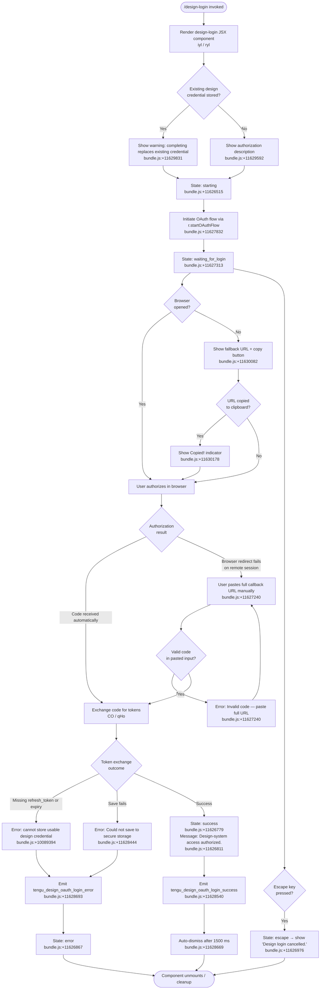

# `/design-login`

> Analysis basis: CC v2.1.190 bundle.js (AST extraction + Claude interpretation)
> Minimum version: v2.1.190

---

## Overview

`/design-login` opens an interactive OAuth authorization flow that grants Claude Code access to the Anthropic design system (`claude.ai/design`). The command renders a JSX component (`iyl`) that guides the user through browser-based login, manual code entry, or clipboard-assisted URL copy, then persists the resulting OAuth credential for use by `/design-sync`. This authentication is entirely separate from the main session's Anthropic API credentials and affects no other settings.

---

## Registration

| Field | Value |
|---|---|
| type | `local-jsx` |
| name | `design-login` |
| description | `Authorize design-system access for /design-sync with your claude.ai account` |
| module_id | `oyl` |
| load_inline | `true` |
| loc_byte | `11632757` |
| loc_byte_end | `11632956` |
| loc_line | `7767` |
| arbor_handler.name | `iyl` |
| arbor_handler.fqn | `claude-2.1.190::iyl` |
| arbor_handler.kind | `Function` |
| arbor_handler.resolution_path | `direct` |
| arbor_handler.n_hits | `1` |

Analysis basis: CC v2.1.190 bundle.js:+11632757

---

## Input Branching

The command's interactive component moves through more than three distinct states driven by user input and OAuth results. A Mermaid flowchart is used below.



---

## Behavioral Spec

### Component Initialization

```
function designLoginComponent(props):
    [authState, setAuthState] = useState("starting")   // bundle.js:+11626515
    oauthRef = useRef()
    clockContext = getClockContext()       // Ts / useClock — bundle.js:+11626496
    terminalSize = getTerminalSize()       // Hr — bundle.js:+11626652

    maxWidth = Math.max(terminalSize.columns, 50)   // bundle.js:+11626716, +11626725

    useEffect(() -> initiateOAuthFlow(), [])
    return renderLoginUI(authState, maxWidth)
```

Analysis basis: CC v2.1.190 bundle.js:+11626496

---

### OAuth Flow Initiation

```
async function initiateOAuthFlow(oauthClient):
    // oauthClient = r (context-injected OAuth handle)
    if CLAUDE_CODE_DESIGN_OAUTH_CLIENT_ID is not configured:
        showError("The Claude Design OAuth client is not configured…")
        // bundle.js:+11627609
        return

    setAuthState("waiting_for_login")    // bundle.js:+11627313
    oauthFlow = await oauthClient.startOAuthFlow()   // bundle.js:+11627832

    // Schedule a process-level safety timeout (3000 ms)
    scheduleTimeout(3000)               // bundle.js:+11627934

    listenForCallbackOrManualEntry(oauthFlow)
```

Analysis basis: CC v2.1.190 bundle.js:+11627832

---

### Manual Auth Code Input

When the browser redirect fails (common in remote/SSH sessions), the component exposes a text input that accepts the full callback URL.

```
function handleManualAuthCodeInput(inputText):
    // r.handleManualAuthCodeInput — bundle.js:+11627437
    parsed = splitCallbackURL(inputText)   // I.split — bundle.js:+11627191

    if parsed does not contain a "code" query param:
        showFieldError("Invalid code. Please make sure the full code was copied")
        // bundle.js:+11627240
        emitTelemetry("tengu_design_oauth_manual_entry")  // bundle.js:+11627399
        return

    emitTelemetry("tengu_design_oauth_manual_entry")   // bundle.js:+11627399
    exchangeCodeForTokens(parsed.code, parsed.state)
```

Analysis basis: CC v2.1.190 bundle.js:+11627437

---

### Token Exchange and Credential Persistence

```
async function exchangeAndSaveTokens(code, state):
    // CO — bundle.js:+11628102
    response = await httpClient.post(tokenEndpoint, {
        grant_type: "refresh_token",     // bundle.js:+2143090
        code: code,
        ...
    }, {
        headers: { "Content-Type": "application/json" },  // bundle.js:+2143145
        timeout: 5000                   // bundle.js:+2143188 (ms)
    })

    if response is AxiosError:
        classify as "network" error     // bundle.js:+2143322
        setAuthState("error")
        emitTelemetry("tengu_design_oauth_login_error")
        return

    tokens = response.data

    // Validate token completeness — qHo / bundle.js:+11628166
    if tokens.refresh_token is missing OR tokens.expiry is missing:
        showError("The token response was missing a refresh token or expiry…")
        // bundle.js:+10089394
        setAuthState("error")
        emitTelemetry("tengu_design_oauth_login_error")
        return

    saveResult = await persistToSecureStorage(tokens)  // HGn — bundle.js:+11628335

    if saveResult is failure:
        showError("Failed to save design OAuth tokens")   // bundle.js:+10085920
        showError("Could not save the design credential to secure storage.")
        // bundle.js:+11628444
        setAuthState("error")
        emitTelemetry("tengu_design_oauth_login_error")   // bundle.js:+11628693
        return

    setAuthState("success")
    showMessage("Design-system access authorized.")   // bundle.js:+11626811
    emitTelemetry("tengu_design_oauth_login_success") // bundle.js:+11628540
    scheduleAutoDismiss(1500)         // bundle.js:+11628669
```

Analysis basis: CC v2.1.190 bundle.js:+11628102

---

### Clipboard / URL Copy Assistance

When the browser does not open automatically, the component renders the authorization URL with a copy button.

```
function renderFallbackURLPanel(authURL, copyState):
    // bundle.js:+11630082
    show("Browser didn't open? Use the url below to sign in")
    show(authURL)

    if copyState == "copied":
        show("(Copied!)")             // bundle.js:+11630178
    else:
        showButton("copy")            // bundle.js:+11630251
        onClick -> writeToClipboard(authURL) via sv clipboard helper
```

Analysis basis: CC v2.1.190 bundle.js:+11630082

---

### Escape / Cancellation

```
function handleKeyPress(key):
    if key == "escape":               // bundle.js:+11626887
        setAuthState("escape")
        showMessage("Design login cancelled.")  // bundle.js:+11626976
        scheduleCleanup()
        return

    if key == "return":               // bundle.js:+11627040
        submitCurrentInput()
```

Analysis basis: CC v2.1.190 bundle.js:+11626887

---

### MCP Connection Layer (Background)

The `ryl` / `a` sub-tree coordinates design-system MCP server connections invoked transitively from the auth flow. Key behaviors observed in the call graph:

```
function applyMCPConnectionResult(slot, result):
    // brr — bundle.js:+16700860
    if slot config changed mid-flight:
        log("applyConnectionResult: disposing orphaned connect (slot config changed mid-flight)")
        // bundle.js:+16701278
        dispose(result)
        return

    if slot removed mid-flight:
        log("applyConnectionResult: disposing orphaned connect (slot removed mid-flight)")
        // bundle.js:+16701363
        dispose(result)
        return

    applyUpdate(result)    // e.applyMcpUpdate — bundle.js:+16701144
    cleanup(previous)      // n.cleanup — bundle.js:+16701449
```

A "needs-auth" cache (`mcp-needs-auth-cache.json`, bundle.js:+6859207) is consulted before each MCP connection attempt; servers with a cached auth-needed status are skipped until the design-login flow completes successfully (`bundle.js:+6869786`).

Connection failures are rate-limited: a recent failure suppresses reconnection for 15 minutes before automatic retry (`bundle.js:+6870039`).

Analysis basis: CC v2.1.190 bundle.js:+16701144

---

### Clipboard Helper (sv)

```
function writeToSystemClipboard(text):
    // sv — bundle.js:+11629062
    platform = detectPlatform()

    switch platform:
        case "macos": spawn("pbcopy")          // bundle.js:+3548542
        case "linux" with Wayland: spawn("wl-copy")  // bundle.js:+3547304
        case "linux" with X11:
            try("xclip")                       // bundle.js:+3547372
            fallback("xsel")                   // bundle.js:+3547412
        case "windows": spawn("powershell.exe", ["-NoProfile", "-NonInteractive",
                              "-Command", ...])  // bundle.js:+3548939
        case "tmux": use tmux load-buffer      // bundle.js:+3547797
        case terminal supports OSC 52: use OSC 52 escape // bundle.js:+3547187
```

Analysis basis: CC v2.1.190 bundle.js:+3548542

---

## State & Side Effects

| Item | Detail |
|---|---|
| Telemetry: `tengu_design_oauth_manual_entry` | Fired when the user submits a manually pasted callback URL (bundle.js:+11627399) |
| Telemetry: `tengu_design_oauth_login_success` | Fired on successful token storage (bundle.js:+11628540) |
| Telemetry: `tengu_design_oauth_login_error` | Fired on any token exchange or storage failure (bundle.js:+11628693) |
| Telemetry: `tengu_mcp_skills` | Fired by the MCP skill loader invoked transitively (bundle.js:+6653418) |
| Telemetry: `tengu_config_auth_loss_prevented` | Fired if a config write would have clobbered existing auth (bundle.js:+13748929) |
| Telemetry: `tengu_daemon_config_reload` | Fired when daemon reloads config after credential change (bundle.js:+17214348) |
| Telemetry: `tengu_feature_ok` / `tengu_feature_bad` / `tengu_feature_sad` | Feature-flag check outcomes (bundle.js:+1025122, +1025189, +1025270) |
| Credential storage | OAuth tokens (including `refresh_token` and expiry) are persisted to secure storage via `HGn` (bundle.js:+11628335). An existing design credential is replaced. |
| MCP needs-auth cache | `mcp-needs-auth-cache.json` is read before MCP connections and cleared/updated upon success (bundle.js:+6859207) |
| Auto-dismiss | Component unmounts automatically 1500 ms after a success result (bundle.js:+11628669) |
| Timeout (process-level safety) | A 3000 ms safety timeout is scheduled at flow start (bundle.js:+11627934) |
| Clipboard write | Writes the OAuth authorization URL to the system clipboard when the user taps the copy button (bundle.js:+3548542) |
| appState changes | MCP server state transitions (`starting` → `waiting_for_login` → `success`/`error`/`escape`) reflected in component state and potentially in MCP slot registry via `e.applyMcpUpdate` (bundle.js:+16701144) |
| Sound | <!-- TODO: not found in depth-2 traversal; needs --depth 4 --> |

---

## Version History

| Version | Change |
|---|---|
| v2.1.190 | Initial analysis |

---

## Common Mistakes

1. **Missing `CLAUDE_CODE_DESIGN_OAUTH_CLIENT_ID`** — If this environment variable is not set in the build, the command immediately errors with a message explaining the OAuth client is not configured (bundle.js:+11627609). This is a build-time requirement, not a user-fixable runtime issue.

2. **Pasting only the authorization code instead of the full callback URL** — The manual entry flow requires the *complete* redirect URL (e.g. `http://localhost:<port>/callback?code=…&state=…`). Pasting only the short code value will fail validation and show "Invalid code. Please make sure the full code was copied" (bundle.js:+11627240).

3. **Assuming design credentials share scope with the main session** — `/design-login` stores a *separate* OAuth credential scoped to `claude.ai/design` project access. It does not affect and is not affected by the main Anthropic API key or session authentication.

4. **Expecting persistent UI after success** — The component auto-dismisses 1500 ms after the success message appears (bundle.js:+11628669). Treat the "Design-system access authorized." message as transient confirmation only.

5. **Re-running the command on a remote/SSH session without pasting the full URL** — Browser redirect to `localhost` will fail on remote sessions. The fallback panel (bundle.js:+11630082) must be used: copy the URL from the display, open it in a local browser, then paste the *full* address-bar URL (including `?code=…&state=…`) back into the manual entry field.

---

## Appendix — Identifier Mapping

> For bundle debugging only. Identifiers change across versions.

| Identifier | Role |
|---|---|
| `iyl` | Arbor-resolved top-level handler function for `/design-login` (registration entry point) |
| `frf` | Call-graph root handler; renders the design-login JSX component |
| `ryl` | Main interactive React component implementing the login UI and OAuth state machine |
| `Ts` | Clock context hook accessor (`useClock`) |
| `Hr` | Terminal size context hook accessor (`useTerminalSize`) |
| `q5t` | OAuth client ID validation helper |
| `yGn` | OAuth client ID lookup/resolver |
| `Ls` | Base URL / environment resolver (prod, staging, localhost variants) |
| `CO` | Token exchange HTTP handler (posts to token endpoint, handles Axios errors) |
| `qHo` | Token response validator (checks refresh_token and expiry presence) |
| `HGn` | Secure storage persistence helper for design OAuth tokens |
| `W5t` | Cleanup / logout helper for design OAuth credential |
| `sv` | Clipboard write helper (platform-dispatched: pbcopy, wl-copy, xclip, OSC 52, etc.) |
| `fd` | Ink `useSyncExternalStore` / context watcher for external store |
| `ke` | Error logging and telemetry dispatcher |
| `fo` | Error stringification utility |
| `nt` | String normalization utility |
| `Vi` | Telemetry event emitter |
| `Jns` | Telemetry formatter |
| `oou` | Ring-buffer log rotation helper |
| `a` | MCP connection orchestrator (coordinates `d9e`, `brr`, `fBo`) |
| `d9e` | MCP server session driver (stdio, SSE, ws-ide, claudeai-proxy transport dispatch) |
| `brr` | MCP connection result applicator (`applyConnectionResult`) |
| `fBo` | MCP slot synchronizer (`getClients`, filter, reconnect) |
| `zT` | MCP cleanup coordinator |
| `Hit` | MCP connection health checker |
| `_la` | MCP retry scheduler |
| `rQr` | MCP retry policy calculator |
| `zRn` | MCP OAuth flow manager (contains `aKd`, `lKd`) |
| `aKd` | OAuth flow start handler (initiates browser open, sets up callback listener) |
| `lKd` | OAuth callback completion handler (validates `code`, exchanges token) |
| `Hua` | MCP needs-auth cache reader/writer |
| `dZr` | Needs-auth cache file I/O helper |
| `PLe` | Design server config hash calculator (SHA-256, hex, 16 chars) |
| `myn` | MCP debug metadata collector |
| `hyn` | MCP server hash helper |
| `fyn` | MCP server fingerprint builder (`Gl`) |
| `Gl` | Low-level fingerprint/hash primitive |
| `wT` | Hash-based server identity checker |
| `ln` | MCP debug log emitter (`YJ.logMCPDebug`) |
| `Vc` | MCP error log emitter (`YJ.logMCPError`) |
| `gJr` | MCP connection debug reporter |
| `BUt` | MCP connection attempt dispatcher |
| `tMn` | MCP transport path joiner |
| `Xs` | Async local store accessor (`KFu.getStore`) |
| `Me` | JSON serializer (`JSON.stringify`) |
| `be` | String coercer (`String(...)`) |
| `eL` | MCP skills loader |
| `it` | MCP skill entry processor |
| `tJr` | MCP server inclusion filter |
| `hn` | Global config read/write coordinator |
| `T` | Config formatting / log-level dispatcher |
| `nLc` | Config path resolver |
| `w6o` | Config path primitives |
| `wc` | Config value redactor (`[REDACTED]`) |
| `iLc` | Config file writer (mkdir, appendFile, rotate via `Ncr`/`sLc`) |
| `WKe` | Debounced write scheduler (setTimeout/clearTimeout/setImmediate) |
| `dpe` | Config write path builder |
| `Ncr` | Atomic rename helper (`.txt` temp extension, `RN.rename`) |
| `sLc` | Append-and-rotate file writer |
| `xre` | EISDIR guard |
| `h8o` | Config file path joiner |
| `Ei` | Signal/hook registration helper (`C6o.register`) |
| `l` | Daemon status file helper |
| `rUl` | Daemon status reader (`daemon.status.json`) |
| `nVt` | Daemon status path builder (`nUl.join`) |
| `AQ` | Async store getter (`Ofe`) |
| `p` | Process exit / abort scheduler |
| `jb` | Forced shutdown label constant (`"forced shutdown"`) |
| `u` | Abort controller / cleanup chain |
| `Le` | Feature-flag ok reporter (`tengu_feature_ok`) |
| `Re` | Feature-flag bad reporter (`tengu_feature_bad`) |
| `Mt` | Feature-flag sad reporter (`tengu_feature_sad`) |
| `Pe` | Feature-flag event payload builder |
| `CU` | Daemon control event emitter (`tengu_daemon_control`) |
| `q9` | Daemon event message builder (`M2`) |
| `m$e` | Daemon event serializer (`xw`) |
| `aBr` | Daemon broadcast emitter (`sBr.randomUUID`, `e.emit`) |
| `X6` | Graceful shutdown sequencer (`Promise.race`, `Promise.all`) |
| `Ume` | MCP server shutdown coordinator (`Nme.shutdown`) |
| `zme` | Shutdown timer cleaner (`clearTimeout`, `VOo`) |
| `Kn` | Connection timeout wrapper (`setTimeout`/`clearTimeout`, `s.unref`) |
| `c` | Background session label helper (`En`) |
| `d9e` → `Aua` | MCP argument parser / validator (`ZW` — `TypeError`, `Number.isSafeInteger`) |
| `ZW` | Generic async iterator / event-stream adapter |
| `yit` | MCP integer parser (radix 10) |
| `nMn` | MCP integer parser (radix 20) |
| `E7` | MCP server config merger / deduplicator |
| `RB` | MCP registry builder (combines `E7`, `K4`, `Pst`, `CRn`) |
| `Ust` | MCP auto-discovery loader (`A1`, `Xpe`) |
| `K4` | MCP SDK server list builder |
| `CRn` | MCP config validation error reporter (`St.red`, `St.yellow`) |
| `Pst` | MCP SSE/HTTP transport config normalizer |
| `aF` | MCP server entry factory (`Object.create`) |
| `Qw` | MCP registry query helper |
| `eh` | MCP tool/resource entry formatter (`tde`, `Dt`, `Sa`) |
| `nJr` | MCP registry secondary index builder |
| `zn` | Promise-based utility (`t`) |
| `FUt` | MCP future/deferred resolver |
| `E` | Supervisor/heartbeat controller (`FUt`, `nyt`) |
| `GEc` | Heartbeat sender (`jse`) |
| `rqe` | File stat + read helper (1 MiB cap, ENOENT guard) |
| `y$l` | Buffered write helper (`XH`, `Object.keys`, `Math.max`) |
| `r` | Data stream (`Is`, data/1024 buffer) |
| `s` | Pending-set tracker (`r.add`, `i.finally`, `r.delete`) |
| `m` | Worker value iterator / SIGTERM killer |
| `n` | String lowercaser (`i.toLowerCase`) |
| `o` | Padding map (`s.map`, `i.padEnd`) |
| `w` | Background worker sweep scheduler |
| `L` | Worker lifecycle manager (prewarm, retire, respawn) |
| `ycc` | Away-summary context reader (`e.at`, `"away_summary"`) |
| `Ecc` | Assistant context reader (`xnr`, `"assistant"`) |
| `ij` | Background session blur/focus tracker (`"blurred"`, `"focused"`) |
| `v` | Worker reference holder |
| `Un` | Clipboard util dispatcher (`Wr`, `Pt`) |
| `Wr` | Native clipboard writer (`B1e`, `Oiu`, `sp`, `Piu`) |
| `Pt` | Clipboard error handler (`Mrn`, `gr`) |
| `a9r` | Linux clipboard picker (`Yt`, `Cf`) |
| `Cf` | Linux clipboard executor (`OXo`) |
| `kTi` | Clipboard method selector (recursive, `Yt`, `Un`) |
| `Uxt` | Clipboard encoding helper (`A_`, utf8/base64) |
| `A_` | Raw clipboard write primitive |
| `qud` | Tmux clipboard helper (`Un`, `T`) |
| `i9r` | Screen/terminal clipboard helper (`A_`) |
| `Fxt` | OSC-52 clipboard helper (`Uxt`, `Yt`) |
| `Nw` | Escape-sequence clipboard helper (`i9r`, `e.replaceAll`) |
| `tE` | DCS clipboard helper (`LTi`, `e.join`) |
| `LTi` | DCS frame builder (`A_`) |
| `xRn` | MCP capability filter (`kVd.has`, `cJr.has`) |

---

Note: index built via Arbor fallback; some signals (telemetry, literals) may be missing — see arbor-fallback.js.