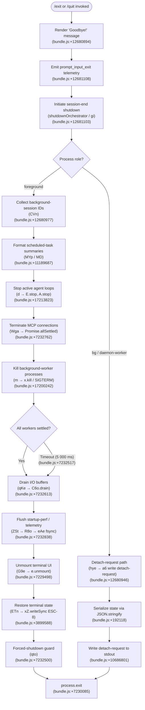

# `/exit`

> Analysis basis: CC v2.1.190 bundle.js (AST extraction + Claude interpretation)
> Minimum version: v2.1.190

---

## Overview

The `/exit` command (also aliased as `/quit`) terminates the Claude Code CLI session. When invoked, it emits a "Goodbye!" farewell message, performs an orderly shutdown of background subsystems (daemon workers, MCP connections, scheduled tasks, and background sessions), flushes telemetry, and then calls `process.exit`. The command is marked `immediate`, meaning it executes without further user confirmation.

---

## Registration

| Field | Value |
|---|---|
| type | `local-jsx` |
| name | `exit` |
| description | `null` |
| aliases | `["quit"]` |
| immediate | `true` |
| loc_byte | `12681671` |
| loc_byte_end | `12681867` |
| loc_line | `8675` |
| module_id | `WOl` |
| load_inline | `true` |
| arbor_handler.name | `V_f` |
| arbor_handler.fqn | `claude-2.1.190::V_f` |
| arbor_handler.kind | `AsyncFunction` |
| arbor_handler.resolution_path | `module_id` |
| arbor_handler.n_hits | `1` |

Analysis basis: CC v2.1.190 bundle.js:+12681671

---

## Input Branching

The handler has more than three distinct execution paths based on the process role (foreground vs. background/daemon), session state, and cleanup sub-steps. A Mermaid flowchart is used.



---

## Behavioral Spec

### 1 — Handler Entry (`exitCommandHandler` / `V_f`)

```
async function exitCommandHandler(context):
    // 1. Determine process role via roleCheck (Ws → iUe)
    role = determineProcessRole()          // literals: "bg", "daemon", "daemon-worker"

    // 2. Display farewell
    renderFarewellMessage("Goodbye!")      // bundle.js:+12680894

    // 3. Emit exit animation / random farewell variant
    startFarewellAnimation(Math.random())  // e → Math.random / setTimeout
                                           // bundle.js:+12680942

    // 4. Branch on role
    if role in ["bg", "daemon-worker"]:
        sendDetachRequest()                // hye path — bundle.js:+12680946
    else:
        collectAndShutdown(context)        // CVn, gi paths — bundle.js:+12680977
```

Analysis basis: CC v2.1.190 bundle.js:+12681007

---

### 2 — Role Detection (`processRoleCheck` / `Ws`)

```
function determineProcessRole():
    // Checks process environment/argv for role markers
    // Role strings observed: "bg", "daemon", "daemon-worker"
    // bundle.js:+2309148, +2309158, +2309172
    return roleString   // e.g. "bg" | "daemon" | "daemon-worker" | "foreground"
```

Analysis basis: CC v2.1.190 bundle.js:+12680930

---

### 3 — Detach-Request Path (`detachRequestWriter` / `hye`)

Called when the process is running as a background agent or daemon worker. Instead of calling `process.exit` directly, it writes a structured `"detach-request"` message to its communication channel so the supervising process can re-adopt background workers.

```
function sendDetachRequest():
    payload = buildTaskPayload(type="task", index=0)   // upl → b8n, En
                                                        // bundle.js:+11190886
    serialised = serializeToJSON(payload)              // a6 → Me → JSON.stringify
                                                        // bundle.js:+10686801
    writeToChannel(serialised, tag="detach-request")   // bundle.js:+11196865
    waitForAck(rue)                                    // bundle.js:+11196941
```

Analysis basis: CC v2.1.190 bundle.js:+12680946

---

### 4 — Background-Session Collection (`backgroundSessionCollector` / `CVn`)

Enumerates open background sessions and formats human-readable summaries (used for the session-end display prior to shutdown).

```
function collectBackgroundSessions():
    sessions = []
    for each sessionEntry in sessionRegistry (HI → VL):
        summary = formatScheduledTaskSummary(sessionEntry)   // MYp
        sessions.push(summary)
    return sessions
```

#### 4a — Scheduled-Task Formatter (`scheduledTaskFormatter` / `MYp` + `MD`)

```
function formatScheduledTaskSummary(entry):
    label = trimAndMatch(entry.name)            // MD → e.trim, o.match
    // Recognises display aliases:
    //   "Every minute" — bundle.js:+4925870
    //   "Every hour"   — bundle.js:+4926087
    // Parses cron-like fields with parseInt (radix 10)
    //   bundle.js:+4925926
    // Handles day-of-week offset (Sunday = 7 fallback)
    //   h.getUTCDay / h.setUTCDate — bundle.js:+4926627
    // Range string "1-5" for weekdays — bundle.js:+4926794
    return formattedString
```

Analysis basis: CC v2.1.190 bundle.js:+11189687

---

### 5 — Shutdown Orchestrator (`shutdownOrchestrator` / `gi`)

The central async function that sequences all cleanup steps for the foreground process.

```
async function shutdownOrchestrator():
    // Step 1: Emit terminal clear / scroll-summary
    writeScrollSummary(Wto)                    // bundle.js:+7232494

    // Step 2: Stop all active agent runners
    for each runner in supervisorRegistry (d):
        runner.stop()                          // E.stop, A.stop — bundle.js:+17213823
        runner.updateConfig()                  // bundle.js:+17213952

    // Step 3: Drain MCP connections with timeout
    await drainMcpConnections(Wga,            // Promise.allSettled — bundle.js:+7232762
                               AbortSignal.timeout(2000))  // bundle.js:+7232802

    // Step 4: Kill any remaining background workers
    await terminateBackgroundWorkers(m)        // x.kill / SIGTERM — bundle.js:+17200242

    // Step 5: Race: graceful drain vs. hard timeout
    await Promise.race([
        drainIoBuffers(qKe),                  // C6o.drain — bundle.js:+67368
        hardTimeout(Math.max(5000, 3500))      // bundle.js:+7232517, +7232524
    ])

    // Step 6: Flush telemetry / startup-perf report
    flushStartupPerfReport(ZSt)               // R8o → eAe fsync — bundle.js:+7232838

    // Step 7: Unmount terminal UI
    unmountTerminalApp(G9e)                   // e.unmount — bundle.js:+7229498

    // Step 8: Restore terminal escape state
    restoreTerminalState(ETn)                 // ESC-8 restore — bundle.js:+3899588

    // Step 9: Forced-shutdown guard (kill if still alive)
    forcedShutdownGuard(qto)                  // process.exit — bundle.js:+7230085

    // Step 10: Write final sync byte to stdout
    gHe.writeSync(...)                        // bundle.js:+7232988
```

Analysis basis: CC v2.1.190 bundle.js:+12681103

---

### 6 — Terminal Cleanup (`terminalRestorer` / `ETn`)

```
function restoreTerminalState():
    xZ.writeSync(ESC_SAVE)          // "\x1B7" save cursor  — bundle.js:+3899577
    // ... render final output ...
    xZ.writeSync(ESC_RESTORE)       // "\x1B8" restore cursor — bundle.js:+3899588

    // Terminal-multiplexer awareness:
    //   tmux     → replaceAll("\x1B\x1B") — bundle.js:+3546896
    //   screen   → special handling       — bundle.js:+3546923

    // Inline-image protocol detection:
    //   Ghostty  ≥ 1.2.0  — bundle.js:+3623279, +3623309
    //   iTerm.app ≥ 3.6.6 — bundle.js:+3623348, +3623380
```

Analysis basis: CC v2.1.190 bundle.js:+3899423

---

### 7 — Forced-Shutdown Guard (`forcedShutdownGuard` / `qto`)

```
function forcedShutdownGuard():
    clearTimeout(pendingGuardTimer)
    instance = du.get(instanceKey)
    process.exit(0)                    // bundle.js:+7230085
    // Fallback: process.kill(pid)     // bundle.js:+7230110
    // If neither returns: throw Error("unreachable")  // bundle.js:+7230158
```

Analysis basis: CC v2.1.190 bundle.js:+7232500

---

### 8 — Startup-Perf Flush (`startupPerfFlusher` / `ZSt`)

```
function flushStartupPerfReport():
    if not profilingEnabled:
        return "Startup profiling not enabled"   // bundle.js:+224261
    if checkpoints.length == 0:
        return "No profiling checkpoints recorded"  // bundle.js:+224351

    report = buildPerfReport(v8o, O8o)          // includes "STARTUP PROFILING REPORT"
                                                 // bundle.js:+224426
    atomicWrite(eAe):                            // openSync → writeFileSync → fsyncSync → closeSync
        file = ape.openSync(path)                // bundle.js:+192663
        ape.writeFileSync(file, report, "utf8")  // bundle.js:+224910
        ape.fsyncSync(file)                      // bundle.js:+192729
        ape.closeSync(file)                      // bundle.js:+192768
    emit telemetry("tengu_startup_perf")         // bundle.js:+226441
```

Analysis basis: CC v2.1.190 bundle.js:+7232838

---

### 9 — Scroll Summary Writer (`scrollSummaryWriter` / `Wto`)

Before unmounting the UI, writes a summary of the scroll buffer. Escapes backslash (`\\`) and double-quote (`\"`) characters in terminal output (bundle.js:+7229796, +7229819). Applies `St.dim` styling for dimmed summary text (bundle.js:+7229893).

Analysis basis: CC v2.1.190 bundle.js:+7232494

---

## State & Side Effects

| Item | Detail |
|---|---|
| Telemetry — `tengu_bg_dispatch_sigkill_escalate` | Fired when a background worker is SIGKILL-escalated (bundle.js:+17198228) |
| Telemetry — `tengu_bg_dispatch_low_mem` | Fired when shutdown is triggered under low-memory conditions (bundle.js:+17198829) |
| Telemetry — `tengu_bg_spare_enable` | Fired when spare background worker slot is enabled (bundle.js:+17199526) |
| Telemetry — `tengu_bg_spare_claim` | Fired when a spare slot is claimed (bundle.js:+17199654) |
| Telemetry — `tengu_bg_spare_claim_fail` | Fired when spare-slot claim fails (bundle.js:+17199920) |
| Telemetry — `tengu_daemon_yield` | Fired when daemon yields to a foreground service (bundle.js:+17218760) |
| Telemetry — `tengu_daemon_config_reload` | Fired on config reload during daemon lifecycle (bundle.js:+17214348) |
| Telemetry — `tengu_startup_perf` | Fired after startup-perf report is flushed (bundle.js:+226441) |
| Telemetry — `tengu_scroll_summary` | Fired after scroll summary is written (bundle.js:+7231933) |
| Telemetry — `tengu_amber_creek` | Fired from UI rendering subsystem during shutdown (bundle.js:+3556463) |
| Telemetry — `tengu_pewter_brook` | Fired from UI rendering subsystem during shutdown (bundle.js:+3556371) |
| Telemetry — `tengu_cache_eviction_hint` | Fired when cache eviction hint is emitted at session end (bundle.js:+7232876) |
| Telemetry — `prompt_input_exit` (literal) | String constant in the handler, signals prompt-level exit event (bundle.js:+12681108) |
| Telemetry — `session_end` (literal) | String constant triggering session-end reporting path (bundle.js:+7232914) |
| Terminal state | Cursor save/restore via ESC-7 / ESC-8 sequences; tmux/screen/Ghostty/iTerm2 variants handled |
| UI unmount | Ink/React component tree is unmounted before process exit |
| I/O drain | `C6o.drain` is called; a hard timeout of `Math.max(5000, 3500)` ms applies |
| Background workers | Sent SIGTERM first; escalated to SIGKILL if unresponsive (30 s / 15 s thresholds — bundle.js:+17198183, +17198194) |
| MCP connections | `Promise.allSettled` with 2 000 ms `AbortSignal.timeout` (bundle.js:+7232802, +7232702) |
| Startup-perf report | Atomically written via fsync if profiling was active |
| `process.exit` | Called from `qto` (forcedShutdownGuard); fallback `process.kill` if exit does not return |
| Daemon detach | Background-role processes write a `"detach-request"` message instead of calling `process.exit` directly |

---

## Version History

| Version | Change |
|---|---|
| v2.1.190 | Initial analysis |

---

## Common Mistakes

1. **Using `/exit` expecting a confirmation prompt** — The command is registered with `immediate: true` (bundle.js:+12681671), so it fires without any confirmation dialog. There is no "are you sure?" step.
2. **Assuming `/exit` and `/quit` behave differently** — Both names are aliases for the same handler (`V_f`); they are functionally identical (registration `aliases: ["quit"]`).
3. **Expecting instant termination in daemon/background mode** — In background-worker roles the process does _not_ call `process.exit` directly; instead it writes a `"detach-request"` and waits for the supervisor to acknowledge, which may take a moment.
4. **Interrupting during I/O drain** — The command races a drain step against a hard 5 000 ms timeout; sending a second signal during this window may cause the forced-shutdown guard (`qto`) to call `process.kill` instead of the clean `process.exit` path, potentially losing buffered output.
5. **Expecting startup-perf output always** — The perf report is only written when profiling was explicitly enabled; otherwise the path short-circuits with a "Startup profiling not enabled" message (bundle.js:+224261).

---

## Appendix — Identifier Mapping

> For bundle debugging only. Identifiers change across versions.

| Identifier | Role |
|---|---|
| `V_f` | `exitCommandHandler` — main async handler for `/exit` |
| `Ws` | `processRoleCheck` — determines fg/bg/daemon role |
| `iUe` | `roleStringResolver` — resolves role string from environment |
| `hye` | `detachRequestOrchestrator` — coordinates detach-request write |
| `Ufn` | `detachPayloadBuilder` — builds detach payload struct |
| `upl` | `taskPayloadFactory` — constructs task-type payload |
| `b8n` | `taskIndexResolver` — resolves task index (literal 0) |
| `En` | `taskTypeEncoder` — encodes "task" type string |
| `a6` | `channelWriter` — writes serialized message to IPC channel |
| `Me` | `jsonSerializer` — wraps JSON.stringify |
| `rue` | `ackWaiter` — waits for supervisor acknowledgement |
| `Hm` | `farewellMessageRenderer` — renders "Goodbye!" text |
| `CVn` | `backgroundSessionCollector` — enumerates open bg sessions |
| `HI` | `sessionRegistryAccessor` — accesses session registry store |
| `VL` | `globalStateAccessor` — low-level global state getter |
| `MYp` | `scheduledTaskSummaryBuilder` — builds task display summaries |
| `MD` | `scheduledTaskFormatter` — formats individual task entry |
| `c1` | `cronFieldParser` — parses cron-field strings |
| `_Md` | `cronRangeExpander` — expands cron range expressions |
| `xrt` | `nextRunTimeCalculator` — calculates next scheduled run time |
| `Ui` | `durationFormatter` — formats ms durations to human strings |
| `La` | `terminalStringTruncator` — truncates strings to terminal width |
| `sn` | `graphemeWidthMeasurer` — measures grapheme/string width |
| `Rs` | `ansiAwareSubstringer` — ANSI-safe string substring |
| `By` | `ansiStripHelper` — strips ANSI escape codes |
| `q_f` | `farewellComponentFactory` — creates farewell JSX element |
| `gi` | `shutdownOrchestrator` — main foreground shutdown sequence |
| `G9e` | `uiUnmounter` — unmounts the terminal UI component |
| `OU` | `unmountCleanupHelper` — post-unmount cleanup util |
| `ETn` | `terminalRestorer` — restores terminal state (ESC-8 etc.) |
| `n2e` | `terminalProtocolDetector` — detects inline-image protocol support |
| `Y$e` | `terminalCapabilityCache` — caches detected terminal capabilities |
| `Nw` | `multiplexerEscapeRewriter` — rewrites escape sequences for tmux/screen |
| `sp` | `terminalSyncWriter` — synchronous terminal write helper |
| `T` | `ansiSequenceBuilder` — builds ANSI escape sequences |
| `Wto` | `scrollSummaryWriter` — writes scroll-buffer summary before unmount |
| `cw` | `consoleWriteHelper` — low-level console write util |
| `B3` | `scrollBufferAccessor` — accesses the scroll buffer |
| `kt` | `processPathResolver` — resolves process/file paths |
| `XFt` | `configFileLocator` — locates configuration file paths |
| `M$` | `homeDirectoryResolver` — resolves home directory path |
| `gr` | `xdgConfigDirResolver` — resolves XDG config directory |
| `Wt` | `pathExistenceChecker` — checks whether a path exists |
| `ph` | `configFileReader` — reads config file contents |
| `Rc` | `configParser` — parses raw config into structured object |
| `kga` | `scrollSummaryFormatter` — formats scroll summary text |
| `qto` | `forcedShutdownGuard` — final forced-exit backstop |
| `qKe` | `ioDrainInitiator` — initiates I/O buffer drain |
| `d` | `supervisorSessionManager` — manages agent-runner sessions |
| `rqe` | `sessionFileStatChecker` — stat-checks session files |
| `cn` | `errorCodeNormalizer` — normalises error codes |
| `Xs` | `asyncLocalStoreGetter` — retrieves AsyncLocalStorage store |
| `kxo` | `sessionFilePathBuilder` — builds session file paths |
| `be` | `stringCoercer` — coerces values to string |
| `y$l` | `sessionSummaryFormatter` — formats session summary for display |
| `E` | `agentRunnerHandle` — handle to a running agent instance |
| `FUt` | `agentRunnerFactory` — creates agent runner instances |
| `nyt` | `agentEventEmitter` — emits agent lifecycle events |
| `A` | `agentLoopController` — controls agent loop lifecycle |
| `_` | `agentLoopImpl` — inner agent loop implementation |
| `GEc` | `heartbeatScheduler` — schedules daemon heartbeat |
| `jse` | `heartbeatEmitter` — emits heartbeat signals |
| `I` | `inputHandlerController` — controls keyboard input handler |
| `x` | `inputEventDispatcher` — dispatches terminal input events |
| `W` | `globalEventEmitter` — application-wide event bus |
| `Wga` | `mcpConnectionDrainer` — drains MCP connections on shutdown |
| `ZSt` | `startupPerfFlusher` — flushes startup performance report |
| `Jcr` | `perfReportEmitter` — emits perf telemetry event |
| `O8o` | `perfCheckpointAggregator` — aggregates perf checkpoints |
| `R8o` | `perfReportWriter` — writes perf report to disk |
| `D8o` | `perfReportPathBuilder` — builds perf report file path |
| `eAe` | `atomicFileWriter` — atomic fsync-based file writer |
| `v8o` | `perfCheckpointSerializer` — serialises checkpoint list |
| `K3` | `nodeRequireWrapper` — wraps Node.js `require` |
| `P8o` | `perfReportDestPathBuilder` — builds perf report destination path |
| `oPn` | `sessionEndReporter` — reports session-end metrics |
| `Lga` | `sessionMetricsCollector` — collects final session metrics |
| `wga` | `sessionDurationCalculator` — calculates session duration |
| `Cga` | `sessionCostCalculator` — calculates session token/cost metrics |
| `bs` | `fullscreenModeManager` — manages fullscreen terminal mode |
| `J$` | `featureFlagChecker` — checks feature flags |
| `mx` | `soundPlaybackChecker` — checks if sound playback is enabled |
| `p9r` | `fullscreenEnterHelper` — enters fullscreen terminal mode |
| `mZ` | `fullscreenExitHelper` — exits fullscreen terminal mode |
| `d9r` | `osWindowsModeDetector` — detects Windows OS for fullscreen gating |
| `Ur` | `fullscreenRendererSelector` — selects renderer based on fullscreen mode |
| `edd` | `fullscreenEventListener` — listens for fullscreen toggle events |
| `it` | `renderLoopController` — controls the terminal render loop |
| `iEt` | `cacheEvictionHintEmitter` — emits cache eviction hint at exit |
| `Ve` | `ansiKitWriter` — low-level ANSI terminal kit writer |
| `aKe` | `stdoutSyncWriter` — synchronous stdout write primitive |
| `Rr` | `nonConformingTerminalHandler` — handles non-conforming terminal output |
| `Ng` | `nonConformingOutputFormatter` — formats output for non-conforming terminals |
| `q9e` | `exitAnimationPlayer` — plays exit animation before shutdown |
| `ePn` | `exitAnimationFrame` — single frame of the exit animation |

---

Note: index built via Arbor fallback; some signals (telemetry, literals) may be missing — see arbor-fallback.js.