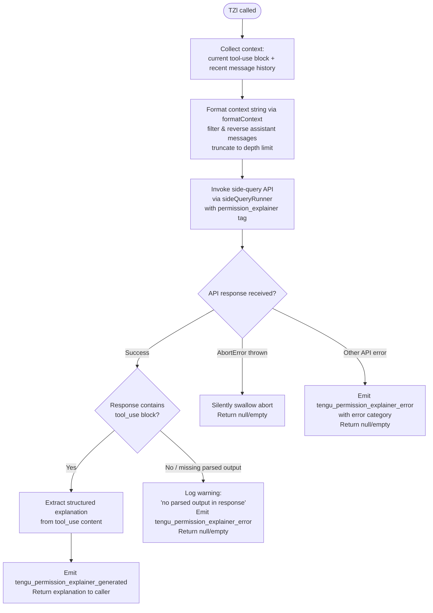

# `/explain_command`

> Analysis basis: CC v2.1.190 bundle.js (AST extraction + Claude interpretation)
> Minimum version: v2.1.190

---

## Overview

The `explain_command` tool is an internal permission-explainer facility that, when invoked, uses a dedicated side-query API call to generate a human-readable explanation of why a given tool use requires the permissions it is requesting. It is registered as a `tool`-type command (not a user-facing slash command) and relies on the handler `TZl` to orchestrate context preparation, model invocation, and structured result extraction.

---

## Registration

| Field | Value |
|---|---|
| type | `tool` |
| name | `explain_command` |
| description | `null` |
| loc_byte | `14572500` |
| loc_byte_end | `14572536` |
| loc_line | `11161` |
| arbor_handler.name | `TZl` |
| arbor_handler.fqn | `claude-2.1.190::TZl` |
| arbor_handler.kind | `AsyncFunction` |
| arbor_handler.resolution_path | `direct` |
| arbor_handler.n_hits | `1` |

Analysis basis: CC v2.1.190 bundle.js:+14572500

---

## Input Branching

The handler `TZl` exhibits four or more distinct paths depending on: (1) whether the side-query API call succeeds and returns a parseable `tool_use` block, (2) whether the response is missing any parsed output, (3) whether an `AbortError` is thrown, and (4) whether any other API error occurs. A flowchart is used below.



Analysis basis: CC v2.1.190 bundle.js:+14572195 (entry via `WFo`), +14572405 (side-query call `gs`), +14572981 (result handling `W`), +14573033 (structured output check `Mi`), +14573082 (success path `Le`), +14573195 (error event), +14572983 (success event), +14573653 (`AbortError` handling), +14573724 (`api_error` handling)

---

## Behavioral Spec

### 1. Context Collection and History Formatting

```
function formatRecentHistory(messages, maxMessages):
    // Filter to last N assistant messages
    assistantMessages = messages.filter(role == "assistant")
    // Reverse to most-recent-first order
    assistantMessages.reverse()
    // Take up to maxMessages (observed limit: 2 from literal at +14571720)
    assistantMessages = assistantMessages.slice(0, maxMessages)
    // Extract text content blocks only
    textBlocks = assistantMessages.flatMap(m => m.content.filter(type == "text"))
    // Truncate each block to avoid token bloat
    // Threshold: 1000 chars (literal at +14571764)
    truncated = textBlocks.map(b => b.text.slice(0, 1000))
    // Prepend ellipsis marker where truncated (literal "..." at +14571995)
    // Join with separator
    return truncated.unshift(marker).join(separator)
```

Analysis basis: CC v2.1.190 bundle.js:+14572258 (`m3f`), +14571776 (filter), +14571844 (reverse), +14571987 (`YR` truncation helper), +14572003 (unshift), +14572036 (join), +14571720 (depth `2`), +14571764 (char limit `1000`), +14571799 (`"assistant"` role), +14571819 (literal `3`), +14571902 (`"text"` type filter)

### 2. Side-Query API Invocation

```
async function invokeSideQuery(toolUseBlock, formattedHistory, abortSignal):
    // Build structured prompt referencing the tool-use needing explanation
    // Tag the request with "permission_explainer" routing label
    //   (literal at +14572558)
    // Call the shared side-query runner (gs -> v9 -> Da -> ...)
    // Pass "side_query" context type (literal at +8819973)
    // Attach current timestamp for latency tracking (Date.now at +14572219)
    response = await sideQueryRunner(prompt, {
        tag: "permission_explainer",
        signal: abortSignal,
    })
    return response
```

Analysis basis: CC v2.1.190 bundle.js:+14572405 (`gs` call), +14572240 (`f3f` context builder), +14572219 (`Date.now` timestamp), +14572558 (`"permission_explainer"` literal), +8819973 (`"side_query"` literal)

### 3. Response Parsing and Structured Output Extraction

```
function extractExplanation(response):
    // Locate tool_use blocks in the response content
    // (literal "tool_use" at +14572713)
    toolUseBlocks = response.content.filter(type == "tool_use")
    if toolUseBlocks.length == 0:
        log.warn("Permission explainer: no parsed output in response")
        // literal at +14573330
        return null

    // Extract the first tool_use input as the explanation payload
    explanation = toolUseBlocks[0].input

    // Check that explanation object passes hasOwn validation (Mi at +14573033)
    // Validate mcp__ / mcp_tool prefix for MCP-sourced tool names
    // (literals "mcp__" at +3303107, "mcp_tool" at +3303126)
    if not isValidExplanation(explanation):
        return null

    return explanation
```

Analysis basis: CC v2.1.190 bundle.js:+14572791 (`Me` stringify helper), +14572825 (`p3f`), +14572713 (`"tool_use"` literal), +14573033 (`Mi` validation), +14573277 (`Mt` result builder), +14573330 (warning string), +3303107 (`"mcp__"`), +3303126 (`"mcp_tool"`)

### 4. Telemetry Emission on Completion

```
function emitResult(success, errorCategory):
    if success:
        emit("tengu_permission_explainer_generated")
        // loc_byte +14572983
    else:
        emit("tengu_permission_explainer_error", { category: errorCategory })
        // loc_byte +14573195
        // errorCategory is one of: "AbortError", "api_error", "no_parsed_output"
```

Analysis basis: CC v2.1.190 bundle.js:+14572983 (success event), +14573195 (error event), +14573534 (`be` error wrapper), +14573689 (`Re` terminal return), +14573653 (`"AbortError"` literal), +14573724 (`"api_error"` literal)

### 5. Config and Permission Context Resolution

The handler calls `WFo` which in turn calls `Dt` (the config accessor). Config access before initialization raises the error `"Config accessed before allowed."` (literal at +13753955). The config path includes reading `SEe` (config file read via `r.readFileSync`), applying `bGl` (directory scanning for backup paths with `"backups"` prefix, literal at +13753523), and merging with `BRf` (file-watcher registration). This ensures the latest on-disk configuration is available to the explainer before the API call is made.

Analysis basis: CC v2.1.190 bundle.js:+14572195 (`WFo`), +14572071 (`Dt`), +13753955 (guard error literal), +13754011 (`r.readFileSync`), +13753523 (`"backups"`), +13754058 (`Gt` JSON.parse), +13750746 (`BRf`)

---

## State & Side Effects

| Item | Detail |
|---|---|
| Telemetry: `tengu_permission_explainer_generated` | Fired on successful extraction of explanation from model response (bundle.js:+14572983) |
| Telemetry: `tengu_permission_explainer_error` | Fired on any error path: abort, API error, or missing parsed output (bundle.js:+14573195) |
| Telemetry: `tengu_api_success` | Fired by the underlying side-query API layer on HTTP success (bundle.js:+8821644) |
| Telemetry: `tengu_config_parse_error` | Fired if configuration JSON cannot be parsed during context resolution (bundle.js:+13754586) |
| Telemetry: `tengu_lone_surrogate_sanitized` | Fired by response processing if lone Unicode surrogates are found and sanitized (bundle.js:+8821340) |
| Side-query API call | Spawns a one-shot API request tagged `"permission_explainer"` and `"side_query"`; does not affect the main conversation thread |
| Config read | Reads on-disk config synchronously (`r.readFileSync`) and registers a file watcher via `BRf`/`mIt` (bundle.js:+13750116) |
| appState changes | None observed in depth-2 traversal |
| Sound | None observed in depth-2 traversal |

---

## Version History

| Version | Change |
|---|---|
| v2.1.190 | Initial analysis |

---

## Common Mistakes

1. **Treating this as a user-facing slash command**: `explain_command` is registered as a `tool`-type entry, not a prompt or interactive command. It is invoked programmatically by the permission-check subsystem, not by the user typing `/explain_command`.
2. **Expecting a response when the model returns no `tool_use` block**: The handler explicitly checks for the `"tool_use"` content type (literal at +14572713) and returns `null` with a warning if none is present. Callers must handle a `null` return gracefully.
3. **Assuming abort propagation is silent in all cases**: `AbortError` is caught and swallowed (literal `"AbortError"` at +14573653), so callers will receive `null` without an exception; however, `tengu_permission_explainer_error` is still emitted.
4. **Ignoring the config-access guard**: If the config subsystem is not yet initialized when `explain_command` is invoked, the call throws `"Config accessed before allowed."` (bundle.js:+13753955). Integration code must ensure config initialization order.
5. **Confusing `"permission_explainer"` with `"permission_explainer_generate"`**: The literal `"permission_explainer_generate"` (at +14573085) appears to be a field name or sub-label within the request payload, not the primary routing tag — the routing tag is `"permission_explainer"` (at +14572558).

---

## Appendix — Identifier Mapping

> For bundle debugging only. Identifiers change across versions.

| Identifier | Role |
|---|---|
| `TZl` | Main async handler for `explain_command` (entry point) |
| `WFo` | Config-and-context loader called by `TZl` |
| `Dt` | Core config accessor (reads/validates app configuration) |
| `Wt` | Config validation/type-check helper |
| `OOo` | Config option merger/normalizer |
| `SEe` | Config file reader (calls `readFileSync`, parses JSON, handles backups) |
| `bGl` | Backup directory scanner (uses `readdirStringSync`, `IS.basename`) |
| `BRf` | File-watcher registration handler |
| `mIt` | Individual file-watch registrar (`His.watchFile`) |
| `cV` | Config cache validator |
| `Ei` | Hook/event registration dispatcher (`C6o.register`) |
| `f3f` | Context string formatter (JSON-stringifies tool-use block) |
| `Me` | JSON serializer wrapper (`JSON.stringify`) |
| `m3f` | Assistant-message history formatter (filter, reverse, truncate, join) |
| `YR` | Surrogate-pair aware string slicer (char-code aware truncation) |
| `gs` | Side-query runner (top-level API orchestrator) |
| `v9` | Side-query sub-orchestrator (calls `S_`, `lG`, `Bo`, `Da`) |
| `Da` | Request context builder and model-alias resolver |
| `dCt` | Token/stream credential resolver (`scs`, `ocs`) |
| `pCt` | Policy settings resolver (`Object.keys`, `Toe`, `bsn`) |
| `JNe` | Provider type checker (`firstParty`/`gateway` discrimination) |
| `Lfe` | Auth layer resolver (`Ir`, `H3u`, `dRr`) |
| `nl` | Text normalizer (regex replace whitespace/control chars) |
| `XNe` | Header exclusion checker (`h3u.includes`) |
| `ix` | Header inclusion tester (`wfe.includes`) |
| `Hfn` | Header-forwarding helper |
| `RGs` | Request-options serializer (`Object.entries`) |
| `Tn` | Token-count helper (`gsn`, `l2`) |
| `qXe` | Query-parameter encoder (`Ur`, `Object.entries`) |
| `kGs` | Key-search helper (`n.indexOf`) |
| `_3u` | Request-builder helper (`ix`, `Rwt`, `Qo`, `wGs`) |
| `Qo` | Model-name resolver (alias → canonical model ID, handles fable/opusplan/sonnet/haiku/opus/best) |
| `Rwt` | Model-tier resolver (handles `"claude-"` prefix, `Vu`, `zoe`, `DTe`, `ETe`) |
| `y3u` | Model-selection helper with `startsWith` check |
| `Kg` | Side-query response post-processor |
| `vw` | Response structure parser (calls `hRr`, `Afn`, `Sfn`) |
| `hRr` | HTTP response header/status inspector |
| `Afn` | Full response body parser (content block extraction, type discrimination) |
| `Sfn` | Streaming response assembler |
| `W5` | Main API request executor (fetch wrapper, auth, retry, streaming) |
| `kf` | Request pre-processor (calls `kt`) |
| `kt` | Request canonicalization |
| `VL` | Request validation |
| `pW` | Core API send function (headers, auth, streaming, error handling) |
| `_z` | Request body serializer |
| `VUr` | URL parser/validator (split, trim, indexOf, slice) |
| `Ws` | WebSocket/stream mode selector |
| `iUe` | Stream type discriminator |
| `Nz` | Context store accessor |
| `vfn` | AsyncLocalStorage store reader (`UGs.getStore`) |
| `SRr` | URL encode helper (`encodeURIComponent`) |
| `nt` | String normalizer / type coercer |
| `xh` | Auth token refresher |
| `q_n` | OAuth refresh orchestrator |
| `FGs` | Boolean flag coercer |
| `ay` | Auth resolver (calls `Ad`, `dA`, `Nl`, `Bo`, `rT`, `Yg`) |
| `Ad` | Auth profile loader |
| `dA` | Auth detail resolver (Kdn, mZe, WG, fx) |
| `Nl` | Auth normalizer |
| `rT` | Auth token type discriminator |
| `Yg` | Auth flow orchestrator (handles API key, OAuth, WIF) |
| `eRt` | Auth environment reader |
| `mZe` | Auth source merger |
| `zH` | Auth state holder |
| `WZu` | Request/response timing wrapper |
| `sZe` | Request lifecycle timer (fx, Kai, Date.now, Uai) |
| `wr` | Response wrapper |
| `Dln` | Proxy auth helper (TNe, Zvs, trust check, timeout) |
| `TNe` | Proxy config reader |
| `Zvs` | Proxy config validator |
| `qCu` | Timeout parser (parseInt, Number.isNaN) |
| `rU` | Retry-util helper |
| `NC` | Network error classifier (`B1e`) |
| `XZu` | Stream session manager (UUID, verbose logging, chunked reading) |
| `Ir` | Identity/normalization helper |
| `dai` | Stream data reader (`Eu`) |
| `YUr` | Stream result aggregator (`p0`) |
| `JZu` | Header log sanitizer (redacts `authorization`, masks `anthropic-beta`/`x-anthropic-*`) |
| `pai` | Stream preamble handler |
| `uai` | Stream initialization handler (`Za`, `it`) |
| `zUr` | Timeout/rate-limit calculator (`KUr`, `Number.isFinite`, Math.min/max) |
| `jZu` | Byte-stream watchdog (performance.now, clearTimeout, setTimeout, chunk reader) |
| `vH` | Provider discriminator (bedrock/vertex/anthropic detection) |
| `jvt` | Provider type checker |
| `DFu` | Provider prefix tester (`anthropic.` prefix) |
| `UNe` | Header-value case normalizer |
| `t2` | Region config reader (`Qru`, `S1e`) |
| `S1e` | Settings accessor |
| `ny` | Network/proxy config resolver (Za, rU, iz, mYe, ews, pCr) |
| `Za` | String coercer |
| `iz` | URL protocol classifier (https/http, port 443/80) |
| `mYe` | Memory/env config reader (`u2`, `NG`) |
| `ews` | Extra header injector |
| `pCr` | Proxy credential builder (IP check, port split) |
| `hCr` | Proxy URL parser |
| `YZu` | Request abort/cancel helper |
| `aai` | Abort signal combiner (`dai`, `pai`) |
| `qZu` | Request routing selector (w_n, S1e, KKe, Rre, sxr, zH, Ls) |
| `w_n` | Routing mode resolver (`RI`, `gs`, `Eo`, `S1e`) |
| `KKe` | Routing key evaluator |
| `Rre` | Route finder (`cCc.find`, startsWith, `GXt`) |
| `sxr` | Route string normalizer |
| `Ls` | OAuth endpoint validator (staging/prod allowlist check) |
| `BTe` | OAuth token refresh executor (`refresh_token` POST) |
| `mar` | OAuth request builder |
| `C9u` | OAuth response handler (parses JWT, handles `invalid_grant`) |
| `EXt` | OAuth expiry extractor |
| `dar` | Date/time stamper |
| `$kt` | Bedrock header injector (`X-Amzn-Bedrock-Service-Tier`) |
| `RIe` | SDK log formatter (error/warn/info/debug console prefixes) |
| `D` | Output writer / process stdio dispatcher |
| `VEc` | Filesystem realpath/stat resolver |
| `sp` | Subprocess spawner |
| `ke` | Error logger (`YJ.logError`, `f7e.push`) |
| `XJf` | Response finalizer (`B2n`) |
| `d` | Supervisor write handler (rqe, y$l, GEc, I.start) |
| `k` | Process kill/cleanup handler (`wk`, `w.delete`, `w.get`, `Ofe`) |
| `wk` | Signal sender (`process.kill`) |
| `Ofe` | Exit code formatter (`poe`, trim) |
| `qC` | Conversation context builder (`Yg`) |
| `GTe` | WIF (Workload Identity Federation) token exchange handler |
| `xJe` | WIF credential fetch (fetch, AbortSignal.timeout, omn/k9u/R9u) |
| `Le` | Feature-flag success reporter (`tengu_feature_ok`) |
| `Re` | Feature-flag failure reporter (`tengu_feature_bad`) |
| `x9u` | WIF error classifier |
| `I` | Input event handler (preventDefault, Math.max/floor) |
| `x` | Terminal write dispatcher |
| `A` | Scroll position calculator (Math.max/min) |
| `g` | Global timeout setter |
| `UFe` | Structured-output feature gate (Eo, vH, TO, t.includes) |
| `Eo` | Model capability resolver (qXe, t_, FEt, Mp) |
| `t_` | Model-name pattern tester (toLowerCase, includes, replace) |
| `FEt` | Feature flag reader |
| `Mp` | Model alias substituter |
| `TO` | Provider capability checker |
| `tse` | Tool-schema extractor (gEt, n.get, ixr) |
| `gEt` | Tool schema getter |
| `ixr` | Resource identifier normalizer (replace, sxr) |
| `_` | MCP/SDK connection manager (nyt, VD, Ox, Promise.all, R7, SB, ke, fo) |
| `nyt` | Connection state enumerator (`yyc`) |
| `yyc` | Object key iterator |
| `fo` | Error string formatter |
| `A0p` | Tool-list searcher (e.find, n.find) |
| `Rdo` | Request fingerprint hasher (sha256, hex, DBa.createHash) |
| `Lfn` | API response logger (Za, Ir, Eu, vfn, NTe, T) |
| `Eu` | Response decoder (`Ndn`) |
| `Ndn` | Stream decoder (`WXe`) |
| `NTe` | Response metadata recorder |
| `KSn` | Response cache key builder |
| `m6e` | Conversation turn executor (nt, Ir, Ao, Kar, it, zar) |
| `Ao` | Agent runner (ay, H2, Gs) |
| `H2` | Array/content-type checker |
| `Kar` | Token usage tracker |
| `it` | Turn result dispatcher (txt, nxt, V9, gSn, ZRt, IW, Dt) |
| `txt` | Text-block turn handler |
| `nxt` | Non-text block turn handler |
| `V9` | Result queue entry (`q9`) |
| `gSn` | Dedup gate (uBr.has/add, lBr, mBr) |
| `zar` | Turn metadata recorder |
| `nD` | Prompt cache injector (sFr, NFe) |
| `sFr` | Cache slot finder |
| `NFe` | Cache eligibility checker (nt, zNe) |
| `zNe` | HIPAA/compliance flag checker (`tRr.includes`, `"hipaa"`) |
| `L` | Background worker lifecycle manager (Date.now, w.values, V.shiftGraceClocksForward, k, PVt, J2l, B2e, ke, F.has, Promise.all, WXn, it, zn) |
| `V` | Worker slot scheduler (u, F.add, y.has, g.get, sOt, Gwn, T, W, Math.floor, eK, y.add/delete, uae) |
| `u` | Worker state reporter (Le, Re, CU, X6) |
| `F` | Worker interval manager (clearInterval) |
| `y` | Worker set (G5e) |
| `sOt` | Grace-clock advance calculator (Drt, SMd.test, Math.min, P3i) |
| `Gwn` | Grace-clock maximum calculator (Drt, P3i, Math.max) |
| `Odc` | Loop-sentinel boolean coercer |
| `eK` | Slot availability checker |
| `uae` | Worker expiry evaluator (Prt, r.filter, oOt) |
| `PVt` | Memory pressure monitor (GXn, X2l.freemem) |
| `GXn` | Memory metric emitter (Yt, it) |
| `J2l` | Worker join helper |
| `B2e` | Pinned-worker file manager (_b.lstat/rm/readFile, Gt, ECd) |
| `MDt` | Pin file path builder (py.join, Vk) |
| `kn` | Error code normalizer (`cn`) |
| `ECd` | Recursive directory lister (_b.readdir/lstat, py.join, W1i, Df) |
| `zn` | Worker-count reporter |
| `WXn` | Worker attach-upgrade handler |
| `z` | Keyboard input handler (K.preventDefault, U) |
| `K` | Key event dispatcher (fMe, Jgl) |
| `U` | Render/redraw scheduler (clearTimeout, setTimeout, d.write, Math.round, M.unref) |
| `OBa` | Output buffer accumulator |
| `N_n` | Model capability flag injector (fW, Eo, n.includes) |
| `YC` | Content mapper (e.map) |
| `Uwe` | Agent turn executor (Sa, Array.isArray, T, yW, hc, kt, Me) |
| `yW` | Worker session launcher (Dt, FOo.randomBytes, hn) |
| `hn` | Session initializer (GQn, n0, CDe, NOo, DKt, SEe, PHt, BQn) |
| `hc` | Session context builder (ay, Dt) |
| `o8o` | Content-block popper (t.pop, Array.isArray, WJt, t.push, Object.keys) |
| `WJt` | Block type checker (GJt, Xwc.test) |
| `kN` | Deep clone helper (structuredClone) |
| `VJt` | Content-block normalizer (n.pop, Array.isArray, WJt, qJt, n.push, Object.keys) |
| `qJt` | Block content fixer (t8o, e.replace) |
| `Ve` | Output formatter helper (`aKe`) |
| `aKe` | ANSI/styled text builder |
| `lxr` | Response log formatter (Ir, JWs) |
| `JWs` | Header-log serializer (e.match, t.split, o.trim, r.every, XWs.test, N9u.test) |
| `axr` | Response cache writer (ixr, gEt, r.get/set, t.every, o.has, s.add, T) |
| `PSe` | Performance snapshot recorder |
| `Rr` | Result renderer (Ng, Ve) |
| `Ng` | Styled output helper (`aKe`) |
| `Fo` | Fallback output formatter (`aKe`) |
| `GDt` | Agent tool-use authorizer (hNi, $nt, BDt) |
| `hNi` | Agent built-in tool checker (xCd, ke) |
| `xCd` | Tool permission validator (pNi.has, ac, UCn.has) |
| `$nt` | Tool authorization record builder (Ng) |
| `BDt` | Tool digest hasher ($nt, $Dt) |
| `$Dt` | SHA-256 hasher (uNi.createHash) |
| `YU` | Agent tool-name parser (RCd, oD, ke) |
| `RCd` | Agent tool-name decoder (startsWith, slice, NCn, P2r, oD) |
| `NCn` | Custom agent name extractor (`P2r`) |
| `P2r` | Slash-separated name splitter (indexOf, slice) |
| `oD` | Tool-name prefix checker (startsWith) |
| `lEt` | Cache-control injector (`"cache_control"` tag) |
| `Mi` | Tool-type discriminator (Object.hasOwn, Ng, startsWith `"mcp__"`, Ve) |
| `Mt` | Result finalizer (W, Pe) |
| `Pe` | Result output renderer (`aKe`) |
| `be` | Error wrapper/stringifier (String) |