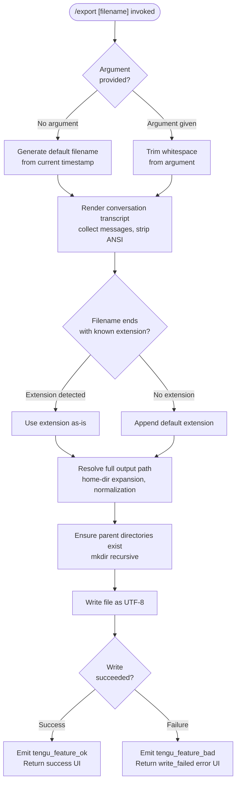

# `/export`

> Analysis basis: CC v2.1.181 bundle.js (AST extraction + Claude interpretation)
> Minimum version: v2.1.181

---

## Overview

The `/export` command serializes the current conversation history to a file on disk (or, when no filename is supplied, to the clipboard). It collects all messages from the active session, strips ANSI escape codes, formats them into a human-readable transcript, and either writes the result to the resolved output path or copies it to the system clipboard.

---

## Registration

| Field | Value |
|---|---|
| type | `local-jsx` |
| name | `export` |
| description | `Export the current conversation to a file or clipboard` |
| argumentHint | `[filename]` |
| module_id | `ywl` |
| load_inline | `true` |
| loc_byte | `12911629` |
| loc_byte_end | `12911825` |
| loc_line | `8499` |
| arbor_handler.name | `gaf` |
| arbor_handler.fqn | `claude-2.1.181::gaf` |
| arbor_handler.kind | `AsyncFunction` |
| arbor_handler.resolution_path | `module_id` |
| arbor_handler.n_hits | `0` |

Analysis basis: CC v2.1.181 bundle.js:+12911629

---

## Input Branching

The command has three distinct top-level branches driven by whether a filename argument is provided and whether the file write succeeds. A Mermaid flowchart is used.



Analysis basis: CC v2.1.181 bundle.js:+12911061 (handler entry), +12911070 (trim), +12911101 (path resolution branch), +12911190 (write_failed), +12911113 (export_file success path)

---

## Behavioral Spec

### 1. Handler Entry (`gaf`)

The primary async handler (`gaf`) is the resolved Arbor entry point (`arbor_handler.name = "gaf"`, `resolution_path = module_id`). It orchestrates all sub-steps.

```
async function exportHandler(commandArgs, appContext):
    rawArg = commandArgs.trim()                  // loc +12911070

    transcript = buildTranscript(appContext)      // calls haf → rVn → maf

    if rawArg is empty:
        outputPath = generateDefaultFilename()    // calls Aaf for timestamp
    else:
        outputPath = rawArg

    resolvedPath = resolveOutputPath(outputPath)  // calls nVn → uaf → vs

    try:
        ensureParentDirs(resolvedPath)            // eVn.mkdir recursive
        writeFile(resolvedPath, transcript, "utf-8")  // eVn.writeFile
        emitTelemetry("tengu_feature_ok")         // xe path, loc +12911110
        return successResult("export_file")
    catch error:
        emitTelemetry("tengu_feature_bad")        // Me path, loc +12911173
        message = error.message ?? "Unknown error"   // literal loc +12911271
        return errorResult("write_failed", message)  // literal loc +12911190
```

Analysis basis: CC v2.1.181 bundle.js:+12911061

---

### 2. Transcript Construction (`haf` → `rVn` → `maf`)

Collects all messages from the current session, formats each one into a labelled block, strips ANSI codes, and joins them.

```
function buildTranscript(appContext):
    messages = collectMessages(appContext)   // maf, loc +12910033

    lines = []
    for each message in messages:
        role  = message.role                // "user" | "assistant" literals
        body  = extractTextContent(message) // faf checks Array.isArray, loc +12909303
        clean = stripAnsi(body)             // Sc → Bun.stripANSI, loc +3943165
        lines.push(formatBlock(role, clean))

    return lines.join("\n")                 // rVn r.join, loc +12910078
```

Analysis basis: CC v2.1.181 bundle.js:+12910033 (`maf`), +12910051 (`r.push`), +12910058 (`Sc`), +12910078 (`r.join`)

#### 2a. Message Collection (`maf`)

```
function collectMessages(appContext):
    session = lookupCurrentSession(appContext)   // paf, loc +12909419
    permit  = checkPermissions(appContext)       // lW checks isTeammate,
                                                //   isPlanModeRequired, loc +7059574
    rawMessages = session.messages              // type "export" literal loc +12909712
    return rawMessages
```

Analysis basis: CC v2.1.181 bundle.js:+12909419 (`paf`), +12909434 (`lW`)

#### 2b. Content Extraction (`faf`)

```
function extractTextContent(message):
    content = message.content
    if Array.isArray(content):                  // loc +12909303
        textParts = content.filter(part => part.type === "text")   // literal loc +12910721
        return textParts.map(p => p.text).join("")
    else:
        return content ?? ""
```

Analysis basis: CC v2.1.181 bundle.js:+12909303 (`faf` Array.isArray), +12910721 (`"text"` literal)

#### 2c. Message Role Filtering (`Hwl`)

The `Hwl` helper is called from the main handler to locate specific message roles or content. It operates on the message list using `find`, trims the result, checks `Array.isArray`, and extracts substring fragments (constants: `50` characters at offset `+12910782`, `49` at `+12910801`).

```
function findMessageFragment(messages, roleFilter):
    match = messages.find(m => m.role === roleFilter)  // loc +12910543
    if not match: return ""
    text = match.content.trim()                         // loc +12910659
    if Array.isArray(text): ...                         // loc +12910676
    fragment = truncate(text, 50)                       // literal 50, loc +12910782
    return fragment.substring(0, 49)                    // literal 49, loc +12910801
```

Analysis basis: CC v2.1.181 bundle.js:+12910543, +12910659, +12910676, +12910782, +12910801

---

### 3. Default Filename Generation (`Aaf`)

When no filename argument is supplied, a timestamp-based filename is generated from the current local date and time.

```
function generateDefaultFilename():
    now = new Date()
    year    = now.getFullYear()                         // loc +12910269
    month   = String(now.getMonth() + 1).padStart(2, "0")  // loc +12910294
    day     = String(now.getDate()).padStart(2, "0")    // loc +12910335
    hour    = String(now.getHours()).padStart(2, "0")   // loc +12910373
    minute  = String(now.getMinutes()).padStart(2, "0") // loc +12910412
    second  = String(now.getSeconds()).padStart(2, "0") // loc +12910453
    return "claude-export-{year}{month}{day}-{hour}{minute}{second}"
```

Analysis basis: CC v2.1.181 bundle.js:+12910269 through +12910453 (`Aaf`)

---

### 4. Extension Detection (`uaf`)

Before resolving the full path, the file extension is inspected.

```
function detectOrAppendExtension(filename):
    ext = path.extname(filename)          // tVn.extname, loc +12906420
    if ext is empty or unrecognized:
        filename = filename + defaultExtension
    return filename
```

Analysis basis: CC v2.1.181 bundle.js:+12906420 (`uaf` → `tVn.extname`), +12906460 (`vs`)

---

### 5. Path Resolution (`vs`)

Handles home-directory expansion, null-byte rejection, NFC normalization, and absolute path resolution.

```
function resolveOutputPath(rawPath):
    if rawPath includes "\0":
        throw new TypeError("Path contains null bytes")   // literal loc +1089749

    normalized = rawPath.normalize("NFC")                 // literal "NFC" loc +64429
    normalized = OO.normalize(normalized)                 // loc +1089808

    if normalized.startsWith("~/"):                       // literal "~/" loc +1089877
        home = os.homedir()                               // ben.homedir, loc +1089846
        normalized = OO.join(home, normalized.slice(2))  // loc +1089893

    if platform === "windows":                            // literal loc +1089946
        normalized = applyWindowsPathFix(normalized)      // r.match path, loc +1089957

    if not OO.isAbsolute(normalized):                    // loc +1090006
        normalized = OO.resolve(process.cwd(), normalized) // loc +1090060

    return normalized
```

Analysis basis: CC v2.1.181 bundle.js:+1089749, +64429, +1089808, +1089877, +1089846, +1089946, +1090006, +1090060

---

### 6. File Write (`nVn`)

```
async function writeToFile(resolvedPath, content):
    dir = path.dirname(resolvedPath)                     // tVn.dirname, loc +12906526
    await fs.mkdir(dir, { recursive: true })             // eVn.mkdir, loc +12906516
    await fs.writeFile(resolvedPath, content, "utf-8")   // eVn.writeFile, literal "utf-8" loc +12906591
```

Analysis basis: CC v2.1.181 bundle.js:+12906516, +12906526, +12906563, +12906591

---

### 7. Telemetry Emission (`xe` / `Me`)

```
function emitSuccess(featureLabel):
    // xe path
    trackEvent("tengu_feature_ok", { feature: featureLabel })  // loc +1019804

function emitFailure(featureLabel, errorDetail):
    // Me path
    trackEvent("tengu_feature_bad", { feature: featureLabel, detail: errorDetail })  // loc +1019871
```

Analysis basis: CC v2.1.181 bundle.js:+1019804 (`tengu_feature_ok`), +1019871 (`tengu_feature_bad`)

---

## State & Side Effects

| Item | Detail |
|---|---|
| Telemetry | `tengu_feature_ok` (loc +1019804) on successful file write; `tengu_feature_bad` (loc +1019871) on write failure |
| File system | Creates parent directories (recursive `mkdir`) and writes UTF-8 file to the resolved output path |
| ANSI stripping | Calls `Bun.stripANSI` (via `Sc`) on all message content before writing (loc +3943165) |
| Path normalization | NFC Unicode normalization applied; null-byte paths rejected with `TypeError` (loc +1089749) |
| Home expansion | `~/` prefix expanded to `os.homedir()` (loc +1089846) |
| Windows path handling | Special regex match applied on Windows platform (loc +1089957) |
| appState changes | Reads current session messages; no write-back to appState observed in depth-2 traversal |
| Hook registration | None found in depth-2 traversal |
| Sound | None found in depth-2 traversal |
| Background session guard | `bn` helper checks for `"stopped"` / `"background session"` state (literals loc +17137996, +17138039) |
| Process exit path | `Ps` → `process.exit` reachable via error-shutdown path (loc +13300084); triggered only on fatal CLI error (`"cli_error"` literal loc +13300071) |

---

## Version History

| Version | Change |
|---|---|
| v2.1.181 | Initial analysis |

---

## Common Mistakes

1. **Omitting the file extension**: If no extension is included in the filename argument and the command cannot detect one via `path.extname`, a default extension is appended automatically. Do not assume the filename will be written exactly as typed without one.
2. **Relative paths without context**: Supplying a relative path resolves against `process.cwd()` at invocation time, not the project root or the conversation directory. Use an absolute path or `~/` for predictable placement.
3. **Paths with null bytes**: Any path containing a null byte (`\0`) will be rejected immediately with a `TypeError` before any I/O occurs (CC v2.1.181 bundle.js:+1089749).
4. **Assuming clipboard output is always available**: The description mentions clipboard as an alternative, but the primary write path targets the file system. Clipboard behaviour depends on the absence of a resolvable path and may not be available in all execution environments.
5. **Expecting raw ANSI output**: The exported file always has ANSI escape codes stripped via `Bun.stripANSI`. Do not rely on colour or formatting codes being present in the exported file.
6. **Assuming the parent directory exists**: The command creates the full directory tree recursively; however, if the filesystem is read-only or permissions are insufficient, a `write_failed` error is returned and the telemetry event `tengu_feature_bad` is emitted.

---

## Appendix — Identifier Mapping

> For bundle debugging only. Identifiers change across versions.

| Identifier | Role |
|---|---|
| `gaf` | Primary async export handler (Arbor-resolved entry point) |
| `haf` | Transcript build coordinator; delegates to `rVn` |
| `rVn` | Transcript assembler; collects lines, joins into final string |
| `maf` | Message collection and session lookup orchestrator |
| `paf` | Current session lookup helper |
| `lW` | Permission / plan-mode check helper |
| `Xit` | JSX element renderer for UI component |
| `faf` | Content extractor; handles array vs. scalar message content |
| `Sc` | ANSI-stripping wrapper around `Bun.stripANSI` |
| `nVn` | File write orchestrator (mkdir + writeFile) |
| `uaf` | Extension detection and append helper |
| `vs` | Full path resolution (normalization, home expansion, absolute resolution) |
| `Mt` | Internal path utility (delegates to `cen` and `gr`) |
| `mH` | Unicode NFC normalizer |
| `jt` | Path join/type utility |
| `xe` | Success telemetry emitter (`tengu_feature_ok`) |
| `Me` | Failure telemetry emitter (`tengu_feature_bad`) |
| `$e` | Core telemetry dispatch function |
| `Rht` | Low-level telemetry transport |
| `j` | Telemetry event builder |
| `Aaf` | Timestamp-based default filename generator |
| `Hwl` | Message role finder and content fragment extractor |
| `_wl` | String lowercasing utility used during role/type comparison |
| `Jd` | Fragment truncation helper; delegates to `Li` |
| `Li` | String index/slice utility |
| `Ps` | Fatal shutdown handler; calls `process.exit` |
| `lW` | Teammate / plan-mode permission gate |
| `c` | Background session state checker (delegates to `bn`) |
| `vs` | Filesystem path validator and resolver |
| `eVn` | `fs` module reference (writeFile, mkdir) |
| `tVn` | `path` module reference (extname, dirname) |
| `OO` | `path` module reference used inside `vs` for normalize/join/resolve |
| `ben` | `os` module reference (homedir) |

---

Note: index built via Arbor fallback; some signals (telemetry, literals) may be missing — see arbor-fallback.js.