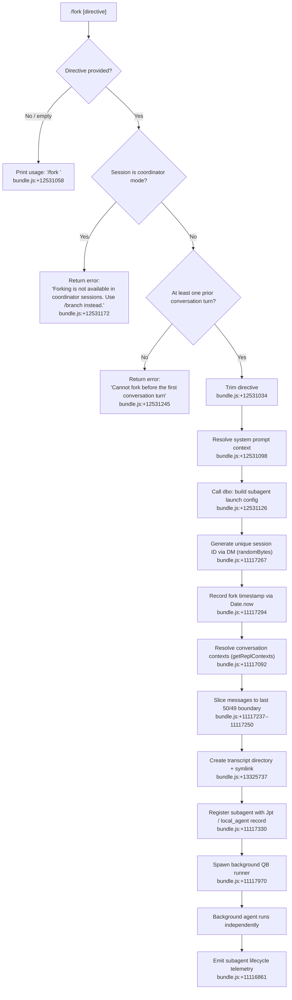

# `/fork`

> Analysis basis: CC v2.1.190 bundle.js (AST extraction + Claude interpretation)
> Minimum version: v2.1.190

---

## Overview

`/fork` spawns a background agent that inherits the full current conversation context, then runs a user-supplied directive independently. The command is a `local-jsx` type that triggers an asynchronous subagent launch via the handler `hgf` (resolved through module `wMl`). The spawned agent operates in a separate process with its own transcript, working directory symlink, and lifecycle tracking.

---

## Registration

| Field | Value |
|---|---|
| type | `local-jsx` |
| name | `fork` |
| description | Spawn a background agent that inherits the full conversation |
| argumentHint | `<directive>` |
| module_id | `wMl` |
| load_inline | `true` |
| loc_byte | `12531475` |
| loc_byte_end | `12531678` |
| loc_line | `8548` |
| arbor_handler.name | `hgf` |
| arbor_handler.fqn | `claude-2.1.190::hgf` |
| arbor_handler.kind | `AsyncFunction` |
| arbor_handler.resolution_path | `module_id` |
| arbor_handler.n_hits | `0` |

Analysis basis: CC v2.1.190 bundle.js:+12531475

---

## Input Branching

The handler has four or more distinct branches (directive missing → usage message; coordinator session detected → error; no prior turn → error; directive present → fork proceeds). A Mermaid flowchart is used.



---

## Behavioral Spec

### Entry point — handler `hgf`

```
async function forkCommandHandler(userInput, appContext):
    directive = userInput.trim()                          // bundle.js:+12531034
    if directive is empty:
        print "Usage: /fork <directive>"                  // bundle.js:+12531058
        return

    if appContext.sessionMode == "coordinator":
        return error("Forking is not available in coordinator sessions. Use /branch instead.")
                                                          // bundle.js:+12531172
    if conversationHasNoTurns(appContext):
        return error("Cannot fork before the first conversation turn")
                                                          // bundle.js:+12531245

    systemPromptContext = resolveSystemPrompt(appContext) // bundle.js:+12531098
    subagentConfig = buildSubagentConfig(directive, systemPromptContext, appContext)
                                                          // bundle.js:+12531126
    spawnedAgent = launchSubagent(subagentConfig)         // bundle.js:+12531167
    return spawnedAgent
```

Analysis basis: CC v2.1.190 bundle.js:+12531034

---

### Sub-feature: `buildSubagentConfig` (maps to `dbo`)

Constructs the full launch configuration for the forked agent.

```
function buildSubagentConfig(directive, systemContext, appContext):
    emit telemetry("subagent_launch")                     // bundle.js:+11116861
    emit telemetry("subagent_fork_coordinator_mode")      // bundle.js:+11116879

    // If directive is missing at this layer, emit diagnostic
    if not directive:
        emit telemetry("subagent_fork_prompt_missing")    // bundle.js:+11117003

    sessionType = "fork"                                  // bundle.js:+11117052
    // (alternative resume = "resume"                     // bundle.js:+11117171)

    // Resolve working directory, allowed/disallowed tools, permission_mode,
    // bypassPermissions, session, effort, model, max_thinking_tokens,
    // flag_settings from appState via getAppState()     // bundle.js:+11118652

    // Strip messages: keep last 50 characters (slice boundary)
    // bundle.js:+11117237 (value 50) and +11117250 (value 49)
    contextMessages = getReplContexts(appContext)         // bundle.js:+11117092
    trimmedMessages = trimToLastNMessages(contextMessages, 50)

    // Generate a session ID with randomBytes (63 bytes → hex, 8 chars)
    // bundle.js:+27977 (63), +28003 (8), +28015 ("hex")
    newSessionId = generateHexId()

    timestamp = Date.now()                                // bundle.js:+11117294

    agentRecord = {
        type: "local_agent",                              // bundle.js:+10452341
        status: "running",                                // bundle.js:+10452386
        purpose: "general-purpose",                       // bundle.js:+10452504
        sessionId: newSessionId,
        startedAt: timestamp,
        directive: directive
    }

    return {
        sessionId: newSessionId,
        messages: trimmedMessages,
        systemContext: systemContext,
        agentRecord: agentRecord,
        launchOptions: { type: "subagent", mode: "spawn" } // bundle.js:+11117776/11117866
    }
```

Analysis basis: CC v2.1.190 bundle.js:+11116846

---

### Sub-feature: transcript directory creation (maps to `Y_e` / `fut`)

The fork infrastructure creates a persistent directory for the new agent's transcript before launching:

```
function createTranscriptDirectory(sessionId, baseDir):
    mkdir(path.join(baseDir, sessionId))                  // bundle.js:+13323256
    symlink(sourceDir, targetLink)                        // bundle.js:+13325737
    // Handles EEXIST gracefully                          // bundle.js:+13325774
    register in file lock set (VJn, v9l)                 // bundle.js:+13323363
    return transcriptPath
```

Analysis basis: CC v2.1.190 bundle.js:+13325737

---

### Sub-feature: agent session registration (maps to `Jpt` / `aC`)

Registers the forked session in the local agent registry before the background loop starts:

```
function registerForkedAgent(agentRecord, transcriptPath):
    // Record start time
    startedAt = Date.now()                                // bundle.js:+13326805
    // Store agent metadata in registry map
    registry.set(agentRecord.sessionId, {
        status: "pending",                                // bundle.js:+13326759
        type: "local_agent",                              // bundle.js:+10452341
        transcriptPath: transcriptPath
    })
    registerAbortHandler()                                // bundle.js:+10452706
```

Analysis basis: CC v2.1.190 bundle.js:+10452294

---

### Sub-feature: background agent runner (maps to `QB`)

The core execution loop of the forked agent. It is long-running and handles the full lifecycle:

```
async function backgroundAgentRunner(config, appState):
    // Build system prompt                                // bundle.js:+9196077
    // Resolve MCP tool set                               // bundle.js:+9186395
    // Set up tool lists: allowed, disallowed             // bundle.js:+11118752
    // Resolve permissions (bypassPermissions, permission_mode)
    //   bundle.js:+10789014 / +10788983
    // Start agent loop via zt()                          // bundle.js:+9189477
    // Emit hook events: SubagentStart, SubagentStop      // bundle.js:+13359609/13401546
    // On completion, call subagent lifecycle handler     // bundle.js:+8905119
    // Persist transcript to .jsonl + .meta.json          // bundle.js:+13223917/13223815
```

Analysis basis: CC v2.1.190 bundle.js:+9186077

---

### Sub-feature: subagent lifecycle tracking (maps to `A6e`, `S6e`, `H_e`)

The forked agent emits structured lifecycle telemetry and tracks its run state:

```
function trackAgentLifecycle(agentId, event):
    switch event:
        case "completed":                                 // bundle.js:+10445526
            emit "subagent_complete"                      // bundle.js:+8909260
        case "stalled":
            emit "subagent_stall_timeout"                 // bundle.js:+8909280
        case "cancelled":                                 // bundle.js:+8912605
            emit "tengu_agent_tool_terminated"
        case "async_errored":
            emit "subagent_async_errored"                 // bundle.js:+8913300
    updateRegistry(agentId, status)
```

Analysis basis: CC v2.1.190 bundle.js:+8907808

---

### Sub-feature: permission mode resolution (maps to `N2` within `Or`)

The forked agent inherits permission settings but they are evaluated fresh:

```
function resolvePermissionMode(appState):
    // Reads: permission_mode, bypassPermissions, disable
    // bundle.js:+10788983, +10789014, +3395553
    // If bypassPermissions is set, applies "bypassPermissions" mode
    // Otherwise falls back to session permission_mode
    // Emits tengu_disable_bypass_permissions_mode when disabling bypass
    //   bundle.js:+3395452
    return resolvedMode
```

Analysis basis: CC v2.1.190 bundle.js:+10789036

---

### Sub-feature: system prompt assembly (maps to `uR`)

Constructs the system prompt delivered to the forked agent. The prompt assembles many configurable sections:

```
function assembleSystemPrompt(config):
    sections = []
    // Core identity section (heron_brook, fable_identity, task_continuity flags)
    //   bundle.js:+13476583, +13475830, +13475797
    // Environment info (env_info_static or env_info_simple)
    //   bundle.js:+13476168, +13476205
    // Language / output style                            // bundle.js:+13476243/13476278
    // bg-session marker                                  // bundle.js:+13476308
    // Scratchpad section                                 // bundle.js:+13476368
    // Context management (brief flag)                    // bundle.js:+13476396/13476435
    // Reproduce-verify workflow                          // bundle.js:+13476489
    // Act-dont-rederive                                  // bundle.js:+13476540
    // autonomy_append                                    // bundle.js:+13476611
    // Memory directives (kxt)                            // bundle.js:+13476126
    // Tool-param JSON                                    // bundle.js:+13475878
    // SDK marker                                         // bundle.js:+13476035
    // Note for agents: cwd reset between bash calls
    //   bundle.js:+13481842
    return sections.join("\n")
```

The assembled system prompt carries a `bg-session` session-type marker (bundle.js:+13476308) and a `bg` output-style flag (bundle.js:+13482856) that distinguish forked agents from the primary session.

Analysis basis: CC v2.1.190 bundle.js:+11118814

---

### Sub-feature: coordinator-mode guard

```
function checkCoordinatorMode(appContext):
    // literal "subagent_fork_coordinator_mode" is logged  // bundle.js:+11116879
    // "coordinator" role is checked in session metadata
    if appContext.role == "coordinator":
        return "Forking is not available in coordinator sessions. Use /branch instead."
                                                          // bundle.js:+12531172
    return null
```

Analysis basis: CC v2.1.190 bundle.js:+12531172

---

### Sub-feature: watchdog / stall detection (maps to `A6e` inner loop)

The background runner sets a stream watchdog to detect stalled agents:

```
function watchdog(agentId, config):
    timer = setTimeout(stallTimeout, config.stall_ms)    // bundle.js:+8907944 (600000 ms)
    on stream activity: reset timer
    on timeout:
        emit "tengu_async_agent_stall_timeout"            // bundle.js:+8909020
        emit event "watchdog_stall"                       // bundle.js:+8908601
        abort agent
```

Stall timeout: 600,000 ms (10 minutes). Analysis basis: CC v2.1.190 bundle.js:+8907944

---

## State & Side Effects

| Item | Detail |
|---|---|
| Telemetry: subagent_launch | Fired at fork start (bundle.js:+11116861) |
| Telemetry: subagent_fork_coordinator_mode | Fired when checking coordinator guard (bundle.js:+11116879) |
| Telemetry: subagent_fork_prompt_missing | Fired if directive is absent at config layer (bundle.js:+11117003) |
| Telemetry: tengu_async_agent_stall_timeout | Fired on watchdog expiry (bundle.js:+8909020) |
| Telemetry: tengu_agent_tool_terminated | Fired on agent cancellation (bundle.js:+8912703) |
| Telemetry: tengu_agent_summary_skipped | May fire if agent summary is skipped (bundle.js:+8814680) |
| Telemetry: tengu_forked_agent_default_turns_exceeded | Fires when fork agent exceeds default turn limit (bundle.js:+10787456) |
| Telemetry: tengu_async_agent_stranded_tools_cleared | Fires on stranded tool cleanup (bundle.js:+8909980) |
| Telemetry: tengu_agent_tool_completed | Fires when forked tool use completes (bundle.js:+8904824) |
| Telemetry: tengu_auto_mode_decision | Fires during auto/handoff classifier evaluation (bundle.js:+8906523) |
| Transcript | A `.jsonl` file + `.meta.json` written to a new subdirectory under the sessions store (bundle.js:+13223917) |
| Symlink | A filesystem symlink is created in the transcript directory (bundle.js:+13325737) |
| Agent registry | New `local_agent` record inserted with `status: "running"` (bundle.js:+10452386) |
| AbortController | Registered for the forked session to allow parent-initiated kill (bundle.js:+10452706) |
| appState changes | `setAppState` called by background runner to update agent tracking (bundle.js:+10731433) |
| Hook registration | SubagentStart and SubagentStop hooks fired (bundle.js:+13359609, +13401546) |
| Sound | <!-- TODO: not found in depth-2 traversal; needs --depth 4 --> |

---

## Version History

| Version | Change |
|---|---|
| v2.1.190 | Initial analysis |

---

## Common Mistakes

1. **Running `/fork` in coordinator mode**: The command explicitly blocks forking when the session role is `coordinator` (e.g., when running inside a multi-agent orchestration session). Use `/branch` instead in that context.
2. **Running `/fork` before any conversation turn**: The handler checks that at least one prior turn exists before forking. Running it as the very first command produces the error "Cannot fork before the first conversation turn".
3. **Omitting the directive**: Typing `/fork` with no argument prints the usage line (`Usage: /fork <directive>`) and does nothing. The directive is mandatory.
4. **Expecting synchronous output**: The forked agent runs asynchronously in the background. The parent session continues immediately; the fork's output appears in its own background session transcript, not the current REPL.
5. **Assuming full message history is passed**: The implementation slices conversation history to the last ~50 messages before passing to the forked agent (bundle.js:+11117237). Very long parent conversations are truncated.
6. **Expecting the same working directory state**: The forked agent resets its cwd between bash calls and always uses absolute paths (bundle.js:+13481842). Relative path assumptions from the parent session do not carry over.

---

## Appendix — Identifier Mapping

> For bundle debugging only. Identifiers change across versions.

| Identifier | Role |
|---|---|
| `hgf` | Main fork command handler (AsyncFunction, entry point) |
| `dbo` | Build subagent launch configuration |
| `f7p` | Assemble full agent runner options (getAppState, tool lists, uR) |
| `uR` | System prompt assembly orchestrator |
| `QB` | Background agent runner (long-running REPL loop) |
| `A6e` | Core agent execution / lifecycle loop |
| `H_e` | Agent state update handler (state machine transitions) |
| `S6e` | Agent status updater (speculation, abort, progress) |
| `Jpt` | Agent session registrar (transcript dir, registry) |
| `Y_e` | Transcript directory creation (mkdir, symlink) |
| `fut` | Transcript file open/finalize helper |
| `VJn` | File-lock set manager for transcript operations |
| `PDo` | Transcript subdirectory mkdir helper |
| `gm` | Transcript path joiner (MDo.join) |
| `Or` | App-state reader for subagent context (working_directory, tool lists) |
| `G8n` | Working directory resolver from app state |
| `W8n` | Disallowed tools resolver from app state |
| `N2` | Permission mode resolver (bypassPermissions, disable) |
| `aC` | Agent start-time recorder (Date.now, gm) |
| `Kdo` | Subagent result / completion handler |
| `vBa` | Subagent streaming / summary result processor |
| `C0` | Stream event processor for background agent |
| `M3n` | Agent metrics / turn-duration updater |
| `g3a` | Agent final-state emitter (pH, Le, yWn) |
| `h3a` | Agent transcript updater (updateTranscript) |
| `LBa` | Agent loop advance / ldt dispatcher |
| `ldt` | Local task dispatch record (VT, Date.now) |
| `xul` | Directive trim helper |
| `DM` | Session ID generation (randomBytes, hex) |
| `w9` | Fork session config resolver |
| `Is` | CLI error reporter (dqe, iT, process.exit) |
| `Re` | Feature flag reader (W, Pe) |
| `Le` | Feature-ok flag reader (W, Pe) |
| `Pe` | Feature gate evaluator (aKe) |
| `_v` | Agent memory loader (nt, cw, la) |
| `pte` | Tool set resolver for subagent |
| `vk` | Model + provider resolver (v9, cb, Da, Qo) |
| `Qo` | Model alias resolver (fable, sonnet, haiku, opus, best) |
| `Da` | Model descriptor builder |
| `dC` | Hook execution engine (SubagentStart, SubagentStop, etc.) |
| `Tte` | Subagent tool execution batch runner |
| `qdo` | Tool batch filter / queue builder |
| `Vdo` | Tool permission evaluator |
| `Wdo` | Tool name/env splitter |
| `oGn` | Conversation context rebuilder (p2p, f2p, d2p, m2p) |
| `d2p` | Tool-result message filter |
| `f2p` | Tool-use message filter |
| `p2p` | Assistant message filter |
| `m2p` | Mixed message filter |
| `cYa` | Message normaliser for context rebuild |
| `uge` | State dump/load helper |
| `HB` | Session hydration primitive |
| `he` | Subagent session driver (ie, Dua, MCP setup) |
| `ie` | Full agent session initialiser |
| `Dua` | MCP server connection manager for forked session |
| `en` | Agent session run entry (eEe, fEe, $A, we) |
| `eEe` | Plugin refresh / tool registration |
| `$A` | Tool list builder / deduplicator |
| `zt` | Background REPL loop scheduler (xNo, nn, mVt, Lt) |
| `xNo` | Event stream bridge (worker → REPL) |
| `nn` | Background session configuration renderer |
| `j5` | Per-turn query dispatcher (HVp, YWn) |
| `HVp` | Core turn query engine (model calls, tool drain, compaction) |
| `YWn` | Post-turn agent cleanup / session exit |
| `Kfo` | Response length / streaming token tracker |
| `Ey` | Compact-boundary event emitter |
| `ekf` | Compact token writer |
| `npt` | Skill progress tracker |
| `D_e` | Subagent task record creator (dC, od, jw) |
| `od` | Tool registry entry builder |
| `TDp` | MCP tool loader for subagent (K4, kB, Unt) |
| `kB` | Plugin/enterprise MCP config loader |
| `K4` | MCP server entry builder |
| `rpt` | Agent metadata / transcript writer (.meta.json, .jsonl) |
| `q3l` | jw-based path resolver for transcript |
| `Rc` | Fork context reference builder ("fork-context-ref") |
| `Ace` | AWe-based context filter |
| `AWe` | Fork context assembler (IJn, UJn, Mvf) |
| `Vfo` | Fork context reference emitter |
| `f4n` | App state initialiser for subagent session |
| `h4n` | MCP tool set resolver for agent (P$, MGt, xGt, RY) |
| `yll` | Tool cache manager (RGt, lye) |
| `bVr` | Tool deduplifier / tool-set builder |
| `iA` | Feature flag evaluator (Eai, ZUr, Sai) |
| `Fy` | Feature VL flag reader |
| `c6e` | Exponential backoff timer (Math.pow, Math.max) |
| `aA` | Tool availability checker (Qo, nl, Eo) |
| `RY` | Tool allowlist updater (AJn, t.add, e.filter) |
| `MGt` | Tool filter by MCP server (P$, eL, AJn) |
| `xGt` | Tool dedup set builder |
| `cae` | Tool filter validator (L3l) |
| `rK` | Tool registry key resolver |
| `Yaa` | Subagent span tracer (Bae, uF, e9e, qD, VLe) |
| `VLe` | OTel context propagator (Wge.enterWith) |
| `uF` | Active tracer accessor (Wge.active) |
| `e9e` | Span start helper (K2e) |
| `qD` | Span attribute setter |
| `Xaa` | Span end / cleanup (Z3e, KLe) |
| `Z3e` | Span status setter |
| `KLe` | Post-span context restorer |
| `J3e` | Session map cleanup (mxn.delete, qJr.delete) |
| `qfo` | Tool registry cleanup (RGt.delete) |
| `ABa` | App state flush / YT/T writer |
| `f_e` | State update with flush (t.update, YT, clearTimeout, pH) |
| `SBa` | Parallel appState resolver (t.all) |
| `cce` | AppState message appender (NA, m0p) |
| `IBa` | Tool set initialiser for fork (Object.keys, T, e.add) |
| `Tte` | Main subagent tool batch executor (qdo, Vdo, Wdo, Xm, Kpe) |
| `gv` | Tool execution logger (r9, Za, nt, it) |
| `oC` | Tool result renderer (nt, Xir) |
| `Xm` | Tool output serialiser (Tlu, Ek, Ilu, blu) |
| `s0` | String segment joiner (e.split, o.join) |
| `Kpe` | Tool completion handler (m9) |
| `ql` | Queue/list primitive |
| `f3a` | Tool prefilter (it) |
| `p0` | Tool permission check (Dt, xKt, Object.hasOwn, KEi) |
| `H3n` | Env/header builder (p0, Eo, Object.entries) |
| `V` | Background task scheduler (y, g, sOt, Gwn, uae) |
| `sOt` | Scheduler slot calculator (Drt, SMd.test, Math.min, P3i) |
| `Gwn` | Grace-period calculator (Drt, P3i, Math.max) |
| `Odc` | Boolean coercion helper |
| `eK` | Task-has-seen-set checker |
| `uae` | Async agent cleanup helper (Prt, oOt) |
| `Qae` | UI state updater (c0e, tR, Kit) |
| `c0e` | App state setter for spinner/mode (aHe.setState, Kit) |
| `Kit` | Ur-based state kit |
| `L` | Background session lifecycle loop (Date.now, PVt, J2l, B2e) |
| `f` | Background session process manager (D.kill, n.get, uV.spawn) |
| `wdo` | Tool-set diff tracker (t.add, e.filter, o.some) |
| `On` | UUID generator wrapper (MP.randomUUID) |
| `R9t` | Unique turn ID generator (MP.randomUUID) |
| `pkp` | Parent-kill permission gate (A3n.has, b3n) |
| `bx` | Tool name lowercaser / classifier (sbe.has) |
| `Su` | Hook event emitter (K2e, BEt, o.split, a.emit) |
| `$he` | Hook event type mapper ($Dt) |
| `Rr` | Nonconforming result handler (Ng, Ve) |
| `Zm` | Fallback credit resolver (Ng, Ve) |
| `km` | Token counter (nt) |
| `mVt` | Sequence replace helper (e.replace) |
| `Lt` | Message write batcher (dt.writeMessages, F.slice) |
| `x3n` | Tool filter wrapper (Kl) |
| `Kl` | Tool list filterer (e.filter) |
| `P3n` | Tool permission checker (rWe) |
| `rWe` | Read/search command guard (rl, I_e, r.isSearchOrReadCommand) |
| `rl` | Recursive object resolver (YSi, XSi, Ild) |
| `vBa_On` | UUID injector for agent sessions |
| `SOt` | Session observer tracker |
| `y0e` | Session cleanup helper |

---

Note: index built via Arbor fallback; some signals (telemetry, literals) may be missing — see arbor-fallback.js.