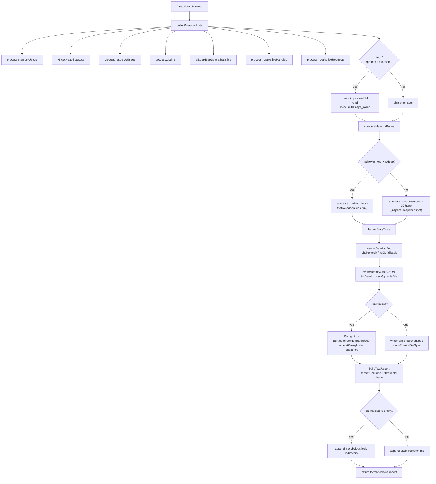

# `/heapdump`

> Analysis basis: CC v2.1.190 bundle.js (AST extraction + Claude interpretation)
> Minimum version: v2.1.190

---

## Overview

`/heapdump` is a hidden diagnostic command that captures a comprehensive snapshot of the Node.js/Bun process memory state and writes it to the user's Desktop directory. It collects V8 heap statistics, memory usage counters, resource usage metrics, open file-descriptor lists, smaps data (Linux), and a full `.heapsnapshot` file, then returns a formatted text report summarising memory health and guiding the user toward the heap snapshot for deeper inspection in Chrome DevTools.

---

## Registration

| Field | Value |
|---|---|
| type | `local` |
| name | `heapdump` |
| description | `Dump the JS heap to ~/Desktop` |
| supportsNonInteractive | `true` |
| isHidden | `true` |
| module_id | `RPl` |
| load_inline | `true` |
| loc_byte | `12630965` |
| loc_byte_end | `12631393` |
| loc_line | `8670` |
| arbor_handler.name | `NHf` |
| arbor_handler.fqn | `claude-2.1.190::NHf` |
| arbor_handler.kind | `AsyncFunction` |
| arbor_handler.resolution_path | `module_id` |
| arbor_handler.n_hits | `0` |

Analysis basis: CC v2.1.190 bundle.js:+12630965

---

## Input Branching

The command has more than three distinct execution branches (runtime environment detection, memory-ratio analysis, platform-specific reporting, and heap-snapshot generation path). A Mermaid flowchart is used.



---

## Behavioral Spec

### Top-level Handler (`NHf`)

```
async function heapdumpHandler(args):
    lines = []
    lines.push("Open the .heapsnapshot in Chrome DevTools → Memory → Load to inspect retainers.")
    statsReport = await collectAndDumpMemory()
    lines.push(...statsReport)
    return lines.join("\n")          // returned as type "text"
```

Analysis basis: CC v2.1.190 bundle.js:+12629834 (call to `Rko`), +12629953 (call to `UHf`), +12629980 (`t.push`), +12630102 (`t.join`)

---

### Memory Statistics Collection (`LPl`)

```
async function collectMemoryStats():
    mem   = process.memoryUsage()           // rss, heapTotal, heapUsed, external, arrayBuffers
    heap  = v8.getHeapStatistics()          // total_heap_size, used_heap_size, heap_size_limit, …
    res   = process.resourceUsage()         // maxRSS, userCPUTime, systemCPUTime, …
    up    = process.uptime()                // seconds since start

    spaces = v8.getHeapSpaceStatistics()    // per-space breakdown
    handles  = process._getActiveHandles().length
    requests = process._getActiveRequests().length

    // Linux-only: open file descriptors
    fdList = []
    try:
        fdList = await fs.readdir("/proc/self/fd")
    catch:
        pass   // non-Linux silently skips

    // Linux-only: smaps_rollup for native (non-heap) memory
    smapsText = ""
    try:
        smapsText = await fs.readFile("/proc/self/smaps_rollup", "utf8")
    catch:
        pass

    // bun:jsc module loaded for Bun-specific introspection
    jsc = require("bun:jsc")    // used later for generateHeapSnapshot

    // Divide sizes by 1048576 to convert to MB
    MB = 1048576
    rssGB  = mem.rss / MB / 1000     // convert MB → GB for ratio
    heapGB = heap.used_heap_size / MB / 1000

    // Native overhead = rss − (heap + external + arrayBuffers)
    nativeMB = (mem.rss - mem.heapTotal - mem.external) / MB
    if nativeMB > (heap.used_heap_size / MB):
        leakHints.push("Native memory > heap - leak may be in native addons (node-pty, sharp, etc.)")

    // fd count threshold: flag if > 100
    if fdList.length > 100:
        leakHints.push("High open-fd count: " + fdList.length)

    // uptime threshold: 3600 seconds
    if up > 3600:
        // note long uptime in report

    return { mem, heap, res, up, spaces, handles, requests, fdList, smapsText, leakHints }
```

Analysis basis: CC v2.1.190 bundle.js:+12625997 (`process.memoryUsage`), +12626021 (`v8.getHeapStatistics`), +12626047 (`process.resourceUsage`), +12626073 (`process.uptime`), +12626098 (`v8.getHeapSpaceStatistics`), +12626140 (`_getActiveHandles`), +12626177 (`_getActiveRequests`), +12626228 (`readdir`), +12626290 (`readFile`), +12626388 (`bun:jsc`), +12626529 (constant `3600`), +12626534 (constant `1048576`), +12626681 (constant `100`)

---

### Desktop Path Resolution (`eos`)

```
function resolveDesktopPath(filename):
    home = os.homedir()               // U_r.homedir()

    // WSL detection: check for /mnt/c/Users
    if platform indicates WSL:
        // iterate /mnt/c/Users, skip "Public", "Default", "Default User", "All Users"
        winHome = findFirstRealUser("/mnt/c/Users")
        return path.join(winHome, "Desktop", filename)

    // macOS / Linux fallback
    return path.join(home, "Desktop", filename)
```

Analysis basis: CC v2.1.190 bundle.js:+12628792 (call to `eos`), +1105044 (`U_r.homedir`), +1105080 (`vf.join`), +1105090 (literal `"Desktop"`), +1105312 (literal `"/mnt/c/Users"`), +1105356–1105420 (skip-list literals)

---

### Heap Snapshot and Stats File Write (`Rko`)

```
async function dumpHeapToDesktop():
    stats   = await collectMemoryStats()        // LPl
    desktop = resolveDesktopPath(...)           // eos
    ts      = formattedTimestamp()              // T

    // Write JSON stats file (permissions 0o600 = 384 decimal)
    statsPath = path.join(desktop, "claude-memory-" + ts + ".json")
    await fs.writeFile(statsPath, JSON.stringify(stats), { mode: 384 })

    // Emit telemetry
    emit("tengu_heap_dump")

    // Write heap snapshot
    snapshotPath = path.join(desktop, "claude-" + ts + ".heapsnapshot")
    writeHeapSnapshot(snapshotPath)             // OHf

    // Format and return text report
    report = formatReport(stats, snapshotPath) // o + UHf
    return report
```

Analysis basis: CC v2.1.190 bundle.js:+12628496 (call `kt`), +12628509 (call `LPl`), +12628555 (call `T`), +12628597 (call `o`), +12628792 (call `eos`), +12628804 (call `Wt`), +12628901 (`kko.join`), +12628944 (`Mgt.writeFile`), +12628960 (call `Me`/stringify), +12628979 (literal `384`), +12629035 (call `OHf`), +12629086 (telemetry `tengu_heap_dump`), +12629264 (call `sp`)

---

### Heap Snapshot Writer (`OHf`)

```
function writeHeapSnapshot(outputPath):
    if runtime is Bun:
        Bun.gc(true)                                          // force GC before snapshot
        snapshot = Bun.generateHeapSnapshot()
        // snapshot format: "v8" / "arraybuffer"
        fs.writeFileSync(outputPath, snapshot)
    else:
        // Node.js path via wPl (v8 module writeHeapSnapshot)
        fs.writeFileSync(outputPath, v8HeapSnapshotBuffer)
```

Analysis basis: CC v2.1.190 bundle.js:+12629514 (`wPl.writeFileSync`), +12629534 (`Bun.generateHeapSnapshot`), +12629559 (literal `"v8"`), +12629564 (literal `"arraybuffer"`), +12629591 (`Bun.gc`)

---

### Report Formatter (`UHf`)

```
function buildTextReport(stats, snapshotPath):
    MB = 1048576
    lines = []

    // Memory ratio decision
    nativeMB = (rss - heapTotal - external) / MB
    heapUsedMB = heapUsed / MB
    totalMB  = Math.max(rss, heapTotal) / MB

    if heapUsedMB / totalMB is dominant:
        lines.push("— most memory is JS heap (inspect the .heapsnapshot)")
    else:
        lines.push("— most memory is native (NOT in the .heapsnapshot)")

    // Column-aligned table of key metrics (8-column padding)
    for each metric in [rss, heapUsed, heapTotal, external, nativeMB, handles, requests, uptime]:
        lines.push(formatColumn(metric, value))

    // Heap space breakdown
    for space in v8.getHeapSpaceStatistics():
        lines.push(formatSpaceLine(space))

    // Leak indicators
    if leakHints is empty:
        lines.push("  (no obvious leak indicators)")
    else:
        for hint in leakHints:
            lines.push(hint)

    // 1 GB threshold note
    if rss > 1073741824:
        lines.push(Dgt warning message)

    return lines
```

Analysis basis: CC v2.1.190 bundle.js:+12629953 (call `UHf`), +12630209 (`Math.max`), +12630277 (literal `"— most memory is JS heap…"`), +12630337 (literal `"— most memory is native…"`), +12630474 (literal `"  (no obvious leak indicators)"`), +12630521 (call `Dgt`), +12630609 (constant `8`), +12630883 (constant `1073741824`), +12629866 (literal `"text"` return type)

---

### Platform Detection / macOS memory (`Yt`, `Rko` branch)

```
function getPlatformMemoryInfo():
    if platform == "darwin" (macOS):
        // Use system command to get physical memory (1024-byte units)
        // parse output; unit conversion: value * 1024
        return macOSPhysicalMemoryBytes
    else:
        return null    // Linux uses smaps_rollup instead
```

Analysis basis: CC v2.1.190 bundle.js:+12627614 (call `Yt`), +12627621 (literal `"macos"`), +12627631 (constant `1024`), +12628040 (literal `"darwin"`)

---

### "No Obvious Leak" Diagnostic (`Rko` tail)

```
function appendLeakDiagnostic(stats, lines):
    if stats.leakHints is empty:
        lines.push("No obvious leak indicators. Check heap snapshot for retained objects.")
    // platform-specific additional notes appended here
```

Analysis basis: CC v2.1.190 bundle.js:+12627886 (literal `"No obvious leak indicators. Check heap snapshot for retained objects."`)

---

## State & Side Effects

| Item | Detail |
|---|---|
| Telemetry | `tengu_heap_dump` (bundle.js:+12629086); background-mode events `tengu_bg_proto_mismatch`, `tengu_bg_dispatch_stale_drop`, `tengu_bg_attach_legacy_autorespawn`, `tengu_bg_attach`, `tengu_bg_attach_stall_gave_up`, `tengu_bg_attach_stall_respawn`, `tengu_bg_attach_kick` (emitted by deeper call-graph layers, not directly by the command) |
| File writes | JSON stats file `claude-memory-<timestamp>.json` written to `~/Desktop` with mode `0o600` (decimal 384); `.heapsnapshot` file `claude-<timestamp>.heapsnapshot` written to same location |
| GC side-effect | `Bun.gc(true)` called (Bun runtime only) before snapshot generation to reduce noise |
| Process introspection | Reads `/proc/self/fd` and `/proc/self/smaps_rollup` on Linux; silently skipped on other platforms |
| appState changes | None observed in depth-2 traversal |
| Sound | None observed in depth-2 traversal |
| Hook registration | None observed in depth-2 traversal |
| Return type | `"text"` (bundle.js:+12629866) |
| Hidden | Yes — does not appear in `/help` or command autocomplete for normal users |
| Non-interactive | Supported (`supportsNonInteractive: true`) |

---

## Version History

| Version | Change |
|---|---|
| v2.1.190 | Initial analysis |

---

## Common Mistakes

1. **Expecting output files in the current working directory** — the command always writes to `~/Desktop` (or the WSL Windows Desktop). If `~/Desktop` does not exist (e.g., headless servers), the write will fail with a filesystem error.
2. **Running on non-Bun runtimes and expecting `Bun.generateHeapSnapshot`** — the snapshot path branches on Bun availability; on plain Node.js the V8 module path (`wPl.writeFileSync`) is used instead.
3. **Assuming the command is visible** — `isHidden: true` means it will not appear in autocomplete or `/help`; it must be typed exactly as `/heapdump`.
4. **Interpreting "native memory > heap" as a definitive leak** — the annotation `"Native memory > heap - leak may be in native addons (node-pty, sharp, etc.)"` is a hint only; it appears whenever the calculated native portion exceeds V8 heap used, which can be normal in some configurations.
5. **Opening the `.heapsnapshot` in a text editor** — these files can be hundreds of megabytes. The command itself advises loading them in Chrome DevTools → Memory → Load profile.
6. **Ignoring the auto-1.5GB label** — the literal `"auto-1.5GB"` (bundle.js:+12629152) appears in the report and refers to the V8 heap size limit; it is informational, not a configurable parameter for this command.

---

## Appendix — Identifier Mapping

> For bundle debugging only. Identifiers change across versions.

| Identifier | Role |
|---|---|
| `NHf` | Top-level async handler for `/heapdump` (Arbor-resolved entry point) |
| `Rko` | Core dump orchestrator — collects stats, resolves path, writes files, formats report |
| `LPl` | Memory statistics collector (process + V8 + Linux proc fs) |
| `kt` | Utility: timestamp / file-name formatter helper |
| `VL` | Low-level utility called by `kt` |
| `OHf` | Heap snapshot writer (Bun or Node.js branch) |
| `UHf` | Text report builder (column alignment, ratio analysis, leak hints) |
| `Dgt` | Threshold-exceeded warning formatter (>1 GB RSS) |
| `eos` | Desktop path resolver (macOS / Linux / WSL) |
| `T` | Logging / output helper (used across the call graph) |
| `Me` | JSON serialiser wrapper (`JSON.stringify`) |
| `fo` | Error constructor wrapper |
| `ke` | Error logging / telemetry helper |
| `nt` | String coercion utility |
| `Vi` | Error chain helper |
| `Jns` | Error formatting helper |
| `oou` | Rolling error-log queue manager (shift/push) |
| `sp` | String padding / column formatter |
| `W` | Generic utility called during report construction |
| `o` | Column-pad / table-row formatter |
| `wc` | Path / string manipulation utility |
| `p8o` | Path map helper |
| `hze` | Output writer helper |
| `e8o` | Low-level write wrapper |
| `iLc` | File-append / log-rotation utility |
| `WKe` | Buffered write / flush scheduler |
| `dpe` | Log-path computation helper |
| `xre` | Directory-check utility |
| `h8o` | Log file path builder |
| `Ncr` | Log rotation helper (stat, rename, unlink) |
| `sLc` | Log append + rotation orchestrator |
| `Ei` | Hook/signal registration helper |
| `nLc` | Output channel dispatcher |
| `w6o` | Channel codec helper |
| `RJf` | Background daemon protocol handler (large; reached via `H` stream) |
| `G5e` | TeammateMailbox mark-as-read helper |
| `H` | Stream/buffer accumulator (IPC framing) |
| `g` | Buffered-read / timeout helper |
| `m` | Process-pool / kill helper |
| `mp` | Stream-end helper |
| `be` | String coercion helper |
| `Wt` | Async wait / promise utility |
| `y` | Generic async map/iterator utility |
| `s` | Promise-set tracker (add / delete / finally) |
| `i` | Connection close helper |
| `Yt` | Platform command executor (used for macOS memory query) |