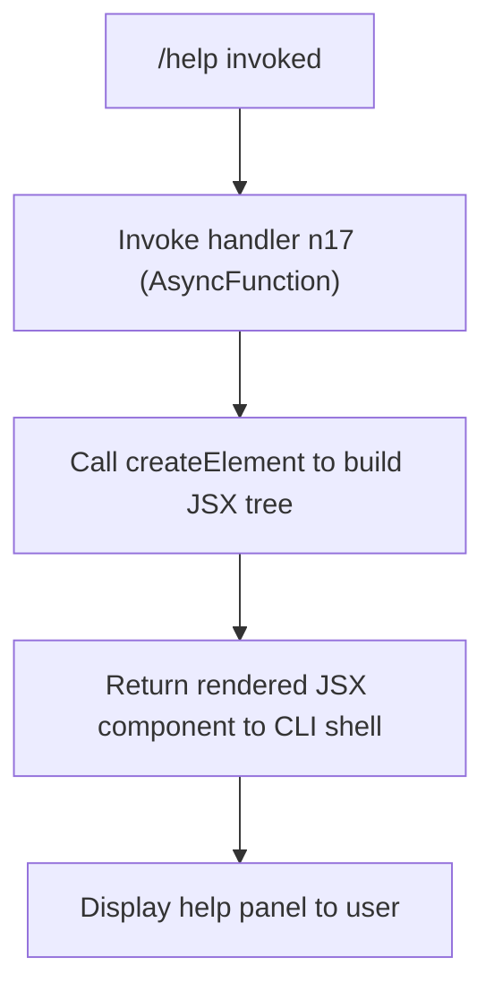

# `/help`

> Analysis basis: CC v2.1.132 bundle.js (AST extraction + Claude interpretation)
> Minimum version: v2.1.132

---

## Overview

The `/help` command is a locally-rendered, JSX-based slash command that displays help content and the list of available commands to the user within the Claude Code CLI session. Unlike prompt-type commands that dispatch a message to the agent, `/help` renders its response directly as a JSX component, making it a pure UI command with no LLM round-trip required.

---

## Registration

| Field | Value |
|---|---|
| type | `local-jsx` |
| name | `help` |
| description | `Show help and available commands` |
| module_id | `kHq` |
| load_inline | `true` |
| handler | `n17` (resolved via `module_id` path) |
| loc_byte span | `bundle.js:+10336831` – `+10336977` |
| `loc_byte_end` | `10336977` |
| `arbor_handler.name` | `n17` |
| `arbor_handler.kind` | `AsyncFunction` |
| `arbor_handler.resolution_path` | `module_id` |
| `arbor_handler.fqn` | `claude-2.1.132::n17` |
| `arbor_handler.n_hits` | `0` |

Analysis basis: CC v2.1.132 bundle.js:+10336831

The registration object occupies bytes `10336831`–`10336977` (inclusive) in the v2.1.132 bundle. The handler is an `AsyncFunction` resolved under the Arbor symbol graph as `claude-2.1.132::n17` via `module_id` resolution. Because `load_inline: true` is set, the module is inlined at registration time rather than being lazily imported from a separate module file.

---

## Input Branching

The `/help` command does not branch on user-supplied arguments according to the depth-2 call graph. The handler proceeds unconditionally to JSX rendering.



No argument-conditional branches were detected in the depth-2 traversal. Any argument text supplied after `/help` is either ignored or handled transparently inside the JSX component's own render logic, which is beyond the depth-2 boundary.

<!-- TODO: argument handling inside the JSX render tree not found in depth-2 traversal; needs --depth 4 -->

---

## Behavioral Spec

### Help Panel Rendering

The core behavior of `/help` is synchronous JSX construction followed by an immediate return to the CLI shell for display. The handler is an `AsyncFunction`, but based on the call graph the async boundary is a formality of the registration contract — the actual work is synchronous JSX element construction.

```
async function renderHelpPanel(inputArgs):
    # Build JSX tree via createElement
    component = createElement(HelpPanelComponent, props)

    # Return the component to the CLI shell renderer
    return component
    # The CLI shell is responsible for mounting and displaying the component
```

Analysis basis: CC v2.1.132 bundle.js:+10336716

#### Key behavioral properties

- **No LLM invocation**: Because the type is `local-jsx`, the command never dispatches a prompt to the Claude agent. The response is entirely client-rendered.
- **No telemetry events**: The depth-2 traversal found zero `tengu_*` telemetry calls in the handler. No usage data is emitted when a user runs `/help`.
- **No literals captured**: No string or numeric constants were found in the depth-2 traversal beyond what is encoded in the registration object itself (name, description). Any displayed help text is either embedded in the JSX component referenced by `createElement` or pulled from another module not reached within depth 2.
- **Async function wrapper**: The handler `n17` is declared `AsyncFunction`, consistent with the registration contract requiring all handlers to be awaitable, even when they perform no actual asynchronous work.

<!-- TODO: JSX component tree structure (help text content, command list source) not found in depth-2 traversal; needs --depth 4 -->

---

## State & Side Effects

| Item | Detail |
|---|---|
| Telemetry | None detected in depth-2 traversal |
| Hook registration | None detected in depth-2 traversal |
| `appState` changes | None detected in depth-2 traversal |
| Sound | None detected in depth-2 traversal |
| LLM dispatch | None — `local-jsx` type bypasses the agent entirely |
| Network I/O | None detected in depth-2 traversal |
| File I/O | None detected in depth-2 traversal |
| Render output | JSX component returned to CLI shell for display |

---

## Version History

| Version | Change |
|---|---|
| v2.1.132 | Initial analysis — registered as `local-jsx`, handler `n17`, module `kHq` |

---

## Common Mistakes

1. **Expecting an LLM response**: Because `/help` is type `local-jsx`, it never sends a message to the Claude agent. Users who expect Claude to generate a dynamic or context-aware help response will instead receive a statically rendered component. If dynamic help is needed, use a different mechanism.
2. **Passing arguments expecting filtering**: No argument-handling logic was found in the depth-2 traversal. Passing a command name (e.g. `/help clear`) may silently ignore the argument depending on the JSX component's own rendering logic, which is not confirmed within the analyzed depth.
3. **Assuming telemetry coverage**: Since no telemetry events are emitted, internal dashboards or usage metrics will not reflect `/help` invocations. Do not rely on telemetry to measure help command usage.
4. **Confusing `load_inline: true` with lazy loading**: This command is inlined at registration time, not lazily loaded on first invocation. There is no deferred-import cost on first use.

---

## Appendix — Identifier Mapping

> For bundle debugging only. Identifiers change across versions.

| Identifier | Role |
|---|---|
| `n17` | Async handler function for the `/help` command; constructs and returns the JSX help panel component (resolved via `module_id` path, `claude-2.1.132::n17`) |
| `MNA` | JSX runtime namespace; `MNA.createElement` is the element factory called by `n17` to build the help UI component tree (Analysis basis: CC v2.1.132 bundle.js:+10336716) |