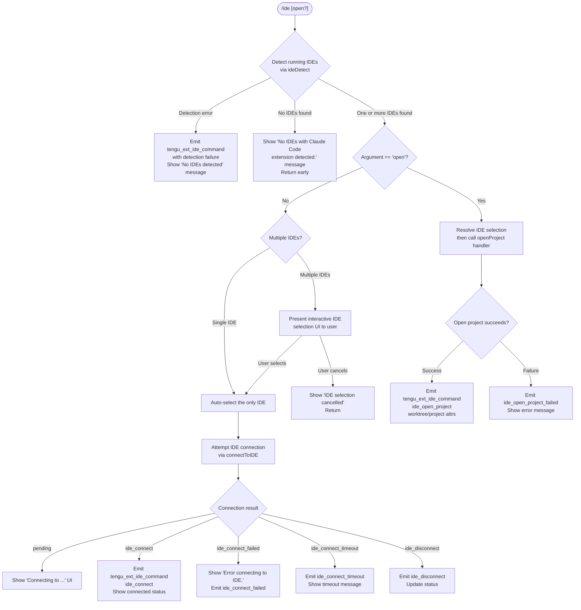

# `/ide`

> Analysis basis: CC v2.1.190 bundle.js (AST extraction + Claude interpretation)
> Minimum version: v2.1.190

---

## Overview

The `/ide` command manages IDE integrations for Claude Code — it detects running IDE instances that have the Claude Code extension installed, selects or presents a choice among them, optionally opens the current project inside the selected IDE, and reports the final connection status to the user. When called with the optional `open` sub-command argument it additionally triggers the IDE's "open project" workflow.

---

## Registration

| Field | Value |
|---|---|
| type | `local-jsx` |
| name | `ide` |
| description | `Manage IDE integrations and show status` |
| argumentHint | `[open]` |
| module_id | `F_l` |
| load_inline | `true` |
| loc_byte | `11591055` |
| loc_byte_end | `11591211` |
| loc_line | `7283` |
| arbor_handler.name | `nrf` |
| arbor_handler.fqn | `claude-2.1.190::nrf` |
| arbor_handler.kind | `AsyncFunction` |
| arbor_handler.resolution_path | `module_id` |
| arbor_handler.n_hits | `0` |

Analysis basis: CC v2.1.190 bundle.js:+11591055

---

## Input Branching

Four distinct paths exist depending on the `open` argument flag and the results of IDE detection, making a Mermaid flowchart the appropriate representation.



Analysis basis: CC v2.1.190 bundle.js:+11587250 — +11590530

---

## Behavioral Spec

### Main Handler — `ideCommandHandler` (`nrf`)

```
async function ideCommandHandler(args, context):
    emit telemetry: tengu_ext_ide_command (initial call)       // +11587252

    if args contains "open":
        openRequested = true
    else:
        openRequested = false

    // --- IDE Detection ---
    detectedIDEs = await detectRunningIDEs()                   // cxn +11587410
    if detectedIDEs is empty:
        render "No IDEs with Claude Code extension detected."  // +11587467
        return

    // --- IDE Selection ---
    if no IDE previously selected (no current selection):
        render "No IDE selected."                              // +11587587
        selectedIDE = await promptUserToSelectIDE(detectedIDEs)
        if user cancelled:
            render "IDE selection cancelled"                   // +11590421
            return
    else:
        selectedIDE = currentIDE

    // --- Open Project (if requested) ---
    if openRequested:
        projectPath = resolveCurrentWorktreeOrProject()        // +11587819,+11587830
        result = await context.onInstallIDEExtension(          // +11588359
                    selectedIDE, projectPath)
        if result.ok:
            emit telemetry: ide_open_project                   // +11587785
        else:
            emit telemetry: ide_open_project_failed            // +11587892
            if result contains "Exited without opening IDE":   // +11588182
                show restart advice: "restart your IDE"        // +11588451
            return

    // --- Connection Status UI ---
    renderIDEStatusPanel(selectedIDE, context)                 // U_l component
```

Analysis basis: CC v2.1.190 bundle.js:+11587250

---

### IDE Detection — `detectRunningIDEs` (`cxn`)

```
async function detectRunningIDEs():
    port = parseInt(env or config port)                        // +6691007
    candidates = await gatherIDECandidatePaths()               // axn +6691056

    results = await Promise.all(
        candidates.map(candidate => probeIDEInstance(candidate))  // pzd +6691096
    )

    for each result:
        if result has valid pid and port:                      // +6691166
            check if process name matches known IDE patterns:
                // "windsurf", "devin", "cursor", "insiders",
                // "vscode", "vs code", "visual studio code",
                // "vscodium", "code - oss", "codium"          // +6693872..+6694104
            normalise display name                             // tL +6692001
            push to validated list

    if still no results on Linux:
        run ps-based fallback scan using shell command:        // +6695772
        // "ps aux | grep -E "code|cursor|windsurf|..."
        parse output for JetBrains / appcode entries           // +6696160

    emit telemetry: ide_detect on success                      // +6692362
    emit telemetry: ide_detect_failed on error                 // +6692426
    return validated list
```

Analysis basis: CC v2.1.190 bundle.js:+6691007

---

### IDE Candidate Path Gathering — `gatherIDECandidatePaths` (`axn` / `mzd`)

```
async function gatherIDECandidatePaths():
    searchRoots = [
        path.join(homedir(), ".claude", "ide"),               // +6688806, +6688728
        platform-specific paths
    ]

    // WSL: also check /mnt/c/Users paths                     // +6689013
    // Skip: Public, Default, Default User, All Users dirs    // +6689107..+6689171

    for each root:
        stat entries; skip symlinks and non-directories        // +6689049, +6689067
        resolve real paths to deduplicate                      // +6689468
        collect candidate descriptors

    return deduped list
```

Analysis basis: CC v2.1.190 bundle.js:+6688715

---

### IDE Instance Probing — `probeIDEInstance` (`pzd` / `ARr` / `Wr`)

```
async function probeIDEInstance(candidatePath):
    // Parse pid/port from candidate file                     // +2303577
    pid = parseInt(...)                                        // +2303917
    if isNaN(pid): return null

    // Probe process liveness with shell -c command           // +2303786,+2303792
    // Timeout: 3000ms                                        // +2303809
    // Max probe files per sweep: 1 000 000                   // +1139395
    if process not alive: return null

    return { pid, port, displayName, executablePath }
```

Analysis basis: CC v2.1.190 bundle.js:+2303577

---

### IDE Name Normalisation — `normaliseIDEName` (`tL`)

```
function normaliseIDEName(rawName):
    lower = rawName.toLowerCase()                              // +6696666
    baseName = path.basename(executablePath)                   // +6696724
    apply known-name mappings (z3e)                            // +6696798
    return normalised display string
```

Analysis basis: CC v2.1.190 bundle.js:+6696666

---

### IDE Type Classification — `classifyIDEType` (`taa` / `uxn`)

```
function classifyIDEType(name):
    lower = name.toLowerCase()
    if lower includes "windsurf": return "windsurf"            // +6693872
    if lower includes "devin":    return "devin"               // +6693896
    if lower includes "cursor":   return "cursor"              // +6693936
    if lower includes "insiders": return "insiders"            // +6693976
    if lower includes "vscode" | "vs code" | "visual studio code":
        return "vscode"                                        // +6694001..+6694046
    if lower includes "vscodium" | "code - oss" | "codium":
        return "vscodium"                                      // +6694080..+6694323
    if name ends with ".cmd":                                  // +6694455
        re-classify via basename
    return "unknown"
```

Analysis basis: CC v2.1.190 bundle.js:+6693842

---

### Open-Project Capability Detection — `buildIDECapabilities` (`OJr` / `Azd`)

```
async function buildIDECapabilities(selectedIDE):
    caps = await fetchIDECapabilityList()                      // Azd +6696298
    if caps includes "IDE":                                    // +6696611
        check Object.entries for open-project support         // +6695176
    return capabilitySet
```

Analysis basis: CC v2.1.190 bundle.js:+6696298

---

### Connection Status UI Component — `ideStatusPanel` (`U_l`)

```
React function ideStatusPanel(props):
    [connectionState, setConnectionState] = useState()         // +11589065
    appState = useAppState()                                   // Ht +11589085
    storeRef = useRef()                                        // +11589143
    useEffect(() => {
        subscribe to IDE connection events                     // +11589157
        on "ide_connect":    setConnectionState("connected")
                             emit telemetry ide_connect        // +11589282
        on "ide_connect_failed":
                             emit tengu ide_connect_failed     // +11589369
        on "ide_connect_timeout":
                             emit tengu ide_connect_timeout    // +11589476
        on "ide_disconnect": emit tengu ide_disconnect         // +11589975
    }, [])

    useCallback for "open" action                              // +11589564

    if connectionState == "pending":
        render "Connecting to <ideName>"                       // +11590304
    else if connectionState matches "ws:":                     // +11590079
        show WebSocket connection indicator

    render IDE name bold                                       // St.bold +11587846
    render connected IDEs list (up to 3 shown, rest "…")      // +11590795, +11590809

    // IDE list slice limit: 100 items max                     // +11590497
    // Random jitter constant: 0–2                             // +14095068
    // NFC normalisation applied to display names             // +11590638
```

Analysis basis: CC v2.1.190 bundle.js:+11589065

---

## State & Side Effects

| Item | Detail |
|---|---|
| Telemetry — `tengu_ext_ide_command` | Fired at command entry (bundle.js:+11587252) with sub-event label (ide_detect, ide_open_project, etc.) |
| Telemetry — `ide_detect` | Emitted when IDE detection completes successfully (bundle.js:+6692362) |
| Telemetry — `ide_detect_failed` | Emitted when IDE detection throws (bundle.js:+6692426) |
| Telemetry — `ide_open_project` | Emitted after a successful open-project call (bundle.js:+11587785); attributes include `worktree` and `project` |
| Telemetry — `ide_open_project_failed` | Emitted when the open-project call fails (bundle.js:+11587892) |
| Telemetry — `ide_connect` | Emitted when the UI component observes a successful IDE connection (bundle.js:+11589282) |
| Telemetry — `ide_connect_failed` | Emitted on connection failure (bundle.js:+11589369) |
| Telemetry — `ide_connect_timeout` | Emitted on connection timeout (bundle.js:+11589476) |
| Telemetry — `ide_disconnect` | Emitted when the IDE disconnects (bundle.js:+11589975) |
| Telemetry — `tengu_feature_ok` / `tengu_feature_bad` / `tengu_feature_sad` | General feature-outcome events shared across command infrastructure (bundle.js:+1025122, +1025189, +1025270) |
| appState changes | Connection state is surfaced via React state managed by `ideStatusPanel`; the broader app state store (`useAppState`) is read but not directly mutated by this command |
| MCP prefix registered | The string `"mcp__ide__"` (bundle.js:+11589872) is used to filter/identify IDE-originated MCP tool names |
| Transport channels | Uses `"sse-ide"` (bundle.js:+11585291) and `"ws-ide"` (bundle.js:+11585311) channel identifiers for IDE communication |
| Process management | Spawns or reuses background daemon workers to maintain the IDE socket connection; connection timeout hard-coded to 5000 ms (bundle.js:+17174922) |
| Hook registration | `context.onInstallIDEExtension` callback is invoked when `open` is requested (bundle.js:+11588359) |
| Sound | None observed |

---

## Version History

| Version | Change |
|---|---|
| v2.1.190 | Initial analysis |

---

## Common Mistakes

1. **Calling `/ide open` without the extension installed** — The command will invoke `onInstallIDEExtension` and then report "Exited without opening IDE" (bundle.js:+11588182) if the IDE extension is absent; the remedy shown is "restart your IDE" (bundle.js:+11588451).
2. **Expecting instant connection on first run** — The connection goes through a `"pending"` state while the daemon socket handshake completes; the UI shows "Connecting to …" during this phase (bundle.js:+11590304).
3. **Assuming any IDE is auto-detected on Linux** — On Linux the detection falls back to a `ps aux` grep (bundle.js:+6695772) which may miss IDE processes started under unusual names or process trees; run `/ide` again after launching the IDE.
4. **Running under WSL without Windows path access** — The path scanner looks for IDE candidate files under `/mnt/c/Users/…` (bundle.js:+6689013) but silently skips `Public`, `Default`, and `All Users` entries; permission errors on WSL mounts will cause detection to fall back gracefully to an empty list rather than surface an error.
5. **Using the argument `Open` (capital O)** — Argument matching uses case-insensitive normalisation (bundle.js:+11590638 NFC normalisation), but the canonical form is lower-case `open` as shown in the argumentHint.

---

## Appendix — Identifier Mapping

> For bundle debugging only. Identifiers change across versions.

| Identifier | Role |
|---|---|
| `nrf` | Main async handler for `/ide` command (`ideCommandHandler`) |
| `TCo` | IDE list rendering / display-name truncation helper |
| `cxn` | IDE detection orchestrator (`detectRunningIDEs`) |
| `axn` | IDE candidate path gatherer |
| `mzd` | IDE candidate file scanner (per search root) |
| `pzd` | IDE instance prober (reads pid/port file) |
| `ARr` | Process liveness checker for candidate IDE |
| `Wr` | Shell probe executor (sh -c with timeout) |
| `taa` | IDE type classifier (name → enum) |
| `uxn` | Extended IDE type classifier with basename fallback |
| `tL` | IDE name normaliser |
| `OJr` | IDE capability detection entry point |
| `Azd` | IDE capability list builder |
| `NC` | Capability negotiation / connection initialiser |
| `B1e` | Low-level IDE connection handler |
| `U_l` | React UI component — IDE status panel |
| `Ht` | App-state hook consumer |
| `y6r` | App-state context reader |
| `So` | Secondary app-state hook |
| `fd` | MCP skills context hook |
| `zT` | MCP tool hash / cleanup helper |
| `Hit` | MCP tool hash helper |
| `PLe` | MCP tool payload serialiser |
| `eL` | MCP skills telemetry emitter |
| `Un` | IDE connection initiator (wraps `Wr` + `Pt`) |
| `Pt` | Store accessor for IDE connection state |
| `Mrn` | Store getter helper |
| `gr` | Store utility |
| `VL` | Store value accessor |
| `cF` | IDE config/flag accessor |
| `nt` | Boolean-string normaliser ("yes"/"on") |
| `UDi` | Regex match helper for IDE arguments |
| `Qia` | Process kill utility |
| `naa` | String replacement utility for IDE display names |
| `Mt` | Feature outcome reporter |
| `kee` | IDE extension key lookup |
| `Xnf` | IDE extension name formatter |
| `Le` | Daemon "feature_ok" telemetry emitter |
| `Re` | Daemon "feature_bad" telemetry emitter |
| `Pe` | Daemon telemetry event firer |
| `W` | Telemetry logging utility |
| `Hm` | IDE command argument parser |
| `L3o` | Background session claim initiator |
| `EJf` | Claim send with timeout (5000 ms) |
| `SJf` | TCP socket connector for claim |
| `yJf` | Claim frame builder |
| `gR` | Binary frame encoder (UInt32BE + UInt8 wire format) |
| `P3o` | Background session lifecycle manager |
| `Di` | Session roster / state-file reader |
| `ec` | Session directory path resolver |
| `yg` | Session state updater |
| `S0` | State machine transition helper |
| `kd` | Session config writer |
| `Cm` | Atomic file write helper (randomBytes temp file) |
| `fy` | Session cache invalidator |
| `cht` | PTY socket claim handler |
| `Gq` | PTY socket roster reader |
| `wtf` | PTY auth-file writer |
| `Eve` | Session environment variable parser |
| `gCd` | Session environment key/value splitter |
| `D` | Background worker lifecycle controller |
| `VEc` | Worker state-file verifier |
| `kn` | ENOENT-tolerant stat helper |
| `T` | Subprocess spawner / logger |
| `nLc` | Log-level handler |
| `wc` | Subprocess argument formatter |
| `hze` | Log sanitiser |
| `iLc` | Subprocess environment builder |
| `ke` | Error formatter / logger |
| `fo` | Error string coercer |
| `Vi` | Essential-traffic queue manager |
| `oou` | Rolling log buffer (shift/push) |
| `XJf` | Version file reader (claude/versions) |
| `B2n` | Package version path builder |
| `d` | Supervisor write/state-update loop |
| `rqe` | File write validator (1 048 576 byte limit) |
| `y$l` | Column-width calculator |
| `GEc` | Heartbeat tick handler |
| `B2e` | Background session pin-file manager |
| `MDt` | Pin file path builder |
| `Vk` | Job directory path builder |
| `ECd` | Job directory scanner |
| `W1i` | Job directory creator + config copier |
| `Df` | File permissions checker |
| `U` | Idle-exit timer / "retireIfSettled" helper |
| `N` | Idle-exit threshold calculator |
| `M` | Write-drain timeout helper |
| `c` | Daemon connection stream wrapper |
| `F` | Interval disposer |
| `GXn` | Low-memory checker |
| `it` | macOS memory pressure reader |
| `Dt` | Memory snapshot recorder |
| `L` | Background session sweep / GC loop |
| `RJf` | IPC protocol message router (daemon ↔ worker) |
| `xJf` | Ping/pong frame handler |
| `bEc` | Dispatch rate-limiter / backpressure |
| `Xte` | Timing-safe control-key comparator |
| `coe` | Resume-ID link scanner |
| `kJf` | Worker kick handler |
| `LJf` | Attach-stall detector |
| `WXn` | Upgrade-attach handler |
| `DJf` | Terminal escape sanitiser |
| `K` | Terminal frame multiplexer |
| `H7t` | Terminal stream destroyer |
| `H` | Attach stream / buffer accumulator |
| `mp` | Stream end/write wrapper |
| `v_` | Background-service role marker |
| `x3o` | Dispatch ID tracker |
| `rue` | Respawn-stale watchdog |
| `J` | App-state MCP update handler |
| `j` | Voice recording toggle helper |
| `z` | Backspace key event interceptor |
| `q` | Close-event once listener |
| `X` | IZn stream writer |
| `m` | Worker kill iterator |
| `x` | Worker write/kill wrapper |
| `g` | setTimeout wrapper for streams |
| `_` | Background worker orchestrator |
| `nyt` | MCP server state reader |
| `yyc` | MCP server key enumerator |
| `Is` | CLI error exit handler |
| `p` | Forced-shutdown normaliser |
| `CU` | Daemon control event dispatcher |
| `q9` | Daemon control queue reader |
| `m$e` | Daemon control status emitter |
| `aBr` | Daemon session UUID creator |
| `X6` | Daemon graceful-shutdown orchestrator |
| `Ume` | MCP shutdown caller |
| `zme` | clearTimeout wrapper |
| `Kn` | setTimeout-with-abort helper |
| `sp` | Subprocess signal sender |
| `s8t` | Auth directory path builder |
| `o8t` | Auth socket path builder |
| `n1o` | Auth token file writer |
| `bye` | PTY-pids path builder |
| `r8e` | PTY-pids base path resolver |
| `yR` | Late-PTY path resolver |
| `uHl` | PTY error path builder |
| `uN` | PTY socket path builder |
| `JIo` | Ttf path helper |
| `lht` | PTY socket base path builder |
| `lM` | Late PTY error path alias |
| `i8t` | Auth cleanup path builder |
| `VD` | Background orchestrator state checker |
| `Ox` | Background orchestrator option parser |
| `R7` | Background worker result handler |
| `SB` | Background worker spawn policy |
| `fi` | String index/slice utility |
| `z3e` | IDE name alias map |