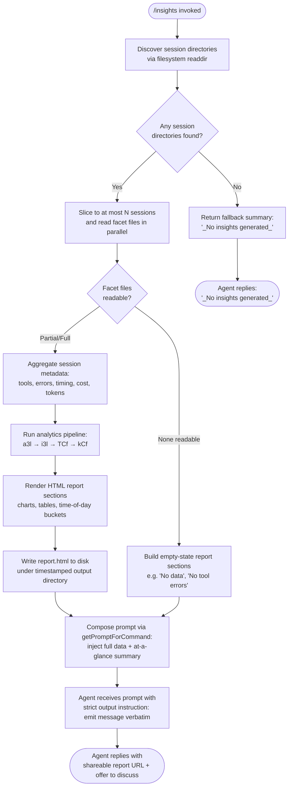

# `/insights`

> Analysis basis: CC v2.1.190 bundle.js (AST extraction + Claude interpretation)
> Minimum version: v2.1.190

---

## Overview

`/insights` generates a structured usage-analytics report across the user's Claude Code sessions, writes it as a shareable HTML file to disk, and then instructs the agent to deliver a fixed confirmation message pointing to the report URL. The command collects session metadata and faceted usage data (tool calls, error rates, timing distribution, etc.), aggregates these into an HTML report, and passes an at-a-glance summary to the agent's prompt so that the agent can offer to discuss specific sections.

---

## Registration

| Field | Value |
|---|---|
| type | `prompt` |
| name | `insights` |
| description | `Generate a report analyzing your Claude Code sessions` |
| loc_byte | `13203652` |
| loc_byte_end | `13204956` |
| loc_line | `9973` |
| handler_method | `getPromptForCommand` |
| handler_method_start | `13203826` |
| handler_method_end | `13204955` |
| prompt_body.length | `513` |
| prompt_body.trace | `call→c3l(...) (1 literals)` |
| arbor_handler.name | `getPromptForCommand` |
| arbor_handler.fqn | `claude-2.1.190::getPromptForCommand` |
| arbor_handler.kind | `Method` |
| arbor_handler.resolution_path | `direct` |
| arbor_handler.n_hits | `1` |

Analysis basis: CC v2.1.190 bundle.js:+13203652

---

## Input Branching

The command has 3+ meaningful branches: no session data found vs. data found but no recent facets vs. full data pipeline succeeded. A Mermaid flowchart is used.



Analysis basis: CC v2.1.190 bundle.js:+13203826, +13204858, +13204723

---

## Behavioral Spec

### 1. Session Discovery (`sessionDirectoryScanner`)

The handler calls `sessionDirectoryScanner` (bundle identifier: `xCf`) to enumerate project directories under the Claude Code data root. It constructs the data path by joining the base config directory with the `"usage-data"` segment. It then calls `fs.readdir` on that path and filters for entries where `isDirectory()` is true.

```
function sessionDirectoryScanner(baseDir):
    dataRoot = path.join(baseDir, "projects")
    entries  = await fs.readdir(dataRoot, { withFileTypes: true })
    dirs     = entries.filter(e => e.isDirectory())

    // Batch in groups of 10, delay 9ms between batches (setImmediate yielding)
    results  = []
    for batch in chunks(dirs, 10):
        await setImmediate()   // yield to event loop
        results.push(...processBatch(batch))

    return results.sort(byMostRecent)
```

Analysis basis: CC v2.1.190 bundle.js:+13190192, +13190211, +13190461, +13190466, +13190515

Batch size: 10 directories per tick (bundle.js:+13190461).
Yield gap between batches: 9 ms via `setImmediate` (bundle.js:+13190466, +13190491).

---

### 2. Facet File Enumeration (`facetFileEnumerator`)

Within each session directory, `facetFileEnumerator` (identifier: `HHt`) reads the `"facets"` subdirectory and collects only files whose names end in `".jsonl"`. It then calls `fs.stat` on each qualifying file to record file size and modification time, storing results in a map keyed by basename.

```
function facetFileEnumerator(sessionDir):
    facetsDir = path.join(sessionDir, "facets")
    entries   = await fs.readdir(facetsDir, { withFileTypes: true })
    jsonlFiles = entries
        .filter(e => e.isFile() && matchesJsonlExtension(e.name))

    statMap = new Map()
    await Promise.all(jsonlFiles.map(async f =>
        stat = await fs.stat(path.join(facetsDir, f.name))
        statMap.set(f.name, { size: stat.size, mtime: stat.mtime })
    ))
    return statMap
```

Analysis basis: CC v2.1.190 bundle.js:+13288917, +13288994, +13289023, +13289051, +13289226

File extension filter: `".jsonl"` (bundle.js:+13289023).

---

### 3. Session Metadata Loading (`sessionMetaLoader`)

For each session directory, `sessionMetaLoader` (identifier: `ECf`) constructs two paths — the `"session-meta"` file and the `"usage-data"` directory — then reads and JSON-parses the metadata file. Parsing is delegated to `jsonSafeParser` (identifier: `Gt`, calls `JSON.parse` at bundle.js:+192895). If the file is absent or unparseable, the session is silently skipped.

```
function sessionMetaLoader(sessionDir, configRoot):
    metaPath = path.join(configRoot, "session-meta", sessionId)
    raw      = await fs.readFile(metaPath, "utf-8")
    return jsonSafeParser(raw)   // wraps JSON.parse; returns null on error
```

Analysis basis: CC v2.1.190 bundle.js:+13135500, +13135508, +13135543, +13129514

Encoding: `"utf-8"` (bundle.js:+13135567).

---

### 4. Top-Session Slicing and Parallel Fanout (`insightsOrchestrator`)

The main orchestrator (`l3l`) slices the discovered session list to the most recent sessions (limit derived at runtime), then fans out in parallel via `Promise.all` to load facets and metadata concurrently. It uses up to 50 parallel slots with a concurrency ceiling of 200 in-flight promises (bundle.js:+13190603, +13190608).

```
function insightsOrchestrator(allSessions, config):
    recentSessions = allSessions.slice(0, sessionLimit)

    [facetMaps, metaObjects] = await Promise.all([
        Promise.all(recentSessions.map(s => facetFileEnumerator(s))),
        Promise.all(recentSessions.map(s => sessionMetaLoader(s, config.root)))
    ])

    aggregated = aggregateSessionData(facetMaps, metaObjects)
    report     = buildReport(aggregated, config)
    return report
```

Analysis basis: CC v2.1.190 bundle.js:+13190603, +13190608, +13190680, +13190692

---

### 5. Usage Data Aggregation (`usageDataAggregator`)

`usageDataAggregator` (identifier: `a3l`) iterates `Object.entries` over all loaded facets and computes per-session and global statistics. It calls `percentileCalculator` (identifier: `i3l`) for response time distributions and uses `Math.floor` and `Math.round` for binning. It pushes results into sorted arrays for chart rendering.

Key computed fields include:
- Tool call counts and error-rate breakdown
- Response time buckets: `"2-10s"`, `"10-30s"`, `"30s-1m"`, `"1-2m"`, `"2-5m"`, `"5-15m"`, `">15m"` (bundle.js:+13146754 through +13146814)
- Time-of-day buckets: Morning (6–12), Afternoon (12–18), Evening (18–24), Night (0–6) (bundle.js:+13147602 through +13147755)
- Session cost and token totals (rounded via `Math.round`)
- Git commit and git push counts (bundle.js:+13130498, +13130530)

```
function usageDataAggregator(facetMaps, metaObjects):
    toolCounts   = {}
    errorCounts  = {}
    timeBuckets  = initTimeBuckets()   // 7 duration buckets
    todBuckets   = initTODBuckets()    // 4 time-of-day buckets
    costTotal    = 0
    tokenTotal   = 0

    for each (sessionId, facets) in facetMaps:
        meta = metaObjects[sessionId]
        for each event in facets:
            classify(event, toolCounts, errorCounts, timeBuckets, todBuckets)
            costTotal  += event.cost  ?? 0
            tokenTotal += event.tokens ?? 0

    percentiles = percentileCalculator(timeBuckets)
    return { toolCounts, errorCounts, timeBuckets, todBuckets,
             costTotal, tokenTotal, percentiles }
```

Analysis basis: CC v2.1.190 bundle.js:+13139354, +13139686, +13141182, +13141356, +13141403, +13141535, +13141621

---

### 6. HTML Report Rendering (`htmlReportBuilder`)

`htmlReportBuilder` (identifier: `kCf`) produces the full HTML document. It applies HTML entity escaping via `htmlEntityEncoder` (identifier: `qd` → `Ol`, which calls `e.replaceAll` at bundle.js:+5282624) and produces several named sections:

- **Tool usage table** via `toolTableRenderer` (identifier: `pEe`): sorts by frequency, applies `toUpperCase` to header labels, outputs `<p class="empty">No data</p>` when empty (bundle.js:+13146245).
- **Response time histogram** via `responseTimeHistogramRenderer` (identifier: `vCf`): uses `Object.values`, `Object.entries`, `Math.max` for bar scaling (bundle.js:+13147127). Empty state: `<p class="empty">No response time data</p>` (bundle.js:+13146702).
- **Time-of-day chart** via `todChartRenderer` (identifier: `wCf`): four buckets with peak-hour annotations. Empty state: `<p class="empty">No time data</p>` (bundle.js:+13147552).
- **Error breakdown section** via `errorSectionRenderer` (identifier: inline within `kCf`): empty state `<p class="empty">No tool errors</p>` (bundle.js:+13188146).

Chart accent colors found in bundle: `#2563eb`, `#0891b2`, `#10b981`, `#8b5cf6`, `#dc2626`, `#16a34a`, `#eab308` (bundle.js:+13184419 through +13188877).

Markdown-style bold (`**text**`) is converted to `<strong>$1</strong>` (bundle.js:+13148460). Bullet markers `• ` and line-break `<br>` are injected for list formatting (bundle.js:+13148503, +13148533).

A special "Add to CLAUDE.md" affordance label is rendered in the suggestions section (bundle.js:+13152098).

Token budget for rendered HTML sections: 8192 characters per section (bundle.js:+13145923). Total report context budget passed to agent: 4096 characters (bundle.js:+13137449).

```
function htmlReportBuilder(aggregatedData, config):
    sections = []
    sections.push(toolTableRenderer(aggregatedData.toolCounts))
    sections.push(responseTimeHistogramRenderer(aggregatedData.timeBuckets))
    sections.push(todChartRenderer(aggregatedData.todBuckets))
    sections.push(errorSectionRenderer(aggregatedData.errorCounts))
    html = assembleFullDocument(sections, config)
    return html
```

Analysis basis: CC v2.1.190 bundle.js:+13148388, +13148418, +13148433, +13146105, +13147127, +13147834

---

### 7. Report File Write (`reportFileWriter`)

After building the HTML, the orchestrator creates a timestamped output directory and writes the file named `"report.html"` (bundle.js:+13192841). The directory name is built from the current date components: full year, month, date, hours, minutes, seconds (bundle.js:+13192673 through +13192771). The directory is created with `fs.mkdir` (recursive) before `fs.writeFile`.

```
function reportFileWriter(html, baseOutputDir):
    now  = new Date()
    dirName = formatTimestamp(now)   // YYYY-MM-DD-HH-MM-SS
    outDir  = path.join(baseOutputDir, dirName)
    await fs.mkdir(outDir, { recursive: true })
    filePath = path.join(outDir, "report.html")
    await fs.writeFile(filePath, html)
    return { filePath, reportUrl: toFileUrl(filePath) }
```

Analysis basis: CC v2.1.190 bundle.js:+13192582, +13192791, +13192841, +13192869

---

### 8. Prompt Construction (`getPromptForCommand`)

Once the report file is written, `getPromptForCommand` (the `handler_method`, resolved by Arbor as a direct `Method` at bundle.js:+13203826) assembles the agent prompt by calling `promptTemplateInterpolator` (identifier: `c3l`) and passing:

1. The full serialized insights data blob
2. The report URL (file URI)
3. The HTML file path on disk
4. The path to the facets directory
5. An at-a-glance summary string (for agent context only — flagged as not yet visible to the user)

The prompt closes with a `<message>` block that the agent must output **verbatim** in its entirety, confirming the report is ready, providing its shareable URL, and offering to explore specific sections or act on suggestions.

If no data was produced, the agent is instead instructed to emit only `"_No insights generated_"` (bundle.js:+13204723).

The at-a-glance summary is built via `atAGlanceSummaryBuilder` (identifier: `MCf`, confirmed by literal `"at_a_glance"` at bundle.js:+13143781) and is capped to avoid exceeding the 4096-character context window for the prompt body.

```
function getPromptForCommand(sessionContext):
    reportResult = await insightsOrchestrator(sessionContext)

    if reportResult is empty:
        return buildPrompt("_No insights generated_")

    summary = atAGlanceSummaryBuilder(reportResult)
    prompt  = promptTemplateInterpolator(
        insightsData   = reportResult.fullData,
        reportUrl      = reportResult.url,
        htmlFilePath   = reportResult.filePath,
        facetsDir      = reportResult.facetsDir,
        atAGlance      = summary
    )
    return prompt   // contains verbatim <message> block
```

Analysis basis: CC v2.1.190 bundle.js:+13203832, +13204858, +13204876, +13204922, +13204723

---

## State & Side Effects

| Item | Detail |
|---|---|
| Telemetry | `tengu_mcp_skills` (bundle.js:+6653418), `tengu_daemon_control` (+17235957), `tengu_daemon_config_reload` (+17214348), `tengu_bg_dispatch_sigkill_escalate` (+17198228), `tengu_bg_dispatch_low_mem` (+17198829), `tengu_bg_spare_enable` (+17199526), `tengu_bg_spare_claim` (+17199654), `tengu_bg_spare_claim_fail` (+17199920), `tengu_scheduled_task_fire` (+16519369), `tengu_scheduled_task_expired` (+16519712), `tengu_bg_retire_pinned_low_mem` (+17202918), `tengu_bg_prewarm_per_sweep` (+17203039), `tengu_transcript_phantom_parent` (+13274165), `tengu_relink_walk_broken` (+13252283), `tengu_transcript_parent_cycle` (+13278085), `tengu_chain_parent_cycle` (+13254060), `tengu_chain_timestamp_fallback` (+13254209), `tengu_chain_parallel_tr_recovered` (+13256075), `tengu_daemon_yield` (+17218760), `tengu_daemon_idle_exit` (+17219790) |
| File writes | Creates timestamped directory under usage-data output root; writes `report.html` (bundle.js:+13192841) |
| Directory creation | `fs.mkdir` with recursive flag before writing report (bundle.js:+13192582) |
| appState changes | Session-meta map updated (`"session-meta"` key, bundle.js:+13129514); facets directory written via `SCf`/`yCf` (bundle.js:+13136084, +13135327) |
| Parallelism | Up to 50 concurrent session reads, ceiling 200 in-flight (bundle.js:+13190603, +13190608); batched in groups of 10 with `setImmediate` yields (bundle.js:+13190461, +13190491) |
| Sound | <!-- TODO: not found in depth-2 traversal; needs --depth 4 --> |
| Hook registration | <!-- TODO: not found in depth-2 traversal; needs --depth 4 --> |
| Session idle timeout | Background session idle exit via `tengu_daemon_idle_exit`; 30-minute facets refresh window (bundle.js:+13137991, value `1800000` ms) |

---

## Version History

| Version | Change |
|---|---|
| v2.1.190 | Initial analysis |

---

## Common Mistakes

1. **Running `/insights` with no prior sessions**: If no `usage-data` directories exist under the Claude Code config root, the command returns `"_No insights generated_"` instead of a report. Users must have at least one completed session recorded before invoking the command.
2. **Expecting real-time output before the agent replies**: The at-a-glance summary is passed to the agent as context only and is not directly shown to the user. The user sees only the agent's verbatim `<message>` block response, which confirms the report URL.
3. **Assuming the report URL is an HTTPS link**: The report URL is a `file://` URI pointing to the locally written `report.html` file, not a hosted web page. Sharing requires manually uploading or serving the file.
4. **Editing facet files between invocations**: The command reads `.jsonl` facet files from disk at invocation time. If the files are corrupted or mid-write, the affected session is silently skipped and may cause an incomplete report with empty-state sections.
5. **Expecting the agent to improvise the reply**: The prompt instructs the agent to output the `<message>` block content verbatim with no omissions. Any attempt to paraphrase or reorder the message would deviate from the intended behavior.

---

## Appendix — Identifier Mapping

> For bundle debugging only. Identifiers change across versions.

| Identifier | Role |
|---|---|
| `__handler_insights` | Synthetic BFS entry point for the `/insights` command handler |
| `l3l` | Main insights orchestrator — coordinates session discovery, fanout, and report assembly |
| `xCf` | Session directory scanner — reads and filters project directories |
| `a7` | Path join helper used within session scanner |
| `HHt` | Facet file enumerator — lists and stats `.jsonl` files per session |
| `MM` | JSONL extension matcher (calls regex `.test`) |
| `T` | String normalizer / type classifier used across pipeline |
| `ECf` | Session metadata loader — reads and parses session-meta JSON files |
| `UMo` | Usage-data path builder |
| `ZVt` | Base config directory resolver |
| `s3l` | Secondary metadata parser helper |
| `Gt` | JSON safe parser (wraps `JSON.parse`) |
| `d9e` | MCP connection manager (reached via deep fanout from `a`) |
| `RB` | MCP slot reconciler |
| `Qw` | MCP update applier |
| `zn` | Async task scheduler helper |
| `FUt` | Future/deferred utility |
| `Hua` | Session timing calculator |
| `hyn` | Metric normalizer |
| `fyn` | Metric formatter |
| `ln` | MCP debug logger |
| `zRn` | MCP error state writer |
| `BUt` | MCP backoff timer |
| `gJr` | MCP connection logger |
| `eL` | Git integration helper |
| `tJr` | Tool name classifier |
| `Vc` | MCP error reporter |
| `be` | Generic string coercer (wraps `String()`) |
| `Aua` | Auth token resolver |
| `yit` | Integer parser variant A (wraps `parseInt`) |
| `nMn` | Integer parser variant B (wraps `parseInt`) |
| `brr` | MCP connection result applier |
| `u9e` | Connection status updater |
| `zT` | MCP cleanup orchestrator |
| `_la` | Session rerouter |
| `rUl` | Rate-limit/retry scheduler |
| `fBo` | MCP client fanout manager |
| `xRn` | MCP capability filter |
| `Kn` | Timeout-with-abort helper |
| `Hit` | Session health checker |
| `hJn` | Transcript indexer / facet aggregator |
| `Qle` | Transcript store manager |
| `evf` | Transcript event emitter |
| `N5` | Transcript node deduplicator |
| `VJt` | JSON tree walker |
| `NA` | Null-assertion utility |
| `wvf` | Binary JSONL reader (sync, uses `openSync`/`readSync`) |
| `Lvf` | Single-record sync file reader |
| `D3l` | Transcript chain builder |
| `vvf` | Async JSONL parser |
| `QAe` | Transcript query executor |
| `Xo` | Console/terminal output helper |
| `ke` | Error logger with fallback |
| `s9l` | Chain segment aggregator |
| `ZHe` | Chain root resolver |
| `hvf` | NaN-safe chain validator |
| `gvf` | Parallel transcript reconciler |
| `fvf` | Chain deduplicator with sort |
| `aut` | Author attribution mapper |
| `gDo` | Text content extractor from messages |
| `Eqt` | Compact summary parser |
| `_Do` | Content filter dispatcher |
| `Hvf` | Content-type checker (image/document) |
| `_vf` | Attachment-type validator |
| `LJn` | Facet index updater |
| `kJn` | Facet value collector |
| `pCf` | NaN guard for numeric aggregation |
| `$Mo` | Session data normalizer |
| `o3l` | Tool-call event classifier |
| `QVt` | Tool-name lookup table |
| `dCf` | File extension extractor |
| `Wwe` | Diff generator (calls `TGi.diff`) |
| `nu` | String index finder |
| `mh` | Numeric aggregation helper |
| `FMo` | Report output path builder |
| `SCf` | Facet snapshot file writer |
| `Me` | JSON stringifier wrapper |
| `_Cf` | Stale facet cache cleaner |
| `mJn` | Session-meta path builder |
| `u3l` | File unlink helper |
| `ACf` | Full report pipeline runner |
| `HCf` | Session batch processor |
| `mCf` | Per-session data transformer |
| `nft` | HTML report generator (top-level) |
| `Cc` | HTML template renderer |
| `oqn` | Report manifest writer (hashes + UUID) |
| `On` | Report UUID assigner |
| `K8e` | Report section finalizer |
| `lk` | Report link builder |
| `zL` | URL validator |
| `KO` | Report output coordinator |
| `r3l` | Config root path resolver |
| `n_` | Data directory path builder |
| `kf` | Entry-point invoker |
| `kt` | Main process bootstrapper |
| `Kl` | Content filter |
| `fo` | Error coercer (wraps `Error` + `String`) |
| `yCf` | Facet JSON writer |
| `MCf` | At-a-glance summary builder |
| `a3l` | Usage data aggregator |
| `gHt` | Tool-entry iterator |
| `fi` | Array slice helper |
| `i3l` | Percentile calculator for response times |
| `TCf` | Cross-session report data assembler |
| `n3l` | Per-session HTML section builder |
| `aCf` | Session config path builder |
| `kCf` | HTML report renderer (full document) |
| `qd` | HTML entity encoder dispatcher |
| `Ol` | HTML entity `replaceAll` worker |
| `fJn` | Inline HTML entity encoder |
| `LCf` | Report section length limiter |
| `pEe` | Tool usage table renderer |
| `vCf` | Response time histogram renderer |
| `wCf` | Time-of-day chart renderer |
| `c3l` | Prompt template interpolator |

---

Note: index built via Arbor fallback; some signals (telemetry, literals) may be missing — see arbor-fallback.js.