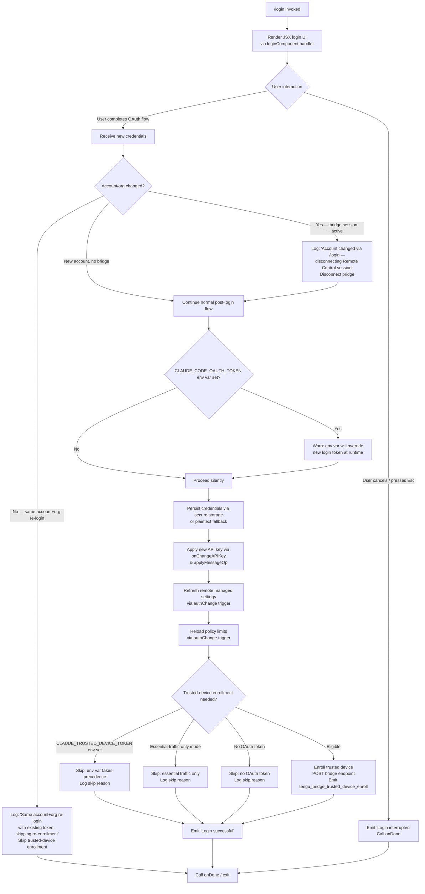

# `/login`

> Analysis basis: CC v2.1.190 bundle.js (AST extraction + Claude interpretation)
> Minimum version: v2.1.190

---

## Overview

The `/login` command initiates or switches the authenticated Anthropic account for Claude Code. It renders an interactive JSX UI component that guides the user through an OAuth-based authentication flow, persists the resulting credentials, applies them to the running session, and triggers downstream side effects including remote-settings refresh, policy-limits reload, and optional trusted-device enrollment. When a new account is detected, any active Remote Control bridge session is disconnected.

---

## Registration

| Field | Value |
|---|---|
| type | `local-jsx` |
| name | `login` |
| description | `"Switch Anthropic accounts \| Sign in with your Anthropic account"` |
| module_id | `f9a` |
| load_inline | `true` |
| loc_byte | `11632994` |
| loc_byte_end | `11633214` |
| loc_line | `7767` |
| arbor_handler.name | `lyl` |
| arbor_handler.fqn | `claude-2.1.190::lyl` |
| arbor_handler.kind | `Function` |
| arbor_handler.resolution_path | `direct` |
| arbor_handler.n_hits | `2` |

Analysis basis: CC v2.1.190 bundle.js:+11632994

---

## Input Branching

The command has more than three distinct runtime branches (credential type detection, account-change detection, bridge disconnection, trusted-device enrollment paths, and OAuth environment-override warning), so a Mermaid flowchart is used.



Analysis basis: CC v2.1.190 bundle.js:+8944419, +8944991, +8945074, +8945164, +8945343, +8944776, +8945438, +8945450

---

## Behavioral Spec

### 1. Top-Level Handler (`loginRootComponent` / handler `$kp`)

The JSX rendering layer composes the authentication form and wires state management. It invokes the `loginFlow` function (`pRe`) as the primary business-logic entry point.

```
function loginRootComponent(props):
    state = getAppState()
    ui   = renderLoginForm(state)

    ui.onDone  => call props.onDone
    ui.onAbort => log "Login interrupted", call props.onDone

    return jsx(loginForm, loginFlow, ui)
```

Analysis basis: CC v2.1.190 bundle.js:+8946025, +8946106, +8946135, +8946233

---

### 2. Main Login Flow (`loginFlow` / `pRe`)

The core imperative handler. It is resolved by Arbor as handler `lyl` via `direct` resolution inside the registration byte range.

```
async function loginFlow(context):
    // 1. Record timestamp for the login attempt
    timestamp = timestampHelper()                  // MKe → Date.now

    // 2. Detect credential type from environment / config
    credentialType = detectCredentialSource()      // Ir, nt

    // 3. Launch remote-settings pre-load
    remoteSettingsState = loadRemoteSettings()     // X9e

    // 4. Run OAuth / API-key acquisition UI
    newCredentials = await runOAuthFlow(context)   // K5, a9a, RK

    // 5. If user aborted, emit "Login interrupted" and return
    if newCredentials is null:
        log "Login interrupted"
        return

    // 6. Detect account change
    prevState   = context.getAppState()
    accountChanged = (prevState.accountId != newCredentials.accountId
                      OR prevState.orgId   != newCredentials.orgId)

    // 7. Bridge disconnection when account changes
    if accountChanged AND bridgeSessionActive():
        log "[bridge:repl] Account changed via /login — disconnecting Remote Control session"
        disconnectBridgeSession()                  // t9n

    // 8. Same-account re-login guard
    if NOT accountChanged AND existingTokenValid():
        log "[trusted-device] Same account+org re-login with existing token, skipping re-enrollment"
        skipTrustedDeviceEnrollment = true         // KMt literal at +8945343

    // 9. Env-var override warning
    if env CLAUDE_CODE_OAUTH_TOKEN is set:
        warn "Warning: CLAUDE_CODE_OAUTH_TOKEN is set …"

    // 10. Persist credentials
    persistResult = writeCredentials(newCredentials)  // Gl / vWs
    // Fallback chain: secure_storage → plaintext_fallback

    // 11. Apply new API key to live session
    context.onChangeAPIKey(newCredentials.apiKey)     // pRe → e.onChangeAPIKey
    applyMessageOp("update", ...)                     // pRe → e.applyMessageOp

    // 12. Update appState
    context.setAppState(newState)                     // pRe → e.setAppState

    // 13. Trigger remote-settings refresh
    refreshRemoteSettings(authChange=true)            // YHa

    // 14. Trigger policy-limits refresh
    refreshPolicyLimits(authChange=true)              // G9t

    // 15. Trusted-device enrollment (conditional)
    if NOT skipTrustedDeviceEnrollment:
        enrollTrustedDevice(context)                  // $Ft

    // 16. Completion
    log "Login successful"
    context.onDone()
```

Analysis basis: CC v2.1.190 bundle.js:+8944419, +8944438, +8944561, +8944638, +8944660, +8944776, +8944782, +8944821, +8944991, +8945164, +8945296, +8945335, +8945438, +8945450, +8945486, +8945521, +8945525

---

### 3. Credential Detection (`detectCredentialSource` / `Ir` → `nt`)

Checks environment variables and configuration in priority order, returning a credential-source enum.

```
function detectCredentialSource():
    // Priority order (highest → lowest):
    // 1. ANTHROPIC_API_KEY env var
    // 2. ANTHROPIC_AUTH_TOKEN env var
    // 3. CLAUDE_CODE_OAUTH_TOKEN env var
    // 4. CLAUDE_CODE_OAUTH_TOKEN_FILE_DESCRIPTOR
    // 5. CCR_OAUTH_TOKEN_FILE
    // 6. Stored profile OAuth
    // 7. WIF (Workload Identity Federation)

    if env ANTHROPIC_API_KEY:           return "api_key"
    if env ANTHROPIC_AUTH_TOKEN:        return "oauth"
    if env CLAUDE_CODE_OAUTH_TOKEN:     return "oauth"
    if file-descriptor oauth token:     return "oauth"
    if CCR_OAUTH_TOKEN_FILE:            return "oauth"
    if storedProfile():                 return "profile-implicit"
    if wif():                           return "wif"
    raise Error("ANTHROPIC_API_KEY, ANTHROPIC_AUTH_TOKEN, CLAUDE_CODE_OAUTH_TOKEN,
                 or WIF env vars … required")
```

Analysis basis: CC v2.1.190 bundle.js:+3055322, +3055411, +3055528, +3055597, +3056725, +3057194, +2131018 through +2131235

---

### 4. Credential Persistence (`writeCredentials` / `Gl` → `vWs`)

Attempts primary secure-storage write; falls back to plaintext on failure.

```
async function writeCredentials(credentials):
    try:
        result = await secureStorageWrite(credentials)
        emit telemetry "secure_storage_credentials_write"
        if result == PRIMARY_TRANSIENT_SKIP:
            emit "primary_transient_skip_fallback"
            return plaintextFallback(credentials)
        return result
    catch storageError:
        emit "plaintext_fallback_used"
        return plaintextFallback(credentials)
    if both fail:
        emit "primary_and_fallback_failed"
        raise
```

Analysis basis: CC v2.1.190 bundle.js:+2337252, +2337350, +2337499, +2337602

---

### 5. Remote Settings Refresh on Auth Change (`refreshRemoteSettings` / `YHa`)

Triggered after new credentials are applied. Resets the remote-settings HTTP cache and re-fetches from the managed-settings endpoint. Uses exponential backoff (`G7`: `Math.min`, `Math.pow`, `Math.random`, base `32000`, factor `0.25`, cap `10`).

```
function refreshRemoteSettings(authChange):
    log "Remote settings: Refreshed after auth change"
    clearSettingsCache()              // bH → XYt.clear, xsr.clear
    schedulePoll(immediate=true)      // YHa → btp → Cno
```

Analysis basis: CC v2.1.190 bundle.js:+7270651, +7271033, +13722651, +13722714

---

### 6. Policy Limits Refresh on Auth Change (`refreshPolicyLimits` / `G9t`)

Parallel to remote-settings refresh; re-fetches policy limits for the new account.

```
function refreshPolicyLimits(authChange):
    log "Policy limits: Refreshed after auth change"
    cancelPendingTimeout()            // bOo → clearTimeout
    schedulePoll(immediate=true)      // xQn → setTimeout
```

Analysis basis: CC v2.1.190 bundle.js:+13733853, +13733779, +13733785

---

### 7. Trusted-Device Enrollment (`enrollTrustedDevice` / `$Ft`)

Runs after credential persistence unless skipped. Makes a POST to the bridge endpoint with a 10 000 ms timeout. Stores the returned `device_token` in secure storage.

```
async function enrollTrustedDevice(context):
    // Skip guards (checked in order):
    if env CLAUDE_TRUSTED_DEVICE_TOKEN:
        log "[trusted-device] CLAUDE_TRUSTED_DEVICE_TOKEN env var is set, skipping enrollment"
        return
    if essentialTrafficOnly(context):
        log "[trusted-device] Essential traffic only, skipping enrollment"
        return
    if NOT oauthTokenPresent(context):
        log "[trusted-device] No OAuth token, skipping enrollment"
        return

    response = POST(bridgeEndpoint,
                    body={"Content-Type": "application/json"},
                    timeout=10000)                     // literal at +7225467

    emit telemetry "bridge_trusted_device_enroll"

    if response.status == 201:
        if NOT response.body.device_token:
            emit "missing_token"
            log "[trusted-device] Enrollment response missing device_token field"
            return
        storeDeviceToken(response.body.device_token)
    elif response.status in [401, 4xx, 5xx]:
        emit "http_error"
    if storage of token fails:
        emit "storage_failed"
```

Analysis basis: CC v2.1.190 bundle.js:+7224746, +7225060, +7225173, +7225467, +7225569, +7225655, +7225774, +7225852, +7225953, +7226161

---

### 8. Feature-Flag Subscription (`featureFlagModule` / `_Sn` → `LEi`)

After credentials are applied, the feature-flag store is refreshed, clearing `YIe`, `mSn`, and `IW` caches and re-populating from the new account's payload.

```
function refreshFeatureFlags(newPayload):
    YIe.clear()
    mSn.clear()
    IW.clear()
    entries = Object.entries(newPayload)
    for each [key, descriptor] in entries:
        YIe.set(key, descriptor.value ?? descriptor.defaultValue)
        mSn.add(key)
    if error:
        raise Error(join(errorMessages, ", "))
    setPayload(newPayload)
    IW.set(...)
    set.emit("change")
```

Analysis basis: CC v2.1.190 bundle.js:+3329413, +3329489, +3329501, +3329542, +3329868, +3330003, +3330205, +3333260

---

## State & Side Effects

| Item | Detail |
|---|---|
| Telemetry | `tengu_remote_settings_401_force_refresh_retry`, `tengu_feature_bad`, `tengu_feature_ok`, `tengu_managed_settings_security_dialog_shown`, `tengu_managed_settings_security_dialog_accepted`, `tengu_managed_settings_security_dialog_rejected`, `tengu_bg_dispatch_sigkill_escalate`, `tengu_daemon_config_reload`, `tengu_bg_low_mem_mb`, `tengu_bg_dispatch_low_mem`, `tengu_daemon_idle_exit`, `tengu_bg_spare_enable`, `tengu_bg_sendclaim_failed`, `tengu_daemon_control`, `tengu_bg_state_read_transient`, `tengu_bg_roster_parse_failed`, `tengu_bg_spare_claim`, `tengu_bg_spare_claim_fail`, `tengu_config_auth_loss_prevented`, `tengu_policy_limits_fetch`, `tengu_feature_sad`, `tengu_policy_limits_cache_write_failed`, `tengu_disable_bypass_permissions_mode`, `tengu_auto_mode_config`, `tengu_keybinding_fallback_used` |
| Credential write | Secure-storage primary attempt; plaintext fallback on failure; emits `secure_storage_credentials_write`, `plaintext_fallback_used`, `primary_and_fallback_failed` |
| appState changes | `context.getAppState()` read; `context.setAppState(newState)` write post-login |
| API key propagation | `onChangeAPIKey` called on live session; `applyMessageOp("update", …)` dispatched |
| Bridge disconnection | Remote Control session disconnected when account changes (log literal `"[bridge:repl] Account changed via /login — disconnecting Remote Control session"`) |
| Remote settings | Cache cleared; immediate re-fetch triggered; `"Remote settings: Refreshed after auth change"` logged |
| Policy limits | Pending timeout cancelled; immediate re-fetch triggered; `"Policy limits: Refreshed after auth change"` logged |
| Feature flags | `YIe`, `mSn`, `IW` maps cleared and repopulated from new account payload |
| Trusted-device enrollment | POST to bridge endpoint (10 000 ms timeout); `device_token` stored in secure storage; `bridge_trusted_device_enroll` telemetry emitted |
| Hook registration | `Dr` registers a keyboard handler (`s.registerHandler`) during render via `useRef` / `useEffect` |
| Sound | None observed in depth-2 traversal |

---

## Version History

| Version | Change |
|---|---|
| v2.1.190 | Initial analysis |

---

## Common Mistakes

1. **Leaving `CLAUDE_CODE_OAUTH_TOKEN` set in the environment** after running `/login`. The warning is logged but the env var silently overrides the newly persisted token at runtime, causing unexpected authentication with the old token.

2. **Expecting immediate model / policy changes after `/login`** without waiting for the remote-settings and policy-limits re-fetches to complete. Both are triggered asynchronously after credential persistence; a brief window exists where stale cached values may still apply.

3. **Running `/login` in essential-traffic-only mode and expecting trusted-device enrollment** to succeed. The enrollment is explicitly skipped in that mode; the device will not be enrolled until a full network session is available.

4. **Re-logging in to the same account and expecting re-enrollment**. When the detected `accountId` and `orgId` match the prior session, trusted-device enrollment is skipped entirely regardless of whether the device token has expired.

5. **Assuming `/login` resets all permission rules**. The command only updates credentials and triggers auth-dependent refreshes; `alwaysAllowRules`, `alwaysDenyRules`, and `alwaysAskRules` are not cleared by this command.

---

## Appendix — Identifier Mapping

> For bundle debugging only. Identifiers change across versions.

| Identifier | Role |
|---|---|
| `pRe` | Main login flow function (core business logic) |
| `lyl` | Arbor-resolved handler name (direct resolution inside registration block) |
| `$kp` | Top-level JSX login root component (handler_name) |
| `fRe` | Inner JSX login form component |
| `UA` | Auth store / account state accessor |
| `MKe` | Timestamp helper (wraps `Date.now`) |
| `Ir` | Credential-type resolver |
| `nt` | String coercion / normalization utility |
| `X9e` | Remote-settings orchestrator (entry point) |
| `XHa` | Remote-settings initialization helper |
| `r$t` | Remote-settings cache reader |
| `Cas` | Remote-settings cache format validator |
| `B7` | Remote-settings HTTP fetch core |
| `Gpe` | Auth token getter for HTTP headers |
| `Hoe` | Remote-settings ETag/cache-control handler |
| `QPe` | Remote-settings response parser |
| `zH` | Remote-settings serializer |
| `Eu` | Notification dispatcher |
| `Ndn` | Change notification emitter |
| `pA` | Settings apply helper (primary path) |
| `oRt` | Settings apply helper (fallback path) |
| `Yg` | Auth / API-key configuration reader |
| `Ad` | Config file reader (bare git-style) |
| `fx` | Flag-settings parser |
| `Jkt` | API-key helper resolver |
| `rT` | Auth type classifier |
| `OKe` | VSCode client-type detector |
| `twt` | File-descriptor token reader |
| `dA` | Full auth-source resolver (profile-implicit, user_oauth, etc.) |
| `Nl` | Error normalizer |
| `Dt` | Global config writer |
| `sU` | Token slicer (last 20 chars) |
| `APn` | Policy-settings applier |
| `vas` | Policy validation helper |
| `ke` | Error formatting utility |
| `fo` | Error string builder |
| `Vi` | Essential-traffic queue checker |
| `oou` | Essential-traffic queue shift/push |
| `bno` | Remote-settings consent dialog orchestrator |
| `VHa` | Security dialog presenter |
| `iHa` | Dialog initialization helper |
| `Ino` | Dialog accepted handler |
| `Y9e` | Dialog rejection recorder |
| `UHa` | Consent timeout message emitter |
| `T` | Logger / debug emitter |
| `nLc` | Log level checker |
| `Me` | JSON serializer wrapper |
| `wc` | Log message redactor (replaces sensitive values with `[REDACTED]`) |
| `hze` | HTTP error formatter |
| `iLc` | HTTP request builder (adds `User-Agent`, `If-None-Match`) |
| `Cno` | Remote-settings fetch-and-apply cycle |
| `Wpe` | Cache invalidation helper |
| `Mau` | Cache clear orchestrator |
| `bH` | Dual-cache clear (`XYt`, `xsr`) |
| `oHa` | Settings hash/fingerprint generator |
| `sno` | Recursive JSON normalizer for hashing |
| `Stp` | Remote-settings polling scheduler |
| `ytp` | Poll interval calculator |
| `KHa` | Remote-settings HTTP fetch implementation |
| `G7` | Exponential-backoff calculator |
| `Kn` | Async retry-with-abort helper |
| `Re` | Feature flag "bad" reporter |
| `W` | Feature flag value getter |
| `Pe` | Feature flag payload accessor |
| `j7e` | Cache-clear on settings update |
| `Le` | Feature flag "ok" reporter |
| `WHa` | Managed-settings security check caller |
| `cbe` | Security check implementation |
| `FHa` | Settings apply-or-reject orchestrator |
| `aPn` | Settings field key extractor |
| `bat` | Command-name uppercaser / permission-set builder |
| `pHa` | Settings diff calculator |
| `cw` | Settings write helper |
| `NHa` | "Approved" path settings writer |
| `ftp` | Settings request queue manager |
| `qW` | Queue write dispatcher |
| `x1` | Settings file writer helpers |
| `$Ha` | "Other/unknown" path handler |
| `Ic` | Fallback/other-source settings processor |
| `qHa` | Settings file atomic writer (open → writeFile → datasync → close) |
| `xon` | Hostname joiner for remote endpoint |
| `jHa` | Cache freshness checker |
| `YHa` | Remote-settings auth-change refresh trigger |
| `LSn` | Poll interval manager (`setInterval` / `clearInterval`) |
| `btp` | Background poll cycle executor |
| `Ei` | Hook/effect registrar (`C6o.register`) |
| `t9n` | Bridge-session disconnect on account change |
| `par` | Bridge-session state reader |
| `Tn` | Reactive store subscriber |
| `gsn` | Store cache lookup (`XYt.has/get`) |
| `B5o` | Store cache hit handler |
| `ZEr` | Store cache miss handler |
| `G5o` | Store cache setter (`XYt.set`) |
| `l2` | Reactive store factory / root initializer |
| `gr` | Store version-lock checker |
| `CEt` | CA-certificate cache clearer |
| `oar` | Store options parser |
| `bEt` | mTLS config cache clearer |
| `YPe` | Proxy-agent cache clearer |
| `XPe` | TLS context builder |
| `wEt` | HTTP agent factory |
| `boe` | Undici dispatcher builder |
| `fbe` | Proxy resolver |
| `bsn` | Network stack initializer |
| `ncs` | Certificate chain loader |
| `rQ` | HTTP client factory |
| `oCt` | WSL environment detector |
| `f` | Daemon relaunch / `execRelaunch` implementation |
| `D` | Daemon process manager (spawn/kill) |
| `VEc` | Executable real-path resolver |
| `kn` | ENOENT error classifier |
| `sp` | Daemon socket-path builder |
| `XJf` | Version-directory resolver |
| `B2n` | `claude/versions` path joiner |
| `d` | Session roster writer |
| `rqe` | Roster file reader (stat → readFile → parse) |
| `y$l` | Roster diff/merge utility |
| `i` | Socket connection holder |
| `E` | Heartbeat timer manager |
| `A` | Throttle / rate-limiter |
| `GEc` | Heartbeat scheduler |
| `I` | Input throttle controller |
| `GXn` | macOS memory reporter |
| `it` | Feature-value evaluator |
| `txt` | Feature default-value reader |
| `nxt` | Feature override-value reader |
| `V9` | Feature-flag store accessor |
| `gSn` | Feature cache populator |
| `B2e` | Pinned-sessions file reader |
| `MDt` | Pin file path builder |
| `Vk` | Base jobs-directory path builder |
| `Gt` | Safe JSON parser |
| `ECd` | Recursive directory scanner |
| `W1i` | Directory-with-mkdir helper |
| `Df` | File-type gating function |
| `U` | Idle-exit timer / `retireIfSettled` |
| `N` | Timer reference holder |
| `M` | Write-flush manager |
| `c` | Encoder / write-stream |
| `L3o` | Daemon-claim socket connector |
| `n1o` | Daemon state-file writer |
| `s8t` | State-file path resolver |
| `o8t` | Session directory path resolver |
| `be` | Error-to-string converter |
| `EJf` | Claim-frame sender (timeout 5000 ms) |
| `SJf` | TCP socket connect wrapper |
| `cn` | Error code extractor |
| `yJf` | Claim-frame builder |
| `Jd` | Error code normalizer |
| `gR` | Binary frame serializer (`Buffer` operations) |
| `P3o` | Session file-system manager (write/read/delete) |
| `ec` | Session path builder |
| `Di` | Session-state file reader/writer |
| `a` | Session accessor context |
| `u` | Session UI renderer helpers |
| `yg` | Active-session marker |
| `S0` | State `"active"` setter |
| `Eve` | Environment-variable path collector |
| `gCd` | Path deduplicator / filter |
| `kd` | Atomic config-file writer |
| `Cm` | Atomic file write (`randomBytes` temp → rename) |
| `fy` | Cache-delete helper |
| `cht` | Checksum-file sync manager |
| `Gq` | Session file validator and reader |
| `wtf` | Session file writer (mkdir → write → rename) |
| `i8t` | Session-index file path builder |
| `bye` | PTY-pids file path builder |
| `r8e` | PTY-pids base path resolver |
| `yR` | "Late" PTY-pids path builder |
| `uHl` | PTY-pids file path (Yh.join based) |
| `uN` | PTY log-file path builder |
| `JIo` | Log path formatter |
| `lht` | PTY base log path |
| `lM` | "err" variant PTY path |
| `p` | Forced-shutdown handler (`process.exit`) |
| `jb` | Shutdown log emitter |
| `F` | Poll-interval clearer (`clearInterval`) |
| `o9n` | Session-state reset orchestrator |
| `uXt` | State reset helper |
| `VQ` | Volatile-state store accessor |
| `i9a` | In-progress cache clearer (`hpo.clear`) |
| `vse` | Visibility state resetter |
| `PIe` | Pending-items resetter |
| `o9a` | Output-queue resetter |
| `Hpo` | Hotkey-pending-operations store |
| `_Sn` | Feature-flag refresh-on-auth-change |
| `LEi` | Feature-flag payload applicator |
| `kEi` | Feature-flag snapshot builder (`Object.fromEntries`) |
| `hn` | Global config writer (with auth-loss guard) |
| `K5` | Login credential applicator (globalConfig update) |
| `a9a` | OAuth token normalizer |
| `RK` | Token prefix validator (`ptu.has`) |
| `Sdt` | HTTP-client cache invalidator |
| `Ukp` | Cache invalidation entry point |
| `Nkp` | Named-cache invalidation (by key) |
| `Okp` | Permission-set cache invalidator |
| `P1i` | Header-name uppercaser / allow-list checker |
| `O1i` | Deny-list header checker |
| `Dkp` | Default-cache invalidation |
| `ex` | Certificate-set builder |
| `qSn` | Auto-mode state getter |
| `Ecs` | CA-cert cache clearer (message: `"Cleared CA certificates cache"`) |
| `Tcs` | mTLS cache clearer (message: `"Cleared mTLS configuration cache"`) |
| `ECr` | Proxy-agent cache clearer (message: `"Cleared proxy agent cache"`) |
| `mvt` | Proxy-agent factory (undici) |
| `rU` | Proxy URL parser |
| `Qvs` | Proxy dispatcher builder |
| `Jvs` | Proxy error constructor |
| `iz` | Proxy protocol classifier (IPv4/IPv6/https) |
| `hCr` | Proxy header builder |
| `G9t` | Policy-limits auth-change refresh trigger |
| `bOo` | Policy-limits pending-timeout canceller |
| `IOo` | Policy-limits state accessor |
| `Wme` | Auth-type detector for policy limits |
| `sGs` | Auth state subscriber |
| `xQn` | Policy-limits poll scheduler |
| `K9` | Policy-limits state reader |
| `cxt` | Policy-limits full context builder |
| `eCe` | Policy-limits file path builder |
| `DQn` | Policy-limits background poll orchestrator |
| `HGl` | Policy-limits fetch-and-apply cycle |
| `uxt` | Policy-limits file reader |
| `hGl` | Policy-limits cache freshness checker |
| `lxt` | Policy-limits fetch lock |
| `_Rf` | Policy-limits response hasher |
| `yRf` | Policy-limits apply function |
| `ERf` | Policy-limits retry scheduler |
| `Fo` | Policy-limits "ok" feature reporter |
| `Tw` | Policy-limits settings merger |
| `Mt` | Policy-limits feature "sad" reporter |
| `ARf` | Policy-limits atomic file writer |
| `_Gl` | Background-poll loop body |
| `TRf` | Single-poll executor |
| `UIe` | Auth-listener unsubscriber reference |
| `Kse` | Auth-change event emitter / cleanup scheduler |
| `iet` | Full auth-state teardown (clears `YIe`, `mSn`, `ZRt`, `uBr`, `IW`) |
| `gBr` | Interval + process-listener cleaner |
| `hc` | Config read helper (wraps `ay` + `Dt`) |
| `ay` | Settings file parser (all sources) |
| `eRt` | Auth-env-var reader |
| `mZe` | Auth credential validator |
| `KMt` | Trusted-device re-enrollment skip guard |
| `Oto` | App-state read helper (JSX context) |
| `oo` | App-state store accessor |
| `cYt` | App-state context bind helper |
| `A0e` | Feature-value batch reader for UI |
| `Gl` | Credential write dispatcher |
| `vWs` | Credential write implementation (secure → plaintext fallback) |
| `pUe` | Secure-storage write core |
| `$Ft` | Trusted-device enrollment orchestrator |
| `vU` | Feature-flag value reader (UI hook) |
| `xEi` | Cached-feature reader with `IW` map |
| `Kep` | Policy-allowed feature checker |
| `Rto` | Policy-enforced feature checker |
| `Ls` | OAuth URL builder / validator |
| `MXo` | Base OAuth URL selector |
| `HGc` | Custom OAuth URL validator |
| `Nrn` | Bridge POST helper |
| `l9a` | Login-state atom (React) |
| `U9t` | Permission-mode update dispatcher |
| `i9n` | Bypass-permissions mode gate |
| `hBr` | Feature-flag reader for bypass-permissions |
| `e$t` | Permission rule applicator |
| `iH` | Permission rule set manager |
| `qp` | Permission rule resolver |
| `Or` | Active-message last-entry finder |
| `G8n` | Working-directory restriction checker |
| `os` | App-state snapshot |
| `W8n` | Allowed/disallowed-tools restriction checker |
| `N2` | Notification dispatcher for permission mode |
| `Epo` | Auto-mode gate notification emitter |
| `F9t` | Auto-mode config evaluator |
| `$9t` | Auto-mode availability checker (full) |
| `zz` | Auto-mode circuit-breaker reader |
| `HSn` | Feature-flag cached reader for auto-mode |
| `XPo` | Auto-mode plan checker |
| `YPo` | Auto-mode provider checker |
| `gs` | Model tier resolver |
| `v9` | Model canonical name resolver |
| `Qo` | Model alias normalizer |
| `Kg` | Model alias map lookup |
| `Sme` | Inference-profile model gate |
| `Eo` | Inference-profile type extractor |
| `cZe` | Claude-3 model classifier |
| `Qxe` | Model-availability gate |
| `H9` | Model-availability store accessor |
| `DX` | Disable-auto-mode flag reader |
| `O$` | Auto-mode env-var gate |
| `Fhe` | Permission-mode-changed event emitter |
| `Su` | Event emitter for session-level permissions |
| `EEe` | Permission-update batch applier |
| `Ht` | Auth store hook (useSyncExternalStore) |
| `y6r` | App-state context reader (useContext) |
| `M6e` | Auth state change subscriber (useReducer + useEffect) |
| `Vz` | Store subscription + microtask flush |
| `CEi` | Async-safe subscription helper |
| `a_` | Auth-state hook alias |
| `Z3n` | Input-text parser / command router |
| `Jy` | Raw input normalizer |
| `nl` | Whitespace normalizer |
| `EJe` | Input escape-sequence stripper |
| `PGs` | Parsed-command dispatcher |
| `dU` | Full input parse pipeline |
| `DGs` | Model-policy enforcement engine |
| `Da` | Model name parser |
| `ix` | Punctuation/symbol classifier |
| `Vu` | Unicode-range checker |
| `zoe` | Word-boundary classifier |
| `Hfn` | Heading/label parser |
| `vw` | Full model-string normalizer |
| `hRr` | Token-level model-string scanner |
| `Afn` | Grammar-level model-string parser |
| `Sfn` | Model version-suffix extractor |
| `ZE` | Theme context accessor |
| `Dr` | Global keyboard-handler registrar |
| `QE` | Keyboard-event context reader |
| `xm` | Key-binding input handler |
| `l1i` | Key-binding list renderer |
| `XGr` | Individual key-binding row renderer |
| `g4` | Key label formatter |
| `vu` | Focusable key-binding item |
| `J2` | Key-binding press debouncer |