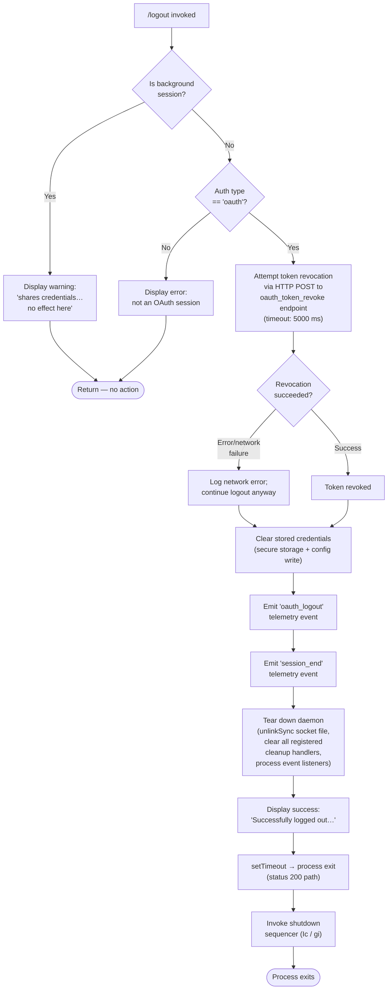

# `/logout`

> Analysis basis: CC v2.1.190 bundle.js (AST extraction + Claude interpretation)
> Minimum version: v2.1.190

---

## Overview

The `/logout` command signs the user out of their Anthropic account by revoking the active OAuth token, clearing all stored credentials, and tearing down daemon processes. It detects background session contexts and refuses to act in those cases, directing the user to run the command from a main terminal instead.

---

## Registration

| Field | Value |
|---|---|
| type | `local-jsx` |
| name | `logout` |
| description | Sign out from your Anthropic account |
| loc_byte | `11633275` |
| loc_byte_end | `11633559` |
| loc_line | `7767` |
| module_id | `vao` |
| load_inline | `true` |
| arbor_handler.name | `DSp` |
| arbor_handler.fqn | `claude-2.1.190::DSp` |
| arbor_handler.kind | `AsyncFunction` |
| arbor_handler.resolution_path | `module_id` |
| arbor_handler.n_hits | `0` |

Analysis basis: CC v2.1.190 bundle.js:+11633275

---

## Input Branching

The handler has 4+ distinct paths: background session guard, OAuth-only short-circuit, full token revocation + credential wipe, and post-logout teardown. A Mermaid flowchart is required.



Analysis basis: CC v2.1.190 bundle.js:+8170549

---

## Behavioral Spec

### 1 — Background Session Guard

Before attempting any credential action, the handler queries the current session context via the session-reader utility (`Ws` → `iUe`). If the session type is `"bg"`, `"daemon"`, or `"daemon-worker"` (literals at bundle.js:+2309148, +2309158, +2309172), the command emits a static warning message informing the user that the background session shares credentials with other sessions and that `/logout` has no effect there. The handler returns immediately without touching credentials or storage.

```
function isBackgroundSession(sessionContext):
    return sessionContext.type in {"bg", "daemon", "daemon-worker"}

async function logoutHandler(appState):
    session = readCurrentSession()        // Ws -> iUe
    if isBackgroundSession(session):
        displayWarning("This background session shares credentials…")
        return
```

Analysis basis: CC v2.1.190 bundle.js:+8170549, +2309148

---

### 2 — OAuth Session Check

After passing the background guard, the handler inspects the auth configuration to confirm the active session uses OAuth (`"oauth"` literal at bundle.js:+8171072). Non-OAuth sessions (Bedrock, Vertex, Foundry, etc.) are not eligible for this flow; the command exits early.

```
async function logoutHandler(appState):
    // ... background guard above ...
    authConfig = readAuthConfig()         // z2e -> Su -> K2e
    if authConfig.type != "oauth":
        displayError("not an OAuth session")
        return
```

Analysis basis: CC v2.1.190 bundle.js:+8170560, +8171072

---

### 3 — Token Revocation via HTTP

The handler attempts to revoke the active OAuth token by issuing an HTTP POST to the configured `oauth_token_revoke` endpoint (`"oauth_token_revoke"` literal at bundle.js:+2143198). The request includes a `Content-Type: application/json` header and carries a `refresh_token` payload (literals at bundle.js:+2143090, +2143145, +2143160). A hard timeout of **5000 ms** is applied (bundle.js:+2143188).

On network failure the revocation error is classified using the error-classifier utility (`T` → `nLc` → `w6o`), which maps error codes to categories including `"auth"` (HTTP 401/403), `"timeout"` (`ECONNABORTED`), and `"http"` (general HTTP error). Regardless of whether revocation succeeded or failed, the logout sequence continues — the credential wipe is not gated on server confirmation.

```
async function revokeToken(refreshToken, endpoint):
    try:
        response = httpPost(endpoint + "/oauth_token_revoke",
                            body={refresh_token: refreshToken},
                            headers={"Content-Type": "application/json"},
                            timeoutMs=5000)   // CO -> ho.post
        return {ok: true}
    catch error:
        category = classifyHttpError(error)   // T -> nLc -> w6o
        logNetworkError(category)
        return {ok: false, reason: category}
```

Analysis basis: CC v2.1.190 bundle.js:+8169216, +2143030, +2143198, +2143188

---

### 4 — Credential Wipe and Config Write

Following revocation (successful or not), stored credentials are erased. The operation calls into the secure-storage writer (`Le` / `vWs`) which handles keychain / plaintext fallback depending on the platform. The secure storage write emits internal telemetry:

- `secure_storage_credentials_write` (bundle.js:+2337252)
- `primary_transient_skip_fallback` (bundle.js:+2337350)
- `plaintext_fallback_used` (bundle.js:+2337499)
- `primary_and_fallback_failed` (bundle.js:+2337602)

The config file (`~/.claude.json`) is then updated with the auth fields removed. A lock-protected write sequence is used (`GQn` / `BQn`), with safeguards that refuse to write if the in-memory cache contains auth data that would be wiped unexpectedly (literal: `"saveConfigWithLock: re-read config is missing auth…"` at bundle.js:+13752338). The lock acquisition timeout is **60000 ms** (bundle.js:+13752692) and up to **5 backup copies** are retained in a `backups/` subdirectory (bundle.js:+13752941, +13753523).

```
async function wipeCredentials(configPath):
    lockAcquired = acquireConfigLock(timeoutMs=60000)  // GQn
    reRead       = readConfigFile(configPath)
    if cacheHasAuthButReReadDoesNot(reRead):
        logWarning("refusing to write — auth loss prevented")
        emit("tengu_config_auth_loss_prevented")
        return
    rotateBackups(configPath, maxBackups=5)
    writeConfigAtomically(configPath, reRead.withoutAuth,
                          perms=0o600)                 // sIt -> uf.writeFileSync
    releaseConfigLock()
```

Analysis basis: CC v2.1.190 bundle.js:+8170327, +13752338, +13752692, +13752941

---

### 5 — Daemon Teardown

After credentials are cleared, the logout handler invokes the cleanup orchestrator (`lBt`) which:

1. Calls `zDn` and `VQ` — clears in-memory state.
2. Calls `Ame` → `Oai.clear` — clears a module-level cache (bundle.js:+3048868).
3. Calls `UIe` — unregisters UI elements.
4. Calls `Kse` — shuts down the event bus: emits `"exit"` (bundle.js:+3332885), removes all `"beforeExit"` listeners (bundle.js:+3333629), clears intervals and removes process listeners via `clearInterval` and `process.removeListener`, empties five cleanup registries (`YIe`, `mSn`, `ZRt`, `uBr`, `IW`).
5. Calls `zHa` — unlinks the socket/lock file (`Cat.unlink`, bundle.js:+7268800) and clears path helpers.
6. Calls `wao` → `bOo` — tears down the background daemon worker: calls `clearTimeout` (bundle.js:+13728471) and unlinks the daemon socket file (`Cqe.unlink`, bundle.js:+13733936).

```
function performDaemonTeardown():
    clearInMemoryState()           // zDn, VQ
    clearModuleCache()             // Ame -> Oai.clear
    unregisterUI()                 // UIe
    shutdownEventBus()             // Kse -> iet -> gBr
    unlinkSocketFile()             // zHa -> Cat.unlink
    teardownDaemonWorker()         // wao -> bOo -> clearTimeout, Cqe.unlink
```

Analysis basis: CC v2.1.190 bundle.js:+8170407, +3332684, +3332885, +3333629, +7268800, +13733936

---

### 6 — Post-Logout Display and Process Exit

After teardown, the handler renders a JSX success message (`"Successfully logged out from your Anthropic account."` at bundle.js:+8170853) using the React renderer (`wxa.jsx`, bundle.js:+8170833). A `setTimeout` (bundle.js:+8170917) schedules the final process shutdown. The shutdown sequencer (`Ic` → `gi`) is invoked, which:

- Writes the final frame to the terminal (`G9e` → `gHe.writeSync`).
- Unmounts the React tree (`e.unmount`).
- Drains any pending writes (`qKe` → `C6o.drain`, bundle.js:+67368).
- Waits up to **3500 ms** for graceful exit (bundle.js:+7232524), then races against an `AbortSignal.timeout`.
- Calls `process.exit` or sends `SIGKILL` if the process does not exit cleanly (bundle.js:+7230085, +7230135).

A `"session_end"` event is emitted (bundle.js:+7232914) and the `tengu_scroll_summary` telemetry is fired before exit.

```
async function shutdownAfterLogout():
    displaySuccess("Successfully logged out from your Anthropic account.")
    emit("oauth_logout")           // literal at +8170330
    emit("session_end")            // literal at +7232914
    await drainOutputQueues()      // qKe -> C6o.drain
    await Promise.race([
        gracefulShutdown(timeoutMs=3500),  // gi -> Wga
        AbortSignal.timeout(...)
    ])
    process.exit()                 // qto -> process.exit
```

Analysis basis: CC v2.1.190 bundle.js:+8170833, +8170917, +8170853, +7232524, +7232914

---

## State & Side Effects

| Item | Detail |
|---|---|
| Telemetry — oauth_logout | Fired immediately before process teardown (bundle.js:+8170330) |
| Telemetry — session_end | Fired during shutdown sequencer (bundle.js:+7232914) |
| Telemetry — tengu_scroll_summary | Fired by shutdown sequencer (bundle.js:+7231933) |
| Telemetry — tengu_pewter_brook | Fired during UI teardown (bundle.js:+3556371) |
| Telemetry — tengu_cache_eviction_hint | Fired during session cleanup (bundle.js:+7232876) |
| Telemetry — tengu_feature_ok / tengu_feature_sad / tengu_feature_bad | Fired by generic feature tracking wrappers (bundle.js:+1025122, +1025270, +1025189) |
| Telemetry — tengu_config_* | Config lock contention, stale write, parse error, auth-loss prevented, fallback write (bundle.js:+13752011 et al.) |
| Telemetry — tengu_daemon_config_reload | Fired if daemon reloads config during shutdown (bundle.js:+17214348) |
| Telemetry — tengu_startup_perf | Startup profiling report emitted if profiling was enabled (bundle.js:+226441) |
| Hook registration | Removes `"exit"` and `"beforeExit"` process listeners; clears intervals via `clearInterval` and `process.removeListener` (bundle.js:+3332885, +3333629) |
| appState changes | Auth fields removed from in-memory config cache; five cleanup registries cleared |
| Secure storage | Credential entry deleted; fallback plaintext file removed if present |
| Filesystem | `~/.claude.json` rewritten without auth; socket/lock file unlinked; up to 5 backup copies retained in `backups/` |
| Sound | None identified in depth-2 traversal |

---

## Version History

| Version | Change |
|---|---|
| v2.1.190 | Initial analysis |

---

## Common Mistakes

1. **Running `/logout` inside a background or daemon session** — The command detects session type and exits without effect; the user must run it from the main interactive terminal.
2. **Expecting immediate token invalidation on network failure** — Token revocation is best-effort; the local credential wipe proceeds even if the server-side revocation HTTP call times out (5000 ms limit) or fails.
3. **Assuming the process stays alive after logout** — The command unconditionally tears down the process. Any unsaved state in the current session will be lost.
4. **Invoking `/logout` on non-OAuth sessions** (Bedrock, Vertex, Foundry, Mantle, `anthropicAws`) — The command only handles the `"oauth"` auth type; other auth types are rejected early without any credential changes.
5. **Editing `~/.claude.json` concurrently** — The config write uses a 60-second lock; concurrent writes from another Claude instance may cause lock contention (`tengu_config_lock_contention`) or trigger the auth-loss prevention guard, which will refuse to write and log a warning.

---

## Appendix — Identifier Mapping

> For bundle debugging only. Identifiers change across versions.

| Identifier | Role |
|---|---|
| `DSp` | Main logout async handler (arbor_handler; resolved via module_id `vao`) |
| `PSp` | Sibling render/display helper used by the logout UI flow |
| `dct` | Core logout orchestration function; invoked by `DSp` to perform the multi-step logout sequence |
| `Ws` | Session-context reader; checks if the current session is a background/daemon session |
| `iUe` | Session-type extractor called by `Ws` |
| `lBt` | Cleanup orchestrator; coordinates daemon teardown sub-steps |
| `z2e` | Auth configuration reader; determines auth type before logout proceeds |
| `Su` | Auth config parser and event emitter helper |
| `K2e` | Config model constructor used by `Su` |
| `zDn` | In-memory state clear step 1 |
| `VQ` | In-memory state clear step 2 |
| `Ame` | Module-level cache clearer (`Oai.clear`) |
| `UIe` | UI element unregistration routine |
| `Kse` | Event-bus shutdown coordinator |
| `V9` | Sub-routine of `Kse` for event-bus state |
| `q9` | Helper called by `V9` |
| `iet` | Cleanup registry clearer; clears `YIe`, `mSn`, `ZRt`, `uBr`, `IW` and removes process listeners |
| `gBr` | Interval and process-listener removal helper (`clearInterval`, `process.removeListener`) |
| `ke` | Error-logging and retry queue utility |
| `fo` | Error construction helper |
| `nt` | String normalizer utility |
| `Vi` | Essential-traffic tracker |
| `oou` | Queue shift/push manager |
| `zHa` | Socket/lock file unlinker |
| `XHa` | Path helper used by `zHa` |
| `r$t` | Path computation helper used by `zHa` |
| `Cas` | Low-level path util called by `r$t` |
| `Gpe` | Path join helper |
| `xon` | Path and directory helper |
| `wao` | Daemon worker teardown coordinator |
| `bOo` | Daemon worker shutdown (clears timeout, unlocks) |
| `IOo` | Inner daemon worker state accessor |
| `Wme` | Daemon worker process query helper |
| `eCe` | Path utility for daemon socket |
| `Ir` | String normalization helper for display |
| `Gl` | Storage accessor used during logout |
| `vWs` | Secure storage read/write dispatcher |
| `pUe` | Secure storage async read helper |
| `H9u` | Keychain store accessor |
| `Le` | Storage write wrapper (write path A) |
| `W` | Low-level atomic write utility |
| `Pe` | File-write helper |
| `Mt` | Storage write wrapper (write path B) |
| `Re` | Storage write wrapper (write path C) |
| `CO` | OAuth token revocation HTTP caller |
| `Ls` | OAuth endpoint URL builder |
| `MXo` | OAuth base URL resolver |
| `HGc` | OAuth environment selector |
| `T` | HTTP error classifier / logger dispatcher |
| `nLc` | HTTP error category mapper |
| `w6o` | Error code → category lookup |
| `Me` | JSON stringify helper |
| `wc` | Header redaction utility (`[REDACTED]`) |
| `p8o` | Redaction map builder |
| `hze` | Log output writer |
| `e8o` | Stream write helper |
| `iLc` | Log file rotation and append utility |
| `WKe` | Log buffer/flush scheduler |
| `dpe` | Log path helper |
| `Wt` | File existence / mkdirp helper |
| `xre` | EISDIR error handler |
| `h8o` | Log file path builder |
| `Ncr` | Log file rotation (rename + unlink old) |
| `sLc` | Log append-and-rotate worker |
| `Ei` | Log drain registration (`C6o.register`) |
| `HJ` | Display/render utility invoked near end of logout |
| `vFr` | File-system path resolver used for config location |
| `Yai` | Config path resolver (hashes username for path) |
| `OFs` | Config directory builder |
| `vO` | Path normalizer + SHA-256 hasher |
| `NC` | User identity resolver |
| `ZM` | OS user-info reader (`epn.userInfo`) |
| `be` | String coercion helper |
| `hn` | Global config save coordinator (fallback write path) |
| `GQn` | Config write-with-lock implementation |
| `SWs` | Config store initializer |
| `cn` | Error code extractor |
| `SEe` | Config backup and atomic-write helper |
| `PHt` | Config post-write hook |
| `$Oo` | Backup directory path builder |
| `sIt` | Atomic file write with fsync and permissions |
| `CDe` | Config diff helper |
| `NOo` | Config entry enumerator |
| `DKt` | Timestamp utility used by config writer |
| `BQn` | Config save fallback path |
| `rmn` | Config cleanup routine |
| `o` | Display column formatter |
| `ZPe` | App state mutation helper |
| `PSp` | Logout UI renderer (see above) |
| `US` | Be-string coercion called by `z2e` |
| `BEt` | Event emitter helper for auth events |
| `Mir` | Mirror/sync helper for auth state |
| `a` | MCP server state coordinator |
| `d9e` | MCP connection builder |
| `brr` | MCP connection result applier |
| `_la` | MCP cleanup helper |
| `l` | MCP transport-layer helper |
| `fBo` | MCP server orchestrator (filter, connect, retry) |
| `Dir` | Direction/layout utility |
| `Ic` | Shutdown sequencer entry point |
| `gi` | Full graceful-shutdown implementation |
| `G9e` | Terminal frame writer + React unmount |
| `OU` | Output flush helper |
| `ETn` | Terminal restore utility (ANSI save/restore cursor) |
| `Wto` | Final output line writer |
| `cw` | Terminal width helper |
| `B3` | Terminal state helper |
| `XFt` | Terminal stats/stat-sync helper |
| `ph` | Render-config helper |
| `kga` | Output escape helper |
| `qto` | Process kill/exit enforcer |
| `qKe` | Output drain (`C6o.drain`) |
| `d` | Daemon supervisor manager |
| `rqe` | File read-validate helper |
| `y$l` | Column width calculator |
| `E` | Supervisor stop/start helper |
| `GEc` | Daemon heartbeat sender |
| `Wga` | Parallel shutdown settler (`Promise.allSettled`) |
| `ZSt` | Startup profiling reporter |
| `Jcr` | Profiling result formatter |
| `R8o` | Profiling file writer |
| `oPn` | Scroll summary reporter |
| `Lga` | Scroll measurement helper |
| `wga` | Scroll statistics calculator |
| `bs` | Fullscreen/flicker detection helper |
| `iEt` | Cache eviction hint emitter |
| `Ve` | React component registration helper |
| `aKe` | React component base |
| `Rr` | Nonconforming terminal handler |
| `Ng` | Terminal type checker |
| `q9e` | Promise-based exit waiter |
| `ePn` | Exit promise resolver |
| `yW` | Auth token generator helper |
| `kt` | Version-label helper |
| `WCn` | Config freeze/build helper |
| `VDt` | String normalizer for config keys |
| `J$` | Feature-flag lookup |
| `hc` | Telemetry dimension helper |
| `WCd` | JWT-like token decoder (base64url + JSON.parse) |
| `ANi` | Token field extractor |

---

*Note: index built via Arbor fallback; some signals (telemetry, literals) may be missing — see arbor-fallback.js.*