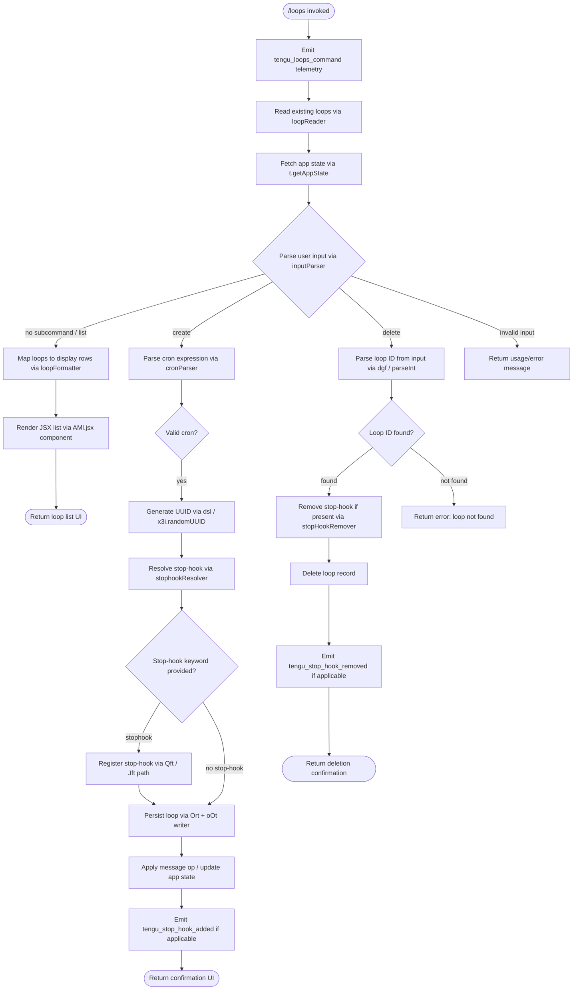

# `/loops`

> Analysis basis: CC v2.1.190 bundle.js (AST extraction + Claude interpretation)
> Minimum version: v2.1.190

---

## Overview

The `/loops` command provides an interactive management interface for Claude Code's background loop sessions. It allows users to list all active loops, create new loops with configurable cron-style schedules and stop-hooks, and delete existing loops. The command operates as a `local-jsx` type, rendering an interactive React-based UI component and coordinating with the daemon and app state layer.

---

## Registration

| Field | Value |
|---|---|
| type | `local-jsx` |
| name | `loops` |
| description | `List, create, and delete loops` |
| loc_byte | `12530584` |
| loc_byte_end | `12530741` |
| loc_line | `8548` |
| immediate | `true` |
| module_id | `SMl` |
| load_inline | `true` |
| arbor_handler.name | `pgf` |
| arbor_handler.fqn | `claude-2.1.190::pgf` |
| arbor_handler.kind | `AsyncFunction` |
| arbor_handler.resolution_path | `module_id` |
| arbor_handler.n_hits | `0` |

Analysis basis: CC v2.1.190 bundle.js:+12530584 – +12530741

---

## Input Branching

The handler `pgf` has more than three distinct execution branches depending on user input: list (no subcommand), create (new loop with cron/stop-hook parameters), delete (by loop ID), and error/fallback paths. A Mermaid flowchart is used.



---

## Behavioral Spec

### Main Handler (`pgf`)

The handler is an `AsyncFunction` resolved via `module_id` → `SMl` → `pgf`.

```
async function loopsCommandHandler(context):
    emitTelemetry("tengu_loops_command")

    existingLoops = await readLoops(context)          // dae -> Prt
    appState      = context.getAppState()

    parsedInput = parseUserInput(context.input)       // MD + dgf

    if parsedInput.subcommand == "list" or none:
        rows = formatLoopList(existingLoops)          // Xft -> CRe, Q6a
        return renderJSX(rows)                        // AMl.jsx

    elif parsedInput.subcommand == "create":
        cronExpr = parseCronExpression(parsedInput)   // dgf
        validateCron(cronExpr)                        // bounds: 60, 59, 23, 31
        loopId = generateUUID()                       // dsl / x3i.randomUUID
        newLoop = buildLoopRecord(loopId, cronExpr, Date.now())  // Ort
        if parsedInput.stophook:
            registerStopHook(newLoop, parsedInput.stophook)      // Qft / Jft
            emitTelemetry("tengu_stop_hook_added")
        persistLoop(newLoop, context)                 // oOt, Prt
        applyMessageOp(context, "append", newLoop)
        return renderJSX(confirmationView("created", newLoop))

    elif parsedInput.subcommand == "delete":
        loopId = parseLoopId(parsedInput)             // dgf -> parseInt
        target = findLoop(existingLoops, loopId)
        if not target:
            return renderJSX(errorView("loop not found"))
        if target.hasStopHook:
            removeStopHook(target)                    // Qft / Jft
            emitTelemetry("tengu_stop_hook_removed")
        deleteLoopRecord(target, context)
        return renderJSX(confirmationView("deleted", target))

    else:
        return renderJSX(usageView())
```

Analysis basis: CC v2.1.190 bundle.js:+12529549

---

### Loop Reader (`dae` → `Prt`)

Reads the persisted loop configuration from the filesystem.

```
async function readLoops(context):
    dir = pathJoin(configRoot(), ".claude")           // oge -> $wn.join
    rawText = fs.readFile(dir, "utf-8")               // Prt -> t.readFile, literal "utf-8" at +4928006
    parsed = parseLoopEntries(rawText)                // c1 -> _Md
    if not Array.isArray(parsed):
        return []
    return parsed
```

Analysis basis: CC v2.1.190 bundle.js:+4929966, +4928006

---

### Cron Expression Parser (`dgf`)

Parses and validates a free-form cron-like schedule string entered by the user.

```
function parseCronExpression(inputString):
    trimmed = inputString.trim()
    match   = trimmed.match(cronPattern)             // dgf -> e.match
    if not match:
        return null

    minutes = parseInt(match.minutes)                // dgf -> parseInt
    hours   = parseInt(match.hours)

    // Clamp to valid calendar bounds
    minutes = Math.max(0, Math.min(minutes, 59))     // literal 59 at +12529316
    hours   = Math.min(hours, 23)                    // literal 23 at +12529387
    day     = Math.min(day, 31)                      // literal 31 at +12529440

    // Additional rounding
    rounded = Math.ceil(raw / 60) * 60              // literals 60 at +12529282, dgf -> Math.ceil
    rounded = Math.round(rounded)                    // dgf -> Math.round

    return {minutes, hours, day, raw: trimmed}
```

Human-readable schedule labels observed in the literals:
- `"Every minute"` (bundle.js:+4925870)
- `"Every hour"` (bundle.js:+4926087)
- Range `"1-5"` (bundle.js:+4926794)

Analysis basis: CC v2.1.190 bundle.js:+12530101

---

### Loop Record Builder (`Ort`)

Creates the data structure representing a new loop before persistence.

```
async function buildLoopRecord(context, cronExpr):
    loopId    = crypto.randomUUID()                  // Ort -> x3i.randomUUID
    createdAt = Date.now()                           // Ort -> Date.now
    config    = buildConfigBlock(cronExpr)           // Ort -> Kde

    raw = await readLoops(context)                   // Ort -> Prt
    raw.push({id: loopId, createdAt, ...config})

    writeLoops(raw, context)                         // Ort -> oOt
    return loopId
```

UUID generation uses 8-character prefix truncation (literal `8` at bundle.js:+4929331).

Analysis basis: CC v2.1.190 bundle.js:+12530199

---

### Loop Formatter / Display Builder (`Xft` → `CRe`, `Q6a`)

Formats the list of loops for display in the terminal UI.

```
function formatLoopList(loops):
    columnMap = new Map()
    for loop in loops:
        paddedLabel = loop.label.padEnd(padding)     // CRe -> o.set, i.padEnd
        columnMap.set(loop.id, paddedLabel)          // CRe -> o.set

    rows = loops.map(loop => buildRow(loop))         // Q6a -> e.map
    return rows
```

Padding uses a two-space separator literal (`"  "` at bundle.js:+17224859).

Analysis basis: CC v2.1.190 bundle.js:+12529597

---

### Stop-Hook Registration (`Qft` / `Jft`)

When a loop is created with a `stophook` keyword, the stop-hook is registered in app state and associated with the loop. Deletion performs the reverse.

```
async function registerStopHook(context, loopRecord):
    currentState = context.getAppState()             // Qft -> e.getAppState
    hookId       = generateUUID()                    // dsl -> lsl.randomUUID
    hookPayload  = {type: "goal", status: "goal_status", ...loopRecord}
    newState     = applyMessageOp(currentState, "append", hookPayload)
    context.setAppState(newState)                    // Qft -> e.setAppState
    context.applyMessageOp(hookPayload)              // Qft -> e.applyMessageOp
    emitTelemetry("tengu_stop_hook_added")           // +10647912

async function removeStopHook(context, loopRecord):
    currentState = context.getAppState()             // Jft -> t.getAppState
    newState     = removeHookFromState(currentState) // Jft -> Y_
    context.setAppState(newState)                    // Jft -> t.setAppState
    context.applyMessageOp(removalOp)               // Jft -> t.applyMessageOp
    emitTelemetry("tengu_stop_hook_removed")         // +10648284
```

Literal keys observed: `"stophook"` (+12529733), `"goal"` (+10648318), `"goal_status"` (+10648447), `"append"` (+10648250), `"attachment"` (+10648360).

Analysis basis: CC v2.1.190 bundle.js:+12530287, +12529975

---

### Daemon / Background Session Integration (`P3o`, `f`, `D`)

The loops system interacts with the daemon layer to track the lifecycle of running background sessions associated with each loop.

```
function manageDaemonForLoop(loop):
    sessionState = readSessionState(loop)            // P3o -> Di, ec
    // State machine values: "working", "idle", "bg", "crashed",
    //   "blocked", "done", "killed", "failed", "active", "resuming"
    match sessionState:
        "working" | "bg":
            monitorSession(loop)                     // P3o -> cht, Yt
        "idle":
            scheduleNextRun(loop, cronExpr)          // P3o -> setTimeout, 300000ms timeout
        "crashed" | "failed":
            reportError(loop)
        "killed" | "done":
            cleanupSession(loop)                     // P3o -> qm.rm, qm.unlink
```

Timeout constant: 300,000 ms (5 minutes) at bundle.js:+17206382.

State file: `"state.json"` (bundle.js:+17204850).

Analysis basis: CC v2.1.190 bundle.js:+17204611

---

### Input Parsing Utility (`c1` → `_Md`)

Parses raw user input text into structured fields (loop index, range, etc.).

```
function parseInputTokens(rawInput):
    trimmed = rawInput.trim()                        // c1 -> e.trim
    parts   = trimmed.split(delimiter)               // _Md -> e.split
    for part in parts:
        m = part.match(rangePattern)                 // _Md -> s.match
        if m:
            start = parseInt(m[1], 10)               // _Md -> parseInt, literal 10 at +4924078
            end   = parseInt(m[2], 10)
            for v in range(start, end+1):
                resultSet.add(v)                     // _Md -> o.add
    return Array.from(resultSet)                     // _Md -> Array.from
```

Numeric limits used in range parsing: `3` (+4924240), `6` (+4924276), `7` (+4924282), `5` (+4924615), `4` (+4924778).

Analysis basis: CC v2.1.190 bundle.js:+4924579

---

## State & Side Effects

| Item | Detail |
|---|---|
| Telemetry — primary | `tengu_loops_command` (bundle.js:+12529551) — fired once on every invocation |
| Telemetry — stop-hook added | `tengu_stop_hook_added` (bundle.js:+10647912) — fired when a loop is created with a stop-hook |
| Telemetry — stop-hook removed | `tengu_stop_hook_removed` (bundle.js:+10648284) — fired when a loop with a stop-hook is deleted |
| Telemetry — daemon background | `tengu_bg_dispatch_sigkill_escalate`, `tengu_bg_spare_enable`, `tengu_bg_spare_claim`, `tengu_bg_spare_claim_fail`, `tengu_bg_sendclaim_failed`, `tengu_bg_dispatch_low_mem`, `tengu_bg_low_mem_mb`, `tengu_bg_state_read_transient` — daemon/session lifecycle events reachable from loop management |
| Telemetry — daemon lifecycle | `tengu_daemon_config_reload`, `tengu_daemon_idle_exit`, `tengu_daemon_yield`, `tengu_daemon_control`, `tengu_daemon_bg_session_create` |
| Telemetry — feature gate | `tengu_feature_ok`, `tengu_feature_bad`, `tengu_feature_sad` |
| Telemetry — MCP | `tengu_mcp_skills` |
| App state changes | `setAppState` / `applyMessageOp` called on stop-hook registration and removal; fields `"goal"`, `"goal_status"`, `"attachment"` written |
| Filesystem writes | Loop config written under `.claude/` directory (+4929147); `state.json` managed per session (+17204850); `pins.json` consulted for pinned sessions (+4301182) |
| Hook registration | Stop-hook registered via `Qft`/`Jft` path; uses `lsl.randomUUID` to mint hook ID |
| Daemon socket | `uV.claim`, `uV.spawn`, `Yrr.connect` — daemon process is contacted or spawned when managing background loop sessions |
| Process signals | `SIGTERM` (+17174726), `SIGKILL` (+17198276) used for daemon/loop process termination |
| Sound | None detected in depth-2 traversal |

---

## Version History

| Version | Change |
|---|---|
| v2.1.190 | Initial analysis |

---

## Common Mistakes

1. **Providing an invalid cron expression** — The parser applies hard bounds (minutes ≤ 59, hours ≤ 23, day ≤ 31). Expressions that do not match the expected pattern return `null` and the creation flow is aborted with an error view.
2. **Deleting a loop by display index vs. UUID** — The delete subcommand uses `parseInt` to extract a numeric ID. Passing a UUID string directly will fail; use the numeric index shown in the list view.
3. **Expecting synchronous deletion** — Loop deletion involving a daemon-managed background session schedules cleanup with a 300,000 ms (5-minute) timeout. The loop entry may appear gone from the list while the underlying session is still shutting down.
4. **Referencing `stophook` keyword incorrectly** — The literal keyword checked is `"stophook"` (bundle.js:+12529733). Any variation in spelling or casing will skip stop-hook registration silently.
5. **Assuming loop state is purely in-memory** — Loops are persisted to the `.claude/` directory on disk. Manually editing or deleting these files while the command is running can cause inconsistent state.

---

## Appendix — Identifier Mapping

> For bundle debugging only. Identifiers change across versions.

| Identifier | Role |
|---|---|
| `pgf` | Main loops command handler (AsyncFunction) |
| `W` | General utility / logger called from handler |
| `dae` | Loop data reader — orchestrates filesystem read |
| `Prt` | Low-level loop file reader (reads UTF-8, returns parsed entries) |
| `Wt` | Filesystem helper (likely `stat` / existence check) |
| `oge` | Config path resolver (joins root + `.claude`) |
| `ic` | Inner config directory helper |
| `Xo` | Error code normalizer |
| `cn` | Error constructor / wrapper |
| `ke` | Process-runner / subprocess wrapper |
| `fo` | Error formatter (uses `Error` + `String`) |
| `nt` | String coercion utility |
| `Vi` | Essential-traffic network filter |
| `oou` | Queue rotate (shift + push on internal queue) |
| `T` | Message / token formatter |
| `nLc` | Token metadata builder |
| `Me` | JSON serialiser wrapper |
| `wc` | String redaction / sanitiser (replaces sensitive values with `[REDACTED]`) |
| `hze` | Secondary string escape helper |
| `iLc` | File-content loader with byte-length check and `Buffer.byteLength` |
| `c1` | User input trimmer and tokeniser |
| `_Md` | Range parser (split → match → parseInt → Set.add) |
| `HI` | High-level input validation gate |
| `VL` | Core validator / assert helper |
| `Xft` | Loop list formatter (builds padded column map) |
| `CRe` | Column entry setter (Map.set + padEnd) |
| `Q6a` | Row mapper (Array.map over loop entries) |
| `kt` | App-state key extractor |
| `MD` | Schedule / cron string parser (match + parseInt + Date UTC methods) |
| `f` | Background session manager (orchestrates spawn, kill, state transitions) |
| `D` | Individual daemon process controller |
| `VEc` | Daemon realpath + stat resolver |
| `sp` | Spawn-related helper |
| `XJf` | Daemon IPC frame builder |
| `d` | Daemon IPC channel writer |
| `Kn` | Timeout/abort promise helper |
| `c` | Cleanup callback holder |
| `Re` | Feature-bad reporter |
| `Pe` | Feature-gate evaluator |
| `Le` | Feature-ok reporter |
| `GXn` | macOS low-memory checker |
| `it` | Token / session tracker |
| `B2e` | Pin file reader (reads `pins.json`, filters, lists directories) |
| `MDt` | Pin path resolver |
| `Gt` | JSON.parse wrapper |
| `kn` | Error-code normaliser (maps errno strings) |
| `ECd` | Recursive directory scanner for session files |
| `U` | Daemon idle-exit watchdog (setTimeout + retireIfSettled) |
| `N` | Watchdog inner timer reference |
| `M` | Secondary timer / clearTimeout wrapper |
| `L3o` | Daemon socket claim + connect orchestrator |
| `n1o` | Session workspace initialiser (mkdir + writeFile) |
| `EJf` | Send-claim timeout enforcer (5 000 ms, raises "send-claim timeout") |
| `yJf` | Claim frame builder (wraps `uV.buildClaimFrame`) |
| `Jd` | Socket error logger |
| `be` | String coercion helper |
| `gR` | Binary frame encoder (Buffer.allocUnsafe + writeUInt32BE + writeUInt8) |
| `P3o` | Loop session lifecycle manager (create, monitor, clean up) |
| `ec` | Session path builder |
| `Di` | Session state file reader/writer (reads `state.json`, manages `VZ` cache) |
| `yg` | Session active-state setter |
| `Eve` | Session environment variable extractor |
| `kd` | Session metadata writer (Me + fy) |
| `cht` | Session completion watcher (Date.now + wtf catch) |
| `i8t` | Session init-token writer |
| `bye` | Session bye-frame writer |
| `yR` | Late-exit handler |
| `uN` | Session startup sequencer |
| `lM` | Late-message handler |
| `s8t` | Session state initialiser |
| `p` | Forced-shutdown handler (process.exit + u.abort) |
| `jb` | Shutdown pre-flight |
| `u` | Abort controller wrapper |
| `F` | Interval disposer (clearInterval) |
| `m` | Multi-session kill iterator |
| `x` | Individual session kill writer |
| `l` | Log-rotate / RUL initiator |
| `rUl` | Session log writer (AQ + Date.now + Xs + nVt + Me) |
| `AQ` | Log entry formatter |
| `Xs` | AsyncLocalStorage store reader |
| `nVt` | Log file path resolver (`daemon.status.json`) |
| `h` | Date computation helper (UTC day/date/hours manipulation) |
| `uae` | Loop update applicator (eK + Prt + filter + n.has + oOt) |
| `eK` | Loop key existence checker |
| `oOt` | Loop file writer (mkdir + writeFile under `.claude/`) |
| `Qft` | Stop-hook adder (getAppState → applyMessageOp → setAppState) |
| `dsl` | UUID generator (lsl.randomUUID) |
| `Ve` | JSX helper / React element creator |
| `aKe` | Base JSX factory |
| `dgf` | Cron input parser (match + parseInt + Math.max/ceil/round) |
| `Ort` | Loop record builder (randomUUID + Date.now + Kde + Prt + oOt) |
| `Kde` | Loop config block constructor |
| `a` | MCP + background session orchestrator |
| `d9e` | MCP connection runner |
| `RB` | MCP slot state updater |
| `Qw` | MCP event dispatcher |
| `zn` | Generic task runner |
| `FUt` | MCP filter predicate |
| `Hua` | MCP connection attempt handler |
| `hyn` | MCP metric recorder |
| `fyn` | MCP cleanup helper |
| `ln` | MCP debug logger |
| `zRn` | MCP reconnect scheduler |
| `BUt` | MCP auth-token refresher |
| `gJr` | MCP result logger |
| `eL` | Token tracker initiator |
| `tJr` | MCP include-filter checker |
| `w` | MCP backoff timer |
| `Vc` | MCP error logger |
| `Aua` | MCP zone wrapper |
| `yit` | MCP retry-count parser |
| `nMn` | MCP retry-interval parser |
| `brr` | MCP connection result applier |
| `u9e` | MCP update applier |
| `zT` | MCP cleanup executor |
| `_la` | MCP roster query |
| `rQr` | MCP roster reader |
| `fBo` | MCP client orchestrator (Object.entries → filter → getClients → d9e → brr) |
| `xRn` | MCP capability checker |
| `Hit` | MCP health initialiser |
| `Jft` | Stop-hook remover (getAppState → Y_ → setAppState → applyMessageOp) |
| `KEo` | Policy/hooks gate evaluator |
| `F2` | Policy settings reader |
| `Tn` | Policy config parser |
| `Zse` | Policy block builder |
| `wr` | Trust gate checker |
| `wd` | Hook gate resolver |
| `ORf` | Hook rule evaluator |
| `Mt` | Feature-sad reporter |
| `Y_` | App-state stop-hook list reducer (Object.values) |

---

Note: index built via Arbor fallback; some signals (telemetry, literals) may be missing — see arbor-fallback.js.