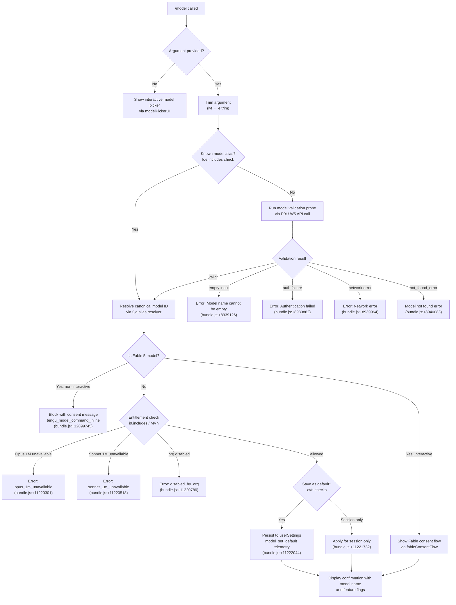

# `/model`

> Analysis basis: CC v2.1.190 bundle.js (AST extraction + Claude interpretation)
> Minimum version: v2.1.190

---

## Overview

The `/model` command sets the AI model used by Claude Code for the current session or as a persistent default. When invoked with a model name argument, it validates the name against the available model list, checks account entitlements and org policy, and either applies the model immediately or prompts the user through a consent flow for special models (e.g., Fable 5). When invoked without an argument, it presents an interactive model picker.

---

## Registration

| Field | Value |
|---|---|
| type | `local` |
| name | `model` |
| description | Set the AI model for Claude Code |
| argumentHint | `<model>` |
| supportsNonInteractive | `true` |
| module_id | `f1l` |
| load_inline | `true` |
| loc_byte | `12736863` |
| loc_byte_end | `12737037` |
| loc_line | `8684` |
| arbor_handler.name | `lyf` |
| arbor_handler.fqn | `claude-2.1.190::lyf` |
| arbor_handler.kind | `AsyncFunction` |
| arbor_handler.resolution_path | `module_id` |
| arbor_handler.n_hits | `0` |

Analysis basis: CC v2.1.190 bundle.js:+12736863

---

## Input Branching

Six or more distinct execution paths exist depending on argument presence, model identity, entitlement state, and org policy; a Mermaid flowchart is required.



---

## Behavioral Spec

### Handler Entry (`lyf`) — Argument Trimming and Alias Check

```
async function modelCommandHandler(args, context):
    rawInput = args.trim()                          // bundle.js:+12699595
    if rawInput is in knownAliasSet:               // bundle.js:+12699611
        appState = context.getAppState()           // bundle.js:+12699634
        resolvedModel = resolveModelAlias(rawInput, appState)  // MVn, bundle.js:+12699678
    else:
        resolvedModel = rawInput

    if resolvedModel is in fableModelSet:          // i9.includes, bundle.js:+12699698
        if nonInteractiveMode:
            emitTelemetry("tengu_model_command_inline")  // bundle.js:+12699745
            return error("Fable 5 uses usage credits and needs a one-time consent · "
                         "pick Fable from /model in an interactive session to set it up")
                         // bundle.js:+12699974
        else:
            result = await fableConsentFlow(...)   // W, bundle.js:+12699743

    result = await buildModelList(resolvedModel, context)  // ep, bundle.js:+12699785
    result = await applyModelSwitch(resolvedModel, context)  // wWt, bundle.js:+12699826
    confirmationUI = buildConfirmationDisplay(result)  // ZY, bundle.js:+12699881
    return confirmationUI
```

Analysis basis: CC v2.1.190 bundle.js:+12699595

---

### Alias Resolution (`Qo`) — Model Short-Name to Canonical ID

The alias resolver maps short names to canonical model identifiers. Supported aliases found in the bundle:

| Alias | Canonical ID |
|---|---|
| `opusplan` | Opus in plan mode, else Sonnet (bundle.js:+2296248) |
| `fable` | resolves via tier logic (bundle.js:+2297929) |
| `sonnet` | `claude-sonnet-4-*` series (bundle.js:+2298033) |
| `haiku` | `claude-haiku-4-*` series (bundle.js:+2298072) |
| `opus` | `claude-opus-4-*` series (bundle.js:+2298111) |
| `best` | highest available tier (bundle.js:+2298145) |
| `[1m]` suffix | 1M-context variant (bundle.js:+2297977) |

```
function resolveAlias(alias, appState):
    normalized = alias.trim().toLowerCase()        // bundle.js:+2297852, +2297863
    switch normalized:
        case "sonnet":  return lookupSonnetTier(appState)
        case "haiku":   return lookupHaikuTier(appState)
        case "opus":    return lookupOpusTier(appState)
        case "best":    return lookupBestTier(appState)
        case "fable":   return lookupFableTier(appState)
        case "opusplan": return opusPlanAlias(appState)
        default:        return normalizeModelString(alias)  // Qo fallback
```

Analysis basis: CC v2.1.190 bundle.js:+2297852

---

### Known Model List (`t_` / `Eo`) — Available Claude Model Identifiers

The bundle contains an explicit enumerated list of recognized model IDs resolved via `t_` (bundle.js:+2294413) and `Eo` (bundle.js:+2295534). Recognized full model IDs include:

- `claude-fable-5` (bundle.js:+2294440)
- `claude-mythos-5` (bundle.js:+2294495)
- `claude-opus-4-8` through `claude-opus-4-0` (bundle.js:+2294552–+2294869)
- `claude-sonnet-4-6`, `claude-sonnet-4-5`, `claude-sonnet-4-0` (bundle.js:+2294901–+2295057)
- `claude-haiku-4-5` (bundle.js:+2295091)
- `claude-3-7-sonnet`, `claude-3-5-sonnet`, `claude-3-5-haiku` (bundle.js:+2295150–+2295272)
- `claude-3-opus`, `claude-3-sonnet`, `claude-3-haiku` (bundle.js:+2295331–+2295441)

Provider detection also checks for `application-inference-profile` ARN prefix (bundle.js:+2295577).

Analysis basis: CC v2.1.190 bundle.js:+2294413

---

### Model Validation Probe (`P9t` / `W5`) — Live API Validation

When the argument is not a known alias, a live validation API call is made:

```
async function validateModelWithAPI(modelName, context):
    if modelName.trim() == "":
        throw Error("Model name cannot be empty")  // bundle.js:+8939126

    normalized = modelName.toLowerCase()           // bundle.js:+8939274
    if normalized in knownProvidersSet:            // wfe.includes, bundle.js:+8939293
        // skip live check for known provider strings
        return { valid: true }

    if validationCache.has(normalized):            // hpo.has, bundle.js:+8939395
        return validationCache.get(normalized)

    // build side-query API request via W5 (bundle.js:+8939440)
    response = await makeSideQueryRequest(modelName, context)

    on auth failure:
        return error("Authentication failed. Please check your API credentials.")
        // bundle.js:+8939862
    on network failure:
        return error("Network error. Please check your internet connection.")
        // bundle.js:+8939964
    on response.type == "not_found_error":
        return error("model: " + modelName + " not found")
        // bundle.js:+8940083, +8940165

    validationCache.set(normalized, result)        // hpo.set, bundle.js:+8939603
    return result
```

The validation probe uses `model_validation` as its query type (bundle.js:+8939490) and sends a minimal `"Hi"` prompt (bundle.js:+8939559) with `"ephemeral"` cache control (bundle.js:+8939584).

Short-form aliases recognized during validation include hyphen and underscore variants:
- `fable-5` / `fable_5` (bundle.js:+8940444, +8940467)
- `opus-4-8` / `opus_4_8` through `opus-4-5` / `opus_4_5` (bundle.js:+8940544–+8940775)
- `sonnet-4-6` / `sonnet_4_6`, `sonnet-4-5` / `sonnet_4_5` (bundle.js:+8940820–+8940921)

Analysis basis: CC v2.1.190 bundle.js:+8939089

---

### Entitlement and Policy Enforcement (`wWt` / `MTe`)

After resolving the model, the command checks account entitlements and org policy:

```
function applyModelSwitch(resolvedModel, context):
    // Check 1M context availability
    if resolvedModel requires 1M context:
        if model is opus variant:
            if not entitled:
                return denied("opus_1m_unavailable",
                    "Opus with 1M context is not available for your account. "
                    "Learn more: https://code.claude.com/docs/en/model-config#extended-context-with-1m")
                    // bundle.js:+11220301, +11220339
        if model is sonnet[1m] or sonnet-4-6[1m]:
            if not entitled:
                return denied("sonnet_1m_unavailable",
                    "Sonnet 4.6 with 1M context is not available for your account. "
                    "Learn more: https://code.claude.com/docs/en/model-config#extended-context-with-1m")
                    // bundle.js:+11220518, +11220558

    // Check org-level policy via MTe (bundle.js:+11220717)
    modelStatus = getModelPolicyStatus(resolvedModel)
    if modelStatus == "disabled":                  // bundle.js:+2283172
        return denied("disabled_by_org", ...)      // bundle.js:+11220786

    if modelStatus == "absent":                    // bundle.js:+2283298
        return error("That model ...")             // bundle.js:+2283326

    // Record model switch
    emitTelemetry("model_switch")                  // bundle.js:+11219958
    return { success: true, model: resolvedModel }
```

Model policy state values: `"active"` (bundle.js:+2286864), `"inactive"` (bundle.js:+2286822), `"refused"` (bundle.js:+2286784), `"disabled"` (bundle.js:+2283172), `"absent"` (bundle.js:+2283298).

Analysis basis: CC v2.1.190 bundle.js:+11220717

---

### Confirmation Display (`xVn`) — Result Rendering

After a successful model switch, `xVn` builds the confirmation message shown to the user:

```
function buildConfirmationDisplay(result, wasDefault, context):
    modelLabel = getDisplayName(result.model)      // oM, bundle.js:+11221675

    if wasDefault:
        suffix = " and saved as your default for new sessions"
        // bundle.js:+11221686
    else:
        suffix = " for this session only"
        // bundle.js:+11221732

    features = []
    if model has fast mode ON:
        features.push(" · Fast mode ON")          // bundle.js:+11221850
    if model draws from usage credits:
        features.push(" · Draws from usage credits")  // bundle.js:+11221901
    if model has fast mode OFF:
        features.push(" · Fast mode OFF")         // bundle.js:+11221947

    return bold(modelLabel) + suffix + features.join("")
```

When the model is saved as default, telemetry `"model_set_default"` is emitted (bundle.js:+11222044).

"Managed settings" label appears when org policy overrides user choice (bundle.js:+11222253).

Analysis basis: CC v2.1.190 bundle.js:+11221533

---

### Fable 5 Consent Gate (`lyf` entry check)

Fable 5 requires a one-time interactive consent because it draws from usage credits:

```
function checkFableConsent(modelName, isNonInteractive):
    if isFableModel(modelName):                    // i9.includes, bundle.js:+12699698
        if isNonInteractive:
            emitTelemetry("tengu_model_command_inline")  // bundle.js:+12699745
            emit telemetry result: "noninteractive_set_blocked"  // bundle.js:+12699925
            return blockedResponse(
                "Fable 5 uses usage credits and needs a one-time consent · "
                "pick Fable from /model in an interactive session to set it up"
            )  // bundle.js:+12699974
        else:
            // proceed to interactive consent flow via W (bundle.js:+12699743)
            return await showFableConsentDialog()
```

`"model_fable_consent"` is the telemetry key for the consent gate (bundle.js:+12699903).

Analysis basis: CC v2.1.190 bundle.js:+12699698

---

### Model Display Name Mapping (`Qo` / `yp`)

Human-readable display names are mapped from canonical model IDs:

| Canonical ID | Display Name |
|---|---|
| `claude-fable-5` | Fable 5 (bundle.js:+2296952) |
| `claude-mythos-5` | Mythos 5 (bundle.js:+2296990) |
| `claude-opus-4-8` | Opus 4.8 (bundle.js:+2297029) |
| `claude-opus-4-7` | Opus 4.7 (bundle.js:+2297070) |
| `claude-opus-4-6` | Opus 4.6 (bundle.js:+2297111) |
| `claude-opus-4-5` | Opus 4.5 (bundle.js:+2297152) |
| `claude-opus-4-1` | Opus 4.1 (bundle.js:+2297193) |
| `claude-opus-4-0` | Opus 4 (bundle.js:+2297234) |
| `claude-sonnet-4-6` | Sonnet 4.6 (bundle.js:+2297275) |
| `claude-sonnet-4-5` | Sonnet 4.5 (bundle.js:+2297320) |
| `claude-sonnet-4-0` | Sonnet 4 (bundle.js:+2297365) |
| `claude-3-7-sonnet` | Sonnet 3.7 (bundle.js:+2297408) |
| `claude-3-5-sonnet` | Sonnet 3.5 (bundle.js:+2297451) |
| `claude-haiku-4-5` | Haiku 4.5 (bundle.js:+2297493) |
| `claude-3-5-haiku` | Haiku 3.5 (bundle.js:+2297536) |

Models with 1M context append `" (1M context)"` to the display name (bundle.js:+2296892).

Analysis basis: CC v2.1.190 bundle.js:+2296952

---

### Session ID / Hash (`ep`) — Model Fingerprinting

A SHA-256 hash (truncated to 12 hex characters) is computed over configuration to produce a stable model session fingerprint:

```
function computeModelHash(config):
    hash = crypto.createHash("sha256")             // bundle.js:+3378170, +3378185
    // update with serialized config
    return hash.digest("hex").slice(0, 12)         // bundle.js:+3378212, +3378227
```

Analysis basis: CC v2.1.190 bundle.js:+3378167

---

## State & Side Effects

| Item | Detail |
|---|---|
| Telemetry: `tengu_model_command_inline` | Fired when a non-interactive session attempts to set Fable 5 (bundle.js:+12699745) |
| Telemetry: `model_switch` | Fired on every successful model change (bundle.js:+11219958) |
| Telemetry: `model_set_default` | Fired when model is persisted as default (bundle.js:+11222044) |
| Telemetry: `tengu_api_success` | Fired on successful validation API call (bundle.js:+8821644) |
| Telemetry: `tengu_feature_ok` / `tengu_feature_bad` / `tengu_feature_sad` | Feature gate outcome events (bundle.js:+1025122, +1025189, +1025270) |
| Telemetry: `tengu_client_data_cache_key` | Bootstrap client data cache hit/miss (bundle.js:+8174798) |
| Telemetry: `tengu_config_lock_contention` | Config file lock contention (bundle.js:+13752011) |
| Telemetry: `tengu_config_stale_write` | Stale write prevention triggered (bundle.js:+13752147) |
| Telemetry: `tengu_config_auth_loss_prevented` | Auth loss prevented on config write (bundle.js:+13752490) |
| Telemetry: `tengu_config_parse_error` | Config parse error (bundle.js:+13754586) |
| Telemetry: `tengu_config_fallback_write` | Config fallback write used (bundle.js:+13751627) |
| Telemetry: `tengu_lone_surrogate_sanitized` | Lone surrogate character sanitized in response (bundle.js:+8821340) |
| Telemetry: `tengu_saffron_credits_only_tiers` | Saffron credits-only tier lookup (bundle.js:+5113340) |
| Telemetry: `tengu_prompt_cache_1h_config` | 1-hour prompt cache config active (bundle.js:+13504112) |
| Telemetry: `tengu_bg_retire_pinned_low_mem` | Background worker retired due to low memory (bundle.js:+17202918) |
| Telemetry: `tengu_bg_prewarm_per_sweep` | Background pre-warm sweep (bundle.js:+17203039) |
| appState changes | `model` field in appState updated to selected model ID |
| userSettings persistence | When saved as default, model ID is written to `userSettings` (bundle.js:+11221686) |
| Validation cache (`hpo`) | Validated model names are cached in-process to avoid redundant API calls (bundle.js:+8939395, +8939603) |
| Config file lock | Model persistence uses file locking via `GQn`/`SEe` with lock-contention telemetry (bundle.js:+13752011) |

---

## Version History

| Version | Change |
|---|---|
| v2.1.190 | Initial analysis |

---

## Common Mistakes

1. **Passing a model name in non-interactive mode for Fable 5** — Fable 5 requires a one-time interactive consent and will be blocked with an error in `--no-interactive` / headless environments. Use an interactive session first to complete the consent flow.

2. **Using hyphen vs underscore variants inconsistently** — The validation layer accepts both `opus-4-8` and `opus_4_8` as short aliases, but the canonical form stored in settings always uses the hyphen-separated `claude-opus-4-8` form. Downstream tooling should normalize before comparing.

3. **Assuming `/model` without argument opens a UI in non-interactive mode** — Without an argument and in a non-interactive context, the command has no interactive picker to display. Always supply the model name as an argument when scripting.

4. **Expecting instant availability of newly released models** — The available model list is partly derived from a bootstrap API fetch (`NSp`/`ske`). If the network is unavailable or `CLAUDE_CODE_ENABLE_GATEWAY_MODEL_DISCOVERY` is not set, gateway-only models will not appear. Analysis basis: CC v2.1.190 bundle.js:+8172674.

5. **Ignoring org policy state** — If an organization's admin has marked a model as `"refused"` or `"inactive"` via policy settings, the switch will be silently blocked or produce a `disabled_by_org` error even if the model name resolves correctly. Check policy state before expecting the switch to succeed.

6. **Confusing session-only vs. default persistence** — The command distinguishes between setting the model for the current session only and saving it as the default for new sessions. The confirmation message explicitly states which occurred; tooling that parses stdout should check for `"for this session only"` vs. `"saved as your default"`.

---

## Appendix — Identifier Mapping

> For bundle debugging only. Identifiers change across versions.

| Identifier | Role |
|---|---|
| `lyf` | Main async handler for `/model` command (Arbor-resolved, `claude-2.1.190::lyf`) |
| `MVn` | Model alias resolution orchestrator; calls `oM` and `t` |
| `oM` | Outer model resolution wrapper; calls `Owt` and `vw` |
| `Owt` | Inner model resolution dispatcher; calls `yp` and `Qo` |
| `yp` | Model tier/variant lookup helper |
| `Qo` | Canonical alias-to-model-ID resolver; handles `sonnet`, `haiku`, `opus`, `fable`, `best`, `opusplan` |
| `vw` | Model list builder; calls `hRr`, `Afn`, `Sfn` |
| `hRr` | Per-model entry builder (display name + status) |
| `Afn` | Full model list assembly with policy filtering |
| `Sfn` | Model list sorter/finalizer |
| `wWt` | Model switch application orchestrator; calls `JNe`, `Lfe`, `Re`, `Da`, `pTo`, `fTo`, `MTe`, `P9t`, `Gpl`, `ske`, `be` |
| `JNe` | Model identifier normalizer (trims, resolves aliases, checks registry) |
| `nl` | String normalization helper (replaces special characters) |
| `ix` | Provider-type classifier |
| `Eo` | Model registry lookup; calls `qXe`, `t_`, `FEt`, `Mp` |
| `qXe` | Model entry lookup by ID with provider context |
| `t_` | Canonical model ID normalizer/matcher |
| `FEt` | Feature entitlement flag checker |
| `Mp` | Model ID string replacer/normalizer |
| `Lfe` | Model list fetch/refresh; calls `Ir`, `H3u`, `dRr` |
| `Ir` | Low-level data serializer/formatter |
| `nt` | String coercion utility |
| `H3u` | Model set tracker (add/update) |
| `g3u` | Model normalization for set operations |
| `dRr` | Data read/write helper with array check |
| `Dt` | Config persistence writer (calls `Wt`, `OOo`, `SEe`, `Date.now`, `BRf`) |
| `Re` | Remote configuration fetcher |
| `Pe` | Promise-based config accessor |
| `Da` | Settings aggregator; merges flag/user/project/local settings layers |
| `dCt` | Settings file combiner (`scs`/`ocs`) |
| `scs` | Flag settings filter |
| `ocs` | Settings object constructor |
| `pCt` | Policy settings merger |
| `ube` | Remote-managed settings handler |
| `l2` | Settings layer builder (all fields) |
| `boe` | Settings validation helper |
| `lCt` | Local settings builder |
| `Is` | Process exit handler (on fatal error) |
| `rUl` | Response stream processor |
| `XNe` | Settings exclusion checker |
| `Hfn` | Settings hierarchy resolver |
| `Rwt` | Model name prefix/tier router |
| `RGs` | Settings entry enumerator |
| `Tn` | Settings tree navigator |
| `gsn` | Settings node resolver |
| `kGs` | Model index locator (indexOf in list) |
| `_3u` | Model tier fallback resolver |
| `wGs` | Model position finder (indexOf) |
| `y3u` | Model tier upgrade resolver |
| `LGs` | Model string prefix checker |
| `pTo` | 1M Opus context availability checker |
| `cee` | Entitlement probe dispatcher |
| `Mfe` | Minimum entitlement check |
| `Ao` | Anthropic API response parser |
| `p5i` | Policy entitlement fetcher |
| `cb` | Context bandwidth / entitlement classifier |
| `Pfe` | Pro-tier feature gate |
| `Ci` | Claude instance context fetcher |
| `fTo` | 1M Sonnet context availability checker |
| `fge` | Sonnet entitlement probe |
| `MTe` | Org-policy model status enforcer |
| `Eu` | Entitlement utility fetcher |
| `Ndn` | WXe-based entitlement lookup |
| `Rfe` | Response filter/array checker |
| `Qoe` | Entitlement query executor |
| `kfe` | Entitlement string inclusion checker |
| `gz` | Model endsWith / 1M context appender |
| `Efn` | Extended entitlement fetcher |
| `yJe` | yJe-based entitlement inclusion check |
| `_Je` | Fallback entitlement handler |
| `P9t` | Model validation entry point; trims, normalizes, checks cache, dispatches W5 |
| `W5` | Live API validation and model discovery engine (main API client) |
| `kf` | API key formatter |
| `pW` | Primary API request builder and sender |
| `g` | Async timeout/retry helper |
| `UFe` | Model feature flag checker (includes Claude-3 check) |
| `tse` | Cache lookup for structured outputs |
| `_` | MCP/SDK connection manager |
| `A0p` | Model find helper (e.find / n.find) |
| `Rdo` | Hash-based model deduplication |
| `Lfn` | Response formatter with Za/Ir/Eu/vfn/NTe |
| `KSn` | API key/session normalizer |
| `m6e` | Memory-relevant model scorer |
| `nD` | Network diagnostics helper |
| `L` | Background worker lifecycle manager |
| `OBa` | Model output builder |
| `N_n` | Model name inclusion checker |
| `YC` | Response map transformer |
| `Uwe` | Response array unwrapper |
| `o8o` | Object tree walker (pop/push) |
| `kN` | Structured clone helper |
| `VJt` | Array/object pop/push helper |
| `Ve` | Promise-based config value accessor |
| `lxr` | Structured output validator |
| `axr` | Response cache manager (get/set/has) |
| `PSe` | Performance sampler |
| `Rr` | Hash+Ve response wrapper |
| `Fo` | Config value factory |
| `GDt` | Model-level cache control builder |
| `YU` | Sub-agent context builder |
| `lEt` | Cache control finalizer |
| `xkp` | Model short-alias expansion dispatcher |
| `Mkp` | Model alias to canonical ID mapper (fable/opus/sonnet short forms) |
| `Gpl` | Model name lowercaser for policy lookup |
| `ske` | Bootstrap API fetcher for gateway model discovery |
| `Lao` | Bootstrap model list parser |
| `J$` | Bootstrap dedup tracker |
| `gs` | Model entry normalizer (v9/Qo/Kg) |
| `NSp` | Gateway model fetch executor (HTTP, auth, retry) |
| `T` | Tenant/context message builder |
| `FSp` | Gateway fetch response handler |
| `Vi` | Essential traffic gate |
| `kxa` | Bootstrap request metadata builder |
| `VUr` | Header parser (split/trim/indexOf/slice) |
| `Mt` | Feature gate fetcher (W/Pe) |
| `qC` | Yg-based query classifier |
| `dA` | Auth provider dispatcher |
| `GTe` | Token exchange handler |
| `xJe` | WIF credential resolver |
| `Ls` | OAuth endpoint validator |
| `VC` | Provider array validator |
| `Nk` | Axios error / auth error handler |
| `Le` | Config value loader (W/Pe) |
| `Lxa` | Bootstrap cache key builder |
| `ISn` | Bootstrap cache hash (JSON.stringify + SHA-based slice) |
| `hn` | Global config save orchestrator |
| `GQn` | Config file writer with locking |
| `CDe` | Config diff checker |
| `NOo` | Config entries enumerator |
| `DKt` | Config timestamp tracker |
| `SEe` | Config file reader/writer with backup |
| `PHt` | Config pre-load helper |
| `BQn` | Config fallback writer |
| `VEi` | Config entry transformer |
| `qEi` | Config field filter |
| `jH` | Config post-write hook |
| `ke` | Event emitter / feature tracker |
| `fo` | Error string builder |
| `oou` | Event queue rotator |
| `be` | String coercer |
| `ZY` | Confirmation display assembler; calls `sA`, `Qo`, `zOt` |
| `sA` | Model summary line builder |
| `XG` | Model label normalizer |
| `zOt` | Model feature annotation builder |
| `Eae` | Usage-credit annotation builder |
| `kOd` | Enterprise tier annotator |
| `LOd` | Credits-only tier annotator |
| `rzr` | Speed/performance annotation builder |
| `KOt` | H5i/cXt/hc/Dt speed label builder |
| `Dwe` | Speed tier resolver |
| `tF` | Model tier flag builder |
| `mge` | Model generation annotation builder |
| `xVn` | Main confirmation UI renderer; calls `oM`, `Bl`, `RTe`, `Lm`, `Xxe`, `cb`, `dTo` |
| `Cre` | Confirmation line styler |
| `LWt` | Default-save path handler |
| `ao` | Settings persistence writer (all layers) |
| `Jm` | dbe/l2 settings merger |
| `Wt` | File write utility |
| `ZEr` | Settings path resolver |
| `DC` | JJ-based config dispatcher |
| `kn` | cn-based config node accessor |
| `cEr` | Con.set / Date.now cache updater |
| `nNe` | msn/l2 settings node builder |
| `sIt` | Atomic file write utility (symlink-safe, temp+rename) |
| `Me` | JSON.stringify serializer |
| `bH` | Cache clear utility (XYt/xsr) |
| `Gis` | Git-aware settings file writer |
| `g9` | HO.join path builder |
| `gr` | VL-based settings registry accessor |
| `PG` | Settings layer pipeline (qL/ta/eSr/l2/JYt) |
| `Bl` | Inline renderer (Ir/nt) |
| `RTe` | Rich-text element builder |
| `Lm` | Model list line renderer |
| `Xxe` | Expanded model picker UI builder |
| `Kg` | Model picker entry formatter |
| `wH` | Model header/label renderer |
| `dTo` | Managed-settings notice renderer |
| `Jpe` | ex/Tn settings entry builder |
| `ex` | CEt / mT-filter settings tracker |
| `Hz` | ix/yp/Qo model hint renderer |
| `ep` | SHA-256 model fingerprint generator |
| `Ng` | aKe-based hash seed builder |
| `aKe` | Low-level key/seed generator |