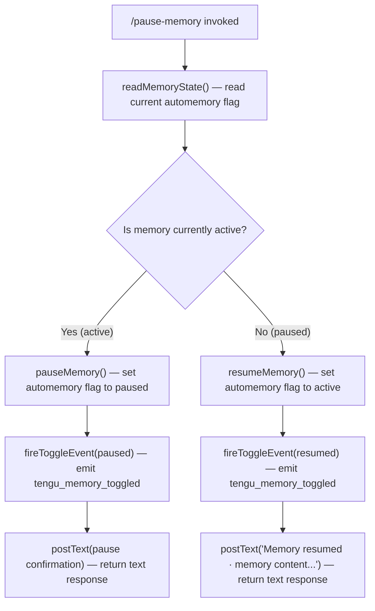

```
---
type: feature-spec
feature: "pause-memory"
cc_version: 2.1.190
updated: "2026-06-24"
tags: ["pause-memory", "commands", "slash-commands"]
source: "bundle-analysis"
bundle_verified: true
inherited_from: 2.1.187
analysis_basis: "CC v2.1.187 bundle.js (AST extraction + Claude interpretation)"
author: "ryujaeuk <ryujaeuk@gmail.com>"
repository: "https://github.com/MyLittleLuckyDog/cc-gnothi"
license: "AGPL-3.0-only"
---

# `/pause-memory`

> Analysis basis: CC v2.1.187 bundle.js (AST extraction + Claude interpretation)
> Minimum version: v2.1.187

---

## Overview

`/pause-memory` toggles the automemory system for the current session, either pausing it (preventing new memories from being saved and suppressing memory references) or resuming it (re-enabling memory content referencing and new memory persistence). When memory is resumed, the user receives the confirmation message: "Memory resumed · memory content may be referenced and new memories can be saved." The command is registered as a local, non-hidden command and also answers to the aliases `/memory-pause` and `/toggle-memory`.

---

## Registration

| Field | Value |
|---|---|
| type | `local` |
| name | `pause-memory` |
| description | `Pause automemory for this session` |
| aliases | `memory-pause`, `toggle-memory` |
| supportsNonInteractive | `false` |
| thinClientDispatch | `post-text` |
| isHidden | `false` |
| load_inline | `true` |
| module_id | `d_l` |
| loc_byte | `11568470` |
| loc_byte_end | `11568769` |
| loc_line | `7281` |
| arbor_handler.name | `vnf` |
| arbor_handler.fqn | `claude-2.1.187::vnf` |
| arbor_handler.kind | `AsyncFunction` |
| arbor_handler.resolution_path | `module_id` |
| arbor_handler.n_hits | `1` |

Analysis basis: CC v2.1.187 bundle.js:+11568470

---

## Input Branching

The command's branching behavior is determined by reading the current memory state and toggling it. There are three meaningful paths: reading the current state, handling the "pause" transition, and handling the "resume" transition.



Analysis basis: CC v2.1.187 bundle.js:+11568040 (call to `readMemoryState`), +11568052 (call to `resumeMemory`/`pauseMemory`), +11568059 (call to `fireToggleEvent`), +11568061 (telemetry emission), +11568107 (response kind `"text"`), +11568314 (resume confirmation string)

---

## Behavioral Spec

### Main Handler (`vnf`)

The handler is an `AsyncFunction` resolved via the `module_id` path (`d_l`) by the Arbor symbol graph with `n_hits: 1`.

```
async function pauseMemoryHandler(context):
    currentState = readMemoryState(context)          // calls KR — read current automemory toggle state
    newState     = computeToggle(currentState)       // derived from the "pause/resume" semantics

    applyMemoryState(context, newState)              // calls EEt — write new state into session/appState

    fireToggleEvent(context, newState)               // calls W  — emit tengu_memory_toggled telemetry

    if newState == RESUMED:
        return response(kind="text",
                        body="Memory resumed · memory content may be referenced and new memories can be saved.")
    else:
        return response(kind="text",
                        body=<pause confirmation message>)
```

Analysis basis: CC v2.1.187 bundle.js:+11568040 (`readMemoryState` call), +11568052 (`applyMemoryState` call), +11568059 (`fireToggleEvent` call), +11568107 (`"text"` response kind literal), +11568314 (resume body literal)

### State Read — `readMemoryState` (`KR`)

Reads the current automemory enabled/disabled flag from session or application state. The numeric constant `1` found at bundle.js:+65357 is consistent with a boolean-as-integer representation used for the "enabled" state.

```
function readMemoryState(context):
    return context.appState.automemoryEnabled   // 1 = enabled, 0 = paused
```

Analysis basis: CC v2.1.187 bundle.js:+11568040, +65357

### State Write — `applyMemoryState` (`EEt`)

Writes the toggled automemory state back into application/session state so the change persists for the duration of the session.

```
function applyMemoryState(context, newState):
    context.appState.automemoryEnabled = newState
    // persists for current session only (supportsNonInteractive = false)
```

Analysis basis: CC v2.1.187 bundle.js:+11568052

### Telemetry Emission — `fireToggleEvent` (`W`)

Emits the `tengu_memory_toggled` event immediately after the state write, recording the direction of the toggle (pause or resume).

```
function fireToggleEvent(context, newState):
    telemetry.emit("tengu_memory_toggled", { state: newState })
```

Analysis basis: CC v2.1.187 bundle.js:+11568059, +11568061

### Response Construction

The handler always returns a `"text"`-typed response (bundle.js:+11568107). On a resume transition, the body is the confirmed literal string beginning "Memory resumed · memory content may be referenced…" (bundle.js:+11568314). On a pause transition, a corresponding pause-confirmation string is returned (exact text not recovered at depth-2 traversal; see TODO note below).

<!-- TODO: pause-direction confirmation string not found in depth-2 traversal; needs --depth 4 -->

---

## State & Side Effects

| Item | Detail |
|---|---|
| Telemetry | `tengu_memory_toggled` (emitted once per invocation, bundle.js:+11568061) |
| appState changes | Toggles the automemory enabled flag for the current session |
| Hook registration | None identified at depth-2 traversal |
| Sound | None identified at depth-2 traversal |
| Session scope | Change is session-scoped only (`supportsNonInteractive: false`); does not persist across sessions |
| thinClientDispatch | `post-text` — response is dispatched as a text post in thin-client environments |

---

## Version History

| Version | Change |
|---|---|
| v2.1.187 | Initial analysis |

---

## Common Mistakes

1. **Expecting the pause to persist across sessions.** The command is `local` and `supportsNonInteractive: false`; the toggle only affects the current interactive session. Starting a new session restores the default automemory state.
2. **Using only `/pause-memory` when the intent is a clear toggle.** The alias `/toggle-memory` more accurately describes the bidirectional nature of the command (it both pauses and resumes depending on current state). All three names — `pause-memory`, `memory-pause`, and `toggle-memory` — invoke the same handler.
3. **Assuming the command accepts arguments.** No argument-parsing literals or branch logic for user-supplied input were found in the depth-2 call graph; the command derives its action entirely from the current state.
4. **Expecting an error when memory is already paused.** The command is a pure toggle; invoking it while memory is already paused will silently resume it rather than returning an error.

---

## Appendix — Identifier Mapping

> For bundle debugging only. Identifiers change across versions.

| Identifier | Role |
|---|---|
| `vnf` | Main handler for `/pause-memory` — AsyncFunction; entry point resolved via `module_id: d_l` |
| `KR` | `readMemoryState` — reads the current automemory toggle flag from session/app state |
| `EEt` | `applyMemoryState` — writes the new automemory toggle state back into session/app state |
| `W` | `fireToggleEvent` — emits the `tengu_memory_toggled` telemetry event |
```