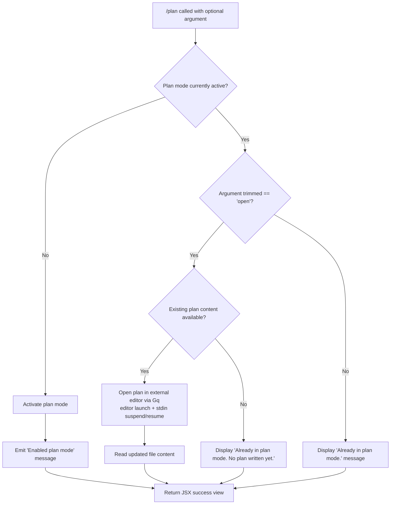

# `/plan`

> Analysis basis: CC v2.1.186 bundle.js (AST extraction + Claude interpretation)
> Minimum version: v2.1.186

---

## Overview

The `/plan` command enables "plan mode" for the current Claude Code session, or opens the session's existing plan in an external editor. When plan mode is not yet active, invoking `/plan` activates it; when already active, the command either opens the plan document in an external editor (if the subcommand `open` is supplied) or reports the current mode status. The command is implemented as a local JSX handler (`Tgf`) loaded via module `fxl`.

---

## Registration

| Field | Value |
|---|---|
| type | `local-jsx` |
| name | `plan` |
| description | `Enable plan mode or view the current session plan` |
| argumentHint | `[open\|<description>]` |
| module_id | `fxl` |
| load_inline | `true` |
| loc_byte | `12575202` |
| loc_byte_end | `12575401` |
| arbor_handler.name | `Tgf` |
| arbor_handler.fqn | `claude-2.1.186::Tgf` |
| arbor_handler.kind | `AsyncFunction` |
| arbor_handler.resolution_path | `module_id` |
| arbor_handler.n_hits | `0` |

Analysis basis: CC v2.1.186 bundle.js:+12575202

---

## Input Branching

The command has four distinct branches based on whether plan mode is already active and what argument is supplied, so a Mermaid flowchart is used.



Analysis basis: CC v2.1.186 bundle.js:+12574511 (mode check), +12574527 ("Enabled plan mode"), +12574547 ("Already in plan mode."), +12574608 ("open"), +12574767 ("Already in plan mode. No plan written yet.")

---

## Behavioral Spec

### Top-Level Handler: `planCommandHandler` (`Tgf`)

```
async function planCommandHandler(argument, appState):
    modeState = getModeState(appState)          // Tgf → r (12574322)
    permissionState = getPermissionSettings()   // Tgf → Bde (12574371)
    connectionMap = getConnectionMap()          // Tgf → o (12574385)
    sessionConfig = getSessionConfig()          // Tgf → tH (12574421)
    toolGatingState = getToolGating()          // Tgf → Gut (12574424)

    currentlyInPlanMode = checkPlanModeActive(modeState)  // OS → Nu (807781)

    trimmedArg = argument.trim()               // n.trim (12574589)

    if not currentlyInPlanMode:
        activatePlanMode(appState)
        return renderMessage("Enabled plan mode")  // literal: 12574527

    if trimmedArg == "open":                   // literal: 12574608
        planContent = fetchCurrentPlan(appState)  // igt → CSe (12574671)
        if planContent is empty or null:
            return renderMessage("Already in plan mode. No plan written yet.")
                                               // literal: 12574767
        openPlanInEditor(planContent)          // Gq (12574868)
        return renderEditorResult()

    return renderMessage("Already in plan mode.")  // literal: 12574547
```

Analysis basis: CC v2.1.186 bundle.js:+12574322

---

### Sub-feature: Mode Activation (`activatePlanMode`)

When plan mode is not yet active, the handler calls into the mode-setting subsystem (`OS` → `Nu` → `qPe`). This subsystem checks whether `bypassPermissions` mode is allowed for the session; if the session was not launched with bypass-permissions, or if `disableBypassPermissionsMode` is set, permission update is silently rejected with the message:

> "Ignoring permission update: setMode 'bypassPermissions' rejected — mode is not available…"

(literal at bundle.js:+5256412)

The mode-setting flow also manages rule sets: `addRules`, `replaceRules`, `removeRules` (literals at +5256688, +5257036, +5257693), and directory lists: `addDirectories`, `removeDirectories` (literals at +5257347, +5258077). Allow/deny/ask rule categories (`alwaysAllowRules`, `alwaysDenyRules`, `alwaysAskRules`) are updated in the session's permission map.

```
function activatePlanMode(appState):
    if bypassPermissionsAvailable(appState):   // tH → T (5256410)
        setMode(appState, "plan")
        updateRules(appState, "addRules", ...)
    else:
        logIgnored("bypassPermissions rejected") // literal: 5256412
```

Analysis basis: CC v2.1.186 bundle.js:+5256324

---

### Sub-feature: Tool Gating Resolution (`resolveToolGating`, `Gut`)

On every invocation (regardless of branch), the handler resolves tool gating state via `Gut`. This function:

1. Iterates over session tool configuration entries via `Object.entries` (bundle.js:+13703952, +13704609).
2. For each tool, resolves the model-specific allowance — including model families `claude-3-*`, `claude-opus-4-*`, `claude-sonnet-4-*`, `claude-haiku-4-5` and provider types `firstParty`, `anthropicAws` (literals at +3040852–+3041042).
3. Builds an allow-list, cross-checking `--allowed-tools` CLI arguments (literal: +13702103) and session-level overrides (literal: +13703642).
4. Merges settings from four tiers in priority order: `policySettings`, `flagSettings`, `userSettings`, `localSettings` (literals at +1337776, +1337826, +1337874, +1337922).
5. The `auto` mode literal (bundle.js:+13714739) governs automatic tool resolution when no explicit allow list is specified.

```
function resolveToolGating(sessionConfig, cliArgs):
    entries = Object.entries(sessionConfig.tools)
    result = []
    for each [toolName, toolDef] in entries:
        modelMatch = checkModelCompatibility(toolDef)  // dme (13713654)
        settingsTier = mergeSettingsTiers(             // zEr → In (1337773)
            policySettings, flagSettings,
            userSettings, localSettings
        )
        if isAllowed(toolName, cliArgs, settingsTier):
            result.push(toolName)
    return result
```

Analysis basis: CC v2.1.186 bundle.js:+13714726

---

### Sub-feature: External Editor Launch (`openPlanInEditor`, `Gq`)

When the argument is `"open"` and plan content exists, the handler invokes `Gq` to open the plan in the system editor.

```
async function openPlanInEditor(planContent, terminalInterface):
    editorPath = resolveEditor()           // H6 → g_ (11676234), Crf (11676248)
    fileInfo = statSync(editorPath)        // t.statSync (11677077)

    // Detect and filter binary/unsafe files
    fileAnalysis = analyzeFile(fileInfo)   // wrf → XIo → a_l (11675258)
    // a_l checks: trim, startsWith, basename, lowercase, known extensions

    // Suspend terminal rendering before spawning editor
    terminalInterface.enterAlternateScreen()  // (11677137)
    terminalInterface.pause()                 // (11677167)
    terminalInterface.suspendStdin()          // (11677177)

    // Split editor command and launch synchronously
    args = editorCommand.split(separator)     // s.split (11677216)
    args = args.slice(...)                    // i.slice (11677241)
    spawnSync(editorBin, args, {stdio: "inherit"})  // u_l.spawnSync (11677259)
                                              // "inherit" literal: 11677291

    // Detect IDE environment for post-launch behaviour
    envType = detectEnvironment()             // Zw → "IDE" check (6684747)

    // Read back modified file
    updatedContent = readFileSync(planFile, "utf-8")  // t.readFileSync (11677561)

    // Restore terminal
    terminalInterface.exitAlternateScreen()   // (11677639)
    terminalInterface.resumeStdin()           // (11677668)
    terminalInterface.resume()                // (11677684)

    return updatedContent
```

Analysis basis: CC v2.1.186 bundle.js:+11676936

---

### Sub-feature: Transcript / Session Logging (`sessionLogger`, `Fvc` / `Uvc`)

The handler participates in the session transcript logging subsystem (`Fvc` → `Uvc`). Key behaviors:

- Ensures the log directory exists via `SN.mkdir` (bundle.js:+213474).
- Appends entries with `SN.appendFile` (bundle.js:+213533).
- Manages log rotation: checks file size via `Buffer.byteLength` (+213928, +213626), and renames/unlinks old log files (`SN.rename` at +213201, `SN.unlink` at +213241).
- Handles `.txt` suffix for log file variants (literal: +213149).
- Applies a rotation window of 4 segments (number literal `4` at +213171).

```
function appendToSessionLog(entry, logDir):
    ensureDirectory(logDir)                  // SN.mkdir
    currentSize = Buffer.byteLength(entry)
    if currentSize > rotationThreshold:
        rotateLogs(logDir)                   // pcr: stat, rename, unlink
    SN.appendFile(logPath, entry)
```

Analysis basis: CC v2.1.186 bundle.js:+213474

---

### Sub-feature: Output Rendering (`PRa`, `Qlt`)

The JSX rendering pipeline for the command result uses:

- `PRa` → `Qlt`: attaches an `on` event listener, serialises output via `i.toString`, and renders through the `qW` JSX helper (bundle.js:+8170392, +8170429, +8170456).
- `oc`: strips ANSI escape codes from output via `Bun.stripANSI` (bundle.js:+3951461) before further processing.
- Column padding uses two-space indent (`"  "` literal at +17183544) and `padEnd` (bundle.js:+17183523) with a maximum column width of 40 characters (number literal `40` at +17185518).

Analysis basis: CC v2.1.186 bundle.js:+8170601

---

### Sub-feature: Error Handling (`cliErrorHandler`, `Ts` → `X8e`)

On fatal errors within the handler:

1. `X8e` logs to `console.error` (bundle.js:+13194038) and formats the message in red using `Et.red` (+13194052).
2. A `cli_error` literal (bundle.js:+13194093) tags the error category.
3. `sT` writes an error report to disk via `Dre.writeFileSync` (+199887) using a path assembled with `Zlr.join` (+199905).
4. `process.exit(1)` is called (exit code `1` at +13194119).

Analysis basis: CC v2.1.186 bundle.js:+13194083

---

## State & Side Effects

| Item | Detail |
|---|---|
| Telemetry | None detected in depth-2 traversal |
| Plan mode flag | Set in session `appState` when not already active; guarded by `bypassPermissions` availability (bundle.js:+5256324) |
| Permission rules | `alwaysAllowRules`, `alwaysDenyRules`, `alwaysAskRules` maps updated on mode change (literals: +5256873, +5256913, +5256938) |
| Hook registration | `Ai` → `O5o.register` (bundle.js:+67125) registers a lifecycle hook during setup |
| Session log (transcript) | `Fvc`/`Uvc` append to session transcript log; rotation applied above size threshold (bundle.js:+213474) |
| Terminal state | `enterAlternateScreen`, `suspendStdin`, `exitAlternateScreen`, `resumeStdin` called around external editor launch (bundle.js:+11677137–+11677684) |
| External editor process | `spawnSync` with `stdio: "inherit"` (bundle.js:+11677259, +11677291) |
| File system | Plan file read back with `readFileSync` after editor closes (bundle.js:+11677561) |
| ANSI stripping | `Bun.stripANSI` applied to output before rendering (bundle.js:+3951461) |
| Error exit | `process.exit(1)` on fatal CLI error (bundle.js:+13194106) |

---

## Version History

| Version | Change |
|---|---|
| v2.1.186 | Initial analysis |

---

## Common Mistakes

1. **Invoking `/plan open` when no plan exists**: The command will display "Already in plan mode. No plan written yet." rather than opening an editor — content must exist first (bundle.js:+12574767).
2. **Expecting plan mode to activate in `bypassPermissions`-restricted sessions**: If the session was not launched with bypass-permissions enabled, or `disableBypassPermissionsMode` is set, the mode change is silently ignored (bundle.js:+5256412).
3. **Assuming `/plan <description>` sets a plan description**: The argument is only compared against the literal `"open"` — any other argument value causes the "Already in plan mode." message to appear without further action (bundle.js:+12574608).
4. **Running `/plan` in a non-interactive pipeline context**: The editor launch path uses `spawnSync` with `stdio: "inherit"` and suspends the terminal's stdin; piped or non-TTY environments may behave unexpectedly (bundle.js:+11677259).
5. **Expecting telemetry events for plan mode changes**: No `tengu_*` telemetry events were found in the depth-2 call graph for this command.

---

## Appendix — Identifier Mapping

> For bundle debugging only. Identifiers change across versions.

| Identifier | Role |
|---|---|
| `Tgf` | Main async handler for the `/plan` command (`planCommandHandler`) |
| `r` | Mode-state accessor called by `Tgf` |
| `Ts` | Fatal CLI error dispatcher (log + exit) |
| `X8e` | Error formatter (console.error + red styling) |
| `sT` | Error report file writer (writeFileSync + path join) |
| `Bde` | Permission/bypass state accessor |
| `o` | Connection map / padding formatter |
| `s` | Set-with-cleanup helper (add/delete with finally) |
| `i` | Stream/channel closer |
| `n` | String lowercaser / map writer |
| `tH` | Session configuration manager (setMode, rule management) |
| `T` | Transcript / logging core function |
| `Pvc` | Settings merger (YP + lcr + U5o) |
| `U5o` | Permission token resolver ($Tc + BTc) |
| `e` | Random/timer utility or string processor (context-dependent) |
| `De` | JSON serialiser wrapper |
| `t` | String uppercaser / file stat accessor |
| `Lc` | Path/message formatter (SWo + replace + slice) |
| `SWo` | Map-over-xvc formatter |
| `eze` | Write-to-output wrapper (cWo) |
| `cWo` | Low-level `e.write` caller |
| `Fvc` | Session transcript logger (append, rotate, mkdir) |
| `wKe` | Debounced flush / batch join helper (clearTimeout + setTimeout + setImmediate) |
| `npe` | Log path resolver (oze + tpe.join + or + Rt) |
| `Gt` | Global state/context accessor |
| `Rre` | Log metadata helper (mn) |
| `TWo` | Log path joiner (tpe.join + Rt) |
| `pcr` | Log rotation handler (stat, endsWith, slice, rename, unlink) |
| `Uvc` | Log append with rotation (mkdir + appendFile + Rre + TWo + pcr) |
| `Ai` | Lifecycle hook registrar (O5o.register) |
| `uf` | String escape / replaceAll normaliser |
| `Ziu` | replaceAll-based string sanitiser |
| `Gut` | Tool gating resolver (xPo + w$ + lEe + F6 + T) |
| `xPo` | Tool configuration entry point (f9 + Dv + zEr) |
| `f9` | Tool config primitive accessor |
| `Dv` | Model-tool compatibility checker (vPo + dme + _s) |
| `vPo` | Model family predicate ($o) |
| `dme` | Extended model inclusion checker (So + br + VQe + t.includes) |
| `_s` | Settings-tier resolver (b9 + Zo + $g) |
| `zEr` | Settings tier merger (In) |
| `In` | Tier lookup (Qon + Z$) |
| `w$` | Tool gating intermediate state holder |
| `lEe` | Session tool entry iterator (Object.entries + tH + o.map) |
| `F6` | Tool allow-list builder (Object.entries + zm + bPo + T + uf + l6l) |
| `zm` | Tool name formatter (tau + Hk + nau + eau + e.substring) |
| `tau` | String conversion helper |
| `Hk` | Object.hasOwn checker |
| `nau` | Name normaliser |
| `eau` | replaceAll string cleaner |
| `bPo` | Tool path builder (Y6e + n.push + APo + r.match) |
| `Y6e` | Cache get/set with M4t + P4t + hho |
| `APo` | Relative path resolver (TI.includes + jm + o6l.relative + Ot) |
| `l6l` | Session rule mapper (vkf + r.get + a.push + r.set + tH) |
| `vkf` | Q$ inclusion checker |
| `a` | Rule/value aggregator (Z3e + arr + maa + s.get + T + s.values + q2o) |
| `OS` | Plan mode active-state checker |
| `Nu` | Plan mode inner checker (qPe) |
| `qPe` | Plan mode predicate |
| `igt` | Current plan content fetcher (CSe + Rt) |
| `CSe` | Plan store accessor |
| `Rt` | React/Ink render helper (GL) |
| `GL` | Core render primitive |
| `Bx` | Plan file open orchestrator ($x + Gt + kn + zo + T + Re) |
| `$x` | Plan path resolver (VRe + Rt + oV.join + Hy) |
| `VRe` | Plan path cache (Rt + CSe + r.get + Hy + W2r + WZe + nSn + oV.join + Gt + r.set) |
| `W2r` | Path replacement normaliser |
| `WZe` | URt-based path transformer |
| `nSn` | URt-based path cleaner |
| `kn` | File-not-found error handler (mn) |
| `mn` | Error object factory |
| `zo` | Permission-denied error handler (mn) |
| `Re` | Main read-file orchestrator (ao + ot + Ki + Pnu + Jje.push + VJ.logError) |
| `ao` | Error/string wrapper |
| `ot` | String coercer |
| `Ki` | File read loop (ins) |
| `ins` | Inner read helper (ot) |
| `Pnu` | Read buffer manager (crn.shift + crn.push) |
| `Gq` | External editor launcher (stat, spawnSync, stdin suspend/resume, readFileSync) |
| `H6` | Editor binary resolver (g_ + Crf) |
| `g_` | Editor path primitive |
| `wrf` | File safety analyser (XIo) |
| `XIo` | File type / extension filter (a_l + Arf.find + t.includes) |
| `a_l` | File name analyser (trim, startsWith, basename, Srf.has, toLowerCase) |
| `Zw` | IDE environment detector (fi + FD.basename + P3e) |
| `fi` | String index/slice extractor |
| `PRa` | JSX output renderer (Qlt + oc) |
| `Qlt` | Output event listener and JSX builder (o.on + i.toString + qW + Jlt.jsx) |
| `qW` | JSX render helper (A5r + P5r + kZ) |
| `P5r` | Bki.createElement wrapper |
| `kZ` | Component builder (dx + RCe + b5r) |
| `oc` | ANSI strip wrapper (Bun.stripANSI) |