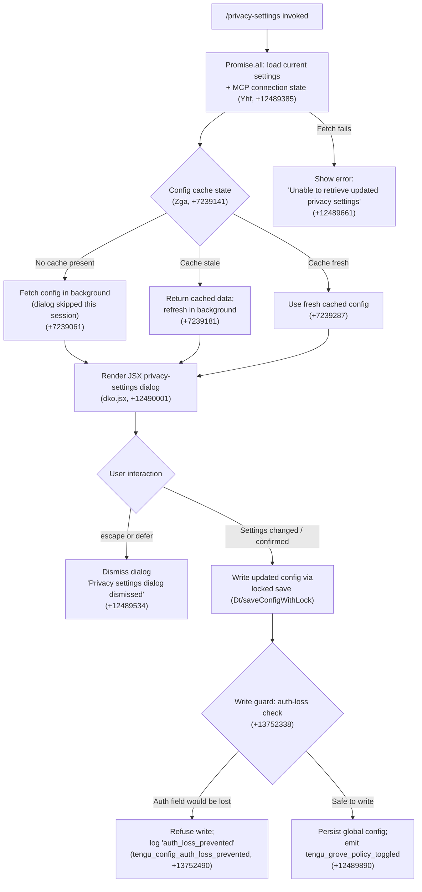

# `/privacy-settings`

> Analysis basis: CC v2.1.190 bundle.js (AST extraction + Claude interpretation)
> Minimum version: v2.1.190

---

## Overview

The `/privacy-settings` command opens an interactive JSX dialog that allows users to view and toggle their current privacy configuration (e.g., usage-data sharing policies). On invocation, the handler concurrently loads current settings and MCP connection state, renders a settings panel, and persists any changes back to the global config file while emitting a telemetry event upon each policy toggle.

---

## Registration

| Field | Value |
|---|---|
| type | `local-jsx` |
| name | `privacy-settings` |
| description | `View and update your privacy settings` |
| module_id | `Fxl` |
| load_inline | `true` |
| loc_byte | `12490334` |
| loc_byte_end | `12490517` |
| loc_line | `8460` |
| arbor_handler.name | `Yhf` |
| arbor_handler.fqn | `claude-2.1.190::Yhf` |
| arbor_handler.kind | `AsyncFunction` |
| arbor_handler.resolution_path | `module_id` |
| arbor_handler.n_hits | `0` |

Analysis basis: CC v2.1.190 bundle.js:+12490334

---

## Input Branching

The command exhibits three or more distinct execution branches depending on config cache freshness, user interaction (escape/defer vs. confirm), and whether the settings fetch succeeds or fails. A Mermaid flowchart is used.



---

## Behavioral Spec

### 1. Handler Entry — Concurrent Initialization

The async handler `Yhf` (arbor: `claude-2.1.190::Yhf`, resolution via `module_id`) begins by issuing `Promise.all` over two concurrent tasks:

```
async function privacySettingsHandler(context):
    [currentSettings, mcpState] = await Promise.all([
        loadCurrentSettings($ee),    // reads persisted privacy toggles
        loadInitialState(I0e)         // loads MCP/connection state
    ])
    // continue to cache check
```

Analysis basis: CC v2.1.190 bundle.js:+12489385, +12489398, +12489404

---

### 2. Config Cache Resolution

The cache-access layer (`Zga`) evaluates the freshness of the config and takes one of three paths. These correspond to the three literal log strings captured in the bundle:

```
function resolveConfigCache(cache):
    if cache is empty:
        log("Grove: No cache, fetching config in background (dialog skipped this session)")
        fetchConfigBackground()
        return CACHED_EMPTY
    else if cache is stale:
        log("Grove: Cache stale, returning cached data and refreshing in background")
        fetchConfigBackground()
        return cache.data
    else:
        log("Grove: Using fresh cached config")
        return cache.data
```

Analysis basis: CC v2.1.190 bundle.js:+7239061, +7239181, +7239287

---

### 3. Config Read — File System Layer

The underlying config-read function (`SEe`) performs file I/O with the following logic:

```
function readConfigFile(path):
    if path not yet accessible:
        raise Error("Config accessed before allowed.")  // +13753955
    try:
        content = fs.readFileSync(path, "utf-8")        // +13754038
        return parseJSON(content)
    catch ENOENT:                                        // +13754185
        return defaultConfig()
    catch error:
        emit telemetry("tengu_config_parse_error")      // +13754586
        return defaultConfig()
```

Analysis basis: CC v2.1.190 bundle.js:+13753955, +13754038, +13754185, +13754586

---

### 4. Dialog Rendering

After settings are resolved, the handler renders a JSX component via `dko.jsx`:

```
function renderPrivacyDialog(settings, mcpState):
    dialog = jsx(PrivacySettingsComponent, {
        initialSettings: settings,
        onEscape: () => dismissWithReason("escape"),    // +12489509
        onDefer:  () => dismissWithReason("defer"),     // +12489523
        onSave:   (newSettings) => persistSettings(newSettings, "system")  // +12489579
    })
    return dialog
```

When the user presses Escape or chooses to defer, the string `"Privacy settings dialog dismissed"` is logged.

Analysis basis: CC v2.1.190 bundle.js:+12490001, +12489509, +12489523, +12489534

---

### 5. Settings Persistence — Locked Write

When the user confirms a change, the save path (`Dt` → locked-write subsystem) is engaged:

```
async function persistSettings(newSettings, origin):
    lock = await acquireConfigLock()                      // Wt, +13750603
    if lockTookTooLong:
        log("Lock acquisition took longer than expected - another Claude instance may be running")
        // +13751922

    reReadConfig = readConfigFile(configPath)

    if reReadConfig is missing auth fields that cache holds:
        // Safety guard against GH #3117
        log("saveConfigWithLock: re-read config is missing auth…")   // +13752338
        emit telemetry("tengu_config_auth_loss_prevented")            // +13752490
        releaseLock()
        return ERROR

    merged = merge(reReadConfig, newSettings)
    writeConfigFile(merged)
    createBackup(prefix=".backup.", maxBackups=5)        // +13752808, +13752941
    releaseLock()
```

Analysis basis: CC v2.1.190 bundle.js:+13750603, +13751922, +13752338, +13752490, +13752808, +13752941

---

### 6. Policy Toggle Telemetry

Immediately after a successful save, the handler emits a telemetry event scoped to the policy that changed:

```
function onPolicyToggled(policyName, newValue):
    emit telemetry("tengu_grove_policy_toggled", {
        policy: policyName,
        value: newValue
    })
```

Analysis basis: CC v2.1.190 bundle.js:+12489890

---

### 7. Error Path — Settings Fetch Failure

If the initial `Promise.all` or the background fetch fails, the UI receives a fallback error string rather than crashing:

```
function handleFetchError(err):
    displayError("Unable to retrieve updated privacy settings")   // +12489661
```

Analysis basis: CC v2.1.190 bundle.js:+12489661

---

### 8. MCP State Loading (Background)

The handler also passes MCP server connection state into the dialog context. The MCP loader (`d9e` → `RB` → `E7`) evaluates each configured server and classifies it using string constants found in the bundle:

```
function loadMcpState(serverConfigs):
    for each server in serverConfigs:
        status = determineStatus(server)
        // Possible status values: "connected", "failed", "needs-auth",
        //   "pending", "approved", "rejected", "disabled"
    return aggregatedState
```

Analysis basis: CC v2.1.190 bundle.js:+6870223, +6870015, +6869852, +6591560, +6591533, +6591628

---

## State & Side Effects

| Item | Detail |
|---|---|
| Telemetry | `tengu_grove_policy_toggled` (+12489890) — emitted on each confirmed privacy policy change |
| Telemetry | `tengu_config_parse_error` (+13754586) — emitted when config JSON fails to parse |
| Telemetry | `tengu_config_lock_contention` (+13752011) — emitted when config lock is slow to acquire |
| Telemetry | `tengu_config_stale_write` (+13752147) — emitted when a stale write is detected |
| Telemetry | `tengu_config_auth_loss_prevented` (+13752490) — emitted when a write is blocked to protect auth fields |
| Telemetry | `tengu_config_fallback_write` (+13751627) — emitted when global config falls back to a safe write |
| Telemetry | `tengu_daemon_config_reload` (+17214348) — daemon-level config reload signal |
| Telemetry | `tengu_mcp_skills` (+6653418) — MCP capability registration tracking |
| Telemetry | `tengu_bg_retire_pinned_low_mem` (+17202918) — background worker memory pressure event |
| Telemetry | `tengu_bg_prewarm_per_sweep` (+17203039) — background worker prewarm sweep |
| Telemetry | `tengu_daemon_yield` (+17218760) — daemon yield to foreground process |
| Config file writes | Persists to the global `~/.claude.json` via a file-system lock; creates up to 5 `.backup.` timestamped copies (+13752808, +13752941) |
| appState changes | Updates internal settings cache; MCP connection map updated if servers change |
| Hook registration | `Ei` → `C6o.register` (+67325); output/log flusher registered via `iLc` (+214381) |
| Sound | None detected in depth-2 traversal |
| Dismissal behavior | On `escape` or `defer`, dialog closes without writing; logs `"Privacy settings dialog dismissed"` (+12489534) |

---

## Version History

| Version | Change |
|---|---|
| v2.1.190 | Initial analysis |

---

## Common Mistakes

1. **Expecting instant persistence**: The command uses a file-system lock (`Wt`). If another Claude process holds the lock, the write will be delayed and a contention telemetry event will fire. The dialog may appear to hang briefly under concurrent use.
2. **Assuming all toggles take effect immediately**: Settings are written to disk on confirmation; any in-flight background config fetch may temporarily return the old value until the cache invalidates.
3. **Confusing `escape` and `defer`**: Both dismiss the dialog without saving. Neither verb maps to a "save and quit" path — only explicit confirmation triggers the locked write.
4. **Expecting rich error details in the UI**: The error string `"Unable to retrieve updated privacy settings"` is displayed generically; the underlying cause is logged internally but not surfaced to the user.
5. **Manually editing `~/.claude.json` while the dialog is open**: The auth-loss guard (GH #3117 protection, +13752338) will detect mismatches between the in-memory cache and the re-read file and refuse to write, silently aborting the save.

---

## Appendix — Identifier Mapping

> For bundle debugging only. Identifiers change across versions.

| Identifier | Role |
|---|---|
| `Yhf` | Primary async handler for `/privacy-settings` (arbor entry point) |
| `Eat` | Config loading orchestrator — coordinates cache check and background fetch |
| `qFe` | Inner config fetch helper — reads and returns parsed config data |
| `Ci` | Config object constructor / settings accessor |
| `YLr` | Settings field reader (sub-accessor of `Ci`) |
| `jLr` | Settings field writer (sub-accessor of `Ci`) |
| `ay` | Global config structure builder / field initializer |
| `Ao` | Config merge / overlay applicator |
| `H2` | Array membership checker (uses `Array.isArray` + `includes`) |
| `Zai` | Config validation helper |
| `hc` | Config cache entry constructor |
| `Dt` | Locked config write orchestrator |
| `Wt` | File-system lock acquire/release utility |
| `OOo` | Config path resolver |
| `SEe` | Low-level config file reader (fs.readFileSync, backup logic) |
| `BRf` | Config file watcher / reload trigger |
| `T` | Telemetry emission utility |
| `nLc` | Telemetry event builder |
| `w6o` | Telemetry transport (batching layer) |
| `Me` | JSON serializer wrapper |
| `wc` | String redaction / sanitization helper |
| `p8o` | Redaction pattern mapper |
| `hze` | Output writer (stdout/file stream) |
| `e8o` | Raw stream write wrapper |
| `iLc` | Log file persistence manager (append, rotate, flush) |
| `WKe` | Log flush scheduler (batching via setTimeout/setImmediate) |
| `dpe` | Log directory path resolver |
| `xre` | Log file EISDIR guard |
| `h8o` | Log file path builder |
| `Ncr` | Log file rotation handler (rename, unlink old `.txt` files) |
| `sLc` | Log append executor (mkdir, appendFile, rotate) |
| `Ei` | Event hook registrar (`C6o.register`) |
| `Zga` | Config cache freshness evaluator (Grove cache logic) |
| `hn` | Global config save entry point |
| `GQn` | Config snapshot/backup writer (copy, prune old backups) |
| `CDe` | Config directory initializer |
| `NOo` | Config entry enumerator (Object.entries) |
| `DKt` | Config lock timestamp tracker |
| `PHt` | Config post-write hook |
| `W` | Warning/error logger |
| `BQn` | Config fallback write path |
| `d9e` | MCP server state loader / aggregator |
| `RB` | MCP server registry builder |
| `Ust` | MCP server entry constructor |
| `E7` | MCP server connection evaluator |
| `K4` | MCP SDK server list builder |
| `CRn` | MCP server error color formatter (red/yellow) |
| `Pst` | SSE/HTTP server connection state tracker |
| `aF` | MCP capability object factory (Object.create) |
| `Qw` | MCP config watcher/subscriber |
| `eh` | Config change event handler |
| `nJr` | MCP config change notifier |
| `zn` | Async task scheduler |
| `FUt` | MCP filter utility |
| `Hua` | MCP server hash/cache key generator |
| `dZr` | MCP cache lookup |
| `PLe` | MCP server fingerprint hasher (sha256) |
| `myn` | MCP server schema validator |
| `hyn` | MCP server hash builder |
| `wT` | Hash computation utility (Nli.createHash) |
| `fyn` | MCP server capability extractor |
| `Gl` | Capability value resolver |
| `ln` | MCP debug logger |
| `zRn` | MCP server connection orchestrator |
| `wr` | MCP connection wrapper |
| `aKd` | MCP stdio/sse connection handler |
| `lKd` | MCP tool-call dispatcher |
| `BUt` | MCP batch update applicator |
| `Xs` | Async store getter (KFu.getStore) |
| `tMn` | MCP cache path builder |
| `gJr` | MCP server reconnect logic |
| `be` | String coercion utility |
| `eL` | MCP skill registration trigger |
| `it` | MCP tool/skill registry updater |
| `tJr` | MCP server inclusion filter |
| `w` | Background worker manager |
| `ij` | Worker state tracker |
| `L` | Background worker sweep/lifecycle manager |
| `ycc` | Worker away-summary accessor |
| `Ecc` | Worker reconnect checker |
| `Vc` | MCP error logger (YJ.logMCPError) |
| `Aua` | MCP event stream mapper (ZW) |
| `ZW` | Async iterable event mapper |
| `yit` | MCP integer parser (radix 10) |
| `nMn` | MCP integer parser variant (radix 20) |
| `brr` | MCP connection result applicator |
| `u9e` | MCP update fingerprinter |
| `zT` | MCP cleanup orchestrator |
| `Hit` | MCP server teardown helper |
| `_la` | MCP orphan connection resolver |
| `rQr` | MCP stale connection pruner |
| `rUl` | Daemon status file writer |
| `AQ` | Daemon status serializer |
| `nVt` | Daemon status path builder |
| `fBo` | MCP slot reconciler (per-client) |
| `xRn` | MCP allowed-server set checker |
| `Kn` | MCP connection timeout wrapper |
| `Ve` | JSX render entry point for privacy dialog |
| `aKe` | Privacy settings JSX component root |