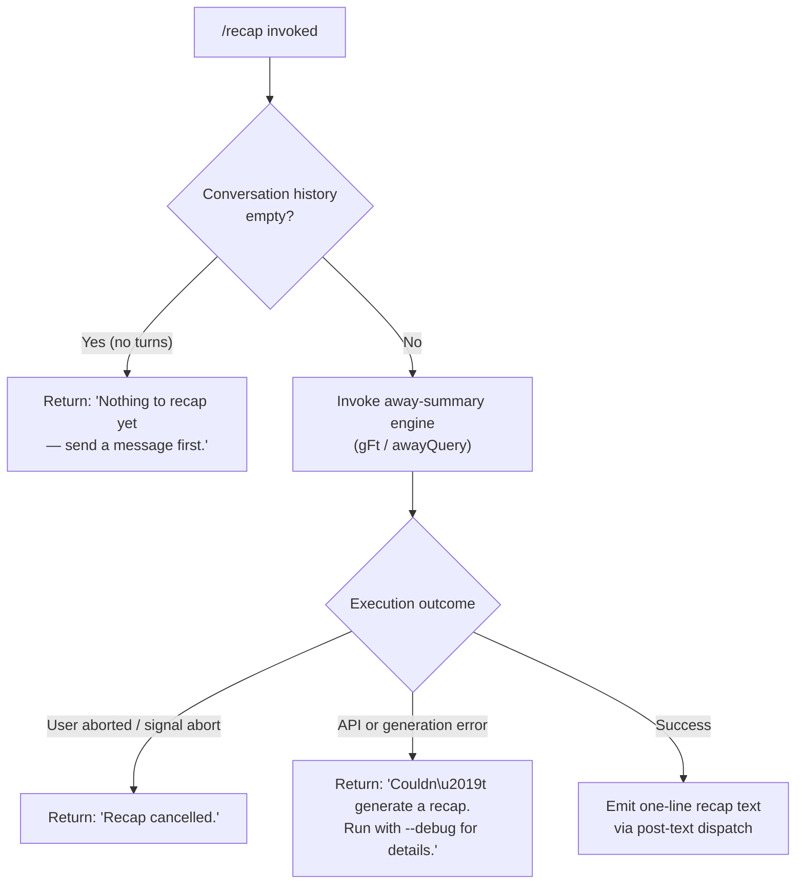

# `/recap`

> Analysis basis: CC v2.1.190 bundle.js (AST extraction + Claude interpretation)
> Minimum version: v2.1.190

---

## Overview

`/recap` is a local slash command that immediately triggers a one-line summary of the current Claude Code session. It invokes the away-summary subsystem to generate a brief recap of work done so far, delivering the result as post-text output without requiring a full agent turn. The command gracefully handles the edge cases of an empty session history and user-initiated cancellation.

---

## Registration

| Field | Value |
|---|---|
| type | `local` |
| name | `recap` |
| description | `Generate a one-line session recap now` |
| loc_byte | `12997792` |
| loc_byte_end | `12998008` |
| loc_line | `8829` |
| supportsNonInteractive | `false` |
| thinClientDispatch | `post-text` |
| load_inline | `true` |
| load_ident | `zbf` |
| arbor_handler.name | `zbf` |
| arbor_handler.fqn | `claude-2.1.190::zbf` |
| arbor_handler.kind | `AsyncFunction` |
| arbor_handler.resolution_path | `load_ident` |
| arbor_handler.n_hits | `0` |

Analysis basis: CC v2.1.190 bundle.js:+12997792

---

## Input Branching

The command has four distinct paths based on session state and execution outcome, so a flowchart is used.



Analysis basis: CC v2.1.190 bundle.js:+12997542, +12997634, +12997692

---

## Behavioral Spec

### Handler Entry — `zbf` (AsyncFunction)

The handler is loaded via an inline `Promise.resolve({call: zbf})` shape (no separate module ID). Arbor resolved it via the `load_ident` path.

```
async function recapHandler(context):
    history = context.getConversationHistory()

    if history is empty or has no turns:
        return postText("Nothing to recap yet — send a message first.")

    abortController = new AbortController()
    context.listenForAbort(() -> abortController.abort("abort"))

    try:
        result = await awayQuery(context, abortController.signal)
    catch AbortError:
        return postText("Recap cancelled.")
    catch AnyOtherError:
        logDebug(error)
        return postText("Couldn't generate a recap. Run with --debug for details.")

    return postText(result.oneLinerSummary)
```

Analysis basis: CC v2.1.190 bundle.js:+12997400

### Away-Query Subsystem — `gFt` (awayQuery)

`gFt` is the first callee of `zbf`. It implements the away-summary generation flow.

```
async function awayQuery(context, signal):
    cacheSafeParams = getCacheSafeParams(context)

    if cacheSafeParams is null:
        log("[awaySummary] no CacheSafeParams saved, skipping")
        return null

    signal.addEventListener("abort", () -> abortSignalHandler("abort"))

    queryResult = await runQuery(
        context,
        params    = cacheSafeParams,
        mode      = "no-turn",       // does not create a new conversation turn
        toolPolicy = "deny",          // away summary cannot use tools
        label     = "away_summary"
    )

    return queryResult
```

Analysis basis: CC v2.1.190 bundle.js:+7081788, +7081809, +7081867, +7081923, +7082100, +7082115, +7082183

### Tool Policy Enforcement

During the away-summary query, any tool-use attempt by the model is denied immediately with the policy label `"deny"`. This prevents the recap from triggering file edits or shell commands as a side-effect.

Analysis basis: CC v2.1.190 bundle.js:+7082100, +7082115

### Model Resolution — `gs` / `Qo` / `Kg`

The away-summary engine resolves which model to use via `gs` (model-resolution helper), which calls `Qo` (model-name normalizer) and `Kg` (model-selector). Model aliases understood include: `"fable"`, `"opusplan"`, `"sonnet"`, `"haiku"`, `"opus"`, `"best"`, and the compact notation `"[1m]"`.

Analysis basis: CC v2.1.190 bundle.js:+2281686, +2297929, +2297977, +2297992, +2298033, +2298072, +2298111, +2298145

### Output Dispatch — `post-text`

The `thinClientDispatch` field is `"post-text"`, which means the recap result is emitted as plain trailing text appended to the session output after command execution completes, rather than being injected as a new user or assistant message.

Analysis basis: CC v2.1.190 bundle.js:+12997792 (registration field)

### Error Literal Set

Three fixed user-facing strings are emitted depending on outcome:

| Condition | Output string (fragment) |
|---|---|
| No session history | `"Nothing to recap yet —…"` (bundle.js:+12997542) |
| Cancellation | `"Recap cancelled."` (bundle.js:+12997634) |
| Generation failure | `"Couldn't generate a recap…"` (bundle.js:+12997692) |

---

## State & Side Effects

| Item | Detail |
|---|---|
| Telemetry | No `tengu_*` events fire directly inside `zbf`; events observed in the call graph are owned by the shared query engine (`HVp`), including `tengu_query_error` (bundle.js:+10748807), `tengu_auto_compact_succeeded` (bundle.js:+10727417), and others listed in the telemetry array. These fire only when the underlying API call executes. |
| Hook registration | Away-summary query registers an abort listener via `e.addEventListener` (bundle.js:+7081904); normal tool hooks are suppressed (tool policy: `"deny"`). |
| appState changes | `e.setAppState` / `N.setAppState` may be touched by the shared query engine (`f4n`, `HVp`) during the API call, but `/recap` itself does not prescribe a state mutation. |
| New conversation turn | None — the `"no-turn"` mode (bundle.js:+7081867) is explicitly used; the recap does not appear in conversation history. |
| Sound | <!-- TODO: not found in depth-2 traversal; needs --depth 4 --> |
| Non-interactive support | `supportsNonInteractive: false` — the command requires an active interactive session. |

---

## Version History

| Version | Change |
|---|---|
| v2.1.190 | Initial analysis |

---

## Common Mistakes

1. **Running `/recap` before sending any message** — the command will immediately return `"Nothing to recap yet — send a message first."` and do nothing. The guard checks for an empty turn history before invoking the model.
2. **Expecting the recap to appear as a chat message** — because `thinClientDispatch` is `"post-text"`, the recap is appended as trailing text output, not inserted into the conversation as a turn. It will not appear in `/history` or affect context window usage.
3. **Using `/recap` in non-interactive mode** — `supportsNonInteractive` is `false`; invoking this command from a script or CI pipeline is not supported and may silently fail.
4. **Assuming recap uses tools** — the away-summary engine enforces tool policy `"deny"` for this invocation, so no file reads, shell commands, or MCP tool calls will occur even if the model attempts them.
5. **Interpreting the debug hint as an API key error** — the `"Couldn't generate a recap. Run with --debug for details."` message covers all non-abort failures including transient API errors; passing `--debug` will surface the underlying exception.

---

## Appendix — Identifier Mapping

> For bundle debugging only. Identifiers change across versions.

| Identifier | Role |
|---|---|
| `zbf` | Main handler for `/recap` (AsyncFunction, entry point via load_ident) |
| `gFt` | Away-query orchestrator (schedules the recap API call) |
| `ele` | Query dispatch wrapper called by away-query |
| `gs` | Model resolution helper |
| `v9` | Model parameter builder |
| `Qo` | Model name normalizer (handles aliases: fable, sonnet, haiku, opus, best, etc.) |
| `Kg` | Model selector (calls Qo and vw) |
| `T` | Conversation formatting / message builder utility |
| `nLc` | Prompt construction helper |
| `w6o` | Additional prompt construction sub-helper |
| `Me` | JSON serialization utility (wraps JSON.stringify) |
| `wc` | Text-content sanitizer / replacer |
| `p8o` | Map-based content processor |
| `hze` | Stream writer helper |
| `e8o` | Low-level write helper |
| `iLc` | Transcript/log file writer (manages append, rotate, mkdir) |
| `WKe` | Buffered output batcher (uses setTimeout/setImmediate) |
| `dpe` | Output path resolver |
| `Wt` | Working-directory accessor |
| `xre` | Error code classifier (handles EISDIR) |
| `h8o` | Path joiner utility |
| `Ncr` | Log rotation handler (stat, rename, unlink) |
| `sLc` | Log append-to-file implementation |
| `Ei` | Hook/signal registration helper |
| `C0` | Main query runner / agent loop controller |
| `f4n` | Query setup and state orchestrator |
| `h1` | State loader |
| `uge` | State dump/load utility |
| `Gwe` | Pre-query preparation helper |
| `nia` | Query parameter finalizer |
| `a` | Message/turn assembler |
| `B8n` | Context-window budget calculator |
| `DM` | ID generator (uses randomBytes) |
| `m4n` | Query metrics collector |
| `Ace` | Tool-registry accessor |
| `Rc` | Hook executor |
| `AWe` | Tool filter (filters by "ant" namespace) |
| `j5` | Turn result dispatcher |
| `HVp` | Core API streaming loop (main query engine) |
| `YWn` | Subagent/session cleanup handler |
| `Le` | Feature-flag "ok" reporter (fires tengu_feature_ok) |
| `Re` | Feature-flag "bad" reporter (fires tengu_feature_bad) |
| `lk` | Session label accessor |
| `f6e` | Session-set membership checker |
| `Qte` | Query timeout handler |
| `q8n` | Query retry controller |
| `TBa` | Background session checker |
| `f` | Background process manager (spawn, kill, retire) |
| `W` | Core async utility / promise wrapper |
| `D` | Child-process driver (write, kill) |
| `Kn` | Timeout-with-abort utility |
| `GXn` | Platform notification helper (macOS) |
| `B2e` | Session file reader/cleaner |
| `ke` | Error logger |
| `U` | Process retirement handler |
| `it` | Interrupt/watcher tracker |
| `L3o` | Daemon socket connector |
| `P3o` | Daemon session lifecycle manager |
| `s` | Session promise tracker |
| `p` | Forced-shutdown handler (process.exit) |
| `cn` | Path canonicalizer |
| `Pe` | Core promise/async primitive (aKe) |
| `F` | Interval-based cleanup (clearInterval) |
| `cce` | Post-turn summary builder |
| `NA` | Notification assembler |
| `m0p` | Notification finder |
| `xVp` | Forked-agent query runner |
| `Rr` | Nonconforming-response handler |
| `On` | Outbound message dispatcher (randomUUID, away summary caller) |
| `_` | MCP/HTTP connection driver |
| `nyt` | SSE transport handler |
| `fo` | Generic error wrapper |
| `y` | Teammate mailbox processor |
| `G5e` | Teammate message-read marker |
| `Ama` | Result flat-mapper for away summary |

---

Note: index built via Arbor fallback; some signals (telemetry, literals) may be missing — see arbor-fallback.js.