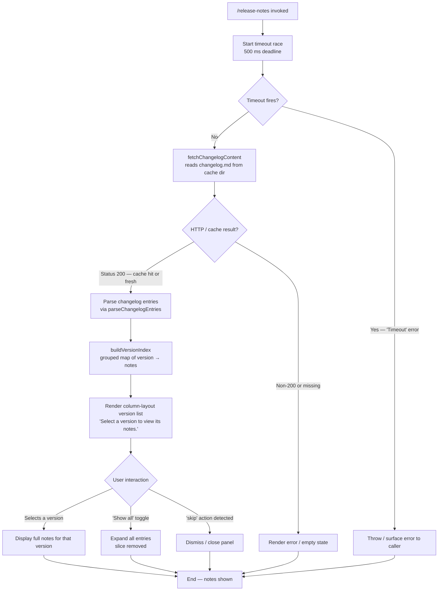

# `/release-notes`

> Analysis basis: CC v2.1.181 bundle.js (AST extraction + Claude interpretation)
> Minimum version: v2.1.181

---

## Overview

`/release-notes` is a local JSX-rendered command that displays the Claude Code changelog to the user in an interactive version-selection panel. It fetches and parses the bundled `changelog.md` file, presents a column-layout version list, and renders the full release notes for a selected version — all within the CLI's terminal UI.

---

## Registration

| Field | Value |
|---|---|
| type | `local-jsx` |
| name | `release-notes` |
| description | `View release notes` |
| module_id | `dhl` |
| load_inline | `true` |
| loc_byte | `12262740` |
| loc_byte_end | `12262881` |
| loc_line | `7882` |
| arbor_handler.name | `JXp` |
| arbor_handler.fqn | `claude-2.1.181::JXp` |
| arbor_handler.kind | `AsyncFunction` |
| arbor_handler.resolution_path | `module_id` |
| arbor_handler.n_hits | `0` |

Analysis basis: CC v2.1.181 bundle.js:+12262740

---

## Input Branching

The command has four or more distinct rendering/flow paths (timeout race, changelog fetch success/failure, version selection state, and "show all" toggle), so a Mermaid flowchart is used.



Analysis basis: CC v2.1.181 bundle.js:+12261046 (Promise.race), +12261020 ("Timeout"), +12261032 (500 ms), +12261386 ("Show all"), +12261691 ("skip"), +12262028 ("Select a version to view its notes.")

---

## Behavioral Spec

### Handler Entry Point (`JXp`)

The primary async handler (resolved via `module_id` → `dhl`) orchestrates the full command lifecycle.

```
async function releaseNotesHandler(context):
    race = Promise.race([
        fetchAndRenderReleaseNotes(context),
        timeout(500, "Timeout")          // 500 ms hard deadline
    ])
    result = await race
    if result is Error("Timeout"):
        throw TimeoutError
    open close-handles via closeHandlers()
    render releaseNotesPanel(result)
    return panel
```

Analysis basis: CC v2.1.181 bundle.js:+12261046, +12261020, +12261032, +12260996, +12261012

---

### Changelog Fetch (`gSo` — fetchAndRenderReleaseNotes)

Responsible for locating and loading `changelog.md` from the local cache directory, then delegating to the parser.

```
async function fetchAndRenderReleaseNotes(context):
    cachePath = joinPaths(cacheDir, "changelog.md")   // "cache/changelog.md"
    appConfig  = configStore.get()
    response   = await httpGet(changelogUrl, timeout=200)
    if response.status == 200:
        writeToCache(cachePath, response.body)
    else:
        tryReadFromCache(cachePath)
    rawText = readCacheFile(cachePath)
    entries = parseChangelogEntries(rawText)           // delegates to lGt
    versionIndex = buildVersionIndex(entries)          // delegates to nWn
    return { entries, versionIndex }
```

Analysis basis: CC v2.1.181 bundle.js:+12257881, +12257896, +12257926, +12257950 (status 200), +12257621 ("cache"), +12257643 ("changelog.md"), +12257992

---

### Changelog Parser (`lGt` — parseChangelogEntries)

Splits raw Markdown text into structured version-entry objects.

```
function parseChangelogEntries(rawText):
    lines = rawText.split("\n")
    entries = []
    for each line in lines:
        trimmed = line.trim()
        if trimmed matches version header:
            // extract version and date via " - " separator
            [version, date] = splitOnSeparator(trimmed, " - ")
            currentEntry = { version, date, notes: [] }
            entries.push(currentEntry)
        else if trimmed starts with "- ":
            currentEntry.notes.push(trimmed)           // bullet items
        else:
            currentEntry.notes.push(trimmed)           // continuation lines
    return entries
```

Analysis basis: CC v2.1.181 bundle.js:+12258320, +12258369, +12258446, +12258451 (" - "), +12258486, +12258509, +12258529 ("- ")

---

### Version Index Builder (`nWn` — buildVersionIndex)

Produces a display-ready grouped structure from the parsed entries.

```
function buildVersionIndex(entries):
    keys = Object.keys(entries)
    filtered = entries.filter(isDisplayable)
    grouped = {}
    for each entry in filtered:
        parsedVersion = parseVersion(entry.version)   // ke / Ho
        grouped[parsedVersion] = entry
    return grouped
```

Analysis basis: CC v2.1.181 bundle.js:+12258959, +12258976, +12258990, +12259017, +12259090, +12259188, +12259191

---

### Random Delay Helper (`e` — jitterDelay)

A small utility used during initialization to add a randomized jitter before proceeding, preventing thundering-herd effects when multiple Claude instances start simultaneously.

```
function jitterDelay():
    jitter = Math.random() * 2 - 1    // range [-1, 1]
    wait   = 1 + jitter               // centered on 1
    setTimeout(resolve, wait * BASE_MS)
```

Analysis basis: CC v2.1.181 bundle.js:+14249546 (Math.random), +14249583 (setTimeout), +14249544 (2), +14249560 (1)

---

### Release Notes Panel Component (`uhl` — ReleaseNotesPanel)

The JSX component that renders the interactive TUI panel. It composes sub-components, maps version entries to selectable rows, and manages the "Show all" toggle state.

```
component ReleaseNotesPanel(entries, versionIndex):
    [selectedVersion, setSelectedVersion] = useState(null)
    [showAll, setShowAll] = useState(false)

    displayedEntries = showAll
        ? entries                         // all versions
        : entries.slice(0, 3)            // default: 3 shown

    render column layout:
        left pane:
            for each entry in displayedEntries (max 4 visible rows):
                render version row (selectable)
            render "Show all" toggle button
        right pane:
            if selectedVersion:
                render full notes for selectedVersion
            else:
                render placeholder "Select a version to view its notes."

    handle "skip" action → close panel
    use Symbol.for("react.memo_cache_sentinel") for memoization
```

Analysis basis: CC v2.1.181 bundle.js:+12261307, +12261386 ("Show all"), +12261469 (3), +12261512 (4), +12261587, +12261589, +12261629, +12261691 ("skip"), +12261709, +12261876, +12261887 ("react.memo_cache_sentinel"), +12261961 ("column"), +12262028, +12262412 ("Release notes"), +12262100–+12262463

---

### Config Persistence (supporting infrastructure via `un` / `n7n` / `t7n` / `w_e`)

While `/release-notes` is a read-oriented command, its changelog fetch path touches the global config write subsystem (for caching the fetched file). The config save logic includes:

- **Lock contention guard**: if lock acquisition exceeds 100 ms threshold, a warning is logged and telemetry is emitted (`tengu_config_lock_contention`). Message: `"Lock acquisition took longer than expected - another Claude instance may be running"` (bundle.js:+13939139).
- **Auth-loss prevention**: if a re-read of the config is missing auth data that the in-memory cache has, the write is refused with an error. Message fragment: `"saveConfigWithLock: re-read config is missing auth..."` (bundle.js:+13939555). Telemetry: `tengu_config_auth_loss_prevented`.
- **Stale-write detection**: emits `tengu_config_stale_write` (bundle.js:+13939364).
- **Parse error handling**: emits `tengu_config_parse_error` (bundle.js:+13941803).
- **Fallback write**: emits `tengu_config_fallback_write` (bundle.js:+13938844).
- **Backup retention**: keeps up to 5 backup files (bundle.js:+13940158); backups stored in subdirectory `"backups"` (bundle.js:+13940740); backup filenames prefixed with `".backup."` (bundle.js:+13940025).
- **Config file permissions**: `384` (octal `0o600`) applied to written config files (bundle.js:+13940440).
- **Lock timeout**: 60 000 ms (bundle.js:+13939909).
- **Fallback lock uses 6 random bytes** encoded as hex (bundle.js:+1094887, +1094899).

Analysis basis: CC v2.1.181 bundle.js:+13939228, +13939364, +13941803, +13939707, +13938844

---

### CLI Error Exit Helper (`Ps` / `eje` — cliErrorExit)

If a fatal error occurs during command execution (e.g., an unrecoverable fetch failure), the error exit path:

1. Calls `eje` to print a red-coloured error message via `gt.red` to `console.error`.
2. Writes error info via `JT` (uses `Ire.writeFileSync` and `cor.join`).
3. Calls `process.exit` with the `"cli_error"` code.

Analysis basis: CC v2.1.181 bundle.js:+13300061, +13300016, +13300030, +13300068, +13300071, +13300084

---

## State & Side Effects

| Item | Detail |
|---|---|
| Telemetry — `tengu_config_lock_contention` | Fired when config lock acquisition exceeds 100 ms (bundle.js:+13939228) |
| Telemetry — `tengu_config_stale_write` | Fired when a stale config write is detected (bundle.js:+13939364) |
| Telemetry — `tengu_config_parse_error` | Fired when the config file cannot be parsed (bundle.js:+13941803) |
| Telemetry — `tengu_config_auth_loss_prevented` | Fired when a write is blocked to prevent auth data loss (bundle.js:+13939707) |
| Telemetry — `tengu_config_fallback_write` | Fired when the config write falls back to an alternate path (bundle.js:+13938844) |
| Cache write | `changelog.md` written to the local cache directory on successful HTTP fetch (bundle.js:+12257643) |
| Config file write | Uses atomic lock + temp file pattern; max 5 backups retained (bundle.js:+13940158) |
| Close handle registration | `n.close` and `r.close` registered via `closeHandlers` on handler entry (bundle.js:+17113749, +17113759) |
| React memoization sentinel | `Symbol.for("react.memo_cache_sentinel")` used for panel memoization (bundle.js:+12261887) |
| Sound | <!-- TODO: not found in depth-2 traversal; needs --depth 4 --> |
| appState changes | <!-- TODO: not found in depth-2 traversal; needs --depth 4 --> |

---

## Version History

| Version | Change |
|---|---|
| v2.1.181 | Initial analysis |

---

## Common Mistakes

1. **Expecting immediate output on slow networks**: the command has a hard 500 ms timeout (`Promise.race`). If the changelog cannot be fetched or read from cache within that window, a `"Timeout"` error is thrown and no notes are shown. Ensure a warm cache for reliable display. (bundle.js:+12261032)
2. **Assuming all versions are visible by default**: the panel initially shows only 3 entries. Users must activate the **"Show all"** toggle to see older releases. (bundle.js:+12261469, +12261386)
3. **Expecting live notes without network access**: when the HTTP fetch returns a non-200 response, the command falls back to the locally cached `changelog.md`. If no cache exists and the network is unavailable, no notes are displayed.
4. **Running multiple Claude instances simultaneously**: concurrent instances may contend on the config lock. If lock acquisition exceeds 100 ms, a warning is emitted and telemetry fires. The second instance is not blocked indefinitely — it times out after 60 000 ms. (bundle.js:+13939139, +13939909)
5. **Confusing `/release-notes` with an agent prompt command**: this is a `local-jsx` command, not a `prompt`-type command. It renders a TUI panel directly and does not send any text to the AI model.

---

## Appendix — Identifier Mapping

> For bundle debugging only. Identifiers change across versions.

| Identifier | Role |
|---|---|
| `JXp` | Primary async handler for `/release-notes` (arbor_handler; AsyncFunction in module `dhl`) |
| `gSo` | Changelog fetch-and-render orchestrator (fetches changelog.md, delegates to parser) |
| `hSo` | Cache path builder (joins cache dir with "changelog.md") |
| `lGt` | Changelog Markdown parser (splits raw text into structured version entries) |
| `nWn` | Version index builder (produces grouped version → notes map) |
| `tWn` | Version index sub-helper (called by nWn) |
| `uhl` | ReleaseNotesPanel JSX component (interactive version-selection TUI) |
| `HSo` | Entry mapper (maps version entries to renderable rows via t.map) |
| `chl` | Entry slicer/formatter (slices entries and calls formatter ab) |
| `aGt` | Context accessor helper (reads hSo path and oi store) |
| `Li` | String splitter utility (indexOf + slice for header parsing) |
| `ke` | Version string parser / semver handler |
| `Ho` | Error/string wrapper used by version parser |
| `fVc` | Queue rotation helper (shift/push on render queue) |
| `cxl` | Telemetry log helper (Date.now + context store + sjt) |
| `ab` | Formatting utility (called by chl and nWn) |
| `Ps` | CLI error-exit orchestrator |
| `eje` | Console error printer (red-coloured output via gt.red) |
| `JT` | File-based error writer (writeFileSync + path join) |
| `un` | Global config save coordinator |
| `n7n` | Config write-with-lock implementation |
| `t7n` | Config fallback write implementation |
| `w_e` | Config file read/write utility (readFileSync, statSync, copyFileSync) |
| `lSt` | Atomic file write helper (temp file + rename + fsync pattern) |
| `h0o` | Backup directory path builder (joins path with "backups") |
| `L8t` | Lock timing tracker (Date.now based) |
| `f0o` | Config entries iterator (Object.entries) |
| `dMe` | Config diff/merge helper |
| `qmt` | Config validation helper |
| `Re` | JSON serializer wrapper (JSON.stringify) |
| `nI` | Config normalizer |
| `gBs` | Config object assembler (kvr + Object.assign) |
| `ta` | Transport/HTTP helper (calls qYo) |
| `qYo` | HTTP request executor (calls rt) |
| `rt` | Low-level fetch primitive (String conversion) |
| `oi` | Context store accessor (tLu.getStore) |
| `ln` | Logging utility |
| `jt` | Path/file utility |
| `Sx` | Config schema/shape helper |
| `j` | General utility (used across config and panel paths) |
| `I` | Config value inspector/formatter (includes, toUpperCase, trim, etc.) |
| `$e` | Initialization helper (calls Rht) |
| `Lr` | Changelog URL or base-path constant |
| `T` | Scroll/layout math helper (Math.max, Math.floor, preventDefault) |
| `E` | Slice/clamp helper (Math.max, Math.min) |
| `g` | Stream buffer handler (Buffer.concat, subarray, indexOf) |
| `o` | Column layout helper (s.map, padEnd) |
| `l` | UI list component (calls cxl) |
| `n` | Lower-level close/event helper (toLowerCase) |
| `r` | File system or stream reference (close, statSync, readFileSync, etc.) |
| `s` | Set-based handle registry (r.add, i.finally, r.delete) |
| `i` | Close-handle coordinator (n.close, r.close, s) |
| `e` | Jitter delay utility (Math.random + setTimeout) |

---

Note: index built via Arbor fallback; some signals (telemetry, literals) may be missing — see arbor-fallback.js.