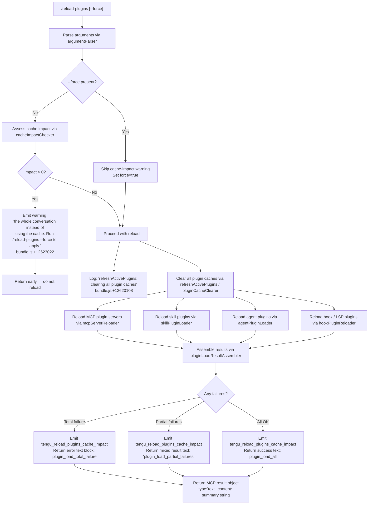

# `/reload-plugins`

> Analysis basis: CC v2.1.190 bundle.js (AST extraction + Claude interpretation)
> Minimum version: v2.1.190

---

## Overview

`/reload-plugins` activates pending plugin changes within the current Claude Code session by scanning and reloading all plugin types (plugin MCP servers, skill plugins, agent plugins, and hook plugins). It operates without requiring a full session restart and optionally accepts `--force` to bypass cache-impact warnings that would otherwise prompt the user to replay the whole conversation.

---

## Registration

| Field | Value |
|---|---|
| type | `local` |
| name | `reload-plugins` |
| description | `Activate pending plugin changes in the current session` |
| argumentHint | `[--force]` |
| supportsNonInteractive | `false` |
| thinClientDispatch | `control-request` |
| module_id | `yPl` |
| load_inline | `true` |
| loc_byte | `12624439` |
| loc_byte_end | `12624683` |
| loc_line | `8663` |
| arbor_handler.name | `LHf` |
| arbor_handler.fqn | `claude-2.1.190::LHf` |
| arbor_handler.kind | `AsyncFunction` |
| arbor_handler.resolution_path | `module_id` |
| arbor_handler.n_hits | `0` |

Analysis basis: CC v2.1.190 bundle.js:+12624439

---

## Input Branching

The handler has 5+ distinct branches depending on argument parsing, `--force` flag, cache-impact assessment, and per-plugin-type outcomes.



---

## Behavioral Spec

### Top-level handler — `reloadPluginsHandler` (bundle identifier: `LHf`)

Analysis basis: CC v2.1.190 bundle.js:+12623137

```
async function reloadPluginsHandler(context):
    // Step 1: Parse raw argument string
    rawArgs = context.userInput.trim()              // +12623523
    parsedArgs = argumentParser(rawArgs)            // calls $S → Nu → nOe (+12623137)

    // Step 2: Check --force flag
    forceFlag = parsedArgs["--force"] or parsedArgs["force"]  // literals: "--force","force" (+12623559,+12623574)
    if not forceFlag:
        // Step 3: Assess cache impact
        impact = cacheImpactChecker(context)        // calls Nu (+12623155)
        if impact > 0:
            // Warn user that replaying the conversation would be needed
            return mkTextResult(
                "the whole conversation instead of using the cache. " +
                "Run /reload-plugins --force to apply."  // +12623022
            )
            // Telemetry: tengu_reload_plugins_cache_impact (+12622431)

    // Step 4: Run full plugin refresh
    appState = context.getAppState()                // +12623637
    refreshResult = await refreshActivePlugins(appState, forceFlag)  // calls eEe (+12623869)

    // Step 5: Format and split output
    summary = formatPluginSummary(refreshResult)    // calls kHf (+12623797)
    lines = summary.split(...)                      // kHf → n.split (+12622919)

    // Step 6: Append install-hint for unresolved plugins
    hintLines = buildInstallHint(refreshResult)     // calls $ie (+12623944)

    // Step 7: Return MCP text result
    return {
        type: "text",                               // literal "text" (+12623501)
        content: lines.join("\n") + hintLines
    }
```

### Plugin cache refresh — `refreshActivePlugins` (bundle identifier: `eEe`)

Analysis basis: CC v2.1.190 bundle.js:+12620108

```
async function refreshActivePlugins(appState, force):
    log("refreshActivePlugins: clearing all plugin caches")   // +12620108

    // Clear skill-index cache and related caches
    clearSkillIndexCache()          // zh → d5 → e.clearSkillIndexCache (+13210636)
    clearCachedPluginState()        // ccl → T (+10984195 "Cleared installed plugins cache")

    // Parallel reload of all plugin categories
    [mcpResult, skillResult, agentResult, hookResult] = await Promise.all([
        reloadMcpPluginServers(appState),       // calls Cee (+12620412)
        reloadSkillPlugins(appState),           // calls f9e (+12620574)
        reloadAgentPlugins(appState),           // calls aMn (+12620702)
        reloadHookPlugins(appState)             // calls Sge (+12620969)
    ])                                          // +12620215

    // Filter LSP-managed vs plugin-managed
    lspFiltered  = filterLspManaged(mcpResult)  // calls vHf (+12620785)
    hookFiltered = filterHookManaged(mcpResult) // calls wHf (+12620818)

    // Reduce into summary counts
    loadCount    = results.reduce(countLoaded)   // l.reduce / c.reduce (+12620643,+12620668)

    // Emit change event to UI
    eventEmitter.emit("oF")                      // oF.emit (+12621215)

    return assembleResult(loadCount, lspFiltered, hookFiltered)
```

### MCP server loader — `mcpServerReloader` (bundle identifier: `Cee`)

Analysis basis: CC v2.1.190 bundle.js:+6566855

```
async function mcpServerReloader(appState):
    // Enumerate config sources (project, user, local, enterprise, mcpAutoDiscovered)
    configSources = enumerateMcpConfigs(appState)   // Ib (+6590587)

    // For each config source, load .mcp.json or inline config
    for source in configSources:
        entries = parseConfigSource(source)          // jXr (+6567548)
        // Validate entries, skip .mcpb / .dxt with wrong extension
        // literals: ".mcpb" (+6553166), ".dxt" (+6553187)
        validEntries = entries.filter(validateEntry)

    // Resolve marketplace entries
    marketplaceEntries = resolveMarketplace(validEntries)  // Zoa (+6567704)

    // Attempt parallel connection of all resolved servers
    results = await Promise.all(entries.map(connectServer))  // +6567822

    return { entries: results, errors: collectErrors(results) }
```

### Plugin load result assembler — `pluginLoadResultAssembler` (bundle identifier: `ZAo`)

Analysis basis: CC v2.1.190 bundle.js:+11060139

```
function pluginLoadResultAssembler(rawResults):
    // Classify per-plugin outcomes
    successSet = new Set()
    failureList = []

    for result in rawResults:
        if result.status == "fulfilled":            // literal "fulfilled" (+11042121)
            successSet.add(result.plugin)
        else:                                       // "rejected" (+11042177)
            classify = classifyFailure(result)      // possible values:
            // "marketplace-blocked-by-policy" (+11040813)
            // "marketplace-not-found"          (+11041366)
            // "marketplace-load-failed"        (+11041558)
            // "cache-miss"                     (+11041614)
            // "plugin-not-found"               (+11041652)
            // "generic-error"                  (+11042293)
            failureList.push({ plugin: result.plugin, reason: classify })

    // Check for stale cwd (early-kick guard)
    if originalCwd != currentCwd:
        log("assemblePluginLoadResult: originalCwd changed mid-scan; skipping side-effects (stale early-kick)")  // +11061281
        return { skipped: true }

    // Emit telemetry summary
    if failureList.length == rawResults.length:
        emit("plugin_load_total_failure")           // +11061146
    else if failureList.length > 0:
        emit("plugin_load_partial_failures")        // +11061215
    else:
        emit("plugin_load_all")                     // +11061128

    return { loaded: successSet, failed: failureList }
```

### Argument parser / cache-impact checker — `cacheImpactChecker` (bundle identifier: `_Pl` → `W`)

Analysis basis: CC v2.1.190 bundle.js:+12622429

```
function cacheImpactChecker(context):
    // Checks how many conversation turns are currently cached
    // If non-zero, reload would invalidate the cache requiring full replay
    // Returns integer count of affected cache entries
    cachedTurns = readCacheState(context)
    return cachedTurns
```

### Plugin type categorization — `pluginTypeRouter` (called via `EX` → `En`)

Analysis basis: CC v2.1.190 bundle.js:+12623233

```
function pluginTypeRouter(pluginEntry):
    // Routes a plugin entry to the correct loader based on type tag
    switch pluginEntry.type:
        case "plugin":              // literal +12623253
            return loadPluginMcpServer(pluginEntry)
        case "skill":               // literal +12623284
            return loadSkillPlugin(pluginEntry)
        case "agent":               // literal +12623312
            return loadAgentPlugin(pluginEntry)
        // Hook/LSP handled separately by hookPluginReloader (Sge)
    // Error label for unknown type: "plugin MCP server" (+12623344)
```

### Hook/LSP plugin loader — `hookPluginReloader` (bundle identifier: `Sge`)

Analysis basis: CC v2.1.190 bundle.js:+5236240

```
function hookPluginReloader(appState):
    if safeMode:
        log("Safe mode: skipping plugin hook registration")  // +5236248
        return []
    // Load hooks via rWi (+5236309)
    // Uses pluginRoot literal (+5236528)
    hooks = loadHooks(appState.pluginRoot)
    return hooks
```

### MCP plugin connection — `mcpServerConnectionManager` (bundle identifier: `iJr` → `E7`)

Analysis basis: CC v2.1.190 bundle.js:+6590444

```
async function mcpServerConnectionManager(configs):
    // Enumerate configs from all scopes: projectSettings, userSettings,
    // localSettings (+6588706,+6588729,+6588750), enterprise, mcpAutoDiscovered (+6590447)

    // For each server, determine transport: stdio, sse, sse-ide, ws-ide (+6869193,+6869227,+6869292,+6869328)

    // Suppress duplicates: "mcp-server-suppressed-duplicate" (+6592503)
    // Max duplicate suppression count: 3 (+6592479)

    // Connect approved (+6591533) servers; skip pending (+6591560)
    // On failure classify: "mcp-config-invalid", "mcpb-download-failed",
    //   "mcpb-extract-failed", "mcpb-invalid-manifest"
    //   (+6591026,+6591057,+6591090,+6591122)

    // Spawn background MCP processes, register in process tracking sets f and m
    // f.add (+6591609), m.add (+6591679)

    // Assign Object.assign merged config (+6591725)
    return connectionResults
```

---

## State & Side Effects

| Item | Detail |
|---|---|
| Telemetry | `tengu_reload_plugins_cache_impact` (bundle.js:+12622431) — fired on every invocation path that reaches the reload or warning branch. Also transitively: `tengu_plugin_state_file_error` (+10984376), `tengu_bg_dispatch_sigkill_escalate` (+17198228), `tengu_bg_dispatch_low_mem` (+17198829), `tengu_bg_spare_enable/claim/claim_fail` (+17199526,+17199654,+17199920), `tengu_daemon_config_reload` (+17214348), `tengu_daemon_control` (+17235957), `tengu_feature_ok/bad/sad` (+1025122,+1025189,+1025270) |
| Skill-index cache | Cleared unconditionally on every reload (`e.clearSkillIndexCache` at +13210636). Also `RGt.clear` (+10916213) clears an additional runtime cache. |
| Installed-plugins cache | Cleared via `pluginCacheClearer`; log message "Cleared installed plugins cache" (+10984197). |
| MCP server processes | New server processes may be spawned (`uV.spawn` +17199983); existing duplicate processes suppressed. Process tracking Sets `f` and `m` updated. |
| appState changes | `getAppState()` called (+12623637); internal plugin registry updated with new server configs via `Object.assign` (+6591725). |
| Event emission | `oF.emit` (+12621215) signals the UI layer that plugin state has changed. |
| Hook registration | Safe-mode flag suppresses hook registration (+5236248). Otherwise hooks are registered via `rWi` (+5236309). |
| Sound | None observed in depth-2 traversal. |
| Non-interactive | `supportsNonInteractive: false` — command is blocked in non-interactive / headless mode. |
| thinClientDispatch | `control-request` — in thin-client mode this command is forwarded as a control-request rather than executed locally. |

---

## Version History

| Version | Change |
|---|---|
| v2.1.190 | Initial analysis |

---

## Common Mistakes

1. **Forgetting `--force` after config changes that affect cached turns.** If the session has cached conversation turns, the command exits early with a warning message and does NOT reload. You must pass `--force` to bypass this guard (bundle.js:+12623559).

2. **Expecting immediate MCP tool availability.** Server processes are spawned asynchronously. Tools exposed by newly connected MCP servers may not be visible in the same turn immediately after `/reload-plugins` returns.

3. **Using `/reload-plugins` in non-interactive mode.** `supportsNonInteractive` is `false`; the command will not execute in headless or `--print` mode pipelines.

4. **Assuming all plugin types reload atomically.** The four plugin categories (MCP servers, skills, agents, hooks/LSP) load in parallel and each can independently succeed or fail. A partial-failure result (`plugin_load_partial_failures`) means some plugins are active and others are not — check the returned summary carefully.

5. **Ignoring the stale-cwd guard.** If the working directory changed between when the command was invoked and when the scan completes (race condition), the assembler will silently skip all side-effects and return a `skipped` sentinel (bundle.js:+11061281). Reissue the command from a stable working directory.

6. **Confusing `plugin`, `skill`, and `agent` type tags.** The plugin type router dispatches on the string literal in the plugin manifest (`"plugin"`, `"skill"`, `"agent"` at +12623253/+12623284/+12623312). A mismatched type tag in a manifest will cause the entry to be routed to the wrong loader.

---

## Appendix — Identifier Mapping

> For bundle debugging only. Identifiers change across versions.

| Identifier | Role |
|---|---|
| `LHf` | Top-level async handler for `/reload-plugins` (main entry point) |
| `$S` | Argument string parser (parses raw user input string) |
| `Nu` | Cache-impact reader (returns count of cached turns) |
| `nOe` | Inner helper called by cache-impact reader |
| `EX` | Plugin type router dispatcher |
| `En` | Individual plugin type routing helper |
| `HPl` | Plugin reload orchestrator (coordinates MCP + skill + agent + hook) |
| `iJr` | MCP server connection manager |
| `lJr` | Plugin load result sub-assembler |
| `ZAo` | Plugin load result assembler (classifies fulfilled/rejected, emits telemetry) |
| `QAo` | Marketplace plugin resolver |
| `E7` | MCP server config loader and process spawner |
| `Vl` | Config scope enumerator helper |
| `aF` | Object prototype factory (Object.create wrapper) |
| `Ib` | Per-source MCP config file parser (.mcp.json reader) |
| `Dae` | MCP binary (.mcpb) package handler |
| `XE` | Policy settings filter |
| `gyn` | Transport type classifier (http/dynamic) |
| `my` | Terminal-type helper |
| `T` | General-purpose tagged-template / string formatter |
| `SRn` | Server registration helper (approved/pending state handler) |
| `Gnt` | Server config normaliser |
| `h` | Process manager accessor |
| `f` | Background process lifecycle manager (spawn/kill/retire) |
| `m` | Secondary process lifecycle manager |
| `Qw` | MCP connection wrapper (eh/nJr) |
| `msa` | MCP server-state map manager |
| `w` | Activity/idle timer manager |
| `p` | Forced-shutdown handler |
| `x` | PTY write buffer manager |
| `r` | Data-event listener registrar |
| `Is` | CLI error handler (process.exit wrapper) |
| `t` | Generic collection/state accessor |
| `n` | Name normaliser (toLowerCase) |
| `i` | Channel close handler |
| `s` | Subscription lifecycle manager |
| `DD` | Shell-level argument parser entry |
| `dOt` | Shell argument tokeniser |
| `NFe` | HIPAA/compliance mode checker |
| `FVr` | `auto:` prefix version-range parser |
| `zMd` | `auto:` prefix detector |
| `nt` | String coercion utility |
| `Za` | Alternative string coercion utility |
| `Ir` | Inner string coercion helper |
| `Eu` | Provider name resolver |
| `Ndn` | Provider name normaliser |
| `Wj` | Argument lowercasing / inclusion checker |
| `YMd` | Array-or-string normaliser |
| `it` | Tool-search capability gate checker |
| `Y_` | Object.values enumerator wrapper |
| `_Pl` | Cache-impact checker implementation |
| `W` | Async result resolver |
| `kHf` | Plugin summary line splitter (n.split wrapper) |
| `eEe` | `refreshActivePlugins` — clears caches and fans out to all plugin loaders |
| `ccl` | Installed-plugins cache clearer |
| `zh` | Skill-index and cache coordinator |
| `Xzp` | Skill-index pipeline (yv/Rqn/Oqn/f0n/mjr) |
| `yv` | Skill-index builder |
| `Rqn` | Skill registry reader |
| `Oqn` | Skill registry writer |
| `f0n` | Skill-index file helper |
| `mjr` | Marketplace skill loader |
| `ke` | Error logger (YJ.logError) |
| `yRn` | Skill reload helper |
| `xAo` | Additional skill-index helper |
| `zll` | Skill cleanup utility |
| `Lx` | Skill-index cache invalidator (clearSkillIndexCache caller) |
| `d5` | Inner clearSkillIndexCache wrapper |
| `Pll` | Skill path resolver |
| `eWe` | Skill config loader |
| `cye` | Oqn-based skill writer helper |
| `IVr` | Skill validation helper |
| `D4` | RGt cache clearer |
| `k$a` | Additional plugin state clearer |
| `zfa` | Plugin state file accessor |
| `gr` | Log / VL emitter |
| `VL` | Structured log event emitter |
| `o` | Column formatter (padEnd) |
| `Cee` | MCP server config file reader and validator |
| `C8` | File-extension checker (.mcpb/.dxt) |
| `uoe` | Config warning emitter |
| `jXr` | Per-config-source .mcp.json file reader |
| `Wt` | File-system base-path resolver |
| `kn` | Error classifier / logger |
| `Gt` | JSON.parse wrapper |
| `Zoa` | Marketplace config resolver |
| `xNt` | MCPB archive extractor and config generator |
| `be` | String coercion (String constructor) |
| `f9e` | LSP config (.lsp.json) reader |
| `UYd` | LSP config plugin-path validator |
| `NYd` | LSP relative-path safety checker |
| `l` | Background-task runner (rUl) |
| `rUl` | Async task runner with date-stamping |
| `AQ` | Task result aggregator |
| `Xs` | AsyncLocalStorage store reader |
| `nVt` | Daemon status file path resolver |
| `Me` | JSON.stringify wrapper |
| `c` | Connection result reducer |
| `aMn` | Agent plugin loader / LSP extension conflict detector |
| `a` | Full plugin update coordinator (d9e+brr+_la) |
| `d9e` | Individual MCP plugin connection attempt |
| `brr` | Plugin connection result applier (applyMcpUpdate) |
| `_la` | Plugin lock/queue helper |
| `fBo` | Plugin slot reconciler (getClients, applyMcpUpdate) |
| `vHf` | LSP-managed server filter |
| `gPl` | LSP management predicate |
| `wHf` | Hook-managed server filter |
| `Sge` | Hook/LSP plugin loader (safe-mode aware) |
| `dl` | Plugin hook registrar |
| `WXt` | Safe-mode flag reader |
| `kye` | Plugin installation manager (per-plugin load from disk) |
| `tM` | Known-marketplaces file loader (Gf) |
| `Gf` | known_marketplaces.json reader |
| `$qn` | Marketplace known-path resolver |
| `X2e` | Plugin manifest schema validator |
| `Tn` | Schema discriminator |
| `gsn` | Schema branch selector |
| `l2` | Plugin manifest field parser |
| `Tx` | Managed-scope error thrower |
| `ts` | Plugin source type checker (includes/split) |
| `jT` | Plugin source URL/path parser |
| `Dpa` | URL scheme extractor |
| `QUt` | URL host/path pattern matcher |
| `RMn` | Pattern schema discriminator |
| `Ppa` | Host-pattern evaluator |
| `Opa` | Path-pattern evaluator |
| `kXd` | GitHub/npm source router |
| `D8` | Schema discriminator (Tn) |
| `Upa` | Combined URL pattern evaluator |
| `Mpa` | XH-based pattern matcher |
| `d6` | Plugin marketplace.json reader |
| `BGt` | Marketplace JSON path builder |
| `NAo` | Marketplace JSON safe-parser |
| `cn` | Log/console helper |
| `Zk` | Plugin scope loader (FAo+Gf+yP) |
| `FAo` | File-scoped plugin reader |
| `pof` | Plugin capability set checker |
| `JGt` | Plugin system bootstrap / full plugin graph initialiser |
| `nL` | Tn-based schema normaliser |
| `Xqn` | Plugin source resolution chain (ts+jT) |
| `XIt` | Local `./` path prefix checker |
| `u` | Agent session controller (Le/Re/CU/X6) |
| `Le` | Agent session start (W+Pe) |
| `Re` | Agent session retry (W+Pe) |
| `CU` | Notification queue manager |
| `X6` | Process exit / abort controller (Promise.race) |
| `Pt` | AsyncLocalStorage context reader (Mrn) |
| `Mrn` | Store getter (xrn.getStore) |
| `eM` | Plugin config loader from disk (load-from-disk) |
| `$Ao` | Plugin config sync file reader (readFileSync) |
| `BAo` | Plugin config entry expander |
| `VGt` | Plugin config writer (W+Pe) |
| `y` | Plugin state Map manager (G5e) |
| `G5e` | Plugin state updater / subscriber |
| `bD` | Plugin source validator (ts+A0) |
| `A0` | Plugin source kind reader |
| `YCn` | SemVer version validator (xj.valid/coerce/satisfies) |
| `E` | Plugin event set (FUt+nyt) |
| `FUt` | Plugin event type |
| `nyt` | Plugin event emitter (yyc) |
| `DNi` | Dependency cycle/cross-marketplace checker |
| `ex` | Flag/feature-set tracker (CEt) |
| `CEt` | Feature flag set accessor |
| `H` | PTY/socket buffer manager |
| `g` | Timeout-with-activity manager |
| `mp` | Stream-end helper |
| `RJf` | PTY/daemon protocol dispatcher (full message router) |
| `D` | Daemon file writer (VEc+sp+XJf) |
| `VEc` | File realpath/stat validator |
| `sp` | File-stream state tracker |
| `XJf` | Daemon binary writer (B2n) |
| `d` | PTY write-stream multiplexer |
| `P` | Timer/interval manager |
| `Hcl` | Plugin load-order / dependency queue manager |
| `M` | clearTimeout/write timer manager |
| `O` | Plugin output map |
| `ao` | Settings-file loader and lock manager |
| `Jm` | Settings file type discriminator |
| `ZEr` | Settings file writer (DG/Uls/XJ) |
| `DC` | Settings file path provider |
| `cEr` | Settings write-timestamp tracker |
| `nNe` | Settings default merger |
| `sIt` | Atomic file writer (writeFileSyncAndFlush) |
| `bH` | Cache set clearer (XYt.clear/xsr.clear) |
| `Gis` | Gitignore writer / settings file appender |
| `g9` | Config base-path provider |
| `Mt` | Async event emitter (W+Pe) |
| `PG` | Settings load telemetry emitter |
| `Jqn` | Plugin install path safety checker (p6.resolve/startsWith) |
| `V` | Scheduled-task runner |
| `F` | clearInterval wrapper |
| `sOt` | Task-schedule discriminator (Drt/SMd.test) |
| `Gwn` | Recurring-task scheduler |
| `Odc` | Boolean coercion helper |
| `N` | Numeric counter / timer reference |
| `eK` | Feature-flag has-checker |
| `uae` | Task expiry / filter helper |
| `ie` | Main session event loop (full session lifecycle manager) |
| `b7n` | Background session error classifier |
| `sv` | Terminal encoding detector (base64/tmux/dcs/raw) |
| `z` | Keyboard event handler (backspace/preventDefault) |
| `mh` | Session state accessor |
| `QHe` | Session list loader (listAllLiveSessions) |
| `Xle` | Session loader / conversation initialiser |
| `Ve` | aKe-based UI component |
| `oo` | Module initialiser / ESModule setup |
| `we` | Message queue processor (oKt/Promise.resolve) |
| `v` | UI render helper |
| `$e` | Message history pruner (findLastIndex/splice) |
| `vc` | UUID generator (MP.randomUUID) |
| `ZA` | Module flag setters (m6o/f6o) |
| `Uy` | UI utility accessor |
| `Jzt` | Session transcript rename/persist helper |
| `JY` | Rc-based session accessor |
| `LBn` | Session background helpers (yuo/pEt) |
| `yWe` | Session Rc-based reader |
| `NEe` | Session config builder (nK/KDe) |
| `Aat` | Input-object factory (ino) |
| `tjt` | Session teardown helper |
| `nVe` | Model-selection handler (mode_dependent_setting) |
| `rVe` | Fork/restore handler (relatch) |
| `We` | Regex-exec based parser |
| `Ue` | Passthrough identity wrapper |
| `ejt` | Session-end callback |
| `Ez` | Timestamp-based gate (Kwt/Date.now) |
| `Xue` | Rc-based session reader |
| `njt` | Process.chdir / session start sequence |
| `Yue` | Session metadata reappender (gl.utimes) |
| `Pe` | aKe UI element (event emitter) |
| `fo` | Error/String utility |
| `ae` | Async result accumulator |
| `De` | Deferred result + P.setTimeout |
| `zRt` | Worker-thread poster (ho.post/YE) |
| `pe` | Session-order tracker (ae.some/ot.indexOf) |
| `ot` | Session-queue item (W/Pe/Rr/Zm/XQ/Fo) |
| `YDt` | SemVer range conflict checker (xj.validRange/minVersion) |
| `PWr` | Range-too-complex checker |
| `zqn` | Plugin graph vertex accessor (VAo) |
| `VAo` | Plugin graph vertex |
| `jGt` | Plugin graph vertex navigator |
| `Yqn` | Git tag resolver (ls-remote/--tags/refs/tags/) |
| `Ejp` | Git error classifier |
| `Un` | Git command runner (Wr+Pt) |
| `n8` | Git credential helper (FWr) |
| `jqn` | Plugin source string replacer |
| `XGt` | Plugin install executor (download + extract + install) |
| `Tmt` | Plugin package installer (npm/bun) |
| `Gqn` | Plugin install state reader (gIt) |
| `Ecl` | Plugin install cleanup helper |
| `Jce` | Plugin content hasher (sha256/createHash) |
| `oN` | Plugin version-file reader (eVn/hv) |
| `Vqn` | Plugin directory reader (fcl.readdir) |
| `Dq` | Plugin file path formatter (nt) |
| `Bxe` | Plugin directory setup (oN) |
| `Dqn` | Plugin cleanup helper (hR.rm) |
| `GAo` | Plugin registry updater (eM/KGt) |
| `U` | PTY write-timer (clearTimeout/setTimeout/Math.round) |
| `K` | Lockfile manager (fMe/Jgl) |
| `fMe` | Lockfile read/delete helper (AP.lstat/rm/readFile) |
| `Jgl` | Lockfile unlink helper (AP.unlink) |
| `j` | Voice timer (_.current/V.setTimeout) |
| `_` | Background task runner (nyt/VD/Ox/Promise.all) |
| `X` | Session init helper (IZn) |
| `qe` | Session-name parser (Gn.split) |
| `Gn` | Session-name formatter |
| `He` | MCP elicitation handler (fe.has/ln/Me/W/Pe) |
| `fe` | MCP client session manager (kXn/pe/E9f) |
| `ln` | MCP debug logger (f7e.push/YJ.logMCPDebug) |
| `fUt` | MCP elicitation form builder (hUt/Vc) |
| `nyc` | MCP notification title reader |
| `mUt` | MCP elicitation response handler (gUt/C7/Vc) |
| `C7` | MCP notification handler (od/xL) |
| `VT` | MCP message queue (wr/jL/AUd/t.shift/t.push) |
| `de` | Cancellation token holder |
| `he` | MCP tool/resource registry (full MCP session state) |
| `Rn` | MCP resource set (en/ke) |
| `vt` | MCP tool set (j.push/Fe) |
| `Br` | MCP connection cleanup |
| `Dua` | MCP SDK connect / capability negotiator |
| `os` | MCP resource lister |
| `ur` | MCP server filter (Gn.includes/p.includes/push/filter) |
| `f9` | MCP schema accessor (ac) |
| `xB` | MCP tool prefix checker (r.startsWith) |
| `RWi` | VSCode review/survey upsell helper |
| `CLn` | t7-based component loader |
| `t7` | UI component registry |
| `rwl` | JSON-stringify log helper |
| `S_c` | CCD session / feedback gate checker |
| `Sjp` | Plugin scope dependency resolver (bD/ts/nL/Xqn/Zk) |
| `q` | Pending-task queue |
| `ye` | UI component array (c/I/ce) |
| `I` | Scroll/layout event handler |
| `ce` | UI render queue (vc/fte/gs/F.push/k.enqueue) |
| `ve` | Event-history list (aXl/cXl/oXl/uXl/W) |
| `aXl` | Event history poster (D2/Ls/YE) |
| `cXl` | Event history fetcher (lXl/Re/Le) |
| `oXl` | Event history loader (g_t/Kzt/W/Pe/Ve) |
| `uXl` | Event history older-page fetcher (lXl) |
| `J` | MCP update applier (brr/j.applyMcpUpdate/u9e) |
| `u9e` | MCP update payload builder (PLe) |
| `ee` | MCP connection set (ZW/H.filter/yit/nMn/ke/fBo) |
| `ZW` | Promise/async-iterator utility |
| `yit` | Port/integer parser (parseInt) |
| `nMn` | Secondary integer parser (parseInt) |
| `ne` | MCP connection entry (ee/te/A/v) |
| `te` | MCP entry accessor (h) |
| `bx` | Platform name lowercase checker |
| `km` | Numeric string formatter (nt) |
| `Su` | Plugin config emitter (K2e/BEt/o.split/Mir/Dir) |
| `K2e` | Plugin config schema builder |
| `BEt` | Plugin config broadcast helper |
| `Mir` | Plugin config change emitter |
| `Dir` | Plugin config remove emitter |
| `re` | Session recording state (T/ee/K) |
| `$ie` | Plugin install-hint formatter (ts/r.join/r.slice/En) |

---

Note: index built via Arbor fallback; some signals (telemetry, literals) may be missing — see arbor-fallback.js.