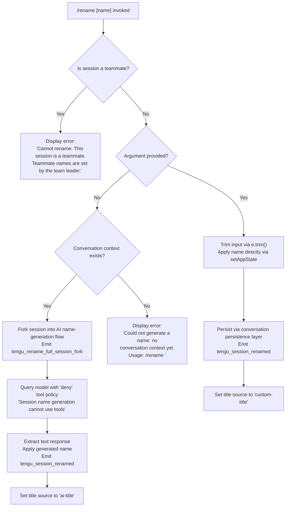

# `/rename`

> Analysis basis: CC v2.1.190 bundle.js (AST extraction + Claude interpretation)
> Minimum version: v2.1.190

---

## Overview

The `/rename` command (alias: `/name`) renames the current conversation session. When called with an explicit name argument it applies that name immediately; when called with no argument it invokes an AI-powered name-generation flow using the existing conversation context. The command is marked `immediate`, meaning it executes without entering an agent turn.

---

## Registration

| Field | Value |
|---|---|
| type | `local-jsx` |
| name | `rename` |
| description | `Rename the current conversation` |
| argumentHint | `[name]` |
| immediate | `true` |
| aliases | `["name"]` |
| module_id | `UIl` |
| load_inline | `true` |
| loc_byte | `12070728` |
| loc_byte_end | `12070927` |
| loc_line | `8094` |
| arbor_handler.name | `tcf` |
| arbor_handler.fqn | `claude-2.1.190::tcf` |
| arbor_handler.kind | `AsyncFunction` |
| arbor_handler.resolution_path | `module_id` |
| arbor_handler.n_hits | `0` |

Analysis basis: CC v2.1.190 bundle.js:+12070728

---

## Input Branching

Four distinct execution paths exist depending on teammate status, argument presence, and conversation context. A Mermaid flowchart is used.



Analysis basis: CC v2.1.190 bundle.js:+12069740, +12069872, +12070103, +12069892, +12068080

---

## Behavioral Spec

### Top-level handler (`tcf`)

The Arbor-resolved handler `tcf` is an `AsyncFunction` reached via `module_id` resolution. It delegates to two internal functions: the render component (`xjn`) and the action handler (`Mjn`).

Analysis basis: CC v2.1.190 bundle.js:+12070424

```
async function sessionRenameHandler(context):
    renderComponent(context)        // xjn — JSX display
    executeRename(context)          // Mjn — core logic
```

---

### Teammate guard (`Mjn` — action handler)

```
async function executeRename(context):
    sessionStore = getSessionStore()     // df → c0 → CRr.getStore
    if sessionStore.isTeammate:
        display("Cannot rename: This session is a teammate. ...")
        return

    userInput = context.argument.trim()  // Mjn → e.trim

    if userInput is not empty:
        applyRenameDirectly(userInput)
    else:
        generateNameFromContext(context)
```

Analysis basis: CC v2.1.190 bundle.js:+12069872, +12069892, +12069991

---

### Direct rename path

When the user supplies an explicit name, the trimmed string is written to app state via `setAppState`, the conversation is persisted through the file-persistence layer (`Oie` → `Di` → filesystem ops), and the title source is tagged as `"custom-title"`.

```
function applyRenameDirectly(name):
    trimmedName = name.trim()
    context.setAppState({ conversationName: trimmedName })  // Mjn → t.setAppState
    persistConversation()            // Oie → Di → aye.writeFile / aye.mkdir
    emitTelemetry("tengu_session_renamed")
    setTitleSource("custom-title")   // literal bundle.js:+13261412
```

Analysis basis: CC v2.1.190 bundle.js:+12070231, +13261412, +13261504

---

### AI name-generation path (`Yht` / `ecf` / `C0`)

When no argument is provided and conversation context exists, the command forks an in-process session sub-query dedicated to name generation.

```
async function generateNameFromContext(context):
    if not conversationHasMessages():
        display("Could not generate a name: no conversation context yet. ...")
        return

    emitTelemetry("tengu_rename_full_session_fork")   // bundle.js:+12068544

    // Build query with tool-use denied
    queryConfig = buildQuery({
        toolPolicy: "deny",                        // literal bundle.js:+12067986
        systemNote: "Session name generation cannot use tools",  // bundle.js:+12068001
        eventTag: "rename_generate_name"           // bundle.js:+12068104
    })

    // Run model query via forked agent loop (C0 → f4n)
    response = await runForkedQuery(queryConfig)

    // Extract plain-text response
    textContent = extractTextContent(response)     // filter type=="text", bundle.js:+12068327

    if textContent is not empty:
        applyRenameDirectly(sanitizedText)
        setTitleSource("ai-title")                // literal bundle.js:+13261581
        emitTelemetry("tengu_session_renamed")
```

Analysis basis: CC v2.1.190 bundle.js:+12070025, +12067986, +12068001, +12068104, +12068327, +13261581

---

### Forked query execution (`C0` / `f4n`)

The name-generation sub-query runs through the standard agent query pipeline (`C0` → `f4n`) with these notable constraints:

- App state is read via `e.getAppState` and written back via `e.setAppState`.
- A deny-all tool policy is enforced; no tools may be invoked during name generation.
- A randomUUID is assigned to the forked request (`Yil.randomUUID`).
- The conversation history buffer is constructed (`kjn` / `pee`) from existing messages, filtered to exclude meta messages, and truncated via `n.slice`.
- Response is streamed through the standard streaming pipeline (`k5l`) and emits standard API telemetry events.

```
async function runForkedQuery(config):
    appState = context.getAppState()
    requestId = crypto.randomUUID()
    messages = buildMessageHistory()    // kjn → pee, Array.isArray, t.join, n.slice
    response = await streamingApiCall(messages, config)
    context.setAppState(updatedState)
    return response
```

Analysis basis: CC v2.1.190 bundle.js:+10782731, +10783895, +10785178, +12064994, +12065212

---

### HTML-entity escaping (`gVn`)

`xjn` calls `gVn` to sanitize any name before rendering it in the JSX display layer. The function replaces the following HTML entity sequences:

| Raw character | Escaped form | loc_byte |
|---|---|---|
| `&` | `&amp;` | +13668966 |
| `<` | `&lt;` | +13668990 |
| `>` | `&gt;` | +13669013 |
| CR (`\r`) | `&#13;` | +13669037 |
| LF (`\n`) | `&#10;` | +13669061 |

Analysis basis: CC v2.1.190 bundle.js:+12069740, +13668949

---

### Message-history builder (`kjn`)

Builds the conversation excerpt sent to the model for name generation:

```
function buildMessageHistory(messages, options):
    result = []
    for each message in messages:
        if message.isMeta: continue              // literal "isMeta" bundle.js:+12064944
        if message.origin is tracked: continue   // literal "origin" bundle.js:+12064979
        if Array.isArray(message.content):
            result.push(joined content)
        else:
            result.push(message)
    truncated = result.slice(0, limit)           // n.slice bundle.js:+12065212
    return truncated.join(separator)             // t.join bundle.js:+12065180
```

Analysis basis: CC v2.1.190 bundle.js:+12064994, +12065064, +12065082, +12065180, +12065212

---

### Conversation persistence (`Oie` / `Di`)

After any successful rename (direct or AI-generated), the conversation metadata is written to disk:

```
function persistConversation(sessionData):
    filePath = path.join(conversationDir, sessionId)  // ec → Vk → py.join
    ensureDir(filePath)                                // aye.mkdir / Di → _b.lstat
    writeAtomically(filePath, serialized)              // kd → Cm → DK.writeFile → DK.rename
    invalidateCache(filePath)                          // VZ.delete / Sve operations
```

Analysis basis: CC v2.1.190 bundle.js:+4302012, +4299206, +4298778, +1060710, +1060763

---

## State & Side Effects

| Item | Detail |
|---|---|
| Telemetry — rename fork | `tengu_rename_full_session_fork` (bundle.js:+12068544) — emitted when AI name-generation is triggered |
| Telemetry — session renamed | `tengu_session_renamed` (bundle.js:+13261504) — emitted on every successful rename (both direct and AI) |
| Telemetry — agent name set | `tengu_agent_name_set` (bundle.js:+13265956) — emitted when an agent-level name is applied |
| Telemetry — API events | Standard streaming events (`tengu_api_before_normalize`, `tengu_lantern_spool`, `tengu_fork_agent_query`, etc.) fired during the AI generation sub-query |
| appState changes | `setAppState` is called to update the conversation name field; `getAppState` is called to read current state before the forked query |
| Filesystem | Conversation metadata is persisted atomically to disk via write-then-rename (`DK.writeFile` → `DK.rename`) |
| Title source tag | Set to `"custom-title"` (bundle.js:+13261412) for direct renames; `"ai-title"` (bundle.js:+13261581) for AI-generated names |
| Hook registration | None observed at depth-2; `immediate: true` bypasses the normal agent hook lifecycle |
| Sound | None observed |
| Teammate guard | Blocks rename with a hard error string when the session is detected as a teammate role |

---

## Version History

| Version | Change |
|---|---|
| v2.1.190 | Initial analysis |

---

## Common Mistakes

1. **Calling `/rename` with no argument before any conversation exists** — the command will return the error `"Could not generate a name: no conversation context yet. Usage: /rename <name>"` rather than generating a name. Provide at least one exchange before relying on AI generation.
2. **Attempting to rename a teammate session** — teammate session names are controlled by the team leader. The command will display a hard error and make no change.
3. **Expecting tool use during AI name generation** — the forked query runs with a `"deny"` tool policy; no tools are available to the model during this sub-query, and the system prompt explicitly states this restriction.
4. **Assuming the rename is in-memory only** — the rename triggers an atomic file-system write of the conversation metadata, so the new name persists across restarts.
5. **Using `/rename` and `/name` interchangeably without knowing the alias** — both invoke the same handler; they are fully equivalent.

---

## Appendix — Identifier Mapping

> For bundle debugging only. Identifiers change across versions.

| Identifier | Role |
|---|---|
| `tcf` | Top-level async handler for `/rename` (Arbor-resolved entry point) |
| `xjn` | JSX render component — displays the rename UI |
| `gVn` | HTML-entity escape function called by `xjn` before rendering names |
| `Mjn` | Core action handler — contains teammate guard, direct rename, and AI-generation dispatch |
| `Yht` | Name-generation orchestrator — coordinates `MSo`, `ecf`, `kjn`, `CF`, and related helpers |
| `ecf` | Forked agent session builder for AI name generation |
| `C0` | Forked query executor (streaming API call pipeline) |
| `f4n` | Inner agent query function; reads/writes app state, assigns request UUID |
| `kjn` | Message-history builder; filters meta messages and truncates for name-generation prompt |
| `pee` | Helper called by `kjn` to classify/filter individual messages |
| `MSo` | Session state snapshot helper used before forking |
| `df` | Session store accessor |
| `c0` | AsyncLocalStorage-based store reader (`CRr.getStore`) |
| `Oie` | Conversation persistence orchestrator (top-level write coordinator) |
| `Di` | Low-level conversation file writer (lstat, readFile, writeFile via `_b`) |
| `ec` | Conversation path constructor |
| `Vk` | Path join helper for conversation directory |
| `kd` | Atomic file write helper (delegates to `Cm`) |
| `Cm` | Atomic write implementation (randomBytes temp name → writeFile → rename) |
| `fy` | Cache invalidation helper (`VZ.delete`) |
| `eS` | Basename extraction helper used in persistence |
| `NIl` | Name sanitizer / normalizer called during both direct and AI rename paths |
| `i2` | Inner trim helper called by `NIl` |
| `bVn` | Object-keys helper used after `setAppState` |
| `CF` | Context/tool-schema builder for the forked query |
| `Kw` | Tool-schema assembly and normalization engine |
| `oqn` | Sub-query context loader (reads conversation files, computes hash, writes updated state) |
| `K8e` | Query context preparation entry point (calls `jSo` and `k5l`) |
| `jSo` | Fallback-request builder for the forked query |
| `k5l` | Main streaming API loop (handles all SSE events, retries, watchdog, fallbacks) |
| `mBr` | Background session dispatch manager |
| `lBr` | Forked session creation helper (randomUUID, emits `JQ`) |
| `gSn` | Session deduplication guard (`uBr.has/add`) |
| `it` | Agent turn executor (core loop entry) |
| `V9` | Turn state machine |
| `q9` | Query preparation |
| `xVp` | Forked agent query emitter (`tengu_fork_agent_query`) |
| `On` | Sub-agent orchestrator (randomUUID, connects sub-agents) |
| `mWe` | Agent-name-set handler (emits `tengu_agent_name_set`, sets `"agent-name"` / `"ai-title"`) |
| `i6` | Session rename commit (emits `tengu_session_renamed`, `uKt.emit`) |
| `Yte` | Session rename variant (emits `tengu_session_renamed`, sets `"custom-title"`) |
| `Ez` | Settings persistence helper (delegates to `Kwt`) |
| `Kwt` | Atomic settings file read/write (via `hU.readFile` / `hU.writeFile`) |
| `Dt` | Configuration load/save coordinator |
| `SEe` | Config file reader with ENOENT/EEXIST handling |
| `BRf` | Config file watcher management (`TGl.unwatchFile`) |
| `DM` | Request-ID generator (`N5o.test`, `jYt.randomBytes`) |
| `T` | Locale/string formatter (`toUpperCase`, `ZP`, `hze`) |
| `be` | String coercion wrapper |
| `Me` | JSON serializer (`JSON.stringify`) |
| `Gt` | JSON deserializer (`JSON.parse`) |
| `Rc` | Error logger/emitter |
| `Pe` | Event emitter wrapper (`aKe`) |
| `ke` | Error handler and logger (calls `fo`, `nt`, `Vi`, `oou`, `YJ.logError`) |
| `fo` | Error formatter |
| `nt` | String coercion (`String`) |
| `Vi` | Error queue manager (`Jns`) |
| `oou` | Circular buffer manager for errors (`vrn.shift/push`) |
| `gs` | Session/conversation store accessor |
| `v9` | Store reader helpers (`S_`, `lG`, `Bo`, `Da`) |
| `Qo` | Model name resolver (maps aliases: `fable`, `sonnet`, `haiku`, `opus`, `best`, `opusplan`) |
| `Kg` | Model resolution entry point |
| `oye` | Main REPL session execution function |
| `Uf` | Command execution wrapper |
| `M$` | Command path builder |
| `gr` | Path resolver |
| `EL` | Execution log writer |
| `mEe` | Append-based file logger |
| `s3` | Log file path builder |
| `a` | MCP server orchestration function |
| `d9e` | MCP session connection manager |
| `brr` | MCP update applicator |
| `zT` | MCP connection cleanup |
| `fBo` | MCP server filter and dispatcher |
| `xRn` | MCP client set membership checker |
| `Kn` | Async timeout/retry helper |
| `rUl` | Daemon request sender |
| `_la` | Queue request helper |
| `Hua` | MCP connection status logger |
| `BUt` | MCP cached-failure checker |
| `gJr` | MCP debug logger |
| `Vc` | MCP error logger (`YJ.logMCPError`) |
| `ln` | MCP debug logger (`YJ.logMCPDebug`) |
| `zRn` | MCP writer/reader helpers |
| `u9e` | MCP PLe helper |
| `Hit` | MCP PLe (connection state) |
| `eL` | MCP skills telemetry emitter (`tengu_mcp_skills`) |
| `Pce` | Post-execution cleanup |
| `Nu` | Node OS notification helper |
| `NI` | Notification interface |
| `bVn` | Object.keys helper post-state-write |
| `Df` | File-write permission checker |
| `Di` | Conversation file reader/writer |
| `Cm` | Atomic file writer |
| `GEc` | Daemon heartbeat monitor |
| `d` | Supervisor/daemon session manager |
| `rqe` | File stat/read with size guard (1 MB limit) |
| `y$l` | File diff helper |
| `E` | Stop-signal wrapper |
| `A` | Animation/spinner controller |
| `I` | Input event handler |
| `u` | Daemon stop/start coordinator |
| `Le` | Stop-daemon helper (emits `tengu_feature_ok`) |
| `Re` | Start-daemon helper (emits `tengu_feature_bad`) |
| `CU` | Session queue manager |
| `X6` | Race-condition resolver for daemon start |
| `kn` | Null-safe error logger |
| `Jd` | Null-safe helper |

---

Note: index built via Arbor fallback; some signals (telemetry, literals) may be missing — see arbor-fallback.js.