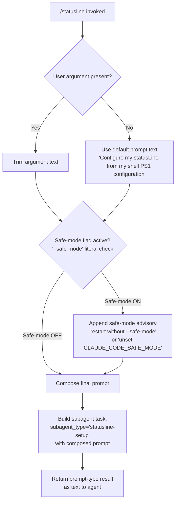

# `/statusline`

> Analysis basis: CC v2.1.170 bundle.js (AST extraction + Claude interpretation)
> Minimum version: v2.1.170

---

## Overview

`/statusline` is a **prompt-type** slash command that configures Claude Code's status line UI by dispatching a subagent task of type `"statusline-setup"`. When invoked, it reads the user's shell PS1 configuration and instructs a subagent to derive an appropriate status line representation from it. The command collects any user-supplied text argument, trims it, and incorporates it into the prompt sent to the subagent.

---

## Registration

| Field | Value |
|---|---|
| type | `prompt` |
| name | `statusline` |
| description | `Set up Claude Code's status line UI` |
| aliases | *(none)* |
| handler_method | `getPromptForCommand` |
| handler_method_start (byte) | `12892324` |
| handler_method_end (byte) | `12892945` |
| loc_byte | `12892019` |
| loc_byte_end | `12892946` |
| loc_line | `9139` |
| prompt_body.length | `76` characters |
| prompt_body.trace | `inline template` |
| prompt_body.text (citation fragment) | `"…subagent_type \"statusline-setup\"…"` |
| arbor_handler.name | `getPromptForCommand` |
| arbor_handler.kind | `Method` |
| arbor_handler.fqn | `claude-2.1.170::getPromptForCommand` |
| arbor_handler.resolution_path | `direct` |
| arbor_handler.n_hits | `1` |
| `handler_method_start` | `12892324` |
| `handler_method_end` | `12892945` |

Analysis basis: CC v2.1.170 bundle.js:+12892019

---

## Input Branching

The handler has two main branches based on whether a user-supplied argument string is present and whether safe-mode is active. This meets the 3+ branch threshold.



Analysis basis: CC v2.1.170 bundle.js:+12892324 (handler entry), +64341 (arg prefix `"--"` check), +64546 (`"--safe-mode"` literal), +12892772 (`.trim()` call), +12892782 (default prompt literal)

---

## Behavioral Spec

### 1. Argument Normalization (`argumentParser`)

The handler begins by calling an argument-parsing utility (resolved as `argumentParser`, bundle identifier `xK`) that:

1. Strips any leading `--` separator from the raw CLI argument string (literal `"--"`, bundle.js:+64341).
2. Validates the position index — if the index is `0` or less, the argument is treated as absent (literal `0`, bundle.js:+64393).
3. Delegates to a string-coercion helper (`stringCoercer`, bundle identifier `_6`) which ultimately calls `String(value)` (bundle.js:+27126) to guarantee a plain string output.
4. Returns the coercion result, or an empty/undefined value when no argument is provided.

```
function argumentParser(rawArg, position):
    if rawArg starts with "--":
        rawArg = rawArg after "--"
    if position <= 0:
        return undefined
    return stringCoercer(rawArg)

function stringCoercer(value):
    return String(value)
```

Analysis basis: CC v2.1.170 bundle.js:+12892356 (call to `xK`), +64341, +64393, +27126

### 2. Safe-Mode Detection (`safeModeChecker`)

After argument normalization, the handler interrogates the current environment via `safeModeChecker` (bundle identifier `QJ`, call site bundle.js:+12892631) to determine whether Claude Code is running under `--safe-mode`:

1. Checks for the `--safe-mode` flag string (literal, bundle.js:+64546).
2. If safe-mode is detected, prepares two remedy strings:
   - `"restart without --safe-mode"` (bundle.js:+64601)
   - `"unset CLAUDE_CODE_SAFE_MODE"` (bundle.js:+64631)
3. These are appended to the prompt body as contextual guidance to the agent/user.

```
function safeModeChecker(flags):
    if "--safe-mode" in flags:
        return {
            active: true,
            remediations: [
                "restart without --safe-mode",
                "unset CLAUDE_CODE_SAFE_MODE"
            ]
        }
    return { active: false }
```

Analysis basis: CC v2.1.170 bundle.js:+12892631, +64546, +64601, +64631

### 3. Prompt Composition (`getPromptForCommand`)

This is the primary handler method, resolved directly by Arbor as `getPromptForCommand` (bundle.js:+12892324–12892945).

Steps:

1. **Normalize user input**: Call `argumentParser` on any user-supplied argument. If the result is empty or absent, fall back to the hardcoded default string `"Configure my statusLine from my shell PS1 configuration"` (bundle.js:+12892782).
2. **Trim**: Apply `.trim()` to the resolved prompt text (call site bundle.js:+12892772) to remove leading/trailing whitespace.
3. **Safe-mode enrichment**: Invoke `safeModeChecker`. If safe-mode is active, append remediation guidance to the prompt.
4. **Construct subagent task**: Build a task object specifying `subagent_type: "statusline-setup"` and embed the trimmed, enriched prompt as the subagent's instruction payload.
5. **Return**: Return a `type: "text"` result (literal bundle.js:+12892374) wrapping the composed prompt for the agent runtime to dispatch.

```
function getPromptForCommand(userArg, appFlags):
    normalized = argumentParser(userArg, position=1)
    if normalized is empty:
        normalized = "Configure my statusLine from my shell PS1 configuration"
    promptText = normalized.trim()

    safeModeInfo = safeModeChecker(appFlags)
    if safeModeInfo.active:
        promptText += formatRemediations(safeModeInfo.remediations)

    subagentTask = {
        subagent_type: "statusline-setup",
        prompt: promptText
    }

    return { type: "text", content: buildPromptPayload(subagentTask) }
```

Analysis basis: CC v2.1.170 bundle.js:+12892324, +12892374, +12892631, +12892772, +12892782

### 4. Boolean Flag Helper (`booleanFlagNormalizer`)

The literals `"yes"` (bundle.js:+27175) and `"on"` (bundle.js:+27181) alongside numeric `1` (bundle.js:+27085) appear in the string-coercion utility (`_6` / `stringCoercer`). These suggest a normalizer that converts truthy string representations of boolean flags before string coercion:

```
function booleanFlagNormalizer(value):
    if value === 1 or value === "yes" or value === "on":
        return true
    return false
```

This is a shared utility also used by other commands; its presence here is incidental to the argument parser path.

Analysis basis: CC v2.1.170 bundle.js:+27085, +27175, +27181

### 5. Random Delay Utility (`randomDelayScheduler`)

Bundle identifier `H` is reachable at depth 2 from `__handler_statusline` (via `.trim()` call at bundle.js:+12892772). `H` references `Math.random` (bundle.js:+13939352) with a multiplier of `2` (bundle.js:+13939350) and calls `setTimeout` (bundle.js:+13939389). This suggests a shared jitter/retry scheduler utility not specific to `/statusline`. Its invocation in this path is likely incidental (shared utility pulled in through the trim call chain):

```
function randomDelayScheduler(callback, baseMs):
    jitter = Math.random() * 2
    setTimeout(callback, baseMs + jitter)
```

Analysis basis: CC v2.1.170 bundle.js:+13939350, +13939352, +13939389

<!-- TODO: deeper motivation of randomDelayScheduler in /statusline path not found in depth-2 traversal; needs --depth 4 -->

---

## State & Side Effects

| Item | Detail |
|---|---|
| Telemetry | *(none detected in depth-2 traversal)* |
| Hook registration | None observed |
| appState changes | None directly; delegates state mutation to the `"statusline-setup"` subagent |
| Safe-mode interaction | Reads `--safe-mode` / `CLAUDE_CODE_SAFE_MODE` flag; does not mutate it |
| Subagent dispatch | Creates a subagent task of type `"statusline-setup"` with the composed prompt |
| Sound | None observed |
| Return type | `"text"` (string literal, bundle.js:+12892374) |

---

## Version History

| Version | Change |
|---|---|
| v2.1.170 | Initial analysis |

---

## Common Mistakes

1. **Passing a raw `--` prefix in the argument**: The argument parser strips a leading `--` separator automatically. Manually wrapping the argument in `--` (e.g., `/statusline -- my config`) is harmless but redundant; the `--` is removed before the value reaches the subagent.
2. **Expecting direct UI changes**: `/statusline` does not directly manipulate any UI state. It creates a `"statusline-setup"` subagent that performs the configuration; if the subagent fails or is rejected, the status line will not update.
3. **Running under `--safe-mode` and expecting full functionality**: When `CLAUDE_CODE_SAFE_MODE` is set or Claude Code is started with `--safe-mode`, the prompt is enriched with remediation instructions but the command still dispatches. The operator must restart without safe-mode or unset the environment variable for full effect.
4. **Expecting the default prompt to reflect a custom PS1 automatically**: The default prompt text (`"Configure my statusLine from my shell PS1 configuration"`, bundle.js:+12892782) tells the agent to *read* the shell PS1; it does not hard-code any PS1 value. The agent must be able to inspect the shell environment at runtime.
5. **Assuming telemetry is emitted**: No `tengu_*` telemetry events were detected for this command in the depth-2 traversal. Do not rely on telemetry logs to confirm `/statusline` invocations.

---

## Appendix — Identifier Mapping

> For bundle debugging only. Identifiers change across versions.

| Identifier | Role |
|---|---|
| `__handler_statusline` | Synthetic BFS entry point for the `/statusline` command handler (not a real bundle symbol) |
| `xK` | Argument parser — strips `--` prefix, validates position, delegates to string coercer |
| `_6` | String coercion helper — wraps `String()` with boolean-flag normalization (`"yes"`, `"on"`, `1`) |
| `Yg6` | Shared utility called by both `xK` and `QJ`; exact role not resolved at depth 2 <!-- TODO: needs --depth 4 --> |
| `QJ` | Safe-mode checker — detects `--safe-mode` / `CLAUDE_CODE_SAFE_MODE` and returns remediation strings |
| `H` | Random delay scheduler — uses `Math.random() * 2` and `setTimeout`; shared utility, incidental to this command |

---

Note: index built via Arbor fallback; some signals (telemetry, literals) may be missing — see arbor-fallback.js.