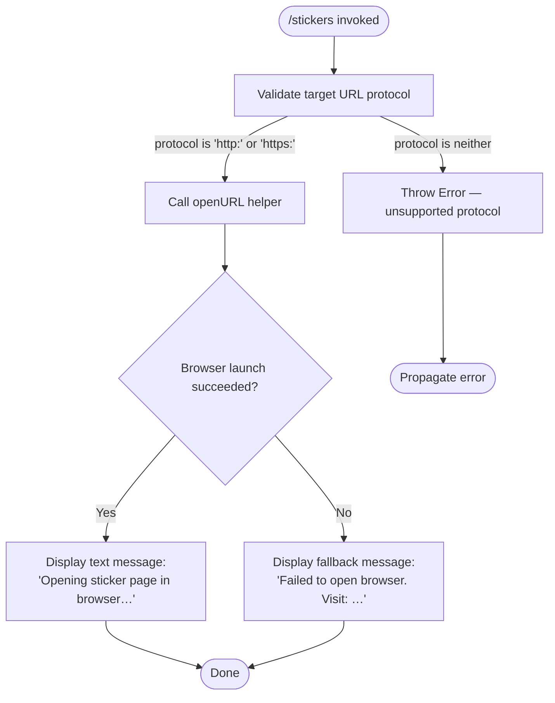

# `/stickers`

> Analysis basis: CC v2.1.178 bundle.js (AST extraction + Claude interpretation)
> Minimum version: v2.1.178

---

## Overview

`/stickers` is a local utility command that opens the Claude Code sticker ordering page (`https://www.stickermule.com/claudecode`) in the user's default system browser. When the browser cannot be launched automatically, it falls back to printing the URL so the user can navigate there manually. The command produces no agent interaction and carries no telemetry events.

---

## Registration

| Field | Value |
|---|---|
| type | `local` |
| name | `stickers` |
| description | `Order Claude Code stickers` |
| supportsNonInteractive | `false` |
| module_id | `s2K` |
| load_inline | `true` |
| loc_byte | `13032011` |
| loc_byte_end | `13032171` |
| loc_line | `9015` |
| arbor_handler.name | `Y95` |
| arbor_handler.fqn | `claude-2.1.178::Y95` |
| arbor_handler.kind | `AsyncFunction` |
| arbor_handler.resolution_path | `module_id` |
| arbor_handler.n_hits | `0` |

Analysis basis: CC v2.1.178 bundle.js:+13032011

---

## Input Branching

Three distinct execution paths exist: successful browser launch, browser launch failure (fallback to text output), and URL protocol validation error. A Mermaid flowchart is used accordingly.



Analysis basis: CC v2.1.178 bundle.js:+13031744, +6311128, +6311178, +6311200, +13031814, +13031885

---

## Behavioral Spec

### Handler Entry Point

The top-level handler is the `AsyncFunction` `Y95` (Arbor-resolved via `module_id → s2K`).

```
async function stickerCommandHandler(context):
    TARGET_URL = "https://www.stickermule.com/claudecode"
    await openURLInBrowser(TARGET_URL)
    return textResult("Opening sticker page in browser…")
```

Analysis basis: CC v2.1.178 bundle.js:+13031744, +13031747, +13031801, +13031814

### URL Protocol Validation

Before attempting to launch the browser, a protocol-guard function (`KV7`) checks that the URL scheme is either `"http:"` or `"https:"`. Any other scheme causes an `Error` to be thrown immediately.

```
function validateURLProtocol(url):
    scheme = extractProtocol(url)   // e.g. "https:"
    if scheme not in ["http:", "https:"]:
        throw Error("unsupported protocol")
    return url
```

Analysis basis: CC v2.1.178 bundle.js:+6311128, +6311178, +6311200

### Browser Launch (`openURL` helper — `Dg9`)

After validation, the `openURL` helper (`Dg9`) attempts to spawn the platform's browser-open command. On macOS (`"darwin"`), it executes the `"open"` shell command. The exit-code check uses `0` as the success sentinel.

```
async function openURL(url):
    protocol = validateURLProtocol(url)        // must be http/https
    platform = detectPlatform()                // e.g. "darwin"

    if platform == "darwin":
        command = "open"
    else:
        command = platformDefaultBrowserCommand(platform)

    exitCode = await spawnCommand(command, [url])

    if exitCode == 0:
        return SUCCESS
    else:
        return FAILURE
```

Analysis basis: CC v2.1.178 bundle.js:+6311749, +6311807, +6311832, +6311866, +6311885, +6311907

### Result Construction (`g8` / `Q_`)

After `openURL` returns, the handler builds a structured text result to display in the terminal. The result is typed as `"text"`. If the browser launch failed, the fallback text message contains the full URL so the user can copy it directly.

```
function buildTextResult(success):
    if success:
        message = "Opening sticker page in browser…"
    else:
        message = "Failed to open browser. Visit: https://www.stickermule.com/claudecode"

    return { type: "text", content: message }
```

Analysis basis: CC v2.1.178 bundle.js:+13031801, +13031814, +13031885

### Process Spawn Internals (`u6`)

The spawn wrapper (`u6`) used inside `openURL` caps concurrent child-process slots. Observable constants from the traversal:

- Concurrency pool size: **10** (bundle.js:+1131181)
- Size limit for spawned output buffer: **1,000,000 bytes** (bundle.js:+1131703)
- Success exit code sentinel: **1** (used in internal bookkeeping, bundle.js:+1131826)
- Error log level string: `"error"` (bundle.js:+1132130)

---

## State & Side Effects

| Item | Detail |
|---|---|
| Telemetry | None — `telemetry` array is empty for this command |
| Browser launch | Spawns an OS-level process (`open` on macOS) to open `https://www.stickermule.com/claudecode` |
| Terminal output (success) | Prints `"Opening sticker page in browser…"` (bundle.js:+13031814) |
| Terminal output (failure) | Prints `"Failed to open browser. Visit: https://www.stickermule.com/claudecode"` (bundle.js:+13031885) |
| Hook registration | None observed within depth-2 traversal |
| appState changes | None observed within depth-2 traversal |
| Sound | None observed within depth-2 traversal |
| supportsNonInteractive | `false` — command must not be called in non-interactive (CI/pipe) mode |

---

## Version History

| Version | Change |
|---|---|
| v2.1.178 | Initial analysis |

---

## Common Mistakes

1. **Running in non-interactive mode**: `supportsNonInteractive` is `false`. Invoking `/stickers` in a headless or piped session will be rejected by the CLI before the handler is reached.
2. **Expecting agent output**: `/stickers` is a `local` command — it never sends a prompt to the Claude model. No AI response will be generated.
3. **Assuming the browser always opens**: On systems where no browser-open command is available (e.g. minimal Linux containers), the handler will print the fallback URL instead of opening a browser. Users should copy the URL manually in that case.
4. **Using a non-HTTP(S) URL via internal extension**: The protocol guard rejects any URL whose scheme is not `"http:"` or `"https:"`. This is relevant only to developers patching the target URL constant.

---

## Appendix — Identifier Mapping

> For bundle debugging only. Identifiers change across versions.

| Identifier | Role |
|---|---|
| `Y95` | Top-level async handler for `/stickers` (Arbor-resolved entry point) |
| `h4` | URL-open orchestrator; calls protocol validation then `openURL` |
| `KV7` | Protocol validation guard (`http:`/`https:` allowlist, throws on mismatch) |
| `Dg9` | `openURL` implementation; detects platform and spawns browser-open command |
| `Iw` | Platform detection helper (reads `process.platform`) |
| `g8` | Result builder; wraps success/failure message into structured text output |
| `Q_` | Text result constructor; assembles `{ type: "text", content }` response object |
| `u6` | Bounded child-process spawn wrapper (pool size 10, buffer limit 1 000 000 bytes) |

---

Note: index built via Arbor fallback; some signals (telemetry, literals) may be missing — see arbor-fallback.js.