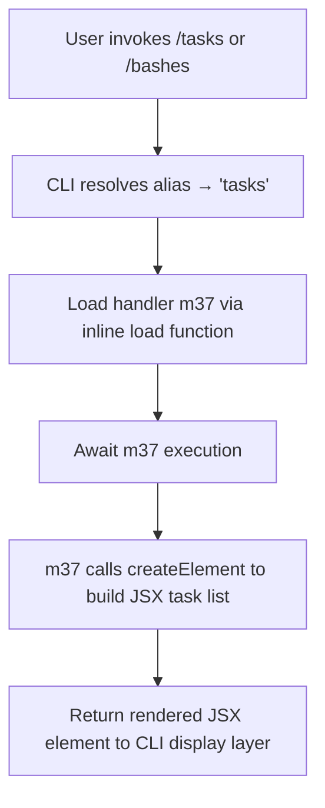

# `/tasks`

> Analysis basis: CC v2.1.132 bundle.js (AST extraction + Claude interpretation)
> Minimum version: v2.1.132

---

## Overview

The `/tasks` command (also reachable via the alias `/bashes`) lists and manages background tasks running within the current Claude Code session. It renders a JSX-based UI component rather than sending a text prompt to the agent, making it a purely local, display-oriented command that surfaces real-time task state to the user.

---

## Registration

| Field | Value |
|---|---|
| type | `local-jsx` |
| name | `tasks` |
| aliases | `bashes` |
| description | `List and manage background tasks` |
| module_id | `E7q` |
| load_inline | `true` |
| handler | `m37` (AsyncFunction, resolved via `module_id` path) |
| `loc_byte_end` | `11033483` |
| `arbor_handler.name` | `m37` |
| `arbor_handler.kind` | `AsyncFunction` |
| `arbor_handler.resolution_path` | `module_id` |
| `arbor_handler.fqn` | `claude-2.1.132::m37` |
| `arbor_handler.n_hits` | `0` |

Analysis basis: CC v2.1.132 bundle.js:+11033335–11033483

**Notes on registration shape:**
- `type: "local-jsx"` means the command's output is a rendered React/JSX element, not a streamed text response. The handler returns a component tree rather than invoking the model.
- `load_inline: true` means the handler was packaged inline into the registration object's `load` field as `load: () => Promise.resolve({ call: m37 })`. There is no separate lazy-loaded module chunk.
- The alias `bashes` is a legacy or convenience alias; both `/tasks` and `/bashes` invoke the same handler.

---

## Input Branching

Because the handler is `local-jsx` and the call graph (depth ≤ 2) shows a single edge from the handler directly into a JSX `createElement` call, there is no multi-branch input dispatch logic detected at this traversal depth. The command does not appear to accept subcommands or flags that alter its top-level control flow.



Analysis basis: CC v2.1.132 bundle.js:+11033208 (createElement call edge from m37)

---

## Behavioral Spec

### Handler Invocation

The handler `m37` is an `AsyncFunction` packaged inline into the command registration. When the command is invoked, the CLI runtime resolves the `load` promise, obtains the `call` reference to `m37`, and awaits it.

```
async function taskListHandler(context):
    element = createElement(TaskListComponent, context)
    return element
```

Analysis basis: CC v2.1.132 bundle.js:+11033208

### JSX Rendering Path

Rather than writing text output or invoking the language model, the handler constructs a JSX element via the framework's `createElement` call (the `vhA.createElement` edge in the call graph). The resulting element is handed back to the CLI's rendering layer, which displays it in the terminal UI.

```
function renderTasksView(props):
    // Build a component tree representing current background tasks
    root = createElement(TasksContainer, props)
    return root
```

Analysis basis: CC v2.1.132 bundle.js:+11033208

### Alias Resolution

The alias `bashes` is declared in the `aliases` array of the registration object. The CLI command resolver maps any invocation of `/bashes` to the `tasks` registration before handler dispatch, so both names are functionally identical.

```
function resolveCommandName(input):
    if input.name == "bashes":
        input.name = "tasks"
    handler = registry.lookup("tasks")
    return handler
```

Analysis basis: CC v2.1.132 bundle.js:+11033335

---

## State & Side Effects

| Item | Detail |
|---|---|
| Telemetry | None detected within depth-2 traversal (`telemetry: []`) |
| Model invocation | None — `local-jsx` type; no prompt sent to the model |
| Hook registration | <!-- TODO: not found in depth-2 traversal; needs --depth 4 --> |
| appState changes | <!-- TODO: not found in depth-2 traversal; needs --depth 4 --> |
| Sound | <!-- TODO: not found in depth-2 traversal; needs --depth 4 --> |
| Alias | `/bashes` resolves to `/tasks`; no separate state for alias |

---

## Version History

| Version | Change |
|---|---|
| v2.1.132 | Initial analysis; command registered as `local-jsx`, alias `bashes`, handler `m37` |

---

## Common Mistakes

1. **Expecting a model response**: Because `/tasks` is typed `local-jsx`, it never sends a prompt to Claude. Users who expect the assistant to narrate or summarize tasks will see only the UI component output.
2. **Using `/bashes` and expecting different behavior**: The alias `bashes` is fully equivalent to `tasks`. There is no legacy difference in behavior at this version.
3. **Assuming subcommand syntax**: No subcommands or flags were detected in the depth-2 traversal. Passing additional arguments (e.g., `/tasks stop <id>`) may be silently ignored or handled at a layer not visible in this analysis — do not assume argument parsing without deeper traversal confirmation.
4. **Telemetry assumptions**: No `tengu_*` telemetry events were found in the depth-2 traversal. Do not assume this command emits usage telemetry for analytics pipelines without a deeper analysis pass.

---

## Appendix — Identifier Mapping

> For bundle debugging only. Identifiers change across versions.

| Identifier | Role |
|---|---|
| `m37` | Primary async handler for the `/tasks` command; builds and returns the JSX task-list element (AsyncFunction, resolved via `module_id: E7q`) |
| `vhA` | JSX/React framework namespace; `vhA.createElement` is the call target used by `m37` to construct the rendered component tree |