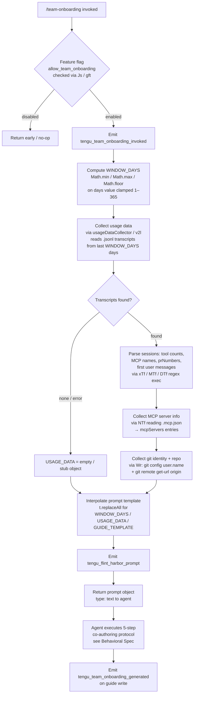

# `/team-onboarding`

> Analysis basis: CC v2.1.190 bundle.js (AST extraction + Claude interpretation)
> Minimum version: v2.1.190

---

## Overview

`/team-onboarding` scans the invoking user's local Claude Code session transcripts from the past configurable window of days, derives a work-type breakdown, and co-authors a team onboarding document (`ONBOARDING.md`) that a new teammate can paste into Claude Code for a guided, interactive ramp. The command is a `prompt`-type that injects usage statistics, session descriptors, and a guide template into a structured multi-step agent prompt; after an initial draft is produced, the agent iterates based on reviewer input before saving the final file.

---

## Registration

| Field | Value |
|---|---|
| type | `prompt` |
| name | `team-onboarding` |
| description | Help teammates ramp on Claude Code with a guide from your usage |
| isHidden | `false` |
| handler_method | `getPromptForCommand` |
| handler_method_start (loc_byte) | `13031120` |
| handler_method_end (loc_byte) | `13031830` |
| loc_byte | `13030757` |
| loc_byte_end | `13031831` |
| loc_line | `8971` |
| prompt_body.length | `4539` |
| prompt_body.trace | `identifier→l (local→1 ext vars)` |
| arbor_handler.name | `getPromptForCommand` |
| arbor_handler.kind | `Method` |
| arbor_handler.resolution_path | `direct` |
| arbor_handler.fqn | `claude-2.1.190::getPromptForCommand` |
| arbor_handler.n_hits | `2` |
| `handler_method_start` | `13031120` |
| `handler_method_end` | `13031830` |

Analysis basis: CC v2.1.190 bundle.js:+13030757

---

## Input Branching

The handler has more than three distinct execution paths — eligibility check, data-collection, template interpolation, prompt construction, and telemetry emission — so a Mermaid flowchart is used.



Analysis basis: CC v2.1.190 bundle.js:+13031120

---

## Behavioral Spec

The handler (`getPromptForCommand`, resolved via Arbor `direct` path at `claude-2.1.190::getPromptForCommand`) performs two major phases: **data collection** (executed synchronously in the handler before the prompt is returned) and **agent execution** (driven by the injected prompt after the agent receives control).

### Phase 1 — Window Computation

```
function computeWindow(rawDays):
    // Clamp raw day count to valid range
    days = Math.floor(Math.max(1, Math.min(365, rawDays)))
    windowStart = Date.now() - days * 24 * 60 * 60 * 1000
    return { days, windowStart }
```

The window is clamped between `1` and `365` days using `Math.min`, `Math.max`, and `Math.floor`.
Analysis basis: CC v2.1.190 bundle.js:+13031323 / +13031332 / +13031341 / +13031366 / +13031369

---

### Phase 2 — Usage Data Collection (`usageDataCollector` / `v2l`)

```
async function collectUsageData(windowStart):
    transcriptDir = resolveTranscriptDirectory()   // via s2 / aO path helpers
    files = await fs.readdir(transcriptDir)
    jsonlFiles = files.filter(f => extname(f) === ".jsonl")

    sessions = []
    for file in jsonlFiles:
        stat = await fs.stat(join(transcriptDir, file))
        if not stat.isFile():
            continue
        raw = await fs.readFile(join(transcriptDir, file))
        lines = raw.split("\n")

        // Extract session metadata
        toolCount      = countMatches(lines, toolUsePattern)        // xTf regex
        mcpNameMatches = extractMcpNames(lines, mcpPattern)         // "\"name\":\"mcp__"
        contentBlocks  = countMatches(lines, contentPattern)        // "\"content\":["
        prNumbers      = extractPrNumbers(lines, prPattern)         // MTf regex
        firstMessage   = extractFirstUserMessage(lines, msgPattern) // DTf regex

        if file represents session within window:
            sessions.push({
                title, toolCount, mcpNameMatches, prNumbers, firstMessage
            })

    return buildUsageObject(sessions)
```

Key constants observed:
- Transcript window default look-back: last **24** hours × **60** minutes × **60** seconds per unit; the configurable day constant spans `1`–`365` (Analysis basis: CC v2.1.190 bundle.js:+13019687 / +13019690 / +13031366 / +13031369).
- Files are filtered by `.jsonl` extension (Analysis basis: CC v2.1.190 bundle.js:+13019802).
- MCP tool calls are identified by the literal prefix `"name":"mcp__"` (Analysis basis: CC v2.1.190 bundle.js:+13020381).
- Content block count uses literal `"content":[` (Analysis basis: CC v2.1.190 bundle.js:+13020731).
- Session descriptor array is capped at **3** entries per session for first-message extraction (Analysis basis: CC v2.1.190 bundle.js:+13020834).

---

### Phase 3 — MCP Server Discovery (`mcpServerReader` / `NTf`)

```
async function readMcpServers(workspaceRoot):
    mcpConfigPath = join(workspaceRoot, ".mcp.json")
    raw = await fs.readFile(mcpConfigPath)
    parsed = JSON.parse(raw)                      // via Gt
    servers = parsed["mcpServers"] ?? {}
    result = []
    for name, config in Object.entries(servers):
        result.push({ name, urlOrigin: inferOrigin(config) })
    return result
```

The MCP config file is `.mcp.json` (Analysis basis: CC v2.1.190 bundle.js:+13021832). The key read is `mcpServers` (Analysis basis: CC v2.1.190 bundle.js:+13021888). Server `name` and optional `urlOrigin` are used by the agent to describe access instructions.

---

### Phase 4 — Git Identity & Repo Collection (`gitInfoReader` / `Wr`)

```
async function collectGitInfo():
    userName = await spawnGit(["config", "user.name"])   // "git", "config", "user.name"
    repoUrl  = await spawnGit(["remote", "get-url", "origin"])
    return { generatedBy: userName.trim(), currentRepo: repoUrl.trim() }
```

Exact sub-command strings observed: `"git"`, `"config"`, `"user.name"`, `"remote"`, `"get-url"`, `"origin"` (Analysis basis: CC v2.1.190 bundle.js:+13022455 / +13022462 / +13022471 / +13022527 / +13022536 / +13022546). Git output is parsed by `V1e`, which trims, lowercases, and handles `git/`-prefixed remote URLs (Analysis basis: CC v2.1.190 bundle.js:+13022635).

---

### Phase 5 — Template Interpolation & Prompt Assembly

```
function buildPrompt(days, usageData, guideTemplate):
    base = PROMPT_BODY_TEMPLATE   // 4539-char constant referencing {{...}} tokens
    result = base
        .replaceAll("{{WINDOW_DAYS}}", String(days))
        .replaceAll("{{USAGE_DATA}}", JSON.stringify(usageData))
        .replaceAll("{{GUIDE_TEMPLATE}}", guideTemplate)
    return { type: "text", content: result }
```

Three template tokens are substituted: `{{WINDOW_DAYS}}`, `{{USAGE_DATA}}`, and `{{GUIDE_TEMPLATE}}` (Analysis basis: CC v2.1.190 bundle.js:+13031580 / +13031655 / +13031620). The return value carries `type: "text"` (Analysis basis: CC v2.1.190 bundle.js:+13031814).

---

### Phase 6 — Agent Execution Protocol (driven by injected prompt)

The 4,539-character prompt instructs the agent to execute the following co-authoring protocol (grounded in prompt body, not quoted verbatim):

```
procedure agentCoAuthorGuide(usageData, windowDays, guideTemplate):

    // Step 1 — Immediate acknowledgment (must be first visible output)
    print acknowledgment line referencing windowDays
    // No classification, no tool calls, no thinking before this line

    // Step 2 — Work-type breakdown
    for session in usageData.sessionDescriptors:
        classify session into one of:
            build_feature | debug_fix | improve_quality |
            analyze_data | plan_design | prototype | write_docs
        // Use title, prNumbers, firstUserMessage as signal
        // Fallback to tool/MCP counts if messages are uninformative
    select top 3-5 categories with rough percentages
    // Display as title-case with spaces in rendered guide

    // Step 3 — Gather remaining context
    repos   = [currentRepo] + sibling directories in workspace
    mcpInfo = usageData.mcpServers   // name + urlOrigin per server
    // Leave Team Tips and Get Started as TODO placeholders

    // Step 4 — Write draft to ONBOARDING.md
    guide = renderGuide(
        workTypeBreakdown,
        repos,
        mcpInfo,
        generatedBy = usageData.generatedBy ?? omit,
        asciiBarCharts using "█" (filled) and "░" (empty), 20 chars wide
    )
    writeFile("ONBOARDING.md", guide)

    // Step 5 — Render guide in code block + ask review questions
    print guide inside fenced code block
    print "---" horizontal rule
    print "**Review**" heading
    ask three numbered review questions:
        1. Confirm or request team name
        2. Request optional starter task (ticket / doc link)
        3. Request team tips not already in CLAUDE.md

    // After user responds:
    update ONBOARDING.md with team name, tips, starter task
    print exact closing line referencing ONBOARDING.md save confirmation
    // Apply any further edits on request
```

Analysis basis: CC v2.1.190 bundle.js:+13031120 (handler body); prompt body length 4539 chars at +13030757.

---

### Feature-Flag Gate (`allow_team_onboarding`)

The handler checks the literal `"allow_team_onboarding"` before allowing the command to proceed. This flag is evaluated via `gft` → `Js`, which consults capability/feature-flag state (Analysis basis: CC v2.1.190 bundle.js:+10177120). If the flag is absent or false the command short-circuits without emitting the main telemetry events.

---

## State & Side Effects

| Item | Detail |
|---|---|
| Telemetry: `tengu_flint_harbor_prompt` | Emitted when the prompt is assembled and returned to the agent (bundle.js:+13031157) |
| Telemetry: `tengu_team_onboarding_invoked` | Emitted at handler entry after eligibility check passes (bundle.js:+13031380) |
| Telemetry: `tengu_team_onboarding_generated` | Emitted after the agent writes `ONBOARDING.md` (bundle.js:+13031699) |
| Telemetry: `tengu_flint_harbor_share` | Emitted via `gft` path when guide sharing is triggered (bundle.js:+10177182) |
| Telemetry: `tengu_config_lock_contention` | Emitted if config file lock is contested during data collection (bundle.js:+13752011) |
| Telemetry: `tengu_config_stale_write` | Emitted if a stale config write is detected (bundle.js:+13752147) |
| Telemetry: `tengu_config_parse_error` | Emitted on config JSON parse failure (bundle.js:+13754586) |
| Telemetry: `tengu_config_auth_loss_prevented` | Emitted when a write that would wipe auth is refused (bundle.js:+13752490) |
| Telemetry: `tengu_config_fallback_write` | Emitted when config falls back to alternate write path (bundle.js:+13751627) |
| File write | `ONBOARDING.md` written to the current working directory by the agent |
| File reads | `.jsonl` transcript files under the Claude Code transcripts directory; `.mcp.json` in workspace root |
| Git subprocess | `git config user.name` and `git remote get-url origin` spawned via child-process utility (`Wr` / `B1e`) |
| appState changes | Feature-flag map consulted via `Js` / `gft`; no persistent appState mutation observed at depth ≤ 2 |
| Sound | None observed in depth-2 traversal |
| Config lock | `GQn` acquires a filesystem lock on the config file; contention logged via `tengu_config_lock_contention` |
| Auth-loss guard | Handler refuses to overwrite config if the re-read copy is missing auth present in cache (literal: "saveConfigWithLock: re-read config is missing auth…") |

---

## Version History

| Version | Change |
|---|---|
| v2.1.190 | Initial analysis |

---

## Common Mistakes

1. **Invoking the command without the `allow_team_onboarding` feature flag enabled.** The handler gates on this capability string; if your account tier or organization policy does not include it the command silently returns without producing a guide.

2. **Running `/team-onboarding` from a directory that has no `.jsonl` transcript files.** The usage-data collector reads transcripts from the Claude Code transcripts directory; if no sessions exist in the configured window (clamped `1`–`365` days) the agent will receive an empty `USAGE_DATA` object and leave the work-type breakdown as a TODO placeholder.

3. **Expecting the guide to be complete on the first turn.** The command deliberately defers the Team Tips and Get Started sections to a review round. The first turn always produces a draft with those sections marked as TODO; users must answer the three review questions before the file is finalized.

4. **Editing `ONBOARDING.md` manually before the agent's closing save confirmation.** The agent issues a final `writeFile` call after the review round. Any manual edits made before that call may be overwritten.

5. **Assuming the team name is auto-detected.** The agent attempts to infer the team name from the usage data, but will ask for confirmation (or explicitly request it) in the Review section. Providing a clear team name in response to review question 1 is the reliable path.

6. **Window size confusion.** The `WINDOW_DAYS` value is clamped between `1` and `365` by the handler; supplying a value outside that range will be silently clamped rather than rejected.

---

## Appendix — Identifier Mapping

> For bundle debugging only. Identifiers change across versions.

| Identifier | Role |
|---|---|
| `__handler_team-onboarding` | Synthetic BFS entry point for the command handler; real handler is `getPromptForCommand` |
| `it` | Prompt-dispatch / runner function that routes prompt-type commands to the agent |
| `txt` | Text-content extractor helper used within the prompt runner |
| `nxt` | Next-item iterator used within the prompt runner |
| `V9` | Intermediate step in the prompt-dispatch pipeline |
| `q9` | Sub-step in the prompt-dispatch chain, calls `M2` |
| `M2` | Prompt assembly stage; calls `Hid`, `zH`, `L1e` |
| `gSn` | Session/conversation cache lookup helper |
| `lBr` | Conversation-creation helper; generates UUID, emits `GrowthbookExperimentEvent` |
| `m$e` | Helper called by `lBr`; invokes `xw` |
| `yW` | Random-bytes / token-generation helper (32-byte hex) |
| `Me` | JSON serialisation wrapper (`JSON.stringify`) |
| `had` | Post-creation hook called by `lBr` |
| `mBr` | Message-building / turn-construction helper |
| `fli` | File-lock helper used by `mBr` |
| `Ur` | Utility called by `mBr`; delegates to `PG` |
| `REi` | Secondary helper within `mBr` |
| `J$` | Deduplication set check (`dtu.has`) within `mBr` |
| `eh` | Error-handler helper inside `mBr` |
| `Dt` | Core message-write / persistence function; calls `Wt`, `n0`, `OOo`, `SEe`, `Date.now`, `BRf` |
| `W` | General-purpose utility (string/path operations) used throughout |
| `hn` | Usage-data collector (high-level); reads transcripts and config |
| `GQn` | Config file writer with lock; manages backup rotation and atomic rename |
| `Wt` | Filesystem path resolver / working-directory helper |
| `SWs` | Stats object builder; calls `YRr`, `Object.assign` |
| `YRr` | Sub-helper of `SWs`; calls `EWs` |
| `T` | File-write helper with debug logging and size tracking |
| `nLc` | File-write sub-helper; calls `QP`, `Mcr`, `w6o` |
| `wc` | Path-normalization / redaction helper; replaces sensitive path segments with `[REDACTED]` |
| `hze` | Encoding helper; calls `e8o` |
| `iLc` | Buffered file-write helper with byte-length check and flush |
| `SEe` | Config-read helper; reads UTF-8 JSON, manages backups |
| `Gt` | JSON parse wrapper (`JSON.parse`) |
| `u9` | String-prefix stripper helper |
| `bGl` | Backup-directory scanner; lists files under `backups/` subdirectory |
| `$Oo` | Path join helper with `or` fallback |
| `f` | Background-session / daemon-worker controller |
| `PHt` | Config-field validator / presence checker |
| `n` | Lowercase normaliser (`i.toLowerCase`) |
| `I` | Scroll / viewport calculation helper |
| `x` | Write-with-supervisor-yield helper |
| `A` | Viewport-clamp helper (`Math.max`, `Math.min`) |
| `H` | IPC / stdio buffer handler; processes daemon message frames |
| `g` | Timeout-with-abort helper |
| `m` | Worker-kill manager |
| `mp` | Stream-end / finalise helper |
| `RJf` | Daemon protocol message router (handles ping, nudge, yield, lease, dispatch, attach, kill, resize, etc.) |
| `be` | String coercion helper (`String`) |
| `sIt` | Atomic file-write helper with symlink resolution, temp-file staging, fsync, and rename |
| `Nd` | Realpath resolver with `realpathSync` |
| `u` | Process / signal helper |
| `kn` | Error-code normaliser (`cn`) |
| `T7e` | `fsync` error-code filter (`EINVAL`, `ENOTSUP`, `EPERM`, `ENOSYS`) |
| `CDe` | Context / environment descriptor builder |
| `NOo` | Object-entries iterator used in usage aggregation |
| `DKt` | Timestamp helper (`Date.now`) |
| `BQn` | Project-config writer (per-project settings persistence) |
| `Pe` | Promise error-normaliser; calls `aKe` |
| `aKe` | Error constructor helper |
| `UTf` | Top-level usage-data assembly function; calls `gr`, `s2`, `v2l`, `NTf`, `OTf`, `Wr`, `Me`, `V1e` |
| `gr` | Formatting / layout helper; calls `VL` |
| `VL` | Low-level layout primitive |
| `s2` | Transcript-directory path builder; calls `aO`, `NE` |
| `aO` | Base path joiner (`PK.join`, `or`) |
| `NE` | Path normaliser; calls `e.replace`, `t.slice`, `qou` |
| `qou` | Absolute-value / length helper (`Math.abs`, `GAe`) |
| `v2l` | Async transcript file reader and session parser; reads `.jsonl`, applies `xTf` / `MTf` / `DTf` regexes |
| `Xo` | Error-catch / null-return helper (`cn`) |
| `o` | Array map + pad helper (`s.map`, `i.padEnd`) |
| `c` | File-stat wrapper |
| `En` | Process / stream helper |
| `l` | Line-reader / JSONL record runner |
| `rUl` | Session-record processor; calls `AQ`, `Xs`, `nVt`, `Me` |
| `p` | Process-exit / abort helper |
| `jb` | Abort-signal helper |
| `NTf` | `.mcp.json` reader and MCP server entry parser |
| `OTf` | Optional supplemental data collector (depth-2 target; body not traversed) |
| `Wr` | Git subprocess runner; collects `user.name` and `remote get-url origin` |
| `B1e` | Child-process spawn wrapper with stdio, timeout, and kill helpers |
| `lis` | Spawn-argument builder; handles Windows `.exe`/`cmd` wrapping |
| `Hyr` | Promise queue resolver (`Qss`) |
| `_yr` | Promise queue rejecter (`Qss`, `viu`) |
| `Eyr` | Promise-settle helper (`kiu`) |
| `gss` | Input validator (`Number.isFinite`, `TypeError`) |
| `aIt` | Spawn-options normaliser; calls `Ksu`, `Error`, `Boolean` |
| `gyr` | Reflect-apply / defineProperty helper |
| `Kss` | Event-listener attachment helper (`e.on`) |
| `hss` | Timeout-race helper (`Promise.race`, `clearTimeout`) |
| `Hss` | Process-kill-on-timeout helper (`e.kill`, `r.finally`) |
| `fss` | stdout data handler |
| `mss` | stderr / kill handler |
| `qss` | Resolve-all + settle helper (`Promise.all`) |
| `dIt` | Subprocess result extractor (`X_r`) |
| `Gss` | Pipe / stream setup helper |
| `Wss` | Writable-stream creator (`Fss.default`) |
| `Sss` | Stream-data binder (`iyr.bind`) |
| `Oiu` | String coercion helper |
| `sp` | Sub-process option helper |
| `Piu` | Process-option normaliser (`cn`) |
| `ke` | Error-formatter and logger; calls `fo`, `nt`, `Vi`, `oou`, `f7e.push`, `YJ.logError` |
| `fo` | Error/string coercion (`Error`, `String`) |
| `nt` | String coercion (`String`) |
| `Vi` | Error categoriser; calls `Jns` |
| `oou` | Rolling-buffer manager (`vrn.shift`, `vrn.push`) |
| `V1e` | Git output parser; trims, matches, handles `git/` prefix, lowercases |
| `pau` | URL/host parser; calls `fi` |
| `fi` | String index-and-slice helper |
| `gft` | Feature-flag / capability gate; checks `allow_team_onboarding` via `Js` |
| `Js` | Capability-set lookup; checks `Wad`, `qad`, `K9`, `Vi`, `Rme`, `Jz` |
| `sSi` | Capability entry builder; calls `Jz` |
| `Jz` | Capability descriptor constructor; calls `K9`, `uxt`, `Wme` |
| `K9` | Auth-context constructor; calls `cxt` |
| `cxt` | Auth-type classifier; returns `third_party_provider`, `custom_base_url`, `no_auth`, etc. |
| `Rme` | Capability name normaliser; calls `nt` |
| `pA` | Secondary capability check; calls `Gs` |

---

Note: index built via Arbor fallback; some signals (telemetry, literals) may be missing — see arbor-fallback.js.