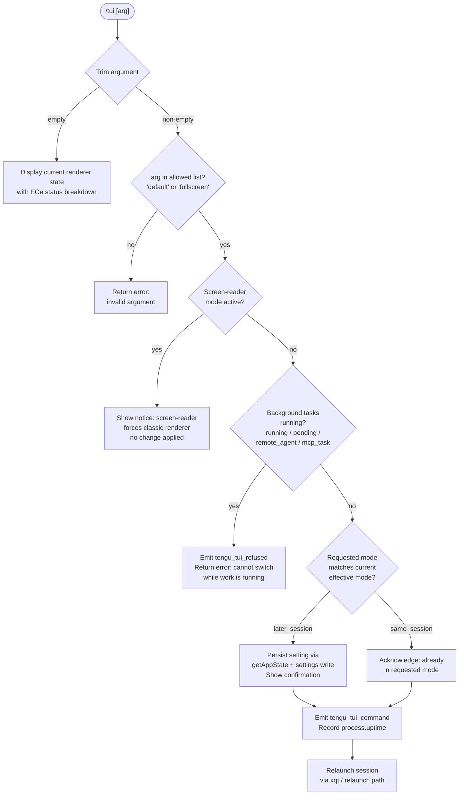

# `/tui`

> Analysis basis: CC v2.1.190 bundle.js (AST extraction + Claude interpretation)
> Minimum version: v2.1.190

---

## Overview

The `/tui` command allows the user to inspect and switch the terminal UI renderer between `default` and `fullscreen` modes within an active Claude Code session. It performs a series of eligibility checks (screen-reader state, active background tasks, environment overrides, and terminal compatibility) before applying the requested mode, and then relaunches the current session under the new renderer configuration.

---

## Registration

| Field | Value |
|---|---|
| type | `local-jsx` |
| name | `tui` |
| description | `Set the terminal UI renderer (default \| fullscreen)` |
| argumentHint | `[default\|fullscreen]` |
| module_id | `FRl` |
| load_inline | `true` |
| loc_byte | `12439445` |
| loc_byte_end | `12439627` |
| loc_line | `8448` |
| arbor_handler.name | `ahf` |
| arbor_handler.fqn | `claude-2.1.190::ahf` |
| arbor_handler.kind | `AsyncFunction` |
| arbor_handler.resolution_path | `module_id` |
| arbor_handler.n_hits | `0` |

Analysis basis: CC v2.1.190 bundle.js:+12439445

---

## Input Branching

The command has more than three distinct input-processing branches: no argument (display current state), `default`, `fullscreen`, invalid value, screen-reader mode active, background tasks in flight, and environment-variable overrides. A flowchart is used.



---

## Behavioral Spec

### Handler Entry — `ahf` (AsyncFunction)

Analysis basis: CC v2.1.190 bundle.js:+12437064 (handler start)

```
async function tuiCommandHandler(context, argument):
    trimmedArg = argument.trim()

    // Resolve current TUI eligibility state
    tuiState = resolveFullscreenEligibility()   // ECe
    appState = getAppState()                    // Or / Kh

    // No argument: display current state
    if trimmedArg == "":
        return renderCurrentTuiStatus(tuiState, appState)

    // Validate argument
    allowedValues = ["default", "fullscreen"]   // Y0o
    if trimmedArg not in allowedValues:
        return renderError("invalid argument — use 'default' or 'fullscreen'")

    // Screen-reader guard
    if isScreenReaderMode(appState):            // mx
        return renderNotice(
            "Screen-reader mode always uses the classic renderer, " +
            "so the tui setting has no effect while it is active."
        )
        // literal loc_byte: 12437584

    // Background-work guard
    activeTasks = collectActiveBackgroundTasks(appState)
    // task states examined: "running", "pending", "remote_agent", "mcp_task"
    // literal loc_bytes: 12437920, 12437942, 12437963, 12437988
    if activeTasks is not empty:
        emit("tengu_tui_refused")               // loc_byte: 12438009
        return renderError(
            "Cannot switch renderers while work is running in the " +
            "background — wait for it to finish (or stop it via /tasks), " +
            "then run /tui again."
        )
        // literal loc_byte: 12438050

    // Determine whether change takes effect immediately or next session
    changeScope = compareRequestedVsEffective(trimmedArg, tuiState)
    // returns "same_session" or "later_session"
    // literal loc_bytes: 12438928, 12438943

    // Persist setting
    persistTuiSetting(trimmedArg, appState)     // ao settings write path

    // Telemetry
    emit("tengu_tui_command", {
        requestedMode: trimmedArg,
        changeScope: changeScope,
        uptime: Math.round(process.uptime())    // loc_byte: 12438584
    })
    // telemetry loc_byte: 12438482

    // Render confirmation JSX
    return Qq.jsx(tuiConfirmationComponent, {
        mode: trimmedArg,
        scope: changeScope
    })
    // loc_byte: 12438865
```

Analysis basis: CC v2.1.190 bundle.js:+12437089

---

### Fullscreen Eligibility Resolution — `ECe`

The eligibility resolver (`ECe`) computes the effective fullscreen state from multiple overlapping signals and is also called when displaying current status with no argument.

Analysis basis: CC v2.1.190 bundle.js:+3556806

```
function resolveFullscreenEligibility():
    result = {}

    // Background sessions always use fullscreen
    if isBackgroundSession():                   // mx
        result.reason = "bg_forced_on"         // loc_byte: 3556788
        return result

    // Screen-reader auto-disable
    if isScreenReaderActive():                  // p9r
        result.reason = "sr_auto_off"          // loc_byte: 3556817
        return result

    // Environment variable: CLAUDE_CODE_NO_FLICKER or
    // CLAUDE_CODE_DISABLE_ALTERNATE_SCREEN disables fullscreen
    if envDisablesFullscreen():                 // mZ
        result.reason = "env_off"              // loc_byte: 3556846
        return result

    // Environment variable: explicit force-on
    if envForcesFullscreen():
        result.reason = "env_on"              // loc_byte: 3556896
        return result

    // tmux -CC (iTerm2 native integration) detected → auto-off
    if isTmuxCCMode():                         // d9r
        result.reason = "tmux_cc_auto_off"    // loc_byte: 3556920
        return result

    // Windows over SSH (ConPTY) detected → auto-off
    if isWindowsOverSSH():
        result.reason = "win_ssh_auto_off"    // loc_byte: 3556954
        return result

    // User/project settings explicit on
    if settingsEnableFullscreen():             // Ur
        result.reason = "settings_on"         // loc_byte: 3557013
        return result

    // User/project settings explicit off
    if settingsDisableFullscreen():
        result.reason = "settings_off"        // loc_byte: 3557047
        return result

    // Gatekeeping downsell path
    if downsellActive():                       // it
        result.reason = "downsell_on"         // loc_byte: 3557120
        return result

    // Feature-flag gate
    if featureFlagOn():
        result.reason = "gb_on"              // loc_byte: 3557185
    else:
        result.reason = "gb_off"             // loc_byte: 3557193

    return result
```

Analysis basis: CC v2.1.190 bundle.js:+3556806

---

### Relaunch Path — `xqt` / `jMe`

When a setting change is confirmed and the new mode takes effect in the same session, the command triggers a supervised relaunch.

Analysis basis: CC v2.1.190 bundle.js:+12434429

```
function supervisedRelaunch(context):
    // Determine config path
    configDir = resolveConfigDirectory()            // IF → Xae / B2n
    // Path pattern: homedir / .local / share / claude / versions / bin
    // literal loc_bytes: 7046863, 7046872, 8529801, 8529810, 7046943

    // Tear down current render loop
    stopScrollSummaryInterval()                     // jFt → Qto (clearInterval)
    tearDownInkRenderer()                           // G9e → e.unmount
    flushTerminalOutput()                           // ETn → xZ.writeSync
    // Terminal state restore via ESC-7 / ESC-8 sequences
    // literal loc_bytes: 3899577, 3899588

    // Start new render cycle
    startNewRenderCycle()                           // oPn → wga

    // Wait for analytics flush (timeout: 30 000 ms)
    await withTimeout(flushAnalytics(), 30000)      // Dc + literal loc_byte: 12432563
    // "flush timeout (relaunch)"                  // literal loc_byte: 12432569

    // Register signal handlers
    registerSignalHandlers()                        // HC → Rc → Ei

    // Drain event queue (timeout: 2 000 ms)
    await drainWithTimeout(qKe, 2000)              // loc_byte: 12432620
    // "cleanup timeout"                           // literal loc_byte: 12432625

    // Flush analytics again (timeout per "analytics flush timeout")
    await analyticsFlushAsync(q9e)                 // loc_byte: 12432670

    // Build relaunch argv and exec
    newArgv = buildRelaunchArgv(context)            // xRl + "--resume" flag
    // "--resume" literal loc_byte: 12432496
    process.removeAllListeners()
    process.on(...)
    execve(newArgv)                                 // DRl.spawnSync → process.exit
```

Analysis basis: CC v2.1.190 bundle.js:+12434429

---

### Environment-Variable Check — `NIe`

The environment check helper evaluates three variables that affect fullscreen behaviour. These are inspected at startup and again inside the handler.

Analysis basis: CC v2.1.190 bundle.js:+12434509

```
function checkTuiEnvironmentVariables():
    // Disables flicker-related fullscreen paths
    noFlicker = process.env["CLAUDE_CODE_NO_FLICKER"]
    // literal loc_byte: 12434525

    // Disables alternate-screen buffer entirely
    disableAlt = process.env["CLAUDE_CODE_DISABLE_ALTERNATE_SCREEN"]
    // literal loc_byte: 12434550

    // Forces the fullscreen upsell prompt to appear
    forceUpsell = process.env["CLAUDE_CODE_FORCE_FULLSCREEN_UPSELL"]
    // literal loc_byte: 12434589

    return { noFlicker, disableAlt, forceUpsell }
```

Analysis basis: CC v2.1.190 bundle.js:+12434509

---

### Terminal Capability Detection — `JO`

Before applying fullscreen the implementation probes terminal identity.

Analysis basis: CC v2.1.190 bundle.js:+12438349

```
function detectTerminalCapabilities():
    // Probe active terminal emulator string
    termId = readTerminalIdEnv()                    // sMt / A_

    // JetBrains IDE terminal guard
    if YO.isJetBrainsIdeTerminal():
        return { fullscreenSupported: false, reason: "jetbrains" }

    // Terminal version string matching:
    // "cursor"    loc_byte: 3627182
    // "vscode"    loc_byte: 3627231
    // "xterm.js"  loc_byte: 3627351
    // Version range check: 1092000 – 1105000  loc_bytes: 3627307, 3627318

    // Platform check
    // "darwin" loc_byte: 3626715
    // "win32"  loc_byte: 3626762

    // Compute max pixel density via hhd
    density = computePixelDensity()                 // hhd → parseFloat, Math.min
    // max capped at 20  loc_byte: 3627689

    return { fullscreenSupported, density, termId }
```

Analysis basis: CC v2.1.190 bundle.js:+12438349

---

### Background-Session Notice

When the user runs `/tui` inside a background session (daemon worker context), a static informational notice is appended:

> "Background sessions always use the fullscreen renderer so scrolling and mouse work when attached. The tui setting applies to sessions started directly with `claude`."

Literal loc_byte: 12437374

Analysis basis: CC v2.1.190 bundle.js:+12437374

---

### Settings Persistence — `ao`

The final confirmed setting is written through the standard multi-layer settings stack (`ao` → `Jm` → `l2` → `ZEr` → `DG`). The relevant key is the `theme` / renderer preference stored under user settings (`userSettings` → `settings.json`, literal loc_byte: 1317054).

Analysis basis: CC v2.1.190 bundle.js:+12438238

---

## State & Side Effects

| Item | Detail |
|---|---|
| Telemetry: `tengu_tui_command` | Fired on every accepted mode change; carries requested mode, change scope (`same_session`/`later_session`), and `Math.round(process.uptime())`. loc_byte: 12438482 |
| Telemetry: `tengu_tui_refused` | Fired when the command is rejected due to active background tasks. loc_byte: 12438009 |
| Telemetry: `tengu_amber_creek` | Fired inside fullscreen eligibility helper (`ECe`) path. loc_byte: 3556463 |
| Telemetry: `tengu_pewter_brook` | Fired inside fullscreen eligibility helper (`ECe`) path. loc_byte: 3556371 |
| Telemetry: `tengu_scroll_summary` | Fired by scroll-summary interval teardown (`oPn`). loc_byte: 7231933 |
| Settings write | Persists renderer preference to `settings.json` (or `settings.local.json`) via the `ao` settings writer. |
| Session relaunch | When `same_session` scope: tears down the Ink renderer, flushes analytics (timeout 30 000 ms), drains events (timeout 2 000 ms), then `execve`-relaunches with `--resume`. |
| Terminal state restore | ESC-7 / ESC-8 ANSI sequences are written during tear-down to restore terminal cursor/screen state. |
| Environment variables read | `CLAUDE_CODE_NO_FLICKER`, `CLAUDE_CODE_DISABLE_ALTERNATE_SCREEN`, `CLAUDE_CODE_FORCE_FULLSCREEN_UPSELL` |
| appState changes | `getAppState()` is read; setting write updates the renderer preference field. |
| Sound | None found in depth-2 traversal. |

---

## Version History

| Version | Change |
|---|---|
| v2.1.190 | Initial analysis |

---

## Common Mistakes

1. **Running `/tui fullscreen` while background tasks are active** — The command refuses with a clear error. Stop or wait for all background tasks (`/tasks`) before switching renderers.
2. **Expecting the change to take immediate visual effect in all cases** — When `later_session` scope is returned, the new renderer activates on the next `claude` invocation, not within the current session.
3. **Setting `CLAUDE_CODE_NO_FLICKER` and then wondering why `/tui fullscreen` has no effect** — Environment variables take precedence over the `/tui` setting (reason code `env_off`). Unset the variable first.
4. **Running `/tui` in a background/daemon session** — Background sessions always use the fullscreen renderer regardless of the `/tui` setting. The command displays a notice but cannot change background-session behaviour.
5. **Screen-reader mode conflict** — When screen-reader mode is active (`sr_auto_off` reason), the classic renderer is always used; `/tui fullscreen` silently has no effect until screen-reader mode is disabled.

---

## Appendix — Identifier Mapping

> For bundle debugging only. Identifiers change across versions.

| Identifier | Role |
|---|---|
| `ahf` | Primary `/tui` command handler (AsyncFunction) |
| `xqt` | Relaunch orchestrator — top-level supervisor entry |
| `jMe` | Core relaunch sequence (teardown → flush → exec) |
| `IF` | Config/binary directory resolver |
| `B2n` | Versioned binary path builder (local install path) |
| `Xae` | System-wide binary path builder |
| `qMn` | Home directory path helper |
| `Oee` | Alternative path builder variant |
| `Im` | Array check helper inside path building |
| `jFt` | Scroll-summary interval stopper |
| `Qto` | Interval clear wrapper (`clearInterval`) |
| `G9e` | Ink renderer tear-down helper |
| `ETn` | Terminal output flush / screen-state restore |
| `n2e` | Terminal compatibility prober (ghostty/iTerm version check) |
| `Nw` | tmux / screen multiplexer escape-sequence handler |
| `oPn` | New render cycle starter |
| `wga` | Render frame timing helper (`Date.now`, `Math.max`, `Math.round`) |
| `bs` | Fullscreen eligibility combined resolver (called by handler) |
| `ECe` | Fullscreen eligibility status display helper |
| `mx` | Screen-reader mode check |
| `p9r` | Screen-reader active path helper |
| `mZ` | Environment-variable disable-fullscreen checker |
| `d9r` | tmux-CC / Windows-SSH auto-disable checker |
| `Ur` | Settings-based fullscreen enable/disable reader |
| `it` | Feature-flag / gatekeeping evaluator |
| `edd` | Downsell eligibility helper |
| `Dc` | Timeout-with-race helper (`setTimeout` / `Promise.race` / `clearTimeout`) |
| `HC` | Signal handler registration dispatcher |
| `Rc` | Signal handler setup wrapper |
| `Ei` | Signal handler registrar (`C6o.register`) |
| `qKe` | Event-queue drain helper (`C6o.drain`) |
| `q9e` | Analytics flush async helper |
| `NIe` | Environment-variable TUI flag reader |
| `eYn` | Argv builder for relaunch (adds `--resume`, `--add-dir`, etc.) |
| `KPe` | CLI arg source classifier (`cliArg`, `session`) |
| `oCe` | Argv entry constructor |
| `Or` | App-state reader for session context (working_directory, tools, etc.) |
| `Kh` | App-state reader for effort/model/flag_settings |
| `Ws` | Daemon-worker context checker |
| `JO` | Terminal capability / emulator identity detector |
| `sMt` | Terminal ID env reader |
| `A_` | Terminal string matcher |
| `i4r` | Terminal version range evaluator |
| `mhd` | Terminal version string parser |
| `R_` | Terminal platform branch dispatcher |
| `hhd` | Pixel density / font metric calculator |
| `a4r` | Font size raw reader |
| `xRl` | execve / relaunch exec helper (Bun FFI, dlopen, argv build) |
| `iT` | Relaunch error state writer (`writeFileSync`) |
| `ao` | Settings persistence coordinator |
| `Jm` | Settings file locator |
| `l2` | Multi-layer settings loader |
| `ZEr` | Settings merge / write helper |
| `DG` | Settings cache get/set coordinator |
| `z0o` | Working-directory resolution helper |
| `bg` | Path background helper |
| `ic` | Path validity checker |
| `gr` | Generic logger / error reporter |
| `pR` | Process context reader |
| `kt` | VL-based utility (short helper) |
| `G9e` | Renderer unmount orchestrator |
| `OU` | Output utility post-unmount |
| `Y$e` | Escape sequence writer helper |
| `sp` | Logging / span helper |
| `T` | General-purpose logger (debug/error/info levels) |
| `cw` | Render cycle clock |
| `Lga` | Render lifecycle helper |
| `W` | React/Ink render entry point |
| `Cga` | Frame commit helper |
| `J$` | Local-agent feature check |
| `N2` | React render helper for status display |
| `q9` | Theme/model render compositor |
| `Js` | Telemetry consent / feature-flag resolver |
| `sSi` | Telemetry gate helper |
| `Jz` | Telemetry config reader |
| `K9` | Telemetry key resolver |
| `uxt` | Telemetry config file reader |
| `Wme` | Telemetry mode set checker |
| `Vi` | Telemetry send helper |
| `Rme` | Telemetry noop helper |
| `PG` | Settings load dispatcher |
| `eSr` | Settings disk reader |
| `vn` | Settings log writer |
| `rCt` | Settings change set tracker |
| `Gis` | Settings file writer |
| `Son` | Git-ignore rule helper |
| `Wr` | Git subprocess runner |
| `mau` | Path normaliser (tilde expansion, absolute resolution) |
| `Pt` | Settings read entry (AsyncLocalStorage) |
| `Mrn` | Settings store getter |
| `Vyr` | Settings validation helper |
| `Pe` | aKe-based utility |
| `kn` | Config normaliser |
| `Me` | JSON stringify wrapper |
| `bH` | Settings cache clearer |
| `be` | String coercer |
| `En` | Background-session label provider |
| `cn` | Path join / canonicalise helper |
| `F` | Interval disposer (`clearInterval`) |
| `GXn` | Low-memory check helper |
| `B2e` | Session state file reader/cleaner |
| `ke` | Error logger / recovery helper |
| `L3o` | Socket auth / claim helper |
| `P3o` | Session lifecycle manager (roster, state.json) |
| `p` | Forced-shutdown / process.exit helper |
| `Re` | Feature probe OK reporter (`tengu_feature_ok`) |
| `Le` | Feature probe OK reporter variant |
| `Mt` | Feature probe sad reporter (`tengu_feature_sad`) |
| `U` | Daemon idle-exit timer |
| `D` | Worker process wrapper |
| `Kn` | Abort/timeout controller |
| `fBo` | MCP connection refresh orchestrator |
| `d9e` | MCP server connection builder |
| `brr` | MCP update applier |
| `_la` | MCP roster query helper |
| `a` | Top-level daemon exec-ve dispatcher |
| `CU` | Theme queue helper |
| `X6` | Shutdown race helper (`Promise.race`) |
| `c` | Background-session env builder |

---

Note: index built via Arbor fallback; some signals (telemetry, literals) may be missing — see arbor-fallback.js.