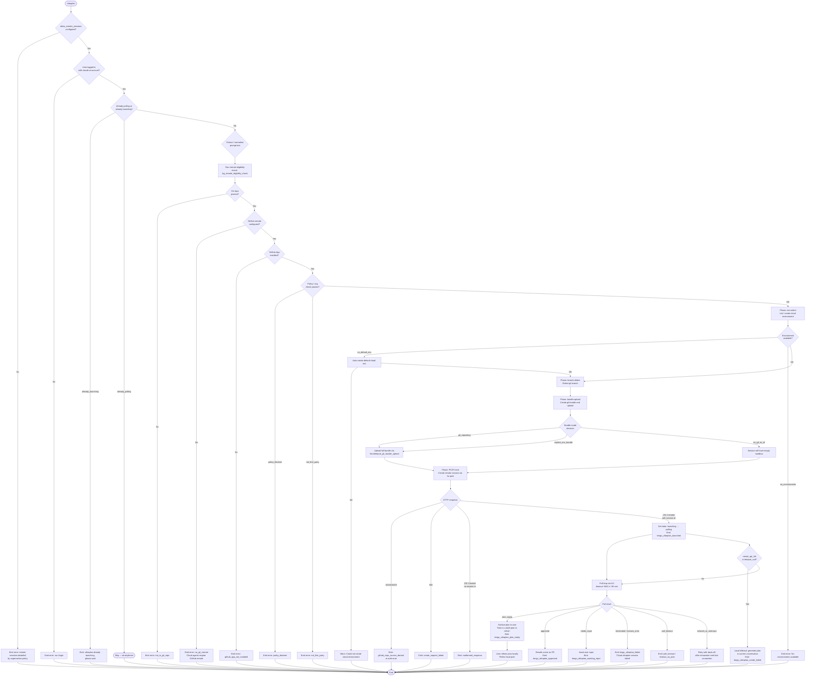

# `/ultraplan`

> Analysis basis: CC v2.1.190 bundle.js (AST extraction + Claude interpretation)
> Minimum version: v2.1.190

---

## Overview

`/ultraplan` drafts an editable task plan in Claude Code on the web by launching a remote cloud session (Teleport) that runs asynchronously in the background. The command validates session prerequisites (login, git, GitHub App), uploads the current repository state as a git bundle, creates a remote cloud session, polls that session for a plan result, and then surfaces the plan locally for the user to refine. If the remote session cannot be started, the command falls back to generating a draft plan locally using the current conversation context.

---

## Registration

| Field | Value |
|---|---|
| type | `local-jsx` |
| name | `ultraplan` |
| description | `Draft an editable plan in Claude Code on the web ( ... ) · See  ...` |
| argumentHint | `<prompt>` |
| load\_inline | `true` |
| load\_ident | `aff` |
| loc\_byte | `12269229` |
| loc\_byte\_end | `12269461` |
| loc\_line | `8223` |
| arbor\_handler.name | `aff` |
| arbor\_handler.kind | `AsyncFunction` |
| arbor\_handler.fqn | `claude-2.1.190::aff` |
| arbor\_handler.resolution\_path | `load_ident` |
| arbor\_handler.n\_hits | `1` |
| `loc_byte_end` | `12269461` |
| `arbor_handler.name` | `aff` |
| `arbor_handler.kind` | `AsyncFunction` |
| `arbor_handler.resolution_path` | `load_ident` |
| `arbor_handler.fqn` | `claude-2.1.190::aff` |
| `arbor_handler.n_hits` | `1` |

Analysis basis: CC v2.1.190 bundle.js:+12269229

The handler is inlined via `load:()=>Promise.resolve({call: aff})` — no separate `module_id`. The Arbor symbol graph resolved this via the `load_ident` path with exactly one hit. The call graph therefore starts at `aff`.

---

## Input Branching

The command has six or more distinct execution paths (precondition failures, already-running guards, remote success, plan-ready, remote failure, local fallback), so a Mermaid flowchart is used.



Analysis basis: CC v2.1.190 bundle.js:+12267364 (handler entry `aff`), +12264589 (`tengu_ultraplan_create_failed`), +12266296 (`tengu_ultraplan_launched`), +12264811 (`already_polling`), +12264829 (`already_launching`)

---

## Behavioral Spec

### 1 — Handler entry and prompt normalisation (`aff`)

```
async function ultraplanHandler(toolInput, context):
    appState = context.getAppState()                        // +12267699

    // Normalise the raw argument text
    promptText = extractAndNormalisePrompt(toolInput)       // calls Eqn → dAo

    // Check whether "ultraplan" keyword appears in text at all
    if promptText does not contain "ultraplan" (case-insensitive, gi flag):
        // user may have included it anywhere in their own message
        pass  // keyword detection via dAo / e.matchAll at +10885861

    // Validate remote session permission gate
    checkRemoteSessionPermission(appState)                  // Js at +12267382

    // Guard: only one ultraplan flight at a time
    if appState has flag "already_polling" or "already_launching":
        if "already_launching":
            return systemMessage("ultraplan: already launching. Please wait…")
        return  // already_polling: silent de-duplicate

    // Emit slash-invocation telemetry marker
    emit("slash", promptText)                               // +12267510

    // Launch the remote session pipeline
    result = await launchRemoteSession(promptText, appState, context)  // bqt

    context.setAppState(updatedState)                       // +12267921
    return result
```

Analysis basis: CC v2.1.190 bundle.js:+12267364, +12267699, +12267921

---

### 2 — Prompt extraction (`Eqn` / `dAo`)

```
function extractAndNormalisePrompt(rawInput):
    // dAo: scan input for "ultraplan" keyword (case-insensitive, gi)
    // regex matchAll at +10885861 with flag "gi" (+10885853)
    matches = rawInput.matchAll(/ultraplan/gi)

    if no match at position 0:
        // keyword appeared elsewhere; slice text around it
        trimmed = rawInput.slice(...)                       // +10886433
        normalised = trimmed.replace("$1$2", ...)          // +10886530
        // replace group limit: 5 (+10886553)
        return normalised.toLowerCase()                     // +10886405 via n.replace

    // Keyword is the command itself; argument follows after it
    // Minimum slice offset: 0 (+10885500)
    return rawInput.slice(afterKeyword).trim()
```

Analysis basis: CC v2.1.190 bundle.js:+10885455, +10885853, +10885861, +10886433, +10886530

---

### 3 — Remote session permission check (`Js`)

```
function checkRemoteSessionPermission(appState):
    // Read allow_remote_sessions flag (+12267385)
    flag = appState.getConfig("allow_remote_sessions")

    // Check product feedback allowance (sSi path)
    feedbackAllowed = readSetting("allow_product_feedback")  // +3352407

    // Telemetry level resolution (Vi / Jns)
    telemetryLevel = resolveTelemetryLevel()
    // Values: "essential-traffic" (+1054264), "no-telemetry" (+1054323),
    //         "default" (+1054397)

    // If remote sessions disabled by org policy → raise "policy_blocked"
    if flag indicates policy_blocked:
        raise preconditionError("policy_blocked",
            "Cloud sessions are disabled by your organization's policy…")
                                                             // +8622221

    // If not logged in with claude.ai → raise "not_logged_in"
    if not loggedInWithClaudeAi():
        raise preconditionError("not_logged_in",
            "Please run /login and sign in with your Claude.ai account…")
                                                             // +8621719

    // First-party API check
    if provider is not firstParty:
        raise preconditionError("not_first_party",
            "Cloud sessions are only available on the first-party…")
                                                             // +8607098
```

Analysis basis: CC v2.1.190 bundle.js:+12267382, +12267385, +8622221, +8621719, +8607098

---

### 4 — Remote eligibility check (`mga` / `Zle`)

```
async function remoteEligibilityCheck(appState):
    // Parallel checks via Promise.all (+7216444)
    results = await Promise.all([
        checkGitRepo(),          // not_in_git_repo (+8621820)
        checkGitRemote(),        // no_git_remote (+8621954)
        checkGithubAppInstalled(), // github_app_not_installed (+8622067)
        checkBYOCFlags(),        // byoc path (+7216690)
    ])

    // BYOC seed bundle enablement telemetry
    emit("tengu_ccr_bundle_seed_enabled", ...)              // +7216782

    for each precondition result:
        if failed:
            return { ok: false, reason: result.reason, message: result.message }

    return { ok: true }
```

Analysis basis: CC v2.1.190 bundle.js:+8621354 (`yvp`), +7216309 (`mga`), +7216444

---

### 5 — Cloud environment selection (`Fee` / `fat`)

```
async function listOrCreateEnvironment(accessToken, orgUUID):
    // Requires first-party provider (+7211848)
    // Requires claude.ai login (+7211978)
    // Requires org UUID (+7212217)

    // HTTP GET environments list (ho.get, timeout 15 000 ms at +7212409)
    envList = await httpGet("/environments", { timeout: 15000 })

    if envList is empty:
        // Attempt auto-create "Default" environment (+7212805)
        emit("teleport_default_environment_create")          // +7212830
        newEnv = await httpPost("/environments", {
            name: "Default",
            type: "anthropic_cloud",                         // +7213245
            workdir: "/home/user",                           // +7213351
            runtimes: { python: "3.11", node: "20" }        // +7213413,+7213430,+7213444,+7213459
        })
        if creation fails:
            log("warn", "Could not create a cloud environment…")  // +8610437
            return { ok: false, reason: "no_default_env" }

    // Select first available environment or "bridge" env (+8611417)
    selectedEnv = pickBestEnvironment(envList)
    if none available:
        return { ok: false, reason: "no_environments" }     // +8611576

    return { ok: true, env: selectedEnv }
```

Analysis basis: CC v2.1.190 bundle.js:+7211771 (`Fee`), +7212830, +8610437, +8611576

---

### 6 — Git bundle upload (`Mco` / `teleport_git_bundle_upload`)

```
async function uploadGitBundle(env, appState):
    emit_phase("[teleport] phase: env-select")               // +8610171

    // Detect bundle mode
    mode = decideBundleMode(appState)
    // Possible modes: "bundle", "explicit_env_bundle", "git_repository",
    //                 "no_git_at_all", "too_large"           // +8608205,+8608243

    emit("tengu_teleport_bundle_mode", { mode })             // +8608279

    if mode == "no_git_at_all":
        log("[teleportToRemote] No repository detected — session will have empty sandbox")
                                                             // +8614424
        return { sourceType: "no_git_at_all" }

    // Stash uncommitted changes to refs/seed/stash (+8591221)
    // and refs/seed/root (+8591239) via git update-ref / git stash create

    // Upload bundle file named "ccr-seed.bundle" (+8592416)
    emit("tengu_ccr_bundle_upload", { mode })                // +8591413

    bundlePath = writeTempBundle()  // "_source_seed.bundle" (+8592723)
    uploadResult = await httpPost(uploadURL, bundleBytes)

    if uploadResult.status == 200:                           // +8591937
        return { sourceType: "success", strategy: "head" }  // +8593024, +8593093
    else:
        return { sourceType: "upload_failed" }               // +8592872
```

Analysis basis: CC v2.1.190 bundle.js:+8591091 (`Mco`), +8591413, +8592416, +8608279

---

### 7 — Session creation POST (`P5` / `O5`)

```
async function createRemoteSession(env, bundleInfo, promptText, orgUUID, accessToken):
    emit_phase("[teleport] phase: POST-sent")                // +8615259

    // Build task branch name (uvp, max branch prefix 75 chars +8594498)
    branchName = generateBranchName("claude/task", promptText)  // +8594504

    // Resolve source bundle URL
    sourceURL = resolveSourceURL(bundleInfo)
    emit("tengu_teleport_source_decision", { sourceURL })    // +8614022

    // POST to create session
    // Headers: anthropic-beta: ccr-byoc-2025-07-29 (+8607929)
    //          x-organization-uuid (+8607951)
    //          anthropic-version: 2023-06-01 (+3292995)
    response = await ho.post("/sessions", {
        headers: {
            "anthropic-beta": "ccr-byoc-2025-07-29",
            "x-organization-uuid": orgUUID,
        },
        body: {
            env: env.id,
            task: promptText,
            branch: branchName,
            source: sourceURL,
            permission_mode: "set",                          // +8607323
        }
    })

    if response.status == 201 and response.sessionId missing:
        return { ok: false, reason: "malformed_response" }  // +8610000

    if response.status in [401, 403, 429]:                   // +8609432,+8609436,+8609440
        return { ok: false, reason: "github_repo_access_denied" }  // +8609485

    if response.status == 500:                               // +8609327
        return { ok: false, reason: "create_request_failed" }  // +8609786

    // Link session
    emit("tengu_ccr_session_link", { sessionId: response.sessionId })  // +8601385

    return { ok: true, sessionId: response.sessionId }
```

Analysis basis: CC v2.1.190 bundle.js:+8607929, +8609327, +8609363, +8610000, +8601385

---

### 8 — Launch pipeline (`bqt` / `iff`)

```
async function launchPipeline(promptText, appState, context):
    // Mark state as "already_launching"                     // +12264829
    appState.setFlag("already_launching", true)

    emit("tengu_ultraplan_launched", { prompt: promptText }) // +12266296

    // Run eligibility + env + bundle + POST in sequence
    eligibility = await remoteEligibilityCheck(appState)
    if not eligibility.ok:
        // Precondition failure rendered as "precondition" message type (+12265404)
        return renderPreconditionError(eligibility)

    envResult = await listOrCreateEnvironment(token, orgUUID)
    if not envResult.ok:
        return renderEnvironmentError(envResult)

    bundleInfo = await uploadGitBundle(envResult.env, appState)

    sessionResult = await createRemoteSession(envResult.env, bundleInfo,
                                              promptText, orgUUID, token)

    if not sessionResult.ok:
        // create_api_fail → local fallback              // +12265972
        emit("tengu_ultraplan_create_failed", { reason: sessionResult.reason })
                                                         // +12264589
        return localPlanFallback(promptText, context)

    if sessionResult.sessionId is null:
        // teleport_null path                            // +12265990
        return localPlanFallback(promptText, context)

    // Transition to polling
    appState.setFlag("already_launching", false)
    appState.setFlag("already_polling", true)

    return pollSession(sessionResult.sessionId, promptText, appState, context)
```

Analysis basis: CC v2.1.190 bundle.js:+12264552 (`bqt`), +12265079 (`iff`), +12266296, +12265972, +12265990

---

### 9 — Session polling loop (`nff` / `KLl`)

```
async function pollSession(sessionId, promptText, appState, context):
    // Timeout: 5400 s = 90 minutes                          // +12260118
    emit("tengu_ultraplan_timeout_seconds", { value: 5400 })  // +12260084

    startTime = Date.now()
    while elapsed < 5400 * 1000:
        status = await fetchSessionStatus(sessionId)         // KLl / Jx

        switch status.phase:
            case "plan_ready":                               // +12252134
                emit("tengu_ultraplan_plan_ready")           // +12260796
                planText = extractPlan(status)
                return renderPlanForRefinement(planText)     // prefix: "Here is a draft plan to refine:" (+12260425)

            case "needs_input":                              // +12252149
                emit("tengu_ultraplan_awaiting_input")       // +12260728
                // Block further polling; present message to user

            case "approved":                                 // +12251757
                emit("tengu_ultraplan_approved")             // +12261216
                return systemMessage(
                    "Results will land as a pull request when the cloud session finishes…")
                                                             // +12261706

            case "terminated" | "session_error":
                emit("tengu_ultraplan_failed")               // +12262105
                return systemMessage(
                    "Cloud ultraplan session failed. Wait for the user's next instructions.")
                                                             // +12262529

            case "poll_timeout":                             // +8631473
                // Sub-cases: "timeout_pending" (+12252487), "timeout_no_plan" (+12252505)
                return renderTimeoutError(elapsed)

            case "network_or_unknown":                       // +12251370
                // Retry with exponential back-off
                // After exhaustion: "Lost connection to the cloud session…" (+12251444)
                if retriesExhausted:
                    return renderConnectionLostError()

            case "requires_action":                          // +12252082
                // Remote session awaiting hook response
                // hook_progress (+8629984) / hook_response (+8630013)
                handleRemoteHook(status)

        // Elapsed time reported in minutes (60 000 ms/min +12252264)
        sleep(pollIntervalMs)

    // Outer timeout
    return renderTimeoutError(5400)
```

Analysis basis: CC v2.1.190 bundle.js:+12260084, +12260118, +12260425, +12260796, +12261216, +12261706, +12262105, +12252134, +12252149

---

### 10 — Local plan fallback (`tff` / `eff`)

```
function localPlanFallback(promptText, context):
    // Build prompt list with preamble "Here is a draft plan to refine:"
    parts = []
    parts.push("Here is a draft plan to refine:")           // +12260425
    parts.push(renderCurrentContext(context))               // eff / Jpf
    result = parts.join("\n")                               // tff r.join +12260508

    // Surface as "Refine local plan" action               // +12265736
    // Plan message type: "plan"                           // +12265771
    emit("tengu_ultraplan_prompt_identifier")               // +12260251

    return renderPlan(result)
```

Analysis basis: CC v2.1.190 bundle.js:+12260418 (`tff`), +12260425, +12260508, +12265736, +12265771

---

### 11 — Remote agent polling infrastructure (`GUa` / `r_e`)

```
async function remoteAgentPoller(sessionId, options):
    // Poll interval: 1 000 ms base (+8628787)
    // Max poll duration: 1 800 000 ms = 30 min per outer window (+8628794)

    state = "pending"                                        // +13326759
    while true:
        response = await fetchAgentStatus(sessionId)

        // State machine transitions:
        // pending → running (+8627217) → completed (+8629313)
        //        → archived (+8629238) → orchestrator_error (+8631405)
        //        → session_error (+8631451) → poll_timeout (+8631473)

        if response.state == "completed":
            // Extract last assistant message                 // +8629065
            lastMsg = response.messages.findLast(m => m.role == "assistant")
            // Look for result marker                        // +8629801
            if resultMarker found:
                return { ok: true, plan: extractedPlan }
            else:
                return { ok: false, reason: "no_review_output" }  // +8631488

        if response.state in ["orchestrator_error", "session_error"]:
            return { ok: false, reason: response.state }

        // Timeout guard using setTimeout (+8631982)
        if timedOut:
            // poll_timeout_after_api_error (+8631901) if prior API error
            return { ok: false, reason: "poll_timeout" }

        await sleep(1000)
```

Analysis basis: CC v2.1.190 bundle.js:+8627109 (`r_e`), +8628787, +8628794, +8629313, +8631405, +8631473

---

### 12 — State machine updates via `cDn`

```
function updateTaskState(taskId, newState):
    // Calls aHe.setState (+7076007) to push state into React/app state
    // Task lifecycle states observed in literals:
    //   user_typed (+10280878), active (+10280926), aborted (+10281099),
    //   task_started (+10285041), task_updated (+10284096),
    //   local_workflow (+10285560)
    aHe.setState({ taskId, phase: newState, timestamp: Date.now() })
```

Analysis basis: CC v2.1.190 bundle.js:+7076007 (`cDn`), +10285041, +10285560

---

## State & Side Effects

| Item | Detail |
|---|---|
| **Telemetry — ultraplan core** | `tengu_ultraplan_create_failed` (+12264589), `tengu_ultraplan_prompt_identifier` (+12260251), `tengu_ultraplan_launched` (+12266296), `tengu_ultraplan_timeout_seconds` (+12260084), `tengu_ultraplan_awaiting_input` (+12260728), `tengu_ultraplan_plan_ready` (+12260796), `tengu_ultraplan_approved` (+12261216), `tengu_ultraplan_failed` (+12262105) |
| **Telemetry — CCR / Teleport** | `tengu_ccr_bundle_seed_enabled` (+7216782), `tengu_ccr_bundle_upload` (+8591413), `tengu_teleport_bundle_mode` (+8608279), `tengu_ccr_session_link` (+8601385), `tengu_teleport_source_decision` (+8614022) |
| **Telemetry — background daemon** | `tengu_bg_dispatch_sigkill_escalate` (+17198228), `tengu_bg_low_mem_mb` (+13054968), `tengu_bg_dispatch_low_mem` (+17198829), `tengu_daemon_idle_exit` (+17219790), `tengu_bg_spare_enable` (+17199526), `tengu_bg_sendclaim_failed` (+17174488), `tengu_bg_spare_claim` (+17199654), `tengu_bg_spare_claim_fail` (+17199920) |
| **Telemetry — misc** | `tengu_config_parse_error` (+13754586), `tengu_feature_ok` (+1025122), `tengu_feature_bad` (+1025189) |
| **appState changes** | Sets `already_launching` flag on entry; clears it and sets `already_polling` once session ID confirmed; calls `t.setAppState` (+12267921) and `t.getAppState` (+12267699) |
| **Hook registration** | `Ei` registers a hook via `C6o.register` (+67325); downstream hooks include `hook_progress` and `hook_response` event types observed in remote-agent poller |
| **File I/O** | Writes temp git bundle `ccr-seed.bundle` / `_source_seed.bundle`; uses `rSi.readFileSync` for config (`utf-8`, +3352214); `r.mkdirSync`, `r.copyFileSync`, `gl.unlink`, `qm.rm`, `qm.unlink` during session lifecycle |
| **Network** | `ho.post` (session creation, bundle upload), `ho.get` (environment list), with Axios cancel detection (`ho.isCancel`, `ho.isAxiosError`) |
| **Timeout constants** | Session poll outer timeout: 5 400 s / 90 min (+12260118); remote agent max poll window: 1 800 000 ms / 30 min (+8628794); poll tick: 1 000 ms (+8628787); short retry delay: 1 500 ms (+12266645); env list request timeout: 15 000 ms (+7212409); retry sentinel: 10 000 ms (+8617688) |
| **HTTP status codes handled** | 200 (+8591937), 201 (+8609363), 400 (+7215057), 401 (+8609432), 403 (+8609436), 409 (+8617977), 429 (+8609440), 500 (+8609327) |
| **Sound** | <!-- TODO: not found in depth-2 traversal; needs --depth 4 --> |

---

## Version History

| Version | Change |
|---|---|
| v2.1.190 | Initial analysis — remote Teleport cloud session with local fallback, 90-minute poll timeout, `ccr-byoc-2025-07-29` beta header |

---

## Common Mistakes

1. **Not logged in with claude.ai** — `/ultraplan` requires a claude.ai account login (`/login`), not just an API key. API-key-only authentication triggers `not_logged_in` / `no_access_token` errors.
2. **Missing GitHub remote** — The command requires `git remote add origin <REPO_URL>` before it can start a cloud session. Running it in a directory with no git remote triggers `no_git_remote`.
3. **GitHub App not installed** — Even with a remote, the Anthropic GitHub App must be installed on the target repository/organisation. The error `github_app_not_installed` is surfaced if not.
4. **Organisation policy blocks cloud sessions** — Enterprise orgs may have disabled remote sessions. The `policy_blocked` error indicates that only an org admin can resolve this.
5. **Invoking a second `/ultraplan` while one is running** — The `already_launching` / `already_polling` guard will silently de-duplicate or return the "already launching" message. Wait for the current session to complete.
6. **No commits in the repository** — An empty repo (no commits) causes a bundle-upload failure. Run `git add . && git commit -m "initial"` before invoking the command.
7. **Third-party API provider** — Cloud sessions only work on the first-party Anthropic API. Using a custom or proxy provider triggers `not_first_party`.

---

## Appendix — Identifier Mapping

> For bundle debugging only. Identifiers change across versions.

| Identifier | Role |
|---|---|
| `aff` | Main handler for `/ultraplan` (AsyncFunction, Arbor FQN: `claude-2.1.190::aff`) |
| `Eqn` | Prompt text extraction and normalisation |
| `yqn` | Prompt text lower-casing helper |
| `dAo` | Regex-based keyword scanner (`ultraplan` keyword detection, `matchAll` with `gi` flag) |
| `Js` | Remote session permission / config gate check |
| `sSi` | Config read sub-routine (reads settings file) |
| `Jz` | Config resolution coordinator |
| `K9` | Config access validator |
| `uxt` | Raw config file reader (`readFileSync`, encoding `utf-8`) |
| `Wme` | Config flag inclusion/exclusion checker |
| `Vi` | Telemetry level resolver |
| `Jns` | Telemetry string builder |
| `nt` | String-to-value converter (generic) |
| `Rme` | Remote-permission result mapper |
| `dte` | App-state descriptor / display helper |
| `bqt` | Launch pipeline coordinator (orchestrates eligibility → env → bundle → POST) |
| `W` | JSX React element factory (generic) |
| `Ve` | JSX helper / view renderer |
| `aKe` | React root component base |
| `s` | Pending-operation set manager (add/finally/delete) |
| `e0l` | Error display component |
| `L7n` | Session-launch sub-orchestrator |
| `w7n` | Inner launch sequencer |
| `it` | Session state reader (YIe map, IW map, gSn) |
| `Qpf` | Queue/poll flag manager |
| `iff` | Full remote-session launch flow (calls eligibility, env, bundle, POST, poll) |
| `Zle` | Eligibility check dispatcher |
| `mga` | Remote eligibility parallel checker (Promise.all) |
| `rs` | Error renderer (VL / cd) |
| `VL` | Precondition-error view component |
| `cd` | Error detail component |
| `tff` | Local plan assembler (pushes "Here is a draft plan to refine:", joins parts) |
| `eff` | Context content extractor for local plan |
| `P5` | Teleport-to-remote main function (env select → bundle → POST → poll) |
| `Pt` | Config-provider accessor |
| `Nl` | First-party provider checker (`firstParty`) |
| `xh` | Auth token refresh checker (`refreshed`) |
| `lBn` | HTTP request builder (GET) |
| `ke` | File-operation helper with error logging |
| `_2` | Organisation UUID resolver |
| `Ls` | OAuth endpoint selector (`local`, `staging`, `prod`) |
| `YE` | HTTP header builder (`Content-Type`, `anthropic-version`) |
| `Mco` | Git bundle creator and uploader (`teleport_git_bundle_upload`) |
| `kt` | Error-code component (VL wrapper) |
| `T` | Message-type tagger / level mapper (`debug`, `warn`, `error`) |
| `Pe` | JSX prop builder |
| `cO` | Git remote URL resolver (`git config --get remote.origin.url`) |
| `UUa` | Session request body builder (randomUUID, wr/Tet) |
| `DFt` | Dry-run / debug flag evaluator |
| `Me` | JSON serialiser (`JSON.stringify`) |
| `ne` | Error-stream / notification emitter |
| `NUa` | Session-link state builder (eh, yA, hn) |
| `FDn` | Feature-flag decision node |
| `Fee` | Environment list fetcher (`teleport_environments_list`) |
| `fat` | Default environment creator (`teleport_default_environment_create`) |
| `be` | String coercion helper |
| `c` | Environment list item mapper (En) |
| `uvp` | Branch-name generator (`claude/task` prefix, max 75 chars) |
| `vU` | Session-state writer (YIe / ZRt / xEi) |
| `P9e` | GitHub App installation checker (`checkGithubAppInstalled`) |
| `ZR` | Default branch detector (`symbolic-ref --short refs/remotes/origin/HEAD`) |
| `gs` | Generic settings accessor (v9, Qo, Kg) |
| `hoe` | Remote URL parser (match, Lis, N7e, fi) |
| `K` | Environment identifier set (fMe, Jgl) |
| `se` | String segmenter (trim, f, a, F, N) |
| `fo` | Error string normaliser |
| `IH` | Interrupt/cancel handler |
| `jH` | Session journal / log writer |
| `gy` | Claude.ai base-URL resolver (local/staging/prod endpoints) |
| `oo` | Claude.ai HTTP client factory (xPe, nsr, ISc, o9o) |
| `i7r` | Claude.ai client initialiser (D1t, UUd) |
| `off` | Orphaned-session archiver |
| `r_e` | Remote agent session manager (pending → running → completed state machine) |
| `OB` | Random-bytes session-token generator |
| `fut` | Temp file opener for bundle (VJn, PDo, gm, Fne.open) |
| `aC` | Session timestamp recorder |
| `yvp` | Session-state string formatter |
| `GUa` | Remote-agent poll loop (1 000 ms tick, 1 800 000 ms window) |
| `Jx` | Task-state dispatcher (Q9p, Z9p, Fce, cDn) |
| `J9p` | Task-start state writer |
| `Y9p` | Task-update state writer |
| `cDn` | App-state setter bridge (`aHe.setState`) |
| `Y_o` | Task-event emitter |
| `Q9p` | Task-started phase handler |
| `Z9p` | Task-updated phase handler |
| `Fce` | Task-active/aborted phase handler |
| `nff` | Session poll coordinator (KLl, Xpf, sff, rd, rs, g3t) |
| `KLl` | Poll-loop inner body (status ingestion, timeout, network-error retry) |
| `Xpf` | Poll state reader (`it`) |
| `sff` | Poll success handler |
| `g3t` | Cleanup helper on poll end (lDo, gl.unlink, Xo) |
| `o` | Pad/format helper (padEnd) |
| `O5` | Session-status POST endpoint helper (Nl, lBn, Ls, ho.post, YE, Me, be) |
| `Ei` | Hook registrar (`C6o.register`) |
| `rff` | Poll-result renderer |
| `Dt` | App config loader (SEe, BRf, Date.now) |
| `Wt` | Config base path resolver |
| `OOo` | Config object merger |
| `SEe` | Config file reader/writer (readFileSync, statSync, mkdirSync, copyFileSync) |
| `Gt` | JSON parser (`JSON.parse`) |
| `u9` | Config key stripper (`startsWith`, `slice`) |
| `cn` | Config normaliser |
| `bGl` | Config backup reader (IS.basename, readdirStringSync, IS.join) |
| `$Oo` | Config directory joiner |
| `l` | Path-like list helper (rUl) |
| `f` | Background-process session manager (get, set, kill, freemem, it, spawn) |
| `D` | Background process descriptor (VEc, sp, T, ke, XJf, d.write) |
| `Kn` | Timeout-with-abort utility |
| `Re` | Feature-ok telemetry emitter (`tengu_feature_ok`) |
| `Le` | Feature-bad telemetry emitter (`tengu_feature_bad`) |
| `GXn` | Memory-low checker (macos, `tengu_bg_low_mem_mb`) |
| `B2e` | Async file-removal helper (_b.lstat, _b.rm, _b.readFile, kn, ECd) |
| `U` | Supervisor process heartbeat writer |
| `L3o` | Background session IPC connector (uV.claim, Yrr.connect, i.on, i.once, i.write) |
| `P3o` | Background session lifecycle manager (spawn, state.json, roster, qm.rm, Eve, kd) |
| `p` | Forced-shutdown handler (jb, process.exit, u.abort) |
| `F` | Interval-based cleaner (clearInterval) |
| `BRf` | Config-watcher setup (mIt, Wt, Sa, u9, OOo, cV, Ei, TGl.unwatchFile) |
| `mIt` | File-watch registrar (His.watchFile) |
| `cV` | Config change validator |
| `pgt` | Initial state prefetch (Promise.all of cO, vU, cu, Pt, nt, P9e) |

---

Note: index built via Arbor fallback; some signals (telemetry, literals) may be missing — see arbor-fallback.js.