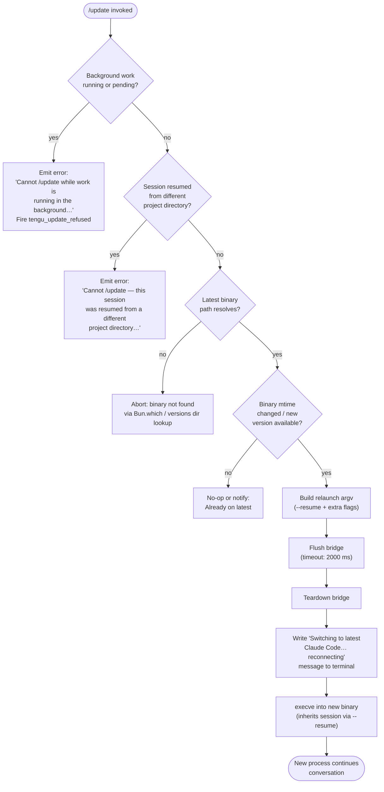

# `/update`

> Analysis basis: CC v2.1.190 bundle.js (AST extraction + Claude interpretation)
> Minimum version: v2.1.190

---

## Overview

`/update` switches the running Claude Code CLI to the latest installed version while preserving the current conversation. The command performs a live self-upgrade by flushing and tearing down the current process bridge, constructing the argument list for the new binary, and then executing it via `execve` so the replacement process inherits the session without a restart visible to the user. The command is intentionally hidden from the standard command list.

---

## Registration

| Field | Value |
|---|---|
| type | `local` |
| name | `update` |
| description | `Switch to the latest version (conversation continues)` |
| isHidden | `true` |
| supportsNonInteractive | `false` |
| module_id | `n1l` |
| load_inline | `true` |
| loc_byte | `12694009` |
| loc_byte_end | `12694250` |
| loc_line | `8678` |
| arbor_handler.name | `J_f` |
| arbor_handler.fqn | `claude-2.1.190::J_f` |
| arbor_handler.kind | `AsyncFunction` |
| arbor_handler.resolution_path | `module_id` |
| arbor_handler.n_hits | `0` |

Analysis basis: CC v2.1.190 bundle.js:+12694009

---

## Input Branching

Five distinct guard conditions are evaluated before the upgrade is attempted, making a Mermaid flowchart the appropriate representation.



---

## Behavioral Spec

### 1. Pre-flight: Locate the Latest Binary

The handler calls the package-manager locator (via `Bun.which`) and separately resolves the `~/.local/share/versions` path to determine whether a newer binary exists.

Analysis basis: CC v2.1.190 bundle.js:+12691805, +866131, +7046863, +7046872, +8529810

```
function locateLatestBinary():
    # First attempt: resolve "claude" on PATH via Bun.which
    pathResult = bunWhich("claude")          # loc +866131

    # Second attempt: check versioned install directory
    versionsDir = join(homedir(), ".local", "share", "versions")   # loc +7046863, +7046872, +8529810
    binPath     = join(versionsDir, "bin")                         # loc +7046943
    return pathResult OR binPath
```

### 2. Guard: Background Work Check

The handler inspects current task states. If any task has status `"running"` or `"pending"`, the update is refused and telemetry is fired.

Analysis basis: CC v2.1.190 bundle.js:+12692166, +12692188, +12692269, +12691905

```
function checkBackgroundWork(appState):
    tasks = Object.values(appState.tasks)         # loc +12692128
    for task in tasks:
        if task.status in ["running", "pending"]:   # loc +12692166, +12692188
            fire("tengu_update_refused")             # loc +12691905
            return Error(
                "Cannot /update while work is running in the background" +
                " — wait for it to finish, then try again."              # loc +12692269
            )
    return OK
```

### 3. Guard: Project Directory Mismatch

If the session was resumed from a different project directory, `execve` into the new binary would silently change context, so the command refuses with a descriptive error.

Analysis basis: CC v2.1.190 bundle.js:+12692513

```
function checkProjectDirectory(session, currentCwd):
    if session.originDirectory != currentCwd:
        return Error(
            "Cannot /update — this session was resumed from a different" +
            " project directory. Restart manually with --resume…"    # loc +12692513
        )
    return OK
```

### 4. Build Relaunch Argument Vector

The handler collects the original CLI arguments and reconstructs the complete argument vector for the replacement process. Flags such as `--resume`, `--add-dir`, `--allow-dangerously-skip-permissions`, `--effort`, and `--permission-mode` are conditionally appended.

Analysis basis: CC v2.1.190 bundle.js:+12432496, +12434020, +12434135, +12434277, +12434294, +12433845

```
function buildRelaunchArgv(session, currentArgs):
    argv = Array.from(currentArgs)               # loc +12433845

    # Always inject --resume so the new process continues this conversation
    argv.push("--resume", session.id)            # loc +12432496

    # Propagate --add-dir entries from the original invocation
    for dir in session.extraDirs:
        argv.push("--add-dir", dir)              # loc +12434020

    # Conditionally propagate permission flags
    if currentArgs.has("--allow-dangerously-skip-permissions"):
        argv.push("--allow-dangerously-skip-permissions")   # loc +12434135
    if currentArgs.effort:
        argv.push("--effort", currentArgs.effort)           # loc +12434277
    if currentArgs.permissionMode:
        argv.push("--permission-mode", currentArgs.permissionMode)  # loc +12434294

    return argv
```

### 5. Write SDK Messages and Flush Bridge

Before replacing the process, the handler emits a progress message to the conversation, writes SDK messages, generates a new UUID for continuity, then flushes the bridge with a 2000 ms timeout.

Analysis basis: CC v2.1.190 bundle.js:+12692974, +12692994, +12693065, +12693068, +12693078, +12693083, +12692998

```
async function flushAndPrepareHandoff(bridge, session):
    # Emit "Switching…" message visible to the user
    writeMessage("Switching to latest Claude Code… reconnecting")   # loc +12692998

    # Persist SDK message log for the resumed session
    bridge.writeSdkMessages(session)                                 # loc +12692974

    # Generate new UUID for the relaunch
    newId = crypto.randomUUID()                                      # loc +12692994

    # Flush with 2000 ms timeout labeled "bridge flush"
    await Promise.race([
        bridge.flush(),
        timeout(2000, label="bridge flush")                          # loc +12693078, +12693083
    ])

    bridge.teardown()                                                # loc +12693119
```

### 6. Terminal Fullscreen Teardown (Pre-exec)

If the terminal is in fullscreen mode, the UI is unmounted, the terminal is restored (using ANSI save/restore cursor sequences `\x1B7` / `\x1B8`), and environment-specific adjustments are applied (tmux, iTerm2 Ghostty, Windows).

Analysis basis: CC v2.1.190 bundle.js:+12432524, +3899577, +3899588, +3623279, +3623348, +3546850

```
function teardownTerminalUI(terminalContext):
    if terminalContext.isFullscreen:
        writeSync("\x1B7")              # save cursor  loc +3899577
        terminalUI.unmount()            # loc +12432524
        writeSync("\x1B8")              # restore cursor loc +3899588
        applyTerminalQuirks(terminalContext)   # tmux, iTerm2, Ghostty, Windows
```

### 7. execve Handoff

After all cleanup is complete, the process replaces itself via `execve` with the new binary and reconstructed argument vector. Environment variables are forwarded via `Object.entries`. On macOS the libc shim is `libSystem.B.dylib`; on Linux it is `libc.so.6`.

Analysis basis: CC v2.1.190 bundle.js:+12431999, +12431636, +12431644, +12431673

```
function execveHandoff(newBinaryPath, argv, env):
    # Load platform libc via bun:ffi
    if platform == "macos":
        lib = dlopen("/usr/lib/libSystem.B.dylib", ...)    # loc +12431644
    else:
        lib = dlopen("libc.so.6", ...)                     # loc +12431673

    # Encode argv and env as UTF-8 null-terminated pointer arrays
    argvPtrs = argv.map(s => Buffer.from(s, "utf8"))       # loc +12431776
    envPtrs  = Object.entries(env).map(encodeEnvEntry)     # loc +12431904

    lib.execve(newBinaryPath, argvPtrs, envPtrs)           # loc +12431999
    # No return — process image replaced
```

### 8. Post-exec Daemon Status Persistence

Before the `execve` call, the current daemon state is written to `daemon.status.json` so the new process can pick it up on startup.

Analysis basis: CC v2.1.190 bundle.js:+12785999, +12786096

```
function writeDaemonStatus(statusDir, state):
    statusPath = join(statusDir, "daemon.status.json")    # loc +12785999
    content    = JSON.stringify(state)                     # loc +12786096
    writeFile(statusPath, content)
```

### 9. Process Signal Cleanup

Immediately before `execve`, all existing `process` listeners are removed and signals SIGINT and SIGHUP are re-handled so the dying process does not leave dangling handlers in the new image.

Analysis basis: CC v2.1.190 bundle.js:+12433065, +12433095, +12433036, +12433055

```
function prepareSignalsForExec():
    process.removeAllListeners()           # loc +12433065
    process.on("SIGINT",  noopHandler)     # loc +12433095, +12433036
    process.on("SIGHUP",  noopHandler)     # loc +12433055
```

### 10. Relaunch Error Handling

If `spawnSync` or `execve` fails, a `relaunch_spawn_error` literal is used to categorise the failure, and `process.exit(128)` is called.

Analysis basis: CC v2.1.190 bundle.js:+12433347, +12433484

```
function handleRelaunchFailure(err):
    logError("relaunch_spawn_error", err)   # loc +12433347
    process.exit(128)                        # loc +12433484
```

---

## State & Side Effects

| Item | Detail |
|---|---|
| Telemetry — `tengu_update_refused` | Fired when background tasks block the update (loc +12691905) |
| Telemetry — `tengu_scroll_summary` | Fired during terminal scroll / UI teardown path (loc +7231933) |
| Telemetry — `tengu_amber_creek` | Fired during fullscreen terminal detection logic (loc +3556463) |
| Telemetry — `tengu_pewter_brook` | Fired during fullscreen terminal detection logic (loc +3556371) |
| Telemetry — `tengu_bg_dispatch_sigkill_escalate` | Fired if background process requires SIGKILL escalation (loc +17198228) |
| Telemetry — `tengu_feature_bad` / `tengu_feature_ok` | Feature flag evaluation events (loc +1025189, +1025122) |
| Telemetry — `tengu_bg_low_mem_mb` / `tengu_bg_dispatch_low_mem` | Low-memory detection during daemon interaction (loc +13054968, +17198829) |
| Telemetry — `tengu_daemon_idle_exit` | Daemon idle-exit event (loc +17219790) |
| Telemetry — `tengu_bg_spare_enable` / `tengu_bg_spare_claim` / `tengu_bg_spare_claim_fail` | Background spare-slot management (loc +17199526, +17199654, +17199920) |
| Telemetry — `tengu_bg_sendclaim_failed` | Failure to send a claim to the daemon (loc +17174488) |
| Telemetry — `tengu_daemon_control` | Daemon start/stop control event (loc +17235957) |
| Telemetry — `tengu_config_parse_error` | Config file parse error during relaunch path (loc +13754586) |
| Telemetry — `tengu_disable_bypass_permissions_mode` | Permission-bypass mode disabled during session reconstruction (loc +3395452) |
| appState changes | `t.getAppState()` read at loc +12692773; `t.setAppState()` written at loc +12692888 to update session flags before handoff |
| Bridge lifecycle | `l.writeSdkMessages()` → `l.flush()` (2000 ms timeout) → `l.teardown()` (loc +12692974, +12693068, +12693119) |
| Filesystem writes | `daemon.status.json` written (loc +12785999); `iT` writes a file via `Pre.writeFileSync` (loc +200185) |
| Process replacement | `a.execve()` replaces the process image; no return (loc +12431999) |
| Signal handlers | All listeners removed; SIGINT / SIGHUP re-registered as no-ops before exec (loc +12433065) |
| Hook registration | `C6o.register` and `C6o.drain` called during hook-cleanup phase (loc +67325, +67368) |
| Sound | None detected in depth-2 traversal |
| Terminal | ANSI cursor-save/restore (`\x1B7` / `\x1B8`) applied; UI unmounted via `e.unmount` (loc +3899577, +3899588, +7229498) |
| UUID generation | `Gqt.randomUUID()` used to generate a new session ID for the resumed process (loc +12690873) |
| Timeout constants | Bridge flush timeout: 2000 ms (loc +12693078); Relaunch flush timeout: 30000 ms (loc +12432563) |

---

## Version History

| Version | Change |
|---|---|
| v2.1.190 | Initial analysis |

---

## Common Mistakes

1. **Invoking `/update` while agentic tasks are running.** The command explicitly checks for `"running"` or `"pending"` background work and refuses; wait for all tasks to complete first.
2. **Using `/update` after `--resume` from a different project directory.** The session's recorded `originDirectory` must match `process.cwd()`; if they differ, the command refuses. Use `--resume` manually from the correct directory instead.
3. **Expecting an interactive confirmation prompt.** `supportsNonInteractive` is `false` and the command is hidden; it is a direct fire-and-exec action with no confirmation dialog.
4. **Assuming the new binary is always on PATH.** The locator checks both `Bun.which("claude")` and the versioned install path under `~/.local/share/versions/bin`. If neither resolves, the update is aborted silently — ensure the package manager completed the install before invoking `/update`.
5. **Interrupting the flush window.** The bridge flush has a 2000 ms hard timeout (`"bridge flush"`). Sending SIGINT during this window may leave `daemon.status.json` in an inconsistent state, requiring a manual restart.

---

## Appendix — Identifier Mapping

> For bundle debugging only. Identifiers change across versions.

| Identifier | Role |
|---|---|
| `J_f` | Main async handler for `/update` (arbor_handler; AsyncFunction) |
| `MYn` | Binary/version resolution wrapper — calls path locator and version dir builder |
| `Cf` | PATH-based binary locator (delegates to `Bun.which`) |
| `OXo` | Thin wrapper around `Bun.which` |
| `IF` | Versioned install directory resolver (joins homedir + `.local/share/versions`) |
| `B2n` | Versions directory path builder (uses `S5e.join`) |
| `Im` | Array check utility (`Array.isArray`) |
| `Oee` | Home directory path helper (calls `qMn`) |
| `qMn` | `os.homedir()` wrapper (`Tfa.homedir`) |
| `Xae` | Bin sub-path builder under versions dir |
| `Ws` | Process type / role resolver (distinguishes `"bg"`, `"daemon"`, `"daemon-worker"`) |
| `iUe` | Internal process-role query function |
| `W` | General utility / logging helper (used across many call sites) |
| `eS` | Executable basename helper (`py.basename`) |
| `kt` | Logging / output helper (delegates to `VL`) |
| `VL` | Core output writer |
| `pR` | Path resolution helper |
| `z0o` | Directory context builder (uses `NRl.dirname`, `bg`, `ic`) |
| `gr` | Locale/string formatting utility (delegates to `VL`) |
| `ic` | Inner string formatter (delegates to `VL`) |
| `Uue` | App-state accessor helper |
| `Dne` | Hook/attachment type discriminator (`xvf.has`, literal `"ant"`) |
| `IJn` | Hook registry lookup function |
| `qqt` | Conversation entry appender (`t.appendEntry`, literal `"last-prompt"`) |
| `Rc` | Hook runner / registry invoker (`Ei`) |
| `Ei` | Hook registration (`C6o.register`) |
| `ke` | Error-log dispatcher (`fo`, `nt`, `Vi`, `oou`, `f7e.push`, `YJ.logError`) |
| `fo` | Error formatter (wraps `Error`, `String`) |
| `nt` | String normaliser |
| `Vi` | Log-entry formatter |
| `Jns` | Log sub-formatter (delegates to `nt`) |
| `oou` | Rolling log buffer manager (`vrn.shift`, `vrn.push`) |
| `df` | Async context / store accessor (`c0`) |
| `c0` | Context store getter (`CRr.getStore`) |
| `_E` | App-state mutator helper |
| `l` | Bridge / SDK message channel object |
| `rUl` | SDK message writer (constructs message envelope, calls `Date.now`, `nVt`, `Me`) |
| `AQ` | Message content builder (`Ofe`) |
| `Ofe` | Text-block normaliser (`poe`, `t.trim`) |
| `Xs` | Session context store accessor (`KFu.getStore`) |
| `nVt` | Daemon status file path builder (literal `"daemon.status.json"`) |
| `Me` | JSON serialiser (`JSON.stringify`) |
| `e1l` | UUID generator wrapper (`Gqt.randomUUID`) |
| `Dc` | Timed-promise race helper (`setTimeout`, `Promise.race`, `clearTimeout`) |
| `NIe` | Feature-flag checker (`uli.isEnabled`) |
| `Ave` | String coercion helper |
| `jMe` | Relaunch / exec orchestrator — core self-upgrade function |
| `jFt` | Interval cleanup helper (`Qto`) |
| `Qto` | `clearInterval` wrapper |
| `G9e` | Terminal UI teardown (`gHe.writeSync`, `e.unmount`, `OU`, `ETn`) |
| `OU` | Terminal output utility |
| `ETn` | ANSI sequence writer (`xZ.writeSync`, `n2e`, `Y$e`, `Nw`, `sp`, `T`) |
| `n2e` | Terminal emulator detector (`A_`, `rwi.coerce`, `$k`; checks Ghostty, iTerm) |
| `Y$e` | Terminal output segment helper |
| `Nw` | tmux/screen escape rewriter (`i9r`, `e.replaceAll`) |
| `sp` | Styled print helper |
| `T` | Rich text / ANSI formatter (`EOe`, `nLc`, `Me`, `wc`, `ZP`, `hze`, `iLc`) |
| `oPn` | Fullscreen UI mount/scroll orchestrator (`cw`, `Lga`, `W`, `wga`, `bs`) |
| `wga` | Scroll metrics calculator (`Date.now`, `Math.max`, `Math.round`, `Cga`) |
| `bs` | Terminal render controller (`J$`, `mx`, `p9r`, `mZ`, `T`, `d9r`, `Ur`, `edd`, `it`) |
| `J$` | Feature-flag set accessor (`dtu.has`) |
| `mx` | Feature-flag enabled check (`uli.isEnabled`) |
| `p9r` | Render text formatter (`nt`) |
| `mZ` | Render mode helper (`Zud`) |
| `d9r` | Boolean flag resolver (`Yt`, `Boolean`) |
| `Ur` | Permission group helper (`PG`) |
| `edd` | Render entry builder (`it`) |
| `it` | React/Ink render dispatcher (`txt`, `nxt`, `V9`, `YIe.has`, `gSn`, `ZRt.add`, `IW`) |
| `HC` | Hook cleanup runner (`Rc`) |
| `qKe` | Hook queue drainer (`C6o.drain`) |
| `q9e` | Post-exec promise / cleanup resolver (`Promise.resolve`, `ePn`, `e`) |
| `xRl` | Native exec wrapper — handles `process.chdir`, `require`, `dlopen`, `execve` |
| `i` | FFI library handle object |
| `n` | Subprocess / socket connection object |
| `r` | Process or stream reference |
| `s` | Async task / connection helper |
| `f` | Daemon process manager (spawn, kill, monitor, retry logic) |
| `D` | Individual daemon worker entry (`VEc`, `sp`, `T`, `ke`, `XJf`) |
| `Kn` | Timeout-with-abort promise helper |
| `Re` | Daemon session outcome logger (`tengu_feature_bad`) |
| `Le` | Daemon session success logger (`tengu_feature_ok`) |
| `GXn` | Low-memory detector (`Yt`, `it`; fires `tengu_bg_low_mem_mb`) |
| `B2e` | Stale-file cleanup helper (`_b.lstat`, `_b.rm`, `_b.readFile`) |
| `U` | Daemon idle-exit timer (`clearTimeout`, `setTimeout`, `d.write`, `Math.round`) |
| `L3o` | Spare session claimer (`uV.claim`, `o.socketAuth`, `Yrr.connect`) |
| `P3o` | Daemon session lifecycle manager (state transitions, socket cleanup, `qm.rm`) |
| `p` | Forced shutdown handler (`jb`, `process.exit`, `u.abort`) |
| `cn` | Config/path cache accessor |
| `Pe` | Platform detection helper (`aKe`) |
| `F` | Polling interval manager (`clearInterval`) |
| `c` | Post-exec continuation / environment builder (`En`) |
| `En` | Environment variable encoder |
| `a` | execve wrapper object (`d9e`, `brr`, `_la`, `fBo`) |
| `d9e` | MCP connection enumerator and connector |
| `brr` | MCP update applier (`e.applyMcpUpdate`, `n.cleanup`, `zT`, `aE`) |
| `_la` | MCP lazy resolver (`rQr`) |
| `fBo` | MCP client batch connector (`t.getClients`, `d9e`, `brr`) |
| `u` | Background session lifecycle runner (`Le`, `Re`, `CU`, `X6`) |
| `CU` | Session queue manager (`q9`, `qz.push`, `m$e`, `aBr`) |
| `X6` | Session exit sequencer (`Promise.race`, `Promise.all`, `Ume`, `zme`, `Kn`) |
| `be` | String coercion shim |
| `iT` | Relaunch error file writer (`Pre.writeFileSync`, `Tcr.join`) |
| `eYn` | Argument vector reconstructor (`Array.from`, `KPe`, `oCe`, `r.push`) |
| `KPe` | CLI flag mapper for resumed sessions |
| `oCe` | Boolean flag extractor (`Dt`) |
| `Dt` | Config snapshot reader (`Wt`, `n0`, `OOo`, `SEe`, `BRf`) |
| `Wt` | Config path resolver |
| `OOo` | Config object validator |
| `SEe` | Config file loader / migrator (reads, backs up, and copies config files) |
| `BRf` | Config watcher setup (`TGl.unwatchFile`, `Ei`) |
| `Or` | Session app-state reader for relaunch flags (`working_directory`, `allowed_tools`, etc.) |
| `G8n` | Working-directory state accessor (`os`) |
| `W8n` | Disallowed-tools state accessor (`os`) |
| `N2` | Permission-mode reconstructor (`it`, `Bo`) |
| `Kh` | Effort / model / flag-settings reader (`e.getAppState`) |
| `os` | App-state field getter |