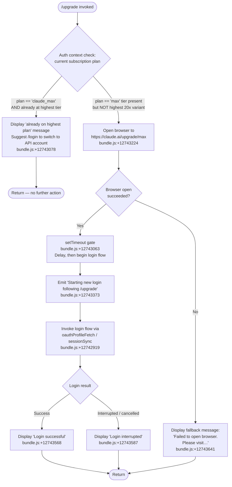

# `/upgrade`

> Analysis basis: CC v2.1.190 bundle.js (AST extraction + Claude interpretation)
> Minimum version: v2.1.190

---

## Overview

The `/upgrade` command guides the user from their current plan to the **Claude Max** subscription tier, which provides higher rate limits and greater access to Opus models. When the user is already on the highest Max plan, it immediately surfaces an informational message and halts. Otherwise, it opens the upgrade URL in a browser and, if necessary, begins a fresh login flow to bind the newly upgraded account to the running session.

---

## Registration

| Field | Value |
|---|---|
| type | `local-jsx` |
| name | `upgrade` |
| description | `Upgrade to Max for higher rate limits and more Opus` |
| loc_byte | `12743848` |
| loc_byte_end | `12744095` |
| loc_line | `8684` |
| module_id | `hRo` |
| load_inline | `true` |
| arbor_handler.name | `Xqt` |
| arbor_handler.fqn | `claude-2.1.190::Xqt` |
| arbor_handler.kind | `AsyncFunction` |
| arbor_handler.resolution_path | `module_id` |
| arbor_handler.n_hits | `0` |

Analysis basis: CC v2.1.190 bundle.js:+12743848

---

## Input Branching

Four distinct execution paths are present in the handler; a Mermaid flowchart is used.



---

## Behavioral Spec

### 1 — Entry Point: Plan-Tier Guard (`Xqt`)

The handler (`Xqt`, resolved via `module_id → hRo`) is an `AsyncFunction` that fires immediately when the command is typed.

```
async function upgradeCommandHandler(context):
    authState = getAuthenticationState(context)         // Ao → H2/Gs
    planName  = resolvePlanName(authState)              // literals: "max", "claude_max"

    if planName == "claude_max"
        and featureFlag("default_claude_max_20x") is active:   // bundle.js:+12742858
        displayMessage(ALREADY_HIGHEST_PLAN_MESSAGE)           // bundle.js:+12743078
        return

    openBrowserToUpgradeURL("https://claude.ai/upgrade/max")   // bundle.js:+12743224
    scheduleLoginFollowUp()                                     // setTimeout, bundle.js:+12743063
```

Analysis basis: CC v2.1.190 bundle.js:+12742747

---

### 2 — Already-on-Max Guard

When the current account holds a `claude_max` plan and the `default_claude_max_20x` feature flag is enabled, the command short-circuits with a fixed human-readable string (beginning "You are already on the highest Max subscription plan…") and recommends `/login` to switch to an API-billed account.

```
function alreadyOnMaxGuard(planName, featureFlags):
    if planName == "claude_max"
       and "default_claude_max_20x" in featureFlags:
        printInformationalMessage(ALREADY_HIGHEST_PLAN_TEXT)  // bundle.js:+12743078
        return HALT
    return CONTINUE
```

- Constant string starts with: `"You are already on the highest Max…"` (bundle.js:+12743078)
- Feature flag literal: `"default_claude_max_20x"` (bundle.js:+12742858)

Analysis basis: CC v2.1.190 bundle.js:+12742833

---

### 3 — Browser Launch (`Zl` / `vli`)

If the guard passes, the handler attempts to open the upgrade URL using platform-appropriate shell commands.

```
function openUpgradeURL(url):
    if platform == "darwin":           // bundle.js:+12743832 (literal "darwin" at +3116832)
        spawn("open", [url])           // literal "open" at +3116851
    else:
        spawn(xdg-open or equivalent, [url])

    if spawnFailed:
        displayError(
            "Failed to open browser. Please visit " + url + " to upgrade."
        )                              // bundle.js:+12743641
        return BROWSER_FAILED
    return BROWSER_OPENED
```

- URL constant: `"https://claude.ai/upgrade/max"` (bundle.js:+12743224)
- URL validator rejects non-`http:`/`https:` schemes (literals at bundle.js:+3116144, +3116166)

Analysis basis: CC v2.1.190 bundle.js:+12743221

---

### 4 — Post-Browser Login Flow (`hc` / `STe` / `pRe`)

After a `setTimeout` delay (bundle.js:+12743063) the handler prints the "Starting new login following /upgrade…" notice and re-enters the OAuth login pipeline.

```
async function followUpLogin(context):
    printMessage(
        "Starting new login following /upgrade. Exit with Ctrl-C to use existing account."
    )                                           // bundle.js:+12743373

    result = await oauthProfileFetch(context)  // STe, bundle.js:+12742919
    syncSession(result)                         // hc → ay + Dt pipeline

    if result.success:
        printMessage("Login successful")        // bundle.js:+12743568
    else:
        printMessage("Login interrupted")       // bundle.js:+12743587
```

The OAuth profile fetch (`STe`) performs:
1. Validates the OAuth URL via `Ls` (rejects non-approved endpoints; bundle.js:+863928)
2. Sets `Content-Type: application/json`, 10 000 ms timeout (bundle.js:+2138153, +2138196)
3. Emits telemetry events `oauth_profile_fetch` / `oauth_profile_token_failed` (bundle.js:+2138212, +2138279)
4. Passes through HTTP errors 401, 403, 429 (bundle.js:+183927, +183936, +183945)

Analysis basis: CC v2.1.190 bundle.js:+12743263, +12742919

---

### 5 — Session Synchronisation (`hc` → `ay` / `dA`)

After login the session is reconciled via the `hc` entry (bundle.js:+12743263). Key behaviours observed in the `ay → dA` sub-graph:

```
function reconcileSession(newCredentials):
    authProvider = detectAuthProvider()    // literals: "bedrock","foundry","anthropicAws",
                                           // "mantle","vertex","firstParty"
                                           // bundle.js:+2131018 … +2131235

    if authProvider requires oauth:
        if "user_oauth" context present:   // bundle.js:+3053324
            refreshOAuthToken()            // dA → WG → YFu/xFs
        validateAPIKey(env "ANTHROPIC_API_KEY")   // bundle.js:+3056725

    persistFlagSettings()                  // literal "flagSettings" at +3057799
    emitChange(profileImplicit)            // literal "profile-implicit" at +3053251
```

Analysis basis: CC v2.1.190 bundle.js:+3075803, +3054300

---

## State & Side Effects

| Item | Detail |
|---|---|
| Telemetry — `oauth_profile_fetch` | Fired on successful OAuth profile retrieval (bundle.js:+2138212) |
| Telemetry — `oauth_profile_token_failed` | Fired when OAuth token acquisition fails (bundle.js:+2138279) |
| Telemetry — `tengu_feature_ok` | Feature flag check passed (bundle.js:+1025122) |
| Telemetry — `tengu_feature_sad` | Feature flag check degraded (bundle.js:+1025270) |
| Telemetry — `tengu_feature_bad` | Feature flag check failed (bundle.js:+1025189) |
| Browser launch | Spawns `open` on macOS (bundle.js:+3116851) or platform equivalent for `https://claude.ai/upgrade/max` |
| `setTimeout` delay | Inserted between browser open and login start (bundle.js:+12743063) |
| Session / appState | `setAppState` called via `pRe` after successful login (bundle.js:+8945164) |
| API key env | Reads `ANTHROPIC_API_KEY` (bundle.js:+3056725) and `CLAUDE_CODE_API_KEY_FILE_DESCRIPTOR` (bundle.js:+2155732) during re-auth |
| OAuth token env | Reads `CLAUDE_CODE_OAUTH_TOKEN_FILE_DESCRIPTOR` (bundle.js:+2155589) |
| Console output (success) | `"Login successful"` (bundle.js:+12743568) |
| Console output (cancel) | `"Login interrupted"` (bundle.js:+12743587) |
| Console output (browser fail) | `"Failed to open browser. Please visit https://claude.ai/upgrade/max to upgrade."` (bundle.js:+12743641) |
| Console output (already max) | Message beginning `"You are already on the highest Max subscription plan…"` (bundle.js:+12743078) |

---

## Version History

| Version | Change |
|---|---|
| v2.1.190 | Initial analysis |

---

## Common Mistakes

1. **Running `/upgrade` when already on the `claude_max` plan with `default_claude_max_20x` active** — the command will immediately print the "already on highest plan" message and do nothing; use `/login` to switch to an API-billed account instead.
2. **Cancelling mid-flow** — pressing Ctrl-C after the browser opens but before completing the OAuth dance leaves the session in the pre-upgrade state; re-run `/upgrade` or `/login` to finish linking the upgraded account.
3. **No browser available (headless / SSH environments)** — the command cannot open a browser and will print the fallback URL message; visit `https://claude.ai/upgrade/max` manually, then run `/login` to bind the account.
4. **Expecting immediate model access** — the login follow-up step (`STe` / `hc` pipeline) must complete successfully for the session to reflect the new plan's rate limits; interrupting it prevents the upgrade from taking effect in the current session.
5. **Conflicting environment credentials** — if `ANTHROPIC_API_KEY` or `CLAUDE_CODE_API_KEY_FILE_DESCRIPTOR` are set in the environment they take precedence during re-auth; the newly obtained OAuth token may be shadowed until those variables are unset.

---

## Appendix — Identifier Mapping

> For bundle debugging only. Identifiers change across versions.

| Identifier | Role |
|---|---|
| `Xqt` | Main async handler for `/upgrade` command |
| `Ao` | Auth-state accessor called at entry (plan check) |
| `ay` | Session synchronisation orchestrator |
| `Ad` | Argument / config parser utility |
| `nt` | Low-level string/flag normaliser |
| `WXt` | `--bare` flag processor |
| `dA` | Auth-provider detection and credential refresh |
| `Kdn` | OAuth context reader |
| `mZe` | Token validator sub-routine |
| `WG` | OAuth token refresh dispatcher |
| `fx` | Flag-settings persistence helper |
| `H2` | Array membership / plan-name check utility |
| `Nl` | Session notification emitter |
| `Ir` | Inline token resolver |
| `rT` | Request transport layer |
| `Yg` | Auth-key validation and error surface |
| `Jkt` | Flag-settings schema validator |
| `OKe` | VS Code client-type detector (`claude-vscode` check) |
| `twt` | API key file-descriptor reader |
| `Dt` | Telemetry event dispatcher |
| `sU` | Credential slice / trim helper |
| `eRt` | Token exchange retry helper |
| `STe` | OAuth profile fetch (HTTP call, 10 000 ms timeout) |
| `Ls` | OAuth URL validator and endpoint resolver |
| `MXo` | Environment URL override reader |
| `HGc` | Approved OAuth endpoint list checker |
| `Le` | Feature flag "ok" path handler |
| `W` | Feature flag state reader |
| `Pe` | Feature flag evaluation entry |
| `aKe` | Feature flag store primitive |
| `Mt` | Feature flag "bad" path handler |
| `jH` | HTTP error code mapper |
| `T` | Logging / debug output dispatcher |
| `nLc` | Log-level router |
| `w6o` | Console write helper |
| `Me` | JSON serialiser wrapper |
| `wc` | Log-line formatter (redaction, truncation) |
| `p8o` | Log prefix builder |
| `hze` | Stderr write helper |
| `e8o` | Raw stream writer |
| `iLc` | Persistent log writer (file append) |
| `WKe` | Batched write-queue manager |
| `dpe` | Log-directory path resolver |
| `Wt` | Global config reader |
| `xre` | Log file path constructor |
| `h8o` | Log file name builder |
| `Ncr` | Log rotation handler |
| `sLc` | Log file append-and-rotate worker |
| `Ei` | Signal / hook registration helper |
| `ke` | Error logger (`YJ.logError` wrapper) |
| `fo` | Error-to-string converter |
| `Vi` | Telemetry traffic-mode checker |
| `Jns` | Telemetry mode resolver |
| `oou` | Telemetry event queue manager |
| `Zl` | Browser-open dispatcher |
| `ktd` | URL scheme validator (`http:`/`https:`) |
| `vli` | Platform-specific browser launcher |
| `A_` | Browser command builder |
| `Un` | Cross-platform spawn wrapper |
| `Wr` | Child-process executor |
| `Pt` | Process exit-code handler |
| `hc` | Post-login session reconciler entry |
| `pRe` | Full login / session-link orchestrator (JSX component) |
| `MKe` | Timestamp utility (`Date.now` wrapper) |
| `X9e` | Remote-settings + trusted-device enrolment coordinator |
| `XHa` | Remote-settings cache key builder |
| `r$t` | Remote-settings cache reader |
| `Cas` | Cache storage primitive |
| `B7` | Remote-settings HTTP fetcher |
| `Gpe` | HTTP GET helper |
| `Hoe` | HTTP response validator |
| `QPe` | ETag / 304 handler |
| `zH` | Settings schema validator |
| `Eu` | Settings notification dispatcher |
| `pA` | Settings-fetch success handler |
| `oRt` | Settings-fetch error handler |
| `APn` | Remote-settings apply and persist |
| `vas` | Settings change notifier |
| `bno` | Remote-settings load-promise gate |
| `VHa` | Remote-settings cache writer |
| `UHa` | Consent-dialog pending flag |
| `Cno` | Remote-settings main fetch/apply loop |
| `Wpe` | HTTP client factory |
| `oHa` | Settings content hasher (SHA-256) |
| `Stp` | Settings diff / apply engine |
| `Re` | Feature flag "bad" branch renderer |
| `j7e` | HTTP bearer-token injector |
| `WHa` | Settings rejection handler |
| `FHa` | Security-check dialog presenter |
| `$Ha` | Security-check acceptance recorder |
| `qHa` | Settings file atomic writer |
| `jHa` | Load-promise resolver |
| `YHa` | Remote-settings background poll scheduler |
| `LSn` | Interval-based polling timer |
| `btp` | Background poll tick handler |
| `t9n` | Deep-equality session comparator |
| `par` | Session parameter extractor |
| `Tn` | HTTP transport initialiser |
| `gsn` | HTTP client pool builder |
| `l2` | HTTP client configuration aggregator |
| `f` | Daemon / relaunch process manager |
| `D` | Subprocess supervisor |
| `VEc` | Executable path resolver |
| `sp` | Subprocess stdio handler |
| `XJf` | Subprocess IPC framer |
| `d` | Daemon process wrapper |
| `Kn` | Timed subprocess runner |
| `o` | Process list formatter |
| `c` | Subprocess error classifier |
| `s` | Promise-set tracker |
| `GXn` | Memory-pressure monitor |
| `it` | Telemetry event emitter |
| `B2e` | Pins-file reader/writer |
| `MDt` | Pins file path builder |
| `Gt` | JSON safe-parser |
| `kn` | Filesystem error classifier |
| `ECd` | Recursive directory scanner |
| `U` | Daemon idle-timeout manager |
| `N` | Idle-timer state holder |
| `M` | Timer clear-and-write helper |
| `L3o` | Daemon claim / socket connector |
| `n1o` | Daemon state file writer |
| `EJf` | Claim-send timeout handler |
| `yJf` | Claim frame builder |
| `Jd` | Error code extractor |
| `be` | Value-to-string coercer |
| `i` | Socket event multiplexer |
| `gR` | IPC binary frame serialiser |
| `P3o` | Daemon session roster manager |
| `ec` | Session path builder |
| `Di` | Session state file manager |
| `yg` | Session active-state setter |
| `cn` | Filesystem error wrapper |
| `Eve` | Session environment builder |
| `kd` | Session metadata serialiser |
| `cht` | mHl promise chain handler |
| `i8t` | Session socket path builder |
| `bye` | Session resume-file writer |
| `yR` | Late-session handler |
| `uN` | Session idle-file writer |
| `lM` | Late-cleanup handler |
| `s8t` | Session socket path helper |
| `p` | Forced-shutdown initiator |
| `jb` | Abort-reason logger |
| `u` | Graceful-stop coordinator |
| `F` | Interval-clear-on-dispose helper |
| `o9n` | Session reset / feature-flag refresh |
| `uXt` | Session state clearer |
| `VQ` | Feature-flags accessor |
| `i9a` | Pending-ops cache clearer |
| `vse` | Version-state emitter |
| `PIe` | Permission-state initialiser |
| `o9a` | OAuth state resetter |
| `Hpo` | History-pending-ops map |
| `_Sn` | Feature-flag sync driver |
| `V9` | Feature-flag store getter |
| `LEi` | Feature-flag payload applicator |
| `kEi` | Feature-flag snapshot builder |
| `K5` | Global-config merger and caches-clearer |
| `a9a` | Auth context builder |
| `RK` | Rate-key presence checker |
| `Sdt` | Settings diff composer |
| `Ukp` | Settings diff part A |
| `Nkp` | Settings diff part B |
| `Okp` | Settings diff part C |
| `Dkp` | Settings diff part D |
| `ex` | Tool-set reconciler |
| `CEt` | CA-certificate cache clearer |
| `qSn` | Queue-state normaliser |
| `Ecs` | CA-cert config cache clearer (emits "Cleared CA certificates cache") |
| `Tcs` | mTLS config cache clearer (emits "Cleared mTLS configuration cache") |
| `ECr` | Proxy-agent cache clearer (emits "Cleared proxy agent cache") |
| `mvt` | Proxy URL parser and agent builder |
| `rU` | Proxy URL normaliser |
| `Qvs` | Proxy-target resolver |
| `iz` | Proxy host/port extractor |
| `G9t` | Policy-limits fetch orchestrator |
| `bOo` | Policy-limits load-promise gate |
| `IOo` | Policy-limits cache reader |
| `Wme` | Feature-flag / plan type checker |
| `xQn` | Policy-limits timeout handler |
| `K9` | Policy-limits state accessor |
| `eCe` | Policy-limits file path builder |
| `DQn` | Policy-limits background poll manager |
| `HGl` | Policy-limits HTTP fetch and apply |
| `_Gl` | Policy-limits interval scheduler |
| `UIe` | UI event emitter ref |
| `Kse` | Feature-flag teardown / cleanup |
| `iet` | Feature-flag store clearer |
| `gBr` | Process-listener remover |
| `KMt` | Trusted-device token checker |
| `Oto` | Credential-store orchestrator |
| `oo` | Credential-store constructor |
| `cYt` | Credential-store bind helper |
| `A0e` | Credential-store telemetry hook |
| `Gl` | Secure / plaintext credential store dispatcher |
| `vWs` | Credential read/write/delete engine |
| `$Ft` | Trusted-device enrolment handler |
| `vU` | Feature-flag value reader |
| `txt` | Feature-flag text extractor |
| `nxt` | Feature-flag numeric extractor |
| `gSn` | Feature-flag gate evaluator |
| `xEi` | Feature-flag value resolver |
| `Kep` | Trusted-device HF token reader |
| `Rto` | Trusted-device Fu token reader |
| `Nrn` | Enrolment HTTP endpoint builder |
| `l9a` | Login-flow cleanup helper |
| `U9t` | Permission-mode initialiser |
| `i9n` | Permission-mode feature flag reader |
| `hBr` | Permission-mode boolean extractor |
| `e$t` | Permission handler factory |
| `iH` | Permission rule applier |
| `Or` | Session operation-mode resolver |
| `G8n` | Working-directory operation resolver |
| `os` | Operation-mode base handler |
| `W8n` | Tool-list operation resolver |
| `N2` | Operation-mode dispatcher |
| `Epo` | Session-event emitter ref |
| `F9t` | Auto-mode configuration reader |
| `$9t` | Auto-mode eligibility and config resolver |
| `zz` | Auto-mode circuit-breaker checker |
| `XPo` | Auto-mode plan checker |
| `YPo` | Auto-mode availability gate |
| `gs` | Auto-mode provider check |
| `Sme` | Extended-thinking model compatibility checker |
| `Qxe` | Auto-mode H9 state reader |
| `cZe` | Model name normaliser |
| `DX` | Auto-mode settings merger |
| `O$` | Auto-mode flag extractor |
| `Fhe` | Permission-mode change emitter |
| `EEe` | Auto-mode parameter mapper |